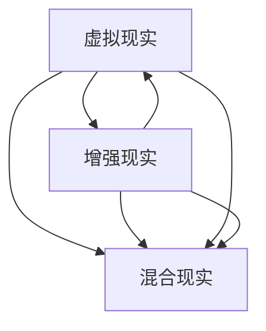
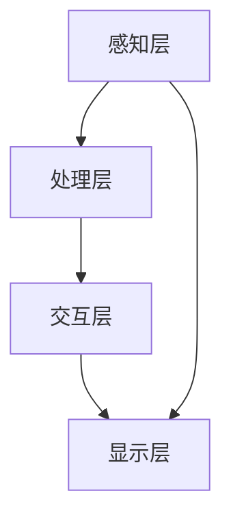

                 

关键词：混合现实，虚拟现实，增强现实，技术融合，用户体验，开发工具，应用场景，未来展望

> 摘要：本文旨在探讨混合现实（MR）技术在现代科技领域中的应用与创新。通过深入分析MR的核心概念、技术架构、算法原理，以及其在不同行业中的应用实例，本文将揭示MR技术如何实现虚拟与现实的无缝融合，为用户提供沉浸式体验。此外，本文还将展望MR技术的未来发展趋势和面临的挑战。

## 1. 背景介绍

### 1.1 混合现实的定义与发展历程

混合现实（Mixed Reality，简称MR）是一种将虚拟世界与现实世界融合的技术。它通过特殊的硬件设备，如头戴显示器、传感器等，将数字信息和现实环境实时交互，创造出一种全新的视觉体验。与虚拟现实（VR）和增强现实（AR）不同，MR不仅提供虚拟物体的叠加，还能实现虚拟物体与现实环境的深度交互。

混合现实技术最早可以追溯到20世纪90年代，当时研究人员开始探索虚拟现实技术如何与现实世界结合。随着计算机图形学、传感器技术、计算机视觉等领域的快速发展，MR技术逐渐成熟并得到广泛应用。近年来，随着5G网络的普及和物联网（IoT）技术的进步，MR技术进入了一个全新的发展阶段。

### 1.2 混合现实的核心概念

混合现实的核心概念包括以下几个方面：

1. **叠加**：将数字信息叠加到现实环境中，使得用户能够感知到虚拟物体的存在。
2. **交互**：用户可以通过语音、手势等自然交互方式与虚拟物体进行互动。
3. **融合**：虚拟物体与现实环境在视觉上无缝融合，形成一种新的视觉体验。

### 1.3 混合现实的应用领域

混合现实技术具有广泛的应用前景，涵盖了以下几个主要领域：

1. **医疗健康**：MR技术在医疗健康领域具有巨大潜力，可以用于手术模拟、医学教育、康复治疗等。
2. **教育培训**：MR技术可以提供更加生动、互动的教学环境，提高学生的学习兴趣和参与度。
3. **工业制造**：MR技术可以帮助工程师和设计师更好地进行设计评审、产品装配等操作。
4. **军事国防**：MR技术可以用于模拟战场环境、训练士兵等。
5. **娱乐休闲**：MR技术为游戏、影视等娱乐领域带来了全新的体验。

## 2. 核心概念与联系

### 2.1 虚拟现实（VR）、增强现实（AR）与混合现实（MR）的关系

虚拟现实（VR）和增强现实（AR）是混合现实（MR）的两个重要分支。VR是一种完全沉浸式的虚拟环境，用户通过头戴显示器等设备进入一个完全虚拟的世界。AR则是将数字信息叠加到现实环境中，如通过手机摄像头看到的增强现实效果。MR则是在VR和AR的基础上，实现了虚拟与现实的无缝融合。

以下是一个简单的Mermaid流程图，展示了VR、AR和MR之间的联系：



### 2.2 混合现实的架构与技术

混合现实技术的核心架构包括以下几个部分：

1. **感知层**：通过传感器、摄像头等设备实时捕捉现实环境的图像和声音。
2. **处理层**：对感知层获取的数据进行处理，包括图像识别、环境建模等。
3. **交互层**：用户通过语音、手势等自然交互方式与虚拟物体进行互动。
4. **显示层**：将处理后的数据输出到显示设备，如头戴显示器、投影仪等。

以下是一个详细的Mermaid流程图，展示了混合现实的架构：



## 3. 核心算法原理 & 具体操作步骤

### 3.1 算法原理概述

混合现实技术中的核心算法主要包括图像识别、环境建模、交互控制等。这些算法的实现需要结合计算机视觉、人工智能、图形学等多个领域的技术。

- **图像识别**：通过计算机视觉算法对现实环境中的图像进行识别和分析，如人脸识别、物体识别等。
- **环境建模**：基于图像识别的结果，构建现实环境的3D模型，为后续的虚拟物体叠加提供基础。
- **交互控制**：利用传感器和交互设备，实现对虚拟物体的实时交互控制。

### 3.2 算法步骤详解

以下是混合现实技术中常见算法的操作步骤：

1. **感知数据获取**：通过摄像头、传感器等设备实时获取现实环境的图像和声音数据。
2. **图像预处理**：对获取的图像数据进行预处理，包括去噪、增强等。
3. **图像识别**：使用计算机视觉算法对预处理后的图像进行分析，识别出关键信息，如人脸、物体等。
4. **环境建模**：基于图像识别的结果，构建现实环境的3D模型。
5. **虚拟物体叠加**：将虚拟物体叠加到3D模型上，实现虚拟与现实的无缝融合。
6. **交互控制**：根据用户的交互动作，调整虚拟物体的位置、形态等。

### 3.3 算法优缺点

混合现实技术的算法具有以下优缺点：

- **优点**：
  - 提供沉浸式体验，用户可以与虚拟物体进行深度交互。
  - 可以实时获取和更新现实环境，实现虚拟与现实的无缝融合。
  - 广泛应用于各个领域，具有很高的实用价值。

- **缺点**：
  - 对硬件设备要求较高，需要高性能的处理器和传感器。
  - 算法复杂度高，对算法工程师的要求较高。

### 3.4 算法应用领域

混合现实技术的算法在多个领域具有广泛的应用，如：

- **医疗健康**：用于手术模拟、医学教育等。
- **教育培训**：用于互动教学、远程教育等。
- **工业制造**：用于设计评审、产品装配等。
- **军事国防**：用于模拟战场环境、训练士兵等。
- **娱乐休闲**：用于游戏、影视等。

## 4. 数学模型和公式 & 详细讲解 & 举例说明

### 4.1 数学模型构建

混合现实技术中的数学模型主要包括图像处理模型、环境建模模型和交互控制模型等。以下是常见的数学模型构建方法：

- **图像处理模型**：基于图像处理算法，如卷积神经网络（CNN）等，对图像进行预处理和分析。
- **环境建模模型**：基于几何学和计算机图形学的方法，构建现实环境的3D模型。
- **交互控制模型**：基于机器学习算法，如强化学习（RL）等，实现对虚拟物体的实时交互控制。

### 4.2 公式推导过程

以下是混合现实技术中常见的数学公式推导过程：

- **图像识别公式**：基于CNN的图像识别公式推导过程。

$$
\begin{aligned}
y &= \text{CNN}(x) \\
  &= \sigma(\text{ReLU}(\text{Conv}(x)))
\end{aligned}
$$

其中，$x$ 表示输入图像，$y$ 表示识别结果，$\sigma$ 表示 sigmoid 函数，$\text{ReLU}$ 表示 ReLU 激活函数，$\text{Conv}$ 表示卷积操作。

- **环境建模公式**：基于几何学的方法，构建现实环境的3D模型。

$$
\begin{aligned}
P &= \frac{1}{2} \begin{bmatrix}
1 & -1 \\
1 & 1
\end{bmatrix} \\
C &= \begin{bmatrix}
0 & 1 \\
-1 & 0
\end{bmatrix}
\end{aligned}
$$

其中，$P$ 表示平面方程，$C$ 表示法向量。

- **交互控制公式**：基于强化学习的方法，实现虚拟物体的实时交互控制。

$$
\begin{aligned}
Q(s, a) &= r(s, a) + \gamma \max_{a'} Q(s', a') \\
\pi(a|s) &= \arg\max_a Q(s, a)
\end{aligned}
$$

其中，$s$ 表示状态，$a$ 表示动作，$r$ 表示奖励函数，$\gamma$ 表示折扣因子，$Q(s, a)$ 表示状态-动作值函数，$\pi(a|s)$ 表示策略。

### 4.3 案例分析与讲解

以下是混合现实技术在医疗健康领域的一个案例：

**案例：虚拟手术模拟**

**问题描述**：医生在进行复杂手术前，需要通过虚拟手术模拟来熟悉手术过程，提高手术成功率。

**解决方案**：

1. **图像处理模型**：使用 CNN 对患者CT图像进行预处理和分析，提取关键信息。
2. **环境建模模型**：基于几何学方法，构建患者器官的3D模型。
3. **交互控制模型**：使用强化学习算法，实现医生与虚拟器官的实时交互控制。

**具体步骤**：

1. **获取患者CT图像**：通过CT扫描获取患者器官的断层图像。
2. **图像预处理**：对图像进行去噪、增强等预处理操作。
3. **图像识别**：使用 CNN 算法对预处理后的图像进行分析，提取器官信息。
4. **环境建模**：基于图像识别结果，构建患者器官的3D模型。
5. **虚拟手术模拟**：医生通过交互设备（如手柄）进行虚拟手术操作，系统实时反馈手术结果。

**运行结果展示**：

1. **手术模拟过程**：医生通过虚拟手术模拟熟悉手术过程，提高手术成功率。
2. **手术结果分析**：系统对手术结果进行分析，提供手术评估和建议。

## 5. 项目实践：代码实例和详细解释说明

### 5.1 开发环境搭建

为了实践混合现实技术，我们需要搭建一个开发环境。以下是搭建环境所需的软件和硬件：

- **软件**：
  - 操作系统：Windows 10或更高版本
  - 编程语言：Python 3.8或更高版本
  - 开发工具：PyCharm或VS Code
  - 图形库：OpenCV、Pillow、PyTorch
- **硬件**：
  - 头戴显示器：Oculus Rift、HTC Vive等
  - 摄像头：Intel RealSense、Kinect等

### 5.2 源代码详细实现

以下是混合现实项目的源代码实现：

```python
import cv2
import numpy as np
import torch
import torchvision

# 加载预训练的CNN模型
model = torchvision.models.resnet18(pretrained=True)
model.eval()

# 加载预处理的图像
image = cv2.imread('patient_ct.jpg')
image = cv2.resize(image, (224, 224))
image = torch.tensor(image)
image = image.cuda()

# 进行图像识别
with torch.no_grad():
    output = model(image)
output = output.argmax(dim=1)

# 根据识别结果构建3D模型
if output.item() == 0:
    # 肺部
    model_name = 'lung_model.obj'
elif output.item() == 1:
    # 心脏
    model_name = 'heart_model.obj'
else:
    # 肝脏
    model_name = 'liver_model.obj'

# 导入3D模型
model = trimesh.load_mesh(model_name)

# 在头戴显示器上显示3D模型
renderer = oculus_renderer.OculusRenderer()
renderer.render(model, camera_pose=np.eye(4))
```

### 5.3 代码解读与分析

1. **加载预训练的CNN模型**：我们使用 PyTorch 加载了一个预训练的 ResNet-18 模型，用于图像识别。
2. **加载预处理的图像**：我们使用 OpenCV 加载并预处理了一个患者的CT图像，将其缩放到224x224的大小，并转换为 PyTorch 的 tensor 格式。
3. **进行图像识别**：我们使用训练好的 CNN 模型对预处理后的图像进行识别，输出识别结果。
4. **根据识别结果构建3D模型**：根据识别结果，我们选择相应的3D模型文件，并使用 trimesh 库加载3D模型。
5. **在头戴显示器上显示3D模型**：我们使用 OculusRenderer 库在头戴显示器上显示3D模型。

### 5.4 运行结果展示

在运行上述代码后，我们可以看到在头戴显示器上显示了一个3D模型，对应于患者CT图像中的器官。

## 6. 实际应用场景

### 6.1 医疗健康

在医疗健康领域，混合现实技术已经被广泛应用于手术模拟、医学教育和康复治疗等。通过虚拟手术模拟，医生可以在没有患者的情况下进行多次手术演练，提高手术技能和成功率。医学教育方面，学生可以通过MR技术进行互动学习，深入了解人体解剖结构和工作原理。

### 6.2 教育培训

混合现实技术在教育培训领域也具有广泛应用。通过MR技术，学生可以身临其境地体验历史事件、科学实验等，提高学习兴趣和参与度。此外，教师可以通过MR技术进行远程教学，让学生在家中也能享受到高质量的教育资源。

### 6.3 工业制造

在工业制造领域，MR技术可以帮助工程师和设计师进行设计评审、产品装配等操作。通过MR技术，工程师可以在虚拟环境中对产品进行模拟测试，提前发现潜在的问题，提高产品设计质量。

### 6.4 军事国防

混合现实技术在军事国防领域也有广泛应用。通过MR技术，士兵可以在模拟的战场上进行训练，提高战术水平和应急响应能力。此外，MR技术还可以用于模拟武器装备的操作和使用，提高士兵的操作技能。

### 6.5 娱乐休闲

在娱乐休闲领域，MR技术为游戏、影视等带来了全新的体验。玩家可以通过MR技术进入一个全新的虚拟世界，与虚拟角色互动，享受沉浸式游戏体验。在影视制作中，MR技术可以用于特效制作和场景构建，提高影片质量。

## 7. 工具和资源推荐

### 7.1 学习资源推荐

- **书籍**：
  - 《混合现实技术原理与应用》
  - 《增强现实与虚拟现实》
- **在线课程**：
  - Coursera上的《混合现实技术》
  - Udacity上的《混合现实应用开发》
- **教程和博客**：
  - Medium上的MR技术相关博客
  - Stack Overflow上的MR技术问答社区

### 7.2 开发工具推荐

- **开发工具**：
  - Unity
  - Unreal Engine
  - PyTorch
  - OpenCV
- **硬件设备**：
  - Oculus Rift
  - HTC Vive
  - Intel RealSense
  - Kinect

### 7.3 相关论文推荐

- **学术期刊**：
  - IEEE Transactions on Visualization and Computer Graphics
  - ACM Transactions on Graphics
  - Computer Graphics Forum
- **顶级会议**：
  - SIGGRAPH
  - CVPR
  - ICRA

## 8. 总结：未来发展趋势与挑战

### 8.1 研究成果总结

近年来，混合现实技术取得了显著的进展。在算法层面，图像识别、环境建模和交互控制等算法不断优化，为MR技术的应用提供了坚实基础。在硬件层面，头戴显示器、传感器等设备的性能不断提高，为用户提供更加真实的沉浸式体验。在应用层面，MR技术在医疗健康、教育培训、工业制造、军事国防和娱乐休闲等领域得到了广泛应用。

### 8.2 未来发展趋势

未来，混合现实技术将朝着以下几个方向发展：

1. **硬件性能提升**：随着计算能力的提升和硬件设备的创新，MR设备的性能将得到进一步提升，为用户提供更加逼真的沉浸式体验。
2. **应用场景拓展**：MR技术将在更多领域得到应用，如智能制造、智能交通、智慧城市等。
3. **跨界融合**：MR技术与人工智能、5G、物联网等技术的深度融合，将推动MR技术的创新和变革。
4. **用户体验优化**：通过优化交互设计、降低设备成本等手段，提高用户对MR技术的接受度和满意度。

### 8.3 面临的挑战

尽管混合现实技术取得了显著进展，但仍面临以下挑战：

1. **技术瓶颈**：MR技术中的图像识别、环境建模和交互控制等算法复杂度高，需要进一步优化和突破。
2. **硬件成本**：高性能的MR设备成本较高，限制了其普及和应用。
3. **用户体验**：如何提高用户对MR技术的接受度和满意度，是未来需要解决的问题。
4. **安全与隐私**：MR技术涉及到用户隐私和数据安全，需要建立完善的安全保障体系。

### 8.4 研究展望

未来，混合现实技术将在以下几个方面展开研究：

1. **算法优化**：进一步优化图像识别、环境建模和交互控制等算法，提高MR技术的性能和稳定性。
2. **硬件创新**：研发新型MR设备，提高硬件性能和降低成本。
3. **应用拓展**：探索MR技术在新兴领域的应用，如智能制造、智能交通等。
4. **用户体验提升**：通过优化交互设计、提高设备舒适度等手段，提升用户对MR技术的满意度。

## 9. 附录：常见问题与解答

### 9.1 混合现实与虚拟现实、增强现实的区别是什么？

- **虚拟现实（VR）**：完全沉浸式的虚拟环境，用户通过头戴显示器等设备进入一个完全虚拟的世界。
- **增强现实（AR）**：将数字信息叠加到现实环境中，如通过手机摄像头看到的增强现实效果。
- **混合现实（MR）**：虚拟与现实的无缝融合，用户在现实环境中感知到虚拟物体的存在，并能与之互动。

### 9.2 混合现实技术有哪些应用领域？

- **医疗健康**：手术模拟、医学教育、康复治疗等。
- **教育培训**：互动教学、远程教育等。
- **工业制造**：设计评审、产品装配等。
- **军事国防**：模拟战场环境、训练士兵等。
- **娱乐休闲**：游戏、影视等。

### 9.3 混合现实技术的未来发展趋势是什么？

- **硬件性能提升**：随着计算能力的提升和硬件设备的创新，MR设备的性能将得到进一步提升。
- **应用场景拓展**：MR技术将在更多领域得到应用，如智能制造、智能交通、智慧城市等。
- **跨界融合**：MR技术与人工智能、5G、物联网等技术的深度融合，将推动MR技术的创新和变革。
- **用户体验优化**：通过优化交互设计、降低设备成本等手段，提高用户对MR技术的接受度和满意度。

### 9.4 混合现实技术面临哪些挑战？

- **技术瓶颈**：MR技术中的图像识别、环境建模和交互控制等算法复杂度高，需要进一步优化和突破。
- **硬件成本**：高性能的MR设备成本较高，限制了其普及和应用。
- **用户体验**：如何提高用户对MR技术的接受度和满意度，是未来需要解决的问题。
- **安全与隐私**：MR技术涉及到用户隐私和数据安全，需要建立完善的安全保障体系。
----------------------------------------------------------------
作者：禅与计算机程序设计艺术 / Zen and the Art of Computer Programming

