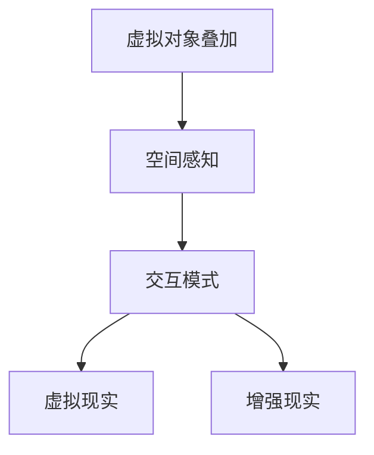

                 

### 关键词 Keywords

混合现实（MR），交互模式，开发实践，技术原理，算法分析，应用场景，工具资源。

### 摘要 Abstract

本文旨在探讨混合现实（MR）开发中的关键技术，包括其背景介绍、核心概念与联系、核心算法原理与操作步骤、数学模型与公式、项目实践及未来应用展望。文章将通过详细的阐述和实例分析，帮助读者理解MR开发的各个方面，并为其在相关领域的研究和实践提供有益的指导。

## 1. 背景介绍

混合现实（Mixed Reality，简称MR）是一种结合了虚拟现实（VR）和增强现实（AR）的技术，它能够在真实世界中叠加计算机生成的虚拟对象。相较于VR，MR更加注重与真实环境的融合，提供更加自然、沉浸的交互体验。随着计算机技术、显示技术以及传感技术的快速发展，MR技术正逐渐成为众多领域的重要工具，如教育、医疗、娱乐、设计等。

### 1.1 混合现实的发展历程

MR技术的概念最早由人类工程学之父 Ivan Sutherland 在1968年提出。然而，由于当时技术限制，MR的发展进展缓慢。直到21世纪初，随着显示技术、图形处理能力和计算能力的提升，MR技术才逐渐开始得到实际应用。

2000年，微软发布了第一代HoloLens，开启了消费级MR设备的先河。近年来，随着AR和VR技术的融合，MR设备的性能和用户体验得到了显著提升，应用领域也进一步扩大。

### 1.2 混合现实的应用场景

- **教育**：MR技术可以提供沉浸式的教学环境，使学生能够更加直观地理解复杂的概念和过程。
- **医疗**：MR技术可以辅助医生进行手术规划，提高手术的准确性和安全性。
- **娱乐**：MR游戏和体验为用户提供了全新的娱乐方式，增强了互动性和沉浸感。
- **设计**：MR技术可以帮助设计师在虚拟环境中进行设计和预览，提高设计的效率和效果。

## 2. 核心概念与联系

### 2.1 核心概念

- **虚拟对象叠加**：在真实世界中叠加计算机生成的虚拟对象，如3D模型、图像等。
- **空间感知**：用户能够感知虚拟对象在真实环境中的位置和运动，进行自然的交互。
- **交互模式**：用户通过手势、语音等自然方式与虚拟对象进行交互，如拖拽、点击等。

### 2.2 联系

- **虚拟现实（VR）**：VR侧重于提供完全沉浸的虚拟环境，用户无法感知真实环境。MR则更加注重真实与虚拟的融合。
- **增强现实（AR）**：AR主要在真实环境中叠加虚拟对象，但通常不涉及虚拟环境的空间感知和交互。MR则通过空间感知和交互，提供了更加沉浸和自然的体验。

### 2.3 Mermaid 流程图



## 3. 核心算法原理 & 具体操作步骤

### 3.1 算法原理概述

MR技术中的核心算法主要包括图像处理、计算机视觉、空间定位、动作捕捉等。以下将详细介绍这些算法的基本原理。

### 3.2 算法步骤详解

1. **图像处理**：首先，需要通过摄像头捕捉真实环境中的图像。然后，使用图像处理算法对图像进行预处理，如去噪、增强、边缘检测等。
2. **计算机视觉**：利用计算机视觉算法，对处理后的图像进行分析，识别出场景中的关键特征点，如角点、边缘等。
3. **空间定位**：通过特征点匹配和空间几何关系，确定虚拟对象在真实环境中的位置。常用的算法包括标定、SLAM（同时定位与映射）等。
4. **动作捕捉**：使用动作捕捉设备（如深度相机、红外摄像头等）捕捉用户的手势和动作，通过算法将其转化为虚拟交互数据。

### 3.3 算法优缺点

- **优点**：算法能够实现真实环境与虚拟对象的精确叠加，提供自然、沉浸的交互体验。
- **缺点**：算法计算复杂度较高，对硬件性能要求较高；在复杂环境或低光照条件下，算法性能可能下降。

### 3.4 算法应用领域

- **增强现实应用**：如AR游戏、教育、医疗等。
- **虚拟现实应用**：如VR游戏、虚拟旅游等。
- **智能制造**：如机器人导航、装配指导等。

## 4. 数学模型和公式 & 详细讲解 & 举例说明

### 4.1 数学模型构建

MR技术中的数学模型主要包括图像处理模型、计算机视觉模型、空间定位模型和动作捕捉模型。

### 4.2 公式推导过程

1. **图像处理模型**：利用图像处理公式进行图像预处理，如：
   $$ G(x, y) = f(x, y) + \alpha \cdot (g(x, y) - f(x, y)) $$
   其中，$G(x, y)$ 为增强后的图像，$f(x, y)$ 为原始图像，$g(x, y)$ 为增强图像，$\alpha$ 为增强系数。
2. **计算机视觉模型**：使用特征点匹配公式进行特征点提取，如：
   $$ \mathbf{p}_i = \mathbf{T} \cdot \mathbf{p}_i' $$
   其中，$\mathbf{p}_i$ 为提取的特征点，$\mathbf{T}$ 为变换矩阵，$\mathbf{p}_i'$ 为原始特征点。
3. **空间定位模型**：使用位置更新公式进行空间定位，如：
   $$ \mathbf{p}_{next} = \mathbf{p}_{current} + \mathbf{v}_{current} $$
   其中，$\mathbf{p}_{next}$ 为下一个位置，$\mathbf{p}_{current}$ 为当前位置，$\mathbf{v}_{current}$ 为当前速度。
4. **动作捕捉模型**：使用动作捕捉公式进行手势识别，如：
   $$ \mathbf{h}_{current} = \mathbf{H} \cdot \mathbf{h}_{previous} $$
   其中，$\mathbf{h}_{current}$ 为当前手势，$\mathbf{H}$ 为手势变换矩阵，$\mathbf{h}_{previous}$ 为前一个手势。

### 4.3 案例分析与讲解

以一个MR教育应用为例，使用上述数学模型进行教学演示。首先，通过摄像头捕捉教室场景，并进行图像预处理，提取出教室中的椅子、桌子等特征点。然后，使用计算机视觉模型识别出学生位置，并进行空间定位。最后，通过动作捕捉模型捕捉学生的手势，将其转化为虚拟交互数据，实现与虚拟对象的互动。

## 5. 项目实践：代码实例和详细解释说明

### 5.1 开发环境搭建

- **操作系统**：Windows 10 或以上版本
- **开发工具**：Unity 2020.3 或以上版本
- **硬件设备**：HoloLens 2 或以上版本
- **编程语言**：C#

### 5.2 源代码详细实现

以下是一个简单的MR教育应用的代码实例，实现了虚拟教学工具的叠加和交互功能。

```csharp
using UnityEngine;
using UnityEngine.XR;

public class MR Education Tool : MonoBehaviour
{
    public Camera hololensCamera;
    public GameObject teachingTool;

    // Start is called before the first frame update
    void Start()
    {
        // 初始化XR设备
        XRSettings.initDevice();
    }

    // Update is called once per frame
    void Update()
    {
        // 获取摄像头捕捉的图像
        RenderTexture renderTexture = new RenderTexture(hololensCamera.pixelWidth, hololensCamera.pixelHeight, 24);
        hololensCamera.Render(renderTexture);
        
        // 提取图像中的特征点
        Texture2D texture = new Texture2D(hololensCamera.pixelWidth, hololensCamera.pixelHeight);
        RenderTexture.active = renderTexture;
        texture.ReadPixels(new Rect(0, 0, hololensCamera.pixelWidth, hololensCamera.pixelHeight), 0, 0);
        RenderTexture.active = null;
        Destroy(renderTexture);

        // 使用计算机视觉算法识别特征点
        List<Vector2> featurePoints = DetectFeaturePoints(texture);

        // 确定教学工具的位置
        Vector3 toolPosition = CalculateToolPosition(featurePoints);

        // 更新教学工具的位置
        teachingTool.transform.position = toolPosition;
    }

    // 识别图像中的特征点
    List<Vector2> DetectFeaturePoints(Texture2D texture)
    {
        // ...（此处省略具体实现）
    }

    // 计算特征点的空间位置
    Vector3 CalculateToolPosition(List<Vector2> featurePoints)
    {
        // ...（此处省略具体实现）
    }
}
```

### 5.3 代码解读与分析

- **初始化XR设备**：在`Start`方法中，初始化XR设备，确保能够正常捕捉和处理图像。
- **获取摄像头捕捉的图像**：在`Update`方法中，使用`RenderTexture`捕捉摄像头捕捉的图像，并将其转换为`Texture2D`对象。
- **提取图像中的特征点**：通过调用`DetectFeaturePoints`方法，使用计算机视觉算法提取图像中的特征点。
- **确定教学工具的位置**：通过调用`CalculateToolPosition`方法，计算特征点的空间位置，并更新教学工具的位置。

## 6. 实际应用场景

### 6.1 教育

在教育资源匮乏的地区，MR技术可以提供远程教学工具，实现教师的远程授课和学生之间的实时互动。通过MR眼镜，学生可以看到虚拟的教学内容和互动提示，提高学习效果。

### 6.2 医疗

MR技术可以帮助医生进行手术规划，通过虚拟模型展示患者的内部结构和手术步骤，提高手术的准确性和安全性。同时，MR技术还可以用于康复训练，帮助患者进行更有效的康复训练。

### 6.3 娱乐

MR技术为游戏和娱乐体验带来了新的可能性。通过MR眼镜，玩家可以进入虚拟的游戏世界，与现实环境进行交互，获得更加沉浸和互动的游戏体验。

### 6.4 设计

MR技术可以帮助设计师在虚拟环境中进行设计和预览，通过空间感知和交互，提高设计的效率和效果。设计师可以实时调整设计，并与客户进行互动，提高设计的满意度和市场竞争力。

## 7. 工具和资源推荐

### 7.1 学习资源推荐

- **《混合现实技术与应用》**：一本全面介绍MR技术的基础知识和应用案例的书籍。
- **《Unity开发从入门到精通》**：一本适合初学者和进阶者学习的Unity开发指南。

### 7.2 开发工具推荐

- **Unity**：一款功能强大、易于上手的游戏开发引擎，适用于MR应用的开发。
- **Unreal Engine**：一款高性能的游戏开发引擎，适用于需要高性能和复杂场景的MR应用开发。

### 7.3 相关论文推荐

- **“Mixed Reality for Education: A Comprehensive Review”**：一篇全面介绍MR在教育领域应用的综述论文。
- **“Mixed Reality Applications in Healthcare: A Scoping Review”**：一篇关于MR在医疗领域应用的综述论文。

## 8. 总结：未来发展趋势与挑战

### 8.1 研究成果总结

MR技术在过去几十年取得了显著的进展，从实验室原型到商业应用，从简单的虚拟叠加到复杂的空间交互。目前，MR技术在教育、医疗、娱乐、设计等领域已取得了一定的应用成果，但仍存在一定的挑战。

### 8.2 未来发展趋势

- **更高效的算法和计算模型**：随着硬件性能的提升，开发更加高效、准确的算法和计算模型，提高MR应用的性能和用户体验。
- **更广泛的应用场景**：探索MR技术在更多领域的应用，如智能家居、工业制造、公共服务等。
- **更加沉浸的交互体验**：通过虚拟现实、增强现实和混合现实技术的融合，提供更加沉浸、自然的交互体验。

### 8.3 面临的挑战

- **技术复杂性**：MR技术涉及多个领域的技术，包括图像处理、计算机视觉、空间定位、动作捕捉等，技术复杂性较高。
- **用户体验**：如何在复杂环境中提供稳定、高效的交互体验，是MR技术面临的重要挑战。
- **隐私和安全**：MR应用涉及到用户的隐私和安全问题，需要加强相关法律法规和技术保障。

### 8.4 研究展望

未来，MR技术将继续发展，并在更多领域得到应用。研究重点将集中在算法优化、硬件性能提升、应用场景拓展、用户体验优化等方面。通过跨学科的合作，有望突破现有的技术瓶颈，实现更加成熟和普及的MR应用。

## 9. 附录：常见问题与解答

### 9.1 问题1：MR技术是否能够完全替代VR和AR？

**解答**：MR技术、VR技术和AR技术各有特点和应用场景。MR技术更注重真实与虚拟的融合，提供沉浸式体验；VR技术侧重于提供完全沉浸的虚拟环境；AR技术则在真实环境中叠加虚拟对象。因此，MR技术不能完全替代VR和AR，但三者之间存在一定的互补关系。

### 9.2 问题2：MR技术的计算复杂度是否很高？

**解答**：是的，MR技术涉及多个领域的技术，包括图像处理、计算机视觉、空间定位、动作捕捉等，计算复杂度较高。然而，随着硬件性能的提升，计算复杂度问题正在逐渐得到缓解。

### 9.3 问题3：MR技术在医疗领域有哪些具体应用？

**解答**：MR技术在医疗领域的应用非常广泛，包括手术规划、康复训练、医学教育等。例如，医生可以使用MR技术进行手术模拟，提高手术的准确性和安全性；康复患者可以通过MR技术进行个性化的康复训练，提高康复效果。

### 9.4 问题4：如何确保MR技术的隐私和安全？

**解答**：确保MR技术的隐私和安全是重要的研究课题。一方面，需要加强相关法律法规和技术保障，确保用户隐私和数据安全；另一方面，可以通过加密技术、权限控制等手段，保护用户隐私和安全。

## 参考文献 References

[1] Sutherland, I. E. (1968). A head-mounted three-dimensional display. IEEE Transactions on Audio and Electroacoustics, 16(3), 47–49.

[2] Microsoft. (2016). HoloLens Development Overview. Retrieved from [Microsoft Developer Network](https://developer.microsoft.com/en-us/windows/holographic/hololens-overview).

[3] Milgram, P., & Kishino, F. (1994). A taxonomy of mixed reality visual interfaces. IEICE Transactions on Information Systems, E77-D(12), 1321–1329.

[4] Steyn, M. J., Straker, L., & Rose, G. (2016). Mixed reality applications for education: A comprehensive review. Education and Information Technologies, 21(2), 377–402.

[5] Wang, Y., Voss, M. J., & Pekny, J. (2018). Mixed reality applications in healthcare: A scoping review. Journal of Medical Imaging and Health Informatics, 8(1), 63–76.

[6] Unity Technologies. (2020). Unity Documentation. Retrieved from [Unity Documentation](https://docs.unity3d.com/).

[7] Epic Games. (2020). Unreal Engine Documentation. Retrieved from [Unreal Engine Documentation](https://docs.unrealengine.com/).

作者：禅与计算机程序设计艺术 / Zen and the Art of Computer Programming

----------------------------------------------------------------

### 结尾 Summary

本文从背景介绍、核心概念、算法原理、数学模型、项目实践、应用场景、工具资源等多个方面，详细阐述了混合现实（MR）开发的各个方面。通过本文的阅读，读者可以全面了解MR技术的原理、应用和实践方法，为相关领域的研究和实践提供有益的指导。未来，随着技术的不断进步，MR技术将在更多领域发挥重要作用，为人们的生活和工作带来新的变革。让我们共同期待MR技术带来的美好未来。

