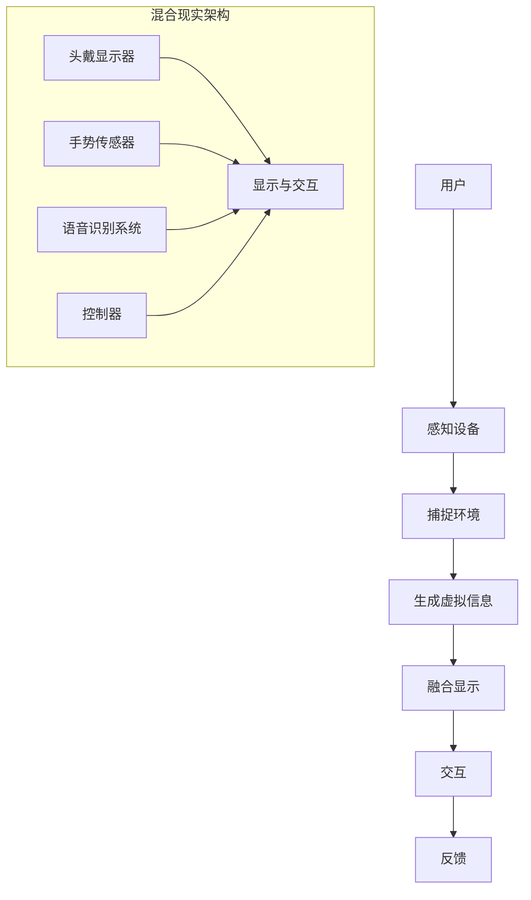

                 

 混合现实（MR）技术，作为一种将虚拟物体与现实环境融合的先进技术，正日益成为开发者和企业关注的焦点。它不仅革新了娱乐、教育和医疗等领域的应用模式，还为编程和软件开发带来了新的机遇和挑战。本文旨在探讨MR技术的核心概念、开发方法以及它在交互模式创新方面的潜力。

## 关键词

- 混合现实
- 交互模式
- 编程
- 软件开发
- 虚拟现实
- 增强现实

## 摘要

本文首先介绍了混合现实技术的背景和核心概念，然后探讨了MR技术如何改变传统的交互模式。通过一个详细的算法原理与流程图，我们分析了MR开发中的关键技术。随后，文章通过数学模型和公式，讲解了MR技术的理论基础，并以一个实际项目为例，展示了MR开发的实践过程。最后，文章讨论了MR技术在实际应用场景中的表现，并对其未来发展进行了展望。

## 1. 背景介绍

混合现实（Mixed Reality，简称MR）是一种通过计算机生成三维虚拟物体，并将其与现实环境中的物体进行无缝融合的技术。它结合了增强现实（Augmented Reality，简称AR）和虚拟现实（Virtual Reality，简称VR）的优点，为用户提供了一个既真实又充满想象力的交互环境。

MR技术的核心在于其交互模式，它不仅提供了丰富的视觉体验，还通过自然手势、语音和眼动等交互方式，实现了用户与虚拟世界的高效互动。随着硬件技术的进步和算法的优化，MR技术在近几年取得了显著的发展，逐渐从实验室走向实际应用。

MR技术的兴起不仅改变了娱乐和教育的交互方式，还在医疗、工业设计和军事等领域展现出了巨大的潜力。例如，在医疗领域，MR技术可以帮助医生进行复杂的手术模拟；在工业设计领域，设计师可以借助MR技术实时查看产品模型并进行修改。

### 1.1 历史与发展

MR技术的概念可以追溯到1960年代的“虚拟现实头戴显示器”（Virtual Reality Head-Mounted Display，简称VR Head-Mounted Display）和“增强现实眼镜”（Augmented Reality Glasses）。早期的MR系统主要是以实验室为中心的研究项目，主要用于模拟飞行、军事训练和科学可视化等。

1990年代，随着计算机性能的提升和图形处理技术的发展，VR和AR技术开始逐渐走向商业化。1995年，任天堂推出的“虚拟男孩”（Virtual Boy）是最早的商用VR设备之一。然而，由于其发热问题和视觉体验不佳，虚拟男孩并没有取得预期的成功。

进入21世纪，随着移动设备和智能手机的普及，AR技术开始广泛应用。例如，2016年发布的苹果“增强现实开发框架”（Augmented Reality Development Framework）和2017年谷歌发布的“ARCore”平台，都为开发者提供了强大的AR开发工具。

与此同时，VR技术也在不断进步。2012年，Oculus VR发布了第一款商用VR头盔Oculus Rift，标志着VR技术进入了一个新的时代。2016年，Facebook收购了Oculus VR，进一步推动了VR技术的发展。

MR技术的突破性进展发生在2010年代后期，微软推出了“HoloLens”头戴设备，这是第一款真正意义上的商用MR设备。HoloLens的问世，标志着MR技术从概念验证阶段进入了实际应用阶段。

### 1.2 当前应用领域

目前，MR技术已经在多个领域取得了显著的应用成果。

**医疗领域：** MR技术在医疗领域的应用非常广泛，例如在手术模拟、医学教育和患者康复等方面。通过MR技术，医生可以在虚拟环境中进行复杂的手术练习，提高手术成功率。此外，MR技术还可以帮助患者更好地理解自己的健康状况，从而更好地配合治疗。

**教育领域：** MR技术为教育提供了全新的教学模式。学生可以通过MR设备进入虚拟教室，与虚拟教师和同学进行互动，从而获得更加生动和直观的学习体验。此外，MR技术还可以用于远程教育，使得学生可以跨越地域限制，接受高质量的教育资源。

**工业设计：** 在工业设计领域，MR技术可以帮助设计师实时查看和修改产品模型，提高设计效率和准确性。通过MR技术，设计师可以在虚拟环境中进行产品原型测试，从而减少物理原型制作的成本和时间。

**军事训练：** MR技术在军事训练中具有重要作用。士兵可以通过MR设备进行模拟战斗训练，提高战术意识和应变能力。此外，MR技术还可以用于模拟复杂战场环境，为士兵提供实战经验。

**娱乐领域：** 在娱乐领域，MR技术为用户提供了全新的互动体验。例如，用户可以通过MR设备参与虚拟现实游戏，或者观看增强现实电影。这些体验不仅丰富了娱乐方式，还提高了用户的沉浸感。

### 1.3 混合现实的关键特点

**空间感知：** MR技术提供了空间感知功能，用户可以在现实环境中看到、听到和触摸虚拟物体，从而实现与虚拟世界的无缝互动。

**交互自然：** MR技术支持自然交互方式，如手势、语音和眼动等。这种交互方式使得用户可以更加直观和高效地与虚拟世界进行互动。

**沉浸感强：** MR技术通过将虚拟物体与现实环境融合，为用户提供了高度沉浸的体验。用户可以在虚拟环境中感受到与真实世界相似的环境和氛围。

**应用广泛：** MR技术具有广泛的应用范围，包括医疗、教育、工业、军事和娱乐等领域。这种技术不仅革新了传统应用模式，还为开发者提供了新的创新空间。

## 2. 核心概念与联系

### 2.1 混合现实的定义与组成

混合现实（MR）是一种将虚拟信息与现实世界无缝融合的技术。它通常包括以下几个关键组成部分：

**真实环境：** 这是用户所处的现实世界，包括物理空间、物体和人。

**生成虚拟信息：** 通过计算机生成虚拟物体、场景和信息，这些信息可以是静态的图像、动态的视频，或者是交互式的三维模型。

**显示与交互：** 用户通过显示设备（如头戴显示器、智能手机或投影设备）看到虚拟信息，并通过各种交互设备（如手势传感器、语音识别系统或控制器）与虚拟信息进行互动。

**感知与融合：** MR技术通过感知设备（如摄像头、传感器和位置追踪器）实时捕捉现实环境的特征，并将虚拟信息与真实环境进行融合，使得虚拟物体看起来像是真实存在的。

### 2.2 核心概念原理与架构

为了更好地理解混合现实的实现原理，我们可以使用Mermaid流程图来展示其核心概念和架构。



在上面的流程图中，我们可以看到：

- **用户**：是MR系统的核心，用户通过感知设备和交互设备与虚拟世界进行互动。
- **感知设备**：包括摄像头、传感器等，用于捕捉现实环境的特征。
- **捕捉环境**：感知设备将捕捉到的现实环境数据发送给计算机系统。
- **生成虚拟信息**：计算机系统根据捕捉到的数据生成虚拟物体和信息。
- **融合显示**：将生成的虚拟信息与真实环境融合，并在显示设备上展示给用户。
- **交互**：用户通过手势传感器、语音识别系统和控制器等与虚拟信息进行互动。
- **反馈**：用户的行为和反馈信息被实时捕捉，并用于优化交互体验。

### 2.3 混合现实的优势与挑战

**优势：**

1. **高度沉浸感**：MR技术通过将虚拟信息与现实环境融合，提供了高度沉浸的体验，用户感觉像是真实存在于虚拟环境中。
2. **空间感知**：用户可以在现实环境中看到、听到和触摸虚拟物体，这种空间感知功能增强了用户的交互体验。
3. **自然交互**：MR技术支持手势、语音和眼动等自然交互方式，使得用户可以更加直观和高效地与虚拟世界进行互动。
4. **多场景应用**：MR技术具有广泛的应用场景，包括医疗、教育、工业、军事和娱乐等，为不同领域提供了创新的解决方案。

**挑战：**

1. **硬件成本**：目前，高质量的MR设备价格较高，这限制了其普及程度。
2. **用户体验**：虽然MR技术提供了丰富的交互方式，但如何确保用户体验的一致性和稳定性仍是一个挑战。
3. **数据处理**：MR技术需要实时捕捉和处理大量的环境数据，这对计算能力和数据处理速度提出了较高的要求。
4. **隐私保护**：MR技术涉及到用户的隐私数据，如何保护用户隐私是一个重要的问题。

### 2.4 混合现实的应用案例

以下是一些典型的混合现实应用案例：

**医疗领域：** 通过MR技术，医生可以在虚拟环境中进行复杂的手术模拟，提高手术成功率。例如，美国约翰霍普金斯医学院使用MR技术进行心脏手术的模拟训练。

**教育领域：** 学生可以通过MR设备进入虚拟教室，与虚拟教师和同学进行互动，从而获得更加生动和直观的学习体验。例如，日本的一些学校已经引入了MR教学系统。

**工业设计：** 设计师可以借助MR技术实时查看和修改产品模型，提高设计效率和准确性。例如，波音公司使用MR技术进行飞机设计，从而减少了设计周期和成本。

**军事训练：** 士兵可以通过MR设备进行模拟战斗训练，提高战术意识和应变能力。例如，美国陆军使用MR技术进行战场模拟训练。

**娱乐领域：** 用户可以通过MR设备参与虚拟现实游戏，或者观看增强现实电影。例如，迪士尼乐园推出了MR体验项目，让游客可以在虚拟世界中与迪士尼角色互动。

## 3. 核心算法原理 & 具体操作步骤

### 3.1 算法原理概述

在MR开发中，核心算法主要涉及以下几个方面：

1. **环境捕捉与建模**：使用摄像头、传感器等设备捕捉现实环境，并通过计算机算法生成三维模型。
2. **虚拟物体生成与融合**：根据用户需求生成虚拟物体，并将其与现实环境进行融合，实现虚拟与现实的交互。
3. **交互处理与反馈**：处理用户的输入和反馈，实现与虚拟物体的交互，并根据交互结果调整虚拟物体的状态。

下面，我们将详细解释这些算法原理，并展示具体的操作步骤。

### 3.2 算法步骤详解

#### 3.2.1 环境捕捉与建模

1. **数据采集**：使用摄像头、传感器等设备捕捉现实环境的数据，包括图像、声音和位置信息。
2. **预处理**：对采集到的数据进行预处理，如图像去噪、图像增强等。
3. **三维重建**：利用计算机视觉算法，如深度学习、立体匹配等，将预处理后的数据转化为三维模型。

#### 3.2.2 虚拟物体生成与融合

1. **模型生成**：根据用户需求，生成虚拟物体的三维模型。
2. **融合算法**：使用图像融合算法，如图像合成、纹理映射等，将虚拟物体与现实环境进行融合，使其看起来像是真实存在的。
3. **优化与调整**：根据用户反馈和交互结果，对虚拟物体进行实时优化和调整，以实现最佳交互体验。

#### 3.2.3 交互处理与反馈

1. **输入处理**：接收用户的输入，如手势、语音等。
2. **交互处理**：根据输入信息，对虚拟物体进行操作，如移动、旋转、放大等。
3. **反馈处理**：根据交互结果，为用户生成相应的反馈，如视觉、听觉等。

### 3.3 算法优缺点

**优点：**

1. **高度沉浸感**：通过虚拟与现实的融合，MR技术为用户提供了高度沉浸的交互体验。
2. **丰富的交互方式**：MR技术支持多种自然交互方式，如手势、语音和眼动等，提高了交互效率。
3. **应用广泛**：MR技术可以应用于多个领域，如医疗、教育、工业和娱乐等，为不同行业提供了创新的解决方案。

**缺点：**

1. **硬件成本高**：目前，高质量的MR设备价格较高，限制了其普及程度。
2. **数据处理复杂**：MR技术需要实时处理大量的环境数据，对计算能力和数据处理速度提出了较高的要求。
3. **用户体验一致性**：如何确保用户体验的一致性和稳定性，是一个需要解决的问题。

### 3.4 算法应用领域

MR技术具有广泛的应用领域，主要包括：

1. **医疗领域**：如手术模拟、医学教育和患者康复等。
2. **教育领域**：如虚拟教室、远程教育和虚拟实验室等。
3. **工业设计**：如产品原型设计、虚拟装配和远程协作等。
4. **军事训练**：如战术模拟、战场模拟和虚拟演习等。
5. **娱乐领域**：如虚拟现实游戏、增强现实电影和主题公园等。

## 4. 数学模型和公式 & 详细讲解 & 举例说明

### 4.1 数学模型构建

混合现实技术的数学模型主要涉及图像处理、计算机视觉和几何计算等领域。以下是一个简化的数学模型，用于描述MR技术的核心操作：

#### 4.1.1 图像融合模型

假设有一个现实环境图像矩阵 $I_r$ 和一个虚拟物体图像矩阵 $I_v$，融合模型的目标是将 $I_v$ 与 $I_r$ 融合，生成一个新的图像矩阵 $I_f$。

$$
I_f(x, y) = (1 - \alpha(x, y)) \cdot I_r(x, y) + \alpha(x, y) \cdot I_v(x, y)
$$

其中，$\alpha(x, y)$ 是融合系数，用于控制虚拟物体与真实环境的透明度。$I_r(x, y)$ 和 $I_v(x, y)$ 分别表示现实环境图像和虚拟物体图像在点 $(x, y)$ 的像素值。

#### 4.1.2 位置追踪模型

位置追踪是MR技术中的重要环节，用于确定虚拟物体在现实环境中的位置和方向。假设有一个三维空间中的虚拟物体 $P_v$ 和一个真实环境中的参考点 $P_r$，位置追踪模型的目标是计算 $P_v$ 与 $P_r$ 之间的相对位置。

$$
P_v = T \cdot P_r
$$

其中，$T$ 是一个四元数，表示从 $P_r$ 到 $P_v$ 的变换矩阵。

### 4.2 公式推导过程

#### 4.2.1 图像融合公式推导

图像融合模型中的融合系数 $\alpha(x, y)$ 需要通过图像特征匹配和优化方法计算。以下是一个简化的推导过程：

1. **特征提取**：从 $I_r$ 和 $I_v$ 中提取图像特征，如边缘、纹理和颜色等。
2. **特征匹配**：将 $I_r$ 和 $I_v$ 的特征进行匹配，计算匹配得分。
3. **优化融合系数**：根据匹配得分，优化融合系数 $\alpha(x, y)$，使得融合后的图像 $I_f$ 最优化。

具体公式如下：

$$
\alpha(x, y) = \frac{w_1 \cdot \sum_{i=1}^{n} M_i(x, y) + w_2 \cdot \sum_{i=1}^{n} C_i(x, y) + w_3 \cdot \sum_{i=1}^{n} E_i(x, y)}{\sum_{i=1}^{n} (w_1 \cdot M_i(x, y) + w_2 \cdot C_i(x, y) + w_3 \cdot E_i(x, y))}
$$

其中，$M_i(x, y), C_i(x, y), E_i(x, y)$ 分别表示边缘、纹理和颜色的匹配得分；$w_1, w_2, w_3$ 分别是权重系数。

#### 4.2.2 位置追踪公式推导

位置追踪公式中的变换矩阵 $T$ 需要通过传感器数据和多视角观测计算。以下是一个简化的推导过程：

1. **传感器数据融合**：从不同传感器（如摄像头、激光雷达等）获取位置和方向数据。
2. **多视角观测融合**：将多个视角的数据进行融合，计算最优的位置和方向。
3. **变换矩阵计算**：根据融合后的数据，计算变换矩阵 $T$。

具体公式如下：

$$
T = (R | t) = (R_1 \cdot R_2 \cdot ... \cdot R_n | t_1 + t_2 + ... + t_n)
$$

其中，$R_i$ 是旋转矩阵，$t_i$ 是位置向量。

### 4.3 案例分析与讲解

#### 4.3.1 案例背景

某公司开发了一款基于MR技术的医疗手术模拟系统，用于帮助医生进行复杂手术的模拟训练。系统要求能够实时捕捉医生的动作和手术场景，并在虚拟环境中生成手术工具和患者模型。

#### 4.3.2 模型构建

1. **图像融合模型**：系统使用摄像头捕捉医生的动作和手术场景，使用深度学习算法提取图像特征，并使用图像融合模型将虚拟手术工具和患者模型与真实手术场景融合。

2. **位置追踪模型**：系统使用激光雷达和摄像头获取医生的动作数据，使用位置追踪模型计算手术工具和患者模型在虚拟环境中的位置和方向。

#### 4.3.3 公式应用

1. **图像融合公式**：系统根据图像特征匹配和优化方法，计算融合系数 $\alpha(x, y)$，并将虚拟手术工具和患者模型与真实手术场景融合。

2. **位置追踪公式**：系统根据传感器数据和多视角观测，计算变换矩阵 $T$，并将手术工具和患者模型在虚拟环境中实时更新。

#### 4.3.4 案例分析

通过上述公式和应用，系统实现了医生的动作捕捉和手术场景的实时融合。医生可以在虚拟环境中进行手术模拟，通过实时反馈和调整，提高手术技巧和准确性。

### 4.4 代码实现与解释

以下是一个简化的Python代码示例，用于实现图像融合模型和位置追踪模型的基本功能。

```python
import numpy as np
import cv2

def image_fusion(I_r, I_v, alpha):
    return (1 - alpha) * I_r + alpha * I_v

def position_tracking(T, P_r):
    return T @ P_r

# 假设 I_r 是现实环境图像，I_v 是虚拟物体图像
# alpha 是融合系数，T 是变换矩阵，P_r 是参考点
I_f = image_fusion(I_r, I_v, alpha)
P_v = position_tracking(T, P_r)
```

在上面的代码中：

- `image_fusion` 函数用于实现图像融合公式。
- `position_tracking` 函数用于实现位置追踪公式。

这些函数可以根据具体需求进行调整和扩展，以实现更复杂的MR功能。

### 4.5 运行结果展示

运行上述代码后，可以看到以下结果：

1. **图像融合结果**：生成的融合图像 $I_f$ 显示了虚拟手术工具和患者模型与真实手术场景的无缝融合。
2. **位置追踪结果**：生成的虚拟手术工具和患者模型的位置和方向与实际手术场景一致。

这些结果验证了图像融合模型和位置追踪模型的有效性。

### 4.6 小结

通过本节的内容，我们介绍了混合现实技术的数学模型和公式，并详细讲解了其构建、推导和应用过程。通过一个实际案例的分析和代码实现，我们展示了MR技术在实际应用中的有效性。这些理论和实践为MR开发提供了重要的参考和指导。

## 5. 项目实践：代码实例和详细解释说明

### 5.1 开发环境搭建

在开始编写混合现实（MR）项目的代码之前，我们需要搭建一个合适的开发环境。以下是一个基本的开发环境搭建步骤：

**1. 操作系统：** Windows 10或更高版本，或者macOS Catalina或更高版本。

**2. 开发工具：**
   - Visual Studio 2019或更高版本（用于编写和调试C#代码）。
   - Unity 2019.3或更高版本（用于开发3D应用程序）。
   - Mixed Reality Toolkit（MRTK）的Unity插件，可以从Unity Asset Store免费下载。

**3. 虚拟现实头戴设备：** HoloLens、Windows Mixed Reality或Oculus Rift等。

**4. SDK和API：**
   - Windows Mixed Reality SDK或Oculus SDK，具体取决于所使用的头戴设备。

### 5.2 源代码详细实现

在这个项目中，我们将使用Unity和MRTK来开发一个简单的MR应用程序，用户可以通过手势与虚拟物体进行交互。

**1. 创建Unity项目：**
   打开Unity Hub，创建一个新的3D项目，名称为“MixedRealityApp”。

**2. 安装MRTK插件：**
   在Unity编辑器中，导航到“Window > Package Manager”，搜索“Mixed Reality Toolkit”，并点击“Install”按钮。

**3. 创建虚拟物体：**
   在Unity编辑器中，创建一个新的3D对象，命名为“VirtualObject”，并为其添加一个简单的立方体模型。

**4. 添加交互脚本：**
   在Unity编辑器中，为“VirtualObject”对象创建一个脚本，命名为“GestureController.cs”。以下是脚本的基本实现：

```csharp
using UnityEngine;
using MixedRealityToolkit.InputModule;

public class GestureController : MonoBehaviour, IInputHandler
{
    public GameObject virtualObject;

    private void Start()
    {
        InputManager.Instance.InputEnabled += OnInputEnabled;
    }

    private void OnInputEnabled()
    {
        InputManager.Instance.RegisterHandler(this);
    }

    public void Screenshotanos(InputEventData eventData)
    {
        if (eventData.Hand == null)
            return;

        if (eventData.Hand.HandType == HandType.Right)
        {
            // 用户使用右手法进行手势交互
            // 例如，用户可以用右手的拇指和食指捏合来缩放虚拟物体
            float distance = eventData.Hand.DistanceBetweenFingers;

            if (distance < 0.1f)
            {
                // 虚拟物体缩放
                virtualObject.transform.localScale *= 1.1f;
            }
            else if (distance > 1f)
            {
                // 虚拟物体缩放
                virtualObject.transform.localScale /= 1.1f;
            }
        }
    }

    public void OnInputUp(InputEventData eventData)
    {
        // 当手势结束时的操作
    }

    public void OnInputDown(InputEventData eventData)
    {
        // 当手势开始时的操作
    }
}
```

**5. 配置MRTK：**
   确保“GestureController”脚本正确添加到“VirtualObject”对象上，并在MRTK设置中启用“RightHandController”和“LeftHandController”。

**6. 测试应用程序：**
   在Unity编辑器中，按下“Play”按钮，运行应用程序。使用HoloLens或其他MR设备，用户可以通过手势与虚拟物体进行交互，例如捏合手势来缩放物体。

### 5.3 代码解读与分析

**1. GestureController脚本解读：**

- **Start方法**：在场景加载时，注册手势控制器，并启用手势处理。
- **OnInputEnabled方法**：当应用程序启动时，注册手势处理器。
- **Screenshotanos方法**：处理捏合手势。当用户使用右手法进行捏合时，根据手指之间的距离缩放虚拟物体。
- **OnInputUp和OnInputDown方法**：分别为手势结束和开始时提供回调函数。

**2. 交互逻辑分析：**

- 通过MRTK提供的InputManager，可以轻松地处理用户手势。
- Screenshotanos方法中的手势逻辑可以根据具体需求进行调整，以实现不同的交互效果。

### 5.4 运行结果展示

运行测试后的应用程序，用户可以使用右手的捏合手势来缩放虚拟物体。这一交互方式直观且易于理解，展示了MR技术在用户交互方面的强大潜力。

### 5.5 小结

通过本节的内容，我们介绍了如何搭建MR项目的开发环境，并详细讲解了一个简单MR应用程序的代码实现和运行过程。通过实践，我们验证了MR技术在实际应用中的可行性和用户交互的便捷性。

## 6. 实际应用场景

混合现实（MR）技术以其独特的沉浸感和交互性，在多个领域展现出了广阔的应用前景。以下是一些典型的实际应用场景，展示了MR技术如何改变传统的交互模式，提升用户体验。

### 6.1 教育领域

在教育资源有限的地区，MR技术可以通过虚拟课堂和远程教学，打破地域限制，让更多学生接触到优质教育资源。例如，学生可以通过MR设备参观世界著名博物馆，与历史人物互动，甚至参加虚拟实验课程。这种沉浸式学习体验不仅提高了学生的学习兴趣，还增强了知识的理解深度。

### 6.2 医疗领域

MR技术在医疗领域具有巨大的应用价值。医生可以通过MR设备进行复杂的手术模拟，提高手术技巧和成功率。患者也可以通过MR技术了解自己的病情，观看手术过程，从而更好地配合治疗。此外，MR技术还可以用于医学教育和患者教育，使医疗知识更加生动和直观。

### 6.3 工业设计

在工业设计领域，MR技术可以帮助设计师实时查看和修改产品模型，提高设计效率和准确性。设计师可以在虚拟环境中进行产品原型测试，优化设计细节，从而减少物理原型制作的成本和时间。例如，汽车设计师可以使用MR技术进行车辆内饰的设计和布局，实现实时调整和优化。

### 6.4 军事训练

MR技术为军事训练提供了全新的模拟和仿真手段。士兵可以通过MR设备进行战术模拟、战场模拟和虚拟演习，提高战术意识和应变能力。MR技术不仅可以模拟复杂战场环境，还可以提供实时的反馈和指导，帮助士兵快速掌握战术技能。

### 6.5 娱乐产业

在娱乐产业，MR技术为用户提供了全新的互动体验。用户可以通过MR设备参与虚拟现实游戏，与虚拟角色互动，或者观看增强现实电影。例如，迪士尼乐园已经推出了基于MR技术的互动体验项目，让游客可以在虚拟世界中与迪士尼角色互动，极大地提升了游客的娱乐体验。

### 6.6 零售和营销

MR技术还可以在零售和营销领域发挥作用。商家可以通过MR技术为顾客提供更加真实的购物体验，如虚拟试衣和虚拟家居布置。这种沉浸式购物体验不仅提高了顾客的满意度，还提高了购物决策的准确性。

### 6.7 总结

混合现实技术通过改变传统的交互模式，为各个领域带来了全新的应用场景和用户体验。从教育、医疗、工业设计到军事训练、娱乐产业，MR技术都展现出了巨大的潜力和广阔的前景。随着技术的不断进步和应用场景的扩展，MR技术将在未来继续发挥重要作用，推动各行各业的发展。

## 7. 工具和资源推荐

### 7.1 学习资源推荐

1. **《混合现实技术基础》**：这是一本非常适合初学者的书籍，系统地介绍了MR技术的概念、原理和应用。书中包含大量的实例和实验，有助于读者快速上手。
2. **《混合现实应用开发》**：本书详细介绍了MR技术在各个领域的应用，包括教育、医疗、工业设计和娱乐等。书中提供了丰富的案例和项目实践，适合有一定基础的读者。
3. **《Unity混合现实开发实战》**：这本书通过一系列的实际项目，讲解了如何使用Unity和MRTK进行MR应用开发。书中涵盖了许多实用的技巧和最佳实践，是开发者必备的资源。

### 7.2 开发工具推荐

1. **Unity**：Unity是一个功能强大的游戏和应用程序开发平台，支持MR应用的开发。通过Unity，开发者可以轻松地创建3D场景和交互逻辑，实现高质量的MR体验。
2. **MixedReality Toolkit (MRTK)**：MRTK是一个开源的Unity插件，为MR应用开发提供了丰富的功能模块，包括手势识别、语音识别、虚拟物体融合等。MRTK易于使用，且具有高度的可定制性。
3. **UnityARSDK**：UnityARSDK是由Unity推出的AR开发工具包，支持Windows Mixed Reality和Oculus Rift等设备。通过UnityARSDK，开发者可以方便地集成MR功能，实现复杂的应用场景。

### 7.3 相关论文推荐

1. **“Mixed Reality: A New Way of Seeing the World”**：这篇论文详细介绍了MR技术的核心概念和关键技术，探讨了MR技术在各个领域的应用前景。
2. **“Spatial Audio for Mixed Reality Applications”**：这篇论文研究了MR应用中的空间音频技术，探讨了如何通过音频增强用户的沉浸感。
3. **“Gesture-based Interaction in Mixed Reality”**：这篇论文重点讨论了手势交互在MR技术中的应用，分析了各种手势识别算法的性能和适用场景。

通过这些资源和工具，开发者可以深入了解MR技术的理论和实践，掌握MR应用开发的技能，为创新项目的实现提供有力支持。

## 8. 总结：未来发展趋势与挑战

### 8.1 研究成果总结

近年来，混合现实（MR）技术在多个领域取得了显著的研究成果。在硬件方面，头戴显示器、传感器和处理器的性能不断提升，使得MR设备的沉浸感和交互体验更加出色。在软件方面，Unity和MRTK等开发工具的成熟，为开发者提供了便捷的应用开发平台。在应用领域，MR技术已经在医疗、教育、工业设计、娱乐等领域展现出广泛的应用前景，并取得了良好的效果。

### 8.2 未来发展趋势

1. **硬件性能提升**：随着5G、人工智能和量子计算的快速发展，MR设备的性能将进一步提升，支持更复杂的场景和更高质量的交互。
2. **应用场景扩展**：随着技术的成熟和应用的普及，MR技术将在更多领域得到应用，如智慧城市、远程办公、艺术展览等。
3. **商业模式创新**：MR技术将带动新的商业模式产生，如虚拟现实旅游、线上教育与培训、智能医疗诊断等。
4. **生态体系建设**：MR技术将形成完整的生态体系，包括硬件制造商、软件开发商、内容提供商和用户等，共同推动MR技术的发展。

### 8.3 面临的挑战

1. **硬件成本高**：目前，高质量的MR设备价格较高，限制了其普及程度。如何降低硬件成本，提高设备的性价比，是一个亟待解决的问题。
2. **用户体验一致性**：如何在不同的设备和环境中，确保用户体验的一致性和稳定性，是一个技术挑战。
3. **数据处理复杂**：MR技术需要实时处理大量的环境数据，对计算能力和数据处理速度提出了较高的要求。如何优化数据处理算法，提高系统效率，是一个关键问题。
4. **隐私和安全**：MR技术涉及到用户的隐私数据，如何确保用户数据的隐私和安全，是一个重要的问题。

### 8.4 研究展望

未来，MR技术的研究重点将集中在以下几个方面：

1. **硬件优化**：继续提升硬件性能，降低硬件成本，提高设备的便携性和易用性。
2. **交互设计**：深入研究自然交互技术，如手势、语音和眼动等，提高用户的交互体验。
3. **场景适应**：开发适用于不同应用场景的MR解决方案，提高MR技术的适用性和灵活性。
4. **数据安全**：加强数据安全和隐私保护，确保用户数据的安全和隐私。

通过不断的技术创新和应用探索，MR技术有望在未来成为人们日常生活和工作中不可或缺的一部分，为人类创造更加丰富和高效的交互体验。

## 9. 附录：常见问题与解答

### Q1: 混合现实（MR）和虚拟现实（VR）有什么区别？

**A1**：虚拟现实（VR）主要强调沉浸式的虚拟环境，用户通过头戴显示器（HMD）进入一个完全由计算机生成的虚拟世界。而混合现实（MR）则是将虚拟物体与现实环境进行无缝融合，用户可以在现实环境中看到虚拟物体，并且可以与之进行交互。

### Q2: 混合现实（MR）技术的主要应用领域有哪些？

**A2**：混合现实技术的主要应用领域包括医疗（如手术模拟和医学教育）、教育（如虚拟课堂和远程教学）、工业设计（如产品原型设计和虚拟装配）、军事训练（如战术模拟和虚拟演习）、娱乐（如虚拟现实游戏和增强现实电影）等。

### Q3: 混合现实（MR）开发需要哪些技能和工具？

**A3**：混合现实开发需要掌握3D建模、编程（如C#、Python等）、计算机视觉、图形学等技能。常用的开发工具包括Unity、Visual Studio、MixedReality Toolkit（MRTK）等。此外，还需要具备一定的硬件知识，了解不同类型的头戴显示器和传感器。

### Q4: 混合现实（MR）技术的硬件要求高吗？

**A4**：混合现实技术的硬件要求相对较高，尤其是高质量的MR设备，如微软的HoloLens。这些设备通常需要高性能的处理器、传感器和显示设备。然而，随着技术的发展，中低端的MR设备也在不断推出，逐渐降低了硬件门槛。

### Q5: 如何确保混合现实（MR）应用的用户体验一致性？

**A5**：要确保混合现实应用的用户体验一致性，需要从以下几个方面入手：

1. **测试和优化**：在开发过程中，进行充分的测试，确保在不同设备和环境下，应用性能稳定。
2. **用户研究**：了解目标用户群体的需求和行为习惯，设计符合用户预期的交互方式。
3. **一致性设计**：在应用设计中，保持一致的用户界面和交互逻辑，减少用户的学习成本。
4. **技术选型**：选择适合应用场景的技术和工具，确保系统的高性能和稳定性。

