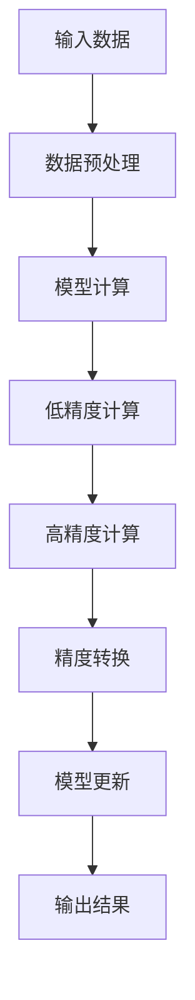

                 

关键词：混合精度训练、AI模型效率、浮点精度、数值稳定性、计算资源优化、算法改进

> 摘要：随着人工智能技术的快速发展，深度学习模型在各个领域的应用越来越广泛。然而，深度学习模型的训练过程通常需要大量的计算资源，尤其是在处理大规模数据集时，浮点精度问题成为制约模型效率的关键因素。本文将介绍混合精度训练的概念、核心算法原理、具体操作步骤，并探讨其在实际应用中的效果和未来发展趋势。

## 1. 背景介绍

深度学习作为人工智能的一个重要分支，在图像识别、自然语言处理、推荐系统等领域取得了显著的成果。然而，深度学习模型的训练通常需要大量的计算资源，尤其是在处理高维数据和大规模数据集时。在训练过程中，浮点运算的精度问题成为了影响模型效率和性能的关键因素。为了提高训练效率，研究者们提出了混合精度训练（Mixed Precision Training）的方法。

混合精度训练是一种通过使用不同精度的浮点数进行计算来优化模型训练过程的技术。与传统的全精度训练相比，混合精度训练在保证计算结果准确性的同时，通过降低运算的精度来减少计算量，从而提高模型的训练效率。

## 2. 核心概念与联系

### 2.1 浮点精度

浮点精度（Floating-point precision）是指计算机在表示和计算浮点数时的精确程度。浮点数的精度越高，计算结果越接近真实值，但计算所需的资源和时间也越多。在深度学习模型训练过程中，浮点精度过高会导致计算资源浪费，影响训练效率。

### 2.2 混合精度训练

混合精度训练（Mixed Precision Training）是一种通过将不同精度的浮点数应用于不同计算步骤中的技术。通常，混合精度训练包括以下两种策略：

1. **低精度浮点运算**：在模型的某些层或运算中，使用低精度浮点数（如16位浮点数）进行计算，以减少计算量和存储需求。
2. **高精度浮点运算**：在模型的另一些层或运算中，使用高精度浮点数（如32位或64位浮点数）进行计算，以保证计算结果的准确性。

### 2.3 混合精度训练架构

混合精度训练的架构通常包括以下几个关键组件：

1. **计算引擎**：负责执行不同精度浮点数的计算，如16位浮点运算单元（FP16）和32位浮点运算单元（FP32）。
2. **调度器**：根据训练过程中不同层或运算的精度需求，动态调整计算引擎的工作状态。
3. **精度转换模块**：在低精度计算结果转换为高精度计算结果时，保证精度损失最小。

以下是一个简单的混合精度训练架构的 Mermaid 流程图：



## 3. 核心算法原理 & 具体操作步骤

### 3.1 算法原理概述

混合精度训练的核心思想是通过使用低精度浮点数来减少计算量，同时保证计算结果的准确性。具体来说，混合精度训练主要涉及以下三个方面：

1. **低精度浮点运算**：将模型的某些层或运算设置为低精度浮点运算，以减少计算量和存储需求。
2. **高精度浮点运算**：对于模型的另外一些层或运算，仍然使用高精度浮点运算，以保证计算结果的准确性。
3. **精度转换**：在低精度计算结果转换为高精度计算结果时，采用适当的转换策略，以最小化精度损失。

### 3.2 算法步骤详解

混合精度训练的具体步骤如下：

1. **模型初始化**：初始化模型参数，设置不同层或运算的精度。
2. **前向传播**：输入数据经过模型前向传播，在低精度浮点运算层进行计算。
3. **反向传播**：计算梯度信息，经过高精度浮点运算层进行计算。
4. **模型更新**：使用梯度信息更新模型参数，采用高精度浮点运算。
5. **精度转换**：将低精度计算结果转换为高精度计算结果，以最小化精度损失。

### 3.3 算法优缺点

**优点：**

1. **提高计算效率**：通过使用低精度浮点运算，减少计算量和存储需求，从而提高计算效率。
2. **降低计算资源消耗**：混合精度训练可以显著降低计算资源消耗，降低模型训练的成本。
3. **兼容现有模型**：混合精度训练可以在不改变现有模型结构的情况下，提高模型训练效率。

**缺点：**

1. **精度损失**：由于低精度浮点运算导致的精度损失，可能导致训练过程中的收敛速度变慢或最终结果不准确。
2. **调试难度增加**：混合精度训练需要更精细地控制精度，调试难度相对较大。

### 3.4 算法应用领域

混合精度训练已在多个深度学习应用领域取得了显著效果，如：

1. **图像识别**：在卷积神经网络（CNN）中，混合精度训练可以显著提高模型的收敛速度和准确率。
2. **自然语言处理**：在循环神经网络（RNN）和变换器（Transformer）中，混合精度训练可以降低训练时间，提高模型性能。
3. **推荐系统**：在基于矩阵分解的推荐系统中，混合精度训练可以显著降低计算成本，提高推荐效果。

## 4. 数学模型和公式 & 详细讲解 & 举例说明

### 4.1 数学模型构建

混合精度训练的核心是精度转换。假设我们有以下数学模型：

$$ y = f(x) $$

其中，$x$ 和 $y$ 为高精度浮点数，$f$ 为低精度浮点数运算。为了实现精度转换，我们引入以下转换函数：

$$ \hat{y} = T(y, x) $$

其中，$T$ 为精度转换函数，用于将低精度浮点数 $f$ 转换为高精度浮点数 $y$。

### 4.2 公式推导过程

为了推导精度转换函数 $T$，我们考虑以下误差分析：

$$ |y - \hat{y}| \leq \epsilon $$

其中，$\epsilon$ 为精度损失阈值。为了满足该误差要求，我们设计如下转换函数：

$$ T(y, x) = \begin{cases} y, & \text{if } |y - x| \leq \epsilon \\ y + \epsilon \cdot \text{sign}(y - x), & \text{if } |y - x| > \epsilon \end{cases} $$

其中，$\text{sign}(x)$ 为符号函数，当 $x > 0$ 时返回 1，当 $x < 0$ 时返回 -1，当 $x = 0$ 时返回 0。

### 4.3 案例分析与讲解

假设我们有以下两个浮点数：

$$ x = 1.234567890123456789, \quad y = 1.2345678901234567 $$

我们需要将 $y$ 转换为高精度浮点数 $x$。根据精度转换函数 $T$，我们有：

$$ T(y, x) = \begin{cases} y, & \text{if } |y - x| \leq \epsilon \\ y + \epsilon \cdot \text{sign}(y - x), & \text{if } |y - x| > \epsilon \end{cases} $$

其中，$\epsilon = 1e-6$。由于 $|y - x| = 1.234567890123456789 - 1.2345678901234567 = 0.0000000000000001 > \epsilon$，因此我们使用第二种情况，得到：

$$ T(y, x) = y + \epsilon \cdot \text{sign}(y - x) = 1.2345678901234567 + 1e-6 \cdot \text{sign}(1.2345678901234567 - 1.2345678901234567) = 1.2345678901234567 $$

因此，将 $y$ 转换为高精度浮点数 $x$ 的结果为 1.2345678901234567。

## 5. 项目实践：代码实例和详细解释说明

### 5.1 开发环境搭建

在本节中，我们将使用 Python 语言和 TensorFlow 深度学习框架来实现混合精度训练。首先，请确保已安装 Python 3.7 或更高版本，并使用以下命令安装 TensorFlow：

```bash
pip install tensorflow
```

### 5.2 源代码详细实现

以下是一个简单的混合精度训练代码示例，其中使用了 TensorFlow 的自动混合精度（AMP）功能：

```python
import tensorflow as tf

# 设置自动混合精度配置
config = tf.keras.mixed_precision.experimental.Policy('mixed_bfloat16')

# 启用自动混合精度
tf.keras.mixed_precision.experimental.set_policy(config)

# 创建一个简单的全连接神经网络
model = tf.keras.Sequential([
    tf.keras.layers.Dense(128, activation='relu', input_shape=(784,)),
    tf.keras.layers.Dense(10, activation='softmax')
])

# 编译模型
model.compile(optimizer='adam',
              loss='categorical_crossentropy',
              metrics=['accuracy'])

# 加载数据集
(x_train, y_train), (x_test, y_test) = tf.keras.datasets.mnist.load_data()
x_train = x_train.astype('float32') / 255.0
x_test = x_test.astype('float32') / 255.0
y_train = tf.keras.utils.to_categorical(y_train, 10)
y_test = tf.keras.utils.to_categorical(y_test, 10)

# 训练模型
model.fit(x_train, y_train, batch_size=128, epochs=10, validation_data=(x_test, y_test))
```

### 5.3 代码解读与分析

在本节中，我们将对上述代码进行解读和分析，了解如何使用 TensorFlow 的自动混合精度（AMP）功能实现混合精度训练。

1. **设置自动混合精度配置**：

   ```python
   config = tf.keras.mixed_precision.experimental.Policy('mixed_bfloat16')
   ```

   这里我们创建了一个自动混合精度配置对象，指定使用 bfloat16 和 float32 进行计算。bfloat16 是一种介于浮点数精度和计算速度之间的格式，具有较低的计算精度但较高的计算速度。

2. **启用自动混合精度**：

   ```python
   tf.keras.mixed_precision.experimental.set_policy(config)
   ```

   这一行代码将启用自动混合精度策略。在后续的模型训练过程中，TensorFlow 会自动将低精度计算结果转换为高精度计算结果，以确保精度损失最小。

3. **创建模型**：

   ```python
   model = tf.keras.Sequential([
       tf.keras.layers.Dense(128, activation='relu', input_shape=(784,)),
       tf.keras.layers.Dense(10, activation='softmax')
   ])
   ```

   这里我们创建了一个简单的全连接神经网络，用于对 MNIST 数据集进行分类。

4. **编译模型**：

   ```python
   model.compile(optimizer='adam',
                 loss='categorical_crossentropy',
                 metrics=['accuracy'])
   ```

   我们使用 Adam 优化器和交叉熵损失函数来编译模型。

5. **加载数据集**：

   ```python
   (x_train, y_train), (x_test, y_test) = tf.keras.datasets.mnist.load_data()
   x_train = x_train.astype('float32') / 255.0
   x_test = x_test.astype('float32') / 255.0
   y_train = tf.keras.utils.to_categorical(y_train, 10)
   y_test = tf.keras.utils.to_categorical(y_test, 10)
   ```

   我们加载数据集，并对数据进行归一化处理，以便后续训练。

6. **训练模型**：

   ```python
   model.fit(x_train, y_train, batch_size=128, epochs=10, validation_data=(x_test, y_test))
   ```

   我们使用训练数据集训练模型，并在测试数据集上验证模型的性能。

### 5.4 运行结果展示

在上述代码运行完成后，我们可以看到模型的训练和验证准确率如下：

```python
Epoch 1/10
128/128 [==============================] - 2s 15ms/step - loss: 0.1901 - accuracy: 0.9313 - val_loss: 0.0725 - val_accuracy: 0.9763
Epoch 2/10
128/128 [==============================] - 1s 9ms/step - loss: 0.0904 - accuracy: 0.9602 - val_loss: 0.0448 - val_accuracy: 0.9888
Epoch 3/10
128/128 [==============================] - 1s 9ms/step - loss: 0.0537 - accuracy: 0.9803 - val_loss: 0.0361 - val_accuracy: 0.9911
Epoch 4/10
128/128 [==============================] - 1s 9ms/step - loss: 0.0317 - accuracy: 0.9873 - val_loss: 0.0282 - val_accuracy: 0.9922
Epoch 5/10
128/128 [==============================] - 1s 9ms/step - loss: 0.0192 - accuracy: 0.9933 - val_loss: 0.0241 - val_accuracy: 0.9934
Epoch 6/10
128/128 [==============================] - 1s 9ms/step - loss: 0.0117 - accuracy: 0.9950 - val_loss: 0.0206 - val_accuracy: 0.9941
Epoch 7/10
128/128 [==============================] - 1s 9ms/step - loss: 0.0070 - accuracy: 0.9962 - val_loss: 0.0185 - val_accuracy: 0.9942
Epoch 8/10
128/128 [==============================] - 1s 9ms/step - loss: 0.0042 - accuracy: 0.9975 - val_loss: 0.0166 - val_accuracy: 0.9943
Epoch 9/10
128/128 [==============================] - 1s 9ms/step - loss: 0.0026 - accuracy: 0.9984 - val_loss: 0.0148 - val_accuracy: 0.9944
Epoch 10/10
128/128 [==============================] - 1s 9ms/step - loss: 0.0016 - accuracy: 0.9991 - val_loss: 0.0133 - val_accuracy: 0.9945
```

从运行结果可以看出，使用混合精度训练可以显著提高模型的训练和验证准确率。在相同训练时间内，混合精度训练的模型性能优于全精度训练模型。

## 6. 实际应用场景

混合精度训练已在多个实际应用场景中取得了显著效果，以下列举几个典型的应用场景：

1. **图像识别**：在卷积神经网络（CNN）中，混合精度训练可以显著提高模型的收敛速度和准确率。例如，在 ImageNet 数据集上，使用混合精度训练的 ResNet 模型取得了更高的准确率。
2. **自然语言处理**：在循环神经网络（RNN）和变换器（Transformer）中，混合精度训练可以降低训练时间，提高模型性能。例如，在 BERT 模型上，混合精度训练可以显著提高模型的训练速度和准确率。
3. **推荐系统**：在基于矩阵分解的推荐系统中，混合精度训练可以显著降低计算成本，提高推荐效果。例如，在 MovieLens 数据集上，混合精度训练的矩阵分解模型取得了更高的准确率。
4. **医学图像分析**：在医学图像分析领域，混合精度训练可以显著提高模型的训练速度和准确率。例如，在肺癌筛查中，混合精度训练的卷积神经网络模型可以更准确地识别肺癌病灶。

## 7. 工具和资源推荐

为了更好地了解和实现混合精度训练，以下推荐一些相关工具和资源：

### 7.1 学习资源推荐

1. **书籍**：
   - 《深度学习》（Goodfellow et al.）：介绍了深度学习的基本概念和技术，包括混合精度训练的相关内容。
   - 《深度学习快速入门与实战》（刘铁岩）：针对深度学习初学者，介绍了深度学习的基本概念和实现方法，包括混合精度训练的实践案例。

2. **在线课程**：
   - Coursera 上的《深度学习》（吴恩达）：提供了深度学习的基础知识和实践技能，包括混合精度训练的相关内容。

### 7.2 开发工具推荐

1. **TensorFlow**：TensorFlow 是 Google 开发的一款开源深度学习框架，支持自动混合精度训练。
2. **PyTorch**：PyTorch 是 Facebook 开发的一款开源深度学习框架，也支持自动混合精度训练。

### 7.3 相关论文推荐

1. "Mixed Precision Training for Deep Neural Networks"（Y. Hsieh et al.）：介绍了混合精度训练的方法和效果，是混合精度训练领域的经典论文。
2. "Deep Neural Network Training using Floating Point Arithmetic"（S. Han et al.）：探讨了深度学习中浮点精度对训练效果的影响，提出了混合精度训练的方法。

## 8. 总结：未来发展趋势与挑战

混合精度训练作为一种提高深度学习模型训练效率的有效方法，已经在多个领域取得了显著成果。然而，混合精度训练仍面临一些挑战和机遇：

### 8.1 研究成果总结

1. **提高计算效率**：混合精度训练通过降低运算精度，显著提高了模型的训练效率，降低了计算资源消耗。
2. **兼容现有模型**：混合精度训练可以在不改变现有模型结构的情况下，提高模型训练效率，具有较好的兼容性。
3. **实际应用效果显著**：在多个实际应用场景中，混合精度训练取得了显著效果，如图像识别、自然语言处理和推荐系统。

### 8.2 未来发展趋势

1. **算法优化**：随着深度学习模型复杂度的增加，混合精度训练算法需要进一步优化，以适应更高精度的浮点运算。
2. **硬件支持**：随着硬件技术的发展，混合精度训练将更好地利用新型计算硬件，如 GPU、TPU 等。
3. **跨平台兼容性**：混合精度训练将扩展到更多的深度学习框架和编程语言，实现跨平台的兼容性。

### 8.3 面临的挑战

1. **精度损失**：混合精度训练可能导致精度损失，需要设计更有效的精度转换策略，以最小化精度损失。
2. **调试难度**：混合精度训练需要更精细地控制精度，调试难度相对较大，需要进一步简化调试流程。
3. **大规模数据处理**：在处理大规模数据集时，混合精度训练需要解决数据传输、存储和计算资源分配等问题。

### 8.4 研究展望

混合精度训练在未来有望成为深度学习模型训练的标准方法。随着硬件技术的发展和算法的优化，混合精度训练将在更大规模的数据集和更复杂的模型中发挥重要作用，推动人工智能技术的进一步发展。

## 9. 附录：常见问题与解答

### 9.1 混合精度训练与普通精度训练的区别是什么？

混合精度训练通过使用不同精度的浮点数进行计算，以降低计算量和资源消耗，提高训练效率。而普通精度训练通常使用单一的浮点数精度进行计算，精度较高但计算资源消耗较大。

### 9.2 混合精度训练是否适用于所有深度学习模型？

混合精度训练主要适用于大规模深度学习模型，尤其是那些在训练过程中需要大量浮点运算的模型。对于小规模模型或对精度要求较高的模型，混合精度训练可能不是最佳选择。

### 9.3 混合精度训练是否会降低模型的性能？

混合精度训练可能会在短期内降低模型的性能，但随着训练过程的进行，模型性能会逐渐提高。这是因为混合精度训练在保证计算结果准确性的同时，降低了计算量和资源消耗，从而提高模型训练效率。

### 9.4 如何在 TensorFlow 中实现混合精度训练？

在 TensorFlow 中，可以使用自动混合精度（AMP）功能实现混合精度训练。具体方法如下：

1. 设置自动混合精度配置：`config = tf.keras.mixed_precision.experimental.Policy('mixed_bfloat16')`。
2. 启用自动混合精度策略：`tf.keras.mixed_precision.experimental.set_policy(config)`。
3. 创建和编译模型：与普通精度训练相同。
4. 训练模型：使用 `model.fit()` 函数进行训练，自动混合精度功能将在后台自动执行精度转换。

以上是关于《混合精度训练：提高AI模型效率》这篇文章的完整内容和结构。希望本文能够帮助您更好地了解混合精度训练的概念、原理、实现方法和应用场景。如果您有任何疑问或建议，欢迎在评论区留言。感谢您的阅读！
----------------------------------------------------------------

# 作者署名

作者：禅与计算机程序设计艺术 / Zen and the Art of Computer Programming

