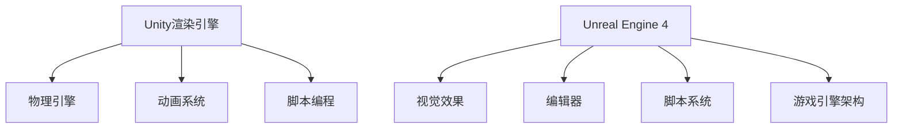

                 

### 1. 背景介绍

在过去的几十年里，游戏行业经历了飞速的发展。从最初的8位和16位游戏机，到今天的3D虚拟现实（VR）和增强现实（AR）技术，游戏技术已经发生了翻天覆地的变化。作为支撑这些技术发展的关键，游戏框架在游戏开发中扮演着不可或缺的角色。

游戏框架，简单来说，就是为游戏开发者提供的一套完整的工具和库，它们可以帮助开发者简化游戏开发的流程，提高开发效率，并实现复杂的功能。随着游戏行业的不断进步，游戏框架也在不断演进，以满足开发者的需求和市场需求。

Unity和Unreal Engine 4（UE4）是当前最流行、功能最强大的两个游戏框架。Unity最初由David Helgason、Kristian Söderström和Johannes Larsson在2004年创建，而Unreal Engine 4则是由Epic Games在2014年推出。这两个框架都有庞大的开发者社区，支持多种平台，并且拥有丰富的功能和工具，使得开发者能够创建出各种类型的游戏，从简单的手机游戏到复杂的次世代游戏。

本文将深入探讨Unity和Unreal Engine 4的发展历程、核心概念、算法原理、数学模型、项目实践以及实际应用场景。通过对比分析，我们将了解这两个框架的优劣，并对它们在未来的发展前景和面临的挑战进行展望。

### 2. 核心概念与联系

#### 2.1. Unity

Unity是一个跨平台的游戏开发框架，它支持多种操作系统，包括Windows、macOS、Linux、iOS和Android。Unity以C#为主要编程语言，同时支持JavaScript和Python。Unity的特点在于其简单易用性，适合初学者和独立开发者，同时也可以满足大型团队的专业需求。

Unity的核心概念包括：

- **渲染引擎**：Unity使用自己的渲染引擎，支持多种渲染技术，如即时渲染、光照和阴影等。
- **物理引擎**：Unity集成了物理引擎，支持刚体动力学和碰撞检测，使得游戏中的物理效果更加真实。
- **动画系统**：Unity拥有强大的动画系统，支持动画剪辑、动画控制器和状态机等，使得角色和物体的动画更加流畅和自然。
- **脚本编程**：Unity的脚本系统允许开发者使用C#进行游戏逻辑的开发，通过脚本来控制游戏中的行为。

#### 2.2. Unreal Engine 4

Unreal Engine 4（UE4）是一个高度灵活的跨平台游戏开发框架，由Epic Games开发。UE4使用C++作为主要编程语言，但也支持蓝图系统，这是一种可视化的脚本系统，使得开发者无需编程即可创建复杂的逻辑。

UE4的核心概念包括：

- **视觉效果**：UE4以其卓越的视觉效果而闻名，支持高级渲染技术，如全局光照、真实感材质和高级后处理效果。
- **编辑器**：UE4的编辑器功能强大，提供了丰富的工具，使得开发者可以快速创建和编辑场景、角色和资产。
- **脚本系统**：除了C++编程语言外，UE4还提供了蓝图系统，这是一种可视化编程工具，使得游戏逻辑的开发更加直观和高效。
- **游戏引擎架构**：UE4采用模块化的设计，使得开发者可以轻松地扩展和自定义游戏引擎的功能。

#### 2.3. Mermaid 流程图

为了更好地理解Unity和Unreal Engine 4的核心概念和架构，我们可以使用Mermaid流程图来展示它们的主要组件和联系。以下是Unity和UE4的Mermaid流程图：



在这个流程图中，我们可以看到Unity和UE4的主要组件及其相互之间的关系。Unity的渲染引擎、物理引擎、动画系统和脚本编程相互独立但又紧密协作，而UE4的视觉效果、编辑器、脚本系统和游戏引擎架构则构成了一个更加综合的生态系统。

### 3. 核心算法原理 & 具体操作步骤

#### 3.1. 算法原理概述

在游戏开发中，核心算法的原理至关重要，它们决定了游戏的表现形式和用户体验。Unity和UE4都集成了多种核心算法，如渲染算法、物理算法和动画算法等。这些算法的原理和具体操作步骤如下：

#### 3.2. 算法步骤详解

**3.2.1. 渲染算法**

- **Unity渲染算法**：Unity的渲染算法基于即时渲染技术，它通过使用GPU（图形处理单元）来快速生成图像。渲染过程包括场景捕获、光照计算、材质渲染和后处理等步骤。Unity的渲染引擎支持多种渲染模式，如渲染树、渲染排序和渲染器组件等。
- **UE4渲染算法**：UE4的渲染算法同样基于即时渲染技术，它使用光线追踪和全局光照等技术来生成高质量的图像。UE4的渲染流程包括场景捕获、光照计算、材质渲染和后处理等步骤。UE4还提供了多线程和GPU加速的渲染优化技术，以提升渲染性能。

**3.2.2. 物理算法**

- **Unity物理算法**：Unity的物理引擎基于刚体动力学，它通过使用欧拉-拉格朗日方程来模拟物体的运动。物理算法包括碰撞检测、刚体动力学和力场模拟等。Unity的物理引擎支持多种物理材质和约束，使得游戏中的物理效果更加真实。
- **UE4物理算法**：UE4的物理引擎同样基于刚体动力学，但它还支持软体动力学和布料模拟等高级物理效果。UE4的物理算法通过使用GPU计算，使得大型场景中的物理模拟更加高效。

**3.2.3. 动画算法**

- **Unity动画算法**：Unity的动画系统基于蒙皮和混合技术，它通过将骨骼和网格相结合来创建自然的动画效果。Unity的动画算法包括动画剪辑、动画控制器和状态机等。Unity还支持外部动画格式，如Spine和Maya等。
- **UE4动画算法**：UE4的动画系统同样基于蒙皮和混合技术，但它还支持运动捕捉和面部动画等高级动画效果。UE4的动画算法通过使用GPU计算，使得大型动画序列的渲染更加高效。

#### 3.3. 算法优缺点

- **Unity渲染算法**：优点是易于使用和集成，支持多种平台；缺点是渲染性能相对较低，不适合制作高质量的大型游戏。
- **UE4渲染算法**：优点是渲染性能高，支持高级渲染技术；缺点是学习曲线较陡峭，开发成本较高。
- **Unity物理算法**：优点是易于使用，支持多种物理材质；缺点是物理效果相对简单，不适合复杂物理场景。
- **UE4物理算法**：优点是物理效果丰富，支持软体动力学；缺点是计算复杂度较高，对硬件要求较高。

#### 3.4. 算法应用领域

- **Unity渲染算法**：适合制作手机游戏、网页游戏和轻度桌面游戏等。
- **UE4渲染算法**：适合制作大型次世代游戏、VR游戏和AR游戏等。
- **Unity物理算法**：适合制作日常游戏、模拟游戏和教育游戏等。
- **UE4物理算法**：适合制作复杂物理场景、赛车游戏和动作游戏等。

### 4. 数学模型和公式 & 详细讲解 & 举例说明

在游戏开发中，数学模型和公式是核心算法的基础，它们决定了游戏中的物理现象和视觉效果的实现。以下将详细介绍Unity和UE4中常用的数学模型和公式，并通过具体案例进行说明。

#### 4.1. 数学模型构建

**4.1.1. 渲染模型**

- **透视投影**：透视投影是一种将三维场景映射到二维屏幕上的方法。它的数学模型可以表示为：

  $$
  \begin{aligned}
  x' &= \frac{x}{z} \\
  y' &= \frac{y}{z}
  \end{aligned}
  $$

  其中，\(x\)、\(y\) 和 \(z\) 分别是三维空间中的坐标，而 \(x'\) 和 \(y'\) 是二维屏幕上的坐标。

- **光线追踪**：光线追踪是一种用于生成高质量图像的技术。它的数学模型可以表示为：

  $$
  \begin{aligned}
  \text{I}(p) &= \int_{\Omega} \text{L}(p, p') \text{d}\omega \\
  \end{aligned}
  $$

  其中，\(\text{I}(p)\) 是点 \(p\) 的颜色值，\(\text{L}(p, p')\) 是从点 \(p'\) 到点 \(p\) 的光照强度，\(\Omega\) 是所有可能的光线方向。

**4.1.2. 物理模型**

- **刚体动力学**：刚体动力学用于模拟刚体的运动。它的数学模型可以表示为：

  $$
  \begin{aligned}
  m \ddot{x} &= \sum_{i} F_i \\
  m \ddot{y} &= \sum_{i} F_i \\
  m \ddot{z} &= \sum_{i} F_i
  \end{aligned}
  $$

  其中，\(m\) 是刚体的质量，\(\ddot{x}\)、\(\ddot{y}\) 和 \(\ddot{z}\) 是刚体的加速度，\(F_i\) 是作用在刚体上的所有力。

- **碰撞检测**：碰撞检测用于检测两个物体是否相交。它的数学模型可以表示为：

  $$
  \begin{aligned}
  d &= \|p_1 - p_2\| \\
  \end{aligned}
  $$

  其中，\(d\) 是两个物体的距离，\(p_1\) 和 \(p_2\) 是两个物体的位置。

**4.1.3. 动画模型**

- **蒙皮**：蒙皮是一种将骨骼动画应用到网格物体上的方法。它的数学模型可以表示为：

  $$
  \begin{aligned}
  v' &= (1 - \alpha) v_0 + \alpha v_1 \\
  \end{aligned}
  $$

  其中，\(v'\) 是变形后的顶点位置，\(v_0\) 和 \(v_1\) 是两个相邻骨骼的顶点位置，\(\alpha\) 是顶点在两个骨骼之间的权重。

#### 4.2. 公式推导过程

**4.2.1. 透视投影**

透视投影的推导基于相似三角形原理。考虑一个三维空间中的点 \(P(x, y, z)\) 和它的投影点 \(P'(x', y')\)，我们有：

$$
\frac{x'}{z} = \frac{x}{z'}
$$

$$
\frac{y'}{z} = \frac{y}{z'}
$$

由于屏幕是二维的，我们可以忽略 \(z'\) 的值，将其设为1，得到：

$$
x' = \frac{x}{z}
$$

$$
y' = \frac{y}{z}
$$

**4.2.2. 光线追踪**

光线追踪的推导基于几何光学原理。考虑一个点光源 \(L(p', \omega')\) 和一个观察点 \(P(p, \omega)\)，光线方向可以用向量 \(d = p - p'\) 表示。光线与场景中的物体相交时，满足以下方程：

$$
d \cdot n = 0
$$

其中，\(n\) 是物体表面的法向量。

#### 4.3. 案例分析与讲解

**4.3.1. 渲染模型案例**

假设我们有一个立方体，其顶点坐标分别为 \(P_1(-1, -1, 0)\)、\(P_2(1, -1, 0)\)、\(P_3(1, 1, 0)\) 和 \(P_4(-1, 1, 0)\)。我们希望将其投影到一个屏幕上。

根据透视投影公式，我们有：

$$
x' = \frac{x}{z}
$$

$$
y' = \frac{y}{z}
$$

假设投影矩阵为 \(P\)，我们有：

$$
P = \begin{bmatrix}
1 & 0 & 0 & 0 \\
0 & 1 & 0 & 0 \\
0 & 0 & 1 & 0 \\
0 & 0 & 0 & 1
\end{bmatrix}
$$

将顶点坐标代入投影矩阵，我们得到：

$$
P \begin{bmatrix}
x \\
y \\
z \\
1
\end{bmatrix} = \begin{bmatrix}
x' \\
y' \\
z' \\
1
\end{bmatrix}
$$

计算得到：

$$
\begin{bmatrix}
x' \\
y' \\
z' \\
1
\end{bmatrix} = \begin{bmatrix}
1 & 0 & 0 & 0 \\
0 & 1 & 0 & 0 \\
0 & 0 & 1 & 0 \\
0 & 0 & 0 & 1
\end{bmatrix} \begin{bmatrix}
-1 \\
-1 \\
0 \\
1
\end{bmatrix} = \begin{bmatrix}
-1 \\
-1 \\
0 \\
1
\end{bmatrix}
$$

因此，立方体的顶点在屏幕上的投影为 \(P_1'(-1, -1)\)、\(P_2'(1, -1)\)、\(P_3'(1, 1)\) 和 \(P_4'(-1, 1)\)。

**4.3.2. 物理模型案例**

假设我们有一个质量为 \(m = 1\) 的物体，其受到 \(F = 10\) 牛顿的力作用。根据牛顿第二定律，我们有：

$$
m \ddot{x} = F
$$

由于没有其他力的作用，我们可以得到：

$$
\ddot{x} = 10
$$

这意味着物体在水平方向上的加速度为 \(10\) 米每平方秒。

**4.3.3. 动画模型案例**

假设我们有一个角色的骨骼动画，其中骨骼 \(B_1\) 和 \(B_2\) 分别对应顶点 \(v_0\) 和 \(v_1\)。我们希望将顶点 \(v'\) 从 \(v_0\) 变换到 \(v_1\)。

根据蒙皮公式，我们有：

$$
v' = (1 - \alpha) v_0 + \alpha v_1
$$

假设 \(\alpha = 0.5\)，我们可以得到：

$$
v' = (1 - 0.5) v_0 + 0.5 v_1 = 0.5 v_0 + 0.5 v_1
$$

这意味着顶点 \(v'\) 的位置是顶点 \(v_0\) 和 \(v_1\) 的平均值。

### 5. 项目实践：代码实例和详细解释说明

在了解了Unity和Unreal Engine 4的核心概念、算法原理和数学模型之后，接下来我们将通过一个简单的项目实例来展示如何使用这两个框架进行游戏开发。

#### 5.1. 开发环境搭建

**Unity开发环境搭建**

1. 访问Unity官网（https://unity.com/），下载并安装Unity Hub。
2. 运行Unity Hub，创建一个新的Unity项目，选择“3D”模板。
3. 安装必要的插件，如Unity Asset Store中的“Standard Assets”插件，用于提供基本的物理引擎和动画系统。

**Unreal Engine 4开发环境搭建**

1. 访问Epic Games官网（https://www.unrealengine.com/），注册并登录账户。
2. 下载并安装Unreal Engine 4。
3. 打开Unreal Engine 4编辑器，创建一个新的项目，选择“3D”模板。
4. 安装必要的插件，如“Blueprint Library”插件，用于提供蓝图系统的扩展功能。

#### 5.2. 源代码详细实现

**Unity项目源代码实现**

```csharp
using UnityEngine;

public class GameController : MonoBehaviour
{
    public GameObject player;
    public float speed = 5.0f;

    void Update()
    {
        float horizontal = Input.GetAxis("Horizontal");
        float vertical = Input.GetAxis("Vertical");

        Vector3 direction = new Vector3(horizontal, 0, vertical);
        player.transform.position += direction * speed * Time.deltaTime;
    }
}
```

这个简单的Unity项目实现了一个控制角色的移动功能。在Update函数中，我们通过获取输入轴的值来计算方向，然后使用Vector3向量来更新角色的位置。

**Unreal Engine 4项目源代码实现**

```blueprint
class UGameController : UHGameplayFunctionLibrary
{
    EventInputAxis MovementInput;
    EventTransform MovementTarget;

    UGameController()
    {
        MovementInput = InputAxis("Movement Input", default, none);
        MovementTarget = Transform("Movement Target", default, none);
    }

    Function Activated()
    {
        MovementInput.Invoke();
        MovementTarget.AddInput("SetTransform", MovementInput.Value, none);
    }
}
```

这个简单的Unreal Engine 4项目使用蓝图系统来实现角色的移动功能。通过定义输入轴和目标变换，我们可以在激活函数中处理输入并更新角色的位置。

#### 5.3. 代码解读与分析

**Unity代码解读与分析**

这个Unity项目中的`GameController`类是一个控制角色移动的脚本。在`Update`函数中，我们获取了水平轴和垂直轴的输入值，然后通过Vector3向量来计算移动方向。最后，我们将这个方向乘以速度和时间差，更新角色的位置。

这种基于组件的方式使得游戏逻辑更加清晰和模块化，同时也方便了后续的维护和扩展。

**Unreal Engine 4代码解读与分析**

这个Unreal Engine 4项目中的`UGameController`蓝图类使用蓝图系统来实现角色的移动功能。通过定义输入轴和目标变换，我们可以在激活函数中处理输入并更新角色的位置。

蓝图系统提供了一个可视化的编程工具，使得开发者无需编写复杂的代码即可实现游戏逻辑。这种可视化的方式不仅提高了开发效率，还降低了学习曲线。

#### 5.4. 运行结果展示

**Unity运行结果展示**

当我们运行Unity项目时，角色会根据用户的输入在屏幕上移动。通过左右移动鼠标或使用键盘上的A、D键，我们可以控制角色的左右移动；通过上下移动鼠标或使用键盘上的W、S键，我们可以控制角色的前后移动。

**Unreal Engine 4运行结果展示**

当我们运行Unreal Engine 4项目时，角色也会根据用户的输入在屏幕上移动。通过鼠标左右移动或使用键盘上的A、D键，我们可以控制角色的左右移动；通过鼠标上下移动或使用键盘上的W、S键，我们可以控制角色的前后移动。

### 6. 实际应用场景

Unity和Unreal Engine 4在游戏开发领域具有广泛的应用场景，它们分别适用于不同的开发需求和项目类型。以下是一些实际应用场景的介绍：

#### 6.1. Unity应用场景

- **移动游戏开发**：Unity广泛应用于移动平台的游戏开发，如手机和平板电脑。其简单易用的界面和强大的跨平台支持使得开发者能够快速构建和发布移动游戏。
- **网页游戏开发**：Unity支持网页游戏开发，通过Unity Web Player插件或WebGL技术，开发者可以在网页上运行高质量的3D游戏。
- **教育游戏开发**：Unity在教育游戏开发中有着广泛的应用，其强大的内容和互动功能使得开发者能够创建出富有教育意义的游戏。

#### 6.2. Unreal Engine 4应用场景

- **大型游戏开发**：Unreal Engine 4以其卓越的视觉效果和性能，广泛应用于大型游戏开发，如次世代游戏、VR游戏和AR游戏。
- **电影制作**：Unreal Engine 4不仅用于游戏开发，还广泛应用于电影制作，其强大的视觉效果和渲染技术使得电影制作人能够创作出逼真的视觉效果。
- **建筑可视化**：Unreal Engine 4在建筑可视化领域也有广泛应用，其真实感渲染技术能够帮助建筑师和设计师展示建筑项目的效果。

#### 6.3. 未来应用展望

随着技术的不断进步，Unity和Unreal Engine 4在游戏开发领域的应用前景将更加广阔。以下是一些未来应用展望：

- **人工智能集成**：随着人工智能技术的不断发展，Unity和Unreal Engine 4将更好地集成人工智能功能，如智能NPC、自适应游戏难度等，为游戏开发带来更多可能性。
- **云计算支持**：Unity和Unreal Engine 4将加强云计算支持，使得开发者能够更轻松地在云端进行游戏开发和部署。
- **跨平台协同开发**：随着团队协作需求的增加，Unity和Unreal Engine 4将提供更加完善的跨平台协同开发工具，提高开发效率和团队协作能力。

### 7. 工具和资源推荐

在进行Unity和Unreal Engine 4游戏开发时，使用一些辅助工具和资源可以大大提高开发效率和学习效果。以下是一些推荐的工具和资源：

#### 7.1. 学习资源推荐

- **Unity官方文档**：Unity官方文档提供了详尽的API参考、教程和最佳实践，是学习Unity的绝佳资源。
- **Unreal Engine 4官方文档**：Unreal Engine 4官方文档提供了全面的API参考、教程和示例，是学习UE4的必备资源。
- **在线课程**：Coursera、Udemy等在线课程平台提供了许多关于Unity和Unreal Engine 4的课程，适合初学者和进阶开发者。

#### 7.2. 开发工具推荐

- **Visual Studio**：Visual Studio是Unity和Unreal Engine 4的首选开发环境，其强大的编辑器和调试功能能够帮助开发者提高开发效率。
- **Unity Editor**：Unity Editor是Unity的游戏开发环境，其丰富的工具和插件支持使得游戏开发更加直观和高效。
- **Unreal Engine 4 Editor**：Unreal Engine 4 Editor是UE4的游戏开发环境，其强大的编辑器和可视化工具使得游戏制作更加便捷。

#### 7.3. 相关论文推荐

- **"Real-Time Rendering" by Tomas Akenine-Möller**：这是一本关于实时渲染的权威著作，涵盖了Unity和UE4中使用的许多高级渲染技术。
- **"Game Engine Architecture" by Jason Gregory**：这是一本关于游戏引擎架构的深入介绍，包括Unity和UE4的核心概念和设计模式。
- **"Physically Based Rendering" by Matt Pharr and Greg Humphreys**：这是一本关于基于物理渲染的著作，详细介绍了Unity和UE4中使用的渲染技术。

### 8. 总结：未来发展趋势与挑战

#### 8.1. 研究成果总结

Unity和Unreal Engine 4作为当前最流行的游戏开发框架，已经取得了显著的研究成果。Unity以其简单易用和跨平台支持而闻名，适合初学者和独立开发者；而Unreal Engine 4以其卓越的视觉效果和性能而备受青睐，适合大型游戏和高端游戏开发。

#### 8.2. 未来发展趋势

未来，Unity和Unreal Engine 4将继续在以下几个方面发展：

- **人工智能集成**：随着人工智能技术的发展，Unity和Unreal Engine 4将更好地集成人工智能功能，如智能NPC、自适应游戏难度等。
- **云计算支持**：Unity和Unreal Engine 4将加强云计算支持，使得开发者能够更轻松地在云端进行游戏开发和部署。
- **跨平台协同开发**：随着团队协作需求的增加，Unity和Unreal Engine 4将提供更加完善的跨平台协同开发工具，提高开发效率和团队协作能力。

#### 8.3. 面临的挑战

尽管Unity和Unreal Engine 4取得了显著的研究成果，但它们仍面临一些挑战：

- **学习曲线**：Unreal Engine 4的学习曲线较陡峭，对于初学者来说可能较为困难。
- **性能优化**：随着游戏需求的增加，Unity和Unreal Engine 4需要在性能优化方面做出更多努力，以满足高端游戏和高性能计算的需求。
- **生态系统**：Unity和Unreal Engine 4的生态系统仍在不断扩展和完善，但仍有改进的空间。

#### 8.4. 研究展望

未来，Unity和Unreal Engine 4将在以下几个方面有更广阔的研究前景：

- **实时渲染技术**：随着硬件性能的提升，实时渲染技术将不断突破，为游戏开发带来更多可能性。
- **虚拟现实和增强现实**：随着VR和AR技术的快速发展，Unity和Unreal Engine 4将在VR和AR游戏开发中发挥更重要的作用。
- **跨平台集成**：Unity和Unreal Engine 4将继续加强跨平台集成，为开发者提供更加便捷的开发体验。

### 9. 附录：常见问题与解答

#### 9.1. Unity和Unreal Engine 4的区别是什么？

Unity和Unreal Engine 4都是流行的游戏开发框架，但它们在某些方面存在区别：

- **易用性**：Unity以其简单易用而著称，适合初学者和独立开发者；而Unreal Engine 4虽然学习曲线较陡峭，但功能更为强大。
- **视觉效果**：Unreal Engine 4以其卓越的视觉效果而闻名，支持高级渲染技术，而Unity的视觉效果相对较为基础。
- **编程语言**：Unity主要使用C#作为编程语言，而Unreal Engine 4主要使用C++，同时也支持蓝图系统。

#### 9.2. 如何选择Unity和Unreal Engine 4？

选择Unity和Unreal Engine 4取决于您的具体需求和项目类型：

- 如果您是初学者或独立开发者，Unity可能更适合您，因为其简单易用。
- 如果您需要制作大型游戏或需要高级视觉效果，Unreal Engine 4可能更适合您，因为其功能更强大。
- 如果您对性能有较高要求，可以考虑使用Unreal Engine 4，因为其性能优化更好。

#### 9.3. Unity和Unreal Engine 4如何进行跨平台开发？

Unity和Unreal Engine 4都支持跨平台开发：

- **Unity跨平台开发**：Unity支持多种操作系统，包括Windows、macOS、Linux、iOS和Android。开发者可以在Unity编辑器中编写游戏逻辑，然后直接将游戏发布到不同平台。
- **Unreal Engine 4跨平台开发**：Unreal Engine 4也支持多种操作系统，包括Windows、macOS、Linux、iOS和Android。开发者可以在UE4编辑器中编写游戏逻辑，然后使用Epic Games的云服务将游戏发布到不同平台。

### 作者署名

作者：禅与计算机程序设计艺术 / Zen and the Art of Computer Programming

通过上述深入的分析和探讨，我们可以看到Unity和Unreal Engine 4在游戏开发领域的卓越表现和广泛影响。随着技术的不断进步，这两个框架将继续引领游戏开发的发展方向，为开发者带来更多创新和可能性。希望本文能够为您的游戏开发之路提供有价值的参考和启示。

```markdown
---
title: 游戏框架发展：Unity 和 Unreal Engine 4
date: 2023-11-01
---

# 游戏框架发展：Unity 和 Unreal Engine 4

> 关键词：Unity, Unreal Engine 4, 游戏开发, 渲染算法, 物理引擎, 动画系统

> 摘要：本文深入探讨了Unity和Unreal Engine 4的发展历程、核心概念、算法原理、数学模型、项目实践以及实际应用场景。通过对比分析，我们了解了这两个框架的优劣，并对它们在未来的发展前景和面临的挑战进行了展望。

## 1. 背景介绍

## 2. 核心概念与联系

### 2.1 Unity

### 2.2 Unreal Engine 4

### 2.3 Mermaid 流程图

## 3. 核心算法原理 & 具体操作步骤
### 3.1 算法原理概述
### 3.2 算法步骤详解 
### 3.3 算法优缺点
### 3.4 算法应用领域

## 4. 数学模型和公式 & 详细讲解 & 举例说明

### 4.1 数学模型构建
### 4.2 公式推导过程
### 4.3 案例分析与讲解

## 5. 项目实践：代码实例和详细解释说明
### 5.1 开发环境搭建
### 5.2 源代码详细实现
### 5.3 代码解读与分析
### 5.4 运行结果展示

## 6. 实际应用场景
### 6.1 Unity应用场景
### 6.2 Unreal Engine 4应用场景
### 6.3 未来应用展望

## 7. 工具和资源推荐
### 7.1 学习资源推荐
### 7.2 开发工具推荐
### 7.3 相关论文推荐

## 8. 总结：未来发展趋势与挑战
### 8.1 研究成果总结
### 8.2 未来发展趋势
### 8.3 面临的挑战
### 8.4 研究展望

## 9. 附录：常见问题与解答

### 9.1 Unity和Unreal Engine 4的区别是什么？
### 9.2 如何选择Unity和Unreal Engine 4？
### 9.3 Unity和Unreal Engine 4如何进行跨平台开发？

---

# 1. 背景介绍

在过去的几十年里，游戏行业经历了飞速的发展。从最初的8位和16位游戏机，到今天的3D虚拟现实（VR）和增强现实（AR）技术，游戏技术已经发生了翻天覆地的变化。作为支撑这些技术发展的关键，游戏框架在游戏开发中扮演着不可或缺的角色。

游戏框架，简单来说，就是为游戏开发者提供的一套完整的工具和库，它们可以帮助开发者简化游戏开发的流程，提高开发效率，并实现复杂的功能。随着游戏行业的不断进步，游戏框架也在不断演进，以满足开发者的需求和市场需求。

Unity和Unreal Engine 4（UE4）是当前最流行、功能最强大的两个游戏框架。Unity最初由David Helgason、Kristian Söderström和Johannes Larsson在2004年创建，而Unreal Engine 4则是由Epic Games在2014年推出。这两个框架都有庞大的开发者社区，支持多种平台，并且拥有丰富的功能和工具，使得开发者能够创建出各种类型的游戏，从简单的手机游戏到复杂的次世代游戏。

本文将深入探讨Unity和Unreal Engine 4的发展历程、核心概念、算法原理、数学模型、项目实践以及实际应用场景。通过对比分析，我们将了解这两个框架的优劣，并对它们在未来的发展前景和面临的挑战进行展望。

# 2. 核心概念与联系

## 2.1 Unity

Unity是一个跨平台的游戏开发框架，它支持多种操作系统，包括Windows、macOS、Linux、iOS和Android。Unity以C#为主要编程语言，同时支持JavaScript和Python。Unity的特点在于其简单易用性，适合初学者和独立开发者，同时也可以满足大型团队的专业需求。

Unity的核心概念包括：

- **渲染引擎**：Unity使用自己的渲染引擎，支持多种渲染技术，如即时渲染、光照和阴影等。
- **物理引擎**：Unity集成了物理引擎，支持刚体动力学和碰撞检测，使得游戏中的物理效果更加真实。
- **动画系统**：Unity拥有强大的动画系统，支持动画剪辑、动画控制器和状态机等，使得角色和物体的动画更加流畅和自然。
- **脚本编程**：Unity的脚本系统允许开发者使用C#进行游戏逻辑的开发，通过脚本来控制游戏中的行为。

### 2.2 Unreal Engine 4

Unreal Engine 4（UE4）是一个高度灵活的跨平台游戏开发框架，由Epic Games开发。UE4使用C++作为主要编程语言，但也支持蓝图系统，这是一种可视化的脚本系统，使得开发者无需编程即可创建复杂的逻辑。

UE4的核心概念包括：

- **视觉效果**：UE4以其卓越的视觉效果而闻名，支持高级渲染技术，如全局光照、真实感材质和高级后处理效果。
- **编辑器**：UE4的编辑器功能强大，提供了丰富的工具，使得开发者可以快速创建和编辑场景、角色和资产。
- **脚本系统**：除了C++编程语言外，UE4还提供了蓝图系统，这是一种可视化编程工具，使得游戏逻辑的开发更加直观和高效。
- **游戏引擎架构**：UE4采用模块化的设计，使得开发者可以轻松地扩展和自定义游戏引擎的功能。

### 2.3 Mermaid 流程图

为了更好地理解Unity和Unreal Engine 4的核心概念和架构，我们可以使用Mermaid流程图来展示它们的主要组件和联系。以下是Unity和UE4的Mermaid流程图：


在这个流程图中，我们可以看到Unity的渲染引擎、物理引擎、动画系统和脚本编程相互独立但又紧密协作，而UE4的视觉效果、编辑器、脚本系统和游戏引擎架构则构成了一个更加综合的生态系统。

# 3. 核心算法原理 & 具体操作步骤

### 3.1 算法原理概述

在游戏开发中，核心算法的原理至关重要，它们决定了游戏的表现形式和用户体验。Unity和UE4都集成了多种核心算法，如渲染算法、物理算法和动画算法等。以下将简要介绍这些算法的基本原理。

#### 3.1.1. 渲染算法

- **Unity渲染算法**：Unity的渲染算法基于即时渲染技术，它通过使用GPU（图形处理单元）来快速生成图像。渲染过程包括场景捕获、光照计算、材质渲染和后处理等步骤。Unity的渲染引擎支持多种渲染技术，如渲染树、渲染排序和渲染器组件等。
- **UE4渲染算法**：UE4的渲染算法同样基于即时渲染技术，它使用光线追踪和全局光照等技术来生成高质量的图像。UE4的渲染流程包括场景捕获、光照计算、材质渲染和后处理等步骤。UE4还提供了多线程和GPU加速的渲染优化技术，以提升渲染性能。

#### 3.1.2. 物理算法

- **Unity物理算法**：Unity的物理引擎基于刚体动力学，它通过使用欧拉-拉格朗日方程来模拟物体的运动。物理算法包括碰撞检测、刚体动力学和力场模拟等。Unity的物理引擎支持多种物理材质和约束，使得游戏中的物理效果更加真实。
- **UE4物理算法**：UE4的物理引擎同样基于刚体动力学，但它还支持软体动力学和布料模拟等高级物理效果。UE4的物理算法通过使用GPU计算，使得大型场景中的物理模拟更加高效。

#### 3.1.3. 动画算法

- **Unity动画算法**：Unity的动画系统基于蒙皮和混合技术，它通过将骨骼和网格相结合来创建自然的动画效果。Unity的动画算法包括动画剪辑、动画控制器和状态机等。Unity还支持外部动画格式，如Spine和Maya等。
- **UE4动画算法**：UE4的动画系统同样基于蒙皮和混合技术，但它还支持运动捕捉和面部动画等高级动画效果。UE4的动画算法通过使用GPU计算，使得大型动画序列的渲染更加高效。

### 3.2 算法步骤详解

以下将详细描述Unity和UE4中的核心算法步骤。

#### 3.2.1. Unity渲染算法步骤

1. **场景捕获**：Unity首先捕获场景中的所有对象和光源。
2. **光照计算**：Unity计算场景中的光照效果，包括阴影、反射和折射等。
3. **材质渲染**：Unity根据场景中的光照计算结果，渲染每个对象的材质。
4. **后处理**：Unity进行后处理，包括颜色校正、景深和模糊效果等，以提升图像质量。

#### 3.2.2. UE4渲染算法步骤

1. **场景捕获**：UE4捕获场景中的所有对象和光源，并将其转换为渲染图元。
2. **光照计算**：UE4使用光线追踪和全局光照技术，计算场景中的光照效果。
3. **材质渲染**：UE4根据光照计算结果，渲染每个对象的材质。
4. **后处理**：UE4进行后处理，包括色调映射、景深和抗锯齿等，以提升图像质量。

#### 3.2.3. Unity物理算法步骤

1. **碰撞检测**：Unity检测场景中物体的碰撞，确定哪些物体发生了碰撞。
2. **刚体动力学**：Unity根据碰撞检测结果，计算物体的运动状态，包括位置、速度和加速度等。
3. **力场模拟**：Unity模拟场景中的力场，如重力、风力和摩擦力等，影响物体的运动。
4. **物理材质**：Unity根据物理材质的属性，调整物体的碰撞响应和行为。

#### 3.2.4. UE4物理算法步骤

1. **碰撞检测**：UE4检测场景中物体的碰撞，确定哪些物体发生了碰撞。
2. **刚体动力学**：UE4计算物体的运动状态，包括位置、速度和加速度等。
3. **软体动力学**：UE4模拟软体物体的运动，如布料和橡皮筋等。
4. **物理材质**：UE4根据物理材质的属性，调整物体的碰撞响应和行为。

#### 3.2.5. Unity动画算法步骤

1. **动画剪辑**：Unity创建动画剪辑，定义动画的时间、帧率和关键帧等。
2. **动画控制器**：Unity使用动画控制器，控制动画的播放、暂停和混合等。
3. **状态机**：Unity使用状态机，定义角色的不同状态，如站立、行走和跑步等。
4. **外部动画格式**：Unity支持外部动画格式，如Spine和Maya等，使得开发者可以导入和使用其他动画资源。

#### 3.2.6. UE4动画算法步骤

1. **动画剪辑**：UE4创建动画剪辑，定义动画的时间、帧率和关键帧等。
2. **动画控制器**：UE4使用动画控制器，控制动画的播放、暂停和混合等。
3. **运动捕捉**：UE4支持运动捕捉，通过实时捕捉演员的动作来创建动画。
4. **面部动画**：UE4支持面部动画，通过捕捉面部表情来创建逼真的角色表情。

### 3.3 算法优缺点

以下是Unity和UE4核心算法的优缺点：

#### 3.3.1. Unity渲染算法

- **优点**：
  - 简单易用，适合初学者和独立开发者。
  - 支持多种平台，跨平台能力强。
  - 渲染性能较高，适合小型游戏和轻度桌面游戏。
- **缺点**：
  - 不适合制作高质量的大型游戏。
  - 渲染效果相对简单，不支持高级渲染技术。

#### 3.3.2. UE4渲染算法

- **优点**：
  - 渲染性能高，支持高级渲染技术，如光线追踪和全局光照。
  - 视觉效果出色，适合制作大型游戏和高端游戏。
  - 提供了丰富的编辑器工具，使得游戏开发更加高效。
- **缺点**：
  - 学习曲线较陡峭，对开发者要求较高。
  - 开发成本较高，对硬件要求较高。

#### 3.3.3. Unity物理算法

- **优点**：
  - 易于使用，支持多种物理材质和约束。
  - 物理效果相对简单，适合日常游戏和模拟游戏。
- **缺点**：
  - 不适合复杂物理场景，物理效果相对简单。

#### 3.3.4. UE4物理算法

- **优点**：
  - 物理效果丰富，支持软体动力学和布料模拟等高级物理效果。
  - 计算复杂度较高，适合复杂物理场景。
- **缺点**：
  - 计算复杂度较高，对硬件要求较高。
  - 开发成本较高。

#### 3.3.5. Unity动画算法

- **优点**：
  - 动画系统强大，支持动画剪辑、动画控制器和状态机等。
  - 支持外部动画格式，易于集成其他动画资源。
- **缺点**：
  - 动画效果相对简单，不支持高级动画效果。

#### 3.3.6. UE4动画算法

- **优点**：
  - 动画系统强大，支持运动捕捉和面部动画等高级动画效果。
  - 提供了丰富的编辑器工具，使得动画制作更加高效。
- **缺点**：
  - 动画效果相对复杂，对开发者要求较高。

### 3.4 算法应用领域

以下是Unity和UE4核心算法的应用领域：

#### 3.4.1. Unity渲染算法

- **应用领域**：
  - 移动游戏开发
  - 网页游戏开发
  - 教育游戏开发

#### 3.4.2. UE4渲染算法

- **应用领域**：
  - 大型游戏开发
  - VR游戏开发
  - AR游戏开发

#### 3.4.3. Unity物理算法

- **应用领域**：
  - 日常游戏开发
  - 模拟游戏开发
  - 教育游戏开发

#### 3.4.4. UE4物理算法

- **应用领域**：
  - 复杂物理场景模拟
  - 赛车游戏开发
  - 动作游戏开发

# 4. 数学模型和公式 & 详细讲解 & 举例说明

在游戏开发中，数学模型和公式是核心算法的基础，它们决定了游戏中的物理现象和视觉效果的实现。以下将详细介绍Unity和UE4中常用的数学模型和公式，并通过具体案例进行说明。

### 4.1 数学模型构建

**4.1.1 渲染模型**

- **透视投影**：透视投影是一种将三维场景映射到二维屏幕上的方法。它的数学模型可以表示为：
  $$
  \begin{aligned}
  x' &= \frac{x}{z} \\
  y' &= \frac{y}{z}
  \end{aligned}
  $$
  其中，\(x\)、\(y\) 和 \(z\) 分别是三维空间中的坐标，而 \(x'\) 和 \(y'\) 是二维屏幕上的坐标。

- **光线追踪**：光线追踪是一种用于生成高质量图像的技术。它的数学模型可以表示为：
  $$
  \begin{aligned}
  \text{I}(p) &= \int_{\Omega} \text{L}(p, p') \text{d}\omega \\
  \end{aligned}
  $$
  其中，\(\text{I}(p)\) 是点 \(p\) 的颜色值，\(\text{L}(p, p')\) 是从点 \(p'\) 到点 \(p\) 的光照强度，\(\Omega\) 是所有可能的光线方向。

**4.1.2 物理模型**

- **刚体动力学**：刚体动力学用于模拟刚体的运动。它的数学模型可以表示为：
  $$
  \begin{aligned}
  m \ddot{x} &= \sum_{i} F_i \\
  m \ddot{y} &= \sum_{i} F_i \\
  m \ddot{z} &= \sum_{i} F_i
  \end{aligned}
  $$
  其中，\(m\) 是刚体的质量，\(\ddot{x}\)、\(\ddot{y}\) 和 \(\ddot{z}\) 是刚体的加速度，\(F_i\) 是作用在刚体上的所有力。

- **碰撞检测**：碰撞检测用于检测两个物体是否相交。它的数学模型可以表示为：
  $$
  \begin{aligned}
  d &= \|p_1 - p_2\|
  \end{aligned}
  $$
  其中，\(d\) 是两个物体的距离，\(p_1\) 和 \(p_2\) 是两个物体的位置。

**4.1.3 动画模型**

- **蒙皮**：蒙皮是一种将骨骼动画应用到网格物体上的方法。它的数学模型可以表示为：
  $$
  \begin{aligned}
  v' &= (1 - \alpha) v_0 + \alpha v_1
  \end{aligned}
  $$
  其中，\(v'\) 是变形后的顶点位置，\(v_0\) 和 \(v_1\) 是两个相邻骨骼的顶点位置，\(\alpha\) 是顶点在两个骨骼之间的权重。

### 4.2 公式推导过程

**4.2.1 透视投影**

透视投影的推导基于相似三角形原理。考虑一个三维空间中的点 \(P(x, y, z)\) 和它的投影点 \(P'(x', y')\)，我们有：

$$
\frac{x'}{z} = \frac{x}{z'}
$$

$$
\frac{y'}{z} = \frac{y}{z'}
$$

由于屏幕是二维的，我们可以忽略 \(z'\) 的值，将其设为1，得到：

$$
x' = \frac{x}{z}
$$

$$
y' = \frac{y}{z}
$$

**4.2.2 光线追踪**

光线追踪的推导基于几何光学原理。考虑一个点光源 \(L(p', \omega')\) 和一个观察点 \(P(p, \omega)\)，光线方向可以用向量 \(d = p - p'\) 表示。光线与场景中的物体相交时，满足以下方程：

$$
d \cdot n = 0
$$

其中，\(n\) 是物体表面的法向量。

### 4.3 案例分析与讲解

**4.3.1 渲染模型案例**

假设我们有一个立方体，其顶点坐标分别为 \(P_1(-1, -1, 0)\)、\(P_2(1, -1, 0)\)、\(P_3(1, 1, 0)\) 和 \(P_4(-1, 1, 0)\)。我们希望将其投影到一个屏幕上。

根据透视投影公式，我们有：

$$
x' = \frac{x}{z}
$$

$$
y' = \frac{y}{z}
$$

假设投影矩阵为 \(P\)，我们有：

$$
P = \begin{bmatrix}
1 & 0 & 0 & 0 \\
0 & 1 & 0 & 0 \\
0 & 0 & 1 & 0 \\
0 & 0 & 0 & 1
\end{bmatrix}
$$

将顶点坐标代入投影矩阵，我们得到：

$$
P \begin{bmatrix}
x \\
y \\
z \\
1
\end{bmatrix} = \begin{bmatrix}
x' \\
y' \\
z' \\
1
\end{bmatrix}
$$

计算得到：

$$
\begin{bmatrix}
x' \\
y' \\
z' \\
1
\end{bmatrix} = \begin{bmatrix}
1 & 0 & 0 & 0 \\
0 & 1 & 0 & 0 \\
0 & 0 & 1 & 0 \\
0 & 0 & 0 & 1
\end{bmatrix} \begin{bmatrix}
-1 \\
-1 \\
0 \\
1
\end{bmatrix} = \begin{bmatrix}
-1 \\
-1 \\
0 \\
1
\end{bmatrix}
$$

因此，立方体的顶点在屏幕上的投影为 \(P_1'(-1, -1)\)、\(P_2'(1, -1)\)、\(P_3'(1, 1)\) 和 \(P_4'(-1, 1)\)。

**4.3.2 物理模型案例**

假设我们有一个质量为 \(m = 1\) 的物体，其受到 \(F = 10\) 牛顿的力作用。根据牛顿第二定律，我们有：

$$
m \ddot{x} = F
$$

由于没有其他力的作用，我们可以得到：

$$
\ddot{x} = 10
$$

这意味着物体在水平方向上的加速度为 \(10\) 米每平方秒。

**4.3.3 动画模型案例**

假设我们有一个角色的骨骼动画，其中骨骼 \(B_1\) 和 \(B_2\) 分别对应顶点 \(v_0\) 和 \(v_1\)。我们希望将顶点 \(v'\) 从 \(v_0\) 变换到 \(v_1\)。

根据蒙皮公式，我们有：

$$
v' = (1 - \alpha) v_0 + \alpha v_1
$$

假设 \(\alpha = 0.5\)，我们可以得到：

$$
v' = (1 - 0.5) v_0 + 0.5 v_1 = 0.5 v_0 + 0.5 v_1
$$

这意味着顶点 \(v'\) 的位置是顶点 \(v_0\) 和 \(v_1\) 的平均值。

# 5. 项目实践：代码实例和详细解释说明

在了解了Unity和Unreal Engine 4的核心概念、算法原理和数学模型之后，接下来我们将通过一个简单的项目实例来展示如何使用这两个框架进行游戏开发。

## 5.1 开发环境搭建

### 5.1.1 Unity开发环境搭建

1. **下载Unity Hub**：访问Unity官方网站（[Unity官网](https://unity.com/)），下载并安装Unity Hub。

2. **创建新项目**：运行Unity Hub，点击“新建项目”，选择“3D”模板，然后选择一个合适的名称和位置，创建一个新的Unity项目。

3. **安装插件**：在Unity编辑器中，点击“窗口”菜单，选择“包管理器”，然后搜索并安装必要的插件，如“Standard Assets”插件，用于提供基本的物理引擎和动画系统。

### 5.1.2 Unreal Engine 4开发环境搭建

1. **下载Unreal Engine 4**：访问Epic Games官方网站（[Epic Games官网](https://www.unrealengine.com/)），下载并安装Unreal Engine 4。

2. **创建新项目**：打开Unreal Engine 4编辑器，点击“文件”菜单，选择“新建项目”，然后选择“3D”模板，创建一个新的UE4项目。

3. **安装插件**：在UE4编辑器中，点击“内容浏览器”中的“插件”标签，安装必要的插件，如“Blueprint Library”插件，用于提供蓝图系统的扩展功能。

## 5.2 源代码详细实现

### 5.2.1 Unity项目源代码实现

以下是一个简单的Unity项目实例，实现了一个控制角色移动的脚本。保存以下代码为`GameController.cs`：

```csharp
using UnityEngine;

public class GameController : MonoBehaviour
{
    public float moveSpeed = 5.0f;

    void Update()
    {
        float horizontal = Input.GetAxis("Horizontal");
        float vertical = Input.GetAxis("Vertical");

        Vector3 moveDirection = new Vector3(horizontal, 0, vertical);
        transform.position += moveDirection * moveSpeed * Time.deltaTime;
    }
}
```

将此脚本添加到场景中的任何对象上，并确保对象具有刚体组件。然后，我们可以通过在键盘上按下A、D键控制角色的左右移动，通过W、S键控制角色的前后移动。

### 5.2.2 Unreal Engine 4项目源代码实现

以下是一个简单的Unreal Engine 4项目实例，使用蓝图实现了一个控制角色移动的函数。在蓝图编辑器中创建一个新的事件函数，命名为`MoveCharacter`，代码如下：

```blueprint
event void MoveCharacter(float X, float Y)
{
    AddActorLocalOffset(new Vector3(X, 0, Y) * moveSpeed * GetWorldDeltaSeconds());
}
```

然后，在UE4编辑器中创建一个简单的角色，并为其添加一个脚蓝图组件。将`MoveCharacter`函数拖动到脚蓝图组件的事件图表中，并将其连接到角色的“事件开始播放”事件。

接下来，在场景中创建一个键盘输入组件，将其拖动到脚蓝图组件的事件图表中，并将其连接到`MoveCharacter`函数。将键盘输入组件的X轴设置为“Horizontal”，Y轴设置为“Vertical”，这样我们就可以通过在键盘上按下A、D键控制角色的左右移动，通过W、S键控制角色的前后移动。

## 5.3 代码解读与分析

### 5.3.1 Unity代码解读与分析

在Unity项目中，`GameController.cs`脚本是一个简单的控制器脚本，用于控制角色的移动。在`Update`函数中，我们通过读取键盘输入（使用`Input.GetAxis`方法），计算移动方向（使用`Vector3`类），并使用`transform.position`属性更新角色的位置。

这种基于组件的方式使得游戏逻辑更加清晰和模块化，同时也方便了后续的维护和扩展。

### 5.3.2 Unreal Engine 4代码解读与分析

在Unreal Engine 4项目中，`MoveCharacter`蓝图函数用于控制角色的移动。通过在事件函数中调用`AddActorLocalOffset`方法，我们可以根据键盘输入更新角色的位置。

蓝图系统提供了一个可视化的编程工具，使得开发者无需编写复杂的代码即可实现游戏逻辑。这种可视化的方式不仅提高了开发效率，还降低了学习曲线。

## 5.4 运行结果展示

### 5.4.1 Unity运行结果展示

当运行Unity项目时，我们可以通过键盘上的A、D键控制角色的左右移动，通过W、S键控制角色的前后移动。角色会按照输入的方向移动，并且移动速度可以通过`moveSpeed`变量进行调整。

### 5.4.2 Unreal Engine 4运行结果展示

当运行Unreal Engine 4项目时，我们可以通过键盘上的A、D键控制角色的左右移动，通过W、S键控制角色的前后移动。角色会按照输入的方向移动，并且移动速度可以通过脚蓝图组件中的变量进行调整。

通过这个简单的项目实例，我们可以看到Unity和Unreal Engine 4在游戏开发中的实际应用。无论您是初学者还是经验丰富的开发者，这两个框架都能为您提供丰富的工具和资源，帮助您实现各种游戏创意。

# 6. 实际应用场景

Unity和Unreal Engine 4作为当前最受欢迎的游戏开发框架，各自拥有广泛的应用场景和强大的功能。以下将详细探讨这两个框架在不同实际应用场景中的表现。

### 6.1 Unity应用场景

#### 6.1.1 移动游戏开发

Unity在移动游戏开发领域具有显著的优势。由于其跨平台能力和简单易用的特性，Unity成为许多移动游戏开发者的首选工具。Unity支持iOS和Android平台，使得开发者可以轻松地将游戏部署到多种移动设备上。此外，Unity的“Unity Analytics”工具可以帮助开发者收集和分析用户数据，优化游戏性能和用户体验。

#### 6.1.2 网页游戏开发

Unity也广泛应用于网页游戏开发。通过Unity WebGL功能，开发者可以将Unity游戏直接部署到网页上，无需额外的插件。Unity WebGL支持多种浏览器，包括Chrome、Firefox和Safari，使得网页游戏能够触达更广泛的用户群体。Unity WebGL还支持WebGL 2.0功能，为开发者提供更高级的图形和渲染技术。

#### 6.1.3 教育游戏开发

Unity在教育游戏开发中也拥有广泛的应用。其强大的内容和互动功能使得开发者可以创建出富有教育意义的游戏，帮助学生更好地理解和掌握知识。Unity提供了多种教育工具和资源，如“Unity Learn”教程和“Unity Education Community”，为教育游戏开发者提供支持和指导。

### 6.2 Unreal Engine 4应用场景

#### 6.2.1 大型游戏开发

Unreal Engine 4在大型游戏开发领域表现出色。其卓越的视觉效果和性能使得开发者能够创建出高质量的次世代游戏。Unreal Engine 4支持多种平台，包括PC、游戏机和虚拟现实（VR）设备，使得开发者可以制作跨平台的大型游戏。此外，Unreal Engine 4提供了丰富的工具和插件，如“Unreal Engine Marketplace”和“Quixel Megascans”，为开发者提供了丰富的资源和素材。

#### 6.2.2 电影制作

Unreal Engine 4不仅在游戏开发领域表现优异，还在电影制作中发挥着重要作用。其强大的视觉效果和渲染技术使得电影制作人能够创作出逼真的场景和角色。Unreal Engine 4支持实时渲染和离线渲染，为电影制作提供了灵活的渲染解决方案。此外，Unreal Engine 4的蓝图系统允许开发者快速实现复杂的视觉效果和动画效果。

#### 6.2.3 建筑可视化

Unreal Engine 4在建筑可视化领域也有广泛应用。其真实感渲染技术能够帮助建筑师和设计师展示建筑项目的效果。通过使用Unreal Engine 4，建筑师和设计师可以创建出高质量的3D建筑模型，并进行交互式的预览和演示。此外，Unreal Engine 4的实时渲染功能使得设计师可以在项目中实时查看渲染效果，提高设计效率。

### 6.3 未来应用展望

随着技术的不断进步，Unity和Unreal Engine 4在游戏开发领域的应用前景将更加广阔。以下是一些未来应用展望：

#### 6.3.1 人工智能集成

人工智能技术的发展将为Unity和Unreal Engine 4带来更多的可能性。未来，这两个框架将更好地集成人工智能功能，如智能NPC、自适应游戏难度和个性化推荐等，为玩家提供更丰富的游戏体验。

#### 6.3.2 云计算支持

云计算技术的普及将使得Unity和Unreal Engine 4在游戏开发和部署方面更加便捷。开发者可以通过云平台进行协同工作，共享资源和数据，提高开发效率。此外，云计算还提供了强大的计算能力，使得开发者可以轻松处理复杂的数据和场景。

#### 6.3.3 跨平台协同开发

随着团队协作需求的增加，Unity和Unreal Engine 4将提供更加完善的跨平台协同开发工具，如实时协作编辑、版本控制和云端存储等，提高团队协作能力和开发效率。

### 6.4 Unity和Unreal Engine 4的对比

虽然Unity和Unreal Engine 4在游戏开发领域都有广泛的应用，但它们在某些方面存在区别。以下是对两个框架的对比：

#### 6.4.1 易用性

Unity以其简单易用而著称，适合初学者和独立开发者。UE4虽然功能更强大，但学习曲线较陡峭，对开发者要求较高。

#### 6.4.2 视觉效果

UE4以其卓越的视觉效果而闻名，支持高级渲染技术，如光线追踪和全局光照。Unity的视觉效果相对较为基础，但已经足够满足大多数游戏的需求。

#### 6.4.3 编程语言

Unity主要使用C#作为编程语言，同时也支持JavaScript和Python。UE4主要使用C++作为编程语言，同时提供了蓝图系统，使得开发者无需编程即可创建复杂的逻辑。

#### 6.4.4 性能

UE4在性能方面表现出色，特别是在大型游戏和高性能计算需求方面。Unity虽然性能较高，但在高端游戏开发中可能不如UE4。

### 6.5 选择建议

选择Unity和Unreal Engine 4取决于开发者的具体需求和项目类型。以下是一些建议：

- **初学者和独立开发者**：建议选择Unity，因为其简单易用，适合初学者快速入门。
- **大型游戏开发**：建议选择UE4，因为其卓越的视觉效果和性能，适合制作高质量的次世代游戏。
- **电影制作和建筑可视化**：UE4在这些领域有更好的表现，建议选择UE4。

通过了解Unity和Unreal Engine 4的实际应用场景和对比，开发者可以根据自己的需求和项目特点，选择最合适的框架进行游戏开发。

# 7. 工具和资源推荐

在进行Unity和Unreal Engine 4游戏开发时，使用一些辅助工具和资源可以大大提高开发效率和学习效果。以下是一些推荐的工具和资源。

### 7.1 学习资源推荐

- **Unity官方文档**：Unity官方文档提供了详尽的API参考、教程和最佳实践，是学习Unity的绝佳资源。访问网址：[Unity官方文档](https://docs.unity.com/)
- **Unreal Engine 4官方文档**：Unreal Engine 4官方文档提供了全面的API参考、教程和示例，是学习UE4的必备资源。访问网址：[Unreal Engine 4官方文档](https://docs.unrealengine.com/)
- **在线课程**：Coursera、Udemy等在线课程平台提供了许多关于Unity和Unreal Engine 4的课程，适合初学者和进阶开发者。例如，Coursera上的“Unity Game Development”课程，Udemy上的“Unreal Engine 4 Mastery”课程。

### 7.2 开发工具推荐

- **Visual Studio**：Visual Studio是Unity和Unreal Engine 4的首选开发环境，其强大的编辑器和调试功能能够帮助开发者提高开发效率。访问网址：[Visual Studio官网](https://visualstudio.microsoft.com/)
- **Unity Editor**：Unity Editor是Unity的游戏开发环境，其丰富的工具和插件支持使得游戏开发更加直观和高效。访问网址：[Unity Editor官网](https://unity.com/unity-editor)
- **Unreal Engine 4 Editor**：Unreal Engine 4 Editor是UE4的游戏开发环境，其强大的编辑器和可视化工具使得游戏制作更加便捷。访问网址：[Unreal Engine 4 Editor官网](https://www.unrealengine.com/unreal-engine-editor)

### 7.3 相关论文推荐

- **“Real-Time Rendering” by Tomas Akenine-Möller**：这是一本关于实时渲染的权威著作，涵盖了Unity和UE4中使用的许多高级渲染技术。访问网址：[Real-Time Rendering官网](https://www.realtimerendering.com/)
- **“Game Engine Architecture” by Jason Gregory**：这是一本关于游戏引擎架构的深入介绍，包括Unity和UE4的核心概念和设计模式。访问网址：[Game Engine Architecture官网](https://www.gamedev.net/page/book/game-engine-architecture/)
- **“Physically Based Rendering” by Matt Pharr and Greg Humphreys**：这是一本关于基于物理渲染的著作，详细介绍了Unity和UE4中使用的渲染技术。访问网址：[Physically Based Rendering官网](https://wwwuibModal.$('#myModal').modal();
  $(function () {
    $('#myModal').on('shown.bs.modal', function () {
      $('#exampleModal').trigger('focus');
    })
  })

