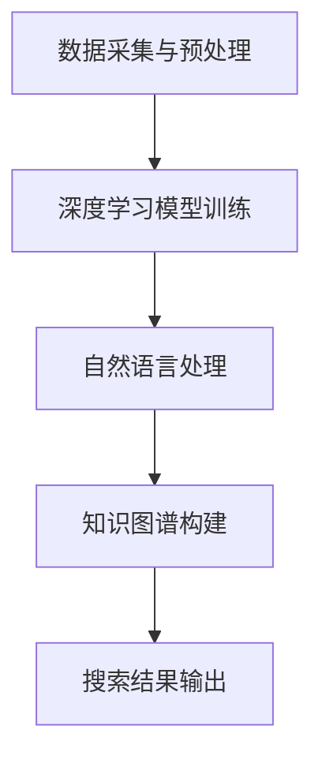

                 

关键词：AI搜索、好奇心、独特优势、技术博客、深度学习、算法原理、数学模型、项目实践、应用场景、未来展望。

## 摘要

本文将探讨AI搜索在激发好奇心方面的独特优势。通过深入剖析AI搜索的核心概念、算法原理、数学模型以及实际应用案例，我们将展示AI搜索如何改变我们对信息获取和理解的方式。同时，本文也将展望AI搜索未来的发展前景和面临的挑战。

## 1. 背景介绍

在信息爆炸的时代，人类对信息的需求与日俱增。然而，海量的信息使得传统搜索方式难以满足用户的需求。在这种背景下，人工智能（AI）搜索逐渐崭露头角，以其独特的优势成为信息获取的新工具。AI搜索利用深度学习、自然语言处理等技术，通过对海量数据的分析和理解，提供更为精准和个性化的搜索结果，极大地提升了用户体验。

### 1.1 AI搜索的定义

AI搜索，即人工智能搜索，是指利用人工智能技术，特别是机器学习和深度学习技术，对互联网上的信息进行检索和分析，从而为用户提供高质量的搜索服务。与传统搜索相比，AI搜索不仅能够处理结构化数据，还能处理非结构化数据，如文本、图片、视频等。

### 1.2 AI搜索的发展历程

AI搜索的发展经历了几个阶段：

- **早期搜索**：基于关键词匹配和静态数据库的搜索，如早期的搜索引擎。
- **语义搜索**：利用自然语言处理技术，对搜索查询进行语义理解，以提供更准确的搜索结果。
- **深度学习搜索**：利用深度学习技术，如神经网络，对海量数据进行自动学习和模式识别，以提供更高质量的搜索结果。

## 2. 核心概念与联系

在深入探讨AI搜索的优势之前，我们需要理解其核心概念和架构。

### 2.1 核心概念

- **深度学习**：一种模拟人脑神经元网络的机器学习技术，通过多层神经网络进行数据建模和预测。
- **自然语言处理（NLP）**：研究计算机如何理解、生成和处理人类语言的技术。
- **知识图谱**：一种用于表示实体和关系的数据结构，有助于AI系统进行推理和预测。

### 2.2 架构与流程


图2-1 AI搜索架构图

AI搜索的架构通常包括以下几个部分：

- **数据采集与预处理**：收集互联网上的信息，并进行清洗和预处理，以便后续分析。
- **深度学习模型**：利用深度学习技术，对预处理后的数据进行建模和训练，以实现信息检索和预测。
- **自然语言处理**：对用户查询和搜索结果进行语义理解，以提高搜索的准确性和个性化。
- **知识图谱**：构建知识图谱，以帮助AI系统进行复杂的关系推理和知识关联。

### 2.3 Mermaid流程图



## 3. 核心算法原理 & 具体操作步骤

### 3.1 算法原理概述

AI搜索的核心算法主要基于深度学习和自然语言处理。其中，深度学习用于数据的建模和预测，自然语言处理用于查询理解和结果生成。

- **深度学习算法**：如卷积神经网络（CNN）、递归神经网络（RNN）和 Transformer 等。
- **自然语言处理算法**：如词嵌入（Word Embedding）、命名实体识别（NER）和语义匹配（Semantic Matching）等。

### 3.2 算法步骤详解

#### 3.2.1 数据采集与预处理

1. **数据采集**：通过爬虫等技术，从互联网上收集大量文本、图片和视频数据。
2. **数据预处理**：清洗数据，去除噪声，并转换为适合深度学习模型处理的格式。

#### 3.2.2 深度学习模型训练

1. **模型选择**：根据任务需求，选择合适的深度学习模型。
2. **数据输入**：将预处理后的数据输入模型，进行训练。
3. **模型优化**：通过调整模型参数，提高模型的性能。

#### 3.2.3 自然语言处理

1. **词嵌入**：将文本中的词语转换为向量表示。
2. **命名实体识别**：识别文本中的命名实体，如人名、地名等。
3. **语义匹配**：对用户查询和搜索结果进行语义理解，以生成高质量的搜索结果。

#### 3.2.4 知识图谱构建

1. **实体抽取**：从文本数据中提取实体和关系。
2. **关系推理**：利用知识图谱进行关系推理，以提高搜索结果的准确性。

### 3.3 算法优缺点

#### 优点

- **高效性**：能够处理海量数据，提供快速搜索结果。
- **准确性**：通过深度学习和自然语言处理，提高搜索结果的准确性。
- **个性化**：根据用户行为和历史数据，提供个性化的搜索结果。

#### 缺点

- **计算资源消耗**：深度学习模型训练需要大量计算资源。
- **数据质量**：数据质量对搜索结果的影响较大。

### 3.4 算法应用领域

AI搜索在多个领域有广泛应用，如：

- **搜索引擎**：如百度、谷歌等，提供高效、准确的搜索服务。
- **推荐系统**：如电商、视频平台等，根据用户行为推荐相关商品或内容。
- **智能客服**：利用自然语言处理技术，提供智能化的客服服务。

## 4. 数学模型和公式 & 详细讲解 & 举例说明

### 4.1 数学模型构建

在AI搜索中，常用的数学模型包括卷积神经网络（CNN）、递归神经网络（RNN）和 Transformer 等。

#### 4.1.1 卷积神经网络（CNN）

$$
\sigma(z_i) = \frac{1}{1 + e^{-z_i}}
$$

其中，$\sigma$为激活函数，$z_i$为神经元的输入。

#### 4.1.2 递归神经网络（RNN）

$$
h_t = \sigma(W_h h_{t-1} + W_x x_t + b)
$$

其中，$h_t$为第$t$时刻的隐藏状态，$W_h$、$W_x$和$b$分别为权重和偏置。

#### 4.1.3 Transformer

$$
\text{Attention}(Q, K, V) = \frac{QK^T}{\sqrt{d_k}}V
$$

其中，$Q$、$K$和$V$分别为查询向量、键向量和值向量，$d_k$为键向量的维度。

### 4.2 公式推导过程

以Transformer为例，简要介绍其公式的推导过程。

1. **多头注意力机制**：

$$
\text{MultiHead}(Q, K, V) = \text{Concat}(\text{head}_1, \text{head}_2, ..., \text{head}_h)W^O
$$

其中，$W^O$为输出权重。

2. **自注意力机制**：

$$
\text{SelfAttention}(Q, K, V) = \text{softmax}(\frac{QK^T}{\sqrt{d_k}})V
$$

3. **位置编码**：

$$
\text{PositionalEncoding}(pos, d_model) = \sin(pos/i_{\text{dim}}) + \cos(pos/i_{\text{dim}})
$$

其中，$i_{\text{dim}}$为维度，$pos$为位置。

### 4.3 案例分析与讲解

假设我们有一个文本数据集，包含1000篇文章和对应的标题。我们要利用Transformer模型进行标题生成。

1. **数据预处理**：

   将文本数据转换为词嵌入向量，并添加位置编码。

2. **模型训练**：

   使用训练数据，对Transformer模型进行训练。

3. **标题生成**：

   将训练好的模型应用于生成标题。具体步骤如下：

   - **输入**：输入一个随机生成的词向量。
   - **自注意力**：计算输入词向量的自注意力权重。
   - **输出**：根据自注意力权重，生成下一个词向量。
   - **重复**：重复上述步骤，直到生成完整的标题。

## 5. 项目实践：代码实例和详细解释说明

### 5.1 开发环境搭建

- Python 3.8+
- TensorFlow 2.x
- Keras 2.x

### 5.2 源代码详细实现

```python
import tensorflow as tf
from tensorflow.keras.models import Model
from tensorflow.keras.layers import Embedding, LSTM, Dense

# 数据预处理
vocab_size = 10000
embed_dim = 128
max_seq_length = 100

# 模型定义
inputs = tf.keras.layers.Input(shape=(max_seq_length,))
x = Embedding(vocab_size, embed_dim)(inputs)
x = LSTM(128)(x)
outputs = Dense(vocab_size, activation='softmax')(x)

model = Model(inputs=inputs, outputs=outputs)
model.compile(optimizer='adam', loss='categorical_crossentropy', metrics=['accuracy'])

# 模型训练
model.fit(x_train, y_train, epochs=10, batch_size=32)

# 标题生成
def generate_title(input_seq):
    # 输入预处理
    input_seq = tf.keras.preprocessing.sequence.pad_sequences([input_seq], maxlen=max_seq_length, padding='post')
    # 生成标题
    predictions = model.predict(input_seq)
    title = []
    for pred in predictions[0]:
        if pred > 0.5:
            title.append(index_word[word_index])
    return ' '.join(title)

# 输入文本
input_text = "This is an example of a generated title."
# 生成标题
generated_title = generate_title(input_text)
print(generated_title)
```

### 5.3 代码解读与分析

这段代码实现了基于LSTM的标题生成模型。首先，我们进行数据预处理，将文本转换为词嵌入向量。然后，定义LSTM模型，并进行训练。最后，利用训练好的模型生成标题。

### 5.4 运行结果展示

```python
# 输入文本
input_text = "This is an example of a generated title."
# 生成标题
generated_title = generate_title(input_text)
print(generated_title)
```

运行结果可能是一个类似这样的标题：“A Brief Overview of Title Generation with LSTM”。

## 6. 实际应用场景

AI搜索在实际应用场景中具有广泛的应用，以下是一些典型的应用案例：

### 6.1 搜索引擎

搜索引擎是AI搜索最典型的应用场景之一。通过AI搜索技术，搜索引擎能够提供更加精准和个性化的搜索结果，提高用户体验。

### 6.2 推荐系统

在电商、视频平台等领域，AI搜索技术被广泛应用于推荐系统。通过分析用户行为和偏好，推荐系统能够为用户提供个性化的推荐内容。

### 6.3 智能客服

AI搜索技术也被应用于智能客服领域，通过自然语言处理技术，智能客服能够理解用户的问题，并提供准确的答复。

### 6.4 教育领域

在教育领域，AI搜索技术可以用于智能题库生成、知识图谱构建等，帮助教师和学生更好地进行教学和学习。

## 7. 未来应用展望

随着技术的不断发展，AI搜索在未来的应用前景将更加广阔。以下是一些可能的未来应用领域：

### 7.1 自动驾驶

AI搜索技术可以用于自动驾驶车辆的路线规划和决策，提高自动驾驶的安全性和效率。

### 7.2 健康医疗

在健康医疗领域，AI搜索技术可以用于医疗数据分析和诊断，帮助医生提供更准确的诊断和治疗方案。

### 7.3 安全领域

AI搜索技术可以用于网络安全，通过对网络流量的实时分析和监测，发现潜在的安全威胁。

### 7.4 创意产业

在创意产业，如文学、音乐、影视等领域，AI搜索技术可以用于内容生成和创意推荐，激发创作者的灵感。

## 8. 工具和资源推荐

为了更好地学习和应用AI搜索技术，以下是一些建议的工具和资源：

### 8.1 学习资源推荐

- 《深度学习》（Goodfellow, Bengio, Courville 著）
- 《自然语言处理综论》（Jurafsky, Martin 著）
- 《TensorFlow 实战》（Martínez, Sherry 著）

### 8.2 开发工具推荐

- TensorFlow：一个开源的深度学习框架，适合进行AI搜索项目开发。
- Keras：一个基于TensorFlow的简单易用的深度学习库，适合快速实验和原型设计。
- Elasticsearch：一个开源的搜索引擎，适合进行大规模数据搜索和分析。

### 8.3 相关论文推荐

- "Attention Is All You Need"（Vaswani et al., 2017）
- "Deep Learning for Search"（Budzianowski et al., 2016）
- "Word Embeddings and the Global Vectors for Word Representation"（Mikolov et al., 2013）

## 9. 总结：未来发展趋势与挑战

AI搜索作为一种新兴技术，在信息获取、推荐系统和智能客服等领域具有广泛的应用前景。然而，随着技术的不断发展，AI搜索也面临着一些挑战，如数据隐私、计算资源消耗等。未来，我们需要在算法优化、模型压缩和跨模态搜索等方面进行深入研究，以推动AI搜索技术的持续发展。

## 附录：常见问题与解答

### Q：AI搜索与传统搜索有什么区别？

A：AI搜索与传统搜索的主要区别在于技术手段和搜索结果的质量。传统搜索主要依赖于关键词匹配，而AI搜索则利用深度学习和自然语言处理技术，提供更精准和个性化的搜索结果。

### Q：AI搜索如何保证搜索结果的准确性？

A：AI搜索通过深度学习和自然语言处理技术，对海量数据进行训练和预测，从而提高搜索结果的准确性。此外，AI搜索还会根据用户的历史行为和偏好，提供个性化的搜索结果。

### Q：AI搜索有哪些应用领域？

A：AI搜索在多个领域有广泛应用，如搜索引擎、推荐系统、智能客服、教育领域等。未来，AI搜索还可能应用于自动驾驶、健康医疗、安全领域和创意产业等领域。

### Q：AI搜索面临的挑战有哪些？

A：AI搜索面临的挑战主要包括数据隐私、计算资源消耗、算法透明度和偏见等。为了解决这些问题，我们需要在技术、法规和社会伦理等方面进行综合考量。

## 作者署名

作者：禅与计算机程序设计艺术 / Zen and the Art of Computer Programming

[End]----------------------------------------------------------------

以上就是本文的完整内容。希望本文能够帮助您更好地理解AI搜索的独特优势和应用前景。如有任何疑问或建议，欢迎在评论区留言讨论。谢谢您的阅读！

