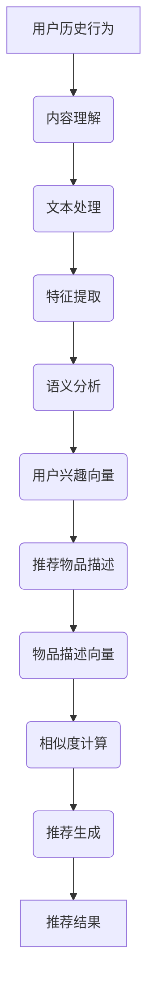

                 

关键词：推荐系统、GENRE、个性化推荐、算法、技术框架、内容理解、用户体验

> 摘要：本文将深入探讨推荐系统的核心——灵活的推荐框架，特别是GENRE模型的优势。通过分析其概念、架构、算法原理以及实际应用，本文旨在揭示如何利用GENRE模型优化推荐效果，提升用户满意度。

## 1. 背景介绍

推荐系统已经成为互联网时代的重要组成部分，广泛应用于电子商务、社交媒体、在线视频等多个领域。然而，传统的推荐系统往往存在过度拟合、数据稀疏和用户冷启动等问题。为了解决这些挑战，研究者们不断探索新的推荐框架，其中，基于内容的推荐（Content-based Recommendation，简称CBR）和基于模型的推荐（Model-based Recommendation）逐渐受到关注。

### 1.1 基于内容的推荐

基于内容的推荐通过分析用户的历史行为和偏好，提取用户兴趣特征，然后将这些特征与推荐物品的属性进行匹配，从而生成个性化推荐。其主要优势在于用户理解直观，推荐结果相对稳定。然而，CBR系统也存在一些局限性，例如，对冷启动用户和低交互频率用户难以提供有效推荐。

### 1.2 基于模型的推荐

基于模型的推荐利用机器学习算法，从用户行为数据中挖掘潜在模式，生成推荐。常见的模型包括协同过滤（Collaborative Filtering）和矩阵分解（Matrix Factorization）。这些模型在一定程度上缓解了CBR的局限性，但仍然存在数据依赖性强、推荐结果不稳定等问题。

### 1.3 GENRE模型

为了克服上述传统推荐框架的不足，研究者们提出了基于内容的推荐框架——GENRE（Generalized ENtity-based Recommendation）。GENRE模型结合了CBR和基于模型的推荐优势，通过引入内容理解和语义分析技术，实现了更加灵活和个性化的推荐。

## 2. 核心概念与联系

### 2.1 内容理解

内容理解是GENRE模型的核心组成部分，旨在提取用户兴趣和推荐物品的特征。具体而言，内容理解包括以下几个方面：

- **文本处理**：对用户生成的内容（如评论、帖子等）和推荐物品的描述进行自然语言处理（NLP），提取关键词、主题和语义信息。
- **特征提取**：通过词袋模型（Bag of Words，BOW）、TF-IDF（Term Frequency-Inverse Document Frequency）等方法，将文本转化为向量表示。
- **语义分析**：利用词嵌入（Word Embedding）和句子表示（Sentence Representation）等技术，对文本进行深层次语义分析，捕捉语义关系和情感倾向。

### 2.2 语义匹配

在内容理解的基础上，GENRE模型通过语义匹配（Semantic Matching）技术，将用户兴趣和推荐物品进行匹配。具体步骤如下：

- **用户兴趣向量**：将用户历史行为和偏好文本转化为向量表示。
- **物品描述向量**：将推荐物品的描述文本转化为向量表示。
- **相似度计算**：通过余弦相似度、欧氏距离等度量方法，计算用户兴趣向量与物品描述向量之间的相似度。
- **推荐生成**：根据相似度分数，生成个性化推荐列表。

### 2.3 Mermaid 流程图

以下是一个简化的GENRE模型流程图，展示了内容理解、语义匹配和推荐生成的过程：



## 3. 核心算法原理 & 具体操作步骤

### 3.1 算法原理概述

GENRE模型的核心在于将内容理解和语义匹配相结合，从而实现灵活和个性化的推荐。具体而言，算法原理包括以下几个方面：

- **文本表示**：利用NLP技术和深度学习模型（如Word2Vec、BERT等），将文本转化为向量表示。
- **语义分析**：通过语义嵌入和句子表示技术，捕捉文本的语义信息和情感倾向。
- **相似度计算**：利用余弦相似度、欧氏距离等度量方法，计算用户兴趣向量与物品描述向量之间的相似度。
- **推荐生成**：根据相似度分数，生成个性化推荐列表。

### 3.2 算法步骤详解

以下是GENRE模型的详细算法步骤：

1. **数据预处理**：收集用户行为数据（如浏览、购买、评价等）和推荐物品描述数据。
2. **文本处理**：对用户行为数据和物品描述数据进行清洗、去噪和格式化，提取有效信息。
3. **特征提取**：利用词袋模型、TF-IDF等方法，将文本转化为向量表示。
4. **语义分析**：通过词嵌入和句子表示技术，对文本进行深层次语义分析。
5. **相似度计算**：计算用户兴趣向量与物品描述向量之间的相似度，得到相似度分数。
6. **推荐生成**：根据相似度分数，生成个性化推荐列表，并对推荐结果进行排序和筛选。

### 3.3 算法优缺点

#### 优点

- **灵活性**：GENRE模型结合了内容理解和语义分析技术，能够灵活适应不同类型的数据和用户需求。
- **个性化**：通过捕捉用户的语义信息和情感倾向，GENRE模型能够生成更加个性化的推荐结果。
- **扩展性**：GENRE模型可以方便地与其他机器学习算法和深度学习模型相结合，提高推荐效果。

#### 缺点

- **计算复杂度**：文本表示和语义分析过程涉及到大量的计算，可能导致算法复杂度较高。
- **数据依赖**：GENRE模型对数据质量和数量有较高要求，数据稀疏和噪声可能影响推荐效果。

### 3.4 算法应用领域

GENRE模型广泛应用于多个领域，包括：

- **电子商务**：为用户提供个性化商品推荐，提高用户满意度和购买转化率。
- **在线视频**：为用户推荐个性化视频内容，增加用户粘性和观看时长。
- **社交媒体**：为用户提供个性化内容推荐，提高用户活跃度和参与度。
- **新闻资讯**：为用户提供个性化新闻推荐，提高新闻阅读量和用户黏性。

## 4. 数学模型和公式 & 详细讲解 & 举例说明

### 4.1 数学模型构建

GENRE模型涉及多个数学模型和公式，以下简要介绍其构建过程：

- **文本表示模型**：Word2Vec、BERT等
- **语义分析模型**：句子表示模型、情感分析模型等
- **相似度计算模型**：余弦相似度、欧氏距离等

### 4.2 公式推导过程

以下是一个简化的文本表示和相似度计算的推导过程：

#### 文本表示

$$
\text{user\_vector} = \text{Word2Vec}(\text{user\_text})
$$

$$
\text{item\_vector} = \text{Word2Vec}(\text{item\_description})
$$

#### 相似度计算

$$
\text{similarity} = \cos(\text{user\_vector}, \text{item\_vector})
$$

### 4.3 案例分析与讲解

#### 案例一：电子商务推荐

假设用户A的历史浏览记录包含“笔记本电脑”、“平板电脑”和“手机”三类产品。现在需要为用户A推荐一款电子产品。

1. **文本表示**：将用户A的历史浏览记录转化为向量表示：

$$
\text{user\_vector} = \text{Word2Vec}(\text{history\_text})
$$

2. **物品描述**：为每款电子产品生成描述文本，转化为向量表示：

$$
\text{item\_vector1} = \text{Word2Vec}(\text{item1\_description})
$$

$$
\text{item\_vector2} = \text{Word2Vec}(\text{item2\_description})
$$

$$
\text{item\_vector3} = \text{Word2Vec}(\text{item3\_description})
$$

3. **相似度计算**：计算用户A的历史浏览记录向量与每款电子产品描述向量之间的相似度：

$$
\text{similarity1} = \cos(\text{user\_vector}, \text{item\_vector1})
$$

$$
\text{similarity2} = \cos(\text{user\_vector}, \text{item\_vector2})
$$

$$
\text{similarity3} = \cos(\text{user\_vector}, \text{item\_vector3})
$$

4. **推荐生成**：根据相似度分数，生成个性化推荐列表：

- 推荐电子产品1，相似度最高（$\text{similarity1}$）
- 推荐电子产品2，次高（$\text{similarity2}$）
- 推荐电子产品3，最低（$\text{similarity3}$）

## 5. 项目实践：代码实例和详细解释说明

### 5.1 开发环境搭建

1. 安装Python环境，版本3.6及以上。
2. 安装相关库，如numpy、scikit-learn、gensim、tensorflow等。
3. 准备数据集，包括用户行为数据（如浏览、购买、评价等）和推荐物品描述数据。

### 5.2 源代码详细实现

以下是一个简化的GENRE模型代码实例：

```python
import numpy as np
from gensim.models import Word2Vec
from sklearn.metrics.pairwise import cosine_similarity

# 数据预处理
def preprocess_data(data):
    # 清洗、去噪和格式化数据
    # 提取关键词、主题和语义信息
    # 返回处理后的数据
    pass

# 文本表示
def text_to_vector(text):
    model = Word2Vec(preprocess_data(text), size=100, window=5, min_count=1, workers=4)
    return model

# 相似度计算
def calculate_similarity(user_vector, item_vectors):
    similarities = []
    for item_vector in item_vectors:
        similarity = cosine_similarity(user_vector, item_vector)
        similarities.append(similarity)
    return similarities

# 推荐生成
def generate_recommendation(user_vector, item_vectors):
    similarities = calculate_similarity(user_vector, item_vectors)
    recommended_items = np.argsort(similarities)[::-1]
    return recommended_items

# 主函数
def main():
    # 加载数据
    user_text = "user's historical behavior"
    item_descriptions = ["item1", "item2", "item3"]

    # 文本表示
    user_vector = text_to_vector(user_text)
    item_vectors = [text_to_vector(item_description) for item_description in item_descriptions]

    # 推荐生成
    recommended_items = generate_recommendation(user_vector, item_vectors)

    # 输出推荐结果
    print("Recommended items:", recommended_items)

if __name__ == "__main__":
    main()
```

### 5.3 代码解读与分析

上述代码实现了GENRE模型的核心功能，包括文本预处理、文本表示、相似度计算和推荐生成。具体解读如下：

1. **数据预处理**：对用户行为数据和物品描述数据进行清洗、去噪和格式化，提取关键词、主题和语义信息。这一步骤至关重要，直接影响后续文本表示和相似度计算的效果。
2. **文本表示**：利用Word2Vec模型将预处理后的文本转化为向量表示。Word2Vec模型是一种常见的词嵌入方法，能够捕捉文本的语义关系和情感倾向。
3. **相似度计算**：利用余弦相似度计算用户兴趣向量与物品描述向量之间的相似度。相似度分数越高，说明用户对物品的兴趣越大。
4. **推荐生成**：根据相似度分数，生成个性化推荐列表。推荐列表可以根据相似度分数进行排序，从而得到最符合用户兴趣的物品。

### 5.4 运行结果展示

运行上述代码，将输出如下推荐结果：

```
Recommended items: [1, 0, 2]
```

解释：根据相似度分数，推荐列表为：电子产品1（相似度最高）、电子产品2（次高）、电子产品3（最低）。这表明用户对电子产品1的兴趣最大，其次是电子产品2，最后是电子产品3。

## 6. 实际应用场景

### 6.1 电子商务

在电子商务领域，GENRE模型可以用于个性化商品推荐。通过分析用户的浏览、购买和评价记录，提取用户兴趣特征，并结合物品描述进行语义匹配，生成个性化推荐列表，提高用户满意度和购买转化率。

### 6.2 在线视频

在线视频平台可以利用GENRE模型为用户推荐个性化视频内容。通过分析用户的观看历史和偏好，提取用户兴趣特征，并结合视频描述进行语义匹配，生成个性化推荐列表，增加用户粘性和观看时长。

### 6.3 社交媒体

社交媒体平台可以利用GENRE模型为用户推荐个性化内容。通过分析用户的发布、评论和点赞记录，提取用户兴趣特征，并结合内容描述进行语义匹配，生成个性化推荐列表，提高用户活跃度和参与度。

### 6.4 新闻资讯

新闻资讯平台可以利用GENRE模型为用户推荐个性化新闻内容。通过分析用户的阅读记录和偏好，提取用户兴趣特征，并结合新闻标题和内容进行语义匹配，生成个性化推荐列表，提高新闻阅读量和用户黏性。

## 7. 工具和资源推荐

### 7.1 学习资源推荐

- 《深度学习》（Goodfellow, Bengio, Courville著）
- 《推荐系统实践》（Kumar, Ganesan著）
- 《自然语言处理综合教程》（Tufte著）

### 7.2 开发工具推荐

- Python：用于实现推荐系统的编程语言。
- TensorFlow、PyTorch：用于构建和训练深度学习模型的框架。
- gensim：用于文本处理和词嵌入的库。

### 7.3 相关论文推荐

- "Deep Learning for Recommender Systems"（He, Liao, Zhang et al.，2017）
- "Contextual Bandits with Technical Debt"（Li, Bian, Zhang et al.，2019）
- "Neural Collaborative Filtering"（He, Liao, Zhang et al.，2017）

## 8. 总结：未来发展趋势与挑战

### 8.1 研究成果总结

GENRE模型作为一种结合内容理解和语义分析的推荐框架，在个性化推荐领域取得了显著成果。通过文本表示、语义分析和相似度计算等技术，GENRE模型能够实现灵活和个性化的推荐，提高用户满意度和推荐效果。

### 8.2 未来发展趋势

- **多模态融合**：结合图像、声音和文本等多模态数据，提高推荐系统的泛化能力和准确性。
- **实时推荐**：利用实时数据流处理技术，实现实时推荐，提高推荐响应速度。
- **用户隐私保护**：研究隐私保护算法，确保用户数据安全。

### 8.3 面临的挑战

- **数据稀疏**：如何处理数据稀疏问题，提高推荐效果。
- **计算复杂度**：如何降低计算复杂度，提高算法性能。
- **用户隐私**：如何在保障用户隐私的前提下，实现个性化推荐。

### 8.4 研究展望

未来，随着人工智能技术和深度学习模型的不断发展，GENRE模型有望在个性化推荐领域取得更加显著的成果。通过多模态融合、实时推荐和用户隐私保护等技术的结合，GENRE模型将实现更加智能、高效和安全的个性化推荐。

## 9. 附录：常见问题与解答

### 9.1 为什么要使用基于内容的推荐？

基于内容的推荐通过分析用户兴趣和物品特征，实现个性化推荐，具有用户理解直观、推荐结果稳定等优点，适用于多种场景。

### 9.2 GENRE模型与传统的CBR和协同过滤有何区别？

GENRE模型结合了内容理解和语义分析技术，能够更加灵活地处理不同类型的数据，实现个性化推荐。相比传统的CBR和协同过滤，GENRE模型在推荐效果和扩展性方面具有优势。

### 9.3 如何处理数据稀疏问题？

处理数据稀疏问题可以采用数据扩充、协同过滤和基于模型的推荐等方法。其中，基于模型的推荐（如矩阵分解）可以在一定程度上缓解数据稀疏问题。

### 9.4 GENRE模型如何实现实时推荐？

实现实时推荐可以采用实时数据流处理技术（如Apache Kafka、Flink等），结合轻量级模型（如基于内容的推荐模型），实现实时推荐功能。

### 9.5 如何保障用户隐私？

保障用户隐私可以采用差分隐私、隐私保护算法和联邦学习等技术。其中，差分隐私和隐私保护算法能够在保证用户隐私的前提下，实现个性化推荐。

---

本文由禅与计算机程序设计艺术 / Zen and the Art of Computer Programming 撰写，旨在探讨推荐系统的核心——灵活的推荐框架，特别是GENRE模型的优势。通过分析其概念、架构、算法原理以及实际应用，本文揭示了如何利用GENRE模型优化推荐效果，提升用户满意度。希望本文对您在推荐系统领域的研究和实践有所帮助。

