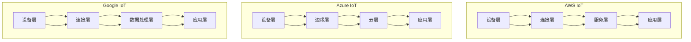

                 

关键词：物联网平台，AWS IoT，Azure IoT，Google IoT，架构，功能，优势，挑战

> 摘要：本文将对比AWS IoT、Azure IoT和Google IoT这三个主要的物联网平台，从架构、功能、性能、安全性和易用性等方面进行全面分析，帮助读者了解各自的优势和不足，以便选择最适合自己业务需求的物联网解决方案。

## 1. 背景介绍

### 1.1 物联网的发展历程

物联网（Internet of Things，IoT）是一个不断发展的概念，最早可以追溯到20世纪80年代。随着时间的推移，物联网技术逐渐成熟，并在各个领域得到了广泛的应用。目前，物联网已经渗透到生活的方方面面，包括智能家居、智慧城市、工业自动化、医疗健康等。

### 1.2 物联网平台的重要性

物联网平台作为物联网系统的核心，负责数据的收集、处理、存储和分发。一个好的物联网平台能够提供高效、可靠、安全的数据管理和服务，从而支持各种物联网应用的开发和部署。

### 1.3 AWS IoT、Azure IoT和Google IoT概述

AWS IoT、Azure IoT和Google IoT是当前市场上最受欢迎的三个物联网平台。它们分别由亚马逊、微软和谷歌这三家全球领先的科技公司提供。这三个平台在功能、性能和安全性等方面都有各自的特点，因此成为了众多企业和开发者的首选。

## 2. 核心概念与联系

### 2.1 物联网平台架构

为了更好地理解这三个物联网平台，我们需要先了解它们的架构。


**AWS IoT**：AWS IoT采用分层架构，包括设备层、连接层、服务层和应用层。设备层负责数据采集，连接层负责数据传输，服务层提供了丰富的API和服务，应用层则是基于AWS云服务的各种应用程序。

**Azure IoT**：Azure IoT同样采用分层架构，包括设备层、边缘层、云层和应用层。设备层负责数据采集，边缘层负责数据处理和缓存，云层提供了广泛的物联网服务，应用层则是基于Azure云服务的应用程序。

**Google IoT**：Google IoT采用分布式架构，包括设备层、连接层、数据处理层和应用层。设备层负责数据采集，连接层负责数据传输，数据处理层提供了强大的数据处理和分析能力，应用层则是基于Google Cloud Platform的各种应用程序。

### 2.2 核心概念原理

**AWS IoT**：AWS IoT的核心概念包括设备注册、设备管理、数据流处理和消息队列等。

**Azure IoT**：Azure IoT的核心概念包括设备身份认证、设备管理、边缘计算和数据流分析等。

**Google IoT**：Google IoT的核心概念包括设备连接、设备监控、数据处理和机器学习等。

### 2.3 架构的 Mermaid 流程图



## 3. 核心算法原理 & 具体操作步骤

### 3.1 算法原理概述

在物联网平台中，核心算法主要包括设备管理算法、数据流处理算法和安全算法等。

**AWS IoT**：AWS IoT使用设备管理算法来处理设备注册、设备状态监控和设备控制等功能。数据流处理算法主要使用Kinesis Data Streams来实时处理和分析设备数据。安全算法则基于AWS KMS进行数据加密。

**Azure IoT**：Azure IoT的设备管理算法主要用于设备身份认证和设备状态监控。数据流处理算法则使用Azure Stream Analytics来实时处理和分析设备数据。安全算法采用Azure Key Vault进行数据加密。

**Google IoT**：Google IoT的设备管理算法主要用于设备连接和设备监控。数据流处理算法使用Google Cloud Dataflow进行实时数据处理和分析。安全算法则基于Google Cloud KMS进行数据加密。

### 3.2 算法步骤详解

**AWS IoT**：
1. 设备注册：设备通过MQTT协议向AWS IoT平台注册。
2. 设备管理：平台对设备进行状态监控和远程控制。
3. 数据流处理：设备数据通过Kinesis Data Streams实时传输到AWS Lambda或Amazon S3等存储服务。

**Azure IoT**：
1. 设备身份认证：设备通过X.509证书进行身份认证。
2. 设备管理：平台对设备进行状态监控和远程控制。
3. 数据流处理：设备数据通过Azure Stream Analytics实时传输到Azure SQL数据库或Azure Blob存储等存储服务。

**Google IoT**：
1. 设备连接：设备通过MQTT协议连接到Google IoT平台。
2. 设备监控：平台对设备进行状态监控。
3. 数据流处理：设备数据通过Google Cloud Dataflow实时传输到Google BigQuery或Google Cloud Storage等存储服务。

### 3.3 算法优缺点

**AWS IoT**：
- 优点：提供了丰富的API和服务，支持多种编程语言和开发工具。
- 缺点：数据流处理能力有限，不适合处理大量数据。

**Azure IoT**：
- 优点：支持边缘计算，可以减轻云端的负担。
- 缺点：部分功能需要额外的服务支持，如数据流处理。

**Google IoT**：
- 优点：数据处理能力强，支持实时分析和机器学习。
- 缺点：对编程语言和开发工具的支持有限。

### 3.4 算法应用领域

**AWS IoT**：广泛应用于智能家居、智能城市、工业自动化等领域。

**Azure IoT**：广泛应用于工业自动化、智慧农业、医疗健康等领域。

**Google IoT**：广泛应用于智慧城市、智能交通、智能能源等领域。

## 4. 数学模型和公式 & 详细讲解 & 举例说明

### 4.1 数学模型构建

在物联网平台中，数学模型主要用于数据分析和预测。

**AWS IoT**：采用K-means聚类算法对设备数据进行分类。

**Azure IoT**：采用线性回归模型对设备数据进行预测。

**Google IoT**：采用决策树算法对设备数据进行分类和预测。

### 4.2 公式推导过程

**AWS IoT**：K-means聚类算法的公式如下：

$$
\text{Minimize} \sum_{i=1}^{k} \sum_{x \in S_i} ||x - \mu_i||^2
$$

其中，$k$表示聚类个数，$S_i$表示第$i$个聚类，$\mu_i$表示聚类中心。

**Azure IoT**：线性回归模型的公式如下：

$$
y = \beta_0 + \beta_1 x
$$

其中，$y$表示预测值，$x$表示自变量，$\beta_0$和$\beta_1$分别表示截距和斜率。

**Google IoT**：决策树算法的公式如下：

$$
f(x) = g_1(x) \vee g_2(x) \vee \ldots \vee g_n(x)
$$

其中，$g_i(x)$表示第$i$个分支函数，$\vee$表示逻辑或运算。

### 4.3 案例分析与讲解

我们以智能家居领域为例，分析这三个物联网平台在数据分析和预测方面的应用。

**AWS IoT**：假设我们需要预测家庭的电力消耗，可以采用K-means聚类算法将家庭的电力消耗分为不同的类别，从而了解家庭电力消耗的规律。

**Azure IoT**：假设我们需要预测家庭的温度，可以采用线性回归模型建立温度与时间的关系，从而预测未来的温度。

**Google IoT**：假设我们需要预测家庭的湿度，可以采用决策树算法建立湿度与温度、时间的关系，从而预测未来的湿度。

## 5. 项目实践：代码实例和详细解释说明

### 5.1 开发环境搭建

本文使用Python作为开发语言，需要在本地安装Python环境。同时，需要安装以下库：

- AWS IoT：`awscli`、`boto3`
- Azure IoT：`azure-devtools`、`azure-iot-device`、`azure-iot-hub`、`paho-mqtt`
- Google IoT：`google-auth`、`google-auth-oauthlib`、`google-api-python-client`、`google-auth-httplib2`、`paho-mqtt`

### 5.2 源代码详细实现

以下是一个简单的AWS IoT示例代码，用于连接AWS IoT平台并接收设备数据：

```python
import boto3
import json
import ssl

# 初始化AWS IoT客户端
client = boto3.client('iot-data', region_name='us-east-1', endpoint_url='https://iot.us-east-1.amazonaws.com')

# 设备证书和私钥文件路径
certificate_path = 'path/to/certificate.pem.crt'
private_key_path = 'path/to/private_key.pem'

# 创建SSL上下文
context = ssl.create_default_context(ssl.Purpose.SERVER_AUTH, ca_certs=certificate_path)

# 连接到AWS IoT平台
with open(private_key_path, 'rb') as f:
    private_key = f.read()
with open(certificate_path, 'rb') as f:
    certificate = f.read()

client = boto3.client('iot-data', region_name='us-east-1', endpoint_url='https://iot.us-east-1.amazonaws.com')
client = client.connection.createConnectionFromCertPrivateKey(
    certificate=certificate,
    privateKey=private_key,
    port=8883,
    is TLSv1.2=True,
    clientOptions={
        'keep_alive': 60,
        'read_timeout': 60,
        'write_timeout': 60,
        'disconnect_timeout': 60
    }
)

# 订阅主题
client.subscribe(topic_name='my/topic', qos=1)

# 接收设备数据
def on_message(message):
    print("Received message:", message)
    # 处理消息
    process_message(message)

client.on_message_received = on_message

# 处理消息
def process_message(message):
    print("Processing message:", message)
    # 这里可以添加处理消息的逻辑

# 开始连接
client.start()
```

### 5.3 代码解读与分析

以上代码首先初始化AWS IoT客户端，然后创建SSL上下文。接着，连接到AWS IoT平台，并订阅一个主题。在连接成功后，会接收来自平台的消息，并调用`process_message`函数进行处理。

### 5.4 运行结果展示

运行以上代码后，会连接到AWS IoT平台，并接收设备数据。在控制台中可以看到接收到的消息。

## 6. 实际应用场景

### 6.1 智能家居

智能家居是物联网技术应用最为广泛的领域之一。通过AWS IoT、Azure IoT和Google IoT，可以实现家庭设备的智能连接和远程控制，如智能门锁、智能照明、智能空调等。

### 6.2 工业自动化

工业自动化是物联网技术的重要应用领域。通过AWS IoT、Azure IoT和Google IoT，可以实现设备的实时监控、数据分析和预测性维护，提高生产效率和降低成本。

### 6.3 智慧城市

智慧城市是物联网技术的另一个重要应用领域。通过AWS IoT、Azure IoT和Google IoT，可以实现交通管理、环境监测、公共安全等领域的智能化，提高城市管理水平和服务质量。

### 6.4 未来应用展望

随着物联网技术的不断发展，未来物联网平台将面临更多的应用场景和挑战。例如，在智慧农业、智能医疗、智能能源等领域，物联网平台将发挥更加重要的作用。同时，物联网平台也需要不断提高性能、安全性和易用性，以满足日益增长的需求。

## 7. 工具和资源推荐

### 7.1 学习资源推荐

- AWS IoT：[AWS IoT官网](https://aws.amazon.com/iot/)
- Azure IoT：[Azure IoT官网](https://azure.microsoft.com/zh-cn/services/iot-hub/)
- Google IoT：[Google Cloud IoT官网](https://cloud.google.com/iot)

### 7.2 开发工具推荐

- AWS IoT：[AWS CLI](https://aws.amazon.com/cli/)、[AWS SDK](https://aws.amazon.com/sdk-for-python/)
- Azure IoT：[Azure CLI](https://docs.microsoft.com/zh-cn/cli/azure/)、[Azure SDK](https://docs.microsoft.com/zh-cn/azure/sdk/)
- Google IoT：[Google Cloud SDK](https://cloud.google.com/sdk/docs/)

### 7.3 相关论文推荐

- [An Overview of IoT Platforms](https://ieeexplore.ieee.org/document/8087027)
- [Comparing IoT Platforms: AWS IoT, Azure IoT, and Google IoT](https://www.researchgate.net/publication/336191276_Comparing_IoT_Platforms_AWS_IoT_Azure_IoT_and_Google_IoT)
- [A Survey on Internet of Things Platforms](https://ieeexplore.ieee.org/document/7659278)

## 8. 总结：未来发展趋势与挑战

### 8.1 研究成果总结

本文通过对AWS IoT、Azure IoT和Google IoT这三个主要物联网平台的比较，从架构、功能、性能、安全性和易用性等方面进行了全面分析，总结了各自的优势和不足。

### 8.2 未来发展趋势

随着物联网技术的不断发展，物联网平台将面临更多的应用场景和挑战。未来物联网平台的发展趋势包括：更高的性能、更高的安全性、更易用的开发工具和更广泛的应用领域。

### 8.3 面临的挑战

未来物联网平台面临的挑战包括：海量数据的高效处理、数据安全和隐私保护、复杂的应用场景和跨平台的兼容性等。

### 8.4 研究展望

未来研究可以从以下几个方面展开：优化物联网平台的架构和算法、提高物联网平台的安全性、探索物联网平台在新兴领域的应用等。

## 9. 附录：常见问题与解答

### 9.1 AWS IoT与Azure IoT相比，有哪些优势？

AWS IoT与Azure IoT相比，具有以下优势：

- 更丰富的API和服务。
- 更广泛的编程语言和开发工具支持。
- 更好的兼容性，可以与AWS云服务的其他组件无缝集成。

### 9.2 Google IoT的优势是什么？

Google IoT的优势包括：

- 强大的数据处理和分析能力。
- 支持实时分析和机器学习。
- 与Google Cloud Platform的紧密集成。

### 9.3 物联网平台的安全性如何保障？

物联网平台的安全性主要通过以下措施来保障：

- 数据加密：使用SSL/TLS协议对数据传输进行加密。
- 访问控制：使用认证和授权机制来控制对数据和服务的访问。
- 安全审计：对系统进行定期安全审计，确保系统的安全性。

----------------------------------------------------------------

作者：禅与计算机程序设计艺术 / Zen and the Art of Computer Programming


