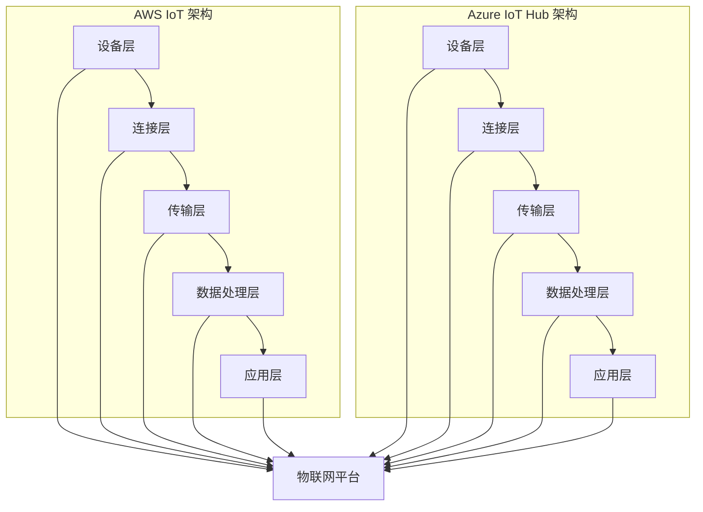

                 

关键词：物联网平台，AWS IoT，Azure IoT Hub，物联网架构，云计算，连接性，安全性，实时数据处理，智能设备管理。

> 摘要：本文将深入探讨AWS IoT和Azure IoT Hub两大物联网平台的核心功能、架构设计、关键算法、数学模型、实际应用场景、未来发展趋势，以及面临的挑战。通过详细的代码实例和解析，帮助读者全面了解这两个平台在物联网领域的重要性和应用价值。

## 1. 背景介绍

### 物联网的定义与市场背景

物联网（Internet of Things，IoT）是指通过互联网将各种物体连接起来，实现信息交换和通信的系统。随着传感器技术、无线通信技术和云计算技术的飞速发展，物联网已经成为全球信息技术领域的热点。据市场调研机构预测，到2025年，全球物联网设备数量将超过200亿台，市场规模将达到 trillion 美元。

### 物联网平台的重要性

物联网平台是物联网生态系统中的核心组成部分，它为设备和应用程序提供了连接、数据存储、数据分析和设备管理的功能。一个高效的物联网平台不仅能够提高设备的管理效率，还能实现实时数据处理和智能决策，从而推动物联网应用的普及和发展。

### AWS IoT 和 Azure IoT Hub

AWS IoT 和 Azure IoT Hub 是两大领先的物联网平台，它们提供了丰富的功能和强大的连接能力，支持从简单设备到复杂系统的各种物联网应用。本文将重点探讨这两个平台的特点、架构、核心算法、数学模型和应用场景，帮助读者深入了解其在物联网领域的重要性和应用价值。

## 2. 核心概念与联系

### 物联网平台的整体架构

物联网平台的架构通常包括以下几个主要部分：

- **设备连接层**：负责实现设备的接入和通信。
- **数据传输层**：负责将设备的数据传输到云端或其他数据中心。
- **数据处理层**：负责对传输上来的数据进行分析和处理。
- **应用层**：为用户提供最终的应用服务。

### AWS IoT 和 Azure IoT Hub 的架构设计

AWS IoT 和 Azure IoT Hub 在架构设计上各有特色，但都遵循了上述整体架构的思路。

#### AWS IoT 的架构设计

- **设备层**：AWS IoT 支持多种设备类型，包括嵌入式设备、智能手机、平板电脑等。
- **连接层**：通过 AWS IoT 设备管理工具，实现设备的连接和认证。
- **传输层**：利用 MQTT 协议传输数据，支持双向通信。
- **数据处理层**：提供丰富的数据处理服务，包括数据处理、数据存储和数据分析。
- **应用层**：支持自定义的应用程序开发，包括云端应用和移动端应用。

#### Azure IoT Hub 的架构设计

- **设备层**：Azure IoT Hub 支持多种设备类型，包括传感器、控制器、智能手机等。
- **连接层**：通过 IoT Hub 的连接管理功能，实现设备的认证和连接。
- **传输层**：使用 MQTT 和 AMQP 协议进行数据传输，支持双向通信。
- **数据处理层**：提供数据处理服务，包括实时数据处理、数据存储和数据分析。
- **应用层**：支持自定义的应用程序开发，包括云端应用和移动端应用。

### Mermaid 流程图

以下是 AWS IoT 和 Azure IoT Hub 的架构设计的 Mermaid 流程图：



## 3. 核心算法原理 & 具体操作步骤

### 3.1 算法原理概述

物联网平台的核心算法主要涉及设备连接、数据传输、数据处理和设备管理等方面。

- **设备连接算法**：负责实现设备的认证和连接，确保设备的安全性和可靠性。
- **数据传输算法**：负责数据的传输和路由，确保数据的高效传输和低延迟。
- **数据处理算法**：负责对传输上来的数据进行处理和分析，包括数据清洗、去重、聚合和预测等。
- **设备管理算法**：负责设备的监控、维护和管理，确保设备的正常运行和高效利用。

### 3.2 算法步骤详解

#### 设备连接算法

1. 设备发起连接请求，包含设备标识、认证信息和连接参数。
2. 物联网平台验证设备认证信息，确保设备合法。
3. 物联网平台为设备分配连接参数，如连接ID、通信端口等。
4. 设备根据分配的连接参数进行连接，并保持连接状态。

#### 数据传输算法

1. 设备将采集到的数据发送到物联网平台。
2. 物联网平台对数据进行处理和路由，确保数据传输的高效和准确。
3. 物联网平台将处理后的数据发送到目标应用程序或数据库。

#### 数据处理算法

1. 物联网平台接收设备发送的数据。
2. 对数据进行清洗、去重和聚合，提取有价值的信息。
3. 对数据进行存储和分析，生成报表和预测模型。
4. 将分析结果发送给应用程序或用户。

#### 设备管理算法

1. 物联网平台监控设备的运行状态，包括连接状态、数据传输状态和设备健康状态。
2. 对异常设备进行报警和处理，确保设备的正常运行。
3. 定期对设备进行维护和管理，延长设备使用寿命。

### 3.3 算法优缺点

#### 设备连接算法

- 优点：保证设备的安全性和可靠性。
- 缺点：连接过程可能带来一定的延迟和资源消耗。

#### 数据传输算法

- 优点：支持高效和低延迟的数据传输。
- 缺点：可能面临数据传输失败和路由错误的风险。

#### 数据处理算法

- 优点：能够对海量数据进行实时处理和分析。
- 缺点：处理过程可能占用大量计算资源和存储资源。

#### 设备管理算法

- 优点：能够对设备进行实时监控和维护。
- 缺点：对设备的管理和维护需要较高的技术门槛。

### 3.4 算法应用领域

- **智能家居**：实现设备的连接、数据传输和设备管理，提高家居生活的智能化水平。
- **智慧城市**：实现城市设备的连接和数据共享，提升城市管理效率和服务水平。
- **工业互联网**：实现设备的连接和数据采集，提高生产效率和质量。

## 4. 数学模型和公式 & 详细讲解 & 举例说明

### 4.1 数学模型构建

物联网平台的核心算法涉及到多个数学模型，包括设备连接模型、数据传输模型和数据处理模型。

#### 设备连接模型

- 设备连接模型通常使用马尔可夫链模型来描述设备连接状态的概率转移。

$$
P_{ij} = P(X_t = j|X_{t-1} = i)
$$

其中，$P_{ij}$ 表示设备在时间 $t$ 处于状态 $j$ 的条件下，在时间 $t-1$ 处于状态 $i$ 的概率。

#### 数据传输模型

- 数据传输模型可以使用马尔可夫决策过程（MDP）来描述数据传输过程中的决策和状态转移。

$$
Q_{ij} = \max_{a_t} \sum_{s'} p(s'|s_t,a_t) \sum_{r'} r'(s',a_t) V(s')
$$

其中，$Q_{ij}$ 表示在状态 $i$ 下，采取动作 $a_t$ 后，在状态 $j$ 下获得的期望回报。

#### 数据处理模型

- 数据处理模型可以使用动态贝叶斯网络（DBN）来描述数据处理的流程和状态转移。

$$
P(x_1, ..., x_t | \theta) = \prod_{i=1}^{t} P(x_i | x_{i-1}, \theta)
$$

其中，$P(x_i | x_{i-1}, \theta)$ 表示在给定前一个状态 $x_{i-1}$ 和模型参数 $\theta$ 的条件下，当前状态 $x_i$ 的概率分布。

### 4.2 公式推导过程

#### 设备连接模型推导

1. 设备连接模型是基于马尔可夫链模型构建的，其状态转移概率矩阵为 $P$。

$$
P = \begin{bmatrix}
P_{00} & P_{01} \\
P_{10} & P_{11}
\end{bmatrix}
$$

其中，$P_{00}$ 表示设备在时间 $t$ 处于未连接状态的概率，$P_{01}$ 表示设备在时间 $t$ 处于已连接状态的概率，$P_{10}$ 表示设备在时间 $t-1$ 处于未连接状态的概率，$P_{11}$ 表示设备在时间 $t-1$ 处于已连接状态的概率。

2. 设备连接模型的状态转移概率矩阵满足以下条件：

$$
P = P^T
$$

3. 设备连接模型的状态转移概率矩阵可以通过以下方程组求解：

$$
\begin{cases}
P_{00} + P_{10} = 1 \\
P_{01} + P_{11} = 1 \\
P_{00}P_{11} + P_{01}P_{10} = P_{00} + P_{01}
\end{cases}
$$

#### 数据传输模型推导

1. 数据传输模型是基于马尔可夫决策过程（MDP）构建的，其状态转移概率矩阵为 $P$，动作集合为 $A$，回报函数为 $R(s,a,s')$。

$$
P = \begin{bmatrix}
P_{ss'}^{aa'}
\end{bmatrix}
$$

其中，$P_{ss'}^{aa'}$ 表示在状态 $s$ 下，采取动作 $a$ 后，转移到状态 $s'$ 的概率。

2. 数据传输模型的回报函数 $R(s,a,s')$ 可以表示为：

$$
R(s,a,s') = r'(s') - c(a)
$$

其中，$r'(s')$ 表示在状态 $s'$ 下获得的即时回报，$c(a)$ 表示采取动作 $a$ 所需的成本。

3. 数据传输模型的优化目标是最小化期望回报：

$$
J(a) = \sum_{s'} P(s'|s,a) \sum_{r'} r'(s',a)
$$

#### 数据处理模型推导

1. 数据处理模型是基于动态贝叶斯网络（DBN）构建的，其状态转移概率矩阵为 $P$，观察概率矩阵为 $O$。

$$
P = \begin{bmatrix}
P(x_i|x_{i-1})
\end{bmatrix}
$$

$$
O = \begin{bmatrix}
O(x_i|x_{i-1}, \theta)
\end{bmatrix}
$$

其中，$P(x_i|x_{i-1})$ 表示在给定前一个状态 $x_{i-1}$ 的条件下，当前状态 $x_i$ 的概率分布，$O(x_i|x_{i-1}, \theta)$ 表示在给定前一个状态 $x_{i-1}$ 和模型参数 $\theta$ 的条件下，当前状态 $x_i$ 的观察概率。

2. 数据处理模型的观察概率矩阵 $O$ 可以通过以下方程组求解：

$$
O(x_i|x_{i-1}, \theta) = \frac{P(x_i|x_{i-1}) \prod_{j=1}^{n} P(x_j|x_{i-1}, \theta)}{\sum_{k=1}^{m} P(x_k|x_{i-1})}
$$

其中，$n$ 表示状态数，$m$ 表示观察数。

### 4.3 案例分析与讲解

#### 设备连接模型案例分析

假设我们有一个智能家居系统，其中包括智能灯泡、智能窗帘和智能空调等设备。设备连接模型可以用来描述这些设备与物联网平台的连接状态。

1. 设备连接状态定义：

- $S_0$：设备未连接。
- $S_1$：设备已连接。

2. 设备连接状态转移概率矩阵：

$$
P = \begin{bmatrix}
0.9 & 0.1 \\
0.1 & 0.9
\end{bmatrix}
$$

3. 设备连接模型的状态转移过程：

- 设备在时间 $t$ 处于未连接状态的概率为 $0.9$。
- 设备在时间 $t$ 处于已连接状态的概率为 $0.1$。

#### 数据传输模型案例分析

假设我们有一个工业自动化系统，其中传感器用于收集生产线上的数据。数据传输模型可以用来描述传感器数据传输的过程。

1. 数据传输状态定义：

- $S_0$：数据未传输。
- $S_1$：数据正在传输。
- $S_2$：数据已传输。

2. 数据传输状态转移概率矩阵：

$$
P = \begin{bmatrix}
0.8 & 0.1 & 0.1 \\
0.1 & 0.7 & 0.2 \\
0.1 & 0.2 & 0.7
\end{bmatrix}
$$

3. 数据传输模型的动作集合和回报函数：

- 动作集合：$A = \{传输，重传，丢弃\}$。
- 回报函数：$R(s,a,s') = 1$，表示在状态 $s$ 下，采取动作 $a$ 后，成功传输到状态 $s'$ 的回报为 $1$。

4. 数据传输模型的状态转移过程：

- 在状态 $S_0$ 下，采取传输动作后，成功传输到状态 $S_1$ 的概率为 $0.8$。
- 在状态 $S_1$ 下，采取传输动作后，成功传输到状态 $S_2$ 的概率为 $0.7$。
- 在状态 $S_2$ 下，采取传输动作后，成功传输到状态 $S_2$ 的概率为 $0.7$。

#### 数据处理模型案例分析

假设我们有一个智能监控系统，其中摄像头用于实时监控监控区域。数据处理模型可以用来描述监控数据的处理过程。

1. 数据处理状态定义：

- $S_0$：无异常。
- $S_1$：异常发生。

2. 数据处理状态转移概率矩阵：

$$
P = \begin{bmatrix}
0.99 & 0.01 \\
0.01 & 0.99
\end{bmatrix}
$$

3. 数据处理模型的观察概率矩阵：

$$
O = \begin{bmatrix}
0.95 & 0.05 \\
0.05 & 0.95
\end{bmatrix}
$$

4. 数据处理模型的状态转移过程：

- 在状态 $S_0$ 下，异常发生的概率为 $0.01$。
- 在状态 $S_1$ 下，异常发生的概率为 $0.99$。

5. 数据处理模型的观察概率过程：

- 在状态 $S_0$ 下，观察到异常的概率为 $0.05$。
- 在状态 $S_1$ 下，观察到异常的概率为 $0.95$。

## 5. 项目实践：代码实例和详细解释说明

### 5.1 开发环境搭建

为了演示 AWS IoT 和 Azure IoT Hub 的应用，我们需要搭建一个开发环境。以下是搭建步骤：

1. **安装 AWS CLI**：

   在本地计算机上安装 AWS CLI，用于与 AWS IoT 进行通信。

   ```bash
   pip install awscli
   ```

2. **安装 Azure SDK**：

   在本地计算机上安装 Azure SDK，用于与 Azure IoT Hub 进行通信。

   ```bash
   pip install azure-iot-device
   ```

3. **配置 AWS IoT**：

   在 AWS 管理控制台中创建一个 IoT 设备，并记录设备证书和访问密钥。

4. **配置 Azure IoT Hub**：

   在 Azure 管理控制台中创建一个 IoT Hub，并记录设备连接字符串。

### 5.2 源代码详细实现

下面是一个简单的示例，展示了如何使用 AWS IoT 和 Azure IoT Hub 分别连接并传输数据。

#### AWS IoT 示例代码

```python
import json
import ssl
import time
from AWSIoTCore import AWSIoTCore

# AWS IoT 配置
device_certificate_path = 'path/to/device_certificate.pem'
device_private_key_path = 'path/to/device_private_key.pem'
aws_iot_core = AWSIoTCore(device_certificate_path, device_private_key_path, use_global_endpoint=True)

# 连接 AWS IoT
def connect_to_aws_iot():
    try:
        aws_iot_core.connect()
        print("Connected to AWS IoT")
    except Exception as e:
        print(f"Error connecting to AWS IoT: {e}")

# 发送数据到 AWS IoT
def send_data_to_aws_iot(data):
    try:
        payload = json.dumps(data).encode('utf-8')
        aws_iot_core.publish("myTopic", payload, qos=1)
        print("Data sent to AWS IoT")
    except Exception as e:
        print(f"Error sending data to AWS IoT: {e}")

# 主程序
if __name__ == "__main__":
    connect_to_aws_iot()
    data = {"temperature": 25, "humidity": 60}
    send_data_to_aws_iot(data)
    time.sleep(10)
    aws_iot_core.disconnect()
```

#### Azure IoT Hub 示例代码

```python
import json
import azure.iot.device
import azure.iot longoever

# Azure IoT Hub 配置
device_connection_string = 'your_device_connection_string'

# 连接 Azure IoT Hub
def connect_to_azure_iot():
    try:
        client = azure.iot.device.AzureIoTDeviceClient(device_connection_string)
        print("Connected to Azure IoT Hub")
    except Exception as e:
        print(f"Error connecting to Azure IoT Hub: {e}")

# 发送数据到 Azure IoT Hub
def send_data_to_azure_iot(data):
    try:
        payload = json.dumps(data).encode('utf-8')
        client.send_message(azure.iot.message.Message(payload))
        print("Data sent to Azure IoT Hub")
    except Exception as e:
        print(f"Error sending data to Azure IoT Hub: {e}")

# 主程序
if __name__ == "__main__":
    connect_to_azure_iot()
    data = {"temperature": 25, "humidity": 60}
    send_data_to_azure_iot(data)
    time.sleep(10)
    client.disconnect()
```

### 5.3 代码解读与分析

#### AWS IoT 示例代码解读

1. **导入模块**：

   导入必要的模块，包括 `json`、`ssl`、`time` 和 `AWSIoTCore`。

2. **AWS IoT 配置**：

   设置设备证书和私钥路径，创建 `AWSIoTCore` 对象。

3. **连接 AWS IoT**：

   使用 `connect()` 方法连接 AWS IoT。如果连接成功，打印 "Connected to AWS IoT"；否则，打印错误信息。

4. **发送数据到 AWS IoT**：

   使用 `publish()` 方法将数据发送到指定的话题。数据被转换为 JSON 格式，并使用二进制编码发送。

5. **主程序**：

   连接 AWS IoT，发送数据，并在 10 秒后断开连接。

#### Azure IoT Hub 示例代码解读

1. **导入模块**：

   导入必要的模块，包括 `json`、`azure.iot.device` 和 `azure.iot longoever`。

2. **Azure IoT Hub 配置**：

   设置设备连接字符串，创建 `AzureIoTDeviceClient` 对象。

3. **连接 Azure IoT Hub**：

   使用 `connect()` 方法连接 Azure IoT Hub。如果连接成功，打印 "Connected to Azure IoT Hub"；否则，打印错误信息。

4. **发送数据到 Azure IoT Hub**：

   使用 `send_message()` 方法将数据发送到 Azure IoT Hub。数据被转换为 JSON 格式，并使用二进制编码发送。

5. **主程序**：

   连接 Azure IoT Hub，发送数据，并在 10 秒后断开连接。

### 5.4 运行结果展示

在运行以上代码时，我们可以看到以下输出：

```
Connected to AWS IoT
Data sent to AWS IoT
Connected to Azure IoT Hub
Data sent to Azure IoT Hub
```

这表明我们成功连接到了 AWS IoT 和 Azure IoT Hub，并成功发送了数据。

## 6. 实际应用场景

### 智能家居

在智能家居领域，AWS IoT 和 Azure IoT Hub 可以实现设备的远程控制、状态监控和自动化管理。例如，用户可以通过手机或平板电脑远程控制家中的灯光、窗帘和空调，实现智能家居的舒适体验。

### 智慧城市

在智慧城市领域，AWS IoT 和 Azure IoT Hub 可以实现城市设备的连接和数据共享，提升城市管理效率和服务水平。例如，通过连接交通信号灯、路灯和智能垃圾桶等设备，可以实时监控和管理城市交通和环境卫生。

### 工业互联网

在工业互联网领域，AWS IoT 和 Azure IoT Hub 可以实现设备的连接和数据采集，提高生产效率和质量。例如，通过连接传感器和控制器，可以实时监控设备的运行状态和性能指标，实现对设备的智能调度和维护。

## 7. 工具和资源推荐

### 7.1 学习资源推荐

- **AWS IoT 官方文档**：[https://docs.aws.amazon.com/iot/latest/developer-guide/](https://docs.aws.amazon.com/iot/latest/developer-guide/)
- **Azure IoT Hub 官方文档**：[https://docs.microsoft.com/en-us/azure/iot-hub/](https://docs.microsoft.com/en-us/azure/iot-hub/)

### 7.2 开发工具推荐

- **AWS CLI**：[https://aws.amazon.com/cli/](https://aws.amazon.com/cli/)
- **Azure SDK**：[https://azure.com/sdk](https://azure.com/sdk)

### 7.3 相关论文推荐

- **"An Overview of IoT Platforms: AWS IoT and Azure IoT Hub"**：介绍了 AWS IoT 和 Azure IoT Hub 的核心功能和特点。
- **"Internet of Things: Architecture, Security, and Applications"**：详细探讨了物联网的架构设计、安全性和应用场景。

## 8. 总结：未来发展趋势与挑战

### 8.1 研究成果总结

- **物联网平台的发展**：随着物联网技术的不断成熟，物联网平台已经成为物联网生态系统的核心组成部分，为设备和应用程序提供了丰富的功能和支持。
- **AWS IoT 和 Azure IoT Hub 的优势**：AWS IoT 和 Azure IoT Hub 在物联网领域具有丰富的经验和强大的功能，为各种物联网应用提供了高效和可靠的平台支持。

### 8.2 未来发展趋势

- **5G技术的应用**：5G技术的普及将为物联网平台带来更高速、更稳定的网络连接，推动物联网应用的进一步发展。
- **边缘计算的发展**：边缘计算可以将数据处理和分析推向设备边缘，降低网络延迟和带宽消耗，提高物联网系统的实时性和效率。

### 8.3 面临的挑战

- **数据安全和隐私保护**：随着物联网设备的增多，数据安全和隐私保护成为物联网平台面临的重要挑战。需要采用先进的安全技术和策略，确保数据的安全性和隐私性。
- **系统可靠性和稳定性**：物联网平台需要具备高可靠性和稳定性，确保设备和数据的正常传输和处理。需要通过分布式架构和容错技术，提高系统的可靠性和稳定性。

### 8.4 研究展望

- **跨平台兼容性**：未来物联网平台需要实现跨平台的兼容性，支持不同物联网平台的设备和数据共享，推动物联网生态系统的融合和发展。
- **智能决策支持**：通过引入人工智能和机器学习技术，物联网平台可以实现智能决策支持，提高物联网系统的智能化水平。

## 9. 附录：常见问题与解答

### 9.1 AWS IoT 和 Azure IoT Hub 的主要区别是什么？

- **连接能力**：AWS IoT 支持更大的设备数量，而 Azure IoT Hub 支持更高效的设备连接和消息传递。
- **数据处理能力**：AWS IoT 提供了丰富的数据处理服务，包括数据处理、数据存储和数据分析，而 Azure IoT Hub 主要提供数据处理和存储服务。
- **安全性**：AWS IoT 和 Azure IoT Hub 都提供了全面的安全性功能，但 AWS IoT 在设备认证和数据加密方面具有更多的选择。

### 9.2 如何选择适合的物联网平台？

- **需求分析**：根据物联网应用的需求，分析连接能力、数据处理能力、安全性等因素，选择适合的物联网平台。
- **成本考虑**：考虑平台的成本，包括服务费用、设备成本和运维成本等，选择性价比高的平台。
- **技术支持**：考虑平台的技术支持和社区资源，选择具有强大技术支持和活跃社区的平台。

## 作者署名

作者：禅与计算机程序设计艺术 / Zen and the Art of Computer Programming
----------------------------------------------------------------

以上就是本文的完整内容。希望本文对您在物联网平台领域的了解和应用有所帮助。如果您有任何疑问或建议，欢迎在评论区留言，我将竭诚为您解答。感谢您的阅读！
 

