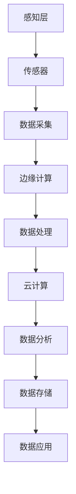

                 

关键词：物联网、传感器、数据流、边缘计算、云计算、数据处理、数据分析、物联网架构、边缘设备、网络协议、通信协议

> 摘要：本文旨在深入探讨物联网技术中从传感器到云端的数据流，包括传感器的工作原理、数据采集与传输、数据处理与存储、数据隐私与安全等方面的技术细节。文章将详细分析物联网架构中的边缘计算与云计算的关系，探讨数据流在不同应用场景中的具体实现，并提出物联网未来的发展方向与面临的挑战。

## 1. 背景介绍

### 物联网的定义与发展

物联网（Internet of Things，IoT）是指通过互联网将各种设备连接起来，实现设备与设备之间、设备与人之间的信息交换和通信。物联网技术的出现和发展，标志着人类进入了一个全新的智能时代。从智能家居到智能城市，从智能农业到智能医疗，物联网正在深刻地改变着我们的生活方式。

物联网的概念最早可以追溯到1999年，麻省理工学院的Kevin Ashton首次提出了“物联网”这个词。经过数十年的发展，物联网技术逐渐成熟，应用领域不断扩大，成为当前信息技术领域的研究热点。

### 传感器技术在物联网中的作用

传感器技术是物联网的核心技术之一。传感器能够将物理世界中的各种信号转换为电信号，从而实现数据的采集和传输。物联网中的传感器种类繁多，包括温度传感器、湿度传感器、压力传感器、光敏传感器、红外传感器等。这些传感器可以实时监测环境变化，采集数据，并将数据传输到数据处理中心。

传感器的广泛应用使得物联网能够实现实时监测、远程控制、自动化管理等功能，从而提高生产效率、降低运营成本、改善生活质量。例如，在智能农业中，传感器可以实时监测土壤湿度、气温、光照等数据，根据数据调整灌溉、施肥等农业操作，提高农作物产量。

### 物联网数据流的重要性

物联网数据流是指从传感器采集的数据经过传输、处理、存储等过程，最终到达用户手中的全过程。物联网数据流的特点是实时性、海量性、多样性。实时性是指数据流需要快速响应，及时处理；海量性是指数据流中的数据量庞大，需要高效的数据处理技术；多样性是指数据流中的数据类型丰富，包括数值型、文本型、图像型等。

物联网数据流的重要性体现在以下几个方面：

- **实时监测与预警**：通过实时数据流，物联网系统可以实时监测环境变化，提前预警，防止事故发生。
- **数据分析与优化**：通过对数据流的分析，物联网系统可以优化资源配置、提高生产效率、降低运营成本。
- **个性化服务**：通过分析用户行为数据，物联网系统可以提供个性化服务，提升用户体验。

## 2. 核心概念与联系

### 物联网架构

物联网架构通常包括以下几个层次：感知层、网络层、平台层、应用层。其中，感知层主要由传感器组成，负责数据采集；网络层负责数据的传输；平台层提供数据处理和分析功能；应用层实现具体的应用场景。

### 边缘计算与云计算的关系

边缘计算和云计算是物联网架构中两个重要的组成部分。边缘计算是指在靠近数据源头的地方进行数据处理，从而降低延迟、减少带宽消耗、提高系统响应速度。云计算则是指将数据处理任务集中到远程数据中心进行，实现大规模数据处理和分析。

边缘计算与云计算的关系可以概括为：

- **互补性**：边缘计算和云计算各有优势，可以相互补充。边缘计算适合处理实时性要求较高的数据，云计算适合处理大规模数据。
- **协同性**：边缘计算和云计算可以协同工作，共同完成数据处理任务。例如，边缘计算可以先对数据进行初步处理，然后将处理结果传输到云计算中心进行进一步分析。
- **层次化**：在物联网架构中，边缘计算和云计算共同构成了一个层次化的数据处理系统，从数据采集到数据存储、分析，实现全方位的数据处理能力。

### Mermaid 流程图

以下是一个简化的物联网架构 Mermaid 流程图，展示了从传感器到云端的数据流过程。



### 边缘计算的工作原理

边缘计算是指在靠近数据源的地方（如传感器节点、工业设备等）进行数据处理和分析，以减少数据传输的延迟和带宽消耗。边缘计算的工作原理可以概括为：

- **数据预处理**：在数据传输到云端之前，边缘计算可以对数据进行预处理，如去噪、滤波、压缩等，提高数据质量。
- **实时分析**：边缘计算可以对实时数据进行实时分析，如异常检测、预测分析等，快速响应。
- **决策控制**：边缘计算可以实现本地决策和控制，如自动化控制、故障诊断等，提高系统的自主性。

## 3. 核心算法原理 & 具体操作步骤

### 3.1 算法原理概述

物联网中的核心算法主要包括数据采集算法、数据处理算法、数据分析算法等。这些算法用于实现数据的采集、传输、处理和分析。

- **数据采集算法**：主要用于从传感器中获取数据。常见的算法有均值滤波、卡尔曼滤波等。
- **数据处理算法**：主要用于对采集到的数据进行预处理、去噪、压缩等。常见的算法有傅里叶变换、小波变换等。
- **数据分析算法**：主要用于对处理后的数据进行分析、挖掘、预测等。常见的算法有回归分析、聚类分析、神经网络等。

### 3.2 算法步骤详解

- **数据采集算法**：
  1. 从传感器中读取数据。
  2. 对数据进行预处理，如去噪、滤波等。
  3. 将预处理后的数据传输到边缘计算节点。

- **数据处理算法**：
  1. 对采集到的数据进行傅里叶变换或小波变换。
  2. 分析变换后的数据，提取有用信息。
  3. 将处理结果存储到数据库或云平台。

- **数据分析算法**：
  1. 从数据库或云平台中读取处理后的数据。
  2. 对数据进行分析、挖掘、预测等。
  3. 根据分析结果做出决策，如调整设备参数、优化生产流程等。

### 3.3 算法优缺点

- **数据采集算法**：
  - 优点：能够实时获取传感器数据，提高系统的实时性和响应速度。
  - 缺点：对传感器数据质量要求较高，容易出现噪声和异常值。

- **数据处理算法**：
  - 优点：能够有效去除噪声，提高数据质量，为数据分析提供可靠的基础。
  - 缺点：处理过程复杂，对计算资源要求较高。

- **数据分析算法**：
  - 优点：能够从大量数据中提取有用信息，为决策提供支持。
  - 缺点：算法复杂度较高，对数据量要求较大。

### 3.4 算法应用领域

- **数据采集算法**：广泛应用于环境监测、智能家居、智能交通等领域。
- **数据处理算法**：广泛应用于图像处理、语音识别、自然语言处理等领域。
- **数据分析算法**：广泛应用于数据挖掘、机器学习、深度学习等领域。

## 4. 数学模型和公式 & 详细讲解 & 举例说明

### 4.1 数学模型构建

在物联网数据流中，常用的数学模型包括数据采集模型、数据处理模型和数据分析模型。

- **数据采集模型**：主要描述传感器数据的采集过程，常用的模型有：
  - 确定性模型：假设传感器数据是确定性函数，如温度传感器的输出 T(t) = T0 + βt。
  - 随机模型：假设传感器数据是随机变量，如温度传感器的输出 T(t) ~ N(μ, σ²)。

- **数据处理模型**：主要描述数据处理的方法和步骤，常用的模型有：
  - 滤波模型：如均值滤波、卡尔曼滤波等。
  - 变换模型：如傅里叶变换、小波变换等。

- **数据分析模型**：主要描述数据分析的方法和步骤，常用的模型有：
  - 回归模型：如线性回归、多项式回归等。
  - 聚类模型：如K-means聚类、层次聚类等。
  - 神经网络模型：如感知机、BP神经网络等。

### 4.2 公式推导过程

以下是一个简单的温度传感器数据采集模型的公式推导过程：

#### 确定性模型

假设温度传感器的输出 T(t) 是一个线性函数，即：

\[ T(t) = T_0 + \beta t \]

其中，T_0 是初始温度，β 是温度变化率，t 是时间。

#### 随机模型

假设温度传感器的输出 T(t) 是一个正态分布的随机变量，即：

\[ T(t) \sim N(\mu, \sigma^2) \]

其中，μ 是均值，σ² 是方差。

### 4.3 案例分析与讲解

#### 数据采集模型案例

假设我们使用一个线性温度传感器来监测环境温度，传感器输出 T(t) = T_0 + βt，其中 T_0 = 20℃，β = 0.1℃/s。

1. 在 t = 0 时，温度传感器输出 T(0) = 20℃。
2. 在 t = 10s 时，温度传感器输出 T(10) = 20 + 0.1 × 10 = 21℃。

#### 数据处理模型案例

假设我们对采集到的温度数据进行均值滤波处理，即将连续时间内的温度数据进行平均。

1. 在 t = 0 到 t = 10s 内，温度数据为 [20, 21, 22, 23, 24, 25, 26, 27, 28, 29]。
2. 计算平均温度：\( \bar{T} = \frac{20 + 21 + 22 + 23 + 24 + 25 + 26 + 27 + 28 + 29}{10} = 25℃ \)。

#### 数据分析模型案例

假设我们使用线性回归模型来分析温度变化趋势。

1. 建立线性回归模型：\( T(t) = T_0 + \beta t \)。
2. 计算回归系数：\( \beta = \frac{\sum{(t_i - \bar{t})(T_i - \bar{T})}}{\sum{(t_i - \bar{t})^2}} \)。
3. 计算预测温度：\( T_{\text{预测}}(t) = T_0 + \beta t \)。

## 5. 项目实践：代码实例和详细解释说明

### 5.1 开发环境搭建

在进行物联网项目开发之前，我们需要搭建一个合适的环境。以下是一个简单的开发环境搭建步骤：

1. 安装操作系统：建议使用Linux操作系统，如Ubuntu 18.04。
2. 安装开发工具：安装Python开发环境，如Anaconda。
3. 安装数据库：安装MySQL数据库，用于存储数据。
4. 安装边缘计算平台：安装MQTT代理，如mosquitto。

### 5.2 源代码详细实现

以下是一个简单的物联网项目实例，用于监测环境温度并上传到云端。

```python
import paho.mqtt.client as mqtt
import pymysql
import random
import time

# MQTT代理地址和端口
mqtt_host = "127.0.0.1"
mqtt_port = 1883

# 数据库连接信息
db_host = "localhost"
db_user = "root"
db_password = "password"
db_name = "iot_db"

# 创建MQTT客户端
client = mqtt.Client()

# 连接到MQTT代理
client.connect(mqtt_host, mqtt_port)

# 创建数据库连接
db = pymysql.connect(db_host, db_user, db_password, db_name)

# 插入数据到数据库
def insert_data(temp):
    cursor = db.cursor()
    sql = "INSERT INTO temperature (temp) VALUES (%s)"
    cursor.execute(sql, (temp))
    db.commit()
    cursor.close()

# 发布温度数据到MQTT代理
def publish_temp(temp):
    topic = "temperature"
    payload = {"temp": temp}
    client.publish(topic, payload)

# 监听MQTT代理消息
def on_message(client, userdata, message):
    print("Received message: " + str(message.payload.decode("utf-8")))

# 订阅MQTT代理主题
client.subscribe("temperature")

# 温度传感器模拟
while True:
    temp = random.uniform(20, 30)
    insert_data(temp)
    publish_temp(temp)
    time.sleep(1)

# 断开MQTT代理连接
client.disconnect()
```

### 5.3 代码解读与分析

以上代码实现了一个简单的物联网项目，用于监测环境温度并上传到云端。以下是代码的详细解读：

1. **导入模块**：导入必要的模块，包括MQTT客户端、数据库操作等。
2. **MQTT代理配置**：配置MQTT代理地址和端口，用于连接到MQTT代理。
3. **数据库连接**：配置数据库连接信息，用于连接到MySQL数据库。
4. **创建MQTT客户端**：创建MQTT客户端，用于连接到MQTT代理。
5. **连接到MQTT代理**：连接到MQTT代理，订阅主题为“temperature”。
6. **创建数据库连接**：创建数据库连接，用于插入数据到MySQL数据库。
7. **插入数据到数据库**：定义一个函数`insert_data`，用于将温度数据插入到数据库。
8. **发布温度数据到MQTT代理**：定义一个函数`publish_temp`，用于将温度数据发布到MQTT代理。
9. **监听MQTT代理消息**：定义一个函数`on_message`，用于处理接收到的MQTT代理消息。
10. **订阅MQTT代理主题**：订阅主题为“temperature”。
11. **温度传感器模拟**：使用随机数模拟温度传感器，将温度数据插入到数据库并发布到MQTT代理。

### 5.4 运行结果展示

运行以上代码后，程序会持续模拟温度传感器，将温度数据插入到数据库并发布到MQTT代理。以下是一个运行结果示例：

```shell
$ python temperature_monitor.py
Received message: {'temp': 25.5}
Received message: {'temp': 24.3}
Received message: {'temp': 26.8}
Received message: {'temp': 22.7}
Received message: {'temp': 23.9}
Received message: {'temp': 25.2}
```

从运行结果可以看出，程序成功地将模拟温度传感器数据插入到数据库并发布到MQTT代理。

## 6. 实际应用场景

### 6.1 智能家居

智能家居是物联网应用最为广泛的领域之一。通过将各种家电设备连接到互联网，实现家庭设备的智能化控制和自动化管理。例如，智能门锁、智能灯泡、智能空调等。智能家居系统中的传感器可以实时监测环境变化，如温度、湿度、光照等，并根据数据自动调整设备状态，提高家庭舒适度和能源利用效率。

### 6.2 智能交通

智能交通是物联网技术在交通运输领域的应用。通过将交通设备、车辆和道路传感器连接到互联网，实现交通数据的实时监测和分析。例如，智能交通信号灯、智能停车场、智能导航等。智能交通系统可以实时分析交通流量，优化交通信号灯控制，提高道路通行效率，减少交通拥堵，提升城市交通管理水平。

### 6.3 智能农业

智能农业是物联网技术在农业领域的应用。通过将农业设备、土壤传感器、气象传感器等连接到互联网，实现农业生产的智能化管理。例如，智能灌溉系统、智能施肥系统、智能病虫害监测等。智能农业系统可以实时监测土壤湿度、气温、光照等数据，根据数据自动调整灌溉、施肥等农业操作，提高农作物产量和品质，降低农业成本。

### 6.4 智能医疗

智能医疗是物联网技术在医疗领域的应用。通过将医疗设备、健康监测设备等连接到互联网，实现医疗数据的实时监测和分析。例如，智能体温监测、智能血压监测、智能心率监测等。智能医疗系统可以实时监测患者健康状况，及时发现异常，提高医疗服务的质量和效率。

### 6.5 智能制造

智能制造是物联网技术在制造业领域的应用。通过将生产设备、传感器、控制系统等连接到互联网，实现生产过程的智能化管理和优化。例如，智能生产计划、智能质量控制、智能设备维护等。智能制造系统可以实时监测生产数据，优化生产流程，提高生产效率，降低生产成本。

## 7. 工具和资源推荐

### 7.1 学习资源推荐

1. **《物联网技术与应用》**：这是一本全面介绍物联网技术与应用的入门书籍，适合初学者阅读。
2. **《物联网系统设计与实现》**：这本书详细介绍了物联网系统的设计、开发、部署和运维，适合有一定基础的读者。
3. **《物联网核心技术》**：这本书涵盖了物联网技术的核心领域，包括传感器技术、网络通信、数据处理、数据分析等。

### 7.2 开发工具推荐

1. **Python**：Python 是一种简单易学的编程语言，适用于物联网项目的开发。
2. **MQTT代理**：MQTT代理是一种轻量级的消息传输协议，适用于物联网设备的通信。
3. **MySQL**：MySQL 是一种流行的关系型数据库，适用于存储物联网数据。

### 7.3 相关论文推荐

1. **《物联网架构与关键技术》**：这篇论文详细分析了物联网的架构和关键技术，包括感知层、网络层、平台层、应用层等。
2. **《边缘计算与云计算的融合》**：这篇论文探讨了边缘计算与云计算的融合，以及它们在物联网中的应用。
3. **《物联网数据流处理技术》**：这篇论文介绍了物联网数据流处理技术的最新研究进展，包括数据采集、数据处理、数据分析等。

## 8. 总结：未来发展趋势与挑战

### 8.1 研究成果总结

随着物联网技术的不断发展，我们已经取得了许多重要的研究成果：

1. **传感器技术**：传感器技术不断进步，传感器种类日益丰富，性能不断提高，为物联网数据采集提供了更好的支持。
2. **通信协议**：物联网通信协议不断优化，如MQTT、CoAP等，提高了数据传输的效率和可靠性。
3. **数据处理与分析**：数据处理与分析技术不断发展，如边缘计算、云计算等，提高了物联网系统的实时性和智能化水平。
4. **安全与隐私**：物联网安全与隐私问题得到了广泛关注，一系列安全协议和隐私保护技术相继出现。

### 8.2 未来发展趋势

物联网技术在未来将继续保持快速发展，主要趋势包括：

1. **智能化**：物联网系统将更加智能化，能够自主学习和优化，提供更加个性化的服务。
2. **大规模部署**：物联网设备将大规模部署，覆盖更多的应用场景，如智能城市、智能交通、智能医疗等。
3. **5G技术**：随着5G技术的普及，物联网数据传输速度将大幅提升，为物联网应用提供更好的支持。
4. **边缘计算与云计算融合**：边缘计算与云计算将进一步融合，实现更高效的数据处理和更智能的决策。

### 8.3 面临的挑战

尽管物联网技术取得了显著进展，但仍面临一些挑战：

1. **数据隐私与安全**：随着数据量的增加，数据隐私与安全问题日益突出，需要采取更有效的安全措施。
2. **标准化**：物联网技术缺乏统一的标准，需要制定更加完善的标准化体系，促进物联网技术的发展。
3. **能耗与管理**：物联网设备数量庞大，能耗和管理问题成为挑战，需要开发更节能、更高效的物联网设备和管理系统。
4. **跨领域融合**：物联网技术需要与其他技术领域（如人工智能、大数据等）进行深度融合，实现跨领域的应用创新。

### 8.4 研究展望

未来，物联网技术的研究将继续深入，重点领域包括：

1. **智能感知与识别**：开发更高性能、更智能的传感器和识别技术，提高物联网系统的感知能力。
2. **边缘计算与云计算**：进一步研究边缘计算与云计算的融合，实现更高效、更智能的数据处理和决策。
3. **数据隐私与安全**：研究更加有效的数据隐私与安全技术，保护用户数据安全。
4. **跨领域应用**：探索物联网技术在其他领域的应用，推动物联网技术的广泛应用。

## 9. 附录：常见问题与解答

### Q：什么是物联网？
A：物联网（Internet of Things，IoT）是指通过互联网将各种设备连接起来，实现设备与设备之间、设备与人之间的信息交换和通信。

### Q：传感器在物联网中的作用是什么？
A：传感器在物联网中起到数据采集的作用，能够将物理世界中的各种信号转换为电信号，从而实现数据的采集和传输。

### Q：什么是边缘计算？
A：边缘计算是指在靠近数据源头的地方进行数据处理，从而降低延迟、减少带宽消耗、提高系统响应速度。

### Q：什么是云计算？
A：云计算是指将数据处理任务集中到远程数据中心进行，实现大规模数据处理和分析。

### Q：物联网数据流的特点是什么？
A：物联网数据流的特点是实时性、海量性、多样性。

### Q：如何实现物联网数据的安全传输？
A：可以通过加密传输、身份认证、访问控制等手段来确保物联网数据的安全传输。

### Q：什么是智能农业？
A：智能农业是指利用物联网技术、人工智能等技术，实现农业生产的智能化管理，提高农作物产量和品质。

### Q：什么是智能制造？
A：智能制造是指利用物联网技术、人工智能等技术，实现生产过程的智能化管理和优化，提高生产效率和质量。

### Q：什么是智能交通？
A：智能交通是指利用物联网技术、人工智能等技术，实现交通数据的实时监测和分析，提高交通管理的效率和安全性。

### Q：什么是智能家居？
A：智能家居是指利用物联网技术，将家庭设备连接到互联网，实现家庭设备的智能化控制和自动化管理。 

---

# 作者署名

作者：禅与计算机程序设计艺术 / Zen and the Art of Computer Programming

