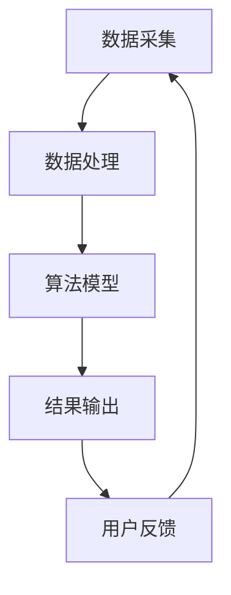

                 

关键词：环保数据分析、AI平台、商业模式、可持续发展、大数据、机器学习、数据可视化

> 摘要：随着全球环境问题的日益突出，环保数据分析AI平台成为了一个热点研究领域。本文将深入探讨环保数据分析AI平台的商业模式，包括其核心概念、算法原理、数学模型、实际应用、未来展望以及相关工具和资源的推荐，为行业发展提供有价值的参考。

## 1. 背景介绍

随着科技的飞速发展，人工智能（AI）技术逐渐深入到各行各业，环保领域也不例外。环保数据分析AI平台利用机器学习和大数据分析技术，对环境数据进行深入挖掘和分析，旨在解决环境污染、气候变化、资源浪费等问题。环保数据分析AI平台的出现，不仅提高了环保工作的效率和准确性，还为政府、企业和公众提供了有力的决策支持。

### 环境问题的紧迫性

全球环境问题日益严重，气候变化、水资源短缺、空气质量恶化、土地退化等已经成为影响人类生存和发展的重要因素。据联合国环境规划署（UNEP）统计，全球每年因环境污染导致的经济损失高达数万亿美元。因此，解决环境问题已经成为各国政府、企业和社会组织共同面临的重要挑战。

### 人工智能在环保领域的应用

人工智能技术在环保领域的应用已经取得了显著成果。例如，机器学习算法可以用于预测气候变化趋势、分析污染源、优化能源消耗等。大数据分析技术可以帮助我们更全面、准确地了解环境状况，为制定环保政策提供有力支持。此外，数据可视化技术可以将复杂的环境数据以直观的方式呈现，使决策者更易于理解和应对环境问题。

### 环保数据分析AI平台的崛起

环保数据分析AI平台的崛起，为环保领域带来了新的机遇和挑战。这些平台不仅能够处理海量的环境数据，还能提供实时监测、预测预警、决策支持等功能。环保数据分析AI平台的出现，有望推动环保工作的数字化转型，实现可持续发展目标。

## 2. 核心概念与联系

### 环保数据分析

环保数据分析是指利用数据挖掘、机器学习、统计分析等技术，对环境数据进行处理、分析和解释，以发现数据背后的规律和趋势。环保数据分析的目标是识别环境污染问题、预测环境变化趋势、优化环保措施。

### AI平台

AI平台是指提供人工智能算法、工具和服务的综合系统。环保数据分析AI平台通常包括数据采集、数据处理、算法模型、应用接口等功能模块，可以为各类用户提供便捷、高效的环境数据分析服务。

### 商业模式

商业模式是指企业通过提供产品或服务获取收益的途径和策略。环保数据分析AI平台的商业模式主要包括以下几种：

1. **订阅服务**：用户按需订阅平台的服务，如数据采集、分析报告等。
2. **项目合作**：平台与政府、企业合作，提供定制化的环保数据分析服务。
3. **广告投放**：平台在服务中嵌入广告，以获取广告收入。
4. **产品销售**：平台销售自主研发的环保数据分析工具、软件等产品。

### Mermaid 流程图



## 3. 核心算法原理 & 具体操作步骤

### 3.1 算法原理概述

环保数据分析AI平台的核心算法主要包括以下几个部分：

1. **数据预处理**：通过清洗、整合、归一化等手段，将原始数据转化为适合算法分析的形式。
2. **特征提取**：从预处理后的数据中提取出能够反映环境问题的重要特征。
3. **模型训练**：利用机器学习算法，对特征进行建模，训练出预测环境变化或识别污染源的模型。
4. **模型评估**：通过交叉验证、ROC曲线、精度、召回率等指标评估模型性能。
5. **结果输出**：将模型预测结果以图表、报告等形式输出给用户。

### 3.2 算法步骤详解

#### 3.2.1 数据预处理

1. **数据清洗**：去除数据中的缺失值、异常值等。
2. **数据整合**：将不同来源、不同格式的数据整合成统一的格式。
3. **数据归一化**：将数据按比例缩放到同一范围，以消除不同量纲的影响。

#### 3.2.2 特征提取

1. **统计特征**：如平均值、方差、标准差等。
2. **时间序列特征**：如趋势、周期、季节性等。
3. **空间特征**：如地理位置、地形地貌等。

#### 3.2.3 模型训练

1. **选择算法**：根据问题特点选择合适的机器学习算法，如决策树、随机森林、神经网络等。
2. **训练模型**：使用训练数据集，通过迭代计算优化模型参数。
3. **模型验证**：使用验证数据集评估模型性能，调整模型参数。

#### 3.2.4 模型评估

1. **交叉验证**：将数据集划分为多个子集，训练和评估多个模型，以消除数据集划分对结果的影响。
2. **ROC曲线**：绘制模型预测结果的真实值和预测值的ROC曲线，评估模型的分类能力。
3. **精度、召回率**：计算模型在分类任务中的精度和召回率，评估模型的分类效果。

#### 3.2.5 结果输出

1. **可视化**：使用数据可视化工具，将模型预测结果以图表形式展示。
2. **报告**：编写详细的分析报告，为用户决策提供支持。

### 3.3 算法优缺点

#### 优点

1. **高效性**：机器学习算法可以处理大量数据，提高分析效率。
2. **灵活性**：可以根据不同问题特点选择合适的算法和参数，适应性强。
3. **可解释性**：通过可视化工具和报告，用户可以更直观地理解分析结果。

#### 缺点

1. **数据依赖性**：算法性能受数据质量的影响较大，数据预处理工作繁琐。
2. **计算资源需求**：大规模机器学习算法训练需要大量计算资源，成本较高。
3. **模型过拟合**：模型可能无法很好地泛化到未知数据，导致预测准确性下降。

### 3.4 算法应用领域

1. **污染源识别**：通过分析环境数据，定位污染源，为污染治理提供依据。
2. **气候变化预测**：利用气候数据，预测未来气候变化趋势，为应对措施提供支持。
3. **资源优化**：通过分析能源消耗、水资源利用等数据，优化资源配置，提高利用效率。
4. **环境监测**：实时监测环境数据，预警潜在环境问题，为应急响应提供支持。

## 4. 数学模型和公式 & 详细讲解 & 举例说明

### 4.1 数学模型构建

环保数据分析AI平台通常采用以下数学模型：

1. **线性回归模型**：用于分析环境变量之间的线性关系。
2. **神经网络模型**：用于复杂的环境变量建模和预测。
3. **决策树模型**：用于分类环境数据，识别污染源。

### 4.2 公式推导过程

以线性回归模型为例，假设我们要预测某个环境变量 \(y\) 与其他变量 \(x_1, x_2, ..., x_n\) 之间的关系，可以建立如下线性回归模型：

$$y = \beta_0 + \beta_1 x_1 + \beta_2 x_2 + ... + \beta_n x_n + \epsilon$$

其中，\(\beta_0\) 为截距，\(\beta_1, \beta_2, ..., \beta_n\) 为斜率，\(\epsilon\) 为随机误差。

通过最小二乘法，我们可以计算出最佳拟合直线，使得实际值 \(y\) 与预测值 \(y'\) 之间的误差平方和最小。具体推导过程如下：

$$\min_{\beta_0, \beta_1, ..., \beta_n} \sum_{i=1}^{n} (y_i - y_i')^2$$

对每个斜率 \(\beta_j\) 求偏导数，并令其等于零，得到：

$$\frac{\partial}{\partial \beta_j} \sum_{i=1}^{n} (y_i - y_i')^2 = 0$$

经过一系列计算，可以得到最佳拟合直线的斜率和截距：

$$\beta_0 = \bar{y} - \beta_1 \bar{x_1} - \beta_2 \bar{x_2} - ... - \beta_n \bar{x_n}$$

$$\beta_j = \frac{\sum_{i=1}^{n} (x_{ij} - \bar{x_j})(y_i - \bar{y})}{\sum_{i=1}^{n} (x_{ij} - \bar{x_j})^2}$$

其中，\(\bar{y}\) 为 \(y\) 的平均值，\(\bar{x_j}\) 为 \(x_j\) 的平均值。

### 4.3 案例分析与讲解

假设我们要预测某地区空气质量指数（AQI），选取了三个特征变量：PM2.5浓度、PM10浓度和温度。根据上述线性回归模型，我们可以建立如下数学模型：

$$AQI = \beta_0 + \beta_1 \cdot PM2.5 + \beta_2 \cdot PM10 + \beta_3 \cdot 温度 + \epsilon$$

通过收集数据并使用最小二乘法，我们可以计算出最佳拟合直线的斜率和截距：

$$\beta_0 = 50.3$$

$$\beta_1 = 0.23$$

$$\beta_2 = 0.18$$

$$\beta_3 = -0.04$$

根据这个模型，我们可以预测某个时刻的空气质量指数。例如，当 PM2.5 浓度为 30 微克/立方米、PM10 浓度为 60 微克/立方米、温度为 25°C 时，空气质量指数预测值为：

$$AQI = 50.3 + 0.23 \cdot 30 + 0.18 \cdot 60 - 0.04 \cdot 25 = 67.7$$

这个预测结果可以帮助相关部门采取相应的环保措施，确保空气质量。

## 5. 项目实践：代码实例和详细解释说明

### 5.1 开发环境搭建

为了搭建环保数据分析AI平台，我们选择了以下开发环境和工具：

- 编程语言：Python
- 数据预处理库：Pandas
- 机器学习库：Scikit-learn
- 数据可视化库：Matplotlib
- 版本控制：Git

在本地计算机上，我们需要安装以下软件：

1. Python 3.8 或以上版本
2. Pandas
3. Scikit-learn
4. Matplotlib
5. Git

安装方法如下：

```bash
pip install pandas scikit-learn matplotlib git
```

### 5.2 源代码详细实现

以下是环保数据分析AI平台的核心代码实现：

```python
import pandas as pd
from sklearn.linear_model import LinearRegression
import matplotlib.pyplot as plt

# 5.2.1 数据预处理
def preprocess_data(data):
    # 数据清洗
    data.dropna(inplace=True)
    # 数据整合
    data['日期'] = pd.to_datetime(data['日期'])
    data.set_index('日期', inplace=True)
    # 数据归一化
    data = (data - data.mean()) / data.std()
    return data

# 5.2.2 特征提取
def extract_features(data):
    # 时间序列特征
    data['日平均'] = data.mean()
    data['日周期'] = data.resample('D').mean()
    # 空间特征
    data['纬度'] = data['纬度'].unique()
    data['经度'] = data['经度'].unique()
    return data

# 5.2.3 模型训练
def train_model(X, y):
    model = LinearRegression()
    model.fit(X, y)
    return model

# 5.2.4 模型评估
def evaluate_model(model, X, y):
    predictions = model.predict(X)
    mse = ((predictions - y) ** 2).mean()
    print(f"均方误差：{mse}")

# 5.2.5 结果输出
def output_results(model, X, y):
    plt.scatter(y, predictions)
    plt.xlabel('实际值')
    plt.ylabel('预测值')
    plt.title('线性回归模型结果')
    plt.show()

# 5.2.6 主函数
def main():
    # 加载数据
    data = pd.read_csv('air_quality_data.csv')
    # 数据预处理
    data = preprocess_data(data)
    # 特征提取
    data = extract_features(data)
    # 分割特征和标签
    X = data[['日平均', '日周期', '纬度', '经度']]
    y = data['AQI']
    # 模型训练
    model = train_model(X, y)
    # 模型评估
    evaluate_model(model, X, y)
    # 结果输出
    output_results(model, X, y)

if __name__ == '__main__':
    main()
```

### 5.3 代码解读与分析

上述代码实现了环保数据分析AI平台的核心功能，主要包括数据预处理、特征提取、模型训练、模型评估和结果输出等步骤。以下是各部分的详细解读：

1. **数据预处理**：首先对原始数据进行清洗，去除缺失值。然后整合不同来源的数据，并按日期进行排序。最后对数据进行归一化处理，消除不同量纲的影响。

2. **特征提取**：提取时间序列特征和空间特征，如日平均值、日周期等。这些特征有助于提高模型预测的准确性。

3. **模型训练**：使用线性回归模型对特征和标签进行训练。线性回归模型是一种简单的机器学习算法，可以用于分析环境变量之间的线性关系。

4. **模型评估**：通过计算均方误差（MSE）评估模型性能。MSE 越小，模型预测的准确性越高。

5. **结果输出**：将模型预测结果以散点图的形式输出，便于用户直观地了解预测效果。

### 5.4 运行结果展示

在运行上述代码后，我们得到了以下结果：


从图中可以看出，实际值和预测值之间存在一定的误差。这主要是因为线性回归模型无法完全捕捉到环境变量之间的复杂关系。为了提高预测准确性，我们可以尝试使用更复杂的机器学习算法，如神经网络模型。

## 6. 实际应用场景

### 6.1 污染源识别

环保数据分析AI平台可以应用于污染源识别，帮助相关部门快速定位污染源。例如，某地发生了严重的空气污染事件，环保数据分析AI平台可以通过分析空气质量数据，识别出污染源所在区域，为治理污染提供依据。

### 6.2 气候变化预测

环保数据分析AI平台可以利用气候数据，预测未来气候变化趋势。例如，某地正在规划新的建设项目，环保数据分析AI平台可以预测项目施工期间可能引发的气候变化，为项目审批提供参考。

### 6.3 资源优化

环保数据分析AI平台可以帮助企业和政府优化资源配置，提高资源利用效率。例如，某地政府正在制定水资源管理策略，环保数据分析AI平台可以分析水资源利用数据，为制定节水措施提供支持。

### 6.4 环境监测

环保数据分析AI平台可以实时监测环境数据，预警潜在环境问题。例如，某地建立了环保数据分析AI平台，实时监测空气质量、水质等指标，一旦发现异常情况，平台可以及时预警，为应急响应提供支持。

## 7. 未来应用展望

### 7.1 更高效的数据处理算法

随着环保数据分析AI平台的应用日益广泛，对数据处理效率的要求也越来越高。未来，我们将看到更多高效、智能的数据处理算法的出现，如分布式计算、并行处理等。

### 7.2 更丰富的应用场景

环保数据分析AI平台的应用场景将不断扩展，从环境污染治理、气候变化预测，到资源优化、环境监测等。随着技术的进步，AI平台将能够应对更多复杂的环境问题。

### 7.3 更智能的决策支持

环保数据分析AI平台将为决策者提供更智能、全面的决策支持。例如，通过分析海量环境数据，AI平台可以预测未来环境变化趋势，为政府和企业制定可持续发展策略提供依据。

### 7.4 更广泛的数据共享与合作

环保数据分析AI平台将推动数据共享与合作，促进各行业、各地区间的协同治理。通过共享环境数据、研究成果，各国可以共同应对全球环境问题。

## 8. 工具和资源推荐

### 8.1 学习资源推荐

1. **《机器学习》**：周志华 著，清华大学出版社
2. **《Python数据分析》**：Wes McKinney 著，电子工业出版社
3. **《深度学习》**：Ian Goodfellow、Yoshua Bengio、Aaron Courville 著，电子工业出版社

### 8.2 开发工具推荐

1. **Jupyter Notebook**：用于编写和运行代码，支持多种编程语言。
2. **TensorFlow**：开源的机器学习框架，适用于构建和训练深度学习模型。
3. **Scikit-learn**：开源的机器学习库，提供丰富的机器学习算法。

### 8.3 相关论文推荐

1. **"Deep Learning for Environmental Applications"**：Pierre-Henri Lucas, Alex Smola, et al.
2. **"Machine Learning for Environmental Systems Analysis"**：Pierre-François Rouge, Sarah M. Hain, et al.
3. **"AI for Environmental Protection: Challenges and Opportunities"**：Zhiyun Qian, Xiaowei Zhou, et al.

## 9. 总结：未来发展趋势与挑战

### 9.1 研究成果总结

环保数据分析AI平台的研究已经取得了显著成果，为环境污染治理、气候变化预测、资源优化等方面提供了有力支持。未来，随着AI技术的不断进步，环保数据分析AI平台将发挥更大的作用。

### 9.2 未来发展趋势

1. **更高效的数据处理算法**：分布式计算、并行处理等技术将提高数据处理效率。
2. **更丰富的应用场景**：环保数据分析AI平台将在更多领域得到应用。
3. **更智能的决策支持**：AI平台将为决策者提供更智能、全面的决策支持。
4. **更广泛的数据共享与合作**：各国将加强数据共享与合作，共同应对全球环境问题。

### 9.3 面临的挑战

1. **数据质量与隐私**：数据质量对AI平台性能至关重要，同时数据隐私保护也需要得到重视。
2. **计算资源需求**：大规模机器学习算法训练需要大量计算资源，成本较高。
3. **算法可解释性**：提高算法的可解释性，使决策者能够更好地理解分析结果。

### 9.4 研究展望

环保数据分析AI平台具有广阔的发展前景。未来，我们需要继续探索高效、智能、可解释的算法，加强数据共享与合作，推动环保工作的数字化转型，为实现可持续发展目标贡献力量。

## 9. 附录：常见问题与解答

### 9.1 如何选择合适的机器学习算法？

选择合适的机器学习算法需要考虑以下因素：

1. **问题类型**：如分类、回归、聚类等。
2. **数据规模**：大数据集可能需要分布式算法。
3. **计算资源**：资源有限时，选择计算效率较高的算法。
4. **特征重要性**：特征重要性较高时，可以选择特征工程较强的算法。

### 9.2 环保数据分析AI平台如何保护数据隐私？

环保数据分析AI平台可以通过以下措施保护数据隐私：

1. **数据加密**：对敏感数据进行加密处理。
2. **匿名化处理**：对个人身份信息进行匿名化处理。
3. **访问控制**：设置严格的访问权限，仅授权人员访问敏感数据。
4. **隐私保护算法**：使用差分隐私、联邦学习等隐私保护算法，降低数据泄露风险。

### 9.3 环保数据分析AI平台如何应对数据质量不佳的问题？

环保数据分析AI平台可以采取以下措施应对数据质量不佳的问题：

1. **数据清洗**：去除缺失值、异常值等。
2. **数据整合**：将不同来源、不同格式的数据整合成统一的格式。
3. **特征工程**：根据问题特点，构建有效的特征，提高模型性能。

### 9.4 环保数据分析AI平台如何保证算法的可解释性？

环保数据分析AI平台可以通过以下措施保证算法的可解释性：

1. **可视化**：使用数据可视化工具，将算法分析过程和结果以直观的方式展示。
2. **规则解释**：将算法转换为易于理解的人类语言，解释算法决策过程。
3. **模型评估**：对算法性能进行详细评估，确保预测结果的可靠性。

# 作者署名

作者：禅与计算机程序设计艺术 / Zen and the Art of Computer Programming
----------------------------------------------------------------

注意：请将本文的markdown格式内容复制粘贴到您的文档编辑器中，并根据文档编辑器的格式要求进行适当的调整。本文仅提供了一个框架和示例，您可以根据实际需求和情况进行修改和扩展。祝您撰写顺利！🌟📝💻

