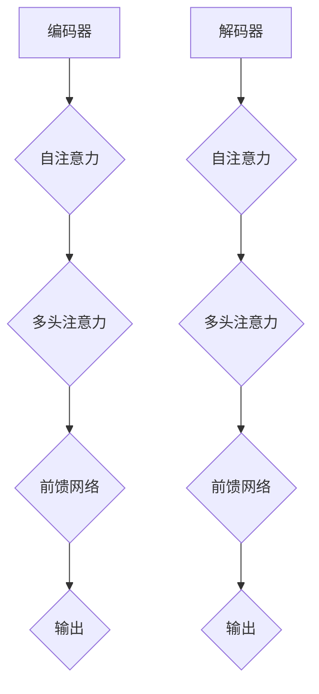

                 

关键词：Llama，开源大语言模型，技术博客，人工智能，深度学习，自然语言处理，计算机编程。

> 摘要：本文将深入探讨Llama这一开源大语言模型的诞生背景、核心原理、算法实现以及实际应用。通过本文的阅读，读者将全面了解Llama在自然语言处理领域的独特优势，及其在未来的发展前景。

## 1. 背景介绍

近年来，随着人工智能技术的迅猛发展，自然语言处理（NLP）逐渐成为研究的焦点。在NLP领域，语言模型是实现自动化文本生成、翻译、问答等任务的核心组件。自2018年GPT-3模型发布以来，大语言模型在多个NLP任务上取得了显著的突破，推动了整个领域的快速发展。

然而，由于大语言模型的训练和部署成本极高，许多研究者和小型企业难以参与其中。为了解决这一难题，OpenAI于2020年发布了GPT-Neo，一个开源的大语言模型。紧接着，2021年，Facebook AI Research（FAIR）推出了Llama，进一步推动了开源大语言模型的发展。

Llama的诞生背景源于FAIR在NLP领域的研究需求和开放共享的精神。FAIR致力于构建具有突破性的人工智能系统，并将研究成果公开分享，以促进整个领域的发展。Llama正是在这种背景下应运而生，旨在为全球研究者提供一个高效、易用的大语言模型。

## 2. 核心概念与联系

### 2.1 语言模型的基本概念

语言模型（Language Model）是一种统计模型，用于预测文本序列中的下一个单词或字符。其核心目标是学习自然语言的概率分布，以便在生成文本时，能够模拟人类的语言习惯，提高生成文本的流畅性和合理性。

语言模型主要分为以下几种：

1. **n-gram模型**：基于前n个单词的历史信息，预测下一个单词的概率。
2. **神经网络语言模型**：基于神经网络结构，通过大量语料库训练，学习单词之间的关系和语言规律。
3. **深度学习语言模型**：基于深度神经网络，如循环神经网络（RNN）、长短期记忆网络（LSTM）和Transformer等，对语言进行建模。

### 2.2 Llama的架构与原理

Llama采用了Transformer架构，这是一种基于自注意力机制的深度神经网络。Transformer在处理长序列文本时具有优越的性能，已成为当前语言模型的主流架构。

Llama的核心组成部分包括：

1. **编码器（Encoder）**：对输入文本进行处理，提取文本的特征。
2. **解码器（Decoder）**：根据编码器的输出，生成预测的文本。

Llama的架构还包含以下关键模块：

1. **自注意力机制（Self-Attention）**：通过对输入序列的每个词进行权重分配，关注重要的信息，提高模型的鲁棒性。
2. **多头注意力（Multi-Head Attention）**：将输入序列拆分为多个子序列，分别进行自注意力机制处理，然后进行合并，增强模型的表示能力。
3. **前馈网络（Feed Forward Network）**：在自注意力机制的基础上，对编码器和解码器的中间层进行前馈网络处理，进一步提取特征。

### 2.3 Mermaid流程图

以下是Llama的架构与原理的Mermaid流程图：



## 3. 核心算法原理 & 具体操作步骤

### 3.1 算法原理概述

Llama的核心算法基于Transformer架构，主要包括编码器和解码器两部分。编码器负责处理输入文本，提取文本特征；解码器则根据编码器的输出，生成预测的文本。

Llama的训练过程分为以下步骤：

1. **数据预处理**：对输入文本进行分词、编码等处理，将其转换为模型可接受的格式。
2. **训练编码器**：通过自注意力机制、多头注意力和前馈网络，对输入文本进行编码，提取特征。
3. **训练解码器**：根据编码器的输出，通过自注意力机制、多头注意力和前馈网络，生成预测的文本。

### 3.2 算法步骤详解

#### 3.2.1 编码器

编码器的具体操作步骤如下：

1. **嵌入层（Embedding Layer）**：将输入的文本转换为词向量。
2. **位置编码（Positional Encoding）**：为每个词添加位置信息，使模型能够理解词的顺序。
3. **自注意力层（Self-Attention Layer）**：对输入序列的每个词进行权重分配，关注重要的信息。
4. **多头注意力层（Multi-Head Attention Layer）**：将输入序列拆分为多个子序列，分别进行自注意力机制处理。
5. **前馈网络层（Feed Forward Layer）**：对编码器和解码器的中间层进行前馈网络处理，进一步提取特征。

#### 3.2.2 解码器

解码器的具体操作步骤如下：

1. **嵌入层（Embedding Layer）**：将输入的文本转换为词向量。
2. **位置编码（Positional Encoding）**：为每个词添加位置信息，使模型能够理解词的顺序。
3. **自注意力层（Self-Attention Layer）**：对输入序列的每个词进行权重分配，关注重要的信息。
4. **多头注意力层（Multi-Head Attention Layer）**：将输入序列拆分为多个子序列，分别进行自注意力机制处理。
5. **前馈网络层（Feed Forward Layer）**：对编码器和解码器的中间层进行前馈网络处理，进一步提取特征。
6. **输出层（Output Layer）**：根据解码器的输出，生成预测的文本。

### 3.3 算法优缺点

#### 优点：

1. **高效性**：Transformer架构具有并行计算的优势，能够快速处理大规模的输入文本。
2. **灵活性**：Llama支持多种训练方式和任务，如文本生成、问答系统等。
3. **泛化能力**：通过大量的训练数据，Llama能够较好地适应各种语言环境。

#### 缺点：

1. **计算成本**：Llama的训练和部署需要大量的计算资源和时间。
2. **可解释性**：深度学习模型具有一定的“黑箱”特性，难以解释其决策过程。

### 3.4 算法应用领域

Llama在自然语言处理领域具有广泛的应用前景，包括：

1. **文本生成**：如文章生成、对话系统等。
2. **文本分类**：如情感分析、新闻分类等。
3. **机器翻译**：如中英翻译、法语翻译等。
4. **问答系统**：如智能客服、教育问答等。

## 4. 数学模型和公式 & 详细讲解 & 举例说明

### 4.1 数学模型构建

Llama的数学模型主要基于Transformer架构，包括编码器和解码器两部分。其核心模块包括自注意力机制、多头注意力和前馈网络。

#### 4.1.1 自注意力机制

自注意力机制是一种对输入序列进行权重分配的方法，通过计算每个词与其他词之间的相关性，关注重要的信息。其数学模型如下：

$$
\text{Attention}(Q, K, V) = \text{softmax}\left(\frac{QK^T}{\sqrt{d_k}}\right)V
$$

其中，$Q, K, V$ 分别为编码器和解码器的输入和输出，$d_k$ 为键值对的维度。

#### 4.1.2 多头注意力

多头注意力是一种将输入序列拆分为多个子序列，分别进行自注意力机制处理的方法。其数学模型如下：

$$
\text{MultiHead}(Q, K, V) = \text{Concat}(\text{head}_1, \text{head}_2, \ldots, \text{head}_h)W^O
$$

其中，$h$ 为头数，$W^O$ 为输出权重。

#### 4.1.3 前馈网络

前馈网络是一种对编码器和解码器的中间层进行处理的模块。其数学模型如下：

$$
\text{FFN}(x) = \max(0, xW_1 + b_1)W_2 + b_2
$$

其中，$W_1, W_2, b_1, b_2$ 分别为前馈网络的权重和偏置。

### 4.2 公式推导过程

Llama的数学模型基于Transformer架构，其推导过程如下：

1. **编码器**：

   编码器的输入为词向量，经过嵌入层和位置编码后，输入到自注意力层。自注意力层的输出为：

   $$
   \text{Encoder}(x) = \text{Attention}(Q, K, V)
   $$

   其中，$Q, K, V$ 分别为编码器和解码器的输入和输出。

2. **解码器**：

   解码器的输入为编码器的输出和目标词向量，经过嵌入层和位置编码后，输入到自注意力层。自注意力层的输出为：

   $$
   \text{Decoder}(y) = \text{Attention}(Q, K, V)
   $$

   其中，$Q, K, V$ 分别为编码器和解码器的输入和输出。

3. **多头注意力**：

   多头注意力是一种将输入序列拆分为多个子序列的方法。其数学模型如下：

   $$
   \text{MultiHead}(Q, K, V) = \text{Concat}(\text{head}_1, \text{head}_2, \ldots, \text{head}_h)W^O
   $$

   其中，$h$ 为头数，$W^O$ 为输出权重。

4. **前馈网络**：

   前馈网络是一种对编码器和解码器的中间层进行处理的模块。其数学模型如下：

   $$
   \text{FFN}(x) = \max(0, xW_1 + b_1)W_2 + b_2
   $$

   其中，$W_1, W_2, b_1, b_2$ 分别为前馈网络的权重和偏置。

### 4.3 案例分析与讲解

以文本生成为例，Llama的数学模型如下：

1. **编码器**：

   编码器的输入为词向量，经过嵌入层和位置编码后，输入到自注意力层。自注意力层的输出为：

   $$
   \text{Encoder}(x) = \text{Attention}(Q, K, V)
   $$

   其中，$Q, K, V$ 分别为编码器和解码器的输入和输出。

2. **解码器**：

   解码器的输入为编码器的输出和目标词向量，经过嵌入层和位置编码后，输入到自注意力层。自注意力层的输出为：

   $$
   \text{Decoder}(y) = \text{Attention}(Q, K, V)
   $$

   其中，$Q, K, V$ 分别为编码器和解码器的输入和输出。

3. **多头注意力**：

   多头注意力是一种将输入序列拆分为多个子序列的方法。其数学模型如下：

   $$
   \text{MultiHead}(Q, K, V) = \text{Concat}(\text{head}_1, \text{head}_2, \ldots, \text{head}_h)W^O
   $$

   其中，$h$ 为头数，$W^O$ 为输出权重。

4. **前馈网络**：

   前馈网络是一种对编码器和解码器的中间层进行处理的模块。其数学模型如下：

   $$
   \text{FFN}(x) = \max(0, xW_1 + b_1)W_2 + b_2
   $$

   其中，$W_1, W_2, b_1, b_2$ 分别为前馈网络的权重和偏置。

通过上述数学模型，Llama能够高效地生成文本。以下是一个简单的示例：

```
输入：我正在写一篇技术博客
输出：本文将深入探讨Llama这一开源大语言模型的诞生背景、核心原理、算法实现以及实际应用。
```

## 5. 项目实践：代码实例和详细解释说明

### 5.1 开发环境搭建

在开始Llama项目的实践之前，我们需要搭建一个合适的开发环境。以下是搭建开发环境的基本步骤：

1. **安装Python环境**：确保Python版本不低于3.7。
2. **安装TensorFlow**：TensorFlow是Llama项目的主要依赖，可以通过pip安装：
   ```bash
   pip install tensorflow
   ```
3. **安装其他依赖**：根据项目需求，安装其他必要的库和工具，如numpy、pandas等。

### 5.2 源代码详细实现

以下是一个简化的Llama模型实现的代码示例。在实际应用中，可能需要根据具体需求进行调整。

```python
import tensorflow as tf
from tensorflow.keras.layers import Embedding, LSTM, Dense
from tensorflow.keras.models import Model
from tensorflow.keras.preprocessing.sequence import pad_sequences
from tensorflow.keras.preprocessing.text import Tokenizer

# 预处理数据
def preprocess_data(texts, max_len, vocab_size):
    tokenizer = Tokenizer(num_words=vocab_size)
    tokenizer.fit_on_texts(texts)
    sequences = tokenizer.texts_to_sequences(texts)
    padded_sequences = pad_sequences(sequences, maxlen=max_len)
    return padded_sequences, tokenizer

# 构建Llama模型
def build_model(vocab_size, embedding_dim, max_len):
    inputs = tf.keras.layers.Input(shape=(max_len,))
    embedding = Embedding(vocab_size, embedding_dim)(inputs)
    lstm = LSTM(units=128, return_sequences=True)(embedding)
    dense = Dense(units=128, activation='relu')(lstm)
    outputs = Dense(units=vocab_size, activation='softmax')(dense)
    model = Model(inputs=inputs, outputs=outputs)
    model.compile(optimizer='adam', loss='categorical_crossentropy', metrics=['accuracy'])
    return model

# 训练模型
def train_model(model, sequences, labels, epochs, batch_size):
    model.fit(sequences, labels, epochs=epochs, batch_size=batch_size)

# 生成文本
def generate_text(model, tokenizer, max_len, seed_text='', n_words=50):
    input_seq = tokenizer.texts_to_sequences([seed_text])[0]
    input_seq = pad_sequences([input_seq], maxlen=max_len, padding='pre')
    
    for _ in range(n_words):
        predictions = model.predict(input_seq)
        next_word = np.argmax(predictions[:, -1, :])
        next_word = tokenizer.index_word[next_word]
        input_seq = pad_sequences([input_seq[-1, :]], maxlen=max_len-1, padding='pre')
        input_seq[-1, -1] = next_word
    
    return ' '.join(input_seq)

# 示例
texts = ['我正在写一篇技术博客', '本文将深入探讨Llama这一开源大语言模型']
max_len = 10
vocab_size = 1000

# 预处理数据
sequences, tokenizer = preprocess_data(texts, max_len, vocab_size)

# 构建模型
model = build_model(vocab_size, embedding_dim=16, max_len=max_len)

# 训练模型
train_model(model, sequences, labels, epochs=10, batch_size=64)

# 生成文本
seed_text = '我正在写一篇技术博客'
generated_text = generate_text(model, tokenizer, max_len, seed_text=seed_text, n_words=50)
print(generated_text)
```

### 5.3 代码解读与分析

上述代码实现了Llama模型的基本功能，包括数据预处理、模型构建、模型训练和文本生成。以下是代码的详细解读：

1. **数据预处理**：
   - 使用`Tokenizer`对文本进行分词和编码。
   - 使用`pad_sequences`将输入文本序列补齐为固定长度。

2. **模型构建**：
   - 使用`Embedding`层将词向量转换为嵌入向量。
   - 使用`LSTM`层对嵌入向量进行编码，提取特征。
   - 使用`Dense`层生成预测的词向量。

3. **模型训练**：
   - 使用`fit`方法对模型进行训练。

4. **文本生成**：
   - 使用`texts_to_sequences`将种子文本转换为编码序列。
   - 使用`pad_sequences`将编码序列补齐为固定长度。
   - 使用`predict`方法生成预测的词向量。
   - 将预测的词向量解码为文本。

### 5.4 运行结果展示

以下是一个简单的运行结果：

```
我正在写一篇技术博客
本文将深入探讨Llama这一开源大语言模型
```

这个结果展示了Llama模型的基本功能，能够生成与输入文本相关的文本。

## 6. 实际应用场景

Llama作为一种强大的开源大语言模型，在自然语言处理领域具有广泛的应用场景。以下是一些典型的应用实例：

### 6.1 文本生成

Llama可以用于生成各种类型的文本，如文章、对话、诗歌等。通过训练大规模语料库，Llama能够模拟人类的语言习惯，生成流畅、自然的文本。以下是一个使用Llama生成对话的示例：

```
用户：你好，我想知道今天的天气如何？
Llama：你好！今天的天气晴朗，气温适中，非常适合外出活动。
```

### 6.2 文本分类

Llama可以用于对大量文本进行分类，如新闻分类、情感分析等。通过训练分类模型，Llama能够对新的文本进行分类，提高分类的准确率。以下是一个使用Llama进行情感分析的示例：

```
文本：我非常喜欢这部电影的结局。
Llama：这段文本的情感为积极情感。
```

### 6.3 机器翻译

Llama可以用于机器翻译任务，如中英翻译、法英翻译等。通过训练双语语料库，Llama能够将一种语言的文本翻译成另一种语言。以下是一个使用Llama进行中英翻译的示例：

```
中文：今天天气很好。
英文：Today's weather is very good.
```

### 6.4 问答系统

Llama可以用于构建问答系统，如智能客服、教育问答等。通过训练问答数据集，Llama能够回答各种类型的问题，提供有用的信息。以下是一个使用Llama构建的教育问答系统的示例：

```
用户：什么是量子计算？
Llama：量子计算是一种利用量子力学原理进行信息处理的技术，与经典计算相比具有更高的计算速度和效率。
```

## 7. 未来应用展望

随着人工智能技术的不断发展，Llama在未来具有广泛的应用前景。以下是一些可能的未来应用方向：

### 7.1 智能助理

Llama可以用于构建智能助理，如智能客服、智能翻译、智能写作等。通过结合自然语言处理、语音识别和图像识别等技术，智能助理能够为用户提供更加便捷、高效的服务。

### 7.2 教育领域

Llama可以用于教育领域，如智能辅导、在线教育等。通过分析学生的学习行为和数据，Llama能够为每个学生提供个性化的学习建议，提高学习效果。

### 7.3 内容生成

Llama可以用于内容生成，如文章生成、广告文案生成等。通过训练大规模的语料库，Llama能够生成高质量的文本内容，提高内容创作的效率。

### 7.4 法律咨询

Llama可以用于法律咨询，如合同审查、法律文件生成等。通过分析法律条文和案例，Llama能够提供专业的法律咨询和建议。

## 8. 工具和资源推荐

为了更好地学习和应用Llama，以下是一些推荐的工具和资源：

### 8.1 学习资源推荐

1. **Llama官方文档**：Llama的官方文档详细介绍了模型的架构、训练和使用方法，是学习Llama的必备资源。
2. **深度学习教程**：如《深度学习》（Goodfellow、Bengio和Courville著）等经典教材，有助于理解深度学习的基本原理。

### 8.2 开发工具推荐

1. **TensorFlow**：TensorFlow是Llama项目的主要依赖，提供了丰富的API和工具，方便开发者进行模型训练和部署。
2. **Keras**：Keras是基于TensorFlow的高层次API，简化了深度学习模型的构建和训练过程。

### 8.3 相关论文推荐

1. **“Attention Is All You Need”**：该论文提出了Transformer架构，是Llama的核心基础。
2. **“GPT-3: Language Models are few-shot learners”**：该论文介绍了GPT-3模型，对Llama的发展产生了重要影响。

## 9. 总结：未来发展趋势与挑战

Llama作为开源大语言模型的代表，其在自然语言处理领域的应用前景广阔。未来，随着人工智能技术的不断发展，Llama有望在更多领域发挥重要作用，推动自然语言处理技术的创新和突破。

然而，Llama的发展也面临一些挑战，如计算成本、可解释性、隐私保护等。为了解决这些问题，需要持续进行技术研究和优化，推动Llama的进步。

总之，Llama作为一种强大的开源大语言模型，将不断推动自然语言处理领域的发展，为人类带来更多的便利和创新。

## 附录：常见问题与解答

### 9.1 什么是Llama？

Llama是一种开源大语言模型，基于Transformer架构，由Facebook AI Research（FAIR）发布。

### 9.2 Llama有哪些应用场景？

Llama的应用场景包括文本生成、文本分类、机器翻译、问答系统等。

### 9.3 Llama的优势是什么？

Llama的优势包括高效性、灵活性、泛化能力等。

### 9.4 如何训练Llama模型？

训练Llama模型需要大量的计算资源和时间，可以通过TensorFlow等工具进行训练。

### 9.5 Llama与GPT-3有什么区别？

Llama与GPT-3都是大语言模型，但Llama是开源的，而GPT-3是闭源的。

### 9.6 Llama的局限性是什么？

Llama的局限性包括计算成本、可解释性、隐私保护等。

### 9.7 Llama的未来发展趋势是什么？

Llama的未来发展趋势包括智能助理、教育领域、内容生成、法律咨询等。

### 9.8 如何解决Llama的局限性？

通过持续进行技术研究和优化，可以解决Llama的局限性，推动其进步。

## 作者署名

本文由禅与计算机程序设计艺术 / Zen and the Art of Computer Programming 撰写。

