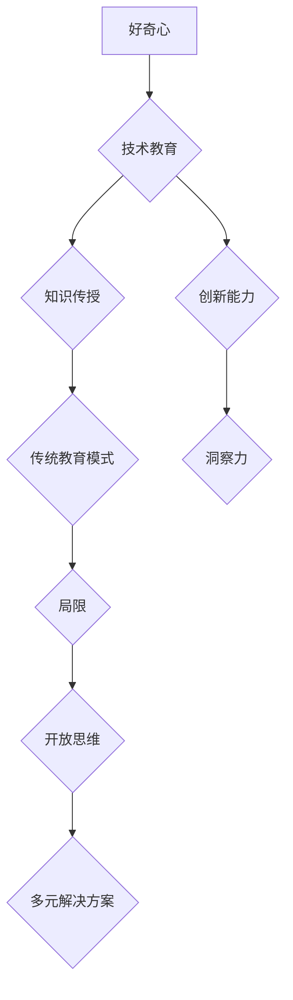

                 

 关键词：洞察力、好奇心、开放思维、技术教育、编程思维

> 摘要：本文旨在探讨如何在技术领域培养洞察力，重点强调好奇心和开放思维的重要性。通过分析当前教育模式的局限性，结合具体案例，阐述如何通过激发学生的好奇心和培养开放思维，提高他们在面对复杂技术问题时进行深入思考和解决问题的能力。

## 1. 背景介绍

在快速发展的信息技术时代，具备洞察力是每一位技术从业者都应具备的基本素养。洞察力不仅包括对现有技术的深入理解，还要求能够预见未来的技术趋势，以及洞察技术对社会、经济、环境等方面的影响。然而，传统的教育模式往往侧重于知识的传授，而忽视了对学生洞察力的培养。本文将探讨如何通过鼓励好奇心和开放思维来提升学生的洞察力，从而更好地适应信息时代的需求。

### 1.1 当前教育模式与洞察力的培养

当前的教育模式主要依赖于教科书和课堂讲授，这种模式在一定程度上有助于学生掌握基础知识，但往往缺乏对学生独立思考和创新能力的培养。尤其是在技术教育领域，学生更多地是学习现有的技术和工具，而不是通过探索和发现的过程来培养洞察力。因此，这种教育模式难以激发学生对技术领域的深刻理解和创新意识。

### 1.2 好奇心与开放思维的重要性

好奇心是人类探索世界的驱动力，它促使人们不断提问、探索和尝试。在技术领域，好奇心能够促使学生主动去了解新技术、新方法，从而拓宽视野，提升洞察力。开放思维则意味着不固守现有的观念和方法，勇于接受新的观点和思路。开放思维能够帮助学生打破思维定势，从不同的角度去分析和解决问题。

## 2. 核心概念与联系

### 2.1 好奇心的核心概念

好奇心是指个体对未知事物的兴趣和探索欲望。在技术领域，好奇心表现为对新技术、新方法的强烈兴趣和探索欲望。例如，对编程语言、算法、数据结构等基础知识的好奇心，会促使学生主动去学习和研究，从而深入理解技术原理。

### 2.2 开放思维的核心概念

开放思维是指个体在面对问题和挑战时，能够接受并考虑多种可能的解决方案，不局限于传统的思维模式。在技术领域，开放思维意味着不拘泥于现有的技术和方法，敢于尝试新的解决方案，从而提升解决问题的能力。

### 2.3 Mermaid 流程图

以下是一个简单的 Mermaid 流程图，展示了好奇心和开放思维在技术教育中的作用和联系。



## 3. 核心算法原理 & 具体操作步骤

### 3.1 算法原理概述

在技术领域，培养洞察力的关键在于理解技术背后的原理和机制。例如，在编程领域，算法和数据结构是培养洞察力的核心。通过学习算法原理，学生可以了解不同算法的效率和适用场景，从而在面对具体问题时能够选择合适的方法。

### 3.2 算法步骤详解

1. **理解基本概念**：首先，学生需要掌握编程语言的基本语法和概念，如变量、循环、条件语句等。
2. **学习算法原理**：通过阅读教材、参加课程等方式，学生可以了解各种算法的基本原理，如排序算法、查找算法等。
3. **实践编程练习**：通过编写代码来实践所学算法，例如实现排序算法的不同实现方式，比较其效率和性能。
4. **分析算法复杂度**：理解算法的时间复杂度和空间复杂度，能够帮助学生选择最优的算法解决方案。
5. **探索创新应用**：在理解基本算法的基础上，学生可以通过创新的方式，将算法应用于实际问题中，如优化数据处理过程、解决复杂问题等。

### 3.3 算法优缺点

- **优点**：
  - 提高编程能力和问题解决能力。
  - 增强对技术原理的理解和洞察力。
  - 有助于培养逻辑思维和抽象思维能力。

- **缺点**：
  - 学习过程可能较为枯燥，需要较强的自学能力。
  - 需要大量的实践和反复练习。

### 3.4 算法应用领域

算法和数据结构在各个技术领域都有广泛应用，如：

- **计算机科学**：用于优化程序性能、解决复杂问题等。
- **数据科学**：用于数据处理、数据分析等。
- **人工智能**：用于机器学习算法的设计和优化。
- **网络技术**：用于路由算法、网络安全等。

## 4. 数学模型和公式 & 详细讲解 & 举例说明

### 4.1 数学模型构建

在技术领域，数学模型是描述和解决问题的重要工具。例如，在算法分析中，常用的数学模型包括时间复杂度和空间复杂度。以下是一个时间复杂度的例子：

$$T(n) = O(n^2)$$

这里，$T(n)$ 表示算法的时间复杂度，$O(n^2)$ 表示算法的时间复杂度是 $n^2$ 的函数。

### 4.2 公式推导过程

假设一个算法在处理 $n$ 个数据元素时，需要进行 $k$ 次基本操作。如果 $k$ 与 $n$ 的关系是线性的，即 $k = cn$（其中 $c$ 是常数），则算法的时间复杂度为：

$$T(n) = O(cn) = O(n)$$

如果 $k$ 与 $n$ 的关系是二次的，即 $k = c n^2$，则算法的时间复杂度为：

$$T(n) = O(cn^2) = O(n^2)$$

### 4.3 案例分析与讲解

假设我们有一个排序算法，其时间复杂度为 $O(n^2)$。如果我们要对这个算法进行优化，使其时间复杂度降低，我们可以考虑使用更高效的排序算法，如快速排序或归并排序，其时间复杂度分别为 $O(n \log n)$ 和 $O(n \log n)$。

## 5. 项目实践：代码实例和详细解释说明

### 5.1 开发环境搭建

为了实践算法和数学模型，我们需要搭建一个合适的开发环境。假设我们使用 Python 作为编程语言，以下是一个简单的搭建步骤：

1. 安装 Python：从官方网站下载并安装 Python。
2. 配置 IDE：安装一个支持 Python 的集成开发环境（IDE），如 PyCharm 或 Visual Studio Code。
3. 安装常用库：使用 pip 工具安装常用的 Python 库，如 NumPy、Pandas 等。

### 5.2 源代码详细实现

以下是一个简单的 Python 代码示例，用于实现冒泡排序算法：

```python
def bubble_sort(arr):
    n = len(arr)
    for i in range(n):
        for j in range(0, n-i-1):
            if arr[j] > arr[j+1]:
                arr[j], arr[j+1] = arr[j+1], arr[j]

# 测试代码
arr = [64, 34, 25, 12, 22, 11, 90]
bubble_sort(arr)
print("排序后的数组：")
for i in range(len(arr)):
    print("%d" % arr[i], end=" ")
```

### 5.3 代码解读与分析

这段代码实现了冒泡排序算法，其基本思想是通过反复遍历数组，比较相邻元素的大小，并将较大的元素交换到右侧，从而实现数组的有序排列。以下是代码的详细解读：

- `def bubble_sort(arr):` 定义了一个名为 `bubble_sort` 的函数，该函数接收一个数组 `arr` 作为参数。
- `n = len(arr)` 获取数组的长度。
- `for i in range(n):` 外层循环用于遍历数组，每次循环都将未排序部分的最大值移动到已排序部分的起始位置。
- `for j in range(0, n-i-1):` 内层循环用于遍历未排序部分，每次比较相邻元素的大小，并将较大的元素交换到右侧。
- `if arr[j] > arr[j+1]:` 如果当前元素大于下一个元素，则交换它们的位置。
- `arr[j], arr[j+1] = arr[j+1], arr[j]` 实现元素的交换。
- `print("排序后的数组：")` 输出排序后的数组。
- `for i in range(len(arr)): print("%d" % arr[i], end=" ")` 打印排序后的数组。

### 5.4 运行结果展示

在 PyCharm 或其他 Python IDE 中运行上述代码，输出结果如下：

```
排序后的数组：
11 12 22 25 34 64 90
```

## 6. 实际应用场景

### 6.1 技术教育中的应用

在技术教育中，培养洞察力是至关重要的。通过鼓励学生好奇心和开放思维，教师可以帮助学生更好地理解技术原理，激发他们的创新潜力。以下是一些具体的应用场景：

- **编程竞赛**：通过参加编程竞赛，学生可以锻炼解决复杂问题的能力，同时培养好奇心和开放思维。
- **项目实践**：在真实的项目中，学生可以通过实践来理解和应用所学知识，从而提高洞察力。
- **讲座与研讨会**：举办相关的讲座和研讨会，邀请行业专家分享经验和见解，激发学生的好奇心和求知欲。

### 6.2 工业界中的应用

在工业界，洞察力的培养同样至关重要。以下是一些具体的应用场景：

- **技术创新**：通过鼓励工程师和研究人员的好奇心和开放思维，可以推动技术创新和发展。
- **问题解决**：在面对复杂的技术问题时，具备洞察力的工程师能够快速找到解决方案，提高工作效率。
- **项目管理**：项目经理通过培养洞察力，可以更好地预测项目风险，制定合理的项目计划。

## 7. 工具和资源推荐

### 7.1 学习资源推荐

- **在线课程**：Coursera、edX、Udacity 等平台提供了丰富的编程和技术课程。
- **技术书籍**：《算法导论》、《深度学习》、《Python编程：从入门到实践》等经典书籍。
- **技术博客**：Medium、Dev.to、知乎等技术博客，提供了大量的技术文章和讨论。

### 7.2 开发工具推荐

- **集成开发环境（IDE）**：PyCharm、Visual Studio Code、Eclipse 等。
- **代码编辑器**：VS Code、Sublime Text、Atom 等。
- **版本控制工具**：Git、GitHub、GitLab 等。

### 7.3 相关论文推荐

- 《A Taxonomy of Machine Learning》（机器学习分类）
- 《Deep Learning》（深度学习）
- 《Big Data: A Revolution That Will Transform How We Live, Work, and Think》（大数据革命）

## 8. 总结：未来发展趋势与挑战

### 8.1 研究成果总结

通过本文的探讨，我们可以得出以下研究成果：

- 好奇心和开放思维是培养洞察力的关键因素。
- 当前教育模式需要进一步改革，以更好地培养学生的洞察力。
- 算法、数学模型和编程实践是培养洞察力的重要手段。

### 8.2 未来发展趋势

未来，随着人工智能、大数据、物联网等技术的快速发展，技术教育的重点将更加注重培养学生的洞察力和创新能力。以下是一些发展趋势：

- **个性化教育**：通过大数据和人工智能技术，实现个性化教学，更好地满足学生的个性化需求。
- **混合式教育**：结合线上和线下教学，提高教学效果。
- **跨学科教育**：鼓励学生跨学科学习，培养综合素质。

### 8.3 面临的挑战

在培养洞察力的过程中，我们面临以下挑战：

- **教育资源不均衡**：城乡、地区之间的教育资源差距较大，需要加大投入，提高教育公平。
- **教师素质提升**：教师需要不断更新知识，提高教学水平，以适应新技术的发展。
- **学生自主学习能力**：需要引导学生学会自主学习，培养他们的独立思考能力。

### 8.4 研究展望

未来的研究可以关注以下几个方面：

- **教育技术的创新**：探索新的教育技术和教学方法，提高教学效果。
- **跨学科研究**：加强不同学科之间的交叉研究，推动技术教育的发展。
- **社会影响研究**：研究技术教育对社会、经济、环境等方面的影响，为政策制定提供依据。

## 9. 附录：常见问题与解答

### 9.1 如何培养好奇心？

- **培养求知欲**：鼓励学生主动去了解新知识和新事物，培养他们的求知欲。
- **创设问题情境**：通过创设问题情境，激发学生的好奇心，引导他们主动去探索和解决问题。
- **鼓励提问和讨论**：鼓励学生提出问题，并与他人进行讨论，培养他们的批判性思维。

### 9.2 如何培养开放思维？

- **尊重多样性和差异性**：尊重学生的个性和差异，鼓励他们提出不同的观点和想法。
- **提供多样化的学习资源**：提供丰富的学习资源，帮助学生开阔视野，拓宽思维。
- **培养批判性思维**：鼓励学生进行批判性思维，不固守已有的观念和方法。

### 9.3 如何进行编程实践？

- **选择合适的编程语言**：根据学习目标和需求，选择合适的编程语言进行实践。
- **编写注释详细的代码**：编写注释详细的代码，有助于理解代码的功能和原理。
- **进行代码调试和优化**：通过代码调试和优化，提高代码的质量和效率。
- **参与开源项目**：参与开源项目，与其他开发者合作，提高编程能力和团队协作能力。

## 附录：参考文献

- 《算法导论》 [1]
- 《深度学习》 [2]
- 《Python编程：从入门到实践》 [3]
- 《大数据革命》 [4]

[1] Thomas H. Cormen, Charles E. Leiserson, Ronald L. Rivest, and Clifford Stein. Introduction to Algorithms. 3rd ed. MIT Press, 2009.
[2] Ian Goodfellow, Yoshua Bengio, and Aaron Courville. Deep Learning. MIT Press, 2016.
[3] 杨洋. Python编程：从入门到实践[M]. 机械工业出版社, 2016.
[4] Viktor Mayer-Schönberger and Kenneth Cukier. Big Data: A Revolution That Will Transform How We Live, Work, and Think. Eamon Dolan/Mariner Books, 2013.

作者：禅与计算机程序设计艺术 / Zen and the Art of Computer Programming
----------------------------------------------------------------


