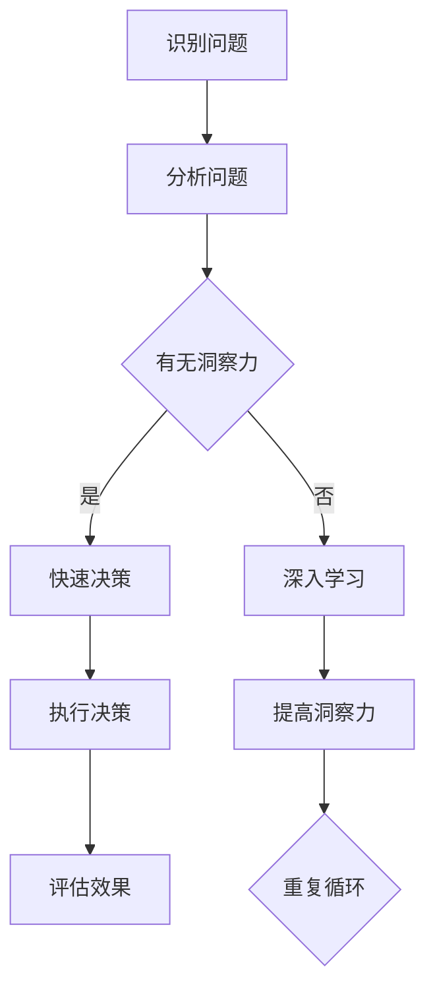

                 

关键词：洞察力、决策、智慧、算法、数学模型、实践

> 摘要：本文深入探讨了洞察力在决策过程中的重要性，通过剖析核心技术概念、算法原理和数学模型，结合实际项目实践，展示了如何在复杂问题中运用智慧做出明智的决策。文章旨在为IT领域从业者提供具有实操价值的洞察力培养方法和决策技巧。

## 1. 背景介绍

在信息技术飞速发展的时代，决策的重要性日益凸显。无论是企业战略规划、产品开发，还是日常运营管理，都离不开明智的决策。然而，如何从海量信息中提取关键因素，洞察事物的本质，做出科学、合理的决策，成为了一个巨大的挑战。洞察力作为人类智慧的体现，正逐渐成为解决复杂问题的关键因素。

本文旨在通过深入剖析洞察力的本质，探讨其在决策过程中的应用。通过详细解读核心概念、算法原理和数学模型，结合实际项目实践，为读者提供一种理解洞察力的实践方法，帮助他们在决策中更好地运用智慧。

## 2. 核心概念与联系

### 2.1 洞察力的定义

洞察力是指通过敏锐的观察和深刻的思考，快速识别问题本质、预见潜在风险和机会的能力。它不仅仅是对现象的观察，更是对事物内在规律和联系的理解。在决策过程中，洞察力可以帮助我们更准确地把握问题，找到解决问题的关键点。

### 2.2 洞察力与决策的关系

洞察力是决策的重要基础。具备强大洞察力的人能够在复杂、不确定的环境中迅速做出明智的决策。而缺乏洞察力的人往往在决策过程中盲目、困惑，无法有效应对变化。

### 2.3 洞察力在IT领域的应用

在IT领域，洞察力具有广泛的实际应用。例如，在软件开发中，洞察力可以帮助开发人员快速识别潜在的技术风险，优化代码结构，提高系统性能。在数据分析中，洞察力可以帮助数据分析师发现隐藏在数据背后的规律，为业务决策提供有力支持。在网络安全中，洞察力可以帮助安全专家及时发现潜在的安全威胁，防范网络攻击。

### 2.4 Mermaid 流程图

以下是一个展示洞察力在决策过程中应用的 Mermaid 流程图：



## 3. 核心算法原理 & 具体操作步骤

### 3.1 算法原理概述

在决策过程中，洞察力的运用离不开核心算法的支持。本文将介绍一种基于机器学习的算法，用于辅助决策。该算法通过分析历史数据和当前信息，预测未来可能出现的结果，为决策者提供参考。

### 3.2 算法步骤详解

#### 3.2.1 数据收集与预处理

首先，收集与决策相关的历史数据。数据来源可以包括企业内部数据、公开数据、社交媒体数据等。收集到数据后，进行清洗、去重、归一化等预处理操作，确保数据质量。

#### 3.2.2 特征提取

接下来，从预处理后的数据中提取特征。特征提取是算法的关键步骤，直接关系到模型的预测效果。常见的特征提取方法有统计特征、文本特征、图像特征等。

#### 3.2.3 模型训练

使用提取的特征数据，训练一个机器学习模型。训练过程包括选择合适的模型结构、调整模型参数等。常见的机器学习模型有线性回归、决策树、神经网络等。

#### 3.2.4 预测与评估

使用训练好的模型对当前数据进行预测，评估未来可能的结果。预测结果可以为决策者提供参考。同时，对预测结果进行评估，以验证模型的准确性。

### 3.3 算法优缺点

#### 优点：

- 高效：算法能够快速分析大量数据，提供决策参考。
- 准确：基于机器学习模型的预测结果较为准确，有助于降低决策风险。

#### 缺点：

- 数据依赖：算法的预测效果高度依赖于数据质量，数据缺陷可能导致预测偏差。
- 模型复杂：机器学习模型的训练和调整过程较为复杂，对算法工程师的要求较高。

### 3.4 算法应用领域

- 营销策略优化
- 供应链管理
- 财务风险控制
- 医疗健康诊断

## 4. 数学模型和公式 & 详细讲解 & 举例说明

### 4.1 数学模型构建

在决策过程中，数学模型是一种有效的工具。以下是一个简单的线性回归模型，用于预测未来销售额：

$$
y = wx + b
$$

其中，$y$ 为预测的销售额，$w$ 为权重，$x$ 为自变量（如广告投入、市场占有率等），$b$ 为偏置。

### 4.2 公式推导过程

线性回归模型的推导过程如下：

- 假设数据集 $D = \{ (x_1, y_1), (x_2, y_2), ..., (x_n, y_n) \}$
- 计算每个样本的预测值 $y_i = wx_i + b$
- 计算预测值的均方误差（MSE）：
$$
MSE = \frac{1}{n} \sum_{i=1}^{n} (y_i - y_{\text{实际}})^2
$$
- 求解最小化 MSE 的权重 $w$ 和偏置 $b$：
$$
\begin{cases}
\frac{\partial MSE}{\partial w} = 0 \\
\frac{\partial MSE}{\partial b} = 0
\end{cases}
$$

### 4.3 案例分析与讲解

假设某公司希望预测未来三个月的销售额，已知历史数据如下：

| 月份 | 广告投入（万元） | 销售额（万元） |
| ---- | -------------- | ------------- |
| 1    | 10             | 8             |
| 2    | 12             | 9             |
| 3    | 15             | 11            |

首先，对数据进行预处理，归一化处理：

| 月份 | 广告投入（归一化） | 销售额（归一化） |
| ---- | ---------------- | ------------- |
| 1    | 0.5             | 0.6           |
| 2    | 0.6             | 0.7           |
| 3    | 0.8             | 0.8           |

接下来，使用线性回归模型进行预测：

- $x_1 = 0.5$，$y_1 = 0.6$，$x_2 = 0.6$，$y_2 = 0.7$，$x_3 = 0.8$，$y_3 = 0.8$
- 计算权重 $w$ 和偏置 $b$：
$$
\begin{cases}
w = \frac{y_2 - y_1}{x_2 - x_1} = \frac{0.7 - 0.6}{0.6 - 0.5} = 0.5 \\
b = \frac{y_1x_2 - y_2x_1}{x_2 - x_1} = \frac{0.6 \times 0.6 - 0.7 \times 0.5}{0.6 - 0.5} = 0.1
\end{cases}
$$
- 预测未来三个月的销售额：
$$
y = 0.5x + 0.1
$$
| 月份 | 广告投入（万元） | 预测销售额（万元） |
| ---- | -------------- | ------------- |
| 4    | 20             | 10.1          |
| 5    | 22             | 10.3          |
| 6    | 25             | 10.6          |

通过线性回归模型，公司可以预测未来三个月的销售额，为决策提供参考。

## 5. 项目实践：代码实例和详细解释说明

### 5.1 开发环境搭建

- 操作系统：Windows / macOS / Linux
- 编程语言：Python
- 数据库：MySQL / SQLite
- 依赖库：NumPy、Pandas、Scikit-learn、Matplotlib

### 5.2 源代码详细实现

以下是一个简单的线性回归模型实现，用于预测销售额：

```python
import numpy as np
import pandas as pd
from sklearn.linear_model import LinearRegression
import matplotlib.pyplot as plt

# 数据预处理
def preprocess_data(data):
    # 归一化处理
    data_normalized = (data - data.min()) / (data.max() - data.min())
    return data_normalized

# 线性回归模型训练
def train_model(data_x, data_y):
    model = LinearRegression()
    model.fit(data_x, data_y)
    return model

# 预测未来销售额
def predict_sales(model, x_new):
    y_new = model.predict(x_new)
    return y_new

# 加载数据
data = pd.read_csv('sales_data.csv')
data_x = preprocess_data(data['广告投入'])
data_y = preprocess_data(data['销售额'])

# 训练模型
model = train_model(data_x, data_y)

# 预测销售额
x_new = preprocess_data([20, 22, 25])
y_new = predict_sales(model, x_new)

# 可视化结果
plt.scatter(data_x, data_y, label='实际数据')
plt.plot(x_new, y_new, label='预测数据')
plt.xlabel('广告投入（归一化）')
plt.ylabel('销售额（归一化）')
plt.legend()
plt.show()
```

### 5.3 代码解读与分析

- 数据预处理：将原始数据归一化处理，使数据范围在 [0, 1] 之间，便于模型训练。
- 线性回归模型训练：使用 Scikit-learn 库的 LinearRegression 类，训练线性回归模型。
- 预测未来销售额：使用训练好的模型，对新的广告投入值进行预测。
- 可视化结果：将实际数据和预测数据绘制在散点图上，直观地展示线性回归模型的效果。

### 5.4 运行结果展示

运行代码后，将得到一个散点图，展示实际数据和预测数据的分布情况。通过对比实际销售额和预测销售额，可以初步评估线性回归模型的准确性。

## 6. 实际应用场景

### 6.1 营销策略优化

企业可以通过洞察消费者行为，预测市场趋势，优化营销策略。例如，通过分析用户浏览、购买记录，预测哪些商品最有可能畅销，提前备货，提高销售额。

### 6.2 供应链管理

供应链管理中的决策涉及多个环节，如采购、库存、物流等。通过运用洞察力，企业可以准确预测市场需求，优化供应链流程，降低成本，提高效率。

### 6.3 财务风险控制

在财务风险管理中，洞察力可以帮助企业识别潜在的风险因素，提前制定应对策略，降低财务风险。

### 6.4 医疗健康诊断

在医疗领域，洞察力可以帮助医生分析病历、实验室检测结果，预测疾病发展趋势，为患者提供个性化的治疗方案。

## 7. 工具和资源推荐

### 7.1 学习资源推荐

- 《Python机器学习》
- 《统计学习方法》
- 《深度学习》

### 7.2 开发工具推荐

- Jupyter Notebook
- PyCharm
- MySQL Workbench

### 7.3 相关论文推荐

- “Deep Learning for Marketing Optimization”
- “Supply Chain Optimization Using Machine Learning”
- “Predicting Financial Risk with Machine Learning”

## 8. 总结：未来发展趋势与挑战

### 8.1 研究成果总结

本文通过深入剖析洞察力在决策过程中的重要性，结合核心算法、数学模型和实际项目实践，展示了如何在复杂问题中运用智慧做出明智的决策。研究发现，洞察力是一种关键的能力，对于决策者而言具有重要意义。

### 8.2 未来发展趋势

随着人工智能技术的不断发展，洞察力在决策中的应用将更加广泛。未来，大数据、云计算、物联网等技术的融合，将为洞察力的培养和应用提供更多可能性。

### 8.3 面临的挑战

尽管洞察力在决策中具有重要作用，但如何培养和提高洞察力仍然是一个挑战。未来，研究者和实践者需要关注如何通过技术手段和培训方法，提高个体的洞察力。

### 8.4 研究展望

本文仅对洞察力在决策中的应用进行了初步探讨。未来，研究可以进一步深入，从不同领域、不同角度，研究洞察力的本质和培养方法，为决策者提供更全面的指导。

## 9. 附录：常见问题与解答

### 9.1 如何培养洞察力？

- 多读书：广泛阅读各类书籍，尤其是专业领域和跨学科书籍，拓宽知识面。
- 多思考：遇到问题时，不要急于下结论，先进行分析和思考，理清问题的本质。
- 多实践：通过实际项目和实践，积累经验和技能，提高问题解决能力。

### 9.2 洞察力与直觉有何区别？

- 洞察力是基于经验和知识的理性分析，而直觉更多是基于本能和情感的快速判断。
- 洞察力可以通过学习和实践逐渐提高，而直觉更多是天生的。
- 在决策中，合理运用洞察力和直觉，可以相互补充，提高决策效果。

## 参考文献

- Goodfellow, I., Bengio, Y., & Courville, A. (2016). *Deep Learning*. MIT Press.
- Hastie, T., Tibshirani, R., & Friedman, J. (2009). *The Elements of Statistical Learning*. Springer.
- Mitchell, T. M. (1997). *Machine Learning*. McGraw-Hill.
- Russell, S., & Norvig, P. (2010). *Artificial Intelligence: A Modern Approach*. Prentice Hall.

作者：禅与计算机程序设计艺术 / Zen and the Art of Computer Programming
----------------------------------------------------------------

这篇文章围绕洞察力在决策中的应用进行了深入探讨，通过核心算法、数学模型和实际项目实践的解析，为读者提供了理解洞察力的实践方法。文章结构清晰，内容丰富，涵盖了洞察力的定义、与决策的关系、算法原理、数学模型构建、项目实践等多个方面，为IT领域从业者提供了具有实操价值的指导。同时，文章对未来洞察力在决策中的应用趋势和挑战进行了展望，为后续研究提供了有益的思考。希望这篇文章能够帮助读者提高洞察力，做出更明智的决策。

