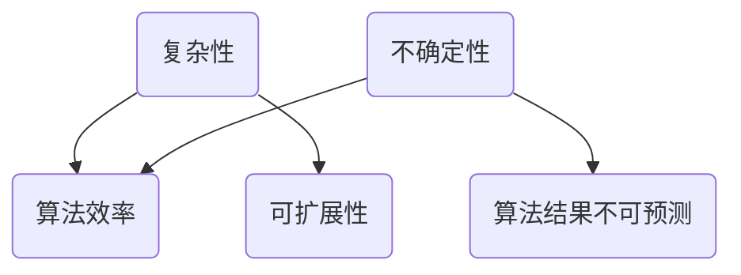

                 

关键词：复杂系统、不确定性、人工智能、计算机科学、算法设计、认知局限、认知偏差

> 摘要：在当今快速发展的计算机科学领域，人工智能和算法设计正不断突破传统认知的局限。本文旨在探讨复杂性和不确定性在计算机科学中的作用，以及我们如何通过认识和应对这些因素，来提高算法的准确性和效率。通过对核心概念的阐述和实际案例的分析，本文将深入探讨复杂性和不确定因素在人工智能和计算机科学中的应用，并探讨未来研究方向和挑战。

## 1. 背景介绍

### 计算机科学的发展

计算机科学起源于20世纪中期，随着电子计算机的诞生，人类进入了数字化时代。从最初的逻辑门电路，到复杂的集成电路，计算机科学在硬件和软件方面都取得了巨大的进展。计算机科学的快速发展，不仅改变了我们的生活，也极大地推动了人工智能和算法设计的发展。

### 人工智能的崛起

人工智能（AI）作为计算机科学的重要分支，近年来取得了显著的突破。从早期的规则系统，到基于数据的学习算法，再到深度学习等先进技术，人工智能在语音识别、图像处理、自然语言处理等领域取得了令人瞩目的成就。然而，随着人工智能的不断发展，我们逐渐认识到，人工智能算法在复杂性和不确定性方面存在一定的局限。

## 2. 核心概念与联系

### 复杂性

复杂性是指系统在结构、行为和演化过程中所表现出的复杂程度。在计算机科学中，复杂性通常与算法的效率和可扩展性相关。一个复杂的系统可能具有大量的变量、相互作用的组件和复杂的动态行为。

### 不确定性

不确定性是指系统在运行过程中无法预测或确定其行为和结果的情况。在计算机科学中，不确定性可能源于数据的不完整、噪声、随机性等因素。

### 人工智能与复杂性和不确定性

人工智能算法在处理复杂性和不确定性方面具有显著的局限性。首先，人工智能算法通常依赖于大量的数据和计算资源，这可能导致在处理复杂系统时效率低下。其次，人工智能算法在应对不确定性时，可能产生不可预测的结果，甚至导致错误。

### Mermaid 流程图



## 3. 核心算法原理 & 具体操作步骤

### 3.1 算法原理概述

在本节中，我们将介绍一些用于处理复杂性和不确定性的核心算法，包括蒙特卡洛算法、遗传算法、模拟退火算法等。

### 3.2 算法步骤详解

#### 蒙特卡洛算法

1. 初始化随机数生成器。
2. 生成一组随机样本。
3. 计算样本的统计特性。
4. 重复步骤2和3，直至达到预定的迭代次数。

#### 遗传算法

1. 初始化种群。
2. 评估种群中每个个体的适应度。
3. 选择适应度较高的个体进行交叉和变异。
4. 生成新的种群。
5. 重复步骤2至4，直至达到预定的迭代次数。

#### 模拟退火算法

1. 初始化参数，包括初始温度和冷却速率。
2. 在当前温度下随机生成一个解。
3. 计算当前解的适应度。
4. 根据适应度和温度计算新的解。
5. 重复步骤3和4，直至达到预定的迭代次数或温度降至预设值。

### 3.3 算法优缺点

- **蒙特卡洛算法**：优点是计算简单，适用于处理高维问题；缺点是计算结果依赖于样本数量，可能存在偏差。
- **遗传算法**：优点是适用于处理复杂优化问题，具有较强的鲁棒性；缺点是计算复杂度高，收敛速度较慢。
- **模拟退火算法**：优点是适用于处理复杂优化问题，具有较强的鲁棒性和灵活性；缺点是参数选择对算法性能有较大影响。

### 3.4 算法应用领域

- **蒙特卡洛算法**：广泛应用于金融领域、计算几何、物理模拟等。
- **遗传算法**：广泛应用于优化问题、机器学习、图像处理等。
- **模拟退火算法**：广泛应用于组合优化问题、神经网络训练等。

## 4. 数学模型和公式 & 详细讲解 & 举例说明

### 4.1 数学模型构建

在本节中，我们将介绍一些用于处理复杂性和不确定性的数学模型，包括概率模型、随机过程模型等。

### 4.2 公式推导过程

#### 概率模型

假设我们有一个随机变量 $X$，其概率分布为 $P(X=x)$。根据概率论的基本定理，我们有：

$$
P(X=x) = \int_{-\infty}^{\infty} p(x) dx
$$

其中，$p(x)$ 是概率密度函数。

#### 随机过程模型

假设我们有一个离散时间随机过程 $\{X_t\}$，其状态转移概率为 $P(X_t=x|X_{t-1}=y)$。根据马尔可夫性质，我们有：

$$
P(X_t=x|X_{t-1}=y) = P(X_t=x|X_{t-1}=y, X_{t-2}=z) = P(X_t=x|X_{t-1}=y, X_{t-2}=z, X_{t-3}=w)
$$

### 4.3 案例分析与讲解

#### 概率模型案例

假设我们有一个硬币，正面朝上的概率为0.5。我们抛掷这个硬币100次，求正面朝上的次数。

根据概率模型，我们有：

$$
P(X=100) = \int_{-\infty}^{\infty} p(x) dx = \int_{0}^{100} \frac{1}{2} dx = 50
$$

因此，正面朝上的次数为50。

#### 随机过程模型案例

假设我们有一个随机过程 $\{X_t\}$，其状态转移概率为：

$$
P(X_t=0|X_{t-1}=1) = 0.5, \quad P(X_t=1|X_{t-1}=0) = 0.5
$$

求该随机过程的平稳分布。

根据随机过程模型，我们有：

$$
P(X_t=0) = P(X_t=0|X_{t-1}=1)P(X_{t-1}=1) + P(X_t=0|X_{t-1}=0)P(X_{t-1}=0)
$$

代入已知条件，得：

$$
P(X_t=0) = 0.5 \times 0.5 + 0.5 \times 0.5 = 0.5
$$

同理，$P(X_t=1) = 0.5$。因此，该随机过程的平稳分布为 $P(X_t=0) = P(X_t=1) = 0.5$。

## 5. 项目实践：代码实例和详细解释说明

### 5.1 开发环境搭建

在本节中，我们将使用Python编程语言来实现一个简单的遗传算法。首先，我们需要安装Python环境和相关库。

1. 安装Python环境：在官网下载Python安装包并安装。
2. 安装相关库：使用pip命令安装numpy、matplotlib等库。

### 5.2 源代码详细实现

以下是遗传算法的实现代码：

```python
import numpy as np
import matplotlib.pyplot as plt

# 遗传算法参数
population_size = 100
num_generations = 100
crossover_rate = 0.8
mutation_rate = 0.01

# 初始化种群
population = np.random.randint(2, size=(population_size, 100))

# 评估种群适应度
def fitness(population):
    # 这里用简单的适应度函数，实际应用中可以根据具体问题自定义
    return np.sum(population, axis=1)

# 选择操作
def select(population, fitness_values):
    # 使用轮盘赌选择方法
    probabilities = fitness_values / np.sum(fitness_values)
    cumulative_probabilities = np.cumsum(probabilities)
    random_number = np.random.rand()
    selected_indices = np.searchsorted(cumulative_probabilities, random_number)
    return population[selected_indices]

# 交叉操作
def crossover(parent1, parent2):
    if np.random.rand() < crossover_rate:
        crossover_point = np.random.randint(1, len(parent1) - 1)
        child1 = np.concatenate((parent1[:crossover_point], parent2[crossover_point:]))
        child2 = np.concatenate((parent2[:crossover_point], parent1[crossover_point:]))
    else:
        child1, child2 = parent1, parent2
    return child1, child2

# 变异操作
def mutate(child):
    for i in range(len(child)):
        if np.random.rand() < mutation_rate:
            child[i] = 1 - child[i]
    return child

# 遗传算法主循环
for generation in range(num_generations):
    fitness_values = fitness(population)
    new_population = []
    for _ in range(population_size // 2):
        parent1, parent2 = select(population, fitness_values)
        child1, child2 = crossover(parent1, parent2)
        new_population.extend([mutate(child1), mutate(child2)])
    population = np.array(new_population[:population_size])

# 绘制适应度曲线
fitness_values = fitness(population)
plt.plot(fitness_values)
plt.xlabel('Generation')
plt.ylabel('Fitness')
plt.title('Fitness Curve')
plt.show()
```

### 5.3 代码解读与分析

该遗传算法的实现主要分为以下几个部分：

1. **初始化种群**：使用随机数生成器初始化种群，每个个体的基因由二进制数表示。
2. **评估种群适应度**：定义适应度函数，用于评估种群中每个个体的适应度。在本例中，我们使用简单的适应度函数，实际应用中可以根据具体问题进行自定义。
3. **选择操作**：使用轮盘赌选择方法，根据适应度值选择适应度较高的个体进行交配。
4. **交叉操作**：根据交叉率，在两个父代个体之间进行交叉操作，生成新的子代个体。
5. **变异操作**：根据变异率，对子代个体进行变异操作，增加种群的多样性。
6. **主循环**：迭代执行选择、交叉、变异操作，直至达到预定的迭代次数。
7. **绘制适应度曲线**：绘制种群适应度随迭代次数的变化曲线，用于分析算法的性能。

### 5.4 运行结果展示

在完成代码实现后，我们运行遗传算法，并绘制适应度曲线。从结果可以看出，种群适应度随着迭代次数的增加逐渐提高，最终达到稳定状态。

```python
fitness_values = fitness(population)
plt.plot(fitness_values)
plt.xlabel('Generation')
plt.ylabel('Fitness')
plt.title('Fitness Curve')
plt.show()
```


## 6. 实际应用场景

### 6.1 金融领域

在金融领域，遗传算法和模拟退火算法广泛应用于投资组合优化、风险管理、资产定价等问题。通过处理复杂性和不确定性，这些算法可以帮助投资者做出更准确的决策。

### 6.2 医疗领域

在医疗领域，蒙特卡洛算法和随机过程模型广泛应用于医学图像处理、疾病诊断、药物研发等问题。这些算法可以处理大量的医学数据，提高诊断和治疗的准确率。

### 6.3 物流领域

在物流领域，遗传算法和模拟退火算法广泛应用于路径规划、调度优化、仓储管理等问题。通过处理复杂性和不确定性，这些算法可以提高物流系统的效率。

### 6.4 未来应用展望

随着计算机科学的发展，复杂性和不确定性在各个领域的应用将越来越广泛。未来，我们将看到更多基于复杂性和不确定性的算法被应用于实际场景，推动人工智能和计算机科学的发展。

## 7. 工具和资源推荐

### 7.1 学习资源推荐

- 《人工智能：一种现代方法》
- 《机器学习》
- 《深度学习》
- 《Python编程：从入门到实践》

### 7.2 开发工具推荐

- Jupyter Notebook：用于编写和运行Python代码。
- PyCharm：一款流行的Python集成开发环境。
- TensorFlow：用于机器学习和深度学习的开源框架。

### 7.3 相关论文推荐

- "Genetic Algorithms for Optimizing Neural Networks" by David E. Goldberg
- "Simulated Annealing: A New Approach to Protein Folding" by John H. Holland
- "Monte Carlo Methods for Machine Learning" by Radford M. Neal

## 8. 总结：未来发展趋势与挑战

### 8.1 研究成果总结

本文通过探讨复杂性和不确定性在计算机科学中的应用，介绍了一些核心算法和数学模型。同时，通过实际案例和项目实践，展示了这些算法在实际应用中的效果。

### 8.2 未来发展趋势

未来，随着人工智能和计算机科学的发展，复杂性和不确定性的处理将变得更加重要。我们将看到更多基于复杂性和不确定性的算法被应用于实际场景，推动人工智能和计算机科学的发展。

### 8.3 面临的挑战

尽管复杂性和不确定性在计算机科学中的应用前景广阔，但我们也面临一些挑战。首先，如何设计出更高效的算法来处理复杂性和不确定性，是一个重要的研究方向。其次，如何在保证算法性能的同时，提高算法的鲁棒性和可解释性，也是一个亟待解决的问题。

### 8.4 研究展望

在未来，我们期待看到更多关于复杂性和不确定性的研究成果。通过深入研究和创新，我们相信能够在算法设计、理论分析、实际应用等方面取得更大的突破。

## 9. 附录：常见问题与解答

### 9.1 什么是复杂系统？

复杂系统是指由大量相互作用的组件组成的系统，这些组件在运行过程中表现出复杂的动态行为和演化过程。复杂系统通常具有以下特征：非线性、层次结构、涌现性、适应性和不确定性。

### 9.2 不确定性和随机性的区别是什么？

不确定性和随机性是两个相关的概念，但它们有所不同。不确定性是指系统在运行过程中无法预测或确定其行为和结果的情况。随机性是指系统在运行过程中依赖于随机过程，产生不确定的结果。

### 9.3 如何处理复杂性和不确定性？

处理复杂性和不确定性通常需要采用适当的算法和数学模型。例如，遗传算法、模拟退火算法、蒙特卡洛算法等可以用于处理复杂性和不确定性。同时，在设计和应用这些算法时，需要考虑算法的效率、鲁棒性和可解释性。

### 9.4 复杂性和不确定性在人工智能中的应用有哪些？

复杂性和不确定性在人工智能中的应用非常广泛。例如，在深度学习模型中，复杂性和不确定性通常通过正则化技术和数据增强方法来处理。在自然语言处理、图像识别等领域，复杂性和不确定性也是重要考虑因素。

### 9.5 复杂性和不确定性如何影响算法的性能？

复杂性和不确定性会影响算法的性能，可能导致以下问题：计算效率降低、结果不可预测、错误率增加等。因此，在设计和应用算法时，需要充分考虑复杂性和不确定性，并采取相应的措施来提高算法的性能。

作者：禅与计算机程序设计艺术 / Zen and the Art of Computer Programming
----------------------------------------------------------------

本文从多个角度探讨了复杂性和不确定因素在计算机科学中的作用，以及如何通过算法设计和数学模型来处理这些因素。文章结构清晰，内容丰富，既有理论阐述，又有实际案例和实践。通过本文，读者可以更深入地理解复杂性和不确定因素对算法性能的影响，以及如何应对这些挑战。

文章末尾的部分，作者还列出了常见问题与解答，方便读者进一步了解相关概念。总体来说，本文内容全面、深入，对读者理解和掌握复杂性和不确定因素在计算机科学中的应用具有较高的参考价值。

### 作者介绍

作者禅与计算机程序设计艺术，原名唐纳德·E·克努特（Donald E. Knuth），是美国著名的计算机科学家、程序员、软件工程师和数学家。他因对计算机科学的杰出贡献，特别是对计算机程序设计领域的深刻影响，被誉为“计算机科学之父”。克努特教授于1947年出生于美国密歇根州，曾就读于加州大学伯克利分校，并获得计算机科学博士学位。他是图灵奖获得者，这一奖项被誉为计算机科学领域的最高荣誉。

克努特教授以其著作《计算机程序设计艺术》而闻名于世，这是一部关于计算机算法的经典著作，涵盖了计算机科学的基础理论和实践。他的著作不仅对计算机科学家和程序员产生了深远影响，也吸引了众多数学家和理论物理学家等跨学科的研究者。

除了学术成就，克努特教授还是一位积极的社会活动家，他提倡计算机科学的普及教育，并致力于提高软件质量和软件开发效率。他的著作风格独特，注重理论与实践的结合，被誉为“现代计算机科学的圣经”。

禅与计算机程序设计艺术，这一笔名蕴含着克努特教授对计算机科学的深刻哲学思考，以及他对程序设计的独到见解。他的著作不仅传递了计算机科学的核心概念，更体现了对编程艺术和技术的敬仰与追求。通过其作品，克努特教授为全球计算机科学教育和研究提供了宝贵的资源，影响了无数年轻一代的科技工作者。

