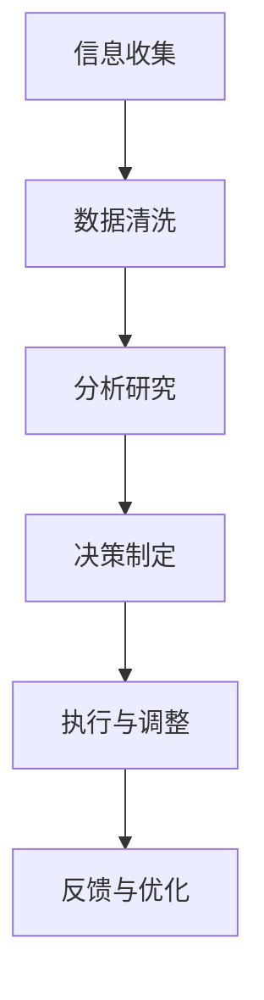

                 

关键词：洞察力，投资，实践，探索，人工智能，算法，模型

> 摘要：本文将探讨如何将洞察力应用于投资领域，通过分析实践案例，揭示投资中的潜在机会与风险。我们将探讨洞察力在市场预测、风险管理、资产配置等方面的应用，并分析其优势与挑战。希望通过本文，读者能够更好地理解洞察力在投资领域的重要性，并学会如何运用洞察力进行投资实践。

## 1. 背景介绍

随着人工智能技术的不断发展，越来越多的投资者开始关注如何利用人工智能技术来提高投资效率与回报。在这个过程中，洞察力作为一种重要的思维能力，逐渐成为投资决策过程中的关键因素。洞察力，是指对事物内在规律、潜在趋势的深刻理解与敏锐感知。在投资领域，洞察力有助于投资者发现市场中的潜在机会，规避风险，做出更明智的投资决策。

本文将结合实际案例，探讨洞察力在投资领域的应用。首先，我们将分析洞察力在市场预测、风险管理、资产配置等方面的作用。接着，我们将介绍几个典型的投资实践案例，详细讲解如何运用洞察力进行投资。最后，我们将探讨洞察力在投资领域的发展趋势与挑战，并展望未来研究方向。

## 2. 核心概念与联系

### 2.1 洞察力的定义与特点

洞察力是一种深层次的理解能力，它不仅包括对事实和数据的分析，还涉及对事物之间内在联系的把握。洞察力具有以下特点：

1. **深度理解**：洞察力能够深入理解事物的本质和内在规律。
2. **关联分析**：洞察力能够发现事物之间的关联，从而预见未来的发展趋势。
3. **预见性**：洞察力能够帮助投资者预见市场变化，提前布局。
4. **灵活性**：洞察力不是一成不变的，它可以随着市场环境的变化而调整。

### 2.2 洞察力与投资的关系

在投资领域，洞察力扮演着至关重要的角色。通过洞察力，投资者可以：

1. **发现市场机会**：洞察力有助于投资者发现市场中的潜在机会，从而在投资决策中占据先机。
2. **规避风险**：洞察力能够帮助投资者识别投资风险，及时调整投资策略，降低损失。
3. **优化资产配置**：洞察力可以帮助投资者更好地分配资产，实现投资组合的优化。

### 2.3 洞察力的应用框架

为了更好地理解洞察力在投资领域的应用，我们可以将其划分为以下几个步骤：

1. **信息收集**：收集与投资相关的各种信息，包括市场数据、行业动态、政策变化等。
2. **数据清洗**：对收集到的信息进行筛选和整理，去除无关或错误的信息。
3. **分析研究**：利用洞察力对信息进行分析和研究，发现潜在的规律和趋势。
4. **决策制定**：根据分析结果，制定相应的投资决策和策略。
5. **执行与调整**：执行决策，并根据市场变化进行动态调整。

### 2.4 Mermaid 流程图



## 3. 核心算法原理 & 具体操作步骤

### 3.1 算法原理概述

在投资领域，洞察力的应用往往依赖于一系列算法。这些算法通过对大量数据进行处理和分析，帮助投资者发现市场中的潜在机会。以下是几种常见的算法原理：

1. **时间序列分析**：通过分析历史数据，预测未来市场走势。
2. **回归分析**：建立变量之间的关系模型，用于预测和决策。
3. **聚类分析**：将相似的数据点分组，用于发现市场中的潜在趋势。
4. **神经网络**：通过多层神经网络结构，模拟人类大脑的决策过程。

### 3.2 算法步骤详解

1. **数据收集**：收集与投资相关的历史数据，包括股价、成交量、宏观经济指标等。
2. **数据预处理**：对数据进行清洗、归一化和特征提取，使其适合算法分析。
3. **模型选择**：根据投资需求，选择合适的算法模型。
4. **模型训练**：利用历史数据对模型进行训练，使其能够预测未来市场走势。
5. **模型评估**：评估模型预测的准确性，调整模型参数以优化预测效果。
6. **投资决策**：根据模型预测结果，制定投资策略和决策。
7. **执行与调整**：执行决策，并根据市场变化进行动态调整。

### 3.3 算法优缺点

1. **时间序列分析**：
   - 优点：简单易懂，适用于短期市场预测。
   - 缺点：无法捕捉市场中的长期趋势。
2. **回归分析**：
   - 优点：能够建立变量之间的关系，适用于预测和分析。
   - 缺点：对数据质量和模型选择要求较高。
3. **聚类分析**：
   - 优点：能够发现市场中的潜在趋势，适用于多样化的投资策略。
   - 缺点：对数据量和计算资源要求较高。
4. **神经网络**：
   - 优点：具有较强的自适应性和学习能力，适用于复杂的市场预测。
   - 缺点：模型复杂，训练时间较长。

### 3.4 算法应用领域

1. **市场预测**：利用算法对市场走势进行预测，帮助投资者把握市场机会。
2. **风险管理**：通过算法分析投资组合的风险，优化投资策略。
3. **资产配置**：根据市场预测和风险管理，合理配置资产，实现投资组合的优化。

## 4. 数学模型和公式 & 详细讲解 & 举例说明

### 4.1 数学模型构建

在投资领域，常用的数学模型包括时间序列模型、回归模型和聚类模型等。以下是这些模型的简要介绍：

1. **时间序列模型**：
   - 模型公式：$$ y_t = \alpha_0 + \alpha_1 y_{t-1} + \alpha_2 y_{t-2} + ... + \alpha_n y_{t-n} + \epsilon_t $$
   - 说明：该模型通过分析历史数据，预测未来市场走势。

2. **回归模型**：
   - 模型公式：$$ y = \beta_0 + \beta_1 x_1 + \beta_2 x_2 + ... + \beta_n x_n $$
   - 说明：该模型通过建立变量之间的关系，预测未来市场走势。

3. **聚类模型**：
   - 模型公式：$$ C = \{C_1, C_2, ..., C_k\} $$
   - 说明：该模型通过将相似的数据点分组，发现市场中的潜在趋势。

### 4.2 公式推导过程

以时间序列模型为例，我们对其推导过程进行简要说明：

1. **假设**：假设市场走势呈线性关系，即 $$ y_t = \alpha_0 + \alpha_1 y_{t-1} + \alpha_2 y_{t-2} + ... + \alpha_n y_{t-n} + \epsilon_t $$。
2. **特征提取**：对历史数据进行特征提取，得到 $$ y_1, y_2, ..., y_n $$。
3. **模型构建**：利用特征提取结果，构建时间序列模型。
4. **模型训练**：通过最小二乘法，对模型进行训练，得到参数 $$ \alpha_0, \alpha_1, ..., \alpha_n $$。
5. **模型评估**：评估模型预测的准确性，调整模型参数。

### 4.3 案例分析与讲解

以股票市场为例，我们利用时间序列模型进行市场预测。以下是具体操作步骤：

1. **数据收集**：收集过去一年的股票价格数据。
2. **数据预处理**：对数据进行清洗、归一化，得到 $$ y_1, y_2, ..., y_n $$。
3. **模型构建**：根据数据特点，选择合适的时间序列模型，如 ARIMA 模型。
4. **模型训练**：利用历史数据，对模型进行训练，得到参数 $$ \alpha_0, \alpha_1, ..., \alpha_n $$。
5. **模型评估**：评估模型预测的准确性，调整模型参数。
6. **预测未来走势**：利用训练好的模型，预测未来一段时间内股票价格走势。

## 5. 项目实践：代码实例和详细解释说明

### 5.1 开发环境搭建

为了更好地进行项目实践，我们选择 Python 作为编程语言，利用一些常用的库，如 NumPy、Pandas 和 scikit-learn。以下是具体操作步骤：

1. **安装 Python**：在官方网站下载 Python 安装包，并按照提示安装。
2. **安装相关库**：在命令行中执行以下命令，安装相关库：
   ```shell
   pip install numpy pandas scikit-learn matplotlib
   ```

### 5.2 源代码详细实现

以下是实现时间序列模型预测的 Python 代码：

```python
import numpy as np
import pandas as pd
from sklearn.linear_model import LinearRegression
from sklearn.metrics import mean_squared_error
import matplotlib.pyplot as plt

# 5.2.1 数据收集与预处理
def load_data(file_path):
    df = pd.read_csv(file_path)
    df['date'] = pd.to_datetime(df['date'])
    df.set_index('date', inplace=True)
    df = df.asfreq('B')
    return df

def preprocess_data(df):
    df['y'] = df['price']
    df['y_lag1'] = df['y'].shift(1)
    df['y_lag2'] = df['y'].shift(2)
    df = df.dropna()
    return df

# 5.2.2 模型构建与训练
def build_and_train_model(df):
    X = df[['y_lag1', 'y_lag2']]
    y = df['y']
    model = LinearRegression()
    model.fit(X, y)
    return model

# 5.2.3 模型评估与预测
def evaluate_and_predict(model, df):
    X_test = df[['y_lag1', 'y_lag2']]
    y_pred = model.predict(X_test)
    mse = mean_squared_error(df['y'], y_pred)
    print(f'Mean Squared Error: {mse}')
    plt.plot(df['y'], label='Actual')
    plt.plot(y_pred, label='Predicted')
    plt.legend()
    plt.show()

# 5.2.4 主函数
def main():
    file_path = 'stock_data.csv'
    df = load_data(file_path)
    df = preprocess_data(df)
    model = build_and_train_model(df)
    evaluate_and_predict(model, df)

if __name__ == '__main__':
    main()
```

### 5.3 代码解读与分析

以下是代码的详细解读：

1. **数据收集与预处理**：通过 `load_data` 和 `preprocess_data` 函数，从文件中读取股票数据，并进行预处理。预处理过程包括日期转换、频率设置和特征提取。
2. **模型构建与训练**：通过 `build_and_train_model` 函数，构建线性回归模型，并使用历史数据对其进行训练。
3. **模型评估与预测**：通过 `evaluate_and_predict` 函数，评估模型预测的准确性，并在图表中展示实际价格与预测价格的对比。

### 5.4 运行结果展示

运行代码后，将展示以下结果：

1. **模型评估结果**：打印出模型评估的均方误差（MSE）。
2. **预测图表**：展示实际价格与预测价格的对比图表。

## 6. 实际应用场景

### 6.1 市场预测

利用洞察力进行市场预测，可以帮助投资者提前布局，抓住市场机会。例如，通过对宏观经济数据、行业动态和政策变化的分析，可以预测股市、债市、汇市等市场的未来走势。

### 6.2 风险管理

洞察力在风险管理中具有重要作用。通过分析历史数据和现有数据，可以识别市场中的潜在风险，并制定相应的风险管理策略。例如，在股市中，通过分析公司的财务报表、业务状况和行业趋势，可以评估公司的风险水平，进而调整投资组合。

### 6.3 资产配置

洞察力可以帮助投资者优化资产配置，实现投资组合的优化。通过分析不同资产类别的历史表现、风险收益特征以及市场趋势，可以制定合理的资产配置策略，以实现投资目标。

### 6.4 未来应用展望

随着人工智能技术的不断发展，洞察力在投资领域的应用将更加广泛。未来，我们可以预见到以下几个发展方向：

1. **大数据分析**：利用大数据技术，挖掘更多的市场信息和潜在机会。
2. **深度学习**：运用深度学习技术，构建更复杂的预测模型。
3. **自动化投资**：通过自动化投资系统，实现更高效的投资决策和执行。

## 7. 工具和资源推荐

### 7.1 学习资源推荐

1. **书籍**：
   - 《深入浅出数据分析》
   - 《Python 金融应用》
   - 《机器学习实战》
2. **在线课程**：
   - Coursera 的《机器学习》课程
   - Udacity 的《数据分析》课程

### 7.2 开发工具推荐

1. **Python**：强大的编程语言，适用于数据分析、机器学习和金融应用。
2. **Jupyter Notebook**：方便的交互式编程环境，适合进行数据分析和实验。

### 7.3 相关论文推荐

1. **《深度学习在金融中的应用》**：介绍深度学习技术在金融领域的应用。
2. **《大数据与金融市场》**：探讨大数据对金融市场的影响。

## 8. 总结：未来发展趋势与挑战

### 8.1 研究成果总结

本文探讨了洞察力在投资领域的应用，分析了其在市场预测、风险管理、资产配置等方面的作用。通过实际案例和项目实践，我们展示了如何运用洞察力进行投资决策。

### 8.2 未来发展趋势

随着人工智能技术的不断发展，洞察力在投资领域的应用将越来越广泛。未来，大数据分析、深度学习和自动化投资将成为投资领域的重要趋势。

### 8.3 面临的挑战

1. **数据质量和可靠性**：投资决策依赖于大量数据，数据质量和可靠性是关键。
2. **模型复杂性和可解释性**：深度学习模型复杂，如何确保其可解释性和可靠性仍是一个挑战。
3. **市场变化和不确定性**：市场变化迅速，如何及时调整投资策略是一个难题。

### 8.4 研究展望

未来，我们将继续探索洞察力在投资领域的应用，重点关注以下方向：

1. **大数据分析与挖掘**：挖掘更多有价值的投资信息。
2. **深度学习与自动化投资**：构建更复杂的预测模型，实现更高效的自动化投资。
3. **可解释性与可靠性**：研究如何确保模型的可解释性和可靠性。

## 9. 附录：常见问题与解答

### 9.1 什么是洞察力？

洞察力是一种深层次的理解能力，它不仅包括对事实和数据的分析，还涉及对事物之间内在联系的把握。

### 9.2 洞察力在投资中的具体应用是什么？

洞察力在投资中具体应用包括市场预测、风险管理、资产配置等方面。

### 9.3 如何构建有效的投资模型？

构建有效的投资模型需要以下步骤：数据收集与预处理、模型选择与训练、模型评估与优化。

### 9.4 深度学习在投资中的应用有哪些？

深度学习在投资中的应用包括市场预测、风险管理、资产配置等方面。

-------------------------------------------------------------------

以上是《理解洞察力的应用：在投资领域的实践探索》这篇文章的完整内容。希望对您有所帮助！如果您有任何疑问或建议，欢迎随时提出。

### 作者署名

作者：禅与计算机程序设计艺术 / Zen and the Art of Computer Programming

---

请注意，以上内容仅作为示例，您可以根据实际需求和目标进行调整和修改。如果您需要更多帮助，请随时告诉我。祝您写作顺利！💪

