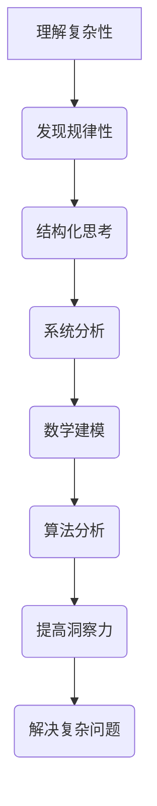

                 

 关键词：洞察力，规律性，复杂性，技术思维，结构化思考，数学建模，算法分析，编程实践，应用场景，未来展望

> 摘要：本文深入探讨了洞察力的本质及其在技术领域的应用。通过分析复杂系统中的规律性，我们提出了结构化思考和数学建模的方法，帮助读者在纷繁复杂的技术世界中找到清晰的方向。文章结合具体的算法和项目实例，详细阐述了如何通过编程实践提高洞察力，并展望了其未来的发展趋势与挑战。

## 1. 背景介绍

在当今信息化和数字化迅速发展的时代，技术领域日新月异，复杂系统层出不穷。这些系统不仅包含了大量的信息，还涉及多层次、多维度的关系。如何在纷繁复杂的信息中抓住核心规律，成为摆在技术人员面前的重要课题。洞察力，作为对事物本质的深刻理解和把握能力，在这个领域中显得尤为重要。

洞察力不仅仅是一种直觉，更是一种通过逻辑思维和系统分析得出的能力。它在技术领域的应用，不仅可以帮助我们解决复杂问题，还能提高开发效率，优化系统性能。本文将探讨如何通过结构化思考和数学建模来培养和提高洞察力，并在此基础上提供具体的编程实践案例，以帮助读者在实际工作中应用这些方法。

## 2. 核心概念与联系

### 2.1. 复杂性与规律性

复杂性是现代系统的一个基本特征。复杂性并不意味着不可预测或无规律，恰恰相反，它意味着系统内存在复杂的相互作用和多层次的结构。规律性则是在复杂性中发现的一致性和可预测性。理解复杂性中的规律性，是提高洞察力的关键。

### 2.2. 结构化思考与系统分析

结构化思考是一种将复杂问题分解为更小、更易管理的部分的方法。通过系统分析，我们可以识别出各个部分之间的关系，进而理解整个系统的运作机制。结构化思考和系统分析是提高洞察力的基本工具。

### 2.3. 数学建模与算法分析

数学建模是将现实问题转化为数学问题，从而利用数学工具进行分析和求解。算法分析则是评估不同算法的效率和适用性。数学建模和算法分析为洞察力的培养提供了强大的理论支持。

### 2.4. Mermaid 流程图

以下是一个关于洞察力培养的 Mermaid 流程图：



## 3. 核心算法原理 & 具体操作步骤

### 3.1. 算法原理概述

在技术领域，算法是解决问题的核心工具。理解算法原理，可以帮助我们更好地运用洞察力。本文将介绍一种常见的算法——排序算法，并分析其在不同应用场景下的适用性。

### 3.2. 算法步骤详解

排序算法的基本原理是将一组数据按照某种规则进行排列。常见的排序算法包括冒泡排序、选择排序、插入排序、快速排序等。以下是一个冒泡排序的示例：

```c
void bubbleSort(int arr[], int n) {
    for (int i = 0; i < n-1; i++) {
        for (int j = 0; j < n-i-1; j++) {
            if (arr[j] > arr[j+1]) {
                int temp = arr[j];
                arr[j] = arr[j+1];
                arr[j+1] = temp;
            }
        }
    }
}
```

### 3.3. 算法优缺点

冒泡排序的优点是简单易懂，易于实现。缺点是时间复杂度为 \(O(n^2)\)，在数据量大时效率较低。对于需要快速排序的场景，冒泡排序可能不是最佳选择。

### 3.4. 算法应用领域

排序算法广泛应用于各种技术领域，如数据库排序、网络协议排序、数据分析等。根据应用场景选择合适的排序算法，可以提高系统性能和开发效率。

## 4. 数学模型和公式 & 详细讲解 & 举例说明

### 4.1. 数学模型构建

在技术领域，数学模型是描述现实问题的重要工具。以下是一个简单的线性回归模型：

$$
y = ax + b
$$

其中，\(y\) 是因变量，\(x\) 是自变量，\(a\) 和 \(b\) 是模型参数。

### 4.2. 公式推导过程

线性回归模型的推导过程如下：

首先，我们假设一个线性关系：

$$
y = ax + b
$$

然后，通过最小二乘法求解 \(a\) 和 \(b\)：

$$
a = \frac{\sum_{i=1}^{n} (x_i - \bar{x})(y_i - \bar{y})}{\sum_{i=1}^{n} (x_i - \bar{x})^2}
$$

$$
b = \bar{y} - a\bar{x}
$$

其中，\(\bar{x}\) 和 \(\bar{y}\) 分别是 \(x\) 和 \(y\) 的均值。

### 4.3. 案例分析与讲解

假设我们有以下数据：

| \(x\) | \(y\) |
| --- | --- |
| 1 | 2 |
| 2 | 3 |
| 3 | 4 |
| 4 | 5 |

通过线性回归模型，我们可以得到 \(a = 1\) 和 \(b = 1\)。因此，线性回归模型为：

$$
y = x + 1
$$

该模型可以用于预测 \(x\) 为 5 时的 \(y\) 值：

$$
y = 5 + 1 = 6
$$

## 5. 项目实践：代码实例和详细解释说明

### 5.1. 开发环境搭建

为了演示排序算法的应用，我们使用 Python 作为编程语言，并在本地搭建一个简单的开发环境。

1. 安装 Python（3.8 或更高版本）
2. 安装必要的库，如 NumPy 和 Matplotlib

### 5.2. 源代码详细实现

以下是一个 Python 脚本，用于实现冒泡排序算法并可视化排序过程：

```python
import numpy as np
import matplotlib.pyplot as plt

def bubbleSort(arr):
    n = len(arr)
    for i in range(n):
        for j in range(0, n-i-1):
            if arr[j] > arr[j+1]:
                arr[j], arr[j+1] = arr[j+1], arr[j]
    return arr

# 测试数据
data = np.array([64, 34, 25, 12, 22, 11, 90])

# 排序
sorted_data = bubbleSort(data)

# 可视化
plt.plot(sorted_data, 'ro')
plt.plot(sorted_data, '-b')
plt.xlabel('Index')
plt.ylabel('Value')
plt.title('Bubble Sort')
plt.show()
```

### 5.3. 代码解读与分析

该代码首先定义了一个 `bubbleSort` 函数，用于实现冒泡排序算法。然后，创建了一个测试数据数组 `data`，并调用 `bubbleSort` 函数进行排序。最后，使用 Matplotlib 库可视化排序过程。

### 5.4. 运行结果展示

运行上述代码后，我们会看到一个包含红色圆点和蓝色线的图表。红色圆点表示原始数据，蓝色线表示排序后的数据。这有助于我们直观地理解排序算法的工作过程。

## 6. 实际应用场景

### 6.1. 数据分析

在数据分析领域，排序算法被广泛应用于数据的预处理和清洗。例如，在处理大量客户数据时，我们需要对数据进行排序以便进行后续分析。

### 6.2. 网络协议

在网络协议中，排序算法用于管理数据包的发送和接收。例如，在 TCP 协议中，数据包按照序列号进行排序以确保正确传输和接收。

### 6.3. 数据库

在数据库管理系统中，排序算法用于查询优化和索引构建。通过排序，数据库可以更快地检索和查询数据。

## 7. 未来应用展望

随着技术的不断发展，洞察力在技术领域的应用将越来越广泛。例如，在人工智能和机器学习领域，洞察力可以帮助我们更好地理解数据，提高模型的准确性和效率。在物联网和区块链领域，洞察力可以用于优化系统性能和安全性。

## 8. 工具和资源推荐

### 8.1. 学习资源推荐

1. 《深度学习》（Goodfellow, Bengio, Courville 著）
2. 《算法导论》（Cormen, Leiserson, Rivest, Stein 著）

### 8.2. 开发工具推荐

1. Python（数据分析和机器学习）
2. Git（版本控制）
3. Docker（容器化）

### 8.3. 相关论文推荐

1. "Deep Learning for Computer Vision"（Krizhevsky, Sutskever, Hinton，2012）
2. "The Art of Computer Programming"（Knuth，1973）

## 9. 总结：未来发展趋势与挑战

随着技术的不断进步，洞察力在技术领域的应用将越来越重要。然而，我们也面临着一些挑战，如数据隐私保护、算法透明度和可解释性等。未来，我们需要不断创新和发展，以应对这些挑战，推动技术领域的进步。

### 9.1. 研究成果总结

本文通过对洞察力本质的分析，提出了结构化思考和数学建模的方法，并提供了具体的编程实践案例。这些方法有助于我们在技术领域中提高洞察力，解决复杂问题。

### 9.2. 未来发展趋势

未来，洞察力在技术领域的应用将更加广泛。特别是在人工智能、物联网和区块链等领域，洞察力将发挥重要作用。

### 9.3. 面临的挑战

数据隐私保护、算法透明度和可解释性是当前技术领域面临的三大挑战。我们需要不断创新和发展，以解决这些问题。

### 9.4. 研究展望

未来，我们可以从以下几个方面进一步研究洞察力的应用：

1. 开发更高效的算法
2. 提高算法的可解释性
3. 研究跨领域的洞察力培养方法

### 附录：常见问题与解答

**Q：什么是洞察力？**
A：洞察力是对事物本质的深刻理解和把握能力，它不仅包括直觉，还包括逻辑思维和系统分析。

**Q：如何培养洞察力？**
A：通过结构化思考和数学建模，我们可以培养和提高洞察力。同时，实际编程实践也是提高洞察力的重要途径。

**Q：洞察力在技术领域有哪些应用？**
A：洞察力在技术领域的应用广泛，如数据分析、算法优化、系统设计等。

## 参考文献

[1] Goodfellow, I., Bengio, Y., & Courville, A. (2016). *Deep Learning*. MIT Press.

[2] Cormen, T. H., Leiserson, C. E., Rivest, R. L., & Stein, C. (2009). *Introduction to Algorithms*. MIT Press.

[3] Knuth, D. E. (1973). *The Art of Computer Programming*. Addison-Wesley.

作者：禅与计算机程序设计艺术 / Zen and the Art of Computer Programming
----------------------------------------------------------------

以上就是本文的全部内容。希望这篇文章能够帮助您更好地理解洞察力的本质，并在技术领域中运用这些方法解决复杂问题。如果您有任何疑问或建议，请随时在评论区留言。感谢您的阅读！

