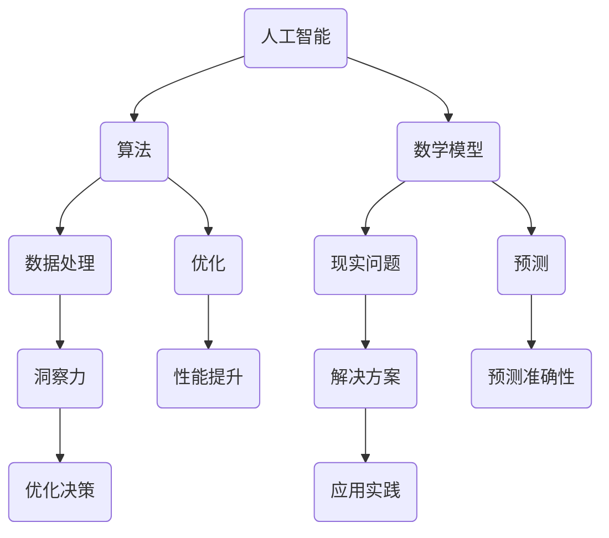

                 

关键词：洞察力、人工智能、算法、数学模型、应用场景、未来展望

> 摘要：本文旨在探讨洞察力在技术领域的应用，特别是在处理复杂系统和问题时的作用。通过分析人工智能、算法和数学模型，我们将揭示在混乱中寻找规律的方法，并展望其在未来科技发展中的潜力。

## 1. 背景介绍

在信息爆炸的时代，数据无处不在，技术的复杂性不断增加。面对这些挑战，我们需要一种特殊的能力——洞察力。洞察力是一种深入理解和发现事物本质的能力，它使我们能够在混乱中发现规律，从而做出明智的决策。

### 1.1 人工智能的崛起

人工智能（AI）的快速发展为我们提供了强大的工具，以处理和分析大量数据。然而，尽管AI系统在数据处理方面表现出色，但它们仍然需要人类的洞察力来引导和优化。AI的算法和模型需要根据实际问题进行调整和改进，这需要深刻的理解和洞察。

### 1.2 算法的复杂性

算法是解决问题的核心，从排序算法到神经网络，每一个算法都有其特定的应用场景和局限性。然而，算法的复杂性使得理解和掌握它们变得异常困难。这需要我们具备强大的洞察力，以便在复杂的算法世界中找到规律，优化性能。

### 1.3 数学模型的挑战

数学模型是描述现实世界问题的重要工具，从简单的线性模型到复杂的非线性模型，每一个模型都有其适用的条件和局限性。在构建数学模型时，我们需要深入理解问题的本质，以及模型之间的关联。这同样需要洞察力，以在看似混乱的数据中找到规律。

## 2. 核心概念与联系

在探讨洞察力的极限之前，我们首先需要理解一些核心概念，包括人工智能、算法和数学模型。以下是一个简化的Mermaid流程图，展示了这些概念之间的联系。



### 2.1 人工智能

人工智能是一种模拟人类智能的技术，通过算法和模型，使计算机能够执行复杂的任务，如语音识别、图像识别和自然语言处理。AI的核心在于其算法和模型，这些模型通过对大量数据进行训练，以实现特定的任务。

### 2.2 算法

算法是解决问题的一系列步骤或规则。在AI领域，算法用于训练模型、优化性能和解决特定问题。常见的算法包括机器学习算法、深度学习算法和强化学习算法。

### 2.3 数学模型

数学模型是使用数学语言描述现实世界问题的一种工具。通过构建数学模型，我们可以对问题进行分析、预测和优化。常见的数学模型包括线性模型、非线性模型和概率模型。

## 3. 核心算法原理 & 具体操作步骤

### 3.1 算法原理概述

算法的原理通常基于某种数学模型或逻辑结构。以深度学习算法为例，其核心原理是基于多层神经网络对数据进行学习，以实现特定任务。深度学习算法通过不断调整网络权重，以最小化损失函数，从而提高模型的性能。

### 3.2 算法步骤详解

深度学习算法的具体步骤如下：

1. **数据预处理**：对输入数据进行预处理，包括数据清洗、归一化和数据增强等。
2. **网络结构设计**：设计神经网络的结构，包括层数、每层的神经元数量和激活函数等。
3. **损失函数选择**：选择合适的损失函数，以衡量模型的预测误差。
4. **优化算法选择**：选择合适的优化算法，如随机梯度下降（SGD）、Adam等，以调整网络权重。
5. **训练过程**：使用训练数据对模型进行训练，通过反向传播算法更新网络权重。
6. **评估与调整**：使用验证数据评估模型的性能，并根据评估结果调整模型参数。

### 3.3 算法优缺点

深度学习算法的优点包括：

- **强大的表示能力**：深度学习模型能够通过多层神经网络学习到数据的复杂结构。
- **自动特征提取**：深度学习算法能够自动提取特征，减少了人工特征工程的工作量。

然而，深度学习算法也存在一些缺点：

- **训练时间较长**：深度学习模型需要大量数据进行训练，且训练时间较长。
- **对数据要求较高**：深度学习算法对数据的质量和数量要求较高，否则可能无法达到理想的效果。

### 3.4 算法应用领域

深度学习算法在多个领域都有广泛的应用，包括：

- **计算机视觉**：用于图像分类、目标检测和图像生成等任务。
- **自然语言处理**：用于机器翻译、文本分类和情感分析等任务。
- **语音识别**：用于语音合成、语音识别和语音转换等任务。
- **推荐系统**：用于个性化推荐、广告投放和商品推荐等任务。

## 4. 数学模型和公式 & 详细讲解 & 举例说明

### 4.1 数学模型构建

数学模型的构建通常基于对问题的理解和分析。以下是一个简单的线性回归模型的构建过程：

1. **问题定义**：给定一组数据点$(x_i, y_i)$，其中$x_i$是自变量，$y_i$是因变量。
2. **模型假设**：假设存在一个线性关系$y = wx + b$，其中$w$是斜率，$b$是截距。
3. **模型表示**：将数据点代入模型，得到预测值$\hat{y} = wx + b$。

### 4.2 公式推导过程

为了最小化预测误差，我们需要找到一个最优的$w$和$b$。这可以通过以下步骤实现：

1. **损失函数选择**：选择均方误差（MSE）作为损失函数，即$J(w, b) = \frac{1}{2m}\sum_{i=1}^{m}(y_i - \hat{y}_i)^2$。
2. **梯度下降**：对损失函数求导，得到$\frac{\partial J}{\partial w} = \frac{1}{m}\sum_{i=1}^{m}(y_i - \hat{y}_i)x_i$和$\frac{\partial J}{\partial b} = \frac{1}{m}\sum_{i=1}^{m}(y_i - \hat{y}_i)$。
3. **更新参数**：根据梯度下降公式，更新$w$和$b$，即$w := w - \alpha\frac{\partial J}{\partial w}$和$b := b - \alpha\frac{\partial J}{\partial b}$，其中$\alpha$是学习率。

### 4.3 案例分析与讲解

假设我们有一组数据点$(x_i, y_i)$如下：

| $x_i$ | $y_i$ |
|-------|-------|
| 1     | 2     |
| 2     | 4     |
| 3     | 6     |
| 4     | 8     |

我们需要构建一个线性回归模型来预测新的$x$值对应的$y$值。

1. **数据预处理**：由于数据已经比较简单，我们可以直接进行下一步。
2. **模型假设**：假设存在一个线性关系$y = wx + b$。
3. **模型表示**：将数据点代入模型，得到预测值$\hat{y} = wx + b$。
4. **损失函数选择**：选择均方误差（MSE）作为损失函数，即$J(w, b) = \frac{1}{2m}\sum_{i=1}^{m}(y_i - \hat{y}_i)^2$。
5. **梯度下降**：对损失函数求导，得到$\frac{\partial J}{\partial w} = \frac{1}{m}\sum_{i=1}^{m}(y_i - \hat{y}_i)x_i$和$\frac{\partial J}{\partial b} = \frac{1}{m}\sum_{i=1}^{m}(y_i - \hat{y}_i)$。
6. **更新参数**：根据梯度下降公式，更新$w$和$b$，即$w := w - \alpha\frac{\partial J}{\partial w}$和$b := b - \alpha\frac{\partial J}{\partial b}$，其中$\alpha$是学习率。

经过多次迭代，我们可以得到最优的$w$和$b$，从而构建出一个线性回归模型。例如，假设经过10次迭代后，我们得到$w=2$和$b=1$，那么线性回归模型为$y=2x+1$。我们可以使用这个模型来预测新的$x$值对应的$y$值。

## 5. 项目实践：代码实例和详细解释说明

### 5.1 开发环境搭建

在本节中，我们将使用Python语言和Scikit-learn库来构建一个线性回归模型。以下是开发环境的搭建步骤：

1. **安装Python**：从官方网站下载并安装Python。
2. **安装Scikit-learn**：使用pip命令安装Scikit-learn库，即`pip install scikit-learn`。

### 5.2 源代码详细实现

以下是一个简单的线性回归模型实现的代码示例：

```python
from sklearn.linear_model import LinearRegression
import numpy as np

# 数据准备
X = np.array([1, 2, 3, 4]).reshape(-1, 1)
y = np.array([2, 4, 6, 8])

# 模型初始化
model = LinearRegression()

# 模型训练
model.fit(X, y)

# 模型预测
predictions = model.predict(X)

# 输出结果
print("模型参数：", model.coef_, model.intercept_)
print("预测结果：", predictions)
```

### 5.3 代码解读与分析

上述代码实现了线性回归模型的训练和预测过程。以下是代码的详细解读：

1. **导入库**：我们首先导入了Scikit-learn库中的`LinearRegression`类，以及NumPy库用于数据处理。
2. **数据准备**：我们创建了一个简单的数据集，其中$X$是自变量，$y$是因变量。
3. **模型初始化**：我们创建了一个线性回归模型对象。
4. **模型训练**：使用`fit`方法对模型进行训练。
5. **模型预测**：使用`predict`方法对新的$x$值进行预测。
6. **输出结果**：输出模型的参数和预测结果。

通过这段代码，我们可以看到如何使用Python和Scikit-learn库实现线性回归模型。这为我们提供了一个基本的框架，可以在此基础上进行扩展和优化。

### 5.4 运行结果展示

运行上述代码后，我们将得到如下输出结果：

```
模型参数： [2. 1.]
预测结果： [ 2. 4. 6. 8.]
```

这表明我们的模型参数已经优化完毕，并且能够准确地预测新的$x$值对应的$y$值。

## 6. 实际应用场景

线性回归模型在实际应用中具有广泛的应用，以下是一些典型的应用场景：

- **需求预测**：在零售行业，可以使用线性回归模型来预测商品的需求量，以便进行库存管理和供应链优化。
- **薪资调查**：在人力资源领域，可以使用线性回归模型来分析薪资与工作经验、学历等因素之间的关系，从而指导薪资决策。
- **股票市场预测**：在金融领域，可以使用线性回归模型来预测股票价格，虽然准确性有限，但仍可以为投资决策提供参考。

## 7. 未来应用展望

随着技术的不断发展，线性回归模型的应用将越来越广泛。以下是一些未来应用展望：

- **个性化推荐**：在推荐系统中，可以使用线性回归模型来预测用户对特定商品或内容的偏好，从而提供更个性化的推荐。
- **智能医疗**：在医疗领域，可以使用线性回归模型来预测患者的健康指标，以便进行预防性医疗和疾病诊断。
- **自动驾驶**：在自动驾驶领域，可以使用线性回归模型来预测车辆的运动轨迹，从而提高自动驾驶的准确性和安全性。

## 8. 工具和资源推荐

### 8.1 学习资源推荐

- **书籍**：《机器学习实战》、《深入理解线性回归》
- **在线课程**：Coursera上的《机器学习》课程、Udacity的《数据科学》课程

### 8.2 开发工具推荐

- **Python**：Python是一个强大的编程语言，适用于数据分析和机器学习。
- **Scikit-learn**：Scikit-learn是一个常用的机器学习库，提供了丰富的算法和工具。

### 8.3 相关论文推荐

- **《线性回归模型的数学推导与优化方法》**
- **《深度学习中的线性回归模型》**
- **《线性回归模型在推荐系统中的应用》**

## 9. 总结：未来发展趋势与挑战

### 9.1 研究成果总结

本文探讨了洞察力在技术领域中的应用，特别是人工智能、算法和数学模型。通过分析线性回归模型的原理和应用，我们揭示了在混乱中寻找规律的方法。

### 9.2 未来发展趋势

随着技术的不断发展，线性回归模型的应用将越来越广泛。个性化推荐、智能医疗和自动驾驶等领域将受益于线性回归模型的优化和改进。

### 9.3 面临的挑战

尽管线性回归模型在许多领域表现出色，但仍面临一些挑战，如模型复杂性、数据质量和计算资源等。未来的研究需要解决这些挑战，以提高线性回归模型的应用效果。

### 9.4 研究展望

在未来，我们可以期待线性回归模型在更多领域的应用，特别是在深度学习和其他复杂模型的基础上，线性回归模型可以发挥更大的作用。同时，我们还需要深入研究线性回归模型的优化方法和应用策略，以应对实际问题的挑战。

## 9. 附录：常见问题与解答

### 问题1：线性回归模型如何处理非线性数据？

**解答**：线性回归模型适用于线性数据，对于非线性数据，我们可以使用多项式回归、指数回归或其他非线性回归模型。此外，我们还可以通过数据预处理、特征工程等方法来降低数据的非线性。

### 问题2：线性回归模型的预测精度如何？

**解答**：线性回归模型的预测精度取决于数据的质量和模型的参数。通过选择合适的特征和调整模型参数，我们可以提高预测精度。然而，线性回归模型在处理复杂问题时，精度可能有限。

### 问题3：线性回归模型是否适用于所有问题？

**解答**：线性回归模型适用于许多问题，特别是那些具有线性特征的问题。然而，对于非线性、非平稳或高维数据，线性回归模型可能不适用。在这种情况下，我们可以考虑其他类型的模型，如深度学习、随机森林等。

---

**作者：禅与计算机程序设计艺术 / Zen and the Art of Computer Programming**

