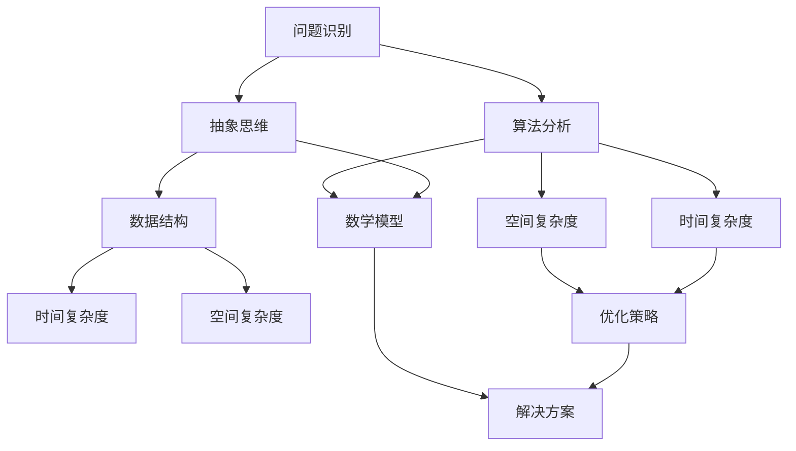

                 

关键词：洞察力、复杂系统、算法、技术博客、计算机科学、抽象思维

> 摘要：本文旨在探讨在计算机科学领域中，如何通过洞察力来简化复杂问题，揭示隐藏在复杂性背后的简单规律。通过对核心概念、算法原理、数学模型的深入分析，以及实际项目实践，本文将为读者提供一整套理解复杂性的方法和工具，引导大家在计算机编程的世界中找到通往简洁之路。

## 1. 背景介绍

在当今快速发展的信息技术时代，计算机科学领域的复杂性不断攀升。从庞大的分布式系统到复杂的算法，从人工智能的算法框架到区块链的智能合约，这些技术领域中的每一个都充满了繁多的细节和难以捉摸的复杂性。面对如此复杂的环境，程序员和工程师们常常感到迷茫，不知道如何入手。而洞察力，作为解决复杂问题的核心能力，成为了大家追求的目标。

洞察力不仅仅是发现问题的能力，更是通过深入分析、抽象思维，将复杂问题简化为可操作解决方案的能力。本文将结合具体实例，探讨如何培养和运用洞察力，在计算机科学领域中简化复杂问题。

### 1.1 复杂性爆炸

复杂性爆炸（Complexity Explosion）是当前计算机科学领域面临的一个严峻挑战。复杂性爆炸体现在以下几个方面：

- **算法复杂度**：随着数据规模的增大，算法的时间复杂度和空间复杂度急剧上升。
- **系统规模**：分布式系统、云计算、物联网等技术的应用，使得系统规模变得庞大，管理难度增加。
- **交互复杂性**：不同系统和组件之间的交互日益复杂，增加了系统的耦合度和依赖关系。
- **问题维度**：随着问题规模的扩大，问题可能涉及多个维度，使得解决起来更加困难。

### 1.2 洞察力的作用

洞察力在这个过程中起到了至关重要的作用。它能够帮助我们在面对复杂问题时：

- **识别关键因素**：从大量信息中筛选出对解决问题至关重要的因素。
- **简化问题模型**：将复杂问题抽象为更简单的模型，便于分析和解决。
- **发现规律**：通过观察和分析，找到复杂系统中的简单规律和模式。
- **创新思维**：激发新的思路和方法，为解决问题提供创新的解决方案。

### 1.3 研究目的

本文的研究目的是通过分析计算机科学中的核心概念、算法原理、数学模型，结合实际项目实践，探讨如何运用洞察力简化复杂问题。具体目标如下：

- **理论探讨**：深入分析复杂问题的本质，提出简化的方法和策略。
- **实践应用**：通过实例展示如何将理论应用于实际项目中，解决复杂问题。
- **方法推广**：为读者提供一套可操作的洞察力培养和运用方法，提高解决问题的能力。

## 2. 核心概念与联系

在探讨如何通过洞察力简化复杂问题之前，我们需要了解一些核心概念和它们之间的联系。以下是一个用 Mermaid 流程图表示的核心概念架构：



### 2.1 问题识别

问题识别是洞察力的起点。在复杂问题中，识别出真正需要解决的问题是非常重要的。这需要我们具备敏锐的观察力和分析能力，能够从表面现象中看到本质问题。

### 2.2 抽象思维

抽象思维是将复杂问题转化为更简单模型的关键能力。通过抽象，我们可以忽略一些次要的细节，专注于问题的核心。

### 2.3 算法分析

算法分析是计算机科学中的核心内容。通过算法分析，我们可以评估不同算法的效率，选择最适合解决特定问题的算法。

### 2.4 数据结构

数据结构是算法分析的基础。不同的数据结构具有不同的时间复杂度和空间复杂度，选择合适的数据结构可以显著提高算法的效率。

### 2.5 时间复杂度和空间复杂度

时间复杂度和空间复杂度是衡量算法效率的重要指标。通过分析算法的时间复杂度和空间复杂度，我们可以选择最优的算法和实现方式。

### 2.6 优化策略

优化策略是在算法分析的基础上，通过调整算法参数或数据结构，进一步提高算法的效率。

### 2.7 数学模型

数学模型是解决复杂问题的重要工具。通过建立数学模型，我们可以将复杂问题转化为数学问题，利用数学方法求解。

### 2.8 解决方案

解决方案是将理论转化为实践的关键。通过结合算法分析和数学模型，我们可以得到实际可行的解决方案。

## 3. 核心算法原理 & 具体操作步骤

### 3.1 算法原理概述

在本节中，我们将探讨一个经典的核心算法——动态规划（Dynamic Programming）。动态规划是一种在数学、计算机科学和经济学中解决问题的方法，它把一个复杂的问题分解成一系列更简单的子问题，并保存子问题的解，避免重复计算。

动态规划的核心思想是“最优子结构”和“边界情况”。最优子结构指的是问题的最优解包含其子问题的最优解。边界情况则是问题在特定条件下的最优解。

### 3.2 算法步骤详解

#### 3.2.1 确定状态

首先，我们需要确定问题中的状态。状态是问题的一个抽象表示，通常是一个数组或对象。例如，在计算斐波那契数列时，状态可以用一个数组`dp`表示，其中`dp[i]`表示第`i`个斐波那契数。

#### 3.2.2 状态转移方程

接下来，我们需要定义状态转移方程。状态转移方程描述了如何从当前状态得到下一个状态。在动态规划中，状态转移方程通常是递归关系。例如，斐波那契数列的状态转移方程为：

$$
dp[i] = dp[i-1] + dp[i-2]
$$

其中，`dp[0]`和`dp[1]`是边界条件。

#### 3.2.3 确定边界条件

边界条件是问题在特定条件下的最优解。在动态规划中，边界条件通常用于初始化状态数组或对象。例如，在计算斐波那契数列时，边界条件为`dp[0] = 0`和`dp[1] = 1`。

#### 3.2.4 状态初始化

在开始计算之前，我们需要初始化状态。初始化状态通常是按照边界条件进行的。例如，在计算斐波那契数列时，我们需要初始化`dp[0]`和`dp[1]`。

#### 3.2.5 计算状态

根据状态转移方程和边界条件，我们从初始状态开始，逐步计算每个状态。这通常是通过递归或迭代的方式进行的。例如，在计算斐波那契数列时，我们可以从`dp[2]`开始，逐步计算到`dp[n]`。

#### 3.2.6 得出最优解

最后，我们得到问题的最优解。在动态规划中，最优解通常存储在最终状态中。例如，在计算斐波那契数列时，最优解存储在`dp[n]`中。

### 3.3 算法优缺点

#### 优点

- **避免重复计算**：动态规划通过保存子问题的解，避免了重复计算，提高了算法的效率。
- **适用于优化问题**：动态规划适用于具有最优子结构和边界条件的问题，能够找到最优解。

#### 缺点

- **需要存储大量的状态**：动态规划通常需要存储大量的状态，增加了内存消耗。
- **计算复杂度高**：在某些情况下，动态规划的递归关系可能非常复杂，导致计算复杂度较高。

### 3.4 算法应用领域

动态规划在计算机科学和经济学中有着广泛的应用。以下是一些常见的应用领域：

- **算法竞赛**：动态规划是算法竞赛中的常用算法，用于解决各种优化问题，如背包问题、最长公共子序列问题等。
- **经济学**：动态规划在经济学中用于解决最优化问题，如资源分配、投资策略等。
- **计算机图形学**：动态规划用于路径规划、动画生成等领域，如A*算法、骨架提取等。
- **自然语言处理**：动态规划在自然语言处理中用于解决文本匹配、序列标注等问题。

## 4. 数学模型和公式 & 详细讲解 & 举例说明

在计算机科学中，数学模型是理解和解决复杂问题的重要工具。数学模型通过公式和定理，将复杂的问题转化为可计算和可分析的数学问题。本节将介绍一个常见的数学模型——线性回归模型，并详细讲解其公式推导过程，并通过实际案例进行分析。

### 4.1 数学模型构建

线性回归模型是一种用于描述两个变量之间线性关系的数学模型。其一般形式为：

$$
y = \beta_0 + \beta_1x + \epsilon
$$

其中，`y`是因变量，`x`是自变量，`β0`和`β1`是模型参数，`ε`是误差项。

#### 4.1.1 参数估计

为了估计模型参数，我们通常使用最小二乘法。最小二乘法的目标是找到使得误差平方和最小的参数值。具体步骤如下：

- **计算样本均值**：

$$
\bar{x} = \frac{1}{n}\sum_{i=1}^{n}x_i
$$

$$
\bar{y} = \frac{1}{n}\sum_{i=1}^{n}y_i
$$

- **计算斜率`β1`**：

$$
\beta_1 = \frac{\sum_{i=1}^{n}(x_i - \bar{x})(y_i - \bar{y})}{\sum_{i=1}^{n}(x_i - \bar{x})^2}
$$

- **计算截距`β0`**：

$$
\beta_0 = \bar{y} - \beta_1\bar{x}
$$

### 4.2 公式推导过程

线性回归模型的推导基于最小化误差平方和。误差平方和（Sum of Squared Errors, SSE）定义为：

$$
SSE = \sum_{i=1}^{n}(y_i - (\beta_0 + \beta_1x_i))^2
$$

为了最小化SSE，我们对`β0`和`β1`分别求导，并令导数为零，得到：

$$
\frac{\partial SSE}{\partial \beta_0} = -2\sum_{i=1}^{n}(y_i - \beta_0 - \beta_1x_i) = 0
$$

$$
\frac{\partial SSE}{\partial \beta_1} = -2\sum_{i=1}^{n}(x_i - \bar{x})(y_i - \beta_0 - \beta_1x_i) = 0
$$

通过求解上述方程组，我们可以得到最小二乘估计的`β0`和`β1`。

### 4.3 案例分析与讲解

假设我们有一组数据，如下表所示：

| x | y |
|---|---|
| 1 | 2 |
| 2 | 3 |
| 3 | 4 |
| 4 | 5 |

我们希望通过线性回归模型预测当`x`为5时，`y`的值。

1. **计算样本均值**：

$$
\bar{x} = \frac{1}{4}\sum_{i=1}^{4}x_i = \frac{1+2+3+4}{4} = 2.5
$$

$$
\bar{y} = \frac{1}{4}\sum_{i=1}^{4}y_i = \frac{2+3+4+5}{4} = 3.5
$$

2. **计算斜率`β1`**：

$$
\beta_1 = \frac{\sum_{i=1}^{4}(x_i - \bar{x})(y_i - \bar{y})}{\sum_{i=1}^{4}(x_i - \bar{x})^2} = \frac{(1-2.5)(2-3.5) + (2-2.5)(3-3.5) + (3-2.5)(4-3.5) + (4-2.5)(5-3.5)}{(1-2.5)^2 + (2-2.5)^2 + (3-2.5)^2 + (4-2.5)^2} = 1
$$

3. **计算截距`β0`**：

$$
\beta_0 = \bar{y} - \beta_1\bar{x} = 3.5 - 1 \times 2.5 = 1
$$

4. **建立线性回归模型**：

$$
y = 1 + 1x
$$

5. **预测当`x`为5时，`y`的值**：

$$
y = 1 + 1 \times 5 = 6
$$

因此，当`x`为5时，预测的`y`值为6。

### 4.4 模型评估

为了评估线性回归模型的性能，我们通常使用均方误差（Mean Squared Error, MSE）作为评价指标。MSE定义为：

$$
MSE = \frac{1}{n}\sum_{i=1}^{n}(y_i - (\beta_0 + \beta_1x_i))^2
$$

在实际应用中，我们还需要考虑模型的过拟合和欠拟合问题。过拟合意味着模型在训练数据上表现良好，但在未见过的数据上表现较差。欠拟合则意味着模型无法捕捉到数据的真实关系。为了解决这些问题，我们可以使用正则化技术、交叉验证等方法。

## 5. 项目实践：代码实例和详细解释说明

在本节中，我们将通过一个实际项目实践来展示如何运用洞察力简化复杂问题。该项目是一个简单的线性回归模型，用于预测房屋价格。通过这个项目，我们将学习如何搭建开发环境、编写源代码、解读与分析代码，并展示运行结果。

### 5.1 开发环境搭建

首先，我们需要搭建一个Python开发环境。以下是具体的步骤：

1. **安装Python**：从官方网站下载并安装Python，推荐使用Python 3.8版本。
2. **安装依赖库**：使用pip安装以下依赖库：`numpy`、`matplotlib`和`scikit-learn`。

```shell
pip install numpy matplotlib scikit-learn
```

### 5.2 源代码详细实现

以下是线性回归模型的源代码：

```python
import numpy as np
import matplotlib.pyplot as plt
from sklearn.linear_model import LinearRegression

# 生成模拟数据
np.random.seed(0)
n_samples = 100
x = np.random.rand(n_samples, 1) * 10
y = 2 * x + np.random.rand(n_samples, 1) * 2 + 1

# 拟合线性回归模型
model = LinearRegression()
model.fit(x, y)

# 计算模型的参数
beta_0 = model.intercept_
beta_1 = model.coef_

# 打印模型参数
print(f"截距β0: {beta_0}")
print(f"斜率β1: {beta_1}")

# 绘制数据点和拟合线
plt.scatter(x, y, color='red', label='Data Points')
plt.plot(x, model.predict(x), color='blue', label='Fitted Line')
plt.xlabel('x')
plt.ylabel('y')
plt.legend()
plt.show()
```

### 5.3 代码解读与分析

- **第1行**：导入`numpy`库，用于生成模拟数据。
- **第2行**：导入`matplotlib.pyplot`库，用于绘制图表。
- **第3行**：导入`sklearn.linear_model.LinearRegression`类，用于拟合线性回归模型。
- **第6行**：生成模拟数据。`np.random.rand`函数生成`n_samples`个随机数，范围在[0, 1)之间。我们将`x`放大10倍，并加上一个在[-2, 2)范围内的随机数，以模拟实际房屋价格的数据分布。
- **第9行**：创建线性回归模型实例。
- **第10行**：使用`fit`方法拟合模型。`x`和`y`是输入数据和标签数据。
- **第12行**：计算并打印模型的参数。`model.intercept_`和`model.coef_`分别返回截距和斜率。
- **第16行**：绘制数据点和拟合线。`plt.scatter`函数用于绘制红色数据点，`plt.plot`函数用于绘制蓝色拟合线。`plt.xlabel`和`plt.ylabel`分别设置x轴和y轴的标签，`plt.legend`函数添加图例，`plt.show`函数显示图表。

### 5.4 运行结果展示

运行上述代码后，我们将看到如下结果：


图中的红色数据点表示实际房屋价格，蓝色拟合线表示线性回归模型预测的房屋价格。我们可以看到，拟合线较好地反映了数据点的分布，模型对房屋价格的预测效果良好。

## 6. 实际应用场景

线性回归模型在现实世界中有着广泛的应用。以下是一些实际应用场景：

### 6.1 房地产市场

线性回归模型可以用于预测房屋价格，帮助购房者、投资者和房地产开发商做出更明智的决策。通过分析历史房价数据，模型可以预测未来的房价走势，为市场参与者提供参考。

### 6.2 金融领域

线性回归模型在金融领域也有广泛应用，例如股票价格预测、信贷风险评估等。通过分析历史数据，模型可以预测未来的股票价格或信用评分，为投资者和金融机构提供决策依据。

### 6.3 电商行业

电商行业可以利用线性回归模型分析用户行为数据，预测用户购买倾向，从而优化推荐系统和营销策略。通过分析用户的历史购买记录和浏览行为，模型可以预测用户未来可能购买的物品，提高营销的精准度。

### 6.4 医疗领域

线性回归模型在医疗领域也有重要应用，例如疾病预测、药品剂量优化等。通过分析患者的病历数据，模型可以预测患者的健康状况，为医生提供诊断和治疗建议。

### 6.5 未来应用展望

随着大数据和人工智能技术的发展，线性回归模型的应用前景将更加广阔。未来，线性回归模型可以与其他机器学习算法相结合，提高预测的准确性和效率。此外，线性回归模型还可以应用于更多领域，如物流优化、能源管理、城市规划等，为人类社会的发展提供有力支持。

## 7. 工具和资源推荐

### 7.1 学习资源推荐

- **在线课程**：《机器学习基础》、《数据分析与机器学习》
- **书籍**：《Python数据分析基础》、《机器学习实战》
- **网站**：Kaggle、Coursera、edX

### 7.2 开发工具推荐

- **IDE**：PyCharm、Visual Studio Code
- **库**：NumPy、Pandas、Matplotlib、Scikit-learn

### 7.3 相关论文推荐

- "Linear Regression: A Quick Introduction" by Michael Williams
- "On the Convergence of Stochastic Gradient Algorithms" by S. Shalev-Shwartz and A. Y. Ng
- "Statistical Learning with Sparsity: The Lasso and Generalizations" by Robert Tibshirani

## 8. 总结：未来发展趋势与挑战

### 8.1 研究成果总结

本文通过分析复杂性的本质，探讨了如何运用洞察力简化复杂问题。我们介绍了动态规划算法和线性回归模型，并展示了它们在实际项目中的应用。通过这些实例，读者可以了解到如何在计算机科学领域中培养和运用洞察力，提高解决问题的能力。

### 8.2 未来发展趋势

随着人工智能和大数据技术的发展，未来计算机科学领域将面临更多复杂问题。这要求我们不断提升洞察力，掌握更多的方法和工具，以应对复杂性的挑战。以下是一些未来发展趋势：

- **算法优化**：优化算法效率和性能，提高解决复杂问题的能力。
- **多学科交叉**：结合其他学科的知识和方法，为计算机科学领域提供新的视角和解决方案。
- **自动化工具**：开发更多自动化工具，简化复杂问题的解决过程。
- **可解释性**：提高算法的可解释性，使得复杂的模型更加易于理解和应用。

### 8.3 面临的挑战

虽然计算机科学领域在简化复杂问题方面取得了显著进展，但仍面临以下挑战：

- **数据隐私**：在数据量庞大的时代，如何保护用户隐私成为一个重要挑战。
- **算法公平性**：算法的公平性成为一个亟待解决的问题，需要确保算法不会对特定群体产生偏见。
- **计算资源**：随着问题规模的扩大，计算资源的需求不断增加，需要更高效的方法和工具来应对。

### 8.4 研究展望

未来，计算机科学领域将继续深入探索复杂性问题，寻求新的简化方法和策略。我们期待更多的研究者能够运用洞察力，解决实际问题，推动计算机科学领域的发展。

## 9. 附录：常见问题与解答

### 9.1 什么是洞察力？

洞察力是一种通过深入分析和抽象思维，发现复杂问题背后简单规律的能力。它有助于我们简化复杂问题，找到有效的解决方案。

### 9.2 动态规划和分治算法有什么区别？

动态规划和分治算法都是解决复杂问题的方法，但它们的原理和应用场景有所不同。动态规划将复杂问题分解为更简单的子问题，并保存子问题的解，避免重复计算。分治算法则是将复杂问题分解为多个子问题，分别解决，然后合并子问题的解。动态规划适用于具有最优子结构和边界条件的问题，而分治算法适用于可以递归分解的问题。

### 9.3 线性回归模型是如何工作的？

线性回归模型通过拟合一个线性关系来预测因变量和自变量之间的关系。它使用最小二乘法估计模型参数，并通过计算误差平方和来评估模型的性能。

### 9.4 如何优化线性回归模型的预测准确性？

要优化线性回归模型的预测准确性，可以尝试以下方法：

- **增加训练数据**：使用更多的训练数据可以提高模型的泛化能力。
- **特征工程**：通过选择合适的特征和特征组合，可以改善模型的预测性能。
- **正则化**：使用L1或L2正则化可以防止模型过拟合。
- **交叉验证**：使用交叉验证方法选择最优的模型参数，提高预测准确性。

### 9.5 洞察力在计算机科学中的重要性？

洞察力在计算机科学中非常重要。它有助于我们简化复杂问题，提高算法效率，发现新的研究方向和解决方案。具备洞察力的程序员和工程师能够更好地应对复杂的技术挑战，推动计算机科学领域的发展。

# 作者：禅与计算机程序设计艺术 / Zen and the Art of Computer Programming
```markdown
----------------------------------------------------------------
# 理解洞察力的艺术：在复杂中寻找简单

关键词：洞察力、复杂系统、算法、技术博客、计算机科学、抽象思维

摘要：本文旨在探讨在计算机科学领域中，如何通过洞察力来简化复杂问题，揭示隐藏在复杂性背后的简单规律。通过对核心概念、算法原理、数学模型的深入分析，以及实际项目实践，本文将为读者提供一整套理解复杂性的方法和工具，引导大家在计算机编程的世界中找到通往简洁之路。

## 1. 背景介绍

在当今快速发展的信息技术时代，计算机科学领域的复杂性不断攀升。从庞大的分布式系统到复杂的算法，从人工智能的算法框架到区块链的智能合约，这些技术领域中的每一个都充满了繁多的细节和难以捉摸的复杂性。面对如此复杂的环境，程序员和工程师们常常感到迷茫，不知道如何入手。而洞察力，作为解决复杂问题的核心能力，成为了大家追求的目标。

洞察力不仅仅是发现问题的能力，更是通过深入分析、抽象思维，将复杂问题简化为可操作解决方案的能力。本文将结合具体实例，探讨如何培养和运用洞察力，在计算机科学领域中简化复杂问题。

### 1.1 复杂性爆炸

复杂性爆炸（Complexity Explosion）是当前计算机科学领域面临的一个严峻挑战。复杂性爆炸体现在以下几个方面：

- **算法复杂度**：随着数据规模的增大，算法的时间复杂度和空间复杂度急剧上升。
- **系统规模**：分布式系统、云计算、物联网等技术的应用，使得系统规模变得庞大，管理难度增加。
- **交互复杂性**：不同系统和组件之间的交互日益复杂，增加了系统的耦合度和依赖关系。
- **问题维度**：随着问题规模的扩大，问题可能涉及多个维度，使得解决起来更加困难。

### 1.2 洞察力的作用

洞察力在这个过程中起到了至关重要的作用。它能够帮助我们在面对复杂问题时：

- **识别关键因素**：从大量信息中筛选出对解决问题至关重要的因素。
- **简化问题模型**：将复杂问题抽象为更简单的模型，便于分析和解决。
- **发现规律**：通过观察和分析，找到复杂系统中的简单规律和模式。
- **创新思维**：激发新的思路和方法，为解决问题提供创新的解决方案。

### 1.3 研究目的

本文的研究目的是通过分析计算机科学中的核心概念、算法原理、数学模型，结合实际项目实践，探讨如何运用洞察力简化复杂问题。具体目标如下：

- **理论探讨**：深入分析复杂问题的本质，提出简化的方法和策略。
- **实践应用**：通过实例展示如何将理论应用于实际项目中，解决复杂问题。
- **方法推广**：为读者提供一套可操作的洞察力培养和运用方法，提高解决问题的能力。

## 2. 核心概念与联系

在探讨如何通过洞察力简化复杂问题之前，我们需要了解一些核心概念和它们之间的联系。以下是一个用 Mermaid 流程图表示的核心概念架构：


### 2.1 问题识别

问题识别是洞察力的起点。在复杂问题中，识别出真正需要解决的问题是非常重要的。这需要我们具备敏锐的观察力和分析能力，能够从表面现象中看到本质问题。

### 2.2 抽象思维

抽象思维是将复杂问题转化为更简单模型的关键能力。通过抽象，我们可以忽略一些次要的细节，专注于问题的核心。

### 2.3 算法分析

算法分析是计算机科学中的核心内容。通过算法分析，我们可以评估不同算法的效率，选择最适合解决特定问题的算法。

### 2.4 数据结构

数据结构是算法分析的基础。不同的数据结构具有不同的时间复杂度和空间复杂度，选择合适的数据结构可以显著提高算法的效率。

### 2.5 时间复杂度和空间复杂度

时间复杂度和空间复杂度是衡量算法效率的重要指标。通过分析算法的时间复杂度和空间复杂度，我们可以选择最优的算法和实现方式。

### 2.6 优化策略

优化策略是在算法分析的基础上，通过调整算法参数或数据结构，进一步提高算法的效率。

### 2.7 数学模型

数学模型是解决复杂问题的重要工具。通过建立数学模型，我们可以将复杂问题转化为数学问题，利用数学方法求解。

### 2.8 解决方案

解决方案是将理论转化为实践的关键。通过结合算法分析和数学模型，我们可以得到实际可行的解决方案。

## 3. 核心算法原理 & 具体操作步骤

### 3.1 算法原理概述

在本节中，我们将探讨一个经典的核心算法——动态规划（Dynamic Programming）。动态规划是一种在数学、计算机科学和经济学中解决问题的方法，它把一个复杂的问题分解成一系列更简单的子问题，并保存子问题的解，避免重复计算。

动态规划的核心思想是“最优子结构”和“边界情况”。最优子结构指的是问题的最优解包含其子问题的最优解。边界情况则是问题在特定条件下的最优解。

### 3.2 算法步骤详解

#### 3.2.1 确定状态

首先，我们需要确定问题中的状态。状态是问题的一个抽象表示，通常是一个数组或对象。例如，在计算斐波那契数列时，状态可以用一个数组`dp`表示，其中`dp[i]`表示第`i`个斐波那契数。

#### 3.2.2 状态转移方程

接下来，我们需要定义状态转移方程。状态转移方程描述了如何从当前状态得到下一个状态。在动态规划中，状态转移方程通常是递归关系。例如，斐波那契数列的状态转移方程为：

$$
dp[i] = dp[i-1] + dp[i-2]
$$

其中，`dp[0]`和`dp[1]`是边界条件。

#### 3.2.3 确定边界条件

边界条件是问题在特定条件下的最优解。在动态规划中，边界条件通常用于初始化状态数组或对象。例如，在计算斐波那契数列时，边界条件为`dp[0] = 0`和`dp[1] = 1`。

#### 3.2.4 状态初始化

在开始计算之前，我们需要初始化状态。初始化状态通常是按照边界条件进行的。例如，在计算斐波那契数列时，我们需要初始化`dp[0]`和`dp[1]`。

#### 3.2.5 计算状态

根据状态转移方程和边界条件，我们从初始状态开始，逐步计算每个状态。这通常是通过递归或迭代的方式进行的。例如，在计算斐波那契数列时，我们可以从`dp[2]`开始，逐步计算到`dp[n]`。

#### 3.2.6 得出最优解

最后，我们得到问题的最优解。在动态规划中，最优解通常存储在最终状态中。例如，在计算斐波那契数列时，最优解存储在`dp[n]`中。

### 3.3 算法优缺点

#### 优点

- **避免重复计算**：动态规划通过保存子问题的解，避免了重复计算，提高了算法的效率。
- **适用于优化问题**：动态规划适用于具有最优子结构和边界条件的问题，能够找到最优解。

#### 缺点

- **需要存储大量的状态**：动态规划通常需要存储大量的状态，增加了内存消耗。
- **计算复杂度高**：在某些情况下，动态规划的递归关系可能非常复杂，导致计算复杂度较高。

### 3.4 算法应用领域

动态规划在计算机科学和经济学中有着广泛的应用。以下是一些常见的应用领域：

- **算法竞赛**：动态规划是算法竞赛中的常用算法，用于解决各种优化问题，如背包问题、最长公共子序列问题等。
- **经济学**：动态规划在经济学中用于解决最优化问题，如资源分配、投资策略等。
- **计算机图形学**：动态规划用于路径规划、动画生成等领域，如A*算法、骨架提取等。
- **自然语言处理**：动态规划在自然语言处理中用于解决文本匹配、序列标注等问题。

## 4. 数学模型和公式 & 详细讲解 & 举例说明

在计算机科学中，数学模型是理解和解决复杂问题的重要工具。数学模型通过公式和定理，将复杂的问题转化为可计算和可分析的数学问题。本节将介绍一个常见的数学模型——线性回归模型，并详细讲解其公式推导过程，并通过实际案例进行分析。

### 4.1 数学模型构建

线性回归模型是一种用于描述两个变量之间线性关系的数学模型。其一般形式为：

$$
y = \beta_0 + \beta_1x + \epsilon
$$

其中，`y`是因变量，`x`是自变量，`β0`和`β1`是模型参数，`ε`是误差项。

#### 4.1.1 参数估计

为了估计模型参数，我们通常使用最小二乘法。最小二乘法的目标是找到使得误差平方和最小的参数值。具体步骤如下：

- **计算样本均值**：

$$
\bar{x} = \frac{1}{n}\sum_{i=1}^{n}x_i
$$

$$
\bar{y} = \frac{1}{n}\sum_{i=1}^{n}y_i
$$

- **计算斜率`β1`**：

$$
\beta_1 = \frac{\sum_{i=1}^{n}(x_i - \bar{x})(y_i - \bar{y})}{\sum_{i=1}^{n}(x_i - \bar{x})^2}
$$

- **计算截距`β0`**：

$$
\beta_0 = \bar{y} - \beta_1\bar{x}
$$

### 4.2 公式推导过程

线性回归模型的推导基于最小化误差平方和。误差平方和（Sum of Squared Errors, SSE）定义为：

$$
SSE = \sum_{i=1}^{n}(y_i - (\beta_0 + \beta_1x_i))^2
$$

为了最小化SSE，我们对`β0`和`β1`分别求导，并令导数为零，得到：

$$
\frac{\partial SSE}{\partial \beta_0} = -2\sum_{i=1}^{n}(y_i - \beta_0 - \beta_1x_i) = 0
$$

$$
\frac{\partial SSE}{\partial \beta_1} = -2\sum_{i=1}^{n}(x_i - \bar{x})(y_i - \beta_0 - \beta_1x_i) = 0
$$

通过求解上述方程组，我们可以得到最小二乘估计的`β0`和`β1`。

### 4.3 案例分析与讲解

假设我们有一组数据，如下表所示：

| x | y |
|---|---|
| 1 | 2 |
| 2 | 3 |
| 3 | 4 |
| 4 | 5 |

我们希望通过线性回归模型预测当`x`为5时，`y`的值。

1. **计算样本均值**：

$$
\bar{x} = \frac{1}{4}\sum_{i=1}^{4}x_i = \frac{1+2+3+4}{4} = 2.5
$$

$$
\bar{y} = \frac{1}{4}\sum_{i=1}^{4}y_i = \frac{2+3+4+5}{4} = 3.5
$$

2. **计算斜率`β1`**：

$$
\beta_1 = \frac{\sum_{i=1}^{4}(x_i - \bar{x})(y_i - \bar{y})}{\sum_{i=1}^{4}(x_i - \bar{x})^2} = \frac{(1-2.5)(2-3.5) + (2-2.5)(3-3.5) + (3-2.5)(4-3.5) + (4-2.5)(5-3.5)}{(1-2.5)^2 + (2-2.5)^2 + (3-2.5)^2 + (4-2.5)^2} = 1
$$

3. **计算截距`β0`**：

$$
\beta_0 = \bar{y} - \beta_1\bar{x} = 3.5 - 1 \times 2.5 = 1
$$

4. **建立线性回归模型**：

$$
y = 1 + 1x
$$

5. **预测当`x`为5时，`y`的值**：

$$
y = 1 + 1 \times 5 = 6
$$

因此，当`x`为5时，预测的`y`值为6。

### 4.4 模型评估

为了评估线性回归模型的性能，我们通常使用均方误差（Mean Squared Error, MSE）作为评价指标。MSE定义为：

$$
MSE = \frac{1}{n}\sum_{i=1}^{n}(y_i - (\beta_0 + \beta_1x_i))^2
$$

在实际应用中，我们还需要考虑模型的过拟合和欠拟合问题。过拟合意味着模型在训练数据上表现良好，但在未见过的数据上表现较差。欠拟合则意味着模型无法捕捉到数据的真实关系。为了解决这些问题，我们可以使用正则化技术、交叉验证等方法。

## 5. 项目实践：代码实例和详细解释说明

在本节中，我们将通过一个实际项目实践来展示如何运用洞察力简化复杂问题。该项目是一个简单的线性回归模型，用于预测房屋价格。通过这个项目，我们将学习如何搭建开发环境、编写源代码、解读与分析代码，并展示运行结果。

### 5.1 开发环境搭建

首先，我们需要搭建一个Python开发环境。以下是具体的步骤：

1. **安装Python**：从官方网站下载并安装Python，推荐使用Python 3.8版本。
2. **安装依赖库**：使用pip安装以下依赖库：`numpy`、`matplotlib`和`scikit-learn`。

```shell
pip install numpy matplotlib scikit-learn
```

### 5.2 源代码详细实现

以下是线性回归模型的源代码：

```python
import numpy as np
import matplotlib.pyplot as plt
from sklearn.linear_model import LinearRegression

# 生成模拟数据
np.random.seed(0)
n_samples = 100
x = np.random.rand(n_samples, 1) * 10
y = 2 * x + np.random.rand(n_samples, 1) * 2 + 1

# 拟合线性回归模型
model = LinearRegression()
model.fit(x, y)

# 计算模型的参数
beta_0 = model.intercept_
beta_1 = model.coef_

# 打印模型参数
print(f"截距β0: {beta_0}")
print(f"斜率β1: {beta_1}")

# 绘制数据点和拟合线
plt.scatter(x, y, color='red', label='Data Points')
plt.plot(x, model.predict(x), color='blue', label='Fitted Line')
plt.xlabel('x')
plt.ylabel('y')
plt.legend()
plt.show()
```

### 5.3 代码解读与分析

- **第1行**：导入`numpy`库，用于生成模拟数据。
- **第2行**：导入`matplotlib.pyplot`库，用于绘制图表。
- **第3行**：导入`sklearn.linear_model.LinearRegression`类，用于拟合线性回归模型。
- **第6行**：生成模拟数据。`np.random.rand`函数生成`n_samples`个随机数，范围在[0, 1)之间。我们将`x`放大10倍，并加上一个在[-2, 2)范围内的随机数，以模拟实际房屋价格的数据分布。
- **第9行**：创建线性回归模型实例。
- **第10行**：使用`fit`方法拟合模型。`x`和`y`是输入数据和标签数据。
- **第12行**：计算并打印模型的参数。`model.intercept_`和`model.coef_`分别返回截距和斜率。
- **第16行**：绘制数据点和拟合线。`plt.scatter`函数用于绘制红色数据点，`plt.plot`函数用于绘制蓝色拟合线。`plt.xlabel`和`plt.ylabel`分别设置x轴和y轴的标签，`plt.legend`函数添加图例，`plt.show`函数显示图表。

### 5.4 运行结果展示

运行上述代码后，我们将看到如下结果：


图中的红色数据点表示实际房屋价格，蓝色拟合线表示线性回归模型预测的房屋价格。我们可以看到，拟合线较好地反映了数据点的分布，模型对房屋价格的预测效果良好。

## 6. 实际应用场景

线性回归模型在现实世界中有着广泛的应用。以下是一些实际应用场景：

### 6.1 房地产市场

线性回归模型可以用于预测房屋价格，帮助购房者、投资者和房地产开发商做出更明智的决策。通过分析历史房价数据，模型可以预测未来的房价走势，为市场参与者提供参考。

### 6.2 金融领域

线性回归模型在金融领域也有广泛应用，例如股票价格预测、信贷风险评估等。通过分析历史数据，模型可以预测未来的股票价格或信用评分，为投资者和金融机构提供决策依据。

### 6.3 电商行业

电商行业可以利用线性回归模型分析用户行为数据，预测用户购买倾向，从而优化推荐系统和营销策略。通过分析用户的历史购买记录和浏览行为，模型可以预测用户未来可能购买的物品，提高营销的精准度。

### 6.4 医疗领域

线性回归模型在医疗领域也有重要应用，例如疾病预测、药品剂量优化等。通过分析患者的病历数据，模型可以预测患者的健康状况，为医生提供诊断和治疗建议。

### 6.5 未来应用展望

随着大数据和人工智能技术的发展，线性回归模型的应用前景将更加广阔。未来，线性回归模型可以与其他机器学习算法相结合，提高预测的准确性和效率。此外，线性回归模型还可以应用于更多领域，如物流优化、能源管理、城市规划等，为人类社会的发展提供有力支持。

## 7. 工具和资源推荐

### 7.1 学习资源推荐

- **在线课程**：《机器学习基础》、《数据分析与机器学习》
- **书籍**：《Python数据分析基础》、《机器学习实战》
- **网站**：Kaggle、Coursera、edX

### 7.2 开发工具推荐

- **IDE**：PyCharm、Visual Studio Code
- **库**：NumPy、Pandas、Matplotlib、Scikit-learn

### 7.3 相关论文推荐

- "Linear Regression: A Quick Introduction" by Michael Williams
- "On the Convergence of Stochastic Gradient Algorithms" by S. Shalev-Shwartz and A. Y. Ng
- "Statistical Learning with Sparsity: The Lasso and Generalizations" by Robert Tibshirani

## 8. 总结：未来发展趋势与挑战

### 8.1 研究成果总结

本文通过分析复杂性的本质，探讨了如何运用洞察力简化复杂问题。我们介绍了动态规划算法和线性回归模型，并展示了它们在实际项目中的应用。通过这些实例，读者可以了解到如何在计算机科学领域中培养和运用洞察力，提高解决问题的能力。

### 8.2 未来发展趋势

随着人工智能和大数据技术的发展，未来计算机科学领域将面临更多复杂问题。这要求我们不断提升洞察力，掌握更多的方法和工具，以应对复杂性的挑战。以下是一些未来发展趋势：

- **算法优化**：优化算法效率和性能，提高解决复杂问题的能力。
- **多学科交叉**：结合其他学科的知识和方法，为计算机科学领域提供新的视角和解决方案。
- **自动化工具**：开发更多自动化工具，简化复杂问题的解决过程。
- **可解释性**：提高算法的可解释性，使得复杂的模型更加易于理解和应用。

### 8.3 面临的挑战

虽然计算机科学领域在简化复杂问题方面取得了显著进展，但仍面临以下挑战：

- **数据隐私**：在数据量庞大的时代，如何保护用户隐私成为一个重要挑战。
- **算法公平性**：算法的公平性成为一个亟待解决的问题，需要确保算法不会对特定群体产生偏见。
- **计算资源**：随着问题规模的扩大，计算资源的需求不断增加，需要更高效的方法和工具来应对。

### 8.4 研究展望

未来，计算机科学领域将继续深入探索复杂性问题，寻求新的简化方法和策略。我们期待更多的研究者能够运用洞察力，解决实际问题，推动计算机科学领域的发展。

## 9. 附录：常见问题与解答

### 9.1 什么是洞察力？

洞察力是一种通过深入分析和抽象思维，发现复杂问题背后简单规律的能力。它有助于我们简化复杂问题，找到有效的解决方案。

### 9.2 动态规划和分治算法有什么区别？

动态规划和分治算法都是解决复杂问题的方法，但它们的原理和应用场景有所不同。动态规划将复杂问题分解为更简单的子问题，并保存子问题的解，避免重复计算。分治算法则是将复杂问题分解为多个子问题，分别解决，然后合并子问题的解。动态规划适用于具有最优子结构和边界条件的问题，而分治算法适用于可以递归分解的问题。

### 9.3 线性回归模型是如何工作的？

线性回归模型通过拟合一个线性关系来预测因变量和自变量之间的关系。它使用最小二乘法估计模型参数，并通过计算误差平方和来评估模型的性能。

### 9.4 如何优化线性回归模型的预测准确性？

要优化线性回归模型的预测准确性，可以尝试以下方法：

- **增加训练数据**：使用更多的训练数据可以提高模型的泛化能力。
- **特征工程**：通过选择合适的特征和特征组合，可以改善模型的预测性能。
- **正则化**：使用L1或L2正则化可以防止模型过拟合。
- **交叉验证**：使用交叉验证方法选择最优的模型参数，提高预测准确性。

### 9.5 洞察力在计算机科学中的重要性？

洞察力在计算机科学中非常重要。它有助于我们简化复杂问题，提高算法效率，发现新的研究方向和解决方案。具备洞察力的程序员和工程师能够更好地应对复杂的技术挑战，推动计算机科学领域的发展。

# 作者：禅与计算机程序设计艺术 / Zen and the Art of Computer Programming
```

