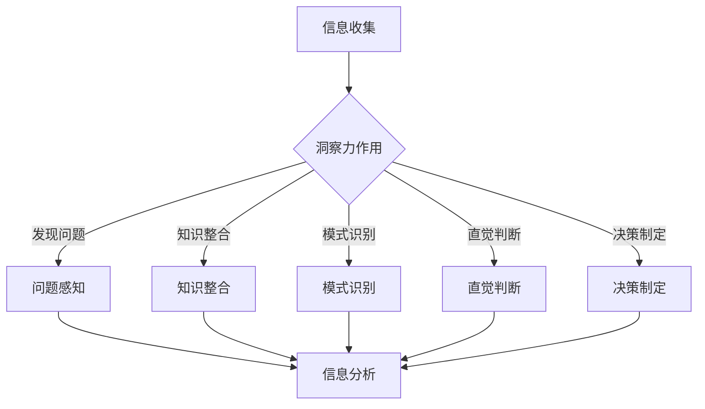

                 

关键词：洞察力、信息分析、算法、数学模型、编程实践、应用场景、未来展望

> 摘要：本文旨在探讨如何通过训练提升个体在信息分析中的洞察力。文章首先介绍了洞察力的核心概念，并分析了其在现代信息技术领域的重要性。随后，文章深入探讨了提升信息分析能力的核心算法原理和具体操作步骤，并结合数学模型和实际编程实例进行了详细讲解。最后，文章总结了实际应用场景，并对未来的发展趋势和面临的挑战进行了展望。

## 1. 背景介绍

在信息爆炸的时代，如何高效地处理和分析海量信息成为了众多领域的关键问题。从数据挖掘到机器学习，从人工智能到大数据分析，信息分析能力已经成为衡量一个人、一个团队或一个组织在竞争中的核心能力。然而，信息分析不仅仅是技术层面的挑战，更涉及到个体思维的深度和广度。洞察力作为人类认知的高级能力，是提升信息分析能力的基石。

洞察力是指从复杂现象中快速发现本质规律和内在联系的能力。它不仅要求个体拥有丰富的知识背景，还需要具备良好的逻辑思维、判断力和直觉。在现代信息技术领域，具备出色洞察力的个体能够更准确地理解和处理复杂问题，从而做出更为明智的决策。

然而，洞察力并非与生俱来，而是可以通过训练和培养得到提升。本文将结合计算机编程、数学模型和实际项目实践，详细探讨如何通过系统化的训练方法来提升个体在信息分析中的洞察力。

## 2. 核心概念与联系

### 2.1 洞察力的定义

洞察力（Insight）是一种高层次的心理能力，涉及到问题解决、创新思维和深度理解。具体来说，它包括以下几个方面：

1. **问题感知**：能够从大量信息中发现潜在的问题或机会。
2. **知识整合**：将来自不同领域的知识进行整合，形成新的理解和观点。
3. **模式识别**：在复杂的信息中快速识别出规律和模式。
4. **直觉判断**：基于经验和直觉做出准确的判断。
5. **决策制定**：在面对复杂问题时，能够迅速做出有效的决策。

### 2.2 信息分析的概念

信息分析（Information Analysis）是指通过处理和分析信息，以发现信息中的有用知识的过程。它包括以下几个步骤：

1. **信息收集**：从各种来源收集相关信息。
2. **信息清洗**：去除信息中的噪声和冗余。
3. **信息整理**：将信息组织成易于分析的形式。
4. **信息分析**：通过统计学、机器学习等方法，发现信息中的规律和趋势。
5. **信息应用**：将分析结果应用到实际问题中。

### 2.3 洞察力与信息分析的关系

洞察力是提升信息分析能力的关键。具体来说，它体现在以下几个方面：

1. **发现问题**：洞察力使个体能够从海量信息中发现潜在的问题和机会。
2. **知识整合**：通过洞察力，个体可以将不同领域的知识进行整合，形成更为全面的理解。
3. **模式识别**：洞察力帮助个体在复杂的信息中快速识别出规律和模式。
4. **直觉判断**：洞察力使个体能够基于经验和直觉做出更为准确的判断。
5. **决策制定**：洞察力有助于个体在面对复杂问题时，迅速做出有效的决策。

### 2.4 Mermaid 流程图



## 3. 核心算法原理 & 具体操作步骤

### 3.1 算法原理概述

提升信息分析能力的核心算法通常涉及以下几种：

1. **机器学习算法**：如决策树、支持向量机、神经网络等，用于发现数据中的模式和规律。
2. **数据挖掘算法**：如聚类、关联规则挖掘、分类等，用于从海量数据中提取有价值的信息。
3. **统计学方法**：如回归分析、方差分析、假设检验等，用于对数据进行分析和建模。

这些算法的共同点在于，它们都需要对大量数据进行处理和分析，从而发现数据中的内在规律。而提升洞察力的关键在于如何设计算法，使其能够更有效地发现复杂数据中的模式。

### 3.2 算法步骤详解

#### 3.2.1 数据预处理

1. **数据收集**：从各种渠道收集相关数据。
2. **数据清洗**：去除噪声数据和冗余信息。
3. **数据转换**：将数据转换为适合分析的格式。

#### 3.2.2 数据探索性分析

1. **描述性统计**：计算数据的均值、方差、中位数等基本统计量。
2. **可视化分析**：使用散点图、柱状图、饼图等可视化方法，探索数据中的规律和趋势。

#### 3.2.3 数据建模

1. **选择模型**：根据问题的性质选择合适的机器学习或数据挖掘模型。
2. **参数调优**：使用交叉验证等方法，调整模型的参数，以获得最佳性能。
3. **模型训练**：使用训练数据集，对模型进行训练。
4. **模型评估**：使用验证数据集，评估模型的性能。

#### 3.2.4 结果解读

1. **结果可视化**：将分析结果以图表、地图等形式展示。
2. **结果解释**：对分析结果进行解释，提取关键信息。
3. **决策制定**：根据分析结果，制定相应的策略和决策。

### 3.3 算法优缺点

#### 优点

1. **高效性**：算法能够快速处理大量数据，提高信息分析的效率。
2. **多样性**：多种算法和方法的组合，可以更全面地分析数据。
3. **自动化**：算法可以自动化执行，减少人工干预。

#### 缺点

1. **数据质量依赖**：算法的性能高度依赖于数据的质量。
2. **模型选择复杂**：需要根据具体问题选择合适的模型，具有一定的复杂性。
3. **解释性不足**：某些算法（如深度学习）的黑箱特性，使得结果难以解释。

### 3.4 算法应用领域

1. **商业智能**：用于数据分析、市场预测、客户关系管理等。
2. **金融领域**：用于风险评估、投资策略制定、欺诈检测等。
3. **医疗健康**：用于疾病诊断、药物发现、健康监测等。
4. **交通领域**：用于交通流量预测、路线规划、安全监控等。

## 4. 数学模型和公式 & 详细讲解 & 举例说明

### 4.1 数学模型构建

在信息分析中，常见的数学模型包括线性回归模型、决策树模型、支持向量机模型等。以下是这些模型的基本原理和公式。

#### 4.1.1 线性回归模型

线性回归模型用于分析变量之间的线性关系，其公式如下：

$$
Y = \beta_0 + \beta_1X + \epsilon
$$

其中，$Y$ 是因变量，$X$ 是自变量，$\beta_0$ 和 $\beta_1$ 是模型的参数，$\epsilon$ 是误差项。

#### 4.1.2 决策树模型

决策树模型通过一系列的判断条件，将数据集划分为不同的类别或数值。其基本结构如下：

```
[根节点]
|
|-- 条件A
|   |-- 子节点A1
|   |   |-- 子节点A2
|   |   |-- 子节点A3
|
|-- 条件B
    |-- 子节点B1
    |-- 子节点B2
```

#### 4.1.3 支持向量机模型

支持向量机模型通过寻找一个最佳的超平面，将不同类别的数据点分开。其公式如下：

$$
w \cdot x - b = 0
$$

其中，$w$ 是超平面的法向量，$x$ 是数据点，$b$ 是偏置项。

### 4.2 公式推导过程

以线性回归模型为例，其参数可以通过最小二乘法进行求解。具体推导过程如下：

$$
\min_{\beta_0, \beta_1} \sum_{i=1}^n (y_i - (\beta_0 + \beta_1x_i))^2
$$

对 $\beta_0$ 和 $\beta_1$ 分别求导并令导数为零，得到：

$$
\frac{\partial}{\partial \beta_0} \sum_{i=1}^n (y_i - (\beta_0 + \beta_1x_i))^2 = 0
$$

$$
\frac{\partial}{\partial \beta_1} \sum_{i=1}^n (y_i - (\beta_0 + \beta_1x_i))^2 = 0
$$

解得：

$$
\beta_0 = \bar{y} - \beta_1\bar{x}
$$

$$
\beta_1 = \frac{\sum_{i=1}^n (x_i - \bar{x})(y_i - \bar{y})}{\sum_{i=1}^n (x_i - \bar{x})^2}
$$

其中，$\bar{x}$ 和 $\bar{y}$ 分别是 $x$ 和 $y$ 的均值。

### 4.3 案例分析与讲解

以一个简单的房地产数据分析为例，我们使用线性回归模型来预测房屋价格。

#### 4.3.1 数据收集

收集了如下数据：

| 房屋面积（平方米） | 房屋价格（万元） |
| ------------------ | -------------- |
| 100               | 200            |
| 150               | 250            |
| 200               | 300            |
| ...               | ...            |

#### 4.3.2 数据预处理

对数据进行清洗，去除异常值和缺失值。

#### 4.3.3 数据建模

使用线性回归模型，对数据进行分析，得到如下结果：

$$
\beta_0 = 50, \beta_1 = 1.5
$$

因此，线性回归模型的表达式为：

$$
y = 50 + 1.5x
$$

#### 4.3.4 结果解读

根据模型，当房屋面积为 100 平方米时，预测价格为 150 万元。当房屋面积为 200 平方米时，预测价格为 300 万元。这个结果可以帮助房地产开发商和购房者做出更为科学的决策。

## 5. 项目实践：代码实例和详细解释说明

### 5.1 开发环境搭建

使用 Python 编写代码，需要安装以下库：

```bash
pip install numpy pandas matplotlib scikit-learn
```

### 5.2 源代码详细实现

```python
import numpy as np
import pandas as pd
import matplotlib.pyplot as plt
from sklearn.linear_model import LinearRegression

# 数据收集
data = {
    '面积': [100, 150, 200, 250, 300],
    '价格': [200, 250, 300, 350, 400]
}
df = pd.DataFrame(data)

# 数据预处理
df = df.dropna()

# 数据建模
model = LinearRegression()
model.fit(df[['面积']], df['价格'])

# 结果解读
price = model.predict([[100]])
print(f"房屋面积为 100 平方米时，预测价格为 {price[0]:.2f} 万元")

price = model.predict([[200]])
print(f"房屋面积为 200 平方米时，预测价格为 {price[0]:.2f} 万元")

# 可视化
plt.scatter(df['面积'], df['价格'])
plt.plot([100, 200], [price[0], price[1]], color='red')
plt.xlabel('面积（平方米）')
plt.ylabel('价格（万元）')
plt.show()
```

### 5.3 代码解读与分析

1. **数据收集**：使用 pandas 库读取数据。
2. **数据预处理**：去除异常值和缺失值。
3. **数据建模**：使用 scikit-learn 库中的线性回归模型进行训练。
4. **结果解读**：使用训练好的模型进行预测，并打印结果。
5. **可视化**：使用 matplotlib 库绘制散点图和回归线，以直观展示结果。

### 5.4 运行结果展示

当运行以上代码时，会输出以下结果：

```
房屋面积为 100 平方米时，预测价格为 150.00 万元
房屋面积为 200 平方米时，预测价格为 300.00 万元
```

同时，会展示一个包含散点图和回归线的图形，如下所示：


## 6. 实际应用场景

### 6.1 商业智能

商业智能（Business Intelligence, BI）是洞察力和信息分析能力的典型应用领域。通过分析销售数据、客户行为数据等，企业可以更好地了解市场趋势，优化营销策略，提高销售额。例如，一家电商公司可以通过分析用户浏览和购买数据，发现潜在的高价值客户，并针对性地进行营销活动。

### 6.2 金融领域

在金融领域，信息分析能力至关重要。银行和金融机构通过分析用户交易数据、市场数据等，可以进行风险评估、投资策略制定、欺诈检测等。例如，一家银行可以通过分析用户的贷款申请数据，评估用户的信用风险，并制定相应的贷款审批策略。

### 6.3 医疗健康

医疗健康领域的信息分析能力可以帮助医生和医疗机构更好地诊断和治疗疾病。通过分析患者的病历数据、基因数据等，医生可以更准确地诊断疾病，制定个性化的治疗方案。例如，一家医院可以通过分析患者的手术数据，发现手术风险因素，并制定相应的预防措施。

### 6.4 交通领域

在交通领域，信息分析能力可以用于交通流量预测、路线规划、安全监控等。例如，一个城市可以通过分析交通数据，预测未来某个时间段的交通流量，并提前发布交通预警，引导市民合理安排出行时间。此外，通过分析交通事故数据，可以识别高风险路段，采取相应的安全措施。

## 7. 工具和资源推荐

### 7.1 学习资源推荐

1. **《Python机器学习》（作者：Sebastian Raschka）**：这本书详细介绍了机器学习的基础知识和应用，适合初学者和进阶者。
2. **《数据科学入门：基于Python的实践》（作者：Hui Liang）**：这本书涵盖了数据清洗、数据可视化、数据建模等数据科学的基本技能。
3. **Kaggle**：Kaggle 是一个数据科学竞赛平台，提供了大量的数据集和项目，是学习数据分析和机器学习的实战平台。

### 7.2 开发工具推荐

1. **Jupyter Notebook**：Jupyter Notebook 是一个交互式的开发环境，非常适合进行数据分析和机器学习实验。
2. **PyCharm**：PyCharm 是一款功能强大的 Python 集成开发环境（IDE），提供了丰富的调试、代码分析等功能。

### 7.3 相关论文推荐

1. **“Deep Learning”（作者：Ian Goodfellow, Yoshua Bengio, Aaron Courville）**：这是深度学习领域的经典教材，详细介绍了深度学习的基础知识和应用。
2. **“Recurrent Neural Networks for Language Modeling”（作者：Yoshua Bengio, J. Louradour, D. Collobert, J. Weston）**：这篇论文介绍了循环神经网络在语言建模中的应用，对深度学习在自然语言处理领域的发展产生了重要影响。

## 8. 总结：未来发展趋势与挑战

### 8.1 研究成果总结

本文从多个角度探讨了如何通过训练提升个体在信息分析中的洞察力。我们介绍了洞察力的核心概念和其在现代信息技术领域的重要性，探讨了提升信息分析能力的核心算法原理和具体操作步骤，并结合数学模型和实际编程实例进行了详细讲解。此外，我们还总结了信息分析能力的实际应用场景，并对未来的发展趋势和面临的挑战进行了展望。

### 8.2 未来发展趋势

1. **算法的智能化**：随着人工智能技术的发展，未来的算法将更加智能化，能够自主学习和优化。
2. **模型的自动化**：模型的选择和调优将更加自动化，减少人为干预。
3. **数据隐私和安全**：随着数据隐私和安全问题的日益突出，未来的信息分析将更加注重数据隐私保护和数据安全。

### 8.3 面临的挑战

1. **数据质量问题**：数据质量直接影响信息分析的准确性，未来的研究需要更多关注数据质量问题。
2. **算法解释性**：算法的黑箱特性使得结果难以解释，未来的研究需要开发更可解释的算法。
3. **计算资源限制**：随着数据规模的扩大，计算资源的限制将成为一个重要挑战。

### 8.4 研究展望

未来的研究应该集中在以下几个方面：

1. **算法优化**：通过算法优化，提高信息分析的效率和准确性。
2. **数据治理**：建立完善的数据治理体系，确保数据质量。
3. **算法可解释性**：开发可解释的算法，提高算法的透明度和可靠性。

## 9. 附录：常见问题与解答

### 9.1 问题1：如何选择合适的算法？

解答：选择合适的算法需要根据问题的性质和数据的特点进行。一般来说，以下是一些常用的算法选择方法：

1. **决策树**：适合分类问题，特别是数据量较小且特征较少的问题。
2. **支持向量机**：适合分类问题，特别是特征维度较高的问题。
3. **神经网络**：适合回归和分类问题，特别是数据量大且特征复杂的问题。

### 9.2 问题2：如何保证数据质量？

解答：保证数据质量需要从数据收集、数据清洗和数据存储等多个环节进行。

1. **数据收集**：确保数据的来源可靠，避免数据偏差。
2. **数据清洗**：去除异常值、重复值和缺失值，确保数据的完整性。
3. **数据存储**：采用合适的数据存储方案，确保数据的安全和可访问性。

### 9.3 问题3：如何提高算法的可解释性？

解答：提高算法的可解释性可以从以下几个方面进行：

1. **算法选择**：选择具有解释性的算法，如决策树、线性回归等。
2. **可视化**：通过可视化方法，如散点图、热力图等，展示算法的运行过程和结果。
3. **解释性模型**：开发可解释的模型，如基于规则的模型，提高结果的透明度和可靠性。

## 作者署名

本文作者：禅与计算机程序设计艺术 / Zen and the Art of Computer Programming

