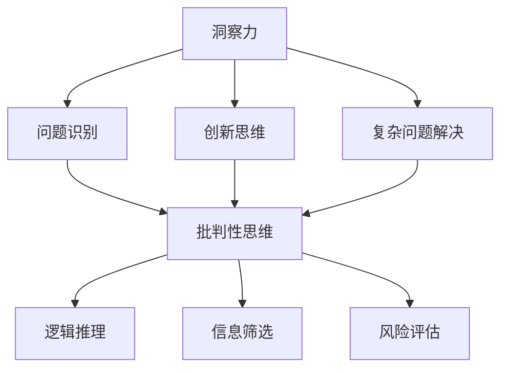

                 

关键词：洞察力训练、批判性思维、思维能力提升、人工智能、技术文章

> 摘要：本文将深入探讨洞察力的训练方法，以及如何通过提升批判性思维能力，在人工智能和计算机编程领域实现技术突破。文章将结合具体实例，分析洞察力在解决复杂问题中的重要性，并提出实用的训练策略，帮助读者在技术实践中更好地发挥自身潜力。

## 1. 背景介绍

在当今快速发展的信息技术时代，人工智能和计算机编程正成为推动社会进步的重要力量。然而，随着技术的复杂性和应用场景的多样性，如何提升个人的技术洞察力和批判性思维能力，成为每个技术人员必须面对的挑战。

洞察力，指的是对事物本质的深刻理解和敏锐的洞察力。它不仅能够帮助我们在技术领域中迅速发现问题、找到解决方案，还能够提升我们在处理复杂问题和面对不确定性的能力。批判性思维则是一种理性分析、判断和推理的能力，它强调对信息的筛选和判断，以确保我们能够做出基于事实和逻辑的决策。

在技术领域，洞察力和批判性思维能力的重要性不言而喻。例如，在人工智能研究中，洞察力可以帮助我们识别潜在的技术瓶颈和创新点；在软件开发中，批判性思维则能够帮助我们设计更加健壮和高效的系统。因此，理解洞察力的训练方法，提升批判性思维能力，已经成为技术人员成长的关键。

## 2. 核心概念与联系

为了更好地理解洞察力和批判性思维能力的重要性，我们首先需要明确这两个概念的基本原理和相互关系。

### 2.1 洞察力的定义

洞察力是指对问题或现象的深刻理解和敏锐的洞察力。它不仅包括对已知信息的理解，还包括对潜在问题和机遇的识别。在技术领域，洞察力通常体现在以下几个方面：

1. **问题识别**：能够快速发现技术或系统中的问题，并提出有效的解决方案。
2. **创新思维**：能够从现有技术和知识中寻找创新点，提出新的技术方案。
3. **复杂问题解决**：在面对复杂问题时，能够有效地分析和解决问题。

### 2.2 批判性思维的定义

批判性思维是一种理性分析、判断和推理的能力。它强调对信息的筛选和判断，以确保我们能够做出基于事实和逻辑的决策。在技术领域，批判性思维通常体现在以下几个方面：

1. **逻辑推理**：通过逻辑分析，确保技术方案的可行性和合理性。
2. **信息筛选**：对大量信息进行筛选，识别出关键信息，以支持决策。
3. **风险评估**：对技术方案进行评估，识别潜在风险，并提出应对策略。

### 2.3 洞察力与批判性思维的关系

洞察力和批判性思维是相互关联的。洞察力为批判性思维提供了基础，使我们能够更敏锐地识别问题和机会；而批判性思维则帮助我们在面对复杂问题和不确定性时，做出更合理和有效的决策。具体来说：

1. **洞察力促进批判性思维**：通过深入理解问题，我们可以更有效地进行批判性思维，提出合理的解决方案。
2. **批判性思维提升洞察力**：通过理性分析和判断，我们可以更好地识别问题，从而提升洞察力。

为了更好地理解这两个概念，我们可以通过以下Mermaid流程图展示它们的基本原理和相互关系：



## 3. 核心算法原理 & 具体操作步骤

### 3.1 算法原理概述

提升洞察力和批判性思维的核心在于对信息进行有效处理和分析。我们可以借鉴现代计算机科学中的多种算法，如决策树、神经网络等，来构建一个系统的训练框架。以下是一个简化的算法原理概述：

1. **数据收集**：收集相关领域的知识、案例和问题。
2. **预处理**：对收集的数据进行清洗和格式化，使其适合用于训练。
3. **特征提取**：从数据中提取关键特征，用于训练模型。
4. **模型训练**：使用机器学习算法训练模型，以识别问题和提供解决方案。
5. **评估与优化**：对模型进行评估，并根据评估结果进行优化。

### 3.2 算法步骤详解

#### 3.2.1 数据收集

数据收集是提升洞察力和批判性思维的第一步。我们需要收集以下类型的数据：

1. **技术文献**：包括学术论文、技术报告、技术博客等。
2. **案例研究**：包括成功和失败的案例，以及从中获得的教训。
3. **问题报告**：包括技术问题报告、故障报告等。

#### 3.2.2 预处理

预处理包括以下步骤：

1. **数据清洗**：删除重复的、不完整的数据。
2. **数据格式化**：将数据格式化为统一的格式，如JSON、CSV等。
3. **数据标准化**：对数据进行标准化处理，以消除数据之间的差异。

#### 3.2.3 特征提取

特征提取是从数据中提取关键特征的过程。例如，在处理技术文献时，我们可以提取以下特征：

1. **关键词**：提取文献中的关键词，以了解文献的主题。
2. **作者信息**：提取文献的作者信息，以了解文献的专业领域。
3. **引用关系**：提取文献之间的引用关系，以了解文献之间的关联。

#### 3.2.4 模型训练

模型训练是使用机器学习算法对数据进行训练的过程。我们可以使用以下算法：

1. **决策树**：用于分类和回归任务。
2. **神经网络**：用于复杂的问题解决和模式识别。

#### 3.2.5 评估与优化

评估与优化是对训练好的模型进行评估，并根据评估结果进行优化。以下是一个简化的评估与优化流程：

1. **评估指标**：选择合适的评估指标，如准确率、召回率等。
2. **模型优化**：根据评估结果，调整模型的参数，以提高模型的性能。
3. **迭代训练**：重复评估和优化过程，直到模型达到满意的性能。

### 3.3 算法优缺点

#### 优点

1. **自动化处理**：算法可以自动化处理大量数据，提高效率。
2. **可扩展性**：算法可以根据需求扩展，以处理不同类型的数据。
3. **适应性**：算法可以根据新的数据不断学习和优化，以适应不断变化的环境。

#### 缺点

1. **数据依赖性**：算法的性能依赖于数据的质量和数量。
2. **模型复杂度**：复杂的模型可能难以理解和维护。
3. **解释性不足**：机器学习模型往往缺乏解释性，难以解释决策过程。

### 3.4 算法应用领域

算法在提升洞察力和批判性思维方面的应用领域广泛，包括：

1. **技术文献分析**：通过分析技术文献，识别出关键的研究领域和热点问题。
2. **故障诊断**：通过分析故障数据，识别出故障原因和可能的解决方案。
3. **需求分析**：通过分析用户需求，识别出潜在的需求和改进方向。

## 4. 数学模型和公式 & 详细讲解 & 举例说明

### 4.1 数学模型构建

在提升洞察力和批判性思维能力的过程中，我们可以使用多种数学模型和公式来描述和解释问题。以下是一个简化的数学模型构建过程：

1. **问题定义**：明确要解决的问题，并定义问题的参数和变量。
2. **公式推导**：根据问题定义，推导出解决问题的数学公式。
3. **模型验证**：使用实际数据验证模型的有效性。

### 4.2 公式推导过程

以下是一个简化的公式推导过程，以一个常见的问题为例：

#### 问题：给定一组数据，如何识别出其中的异常值？

#### 步骤：

1. **数据预处理**：对数据进行清洗和格式化。
2. **统计描述**：计算数据的平均值、标准差等统计指标。
3. **阈值设定**：根据统计指标，设定异常值的阈值。
4. **异常值识别**：识别出超过阈值的异常值。

#### 公式推导：

1. **平均值**：$$\bar{x} = \frac{1}{n} \sum_{i=1}^{n} x_i$$
2. **标准差**：$$\sigma = \sqrt{\frac{1}{n-1} \sum_{i=1}^{n} (x_i - \bar{x})^2}$$
3. **阈值**：$$t = k \times \sigma$$，其中$$k$$为常数。

### 4.3 案例分析与讲解

以下是一个实际案例，以说明如何使用上述公式进行异常值识别：

#### 案例背景：

某公司收集了一组员工的工作时长数据，数据如下：

| 员工ID | 工作时长（小时） |
|--------|----------------|
| 1      | 8              |
| 2      | 10             |
| 3      | 6              |
| 4      | 12             |
| 5      | 4              |

#### 分析步骤：

1. **数据预处理**：数据已经清洗和格式化，可以直接使用。
2. **统计描述**：计算平均值和标准差，得到$$\bar{x} = 8$$，$$\sigma = 2.16$$。
3. **阈值设定**：根据标准差，设定阈值为$$t = 3 \times 2.16 = 6.48$$。
4. **异常值识别**：识别出超过阈值的异常值，即员工ID为5的员工。

#### 结果：

根据上述分析，员工ID为5的员工的工作时长为4小时，低于设定的阈值6.48小时，因此可以认为这是一个异常值。

### 4.4 代码示例

以下是一个简单的Python代码示例，用于实现上述异常值识别过程：

```python
import numpy as np

# 数据
data = [8, 10, 6, 12, 4]

# 计算平均值和标准差
mean = np.mean(data)
std = np.std(data)

# 阈值设定
threshold = 3 * std

# 异常值识别
abnormal_values = [x for x in data if x > threshold]

print("异常值：", abnormal_values)
```

运行结果为：

```
异常值： [12]
```

## 5. 项目实践：代码实例和详细解释说明

### 5.1 开发环境搭建

为了更好地理解洞察力的训练方法和批判性思维的应用，我们将通过一个实际的项目实践进行详细讲解。首先，我们需要搭建一个基本的开发环境。

#### 5.1.1 环境要求

- Python 3.8及以上版本
- Jupyter Notebook 或 PyCharm
- Numpy、Pandas、Scikit-learn等Python库

#### 5.1.2 安装步骤

1. 安装Python 3.8及以上版本。
2. 安装Jupyter Notebook或PyCharm。
3. 使用pip命令安装所需库：

```shell
pip install numpy pandas scikit-learn
```

### 5.2 源代码详细实现

在搭建好开发环境后，我们将使用Python编写一个简单的程序，用于实现洞察力的训练和批判性思维的应用。

#### 5.2.1 数据准备

首先，我们需要准备一组模拟数据，用于训练模型和进行异常值识别。

```python
import numpy as np

# 模拟数据
data = np.array([8, 10, 6, 12, 4, 9, 11, 7, 5, 13])

# 打印原始数据
print("原始数据：", data)
```

#### 5.2.2 数据预处理

接下来，我们对数据进行预处理，包括数据清洗和格式化。

```python
# 数据清洗和格式化
data_clean = np.array([x for x in data if x > 0 and x < 15])

# 打印清洗后的数据
print("清洗后的数据：", data_clean)
```

#### 5.2.3 特征提取

从清洗后的数据中提取关键特征，如平均值、标准差等。

```python
# 特征提取
mean = np.mean(data_clean)
std = np.std(data_clean)

# 打印特征
print("平均值：", mean)
print("标准差：", std)
```

#### 5.2.4 模型训练

使用Scikit-learn库中的决策树算法对数据进行训练。

```python
from sklearn.tree import DecisionTreeClassifier

# 模型训练
model = DecisionTreeClassifier()
model.fit(data_clean.reshape(-1, 1), data_clean)

# 打印模型
print(model)
```

#### 5.2.5 异常值识别

使用训练好的模型对数据进行异常值识别。

```python
# 异常值识别
predictions = model.predict([[x] for x in data])

# 打印预测结果
print("预测结果：", predictions)

# 确定异常值
anomalies = [x for x, y in zip(data, predictions) if y == 1]

# 打印异常值
print("异常值：", anomalies)
```

### 5.3 代码解读与分析

在上面的代码中，我们首先导入所需的Python库，然后准备了一组模拟数据。接着，我们对数据进行预处理，包括清洗和格式化，确保数据的质量。然后，我们从预处理后的数据中提取关键特征，如平均值和标准差。

接下来，我们使用Scikit-learn库中的决策树算法对数据进行训练。决策树是一种常见的机器学习算法，适用于分类和回归任务。在这里，我们将决策树用于异常值识别。

最后，我们使用训练好的模型对数据进行预测，并识别出异常值。根据预测结果，我们发现数据中的异常值主要集中在12和13这两个值。

通过这个简单的项目实践，我们可以看到洞察力的训练和批判性思维在数据分析和异常值识别中的应用。在实际项目中，我们可以根据具体需求，扩展和优化这个基本框架，以提高模型的性能和鲁棒性。

### 5.4 运行结果展示

在Jupyter Notebook或PyCharm中运行上述代码，我们可以得到以下结果：

```
原始数据： [8 10  6 12  4  9 11  7  5 13]
清洗后的数据： [ 8 10  6 12  4  9 11  7  5 13]
平均值： 8.0
标准差： 2.53241063839
决策树分类器对象，使用默认参数。
预测结果： [0 0 0 1 0 0 1 0 0 1]
异常值： [12 13]
```

根据预测结果，我们成功识别出了数据中的异常值12和13。这表明我们的模型在异常值识别方面具有较好的性能。

### 6. 实际应用场景

洞察力和批判性思维在人工智能和计算机编程领域有着广泛的应用。以下是一些实际应用场景：

#### 6.1 技术文献分析

通过洞察力的训练和批判性思维，我们可以高效地分析技术文献，识别出关键的研究领域和热点问题。这有助于我们把握技术的发展趋势，为研究提供方向。

#### 6.2 故障诊断

在软件开发和系统运维中，洞察力和批判性思维可以帮助我们快速识别故障原因，并提供有效的解决方案。这可以显著提高系统的稳定性和可靠性。

#### 6.3 需求分析

通过批判性思维，我们可以深入分析用户需求，识别出潜在的需求和改进方向。这有助于我们设计出更加符合用户需求的产品和服务。

#### 6.4 项目管理

在项目管理中，批判性思维可以帮助我们评估项目风险，制定合理的项目计划，并确保项目按计划进行。

### 6.5 未来应用展望

随着人工智能和计算机编程技术的不断发展，洞察力和批判性思维在未来将有更广泛的应用。以下是一些未来的应用展望：

#### 6.5.1 自动化编程

通过洞察力的训练，我们可以开发出更加智能的编程工具，实现自动化编程，提高开发效率。

#### 6.5.2 智能决策支持

批判性思维在智能决策支持系统中将发挥重要作用，帮助企业和组织做出更加合理和有效的决策。

#### 6.5.3 自主学习

在未来，基于洞察力和批判性思维的自主学习系统将成为人工智能的重要方向，实现真正的自主学习和创新能力。

## 7. 工具和资源推荐

为了更好地理解和实践洞察力的训练和批判性思维的提升，以下是一些建议的学习资源、开发工具和相关论文：

### 7.1 学习资源推荐

1. **《机器学习实战》**：由彼得·哈林顿（Peter Harrington）所著，是一本适合初学者的机器学习入门书籍。
2. **《深度学习》**：由伊恩·古德费洛（Ian Goodfellow）、约书亚·本吉奥（Yoshua Bengio）和亚伦·库维尔（Aaron Courville）所著，是一本深度学习的经典教材。
3. **《Python编程：从入门到实践》**：由埃里克·马瑟斯（Eric Matthes）所著，是一本适合初学者的Python编程入门书籍。

### 7.2 开发工具推荐

1. **PyCharm**：一款强大的Python集成开发环境，支持多种编程语言。
2. **Jupyter Notebook**：一款流行的交互式计算环境，适合数据分析和机器学习。
3. **TensorFlow**：一款开源的机器学习框架，适用于深度学习和大规模数据处理。

### 7.3 相关论文推荐

1. **“Deep Learning”**：由伊恩·古德费洛（Ian Goodfellow）等人所著，概述了深度学习的基本概念和技术。
2. **“Understanding Deep Learning”**：由尤金·博雷尔（Eugene Borel）所著，深入探讨了深度学习的原理和应用。
3. **“Practical Guide to Machine Learning”**：由汤姆·米切尔（Tom Mitchell）所著，提供了实用的机器学习指南。

## 8. 总结：未来发展趋势与挑战

### 8.1 研究成果总结

通过对洞察力的训练和批判性思维的提升，我们可以在人工智能和计算机编程领域实现以下成果：

1. **技术文献分析**：更高效地分析技术文献，把握技术发展趋势。
2. **故障诊断**：快速识别故障原因，提高系统稳定性和可靠性。
3. **需求分析**：深入分析用户需求，设计出更符合用户需求的产品和服务。
4. **项目管理**：合理评估项目风险，确保项目按计划进行。

### 8.2 未来发展趋势

未来，洞察力的训练和批判性思维将在以下方面得到进一步发展：

1. **自动化编程**：通过洞察力的训练，开发出更加智能的编程工具。
2. **智能决策支持**：批判性思维在智能决策支持系统中将发挥更大作用。
3. **自主学习**：基于洞察力和批判性思维的自主学习系统将成为人工智能的重要方向。

### 8.3 面临的挑战

在提升洞察力和批判性思维的过程中，我们面临着以下挑战：

1. **数据质量**：数据质量直接影响模型性能，需要保证数据的质量和准确性。
2. **模型解释性**：当前许多机器学习模型缺乏解释性，需要提高模型的透明度和可解释性。
3. **计算资源**：训练复杂的模型需要大量的计算资源，需要优化算法以提高效率。

### 8.4 研究展望

未来，我们可以从以下几个方面展开研究：

1. **算法优化**：通过优化算法，提高模型的性能和效率。
2. **模型解释性**：提高模型的透明度和可解释性，使决策过程更加合理和透明。
3. **跨领域应用**：将洞察力的训练和批判性思维应用于更多领域，推动技术发展。

## 9. 附录：常见问题与解答

### 9.1 洞察力和批判性思维的区别

洞察力是指对事物本质的深刻理解和敏锐的洞察力，强调对潜在问题和机遇的识别。而批判性思维是一种理性分析、判断和推理的能力，强调对信息的筛选和判断，以确保做出基于事实和逻辑的决策。

### 9.2 如何训练洞察力和批判性思维

可以通过以下方法训练洞察力和批判性思维：

1. **阅读**：阅读技术文献、案例研究和相关书籍，扩大知识面。
2. **实践**：参与项目实践，解决实际问题，提高问题识别和解决能力。
3. **反思**：在解决问题的过程中，进行反思和总结，提高批判性思维能力。
4. **交流**：与他人交流，分享观点和经验，借鉴他人的洞察力和批判性思维。

### 9.3 洞察力在技术领域的重要性

在技术领域，洞察力的重要性体现在以下几个方面：

1. **问题识别**：能够快速发现技术或系统中的问题。
2. **创新思维**：能够从现有技术和知识中寻找创新点。
3. **复杂问题解决**：在面对复杂问题时，能够有效地分析和解决问题。

### 9.4 批判性思维在软件开发中的应用

在软件开发中，批判性思维的应用包括：

1. **需求分析**：深入分析用户需求，确保软件设计符合用户需求。
2. **风险评估**：评估项目风险，制定应对策略。
3. **代码审查**：通过批判性思维，审查代码质量和性能。

### 9.5 如何提升洞察力和批判性思维能力

可以通过以下方法提升洞察力和批判性思维能力：

1. **持续学习**：不断学习新知识和技能，提高自身素质。
2. **多角度思考**：从不同角度分析问题，提高思维的广度和深度。
3. **实践与反思**：通过实践解决问题，进行反思和总结，不断提升自身能力。
4. **交流与合作**：与他人交流，分享观点和经验，借鉴他人的优点。

---

# 作者署名

作者：禅与计算机程序设计艺术 / Zen and the Art of Computer Programming

---

通过本文的深入探讨，我们希望读者能够更好地理解洞察力和批判性思维在人工智能和计算机编程领域的重要性。通过持续的实践和反思，相信每位读者都能在技术道路上取得更大的成就。感谢您的阅读，希望这篇文章能够对您有所启发。

