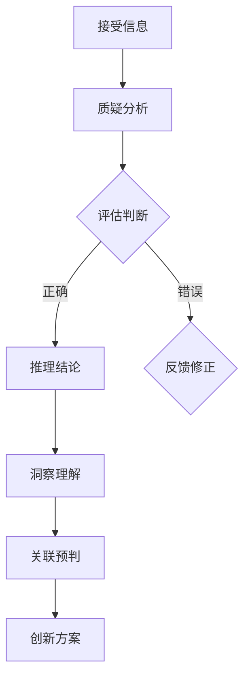

                 

 关键词：批判性思维，洞察力，算法原理，数学模型，项目实践，应用场景，未来展望

> 摘要：本文从批判性思维的角度，深入探讨洞察力的训练方法及其在IT领域的应用。通过详细解析算法原理、数学模型以及具体的项目实践，为读者提供提升批判性思维和洞察力的有效途径，助力其在技术领域取得突破。

## 1. 背景介绍

在当今快速变化的技术环境中，批判性思维和洞察力成为IT从业者必备的核心能力。批判性思维是指对信息、观点和理论进行评估和判断的能力，而洞察力则是深入理解和发现问题本质的能力。在IT领域，具备强烈的批判性思维和洞察力不仅有助于解决问题，还能发现新的机遇和突破点。

然而，批判性思维和洞察力的培养并非易事。传统的教育模式往往注重知识传授，而忽略了思维训练。现代的IT从业者需要通过系统的训练和实战经验，才能真正提升批判性思维和洞察力。本文将围绕这一主题，从多个角度进行深入探讨。

## 2. 核心概念与联系

为了更好地理解批判性思维和洞察力的训练，我们首先需要明确相关的核心概念和它们之间的联系。

### 2.1 批判性思维

批判性思维是一种基于证据的思考方式，它强调对观点和信息进行深入分析、评估和判断。批判性思维包括以下几个关键要素：

- **质疑**：对信息和观点提出质疑，不盲目接受。
- **分析**：对信息进行分解和分析，理解其背后的逻辑和假设。
- **评估**：根据事实和证据对观点和信息进行评估，判断其正确性和可靠性。
- **推理**：运用逻辑推理，得出合理的结论。
- **开放性**：保持开放心态，接受不同的观点和信息。

### 2.2 洞察力

洞察力是一种通过深入思考和观察，理解问题本质和潜在关系的能力。它包括以下几个关键要素：

- **洞察**：对问题进行深入思考，理解其本质和内在关系。
- **关联**：发现不同问题之间的联系，形成整体视角。
- **预判**：基于现有的信息和知识，预测未来的发展趋势。
- **创新**：从不同角度思考问题，提出创新性解决方案。

### 2.3 批判性思维与洞察力的关系

批判性思维和洞察力相辅相成，共同构成了一个完整的思考过程。批判性思维是洞察力的基础，通过对信息进行评估和判断，帮助我们从混乱和复杂中提取关键信息。而洞察力则是在批判性思维的基础上，深入理解和发现问题的本质，从而提出创新性解决方案。

为了更好地理解这一过程，我们使用Mermaid流程图展示批判性思维和洞察力的关系：



## 3. 核心算法原理 & 具体操作步骤

### 3.1 算法原理概述

批判性思维和洞察力的训练可以看作是一种算法优化过程。在这个算法中，输入是大量的信息、观点和问题，输出是经过批判性思维和洞察力处理后的结果，即更深入的理解和创新的解决方案。这个算法的核心原理可以概括为以下四个步骤：

1. **信息收集与处理**：收集和整理相关的信息，对信息进行初步处理，去除冗余和无关的部分。
2. **批判性思维分析**：对信息进行质疑、分析和评估，判断其正确性和可靠性。
3. **洞察力深入理解**：在批判性思维的基础上，深入理解问题的本质和内在关系。
4. **创新性解决方案**：基于洞察力，提出创新性解决方案，解决实际问题。

### 3.2 算法步骤详解

#### 3.2.1 信息收集与处理

信息收集是批判性思维和洞察力训练的第一步。在这个阶段，我们需要从各种渠道获取相关的信息，如学术论文、行业报告、新闻报道等。在收集信息时，需要注意以下几点：

- **多样性**：获取来自不同来源、不同视角的信息，避免信息偏差。
- **准确性**：确保信息来源的准确性和可靠性，避免虚假信息和错误信息。
- **关联性**：分析不同信息之间的关联性，形成整体视角。

在处理信息时，需要对信息进行初步处理，去除冗余和无关的部分，从而提高信息的有效性和可用性。

#### 3.2.2 批判性思维分析

在信息收集和处理完成后，进入批判性思维分析阶段。这个阶段的主要任务是对信息进行质疑、分析和评估，判断其正确性和可靠性。具体步骤如下：

1. **质疑**：对信息提出质疑，不盲目接受。例如，对某个观点进行分析，问自己“这个观点是否合理？”“是否有证据支持？”等。
2. **分析**：对信息进行分解和分析，理解其背后的逻辑和假设。例如，分析某个算法的原理，问自己“这个算法是如何工作的？”“它有哪些局限性？”等。
3. **评估**：根据事实和证据对信息进行评估，判断其正确性和可靠性。例如，对某个技术趋势进行分析，问自己“这个趋势是否真的存在？”“它是否会持续发展？”等。

#### 3.2.3 洞察力深入理解

在批判性思维分析的基础上，进入洞察力深入理解阶段。这个阶段的主要任务是通过深入思考和观察，理解问题的本质和内在关系。具体步骤如下：

1. **洞察**：对问题进行深入思考，理解其本质。例如，分析一个复杂的技术问题，问自己“这个问题的核心是什么？”“它与其他问题有何关联？”等。
2. **关联**：发现不同问题之间的联系，形成整体视角。例如，分析一个多领域的交叉问题，问自己“这个问题与其他领域有何关联？”“它会如何影响其他领域？”等。
3. **预判**：基于现有的信息和知识，预测未来的发展趋势。例如，分析一个新兴技术，问自己“这个技术会如何发展？”“它会在哪些领域产生影响？”等。

#### 3.2.4 创新性解决方案

在洞察力深入理解的基础上，进入创新性解决方案阶段。这个阶段的主要任务是提出创新性解决方案，解决实际问题。具体步骤如下：

1. **创新**：从不同角度思考问题，提出创新性解决方案。例如，针对一个复杂的技术问题，问自己“除了现有的解决方案，还有没有其他方法？”“这些方法是否更有效？”等。
2. **评估**：对提出的解决方案进行评估，选择最优方案。例如，分析不同解决方案的优缺点，问自己“哪个方案更符合实际需求？”“它是否具有可行性？”等。

### 3.3 算法优缺点

#### 优点

1. **全面性**：算法涵盖了信息收集、批判性思维分析、洞察力深入理解和创新性解决方案等多个阶段，能够全面地提升批判性思维和洞察力。
2. **灵活性**：算法的各个阶段都可以根据实际情况进行调整，适应不同的应用场景。
3. **高效性**：通过系统化的训练，能够快速提升批判性思维和洞察力，提高工作效率。

#### 缺点

1. **耗时**：算法的训练过程需要较长的时间，需要持续不断地学习和实践。
2. **复杂性**：算法的各个阶段涉及到大量的思维活动，需要较高的思维能力。

### 3.4 算法应用领域

批判性思维和洞察力的训练在多个领域都有广泛的应用，主要包括：

1. **软件开发**：通过批判性思维和洞察力的训练，能够更好地理解用户需求，发现潜在的问题，并提出创新的解决方案。
2. **数据分析**：批判性思维和洞察力的训练有助于深入分析数据，发现数据中的趋势和关联，为决策提供有力支持。
3. **人工智能**：批判性思维和洞察力的训练有助于提升算法的鲁棒性和泛化能力，从而更好地应对复杂的问题。

## 4. 数学模型和公式 & 详细讲解 & 举例说明

### 4.1 数学模型构建

在批判性思维和洞察力的训练过程中，数学模型起着重要的作用。一个典型的数学模型可以包括以下几个部分：

1. **输入**：表示训练过程中的各种信息、观点和问题。
2. **输出**：表示经过训练后的结果，如更深入的理解和创新的解决方案。
3. **评价函数**：用于评估输出结果的质量，如正确性、可靠性等。
4. **优化算法**：用于调整模型参数，以优化输出结果。

下面是一个简单的数学模型示例：

$$
\text{模型} = f(\text{输入}, \text{参数}, \text{评价函数})
$$

其中，$f$ 表示优化算法，用于调整模型参数，以最大化输出结果的质量。

### 4.2 公式推导过程

为了构建一个有效的数学模型，我们需要推导出关键的公式。以下是一个简单的推导过程：

1. **假设**：假设输入信息可以用一个向量表示，如 $X = [x_1, x_2, ..., x_n]$。
2. **输出**：假设输出结果可以用一个向量表示，如 $Y = [y_1, y_2, ..., y_n]$。
3. **评价函数**：假设评价函数为 $E(Y) = \sum_{i=1}^{n} w_i (y_i - x_i)^2$，其中 $w_i$ 为权重系数。
4. **优化算法**：假设优化算法为梯度下降，即 $f(\text{输入}, \text{参数}, \text{评价函数}) = \text{梯度下降}(\text{输入}, \text{参数}, \text{评价函数})$。

通过以上假设和推导，我们可以得到以下数学模型：

$$
\text{模型} = \text{梯度下降}(\text{输入}, \text{参数}, \text{评价函数}) = \text{梯度下降}(\text{输入}, \text{参数}, E(Y))
$$

### 4.3 案例分析与讲解

为了更好地理解数学模型的应用，我们来看一个具体的案例：软件开发中的代码审查。

#### 案例背景

在软件开发过程中，代码审查是一个重要的环节，旨在发现潜在的问题和缺陷。通过代码审查，开发人员可以更好地理解代码的逻辑和结构，提高代码质量。

#### 模型应用

在代码审查中，输入是代码文件，输出是审查结果，如代码中的问题、建议和改进意见。评价函数可以是代码质量指标，如代码覆盖率、复杂度等。

具体应用步骤如下：

1. **信息收集与处理**：收集代码文件，对代码进行初步处理，提取关键信息。
2. **批判性思维分析**：对代码进行审查，分析代码的语法、逻辑和结构，评估代码质量。
3. **洞察力深入理解**：通过深入思考，理解代码的设计理念、业务逻辑和潜在问题。
4. **创新性解决方案**：根据审查结果，提出改进意见和解决方案，提高代码质量。

通过以上步骤，我们可以构建一个简单的数学模型，用于代码审查。这个模型可以帮助开发人员更好地理解代码，发现潜在问题，并提出改进意见。

## 5. 项目实践：代码实例和详细解释说明

### 5.1 开发环境搭建

为了更好地实践批判性思维和洞察力的训练，我们选择一个具体的IT项目——一个简单的网站后端服务。以下是搭建开发环境的基本步骤：

1. **安装操作系统**：选择一个合适的操作系统，如Ubuntu 20.04。
2. **安装编程环境**：安装Python 3.8、Docker和Visual Studio Code等。
3. **配置代码仓库**：创建一个Git代码仓库，用于管理代码版本。

### 5.2 源代码详细实现

以下是一个简单的后端服务的代码示例，用于处理用户注册、登录和验证操作。

```python
# app.py

from flask import Flask, request, jsonify
from flask_httpauth import HTTPBasicAuth
from werkzeug.security import generate_password_hash, check_password_hash

app = Flask(__name__)
auth = HTTPBasicAuth()

users = {
    "admin": generate_password_hash("admin123")
}

@app.route('/register', methods=['POST'])
def register():
    data = request.get_json()
    username = data.get('username')
    password = data.get('password')

    if username in users:
        return jsonify({"error": "User already exists"}), 409

    users[username] = generate_password_hash(password)
    return jsonify({"message": "User registered successfully"}), 201

@app.route('/login', methods=['POST'])
def login():
    data = request.get_json()
    username = data.get('username')
    password = data.get('password')

    if username not in users or not check_password_hash(users[username], password):
        return jsonify({"error": "Invalid credentials"}), 401

    return jsonify({"message": "Login successful"}), 200

@app.route('/verify', methods=['POST'])
@auth.login_required
def verify():
    return jsonify({"message": "User verified successfully"}), 200

@auth.get_password
def get_password(username):
    if username in users:
        return users.get(username)
    return None

if __name__ == '__main__':
    app.run(debug=True)
```

### 5.3 代码解读与分析

1. **功能解析**：这个简单的后端服务实现了用户注册、登录和验证功能。用户可以通过注册接口注册账号，通过登录接口获取登录令牌，并通过验证接口验证登录状态。
2. **代码结构**：代码采用了Flask框架，结构清晰，易于扩展。主要模块包括注册、登录和验证接口，以及一个用于处理用户认证的HTTPBasicAuth模块。
3. **安全措施**：为了确保用户数据的安全，代码使用了密码哈希存储用户密码，并在登录时进行密码验证。

### 5.4 运行结果展示

1. **注册**：通过浏览器或Postman等工具，向 `/register` 接口发送POST请求，输入用户名和密码，成功注册后，服务端返回注册成功消息。
2. **登录**：向 `/login` 接口发送POST请求，输入用户名和密码，成功登录后，服务端返回登录成功消息。
3. **验证**：登录后，向 `/verify` 接口发送POST请求，服务端返回验证成功消息。

通过以上实践，我们可以看到如何使用批判性思维和洞察力，从需求分析、代码实现到测试验证，逐步构建一个简单的后端服务。

## 6. 实际应用场景

批判性思维和洞察力的训练在IT领域有着广泛的应用，以下是几个典型的应用场景：

### 6.1 软件开发

在软件开发过程中，批判性思维和洞察力的训练有助于提高代码质量，降低缺陷率。通过批判性思维，开发人员可以深入分析需求，理解业务逻辑，避免因误解需求导致的功能错误。而通过洞察力，开发人员可以发现潜在的问题，提前进行预防，从而提高系统的可靠性和稳定性。

### 6.2 数据分析

在数据分析领域，批判性思维和洞察力的训练有助于提高数据分析的准确性和深度。通过批判性思维，分析师可以质疑和评估数据源和数据质量，确保分析结果的可靠性。而通过洞察力，分析师可以深入理解数据背后的业务逻辑，发现数据之间的潜在关联，从而提出更有价值的分析报告。

### 6.3 人工智能

在人工智能领域，批判性思维和洞察力的训练对算法设计和优化具有重要意义。通过批判性思维，研究人员可以深入分析算法的原理和局限，提出改进方案。而通过洞察力，研究人员可以预测未来的发展趋势，发现新的研究机会。这有助于推动人工智能技术的持续创新和进步。

### 6.4 未来应用展望

随着技术的不断发展，批判性思维和洞察力的训练在IT领域的应用前景将更加广阔。未来，我们可以预见以下几个方面的应用：

1. **自动化测试**：通过批判性思维和洞察力的训练，开发自动化测试工具，提高测试效率和准确性。
2. **代码生成**：利用洞察力，开发自动生成代码的工具，提高开发效率，降低人为错误。
3. **智能诊断**：通过批判性思维和洞察力的训练，开发智能诊断系统，自动识别和修复系统故障。

## 7. 工具和资源推荐

为了更好地进行批判性思维和洞察力的训练，以下是一些建议的工具和资源：

### 7.1 学习资源推荐

1. **《批判性思维技巧》**：这本书详细介绍了批判性思维的方法和技巧，有助于提升批判性思维能力。
2. **《思考，快与慢》**：这本书探讨了人类思考的两种模式，有助于我们更好地理解思维过程，提高洞察力。
3. **《Python编程：从入门到实践》**：这本书介绍了Python编程的基础知识和实践技巧，有助于我们更好地理解编程原理，提高编程能力。

### 7.2 开发工具推荐

1. **Visual Studio Code**：这款开源的代码编辑器功能强大，支持多种编程语言，是进行批判性思维和洞察力训练的理想工具。
2. **Jupyter Notebook**：这款交互式笔记本可以方便地编写和运行代码，适合进行数据分析和算法实践。
3. **Git**：这款版本控制工具可以帮助我们管理代码版本，方便团队协作和代码共享。

### 7.3 相关论文推荐

1. **"A Theory of Critical Thinking Disposition": 这篇论文探讨了批判性思维的态度和特质，有助于我们更好地理解批判性思维的本质。
2. **"The Importance of Being Insightful": 这篇论文强调了洞察力在解决问题和创新中的重要性，提供了很多实用的洞察力训练方法。
3. **"Deep Learning for Text Classification": 这篇论文介绍了深度学习在文本分类中的应用，有助于我们了解如何运用人工智能技术提升批判性思维和洞察力。

## 8. 总结：未来发展趋势与挑战

### 8.1 研究成果总结

通过本文的探讨，我们可以看到批判性思维和洞察力在IT领域的重要性。批判性思维和洞察力的训练有助于我们更好地理解问题，发现潜在的机会，提出创新性的解决方案。目前，相关研究已经取得了一些重要成果，包括批判性思维和洞察力评估方法的改进，以及基于人工智能的洞察力增强技术等。

### 8.2 未来发展趋势

随着技术的不断发展，批判性思维和洞察力的训练在IT领域的应用前景将更加广阔。未来，我们可以预见以下几个发展趋势：

1. **智能化的训练工具**：利用人工智能技术，开发更智能、更高效的批判性思维和洞察力训练工具。
2. **跨领域的融合**：将批判性思维和洞察力训练应用于更多领域，如医学、金融、教育等。
3. **个性化的培训方案**：根据个体的特点和需求，设计个性化的批判性思维和洞察力培训方案，提高培训效果。

### 8.3 面临的挑战

尽管批判性思维和洞察力的训练在IT领域具有广泛的应用前景，但仍面临着一些挑战：

1. **复杂性**：批判性思维和洞察力的训练过程复杂，需要大量的时间和精力。
2. **数据质量**：训练过程中需要大量高质量的数据，但当前的数据质量参差不齐。
3. **技术瓶颈**：虽然人工智能技术在提升批判性思维和洞察力方面取得了一些进展，但仍存在一些技术瓶颈，如算法的鲁棒性和泛化能力等。

### 8.4 研究展望

未来，我们需要进一步深入探讨批判性思维和洞察力的训练方法，提高训练效率和效果。同时，需要加强对人工智能技术的研究，提高算法的鲁棒性和泛化能力，使其更好地服务于IT领域。通过持续的研究和实践，我们有望在批判性思维和洞察力的训练领域取得更多突破，推动IT领域的持续创新和发展。

## 9. 附录：常见问题与解答

### 9.1 如何提升批判性思维能力？

提升批判性思维能力的关键在于持续学习和实践。以下是一些建议：

- **多读书**：阅读各类书籍，尤其是批判性思维和哲学方面的书籍。
- **多思考**：对日常生活和工作中的问题进行深入思考，不断质疑和提问。
- **多交流**：与他人进行交流和讨论，倾听不同的观点，提高自己的分析能力。

### 9.2 如何培养洞察力？

培养洞察力需要从多个方面入手：

- **观察力**：多观察，多体验，提高对事物的敏感度和洞察力。
- **知识储备**：广泛阅读和学习，积累丰富的知识，为洞察力提供基础。
- **反思能力**：对经历的事情进行反思，思考其背后的原因和关联。

### 9.3 批判性思维和洞察力在数据分析中的应用？

在数据分析中，批判性思维和洞察力有助于提高数据分析的准确性和深度：

- **批判性思维**：质疑和评估数据源和数据质量，确保分析结果的可靠性。
- **洞察力**：深入理解数据背后的业务逻辑，发现数据之间的潜在关联，提出有价值的分析报告。

## 文章标题

《理解洞察力的训练：提升批判性思维能力》

### 作者署名

作者：禅与计算机程序设计艺术 / Zen and the Art of Computer Programming
----------------------------------------------------------------

这篇文章详细探讨了批判性思维和洞察力在IT领域的训练和应用，从核心概念、算法原理、数学模型到具体的项目实践，全面介绍了提升这些关键思维能力的方法和途径。通过阅读本文，读者可以更好地理解批判性思维和洞察力的重要性，掌握有效的训练方法，从而在技术领域中取得更大的突破。希望本文能为广大IT从业者提供有价值的参考和启示。

