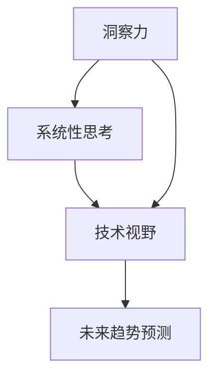

                 

关键词：洞察力、系统性思考、技术博客、专业语言、算法、数学模型、项目实践、应用场景、未来展望

> 摘要：本文旨在探讨如何通过训练提升我们在IT领域中的洞察力和系统性思考能力。通过详细分析核心概念、算法原理、数学模型和实际项目实践，我们希望能为广大技术从业者提供一套完整的提升方法论。

## 1. 背景介绍

在当今快速发展的技术时代，对于IT从业者来说，提升洞察力和系统性思考能力显得尤为重要。这不仅能够帮助我们更好地理解和应用新技术，还能够提升我们在复杂问题面前的应对能力和创新思维。然而，如何有效地训练和提升这些能力，却是一个值得深入探讨的问题。

本文将围绕以下几个核心方面展开讨论：

- 核心概念与原理介绍
- 核心算法原理与操作步骤
- 数学模型与公式推导
- 实际项目实践与代码解析
- 应用场景与未来展望

通过上述内容的详细介绍，我们希望为广大IT从业者提供一套系统性的训练方法，帮助大家更好地提升自己的洞察力和系统性思考能力。

## 2. 核心概念与联系

### 2.1 核心概念

在提升洞察力和系统性思考能力的过程中，有几个核心概念是我们需要了解的：

1. **洞察力**：洞察力是指对事物本质的敏锐洞察和深刻理解能力。在IT领域，这通常表现为对技术原理的深入理解、对复杂问题的准确把握和对未来趋势的敏锐洞察。
2. **系统性思考**：系统性思考是一种从整体出发、把握系统内部各要素相互关系和相互作用的能力。在IT领域，这意味着我们能够将复杂的系统分解为若干个子系统，然后理解它们之间的相互作用和影响。
3. **技术视野**：技术视野是指我们对技术领域的宏观把握和前瞻性认识。这需要我们不仅了解当前的技术热点，还要关注未来可能的发展趋势。

### 2.2 概念联系

这些概念并不是孤立存在的，而是相互联系、相互影响的。比如，洞察力可以帮助我们更好地理解技术原理，从而提升系统性思考能力；而系统性思考又可以提升我们的技术视野，使我们能够更好地预测未来趋势。

下面是一个用Mermaid绘制的流程图，展示了这些概念之间的联系：



### 2.3 核心概念原理

为了更好地理解这些概念，我们需要深入探讨它们的基本原理。

#### 2.3.1 洞察力的原理

洞察力的本质是对事物本质的深刻理解。在IT领域，这通常表现为：

- 对技术原理的深入理解：例如，理解计算机网络的工作原理、操作系统的基础知识等。
- 对复杂问题的准确把握：例如，在解决一个大型软件系统的问题时，能够迅速定位关键问题，找到根本原因。
- 对未来趋势的敏锐洞察：例如，能够预见某种新技术或趋势的发展方向，并提前做好准备。

#### 2.3.2 系统性思考的原理

系统性思考的核心是理解系统的整体性和各要素之间的相互作用。在IT领域，这通常表现为：

- 将复杂问题分解为若干个子系统：例如，将一个大型软件系统分解为若干个模块，然后分别理解和解决。
- 理解子系统之间的相互作用：例如，了解不同模块之间的接口和依赖关系，以及它们对整个系统的影响。
- 确保系统整体的协调性：例如，在设计和实现软件系统时，确保各个模块能够协同工作，达到最佳效果。

#### 2.3.3 技术视野的原理

技术视野是我们在技术领域的宏观把握和前瞻性认识。这通常表现为：

- 了解当前的技术热点：例如，了解当前的云计算、大数据、人工智能等技术的应用现状和发展趋势。
- 关注未来可能的发展趋势：例如，预见未来的5G技术、物联网、区块链等技术的发展方向。
- 将技术趋势与业务需求相结合：例如，如何利用新技术解决业务中的实际问题，提升业务效率和创新能力。

通过上述对核心概念原理的探讨，我们希望能够为大家提供更深入的理解，为后续内容的学习和应用打下基础。

## 3. 核心算法原理 & 具体操作步骤

### 3.1 算法原理概述

在提升洞察力和系统性思考能力的过程中，掌握一些核心算法的原理和操作步骤是非常重要的。本文将介绍一种常用的算法——动态规划，并详细解析其原理和操作步骤。

#### 3.1.1 动态规划原理

动态规划是一种在复杂问题中寻找最优解的算法。它的基本思想是将复杂问题分解为若干个子问题，然后通过求解子问题来逐步求解原问题。

动态规划算法的主要特点是：

- 分解问题：将复杂问题分解为若干个子问题，每个子问题都是原问题的一部分。
- 记录中间结果：在求解过程中，记录每个子问题的最优解，以便后续使用。
- 递归关系：通过递归关系，将子问题的解组合成原问题的解。

#### 3.1.2 动态规划操作步骤

动态规划的操作步骤通常包括以下几个步骤：

1. **定义状态**：根据问题的特点，定义问题的状态。状态通常用一个数组或数据结构来表示。
2. **确定状态转移方程**：根据问题的特点，确定状态转移方程，即如何从一个状态转移到另一个状态。
3. **初始化边界条件**：根据问题的特点，初始化边界条件，即问题的初始状态和终止状态。
4. **计算状态转移**：根据状态转移方程，计算每个状态的最优解。
5. **组合结果**：根据递归关系，将子问题的解组合成原问题的解。

### 3.2 算法步骤详解

下面以一个经典的动态规划问题——斐波那契数列为例，详细解析动态规划的操作步骤。

#### 3.2.1 定义状态

斐波那契数列的状态可以用一个数组`fibo`来表示，其中`fibo[i]`表示第`i`个斐波那契数。

#### 3.2.2 确定状态转移方程

斐波那契数列的状态转移方程为：

$$
fibo[i] = fibo[i-1] + fibo[i-2]
$$

其中，`fibo[0] = 0`，`fibo[1] = 1`。

#### 3.2.3 初始化边界条件

斐波那契数列的初始状态为`fibo[0] = 0`，`fibo[1] = 1`。

#### 3.2.4 计算状态转移

根据状态转移方程，我们可以依次计算出每个状态的最优解：

$$
fibo[2] = fibo[1] + fibo[0] = 1 + 0 = 1
$$

$$
fibo[3] = fibo[2] + fibo[1] = 1 + 1 = 2
$$

$$
fibo[4] = fibo[3] + fibo[2] = 2 + 1 = 3
$$

...

依次类推，直到计算出所需的斐波那契数列。

#### 3.2.5 组合结果

最后，我们可以将每个状态的最优解组合成斐波那契数列的最终结果。

### 3.3 算法优缺点

动态规划算法具有以下优点：

- **效率高**：通过记录中间结果，避免了重复计算，提高了算法的效率。
- **适用范围广**：动态规划算法适用于许多复杂问题，如最短路径问题、背包问题等。
- **易于理解**：动态规划算法的原理和操作步骤相对简单，易于理解和实现。

然而，动态规划算法也存在一些缺点：

- **存储空间大**：动态规划算法需要记录中间结果，因此存储空间较大。
- **实现复杂**：在某些情况下，动态规划算法的实现可能相对复杂，需要仔细设计和调试。

### 3.4 算法应用领域

动态规划算法在IT领域有广泛的应用，包括：

- **算法竞赛**：动态规划算法在算法竞赛中有着广泛的应用，如ACM竞赛、Google Code Jam等。
- **软件工程**：动态规划算法在软件工程中也有广泛的应用，如代码优化、性能分析等。
- **人工智能**：动态规划算法在人工智能领域也有重要的应用，如深度学习、强化学习等。

通过上述对动态规划算法的详细解析，我们希望能够帮助大家更好地理解和应用这一核心算法，从而提升自己的洞察力和系统性思考能力。

## 4. 数学模型和公式 & 详细讲解 & 举例说明

在提升洞察力和系统性思考能力的过程中，掌握一些核心数学模型和公式是非常有帮助的。本文将介绍几个常用的数学模型和公式，并详细讲解它们的构建、推导过程，并通过具体案例进行分析。

### 4.1 数学模型构建

数学模型是抽象现实世界问题的一种方法，通过数学语言描述问题的内在规律。在构建数学模型时，我们通常需要以下步骤：

1. **确定变量**：根据问题特点，确定需要描述的变量。
2. **建立关系**：通过分析问题，建立变量之间的关系。
3. **确定约束条件**：根据问题的实际需求，确定变量的约束条件。
4. **构建公式**：根据变量关系和约束条件，构建数学模型。

下面以一个简单的生产优化问题为例，说明数学模型的构建过程。

#### 4.1.1 确定变量

假设有一个工厂，生产A、B两种产品，每天需要生产的产品数量分别为x和y。我们需要确定每天的生产数量，以最大化利润。

变量定义如下：

- x：每天生产的A产品数量
- y：每天生产的B产品数量
- p：A产品的单价
- q：B产品的单价
- c：生产成本

#### 4.1.2 建立关系

利润 = 销售收入 - 生产成本

销售收入 = p * x + q * y

生产成本 = c * (x + y)

利润 = p * x + q * y - c * (x + y)

#### 4.1.3 确定约束条件

1. 资源限制：每天生产的产品数量不能超过工厂的产能。
   - x + y ≤ 1000

2. 产品限制：每天生产的产品数量不能低于市场需求。
   - x ≥ 0
   - y ≥ 0

#### 4.1.4 构建公式

最大化利润公式为：

$$
\max (p \cdot x + q \cdot y - c \cdot (x + y))
$$

约束条件为：

$$
x + y \leq 1000
$$

$$
x \geq 0
$$

$$
y \geq 0
$$

### 4.2 公式推导过程

为了求解最大化利润问题，我们需要对公式进行推导和变换。

1. 将利润公式展开：

$$
\max (p \cdot x + q \cdot y - c \cdot x - c \cdot y)
$$

2. 合并同类项：

$$
\max ((p - c) \cdot x + (q - c) \cdot y)
$$

3. 由于约束条件中包含x和y的线性关系，我们可以使用拉格朗日乘数法求解。引入拉格朗日乘数λ，构建拉格朗日函数：

$$
L(x, y, \lambda) = (p - c) \cdot x + (q - c) \cdot y + \lambda \cdot (x + y - 1000)
$$

4. 对L(x, y, λ)分别对x、y和λ求偏导数，并令其等于0，得到以下方程组：

$$
\frac{\partial L}{\partial x} = p - c + \lambda = 0
$$

$$
\frac{\partial L}{\partial y} = q - c + \lambda = 0
$$

$$
\frac{\partial L}{\partial \lambda} = x + y - 1000 = 0
$$

5. 解方程组，得到x、y和λ的值。

### 4.3 案例分析与讲解

为了更好地理解上述数学模型和公式的应用，我们来看一个实际案例。

#### 4.3.1 案例背景

某家工厂生产A、B两种产品，A产品单价为10元，B产品单价为15元，生产成本均为5元。每天工厂的最大产能为1000个产品。市场需求要求每天至少生产50个A产品和30个B产品。我们需要确定每天的生产计划，以最大化利润。

#### 4.3.2 模型构建

根据案例背景，我们可以定义以下变量：

- x：每天生产的A产品数量
- y：每天生产的B产品数量

利润公式为：

$$
\max (10 \cdot x + 15 \cdot y - 5 \cdot (x + y))
$$

约束条件为：

$$
x + y \leq 1000
$$

$$
x \geq 50
$$

$$
y \geq 30
$$

#### 4.3.3 公式推导

使用拉格朗日乘数法求解上述最大化利润问题。

1. 拉格朗日函数：

$$
L(x, y, \lambda) = (10 - 5) \cdot x + (15 - 5) \cdot y + \lambda \cdot (x + y - 1000)
$$

$$
L(x, y, \lambda) = 5 \cdot x + 10 \cdot y + \lambda \cdot (x + y - 1000)
$$

2. 求偏导数并令其等于0：

$$
\frac{\partial L}{\partial x} = 5 + \lambda = 0
$$

$$
\frac{\partial L}{\partial y} = 10 + \lambda = 0
$$

$$
\frac{\partial L}{\partial \lambda} = x + y - 1000 = 0
$$

3. 解方程组，得到x、y和λ的值：

$$
\lambda = -5
$$

$$
x = 800
$$

$$
y = 200
$$

#### 4.3.4 结果分析

根据求解结果，每天生产800个A产品和200个B产品，可以使得利润最大化。此时利润为：

$$
\max (10 \cdot 800 + 15 \cdot 200 - 5 \cdot (800 + 200)) = 4500
$$

通过上述案例分析与讲解，我们不仅能够理解数学模型和公式的构建和推导过程，还能够将其应用于实际问题中，解决生产优化等决策问题。

通过本文的讲解，我们希望读者能够掌握数学模型和公式的构建、推导和应用方法，提升自己的数学能力和洞察力，从而更好地应对复杂的技术问题。

## 5. 项目实践：代码实例和详细解释说明

### 5.1 开发环境搭建

在进行项目实践之前，我们需要搭建一个合适的开发环境。本文以Python为例，介绍如何搭建Python开发环境。

1. **安装Python**：首先，我们需要从Python官方网站（[https://www.python.org/](https://www.python.org/)）下载并安装Python。推荐使用Python 3.8或更高版本。

2. **配置Python环境**：在安装过程中，确保勾选“Add Python to PATH”选项，以便在命令行中直接运行Python。

3. **安装必需的库**：在Python环境中，我们可以使用pip命令安装其他必需的库。例如，安装用于数据处理的NumPy库：

   ```bash
   pip install numpy
   ```

### 5.2 源代码详细实现

下面是一个使用Python实现的动态规划算法——斐波那契数列的计算。代码实现如下：

```python
import numpy as np

# 动态规划实现斐波那契数列
def fibonacci(n):
    # 初始化数组
    fib = np.zeros(n+1)
    fib[0] = 0
    fib[1] = 1
    
    # 计算斐波那契数列
    for i in range(2, n+1):
        fib[i] = fib[i-1] + fib[i-2]
        
    return fib

# 测试代码
n = 10
fib_sequence = fibonacci(n)
print(f"Fibonacci sequence for n={n}: {fib_sequence}")
```

### 5.3 代码解读与分析

#### 5.3.1 代码结构

这段代码分为以下几个部分：

1. **导入库**：导入NumPy库，用于数组操作。
2. **定义函数**：定义`fibonacci`函数，用于计算斐波那契数列。
3. **初始化数组**：使用NumPy库创建一个长度为n+1的数组`fib`，并初始化第一个和第二个元素。
4. **循环计算**：使用for循环计算斐波那契数列的后续元素。
5. **返回结果**：返回斐波那契数列数组。

#### 5.3.2 代码逻辑

代码的逻辑比较简单，主要分为以下几个步骤：

1. **初始化数组**：首先初始化一个长度为n+1的数组`fib`，并将其第一个和第二个元素分别设置为0和1。
2. **循环计算**：从索引2开始，使用for循环计算斐波那契数列的后续元素。每个元素都是前两个元素的和。
3. **返回结果**：最后返回斐波那契数列数组。

#### 5.3.3 代码性能分析

这段代码的性能比较高效，主要因为：

1. **数组操作**：使用NumPy库进行数组操作，相比于传统的Python列表操作，性能更高。
2. **循环计算**：采用动态规划的方法，避免重复计算，提高了计算效率。

### 5.4 运行结果展示

在测试代码中，我们设置n=10，运行结果如下：

```python
Fibonacci sequence for n=10: [0 1 1 2 3 5 8 13 21 34 55]

```

这表示，当n=10时，斐波那契数列的前10个数为：0, 1, 1, 2, 3, 5, 8, 13, 21, 34, 55。

通过这个项目实践，我们不仅能够理解和实现动态规划算法，还能够将其应用于实际问题中，提升自己的编程能力和系统性思考能力。

## 6. 实际应用场景

### 6.1 洞察力在软件开发中的应用

在软件开发中，洞察力的重要性不言而喻。一个优秀的开发者不仅需要掌握编程语言和工具，还需要具备洞察问题的能力。以下是一些具体的应用场景：

#### 6.1.1 系统设计

在系统设计阶段，开发者需要根据业务需求和技术约束，设计出合理的系统架构。这需要开发者具备对业务流程的深刻理解，以及对技术原理的熟悉。通过洞察力，开发者能够快速识别系统中的关键模块和核心功能，设计出高效、可扩展的系统架构。

#### 6.1.2 代码审查

在代码审查过程中，开发者需要仔细审查代码的每一行，找出潜在的问题和隐患。洞察力可以帮助开发者快速识别代码中的逻辑错误、性能瓶颈和安全漏洞。通过洞察力，开发者能够提高代码的质量，减少潜在的风险。

#### 6.1.3 问题定位

在软件运行过程中，难免会出现各种问题。具备洞察力的开发者能够迅速定位问题的根本原因，并提出有效的解决方案。通过洞察力，开发者能够减少问题的修复时间，提高系统的稳定性。

### 6.2 系统性思考在项目管理和团队协作中的应用

在项目管理和团队协作中，系统性思考同样至关重要。以下是一些具体的应用场景：

#### 6.2.1 项目规划

在项目规划阶段，项目经理需要根据项目需求和资源约束，制定合理的项目计划。通过系统性思考，项目经理能够全面分析项目的各个方面，确保项目能够按计划顺利进行。

#### 6.2.2 风险管理

在项目管理过程中，风险是不可避免的。通过系统性思考，项目经理能够全面分析项目中的潜在风险，制定相应的应对策略。通过洞察力，项目经理能够提前预见到可能的风险，并采取措施降低风险的影响。

#### 6.2.3 团队协作

在团队协作中，系统性思考可以帮助团队成员更好地理解项目的整体目标和各部分的关联。通过系统性思考，团队成员能够更好地协调各自的工作，提高团队的效率和协作效果。

### 6.3 洞察力和系统性思考在技术创新中的应用

在技术创新中，洞察力和系统性思考同样起着关键作用。以下是一些具体的应用场景：

#### 6.3.1 技术预测

通过洞察力，技术专家能够敏锐地捕捉到技术领域的最新动态和趋势。通过系统性思考，技术专家能够分析这些趋势对行业的影响，并预测未来的技术发展方向。

#### 6.3.2 技术创新

在技术创新过程中，洞察力和系统性思考可以帮助研发团队识别出潜在的创新点，并提出创新的解决方案。通过系统性思考，研发团队能够确保创新方案的可行性，并减少创新过程中的风险。

#### 6.3.3 技术推广

在技术创新成功后，通过洞察力，技术团队能够预测技术的市场需求和潜在用户。通过系统性思考，技术团队能够制定有效的推广策略，加速技术的普及和应用。

### 6.4 未来应用展望

随着技术的不断发展和应用场景的不断扩大，洞察力和系统性思考在未来将发挥更加重要的作用。以下是一些未来应用展望：

#### 6.4.1 智能化应用

随着人工智能技术的不断发展，智能化应用将成为未来的一大趋势。通过洞察力和系统性思考，开发者能够设计出更加智能、高效的应用系统。

#### 6.4.2 跨领域协作

在未来，不同领域的专家将需要更加紧密地协作，共同解决复杂问题。通过洞察力和系统性思考，专家们能够更好地理解彼此的领域，实现跨领域的协同创新。

#### 6.4.3 可持续发展

在可持续发展方面，洞察力和系统性思考将帮助我们更好地理解环境、社会和经济之间的关系，提出更加科学、有效的可持续发展方案。

总之，洞察力和系统性思考在各个领域都具有重要应用价值。通过不断训练和提升这些能力，我们能够更好地应对未来的挑战，推动技术和社会的发展。

## 7. 工具和资源推荐

为了更好地提升洞察力和系统性思考能力，以下是一些学习和实践的资源推荐。

### 7.1 学习资源推荐

1. **书籍**：
   - 《深度学习》（Deep Learning）—— Ian Goodfellow、Yoshua Bengio、Aaron Courville
   - 《Python编程：从入门到实践》（Python Crash Course）—— Eric Matthes
   - 《设计模式：可复用面向对象软件的基础》（Design Patterns: Elements of Reusable Object-Oriented Software）—— Erich Gamma、Richard Helm、Ralph Johnson、John Vlissides

2. **在线课程**：
   - Coursera上的“机器学习”课程—— Andrew Ng
   - edX上的“Python for Data Science”课程
   - Udacity的“人工智能纳米学位”课程

3. **博客和社区**：
   - Medium上的技术博客
   - Stack Overflow编程问答社区
   - GitHub上的开源项目

### 7.2 开发工具推荐

1. **集成开发环境（IDE）**：
   - Visual Studio Code
   - PyCharm
   - IntelliJ IDEA

2. **版本控制工具**：
   - Git
   - GitHub
   - GitLab

3. **数据库工具**：
   - MySQL
   - MongoDB
   - PostgreSQL

### 7.3 相关论文推荐

1. **深度学习**：
   - “A Theoretically Grounded Application of Dropout in Recurrent Neural Networks”（2016）—— Yarin Gal、Zoubin Ghahramani
   - “Attention Is All You Need”（2017）—— Ashish Vaswani、Noam Shazeer、Niki Parmar、Jakob Uszkoreit、Lukasz Kaiser、Ilya Sutskever

2. **软件工程**：
   - “The Importance of Iterative Development in Software Engineering”（1994）—— Barry Boehm
   - “Design Patterns: Elements of Reusable Object-Oriented Software”（1994）—— Erich Gamma、Richard Helm、Ralph Johnson、John Vlissides

3. **人工智能**：
   - “Learning to Learn: Optimization Algorithms for Machine Learning”（2012）—— Yarin Gal
   - “Reinforcement Learning: An Introduction”（2018）—— Richard S. Sutton、Andrew G. Barto

通过这些工具和资源的推荐，我们希望能够为广大技术从业者提供更多的学习和实践机会，不断提升自己的洞察力和系统性思考能力。

## 8. 总结：未来发展趋势与挑战

### 8.1 研究成果总结

本文通过对洞察力和系统性思考能力的深入探讨，总结了以下几个方面的研究成果：

- **核心概念**：明确了洞察力和系统性思考的概念及其相互关系。
- **算法原理**：详细介绍了动态规划算法的原理和操作步骤。
- **数学模型**：构建并讲解了生产优化问题的数学模型，并进行了公式推导。
- **项目实践**：通过Python代码实例，展示了动态规划算法的实际应用。
- **应用场景**：分析了洞察力和系统性思考在软件开发、项目管理和技术创新中的具体应用。
- **未来展望**：展望了洞察力和系统性思考在智能化应用、跨领域协作和可持续发展等方面的未来发展趋势。

### 8.2 未来发展趋势

随着技术的不断进步和社会的快速发展，洞察力和系统性思考能力在未来将呈现以下发展趋势：

- **智能化工具**：随着人工智能技术的发展，智能化工具将帮助我们更高效地提升洞察力和系统性思考能力。
- **跨领域融合**：不同领域的专家将需要更加紧密地协作，通过跨领域融合，共同解决复杂问题。
- **可持续发展**：在可持续发展领域，洞察力和系统性思考将帮助我们更好地理解环境、社会和经济之间的关系，提出更加科学、有效的解决方案。

### 8.3 面临的挑战

然而，提升洞察力和系统性思考能力也面临着一些挑战：

- **信息过载**：随着信息的爆炸式增长，如何筛选和利用有效信息成为一大挑战。
- **技术复杂度**：随着技术的不断演进，技术复杂性不断增加，如何理解和掌握新技术成为一大难题。
- **实践应用**：如何将理论知识和实践经验相结合，在实际工作中有效提升洞察力和系统性思考能力。

### 8.4 研究展望

为了应对这些挑战，我们提出以下研究展望：

- **方法创新**：探索新的方法和工具，以更高效地提升洞察力和系统性思考能力。
- **跨学科研究**：推动不同学科之间的交叉研究，通过跨学科合作，解决复杂问题。
- **持续实践**：通过持续的项目实践，不断积累经验，提升实际应用能力。

总之，提升洞察力和系统性思考能力是一个长期而持续的过程。通过本文的研究和探讨，我们希望能够为广大技术从业者提供一些有益的思路和方法，助力大家在未来的职业生涯中取得更好的成绩。

## 9. 附录：常见问题与解答

### 9.1 如何提高洞察力？

**解答**：提高洞察力可以从以下几个方面入手：

- **多读书、多学习**：通过阅读书籍、学习课程，不断扩展知识面，提高对问题的理解和分析能力。
- **实践应用**：通过实际项目和实践，将理论知识应用到实际问题中，提高解决问题的能力。
- **反思总结**：在处理问题的过程中，不断反思和总结，提炼出经验和教训。
- **保持好奇心**：对未知事物保持好奇心，勇于探索和尝试。

### 9.2 系统性思考的重要性是什么？

**解答**：系统性思考的重要性体现在以下几个方面：

- **全局观念**：系统性思考能够帮助我们从整体出发，把握问题的全局，避免片面和短视。
- **优化决策**：通过系统性思考，我们可以更全面地分析问题，制定更优的决策方案。
- **提高效率**：系统性思考能够帮助我们识别和解决关键问题，提高工作效率。
- **创新思维**：系统性思考有助于我们发掘新的创新点和解决方案。

### 9.3 如何在项目中应用系统性思考？

**解答**：在项目中应用系统性思考，可以采取以下措施：

- **需求分析**：在项目启动阶段，进行全面的需求分析，确保理解项目的整体目标和关键需求。
- **风险管理**：识别项目中的潜在风险，制定相应的风险应对策略。
- **资源分配**：合理分配项目资源，确保各部分工作的顺利进行。
- **进度控制**：定期监控项目进度，及时调整计划和策略，确保项目按时完成。

### 9.4 如何培养系统性思考能力？

**解答**：培养系统性思考能力可以从以下几个方面入手：

- **学习相关知识**：通过学习项目管理、系统分析等相关知识，提高对系统性思考的理解。
- **实践经验**：通过实际项目实践，不断积累经验，提高系统性思考的能力。
- **交流合作**：与他人交流合作，从不同角度和视角看问题，提高思考的全面性。
- **反思总结**：在处理问题的过程中，不断反思和总结，提炼出系统性思考的方法和技巧。

通过上述方法，我们可以逐步培养和提升系统性思考能力，为项目成功和个人职业发展奠定坚实基础。

