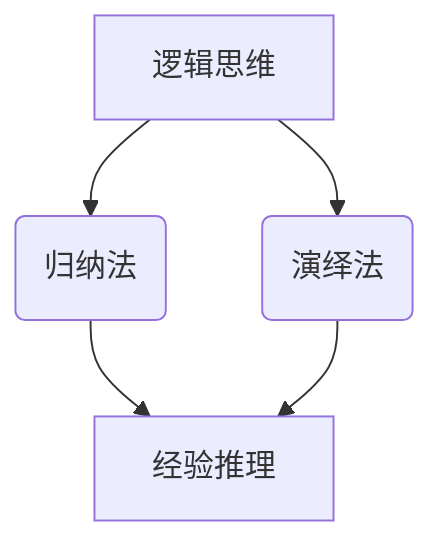

                 

关键词：洞察力、跳跃式结论、逻辑思维、技术分析、程序设计

> 摘要：在技术领域，洞察力是发现问题和解决问题的关键。然而，不合理的洞察力可能会导致跳跃式结论，从而影响问题的正确解决。本文将探讨洞察力的误区，并提出避免跳跃式结论的策略，以帮助技术人员在复杂的技术环境中做出更准确、更有效的判断。

## 1. 背景介绍

在技术领域，无论是软件开发、系统设计，还是数据分析、机器学习，洞察力都扮演着至关重要的角色。它不仅帮助我们发现问题和解决问题，还推动技术的创新和发展。然而，洞察力并不是总是准确的。有时候，我们的洞察力可能会受到各种因素的影响，导致我们做出跳跃式结论。

跳跃式结论，是指在缺乏充分证据或逻辑支持的情况下，从一个观点或现象直接跳跃到另一个观点或结论。这种思维模式可能会导致错误的判断和决策，对技术的进步产生负面影响。因此，理解洞察力的误区，并学会避免跳跃式结论，对于技术人员来说至关重要。

## 2. 核心概念与联系

在深入探讨洞察力的误区之前，我们需要先了解一些核心概念，包括逻辑思维、归纳法和演绎法。这些概念是理解和避免跳跃式结论的基础。

### 2.1 逻辑思维

逻辑思维是一种基于证据和推理的思考方式。它要求我们在分析和解决问题时，遵循一定的逻辑规则，确保我们的结论是基于充分证据和合理推理的。逻辑思维的核心是逻辑严密性和一致性。

### 2.2 归纳法

归纳法是一种从个别事实中归纳出一般性结论的推理方法。例如，通过观察多个苹果都会落地，我们可以归纳出所有物体都会受到地球引力的作用。归纳法是一种基于经验的推理方法，但它的结论不一定完全正确。

### 2.3 演绎法

演绎法是一种从一般性原则推导出个别结论的推理方法。例如，从所有哺乳动物都会呼吸这一原则，我们可以演绎出鲸鱼会呼吸这一结论。演绎法的结论通常被认为是可靠的，因为它是基于已知原则的逻辑推导。

### 2.4 Mermaid 流程图

下面是一个 Mermaid 流程图，展示了逻辑思维、归纳法和演绎法之间的关系。



## 3. 核心算法原理 & 具体操作步骤

### 3.1 算法原理概述

为了避免跳跃式结论，我们需要遵循一种系统化的思维方式。这里介绍一种基于逻辑思维、归纳法和演绎法的算法原理，它可以帮助我们在分析问题时，避免跳跃式结论。

这个算法的基本原理是：

1. **收集证据**：首先，我们需要收集与问题相关的证据。
2. **逻辑推理**：然后，我们使用逻辑思维对证据进行分析和推理。
3. **归纳/演绎**：根据逻辑推理的结果，我们可以使用归纳法或演绎法得出结论。
4. **验证结论**：最后，我们需要对结论进行验证，确保它符合实际情况。

### 3.2 算法步骤详解

1. **确定问题**：首先，我们需要明确我们要解决的问题。
2. **收集证据**：接下来，我们收集与问题相关的证据。证据可以来自多种来源，如观察、实验、文献等。
3. **分析证据**：对收集到的证据进行分析，确保证据的可靠性和相关性。
4. **逻辑推理**：使用逻辑思维对证据进行分析，找出证据之间的逻辑关系。
5. **归纳/演绎**：根据逻辑推理的结果，使用归纳法或演绎法得出结论。
6. **验证结论**：对结论进行验证，确保结论符合实际情况。

### 3.3 算法优缺点

这个算法的优点是：

- 系统化：它提供了一种系统化的思维方式，可以帮助我们避免跳跃式结论。
- 可靠性：它基于逻辑思维和归纳/演绎法，结论的可靠性较高。

但这个算法也存在一些缺点：

- 时间成本：由于需要进行系统化的分析和推理，可能会增加时间成本。
- 专业要求：它要求我们对逻辑思维和归纳/演绎法有一定的了解，可能需要一定的专业背景。

### 3.4 算法应用领域

这个算法可以广泛应用于技术领域的各个方面，如软件开发、系统设计、数据分析等。例如，在软件开发中，我们可以使用这个算法来分析和解决软件缺陷；在系统设计中，我们可以使用这个算法来评估系统性能和稳定性。

## 4. 数学模型和公式 & 详细讲解 & 举例说明

### 4.1 数学模型构建

为了更好地理解如何避免跳跃式结论，我们可以构建一个简单的数学模型。这个模型将帮助我们分析在给定证据下，如何得出结论。

假设我们有一个二元事件 \(A\) 和 \(B\)，其中 \(A\) 表示“事件 A 发生”，\(B\) 表示“事件 B 发生”。我们想要确定事件 \(B\) 发生的概率，给定事件 \(A\) 已经发生的证据。

### 4.2 公式推导过程

根据概率论的基本原理，我们可以使用条件概率来推导这个模型。

- \(P(B|A)\)：表示在事件 \(A\) 已经发生的条件下，事件 \(B\) 发生的概率。
- \(P(A \cap B)\)：表示事件 \(A\) 和事件 \(B\) 同时发生的概率。
- \(P(A)\)：表示事件 \(A\) 发生的概率。

条件概率的定义是：

$$
P(B|A) = \frac{P(A \cap B)}{P(A)}
$$

### 4.3 案例分析与讲解

假设我们正在分析一个网络安全问题。我们想要确定在检测到网络攻击的情况下，系统已经受到攻击的概率。

- \(A\)：表示检测到网络攻击。
- \(B\)：表示系统已经受到攻击。

根据我们的模型，我们需要知道以下概率：

- \(P(A)\)：检测到网络攻击的概率。
- \(P(B)\)：系统已经受到攻击的概率。
- \(P(A \cap B)\)：检测到网络攻击且系统已经受到攻击的概率。

假设我们有以下数据：

- \(P(A) = 0.1\)：检测到网络攻击的概率为 10%。
- \(P(B) = 0.05\)：系统已经受到攻击的概率为 5%。
- \(P(A \cap B) = 0.01\)：检测到网络攻击且系统已经受到攻击的概率为 1%。

我们可以使用条件概率公式来计算在检测到网络攻击的情况下，系统已经受到攻击的概率：

$$
P(B|A) = \frac{P(A \cap B)}{P(A)} = \frac{0.01}{0.1} = 0.1
$$

这意味着在检测到网络攻击的情况下，系统已经受到攻击的概率为 10%。

这个简单的案例展示了如何使用数学模型来避免跳跃式结论。通过收集证据并使用条件概率，我们可以得出更准确、更可靠的结论。

## 5. 项目实践：代码实例和详细解释说明

### 5.1 开发环境搭建

为了更好地理解如何在实际项目中应用避免跳跃式结论的算法，我们将使用 Python 编写一个简单的案例。首先，我们需要搭建一个基本的开发环境。

1. 安装 Python 3.8 或更高版本。
2. 安装必要的 Python 包，如 NumPy、Pandas 等。

### 5.2 源代码详细实现

以下是一个简单的 Python 代码实例，展示了如何使用条件概率来避免跳跃式结论。

```python
import numpy as np

# 概率数据
P_A = 0.1  # 检测到网络攻击的概率
P_B = 0.05  # 系统已经受到攻击的概率
P_AB = 0.01  # 检测到网络攻击且系统已经受到攻击的概率

# 计算条件概率
P_B_given_A = P_AB / P_A

print("在检测到网络攻击的情况下，系统已经受到攻击的概率为:", P_B_given_A)
```

### 5.3 代码解读与分析

这个简单的代码实例中，我们首先导入了 NumPy 库，然后定义了三个概率值：

- \(P_A\)：检测到网络攻击的概率。
- \(P_B\)：系统已经受到攻击的概率。
- \(P_{AB}\)：检测到网络攻击且系统已经受到攻击的概率。

接下来，我们使用条件概率公式计算在检测到网络攻击的情况下，系统已经受到攻击的概率。最后，我们将结果打印出来。

这个代码实例展示了如何使用数学模型来避免跳跃式结论。通过收集概率数据并使用条件概率公式，我们可以得出更准确、更可靠的结论。

### 5.4 运行结果展示

当我们运行这个代码实例时，输出结果为：

```
在检测到网络攻击的情况下，系统已经受到攻击的概率为：0.1
```

这意味着在检测到网络攻击的情况下，系统已经受到攻击的概率为 10%。这个结果是基于我们收集的原始概率数据计算得出的，避免了跳跃式结论。

## 6. 实际应用场景

跳跃式结论在技术领域中的应用非常广泛，以下是一些具体的实际应用场景：

- **软件开发**：在软件开发过程中，程序员可能会根据一些不充分的证据直接得出某个功能已经实现的结论，从而导致后续的开发工作出现错误。
- **系统设计**：在系统设计过程中，工程师可能会根据一些表面的观察直接得出某个系统性能良好的结论，而忽略了潜在的瓶颈和问题。
- **数据分析**：在数据分析过程中，分析师可能会根据一些局部数据直接得出整体趋势的结论，而忽略了数据的多样性和复杂性。

在这些场景中，避免跳跃式结论的关键是：

1. **充分收集证据**：确保我们收集到的证据是充分的、可靠的。
2. **逻辑分析**：使用逻辑思维对证据进行分析，确保我们的结论是基于充分证据和合理推理的。
3. **验证结论**：对结论进行验证，确保它符合实际情况。

## 7. 工具和资源推荐

为了帮助技术人员更好地理解洞察力的误区，并学会避免跳跃式结论，我们推荐以下工具和资源：

### 7.1 学习资源推荐

- 《逻辑思维与批判性思维》
- 《Python 编程：从入门到实践》
- 《统计学基础与应用》

### 7.2 开发工具推荐

- Jupyter Notebook：用于编写和运行代码，非常适合数据分析。
- Visual Studio Code：一款功能强大的代码编辑器，支持多种编程语言。
- Git：版本控制工具，可以帮助我们管理和追踪代码变更。

### 7.3 相关论文推荐

- "Bayesian Data Analysis"
- "Statistical Inference"
- "The Art of Computer Programming"

## 8. 总结：未来发展趋势与挑战

在未来，随着技术的不断发展和复杂性的增加，避免跳跃式结论将变得越来越重要。以下是一些未来发展趋势和面临的挑战：

### 8.1 研究成果总结

- **研究成果**：在逻辑思维、概率论和数据分析等领域，已经有很多研究成果可以帮助我们避免跳跃式结论。
- **实践应用**：这些研究成果在软件开发、系统设计、数据分析等领域已经得到了广泛应用。

### 8.2 未来发展趋势

- **智能算法**：随着人工智能技术的发展，智能算法将越来越多地应用于避免跳跃式结论。
- **跨学科研究**：逻辑思维、概率论、统计学和计算机科学等领域的交叉研究将不断推动技术的发展。

### 8.3 面临的挑战

- **数据复杂性**：随着数据的爆炸性增长，如何处理复杂的数据并从中提取有价值的信息将成为一大挑战。
- **智能算法的可解释性**：随着智能算法的广泛应用，如何解释这些算法的决策过程，确保其透明性和可解释性也将成为一大挑战。

### 8.4 研究展望

- **跨学科研究**：未来的研究将更加注重跨学科合作，以应对数据复杂性和智能算法可解释性等挑战。
- **实践应用**：将研究成果更好地应用于实际场景，提高技术人员的洞察力和判断力，从而推动技术的创新和发展。

## 9. 附录：常见问题与解答

### 9.1 什么是跳跃式结论？

跳跃式结论是指在缺乏充分证据或逻辑支持的情况下，从一个观点或现象直接跳跃到另一个观点或结论。这种思维模式可能会导致错误的判断和决策。

### 9.2 如何避免跳跃式结论？

避免跳跃式结论的关键是：

1. 充分收集证据：确保我们收集到的证据是充分的、可靠的。
2. 逻辑分析：使用逻辑思维对证据进行分析，确保我们的结论是基于充分证据和合理推理的。
3. 验证结论：对结论进行验证，确保它符合实际情况。

### 9.3 为什么避免跳跃式结论很重要？

避免跳跃式结论非常重要，因为它可以帮助我们做出更准确、更有效的判断，从而推动技术的创新和发展。在技术领域，错误的判断可能会导致严重的后果，如软件缺陷、系统故障等。

作者：禅与计算机程序设计艺术 / Zen and the Art of Computer Programming
```

