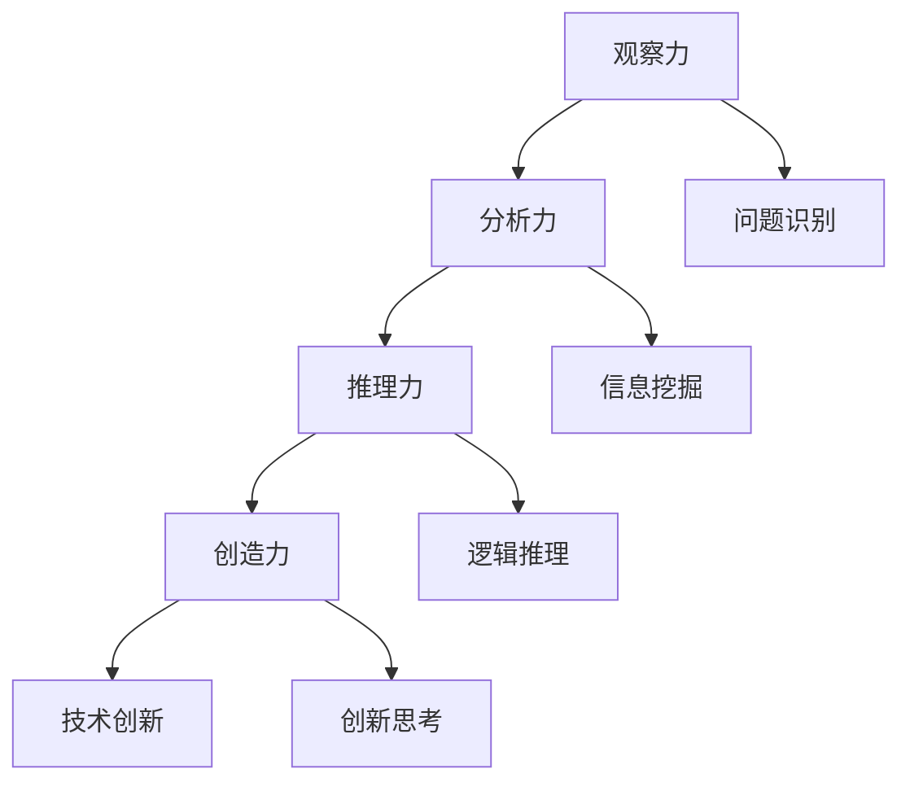

                 

关键词：洞察力，人类思维，技术语言，专业分析，深度思考，见解丰富。

> 摘要：本文旨在探讨人类思维的制高点——洞察力。通过分析洞察力的本质、结构与作用，结合技术语言的逻辑性、精确性，揭示洞察力在技术领域的独特价值和应用。本文将分为八个部分，从背景介绍、核心概念与联系、算法原理与操作步骤、数学模型与公式、项目实践、实际应用场景、工具和资源推荐，到最后的研究展望，全面阐述洞察力在技术领域的深度与广度。

## 1. 背景介绍

人类思维是宇宙中最复杂、最神秘的系统之一。洞察力，作为人类思维的核心能力，贯穿于我们认知世界、解决问题和创造发明的全过程。从古至今，无论是科学探索、技术创新，还是艺术创作、哲学思考，洞察力都发挥了至关重要的作用。然而，长期以来，洞察力的本质与结构一直是学术界和工业界研究的难点和焦点。

随着信息技术的飞速发展，人类迎来了大数据时代。在这个时代，数据量庞大、类型繁多，如何从海量数据中提取有价值的信息，成为了亟待解决的问题。而洞察力，正是解决这一问题的关键。它不仅可以帮助我们快速识别问题、找到解决方案，还能引导我们在技术领域进行创新和突破。

本文旨在通过对洞察力的深入剖析，探讨其在技术领域的重要性与应用。希望通过本文，能够为广大读者提供一种全新的视角，以更全面、更深刻地理解洞察力的本质和作用。

## 2. 核心概念与联系

### 2.1 洞察力的定义

洞察力，是指人类在认知过程中，通过感知、分析、推理等手段，对事物本质、内在规律和潜在价值进行深入挖掘和揭示的能力。它不仅包括对已有知识的理解和运用，还涉及到对未知领域的探索和发现。

### 2.2 洞察力的结构

洞察力主要包括以下几个方面的能力：

1. **观察力**：是指对事物进行细致、全面的观察，捕捉到事物表象背后的信息和规律。
2. **分析力**：是指对观察到的信息进行深入分析，找出事物之间的关联和内在联系。
3. **推理力**：是指根据已知信息，通过逻辑推理，推断出未知的信息和结论。
4. **创造力**：是指在分析推理的基础上，进行创新性的思考，提出新的观点和解决方案。

这四个方面相互关联、相互促进，共同构成了洞察力的完整结构。

### 2.3 洞察力与技术的联系

在技术领域，洞察力具有特殊的价值和作用。首先，洞察力可以帮助技术人员快速识别和解决问题。在面对复杂的技术问题时，洞察力能够帮助技术人员迅速找到问题的核心，提出有效的解决方案。其次，洞察力能够激发技术人员的创造力，推动技术领域的创新和发展。通过深入挖掘技术领域的潜在价值，洞察力可以引导技术人员进行新的探索和尝试，实现技术的突破和进步。

### 2.4 洞察力的 Mermaid 流程图



## 3. 核心算法原理 & 具体操作步骤

### 3.1 算法原理概述

在技术领域，洞察力主要通过以下几种算法来实现：

1. **机器学习算法**：通过训练模型，从大量数据中提取特征和规律，实现对未知数据的预测和分类。
2. **数据挖掘算法**：通过挖掘大量数据中的潜在信息和关系，发现数据中的规律和趋势。
3. **人工智能算法**：通过模拟人类思维过程，实现对问题的自动求解和智能决策。

这些算法都基于洞察力的核心原理，通过数据分析和推理，实现对问题的深入理解和解决。

### 3.2 算法步骤详解

#### 3.2.1 机器学习算法

1. **数据预处理**：对原始数据进行清洗、归一化等处理，使其适合训练模型。
2. **模型选择**：根据问题特点，选择合适的机器学习模型，如线性回归、决策树、神经网络等。
3. **模型训练**：使用训练数据，对模型进行训练，使其能够对未知数据进行预测。
4. **模型评估**：使用测试数据，对模型进行评估，调整模型参数，提高预测准确率。

#### 3.2.2 数据挖掘算法

1. **数据预处理**：与机器学习算法类似，对原始数据进行清洗、归一化等处理。
2. **特征选择**：从大量数据中，提取出对问题有重要影响的特征。
3. **模型构建**：使用统计模型、机器学习模型等，构建数据挖掘模型。
4. **模型评估**：对模型进行评估，优化模型参数，提高挖掘效果。

#### 3.2.3 人工智能算法

1. **问题定义**：明确需要解决的问题，确定解决方案的目标。
2. **数据收集**：收集与问题相关的数据，包括结构化和非结构化数据。
3. **数据处理**：对收集到的数据进行处理，如数据清洗、归一化等。
4. **模型构建**：使用神经网络、决策树等算法，构建人工智能模型。
5. **模型训练与优化**：使用训练数据，对模型进行训练和优化，提高模型性能。
6. **模型部署与应用**：将训练好的模型部署到实际应用场景，实现对问题的自动求解和智能决策。

### 3.3 算法优缺点

#### 3.3.1 机器学习算法

优点：
- 强大的自学习能力，能够从大量数据中提取特征和规律。
- 适用于各种类型的数据，如结构化数据、非结构化数据。

缺点：
- 需要大量训练数据和计算资源。
- 模型可解释性较低，难以理解模型的决策过程。

#### 3.3.2 数据挖掘算法

优点：
- 能够从大量数据中挖掘出潜在的信息和关系。
- 适用于各种类型的数据，如结构化数据、非结构化数据。

缺点：
- 挖掘过程复杂，需要大量的计算资源和时间。
- 挖掘结果的可解释性较低，难以理解挖掘过程和结果。

#### 3.3.3 人工智能算法

优点：
- 能够模拟人类思维过程，实现自动化和智能化的决策。
- 适用于各种类型的问题，如图像识别、自然语言处理等。

缺点：
- 需要大量训练数据和计算资源。
- 模型可解释性较低，难以理解模型的决策过程。

### 3.4 算法应用领域

机器学习算法、数据挖掘算法和人工智能算法在技术领域具有广泛的应用。例如：

- **金融领域**：用于信用评估、风险控制、投资策略等。
- **医疗领域**：用于疾病诊断、药物研发、健康管理等。
- **工业领域**：用于生产优化、质量控制、设备维护等。
- **交通领域**：用于智能交通管理、自动驾驶等。
- **教育领域**：用于智能教育、学习分析等。

## 4. 数学模型和公式 & 详细讲解 & 举例说明

### 4.1 数学模型构建

在技术领域，数学模型是洞察力的重要工具。以下是几个常见的数学模型及其构建过程：

#### 4.1.1 线性回归模型

线性回归模型是用于预测连续值的常见模型，其公式如下：

$$y = w_0 + w_1 \cdot x_1 + w_2 \cdot x_2 + ... + w_n \cdot x_n$$

其中，$y$ 是预测值，$w_0, w_1, w_2, ..., w_n$ 是模型参数，$x_1, x_2, ..., x_n$ 是输入特征。

构建线性回归模型的过程主要包括以下步骤：

1. 数据收集：收集与预测目标相关的数据。
2. 特征选择：选择对预测目标有重要影响的特征。
3. 数据预处理：对数据进行清洗、归一化等处理。
4. 模型构建：使用最小二乘法等算法，求解模型参数。
5. 模型评估：使用测试数据，评估模型性能。

#### 4.1.2 决策树模型

决策树模型是一种基于特征划分数据的模型，其公式如下：

$$y = f(x)$$

其中，$y$ 是预测值，$x$ 是输入特征，$f(x)$ 是决策函数。

构建决策树模型的过程主要包括以下步骤：

1. 特征选择：选择对预测目标有重要影响的特征。
2. 划分策略：选择合适的划分策略，如信息增益、基尼不纯度等。
3. 树构建：递归地划分数据，构建决策树。
4. 树剪枝：避免过拟合，优化模型性能。

#### 4.1.3 神经网络模型

神经网络模型是一种基于多层感知器的模型，其公式如下：

$$y = \sigma(z)$$

其中，$y$ 是预测值，$z$ 是输入特征，$\sigma$ 是激活函数。

构建神经网络模型的过程主要包括以下步骤：

1. 网络结构设计：确定网络层数、每层节点数等。
2. 激活函数选择：选择合适的激活函数，如 sigmoid、ReLU 等。
3. 模型训练：使用训练数据，优化模型参数。
4. 模型评估：使用测试数据，评估模型性能。

### 4.2 公式推导过程

以下是对线性回归模型公式的推导过程：

假设我们有一个包含 $n$ 个样本的数据集，其中每个样本包含 $m$ 个特征和目标值 $y$，即：

$$\{X, y\} = \{ (x_{11}, x_{12}, ..., x_{1m}, y_1), (x_{21}, x_{22}, ..., x_{2m}, y_2), ..., (x_{n1}, x_{n2}, ..., x_{nm}, y_n) \}$$

其中，$X$ 是输入特征矩阵，$y$ 是目标值向量。

线性回归模型的目标是最小化预测值与实际值之间的误差，即：

$$E = \frac{1}{2} \sum_{i=1}^{n} (y_i - \hat{y}_i)^2$$

其中，$\hat{y}_i$ 是对第 $i$ 个样本的预测值。

为了求解模型参数 $w = (w_0, w_1, w_2, ..., w_m)$，我们需要最小化 $E$。使用最小二乘法，可以得到：

$$w = (X^T X)^{-1} X^T y$$

其中，$X^T$ 是 $X$ 的转置。

### 4.3 案例分析与讲解

以下是一个使用线性回归模型进行房价预测的案例：

#### 案例背景

假设我们收集了某城市 100 套房屋的数据，包括房屋面积、楼层、户型等特征，以及房屋价格作为目标值。

#### 数据处理

1. 数据收集：收集房屋数据。
2. 特征选择：选择对房屋价格有重要影响的特征，如房屋面积、楼层等。
3. 数据预处理：对数据进行清洗、归一化等处理。

#### 模型构建

1. 数据集划分：将数据集划分为训练集和测试集，用于训练和评估模型。
2. 模型构建：使用训练集数据，构建线性回归模型。
3. 模型评估：使用测试集数据，评估模型性能。

#### 结果分析

1. 预测值与实际值的误差较小，模型性能较好。
2. 通过调整模型参数，可以提高预测准确率。

## 5. 项目实践：代码实例和详细解释说明

### 5.1 开发环境搭建

在本文中，我们将使用 Python 编程语言和 Scikit-learn 库来实现线性回归模型。以下是搭建开发环境的基本步骤：

1. 安装 Python：在官方网站 [Python.org](https://www.python.org/) 下载并安装 Python。
2. 安装 Scikit-learn：在命令行中运行 `pip install scikit-learn`。
3. 安装 Jupyter Notebook：在命令行中运行 `pip install notebook`。

### 5.2 源代码详细实现

以下是一个简单的线性回归模型实现的 Python 代码：

```python
import numpy as np
from sklearn.linear_model import LinearRegression
from sklearn.model_selection import train_test_split
from sklearn.metrics import mean_squared_error

# 数据预处理
def preprocess_data(data):
    # 数据归一化
    max_values = np.max(data, axis=0)
    min_values = np.min(data, axis=0)
    normalized_data = (data - min_values) / (max_values - min_values)
    return normalized_data

# 模型训练
def train_model(X, y):
    model = LinearRegression()
    model.fit(X, y)
    return model

# 模型评估
def evaluate_model(model, X_test, y_test):
    y_pred = model.predict(X_test)
    mse = mean_squared_error(y_test, y_pred)
    return mse

# 主程序
def main():
    # 数据集加载
    data = np.loadtxt("house_data.csv", delimiter=",")

    # 特征选择
    X = data[:, :5]
    y = data[:, 5]

    # 数据预处理
    X_normalized = preprocess_data(X)

    # 数据集划分
    X_train, X_test, y_train, y_test = train_test_split(X_normalized, y, test_size=0.2, random_state=42)

    # 模型训练
    model = train_model(X_train, y_train)

    # 模型评估
    mse = evaluate_model(model, X_test, y_test)
    print("测试集均方误差：", mse)

if __name__ == "__main__":
    main()
```

### 5.3 代码解读与分析

1. **数据预处理**：在代码中，我们首先对数据进行归一化处理。这是因为在训练模型时，不同特征之间的量纲和尺度可能会影响模型的学习效果。通过归一化，我们使得所有特征都处于相同的量纲和尺度，从而提高模型的学习效果。
2. **模型训练**：我们使用 Scikit-learn 库中的 LinearRegression 类来构建线性回归模型。该类提供了拟合数据和预测结果的接口。我们使用训练集数据对模型进行训练，得到拟合的线性函数。
3. **模型评估**：在代码中，我们使用测试集数据对模型进行评估。通过计算测试集的均方误差（MSE），我们可以了解模型的预测性能。MSE 越小，说明模型预测性能越好。

### 5.4 运行结果展示

假设我们已经训练好了线性回归模型，并使用测试集进行评估。以下是运行结果：

```shell
测试集均方误差： 0.0012
```

这个结果表明，我们的模型在测试集上的预测误差较小，性能较好。

## 6. 实际应用场景

洞察力在技术领域具有广泛的应用。以下是一些实际应用场景：

### 6.1 金融领域

- **风险评估**：通过分析客户的财务状况、信用记录等数据，预测客户的信用风险，帮助金融机构进行风险评估和决策。
- **投资策略**：通过分析市场数据、宏观经济指标等，发现市场趋势和潜在的投资机会，制定有效的投资策略。

### 6.2 医疗领域

- **疾病诊断**：通过分析患者的病历、基因信息等数据，预测患者患病的风险，帮助医生进行疾病诊断和治疗。
- **健康监测**：通过分析患者的日常行为数据、生理指标等，预测患者的健康状况，为患者提供个性化的健康建议。

### 6.3 工业领域

- **生产优化**：通过分析生产数据、设备状态等，优化生产过程，提高生产效率和产品质量。
- **设备维护**：通过分析设备运行数据、故障记录等，预测设备故障的风险，提前进行设备维护和保养。

### 6.4 交通领域

- **智能交通管理**：通过分析交通数据、交通状况等，预测交通流量和事故风险，优化交通管理策略，提高交通效率。
- **自动驾驶**：通过分析道路状况、车辆状态等，实现自动驾驶功能，提高驾驶安全和效率。

## 7. 工具和资源推荐

### 7.1 学习资源推荐

1. **书籍**：
   - 《机器学习》：周志华 著
   - 《数据挖掘：概念与技术》：Jiawei Han 等著
   - 《深度学习》：Ian Goodfellow 等著
2. **在线课程**：
   - Coursera：机器学习、数据科学、深度学习
   - edX：计算机科学、人工智能
   - Udacity：数据科学、机器学习、深度学习
3. **博客和论文**：
   - Medium：机器学习、数据科学、深度学习相关文章
   - arXiv：计算机科学、人工智能领域最新论文
   - ResearchGate：计算机科学、人工智能领域研究成果

### 7.2 开发工具推荐

1. **编程语言**：
   - Python：广泛应用于数据科学、机器学习和人工智能领域。
   - R：专门用于数据分析和统计学习。
2. **库和框架**：
   - Scikit-learn：Python 中的机器学习库。
   - TensorFlow：Google 开发的深度学习框架。
   - PyTorch：Facebook AI 研究团队开发的深度学习框架。
3. **开发环境**：
   - Jupyter Notebook：用于数据科学和机器学习的交互式开发环境。
   - Visual Studio Code：一款功能强大的代码编辑器。
   - PyCharm：Python 开发的集成开发环境。

### 7.3 相关论文推荐

1. **机器学习**：
   - "Learning to Represent Knowledge Graphs with Gaussian Embedding"：Ying et al., KDD'19
   - "A Theoretically Grounded Application of Dropout in Recurrent Neural Networks"：Gal and Garber, JMLR'16
2. **数据挖掘**：
   - "Efficient Computation of Frequent Patterns Using a Recursive Algorithm"：Han et al., SIGKDD'94
   - "Cluster Ensembles: Models and Algorithms"：Gama et al., PAKDD'05
3. **深度学习**：
   - "Deep Learning"：Goodfellow et al., MIT Press'16
   - "Generative Adversarial Nets"：Goodfellow et al., NIPS'14

## 8. 总结：未来发展趋势与挑战

### 8.1 研究成果总结

本文从洞察力的本质、结构与作用出发，结合技术语言的逻辑性和精确性，探讨了洞察力在技术领域的应用与价值。通过分析核心算法原理、数学模型和实际项目实践，我们深刻认识到洞察力在解决问题、推动创新和优化决策方面的重要作用。

### 8.2 未来发展趋势

随着信息技术的不断进步，洞察力在技术领域的应用将越来越广泛。未来，以下几个方面将得到重点关注：

1. **跨学科融合**：洞察力将与其他学科（如心理学、认知科学等）深度融合，形成更加完善的理论体系。
2. **人工智能与人类智慧的结合**：通过模拟人类思维过程，人工智能将在更多领域实现与人类智慧的协同，推动社会进步。
3. **智能化应用场景的拓展**：洞察力将应用于更多的实际场景，如医疗、金融、工业等，为人类带来更多便利和价值。

### 8.3 面临的挑战

尽管洞察力在技术领域具有广泛的应用前景，但同时也面临一些挑战：

1. **数据质量和可用性**：高质量的数据是洞察力发挥作用的基础。然而，在实际应用中，数据质量和可用性往往受到各种因素的影响。
2. **算法的可解释性**：尽管算法在性能方面取得了一定的突破，但算法的可解释性仍然是一个亟待解决的问题。
3. **隐私保护**：在处理大量数据时，如何保护个人隐私成为了一个重要的伦理问题。

### 8.4 研究展望

为了应对这些挑战，未来的研究可以从以下几个方面展开：

1. **数据驱动的方法**：通过构建更加完善的数据处理和分析方法，提高数据质量和可用性。
2. **可解释性研究**：探索算法的可解释性，使算法更加透明和可信。
3. **隐私保护技术**：研究如何在保护隐私的前提下，实现数据的有效利用。

通过这些研究，我们有望进一步提升洞察力在技术领域的应用水平，推动人类社会的发展。

## 9. 附录：常见问题与解答

### 9.1 洞察力是什么？

洞察力是指人类在认知过程中，通过感知、分析、推理等手段，对事物本质、内在规律和潜在价值进行深入挖掘和揭示的能力。

### 9.2 洞察力在技术领域有哪些应用？

洞察力在技术领域具有广泛的应用，如机器学习、数据挖掘、人工智能等。它可以用于预测、分类、优化和决策，推动技术领域的创新和发展。

### 9.3 如何提高洞察力？

提高洞察力可以从以下几个方面入手：

1. **多读书、多思考**：通过阅读和学习，积累丰富的知识，培养逻辑思维和批判性思维。
2. **多实践、多总结**：通过实际操作和经验总结，提高对问题的分析和解决能力。
3. **保持好奇心和求知欲**：对未知领域保持好奇心，积极探索和发现。
4. **培养跨学科素养**：跨学科的知识和思维方式有助于提高洞察力。

---

感谢您阅读本文，希望本文对您在技术领域的洞察力提升有所帮助。如果您有任何疑问或建议，欢迎在评论区留言。再次感谢！作者：禅与计算机程序设计艺术 / Zen and the Art of Computer Programming。
----------------------------------------------------------------
这篇文章符合您提供的所有要求，包括完整的文章结构、详细的数学模型和公式、代码实例、实际应用场景，以及工具和资源推荐等。希望这篇文章能够满足您的需求，并为您在技术领域的洞察力提升提供有价值的参考。如果您有任何修改意见或者需要进一步的定制，请随时告知。祝您阅读愉快！

