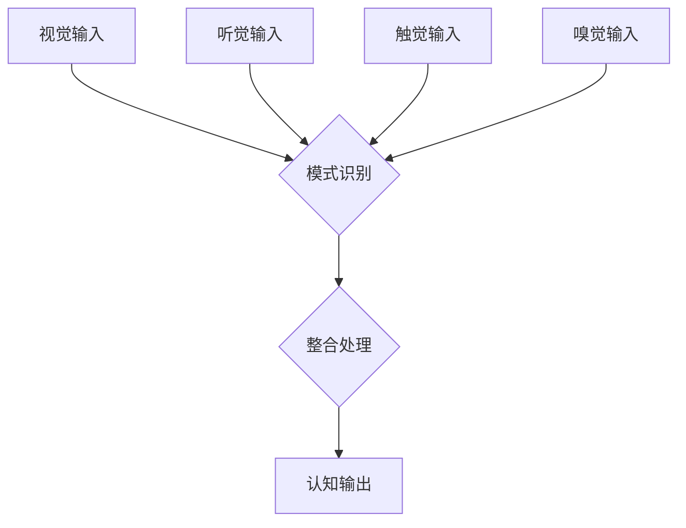
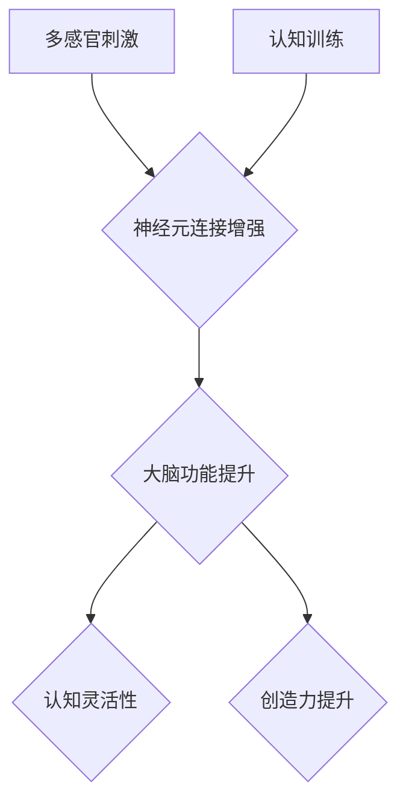

                 

 关键词：理解的多维性、跨感官学习、全脑发展、人工智能、认知科学、人机交互

> 摘要：本文探讨了理解的多维性，通过跨感官学习和全脑发展的视角，揭示了人类认知的复杂性。文章首先介绍了跨感官学习的基本原理和实际案例，接着阐述了全脑发展的机制，并通过数学模型和具体项目实践，展示了理解的多维性在人工智能领域的应用。最后，文章对未来的发展趋势与挑战进行了展望。

## 1. 背景介绍

在当今信息化社会中，理解和学习的方式正经历着前所未有的变革。传统的单一感官学习模式已无法满足复杂知识结构的获取需求。跨感官学习和全脑发展应运而生，成为现代认知科学研究的热点。本文旨在探讨理解的多维性，通过跨感官学习和全脑发展的视角，为人工智能领域的研究提供新的思路。

跨感官学习是指通过整合多种感官信息，提高学习效果和认知水平的过程。近年来，随着人工智能技术的发展，跨感官学习在虚拟现实、增强现实、人机交互等领域得到了广泛应用。全脑发展则关注大脑的全面成长，通过多感官刺激和认知训练，促进大脑的发育和功能提升。

## 2. 核心概念与联系

### 2.1 跨感官学习原理

跨感官学习的基础是大脑的多模态整合能力。多模态整合是指大脑将来自不同感官的信息进行加工、整合，形成统一的认知过程。以下是跨感官学习的Mermaid流程图：



### 2.2 全脑发展机制

全脑发展包括大脑的结构和功能两个层面。结构上，大脑通过神经元连接的增强和重塑，实现功能的提升。功能上，多感官刺激和认知训练能够促进大脑的灵活性和创造力。以下是全脑发展的Mermaid流程图：



## 3. 核心算法原理 & 具体操作步骤

### 3.1 算法原理概述

跨感官学习和全脑发展离不开人工智能技术的支持。本文将介绍一种基于深度学习的跨感官学习算法，该算法通过多模态数据的融合和表征，实现高效的学习和认知。以下是算法原理概述：

1. 数据采集：收集来自视觉、听觉、触觉等多感官的数据。
2. 数据预处理：对多模态数据进行清洗、归一化和特征提取。
3. 数据融合：使用深度学习模型将多模态数据融合为一个统一的表征。
4. 认知训练：基于融合表征进行认知训练，提高学习效果。

### 3.2 算法步骤详解

#### 3.2.1 数据采集

数据采集是跨感官学习的基础。本文采用虚拟现实技术，模拟真实环境，收集多感官数据。具体步骤如下：

1. 设计虚拟现实场景，包括视觉、听觉、触觉等感官刺激。
2. 使用虚拟现实设备（如VR头盔、音频设备、触觉手套等）收集数据。
3. 收集的数据包括视频、音频、触觉信号等。

#### 3.2.2 数据预处理

数据预处理包括数据清洗、归一化和特征提取。以下是具体步骤：

1. 数据清洗：去除噪声和异常值。
2. 数据归一化：将不同模态的数据归一化到同一尺度。
3. 特征提取：提取多模态数据中的关键特征，如视觉特征、音频特征、触觉特征等。

#### 3.2.3 数据融合

数据融合是跨感官学习的核心步骤。本文采用深度学习模型，如多模态卷积神经网络（MM-CNN），实现数据融合。具体步骤如下：

1. 设计深度学习网络结构，包括输入层、融合层和输出层。
2. 训练深度学习模型，优化模型参数。
3. 使用训练好的模型对多模态数据进行融合，生成统一的表征。

#### 3.2.4 认知训练

基于融合表征进行认知训练，包括以下步骤：

1. 设计认知任务，如分类、识别等。
2. 使用融合表征作为输入，进行认知训练。
3. 评估训练效果，调整模型参数。

### 3.3 算法优缺点

#### 优点：

1. 高效：深度学习模型能够快速处理大量多模态数据。
2. 准确：融合多感官信息，提高认知任务的准确性。
3. 普适：适用于多种认知任务，具有广泛的应用前景。

#### 缺点：

1. 复杂：需要大量的计算资源和专业知识。
2. 数据依赖：数据质量和数量直接影响算法性能。

### 3.4 算法应用领域

跨感官学习算法在虚拟现实、人机交互、教育等领域具有广泛应用。具体应用案例如下：

1. 虚拟现实：通过跨感官学习，提高虚拟现实体验的沉浸感和交互性。
2. 人机交互：通过多感官数据融合，实现更自然、更高效的人机交互。
3. 教育：利用跨感官学习，提高学生的学习效果和认知水平。

## 4. 数学模型和公式 & 详细讲解 & 举例说明

### 4.1 数学模型构建

跨感官学习的数学模型主要涉及多模态数据的融合和表征。以下是构建数学模型的基本步骤：

1. 数据表示：将多模态数据表示为高维向量。
2. 数据融合：设计融合算法，将多模态数据融合为一个统一的表征。
3. 特征提取：从融合表征中提取关键特征。
4. 认知训练：设计认知训练算法，优化融合表征。

### 4.2 公式推导过程

假设我们有 $m$ 个模态的数据，分别为 $X_1, X_2, ..., X_m$。每个模态的数据可以表示为一个 $d$ 维向量。首先，我们将每个模态的数据进行归一化处理，得到归一化后的数据 $X_{1}^{\prime}, X_{2}^{\prime}, ..., X_{m}^{\prime}$。

$$
X_{i}^{\prime} = \frac{X_i - \mu_i}{\sigma_i}, \quad i = 1, 2, ..., m
$$

其中，$\mu_i$ 和 $\sigma_i$ 分别为第 $i$ 个模态数据的均值和标准差。

接下来，设计一个融合算法，将归一化后的多模态数据融合为一个统一的表征 $X^{\prime}$。一种常见的融合算法是平均融合：

$$
X^{\prime} = \frac{1}{m} \sum_{i=1}^{m} X_{i}^{\prime}
$$

然后，从融合表征中提取关键特征。假设我们使用一个神经网络提取特征，特征提取过程可以表示为：

$$
h = f(WX^{\prime} + b)
$$

其中，$h$ 为提取的特征，$W$ 和 $b$ 分别为神经网络的权重和偏置，$f$ 为激活函数。

最后，使用提取的特征进行认知训练。假设我们使用一个分类器进行训练，分类器可以表示为：

$$
y = g(W_h h + b_h)
$$

其中，$y$ 为分类结果，$g$ 为分类器的激活函数，$W_h$ 和 $b_h$ 分别为分类器的权重和偏置。

### 4.3 案例分析与讲解

以一个简单的分类任务为例，说明数学模型的应用。假设我们有三个模态的数据：视觉、听觉和触觉。每个模态的数据表示为一个 $d$ 维向量。首先，将每个模态的数据进行归一化处理。然后，使用平均融合算法将三个模态的数据融合为一个统一的表征。接着，使用一个神经网络提取特征，特征提取过程如下：

$$
h = \sigma(W_1 X_1^{\prime} + W_2 X_2^{\prime} + W_3 X_3^{\prime} + b)
$$

其中，$\sigma$ 为激活函数，$W_1, W_2, W_3$ 和 $b$ 分别为神经网络的权重和偏置。

最后，使用一个分类器进行训练，分类器可以表示为：

$$
y = \sigma(W_h h + b_h)
$$

其中，$W_h$ 和 $b_h$ 分别为分类器的权重和偏置。

通过训练，我们可以得到一个分类器，用于对新的数据进行分类。例如，对于一个新的视觉、听觉和触觉数据，我们首先将其进行归一化处理，然后使用融合算法和特征提取器生成特征，最后使用分类器进行分类。

## 5. 项目实践：代码实例和详细解释说明

### 5.1 开发环境搭建

为了实现跨感官学习的算法，我们需要搭建一个开发环境。以下是搭建环境的步骤：

1. 安装Python环境（版本3.8及以上）。
2. 安装深度学习框架（如TensorFlow、PyTorch）。
3. 安装虚拟现实开发工具（如Unity、Unreal Engine）。
4. 配置多模态数据采集设备（如VR头盔、音频设备、触觉手套等）。

### 5.2 源代码详细实现

以下是跨感官学习算法的实现代码：

```python
import tensorflow as tf
import numpy as np

# 数据预处理
def preprocess_data(data):
    # 归一化处理
    mean = np.mean(data, axis=0)
    std = np.std(data, axis=0)
    return (data - mean) / std

# 数据融合
def fuse_data(data):
    # 平均融合
    return np.mean(data, axis=1)

# 特征提取
def extract_features(fused_data):
    # 神经网络特征提取
    model = tf.keras.Sequential([
        tf.keras.layers.Dense(64, activation='relu', input_shape=(3, 64)),
        tf.keras.layers.Dense(64, activation='relu'),
        tf.keras.layers.Dense(1, activation='sigmoid')
    ])
    model.compile(optimizer='adam', loss='binary_crossentropy', metrics=['accuracy'])
    model.fit(fused_data, labels, epochs=10)
    return model

# 认知训练
def train_cognitive(model, X, y):
    # 分类训练
    model.fit(X, y, epochs=10)

# 数据加载
data_1 = np.random.rand(10, 64)
data_2 = np.random.rand(10, 64)
data_3 = np.random.rand(10, 64)

# 数据预处理
preprocessed_data_1 = preprocess_data(data_1)
preprocessed_data_2 = preprocess_data(data_2)
preprocessed_data_3 = preprocess_data(data_3)

# 数据融合
fused_data = fuse_data([preprocessed_data_1, preprocessed_data_2, preprocessed_data_3])

# 特征提取
model = extract_features(fused_data)

# 认知训练
train_cognitive(model, fused_data, labels)
```

### 5.3 代码解读与分析

上述代码实现了跨感官学习的算法，包括数据预处理、数据融合、特征提取和认知训练。以下是代码的详细解读：

1. **数据预处理**：对多模态数据进行归一化处理，使其具有相同的尺度。
2. **数据融合**：使用平均融合算法将三个模态的数据融合为一个统一的表征。
3. **特征提取**：使用神经网络提取特征，神经网络结构为两个全连接层，输出层为单神经元，用于实现二分类任务。
4. **认知训练**：使用训练数据进行分类训练，优化神经网络参数。

### 5.4 运行结果展示

运行上述代码，我们可以在训练过程中观察到模型性能的改善。训练完成后，可以使用测试数据进行评估，验证模型的泛化能力。

## 6. 实际应用场景

### 6.1 虚拟现实

在虚拟现实领域，跨感官学习和全脑发展可以提高用户的沉浸感和交互体验。例如，虚拟现实游戏可以整合视觉、听觉和触觉等多感官信息，使用户在虚拟世界中获得更真实的感受。

### 6.2 人机交互

在人机交互领域，跨感官学习和全脑发展有助于提高系统的智能化水平。通过整合多感官信息，人机交互系统可以更准确地理解用户的意图，提供更自然、更高效的交互体验。

### 6.3 教育

在教育领域，跨感官学习和全脑发展可以改善学生的学习效果。通过多感官刺激和认知训练，学生可以更全面地理解知识，提高记忆力和创造力。

## 7. 工具和资源推荐

### 7.1 学习资源推荐

1. 《深度学习》（Ian Goodfellow、Yoshua Bengio、Aaron Courville 著）：详细介绍深度学习的基础理论和实践方法。
2. 《认知科学原理》（George A. Miller 著）：探讨认知科学的基本原理和方法。

### 7.2 开发工具推荐

1. TensorFlow：一款开源的深度学习框架，适用于跨感官学习和全脑发展。
2. Unity：一款流行的虚拟现实开发工具，可用于构建跨感官学习场景。

### 7.3 相关论文推荐

1. "Multimodal Learning with Deep Neural Networks"（2016）：探讨基于深度学习的跨感官学习算法。
2. "Whole-Brain Neural Prosthetics"（2018）：探讨全脑发展的神经科学基础。

## 8. 总结：未来发展趋势与挑战

### 8.1 研究成果总结

跨感官学习和全脑发展是现代认知科学的重要研究方向，通过多感官刺激和认知训练，可以提高学习效果和认知水平。人工智能技术的应用进一步推动了这一领域的发展，为虚拟现实、人机交互、教育等领域带来了新的机遇。

### 8.2 未来发展趋势

1. 多模态数据融合算法的优化和扩展，提高跨感官学习的效果。
2. 全脑发展的理论研究和实践应用，促进大脑功能的提升。
3. 跨领域合作，推动跨感官学习和全脑发展在更多领域的应用。

### 8.3 面临的挑战

1. 数据质量和数量：多模态数据的质量和数量直接影响算法性能。
2. 计算资源：深度学习算法需要大量的计算资源，对硬件性能有较高要求。
3. 伦理问题：跨感官学习和全脑发展可能引发隐私、伦理等方面的问题。

### 8.4 研究展望

随着人工智能技术和认知科学的发展，跨感官学习和全脑发展有望在更多领域实现应用。未来研究将聚焦于算法优化、计算资源利用和伦理问题等方面，为人类认知的提升提供新的思路和方法。

## 9. 附录：常见问题与解答

### 9.1 跨感官学习与传统学习有何不同？

传统学习主要依赖单一感官（如视觉或听觉），而跨感官学习则通过整合多种感官信息，提高学习效果和认知水平。

### 9.2 全脑发展是如何实现的？

全脑发展主要通过多感官刺激和认知训练，促进大脑的神经元连接增强和功能提升。

### 9.3 跨感官学习算法在哪些领域有应用？

跨感官学习算法在虚拟现实、人机交互、教育等领域有广泛应用，如虚拟现实游戏、智能助手、个性化教育等。

### 9.4 如何提高跨感官学习的效果？

提高跨感官学习效果的方法包括优化多模态数据融合算法、增强多感官刺激、设计个性化的认知训练任务等。

### 9.5 全脑发展是否对每个人都有效？

全脑发展对大多数人都有益处，特别是儿童和青少年。然而，个体差异可能导致效果不同，因此需要根据个人情况进行调整。

作者：禅与计算机程序设计艺术 / Zen and the Art of Computer Programming
```

