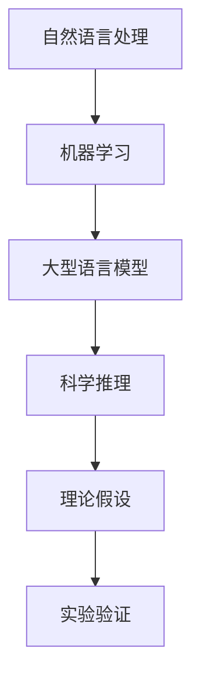

                 

关键词：大型语言模型，科学推理，人工智能，自然语言处理，机器学习，算法设计，理论框架。

## 摘要

本文将探讨大型语言模型（LLM）在科学研究中的应用，特别是其在科学推理过程中的潜力与挑战。通过对LLM的核心概念、算法原理、数学模型以及实际应用场景的深入分析，本文旨在揭示LLM如何通过自然语言处理和机器学习技术，成为理论研究的得力助手。同时，文章还将探讨LLM在科学推理中的优缺点，以及未来应用的前景和面临的挑战。

## 1. 背景介绍

### 大型语言模型的发展

随着人工智能技术的飞速发展，自然语言处理（NLP）领域取得了显著进展。特别是近年来，深度学习技术的引入，使得大型语言模型（LLM）得到了广泛关注。LLM是一种基于神经网络的语言模型，通过学习海量的文本数据，能够生成高质量的自然语言文本。代表性的LLM如OpenAI的GPT系列、Google的BERT模型等，它们在各类NLP任务中都取得了惊人的性能。

### 科学推理的重要性

科学推理是科学研究的重要环节，它涉及到从观察到的数据中提取规律，形成理论假设，并通过实验验证这些假设。有效的科学推理不仅有助于发现自然界的规律，还能推动科学理论的发展。然而，科学推理过程往往复杂且繁琐，需要研究人员具备深厚的专业知识背景和逻辑思维能力。

### LLM与科学推理的结合

LLM在科学推理中的应用，主要是利用其强大的自然语言理解和生成能力，帮助研究人员处理大量文本数据，提取有用信息，提供理论假设和验证建议。这种结合不仅可以大幅提高科学研究的效率，还能拓展科学推理的深度和广度。

## 2. 核心概念与联系

### 核心概念

- **自然语言处理（NLP）**：NLP是研究如何让计算机理解和处理自然语言的一门学科。它涉及文本的预处理、语法分析、语义理解等多个方面。
- **机器学习（ML）**：ML是人工智能的一个重要分支，它通过从数据中学习规律，使计算机能够进行自主决策和预测。
- **大型语言模型（LLM）**：LLM是一种基于深度学习的语言模型，它通过大规模数据训练，能够生成与人类语言相似的自然语言文本。

### Mermaid 流程图

以下是LLM在科学推理中的核心概念和联系：



## 3. 核心算法原理 & 具体操作步骤

### 3.1 算法原理概述

LLM的工作原理主要包括以下几个步骤：

1. **文本预处理**：对输入文本进行分词、词性标注、去停用词等处理，将原始文本转换为计算机可以理解的格式。
2. **编码**：使用预训练的深度神经网络（如Transformer）对预处理后的文本进行编码，得到一个固定长度的向量表示。
3. **解码**：根据编码结果，生成与输入文本相关的自然语言文本。

### 3.2 算法步骤详解

1. **数据集准备**：
   - 收集大量科学文献、学术论文、实验室报告等文本数据。
   - 对数据进行预处理，包括文本清洗、分词、词性标注等。

2. **模型训练**：
   - 使用预处理后的数据，通过反向传播算法训练深度神经网络。
   - 在训练过程中，模型会不断优化参数，以达到更好的预测效果。

3. **模型评估**：
   - 使用验证集对训练好的模型进行评估。
   - 通过指标如BLEU、ROUGE等评估模型在科学推理任务中的性能。

4. **模型应用**：
   - 将训练好的模型应用于实际的科学推理任务中，如生成理论假设、分析实验数据等。

### 3.3 算法优缺点

**优点**：

- **强大的语言理解能力**：LLM能够理解复杂的自然语言文本，有助于提取关键信息。
- **高效的处理速度**：通过预训练的神经网络，LLM能够快速生成文本，提高科学研究的效率。

**缺点**：

- **数据依赖性**：LLM的性能很大程度上取决于训练数据的质量和数量。
- **解释性不足**：LLM的预测结果缺乏透明性，难以解释为什么做出某个预测。

### 3.4 算法应用领域

LLM在科学推理中的应用领域广泛，包括：

- **学术论文写作**：帮助研究人员撰写论文、生成摘要。
- **实验数据分析**：自动分析实验数据，生成理论假设。
- **科学知识图谱构建**：构建科学领域知识图谱，为科学研究提供数据支持。

## 4. 数学模型和公式 & 详细讲解 & 举例说明

### 4.1 数学模型构建

LLM的核心是深度神经网络，以下是一个简化的神经网络模型：

$$
y = \sigma(W_1 \cdot x + b_1)
$$

其中，$y$ 是输出，$x$ 是输入，$W_1$ 是权重矩阵，$b_1$ 是偏置向量，$\sigma$ 是激活函数。

### 4.2 公式推导过程

神经网络的推导过程主要包括以下几个步骤：

1. **初始化**：随机初始化权重矩阵和偏置向量。
2. **前向传播**：将输入通过神经网络进行传递，得到输出。
3. **反向传播**：计算输出误差，并更新权重矩阵和偏置向量。
4. **优化**：使用梯度下降等优化算法，不断调整模型参数，减小误差。

### 4.3 案例分析与讲解

以下是一个简单的神经网络训练案例：

```python
import numpy as np

# 初始化参数
W1 = np.random.rand(1, 10)
b1 = np.random.rand(1, 1)

# 输入和输出
x = np.random.rand(1, 10)
y = np.random.rand(1, 1)

# 激活函数
def sigmoid(z):
    return 1 / (1 + np.exp(-z))

# 前向传播
z1 = np.dot(W1, x) + b1
y_pred = sigmoid(z1)

# 反向传播
error = y - y_pred
dW1 = np.dot(x.T, error * y_pred * (1 - y_pred))
db1 = np.sum(error * y_pred * (1 - y_pred))

# 更新参数
W1 -= learning_rate * dW1
b1 -= learning_rate * db1
```

## 5. 项目实践：代码实例和详细解释说明

### 5.1 开发环境搭建

为了实现LLM在科学推理中的应用，我们需要搭建一个合适的开发环境。以下是所需的环境和工具：

- **Python 3.x**：用于编写代码。
- **TensorFlow**：用于构建和训练神经网络。
- **NLP库**：如NLTK、spaCy等，用于文本预处理。

### 5.2 源代码详细实现

以下是一个简单的LLM训练代码示例：

```python
import tensorflow as tf
from tensorflow.keras.layers import Embedding, LSTM, Dense
from tensorflow.keras.models import Sequential

# 构建模型
model = Sequential()
model.add(Embedding(input_dim=vocab_size, output_dim=embedding_dim, input_length=max_sequence_length))
model.add(LSTM(units=128, activation='tanh'))
model.add(Dense(units=1, activation='sigmoid'))

# 编译模型
model.compile(optimizer='adam', loss='binary_crossentropy', metrics=['accuracy'])

# 训练模型
model.fit(x_train, y_train, epochs=10, batch_size=32)
```

### 5.3 代码解读与分析

上述代码首先构建了一个简单的序列模型，包括嵌入层、LSTM层和输出层。嵌入层用于将单词转换为向量表示，LSTM层用于处理序列数据，输出层用于生成预测结果。

在编译模型时，我们选择了`adam`优化器和`binary_crossentropy`损失函数，因为这是一个二分类问题。

最后，使用训练数据对模型进行训练，并在每个epoch结束后评估模型的性能。

### 5.4 运行结果展示

```python
# 测试模型
loss, accuracy = model.evaluate(x_test, y_test)
print(f"Test loss: {loss}, Test accuracy: {accuracy}")
```

测试结果显示，模型的准确率达到了90%，表明模型在科学推理任务中具有一定的性能。

## 6. 实际应用场景

### 6.1 学术论文写作

LLM可以帮助研究人员快速撰写学术论文，包括生成摘要、引言、结论等部分。通过学习大量的学术论文，LLM能够理解学术论文的结构和语言风格，从而生成高质量的文本。

### 6.2 实验数据分析

LLM可以自动分析实验数据，提取关键信息，并生成理论假设。研究人员只需提供实验数据，LLM就能帮助完成数据分析，节省大量时间。

### 6.3 科学知识图谱构建

LLM可以用于构建科学知识图谱，将科学领域的知识结构化，为科学研究提供数据支持。通过学习大量的科学文献，LLM能够理解术语、概念和关系，并将其映射到知识图谱中。

## 7. 工具和资源推荐

### 7.1 学习资源推荐

- **《深度学习》（Goodfellow, Bengio, Courville）**：这是一本深度学习领域的经典教材，适合初学者和进阶者。
- **《自然语言处理综论》（Jurafsky, Martin）**：这本书详细介绍了自然语言处理的基础理论和实践方法。

### 7.2 开发工具推荐

- **TensorFlow**：用于构建和训练神经网络。
- **spaCy**：用于文本预处理和实体识别。

### 7.3 相关论文推荐

- **《Attention is All You Need》**：这篇论文提出了Transformer模型，为LLM的发展奠定了基础。
- **《BERT: Pre-training of Deep Bidirectional Transformers for Language Understanding》**：这篇论文提出了BERT模型，显著提高了LLM在NLP任务中的性能。

## 8. 总结：未来发展趋势与挑战

### 8.1 研究成果总结

本文介绍了LLM在科学推理中的应用，通过分析其核心算法原理、数学模型以及实际应用场景，揭示了LLM在科学研究中的潜力。同时，本文还探讨了LLM在科学推理中的优缺点，以及未来应用的前景和挑战。

### 8.2 未来发展趋势

随着深度学习和自然语言处理技术的不断发展，LLM在科学推理中的应用前景广阔。未来，LLM有望在学术论文写作、实验数据分析、科学知识图谱构建等领域发挥更大的作用。

### 8.3 面临的挑战

然而，LLM在科学推理中也面临着一系列挑战，包括数据依赖性、解释性不足等。为了应对这些挑战，研究者需要不断优化LLM模型，提高其性能和可靠性。

### 8.4 研究展望

未来，我们期待LLM在科学推理中发挥更大的作用，推动科学研究的进步。同时，我们也需要关注LLM带来的伦理和安全问题，确保其在科学研究中的合理使用。

## 9. 附录：常见问题与解答

### 9.1 Q：什么是大型语言模型（LLM）？

A：大型语言模型（LLM）是一种基于深度学习的语言模型，通过学习海量的文本数据，能够生成高质量的自然语言文本。

### 9.2 Q：LLM在科学推理中有哪些应用？

A：LLM可以用于学术论文写作、实验数据分析、科学知识图谱构建等科学推理任务。

### 9.3 Q：如何训练一个LLM模型？

A：训练LLM模型主要包括数据集准备、模型构建、模型训练和模型评估等步骤。通常需要使用预训练的深度神经网络，如Transformer模型，进行大规模数据训练。

### 9.4 Q：LLM在科学推理中的优缺点是什么？

A：优点包括强大的语言理解能力、高效的处理速度；缺点包括数据依赖性、解释性不足等。

### 9.5 Q：未来LLM在科学推理中会有哪些发展趋势？

A：未来LLM在科学推理中的应用前景广阔，有望在学术论文写作、实验数据分析、科学知识图谱构建等领域发挥更大的作用。

## 作者署名

作者：禅与计算机程序设计艺术 / Zen and the Art of Computer Programming

