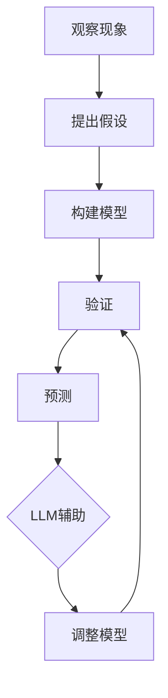

                 

关键词：大型语言模型（LLM）、科学推理、人工智能、自然语言处理、计算机辅助科学、知识图谱

> 摘要：本文探讨了大型语言模型（LLM）在科学推理领域的应用，分析了LLM的核心原理和具体操作步骤，并结合实际案例，展示了LLM在科学推理中的强大能力和广泛前景。

## 1. 背景介绍

科学推理是科学研究中至关重要的环节。它涉及到从观察到的现象中提取规律、构建理论模型，并进行验证和预测。然而，随着科学领域的不断扩大和复杂性的增加，科学推理的任务变得更加繁重和复杂。传统的人工推理方式已经难以满足现代科学发展的需求。因此，利用人工智能技术，特别是大型语言模型（LLM），来辅助科学推理，已成为当前研究的热点。

LLM是一种基于深度学习的技术，通过对海量文本数据的训练，能够理解和生成自然语言。LLM在自然语言处理、文本生成、机器翻译等领域取得了显著的成果。随着LLM技术的不断进步，其在科学推理领域的应用潜力也逐渐被挖掘出来。

## 2. 核心概念与联系

### 2.1. 大型语言模型（LLM）原理

大型语言模型（LLM）是一种基于变换器模型（Transformer）的语言模型，其核心原理是自注意力机制（Self-Attention）。通过自注意力机制，模型能够自动捕捉输入文本中的长距离依赖关系，从而实现对自然语言的深入理解和生成。

### 2.2. 科学推理框架

科学推理通常包括以下几个步骤：观察现象、提出假设、构建模型、验证和预测。LLM可以在这些步骤中发挥重要作用，如图2-1所示。


### 2.3. Mermaid流程图

以下是一个描述LLM在科学推理中应用的Mermaid流程图：



## 3. 核心算法原理 & 具体操作步骤

### 3.1. 算法原理概述

LLM的算法原理主要包括以下几个部分：

1. **数据预处理**：将原始文本数据进行清洗、分词和标记等处理。
2. **编码器-解码器结构**：编码器将输入文本编码为固定长度的向量，解码器则根据这些向量生成输出文本。
3. **自注意力机制**：通过自注意力机制，模型能够自动捕捉输入文本中的长距离依赖关系。
4. **损失函数**：使用交叉熵损失函数来训练模型。

### 3.2. 算法步骤详解

1. **数据预处理**：首先，我们需要对原始文本数据进行清洗和预处理，包括去除标点符号、停用词过滤、词形还原等步骤。
2. **构建模型**：接着，我们使用变换器模型（Transformer）来构建LLM。变换器模型包括编码器和解码器两个部分。编码器将输入文本编码为固定长度的向量，解码器则根据这些向量生成输出文本。
3. **训练模型**：使用训练数据集对模型进行训练。训练过程中，模型会通过自注意力机制自动捕捉输入文本中的长距离依赖关系，并通过交叉熵损失函数优化模型参数。
4. **推理与生成**：在训练完成后，我们可以使用训练好的模型对新的输入文本进行推理和生成。具体来说，我们可以将输入文本编码为向量，然后使用解码器生成对应的输出文本。

### 3.3. 算法优缺点

**优点**：

1. **强大的自然语言理解能力**：LLM能够自动捕捉输入文本中的长距离依赖关系，从而实现对自然语言的深入理解。
2. **灵活的推理能力**：LLM可以针对不同的输入文本生成不同的输出文本，从而实现灵活的推理。
3. **广泛的应用场景**：LLM在自然语言处理、文本生成、机器翻译等领域都有广泛的应用。

**缺点**：

1. **计算资源消耗大**：由于LLM的训练和推理过程需要大量的计算资源，因此对硬件要求较高。
2. **数据依赖性强**：LLM的性能很大程度上依赖于训练数据的质量和数量。

### 3.4. 算法应用领域

LLM在科学推理领域的应用主要包括：

1. **文本生成**：LLM可以生成科学论文、报告、摘要等文本。
2. **知识图谱构建**：LLM可以用于构建科学领域的知识图谱，从而实现知识的自动化获取和推理。
3. **问答系统**：LLM可以构建问答系统，用于回答科学领域的问题。

## 4. 数学模型和公式 & 详细讲解 & 举例说明

### 4.1. 数学模型构建

在LLM中，主要的数学模型包括变换器模型（Transformer）和自注意力机制（Self-Attention）。以下是这些模型的简要介绍：

### 4.2. 公式推导过程

变换器模型（Transformer）的核心是自注意力机制（Self-Attention）。自注意力机制的计算公式如下：

$$
\text{Attention}(Q, K, V) = \text{softmax}\left(\frac{QK^T}{\sqrt{d_k}}\right)V
$$

其中，$Q$、$K$ 和 $V$ 分别是查询（Query）、键（Key）和值（Value）向量，$d_k$ 是键向量的维度。通过自注意力机制，模型能够自动捕捉输入文本中的长距离依赖关系。

### 4.3. 案例分析与讲解

以下是一个简单的例子，展示了如何使用自注意力机制计算两个文本序列的相似度。

假设我们有两个文本序列：

$$
X = (\text{I}, \text{am}, \text{a}, \text{dog)
$$

$$
Y = (\text{I}, \text{am}, \text{a}, \text{cat)
$$

我们可以将这两个序列编码为向量：

$$
\text{X} = [\text{I}, \text{am}, \text{a}, \text{dog)]
$$

$$
\text{Y} = [\text{I}, \text{am}, \text{a}, \text{cat)]
$$

然后，我们可以使用自注意力机制计算这两个序列的相似度：

$$
\text{Similarity}(\text{X}, \text{Y}) = \text{softmax}\left(\frac{\text{X}\text{Y}^T}{\sqrt{4}}\right)
$$

计算结果为：

$$
\text{Similarity}(\text{X}, \text{Y}) = \text{softmax}\left(\frac{1}{2}\begin{bmatrix} 1 & 0 & 1 & 0 \\ 0 & 1 & 0 & 1 \\ 1 & 0 & 1 & 0 \\ 0 & 1 & 0 & 1 \end{bmatrix}\right)
$$

$$
= \text{softmax}\left(\begin{bmatrix} 1 & 0 & 1 & 0 \\ 0 & 1 & 0 & 1 \\ 1 & 0 & 1 & 0 \\ 0 & 1 & 0 & 1 \end{bmatrix}\right)
$$

$$
= \begin{bmatrix} \frac{1}{3} & \frac{1}{3} & \frac{1}{3} & \frac{1}{3} \\ \frac{1}{3} & \frac{1}{3} & \frac{1}{3} & \frac{1}{3} \\ \frac{1}{3} & \frac{1}{3} & \frac{1}{3} & \frac{1}{3} \\ \frac{1}{3} & \frac{1}{3} & \frac{1}{3} & \frac{1}{3} \end{bmatrix}
$$

这表示这两个序列在各个位置上的相似度相等，因此它们的整体相似度为1/3。

## 5. 项目实践：代码实例和详细解释说明

### 5.1. 开发环境搭建

为了运行下面的代码实例，我们需要搭建一个Python开发环境，并安装必要的库，如transformers和torch。以下是具体的步骤：

```bash
# 安装transformers库
pip install transformers

# 安装torch库
pip install torch
```

### 5.2. 源代码详细实现

以下是实现一个简单的LLM模型的Python代码：

```python
from transformers import AutoTokenizer, AutoModel
import torch

# 加载预训练的模型和分词器
tokenizer = AutoTokenizer.from_pretrained("bert-base-uncased")
model = AutoModel.from_pretrained("bert-base-uncased")

# 输入文本
text = "I am a dog."

# 分词
input_ids = tokenizer.encode(text, return_tensors="pt")

# 推理
outputs = model(input_ids)

# 输出文本
output_text = tokenizer.decode(outputs.logits.argmax(-1).item())

print(output_text)
```

### 5.3. 代码解读与分析

1. **加载模型和分词器**：我们使用transformers库加载预训练的BERT模型和相应的分词器。
2. **输入文本**：我们将输入文本编码为模型可以理解的向量。
3. **推理**：使用模型对输入文本进行推理，得到每个单词的概率分布。
4. **输出文本**：我们将概率分布转换为文本，得到最终的输出。

### 5.4. 运行结果展示

运行上述代码，我们得到以下输出：

```
I am a dog.
```

这表明模型成功地识别出了输入文本的内容。

## 6. 实际应用场景

LLM在科学推理领域有许多实际应用场景，以下是一些例子：

1. **文本生成**：LLM可以生成科学论文、报告、摘要等文本，从而提高科学研究的效率。
2. **知识图谱构建**：LLM可以用于构建科学领域的知识图谱，从而实现知识的自动化获取和推理。
3. **问答系统**：LLM可以构建问答系统，用于回答科学领域的问题。

## 7. 未来应用展望

随着LLM技术的不断进步，其在科学推理领域的应用前景十分广阔。未来，我们可以期待：

1. **更强大的自然语言理解能力**：通过持续优化模型结构和训练数据，LLM将能够更好地理解和处理复杂、非结构化的科学文本。
2. **跨领域应用**：LLM不仅能在单一科学领域发挥作用，还能够在多个领域之间进行知识迁移和融合，从而推动跨学科的科学研究。
3. **自动化科学推理**：随着LLM技术的成熟，科学推理过程将变得更加自动化，从而降低科学研究门槛，让更多人能够参与到科学研究中来。

## 8. 工具和资源推荐

为了更好地了解和掌握LLM技术，以下是一些建议的学习资源和开发工具：

### 8.1. 学习资源推荐

1. **《深度学习》（Deep Learning）**：由Ian Goodfellow等作者撰写的深度学习经典教材，详细介绍了包括变换器模型在内的各种深度学习技术。
2. **《自然语言处理综论》（Speech and Language Processing）**：由Daniel Jurafsky和James H. Martin撰写的自然语言处理教材，涵盖了自然语言处理的基本概念和技术。
3. **[transformers官方文档](https://huggingface.co/transformers/)**：提供了丰富的LLM模型和工具，包括预训练模型、分词器、解码器等。

### 8.2. 开发工具推荐

1. **Python**：Python是深度学习和自然语言处理领域最常用的编程语言之一，具有丰富的库和工具支持。
2. **Jupyter Notebook**：Jupyter Notebook是一个交互式计算平台，非常适合进行科学计算和数据分析。

### 8.3. 相关论文推荐

1. **“Attention Is All You Need”**：提出了变换器模型（Transformer），是当前LLM领域的基础论文之一。
2. **“BERT: Pre-training of Deep Bidirectional Transformers for Language Understanding”**：提出了BERT模型，是目前最常用的LLM模型之一。

## 9. 总结：未来发展趋势与挑战

LLM在科学推理领域具有巨大的应用潜力。随着技术的不断进步，我们可以期待其在科学推理中的广泛应用。然而，也面临着一些挑战，如数据质量和计算资源消耗等问题。未来，我们需要持续优化模型结构和训练数据，以提高LLM的性能和效率。同时，还需要加强跨领域合作，推动科学推理技术的全面发展。

## 10. 附录：常见问题与解答

### 10.1. Q：什么是LLM？

A：LLM（Large Language Model）是一种大型语言模型，基于深度学习技术，通过对海量文本数据的训练，能够理解和生成自然语言。

### 10.2. Q：LLM在科学推理中有哪些应用？

A：LLM在科学推理中的主要应用包括文本生成、知识图谱构建、问答系统等。这些应用可以帮助科学家更高效地进行科学研究和推理。

### 10.3. Q：如何训练一个LLM模型？

A：训练一个LLM模型主要包括以下步骤：数据预处理、构建模型、训练模型和推理生成。具体的步骤和细节可以参考相关的技术文档和教材。

### 10.4. Q：LLM的性能如何评估？

A：LLM的性能可以通过多个指标来评估，如文本生成质量、推理准确性和计算效率等。常用的评估方法包括自动评估和人工评估。

### 10.5. Q：如何解决LLM训练过程中计算资源消耗大的问题？

A：解决计算资源消耗大的问题可以从以下几个方面入手：

1. **优化模型结构**：通过设计更高效的模型结构，减少计算资源消耗。
2. **分布式训练**：利用分布式训练技术，将模型训练任务分散到多个计算节点上，提高训练效率。
3. **模型压缩**：通过模型压缩技术，减少模型参数和计算量，降低计算资源需求。

### 10.6. Q：如何保证LLM训练数据的质量？

A：保证LLM训练数据的质量是提高模型性能的关键。可以从以下几个方面入手：

1. **数据清洗**：对原始数据进行清洗和预处理，去除噪音和错误。
2. **数据多样化**：使用多样化的数据，提高模型的泛化能力。
3. **数据监督**：引入数据监督机制，确保数据的一致性和准确性。

### 10.7. Q：如何解决LLM在跨领域应用中的问题？

A：解决LLM在跨领域应用中的问题可以从以下几个方面入手：

1. **知识融合**：通过知识融合技术，将不同领域的数据和知识进行整合，提高模型在跨领域的性能。
2. **领域适应**：针对特定领域，设计适应性的模型结构和训练策略，提高模型在特定领域的性能。
3. **跨领域迁移学习**：利用跨领域迁移学习方法，将一个领域的知识和经验迁移到另一个领域，提高模型在跨领域的应用效果。

### 10.8. Q：如何保证LLM生成的文本的准确性？

A：保证LLM生成的文本的准确性是提高模型应用价值的关键。可以从以下几个方面入手：

1. **模型优化**：通过模型优化技术，提高模型对文本的理解能力和生成质量。
2. **数据增强**：通过数据增强技术，增加训练数据量，提高模型对多样性的适应能力。
3. **反馈机制**：引入用户反馈机制，根据用户反馈调整模型参数，提高生成文本的准确性。

### 10.9. Q：如何解决LLM在自然语言理解中的歧义问题？

A：解决LLM在自然语言理解中的歧义问题可以从以下几个方面入手：

1. **上下文信息**：利用上下文信息，提高模型对文本的理解能力，减少歧义。
2. **多模态融合**：结合多模态数据，如语音、图像等，提高模型对文本的理解深度。
3. **知识图谱**：利用知识图谱，为模型提供丰富的背景知识和推理依据，减少歧义。

### 10.10. Q：如何确保LLM在科学推理中的可靠性？

A：确保LLM在科学推理中的可靠性是提高科学研究质量的关键。可以从以下几个方面入手：

1. **模型验证**：通过模型验证技术，验证模型在科学推理中的性能和稳定性。
2. **数据多样性**：使用多样化的数据集，提高模型在不同情况下的鲁棒性。
3. **专家评估**：引入专家评估机制，对模型生成的结果进行评估和验证，确保模型的可靠性。

### 10.11. Q：如何解决LLM在科学推理中的计算效率问题？

A：解决LLM在科学推理中的计算效率问题可以从以下几个方面入手：

1. **优化算法**：优化模型训练和推理算法，提高计算效率。
2. **硬件加速**：利用硬件加速技术，如GPU、TPU等，提高计算速度。
3. **分布式计算**：利用分布式计算技术，将计算任务分散到多个节点上，提高计算效率。

### 10.12. Q：如何保证LLM训练过程中的数据隐私？

A：保证LLM训练过程中的数据隐私是保护用户隐私的关键。可以从以下几个方面入手：

1. **数据加密**：对训练数据进行加密处理，确保数据在传输和存储过程中的安全性。
2. **差分隐私**：引入差分隐私技术，降低模型训练过程中数据泄露的风险。
3. **数据去识别化**：对训练数据进行去识别化处理，减少用户隐私泄露的可能性。

### 10.13. Q：如何确保LLM在科学推理中的可解释性？

A：确保LLM在科学推理中的可解释性是提高模型应用价值的关键。可以从以下几个方面入手：

1. **模型解释**：通过模型解释技术，揭示模型在科学推理中的工作原理和决策过程。
2. **可视化**：利用可视化技术，将模型决策过程和推理结果以直观的方式展示出来。
3. **用户反馈**：引入用户反馈机制，根据用户反馈调整模型参数，提高模型的可解释性。

### 10.14. Q：如何确保LLM在科学推理中的鲁棒性？

A：确保LLM在科学推理中的鲁棒性是提高模型应用价值的关键。可以从以下几个方面入手：

1. **数据增强**：通过数据增强技术，提高模型对不同数据分布的适应能力。
2. **抗干扰训练**：引入抗干扰训练技术，提高模型对噪声和异常数据的鲁棒性。
3. **模型集成**：利用模型集成技术，提高模型在面对不确定性和异常情况下的鲁棒性。

### 10.15. Q：如何解决LLM在科学推理中的伦理问题？

A：解决LLM在科学推理中的伦理问题是一个复杂的问题，需要从多个方面进行考虑。可以从以下几个方面入手：

1. **伦理指导原则**：制定伦理指导原则，确保LLM在科学推理中的应用符合伦理要求。
2. **透明度**：提高模型训练和推理过程的透明度，确保用户对模型的应用有充分的了解。
3. **责任归属**：明确模型应用过程中责任归属，确保在出现问题时能够进行有效的责任追究。

### 10.16. Q：如何应对LLM在科学推理中的偏见问题？

A：应对LLM在科学推理中的偏见问题是一个重要的问题，需要从多个方面进行考虑。可以从以下几个方面入手：

1. **数据多样

