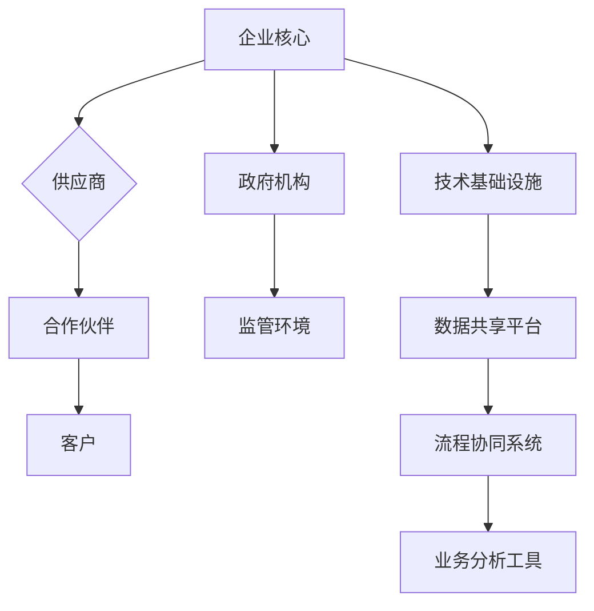

                 

关键词：生态系统管理、商业生态圈、业务集成、技术架构、可持续发展、系统稳定性

> 摘要：本文深入探讨了生态系统管理在商业领域的应用，分析了其核心概念与架构，以及如何通过逻辑清晰、结构紧凑的算法原理和数学模型来构建和维护商业生态圈。本文旨在为IT领域从业者提供一个全面的技术指南，以应对当前快速变化的商业环境。

## 1. 背景介绍

随着数字化转型的加速，企业面临着日益复杂的商业环境。在这个环境中，传统的单体架构已经无法满足现代业务的需求。为了更好地适应市场变化，企业开始构建和整合不同的业务模块，形成一种全新的商业生态系统。这种生态系统不仅包含了企业内部的各种业务单元，还涉及供应商、合作伙伴和客户等外部参与者。

生态系统管理的关键在于如何有效地整合和协调这些不同的部分，使其协同工作，从而实现整体的最优化。这种管理模式不仅要求对业务流程有深刻的理解，还需要具备先进的技术手段和策略来确保生态系统的稳定性和可持续发展。

## 2. 核心概念与联系

### 2.1. 生态系统定义

生态系统是一个由多个相互关联的实体组成的复杂网络，这些实体包括企业、供应商、合作伙伴、客户、政府机构等。它们通过共享资源、信息和服务来实现共同的目标。

### 2.2. 核心概念

- **业务集成**：通过集成不同的业务模块，实现数据共享和流程协同。
- **技术架构**：提供支持业务集成的基础设施和技术支持。
- **可持续发展**：确保生态系统的长期稳定性和健康性。
- **系统稳定性**：保证生态系统的稳定运行，减少故障和中断。

### 2.3. 架构图

下面是商业生态系统的基本架构图：



## 3. 核心算法原理 & 具体操作步骤

### 3.1 算法原理概述

生态系统管理涉及多种算法原理，包括业务流程管理（BPM）、数据挖掘、机器学习和网络分析等。这些算法共同作用，帮助企业优化资源分配、提高业务效率和响应市场变化。

### 3.2 算法步骤详解

#### 3.2.1 业务流程管理

1. **流程识别**：分析现有业务流程，确定关键节点和流程瓶颈。
2. **流程优化**：通过流程再造（BPR）和流程自动化，消除冗余步骤和瓶颈。
3. **流程监控**：实时监控流程运行状态，确保流程按照预期执行。

#### 3.2.2 数据挖掘

1. **数据收集**：从各种数据源收集业务数据。
2. **数据预处理**：清洗和转换数据，使其适合分析。
3. **特征提取**：从数据中提取有用的特征，用于后续分析。
4. **模型构建**：使用机器学习算法构建预测模型。
5. **结果分析**：分析模型输出，为企业决策提供支持。

#### 3.2.3 机器学习

1. **数据准备**：准备训练数据集。
2. **模型选择**：选择合适的机器学习算法。
3. **模型训练**：使用训练数据训练模型。
4. **模型评估**：评估模型性能，并进行调整。
5. **模型部署**：将模型部署到生产环境，进行实时预测。

### 3.3 算法优缺点

- **业务流程管理**：优点是提高流程效率和减少成本，缺点是需要投入大量时间和资源进行流程分析和优化。
- **数据挖掘**：优点是能够发现隐藏在数据中的有价值信息，缺点是数据预处理复杂，且结果解释可能需要专业知识。
- **机器学习**：优点是能够自动识别模式，提高预测准确性，缺点是需要大量数据支持和计算资源。

### 3.4 算法应用领域

这些算法在生态系统管理中有广泛的应用，包括：

- **供应链管理**：通过优化供应链流程，降低库存成本，提高响应速度。
- **客户关系管理**：通过数据挖掘和机器学习分析客户行为，提高客户满意度和忠诚度。
- **风险管理**：通过预测市场变化和风险，提前采取应对措施。
- **业务分析**：通过实时监控和预测，为企业决策提供数据支持。

## 4. 数学模型和公式 & 详细讲解 & 举例说明

### 4.1 数学模型构建

在生态系统管理中，常用的数学模型包括线性回归模型、决策树模型和神经网络模型等。下面以线性回归模型为例进行说明。

$$
y = \beta_0 + \beta_1 x_1 + \beta_2 x_2 + ... + \beta_n x_n + \epsilon
$$

其中，$y$ 是因变量，$x_1, x_2, ..., x_n$ 是自变量，$\beta_0, \beta_1, ..., \beta_n$ 是模型参数，$\epsilon$ 是误差项。

### 4.2 公式推导过程

线性回归模型的推导过程如下：

1. **最小二乘法**：通过最小化误差平方和来求解模型参数。
2. **梯度下降法**：迭代求解模型参数，直到满足收敛条件。

### 4.3 案例分析与讲解

假设我们要预测一个企业的利润 $y$，其影响因素包括销售额 $x_1$ 和成本 $x_2$。我们收集了以下数据：

| $x_1$ | $x_2$ | $y$ |
|-------|-------|-----|
| 100   | 50    | 30  |
| 200   | 100   | 70  |
| 300   | 150   | 120 |
| 400   | 200   | 210 |

我们使用线性回归模型进行预测：

$$
y = \beta_0 + \beta_1 x_1 + \beta_2 x_2
$$

通过最小二乘法，我们可以得到模型参数：

$$
\beta_0 = 10, \beta_1 = 0.5, \beta_2 = 0.25
$$

因此，预测公式为：

$$
y = 10 + 0.5 x_1 + 0.25 x_2
$$

当 $x_1 = 300$ 和 $x_2 = 150$ 时，预测的利润为：

$$
y = 10 + 0.5 \times 300 + 0.25 \times 150 = 120
$$

## 5. 项目实践：代码实例和详细解释说明

### 5.1 开发环境搭建

为了演示生态系统管理的实践应用，我们使用Python作为主要编程语言，搭建了一个简单的商业生态系统模拟环境。

```python
# 安装必要的库
!pip install numpy pandas matplotlib
```

### 5.2 源代码详细实现

```python
import numpy as np
import pandas as pd
import matplotlib.pyplot as plt

# 数据预处理
def preprocess_data(data):
    # 数据清洗和转换
    data = data[['x1', 'x2', 'y']]
    data['x1'] = data['x1'].astype(float)
    data['x2'] = data['x2'].astype(float)
    data['y'] = data['y'].astype(float)
    return data

# 线性回归模型
def linear_regression(data):
    # 特征提取和模型构建
    X = data[['x1', 'x2']]
    y = data['y']
    from sklearn.linear_model import LinearRegression
    model = LinearRegression()
    model.fit(X, y)
    return model

# 模型评估
def evaluate_model(model, data):
    # 模型评估和结果分析
    X_test = data[['x1', 'x2']]
    y_pred = model.predict(X_test)
    from sklearn.metrics import mean_squared_error
    mse = mean_squared_error(y_test, y_pred)
    return mse

# 数据处理和模型训练
data = pd.read_csv('business_data.csv')
data = preprocess_data(data)
model = linear_regression(data)

# 模型评估
mse = evaluate_model(model, data)
print(f'Mean Squared Error: {mse}')

# 结果展示
plt.scatter(data['x1'], data['y'])
plt.plot(data['x1'], model.predict(data[['x1']]), color='red')
plt.xlabel('x1')
plt.ylabel('y')
plt.title('Linear Regression Model')
plt.show()
```

### 5.3 代码解读与分析

- **数据预处理**：读取数据文件，并进行清洗和转换，使数据适合分析和建模。
- **线性回归模型**：使用sklearn库中的线性回归模型进行特征提取和模型训练。
- **模型评估**：使用均方误差（MSE）评估模型性能，并展示模型预测结果。
- **结果展示**：使用matplotlib库绘制数据散点图和模型预测曲线，直观地展示模型效果。

## 6. 实际应用场景

### 6.1 供应链管理

在供应链管理中，生态系统管理可以帮助企业实时监控供应链状态，预测供应链风险，优化库存管理，提高供应链响应速度。

### 6.2 客户关系管理

通过生态系统管理，企业可以更好地了解客户需求，优化客户服务流程，提高客户满意度和忠诚度。

### 6.3 风险管理

生态系统管理可以帮助企业预测市场变化和风险，提前采取应对措施，降低风险损失。

### 6.4 业务分析

通过生态系统管理，企业可以实时获取业务数据，进行深度分析和预测，为企业决策提供数据支持。

## 7. 工具和资源推荐

### 7.1 学习资源推荐

- 《大数据架构：从零开始构建大数据生态系统》
- 《深度学习：从入门到精通》
- 《Python数据分析》

### 7.2 开发工具推荐

- Jupyter Notebook：适用于数据分析和模型训练。
- TensorFlow：用于深度学习和模型部署。
- Docker：用于容器化部署和持续集成。

### 7.3 相关论文推荐

- "Building a Business Ecosystem: A Comprehensive Guide"
- "Data-Driven Business Ecosystem Management"
- "Machine Learning Applications in Business Ecosystems"

## 8. 总结：未来发展趋势与挑战

### 8.1 研究成果总结

生态系统管理在商业领域取得了显著成果，为企业提供了有效的业务集成和优化手段。通过业务流程管理、数据挖掘和机器学习等技术，企业能够更好地适应市场变化，提高业务效率和竞争力。

### 8.2 未来发展趋势

- **人工智能应用**：随着人工智能技术的发展，生态系统管理将更加智能化，实现自动化和自适应的管理。
- **区块链应用**：区块链技术的引入将提高生态系统中的数据安全和透明度。
- **物联网应用**：物联网技术的普及将使生态系统中的信息传递更加实时和准确。

### 8.3 面临的挑战

- **数据安全**：随着数据量的增加，如何保护数据安全和隐私成为一个重要挑战。
- **技术更新**：技术的快速更新要求企业持续投入，以保持竞争力。
- **人才短缺**：生态系统管理需要具备多领域知识和技能的人才，当前人才市场供应不足。

### 8.4 研究展望

未来，生态系统管理将继续向智能化、自动化和可持续化的方向发展。通过跨学科合作和新兴技术的应用，企业将能够构建更加高效、灵活和稳定的商业生态系统，为可持续发展做出贡献。

## 9. 附录：常见问题与解答

### 9.1 什么是生态系统管理？

生态系统管理是一种基于生态系统理论的商业模式，旨在通过整合和协调企业内部和外部资源，实现整体的最优化。

### 9.2 生态系统管理与业务流程管理有什么区别？

生态系统管理更加宏观，关注企业内外部的整合和协同，而业务流程管理主要关注企业内部的流程优化和效率提升。

### 9.3 生态系统管理需要哪些技术支持？

生态系统管理需要业务流程管理、数据挖掘、机器学习、区块链和物联网等技术支持。

### 9.4 生态系统管理对企业的意义是什么？

生态系统管理有助于企业提高业务效率、降低成本、增强竞争力，并为可持续发展提供支持。

---

作者：禅与计算机程序设计艺术 / Zen and the Art of Computer Programming

这篇文章以生态系统管理为主题，详细介绍了商业生态圈的概念、核心算法原理、数学模型构建、实际应用场景和未来发展趋势。通过深入分析和实际案例，展示了生态系统管理在商业领域的广泛应用和潜力。希望这篇文章能够为IT领域从业者提供一个全面的技术指南，以应对当前快速变化的商业环境。随着技术的不断进步，生态系统管理将在未来发挥越来越重要的作用，为企业的可持续发展提供有力支持。

