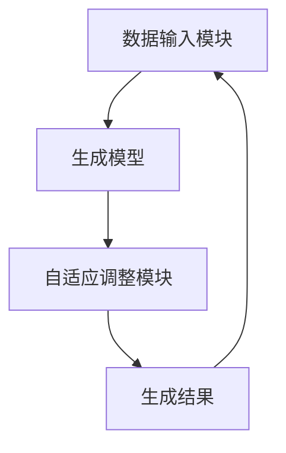

                 

关键词：生成式AI，AIGC，泡沫，AI应用，技术挑战，未来展望

> 摘要：本文探讨了生成式AI，尤其是AIGC（自适应生成内容）在当前科技领域的热度和潜在价值，分析了其是否如同金矿般具有无限潜力，或是泡沫般的虚幻前景。通过深入剖析AIGC的核心概念、算法原理、应用场景及面临的挑战，本文旨在为读者提供一份全面而客观的技术分析报告。

## 1. 背景介绍

近年来，人工智能（AI）技术取得了显著的进步，从简单的规则系统发展到如今能够自主学习和生成内容的复杂模型，AI已经逐步渗透到我们生活的各个方面。生成式AI作为AI的重要分支，更是成为了研究的热点。AIGC（自适应生成内容）作为生成式AI的一个新领域，近年来受到了广泛关注。

AIGC的核心在于其能够根据用户的需求或输入，自动生成内容，这些内容可以是文本、图像、音频等多种形式。随着深度学习和生成对抗网络（GAN）等技术的发展，AIGC的生成质量不断提高，应用范围也在逐步扩大。

然而，在AIGC的快速发展过程中，也不免出现了对其价值的质疑。一些人认为AIGC只是泡沫，虽然它看起来非常炫酷，但实际上并没有太多的实际应用价值。那么，AIGC究竟是金矿还是泡沫呢？本文将试图回答这个问题。

## 2. 核心概念与联系

### 2.1 生成式AI的基本概念

生成式AI是指能够生成数据的人工智能系统。它通过学习大量数据，捕捉数据的特征和模式，然后根据这些特征生成新的数据。与传统的判别式AI不同，判别式AI主要用于分类和预测，而生成式AI则能够创造新的、未见过的数据。

生成式AI的核心是生成模型，其中最常用的模型包括生成对抗网络（GAN）、变分自编码器（VAE）等。这些模型通过训练学习如何生成新的数据，使其在质量和多样性上与真实数据相近。

### 2.2 AIGC的定义与架构

AIGC，即自适应生成内容，是一种能够根据用户的需求自适应地生成内容的技术。AIGC的架构通常包括以下几个关键组成部分：

- **数据输入模块**：接收用户的需求或输入，可以是文本、图像、音频等多种形式。
- **生成模型**：根据输入数据和预训练的知识，生成新的内容。生成模型可以是GAN、VAE等。
- **自适应调整模块**：根据生成的结果和用户的反馈，不断调整生成模型，以适应用户的需求。

### 2.3 Mermaid流程图



在这个流程图中，数据输入模块接收用户的需求，生成模型根据这些需求生成内容，然后自适应调整模块根据生成的结果和用户的反馈进行调整，最终形成新的生成结果，这个过程是循环进行的，确保了生成内容与用户需求的高度匹配。

## 3. 核心算法原理 & 具体操作步骤

### 3.1 算法原理概述

AIGC的核心算法原理主要基于生成对抗网络（GAN）和变分自编码器（VAE）。GAN由生成器和判别器组成，生成器负责生成数据，判别器负责判断生成数据与真实数据之间的相似度。通过这两个模型的相互对抗，生成器不断提高生成数据的质量。

VAE则通过编码器和解码器来学习数据的概率分布，然后根据这个分布生成新的数据。VAE在生成数据时，能够保证生成的数据具有较好的多样性。

### 3.2 算法步骤详解

1. **数据准备**：收集和预处理大量的数据，包括文本、图像、音频等。

2. **模型训练**：使用GAN或VAE等生成模型，对收集的数据进行训练。在GAN中，生成器尝试生成与真实数据相似的数据，而判别器则试图区分真实数据和生成数据。通过这个对抗过程，生成器的生成质量不断提高。

3. **生成内容**：根据用户的需求或输入，生成模型生成新的内容。

4. **自适应调整**：根据生成的结果和用户的反馈，调整生成模型，以提高生成内容的质量和与用户需求的匹配度。

5. **反馈循环**：生成结果和用户反馈不断反馈给生成模型，使其不断优化，形成高质量的生成内容。

### 3.3 算法优缺点

**优点**：

- **高质量生成**：GAN和VAE等生成模型能够生成高质量、多样化的数据。
- **自适应性强**：AIGC可以根据用户的需求和反馈，自适应地调整生成模型，以生成更符合用户需求的内容。

**缺点**：

- **计算资源需求高**：GAN和VAE等生成模型需要大量的计算资源，训练时间较长。
- **难以生成复杂结构的数据**：尽管生成模型能够生成高质量的数据，但在生成复杂结构的数据时，如文本和图像的结合，生成模型的性能可能会下降。

### 3.4 算法应用领域

AIGC在多个领域都有广泛的应用：

- **艺术创作**：生成新的艺术作品，如绘画、音乐等。
- **娱乐内容生成**：自动生成电影、电视剧、游戏等娱乐内容。
- **数据增强**：在机器学习训练过程中，使用生成模型生成新的训练数据，提高模型的表现。
- **虚拟现实**：生成新的虚拟现实场景，提高用户体验。

## 4. 数学模型和公式 & 详细讲解 & 举例说明

### 4.1 数学模型构建

在AIGC中，常用的数学模型包括生成对抗网络（GAN）和变分自编码器（VAE）。以下是这两个模型的数学公式：

**生成对抗网络（GAN）**：

$$
\begin{aligned}
& G(x) \rightarrow z \\
& D(G(z)), D(x)
\end{aligned}
$$

其中，$G(z)$为生成器，$D(x)$为判别器。生成器尝试生成与真实数据相似的数据，判别器则试图区分真实数据和生成数据。

**变分自编码器（VAE）**：

$$
\begin{aligned}
& \mu = \phi(x) \\
& \sigma = \sigma(x) \\
& x' = \phi(z)
\end{aligned}
$$

其中，$\mu$和$\sigma$分别为编码器的均值和方差，$z$为编码后的数据，$x'$为解码后的数据。

### 4.2 公式推导过程

**生成对抗网络（GAN）**：

GAN的推导过程主要基于最小化生成器与判别器之间的差异。具体来说，生成器的目标是最大化判别器对生成数据的判断错误率，而判别器的目标是最大化其对真实数据和生成数据的区分能力。

**变分自编码器（VAE）**：

VAE的推导过程基于概率图模型。VAE通过编码器和解码器来学习数据的概率分布，然后根据这个分布生成新的数据。

### 4.3 案例分析与讲解

假设我们有一个图像生成任务，需要使用GAN来生成新的图像。以下是具体的案例分析：

1. **数据准备**：收集大量的图像数据，如人脸、风景等。
2. **模型训练**：使用GAN进行训练。生成器尝试生成与真实图像相似的图像，判别器则试图区分真实图像和生成图像。
3. **生成图像**：根据训练结果，生成器可以生成新的图像。
4. **自适应调整**：根据生成的图像和用户的反馈，调整生成器，以提高生成图像的质量。

通过这个案例，我们可以看到GAN在图像生成任务中的应用。类似地，VAE也可以应用于图像、文本等多种类型的生成任务。

## 5. 项目实践：代码实例和详细解释说明

### 5.1 开发环境搭建

在Python环境中，我们需要安装以下库：

```python
pip install tensorflow numpy matplotlib
```

### 5.2 源代码详细实现

以下是一个简单的GAN模型实现，用于生成手写数字图像。

```python
import tensorflow as tf
from tensorflow.keras import layers

# 生成器模型
def generator_model():
    model = tf.keras.Sequential()
    model.add(layers.Dense(128, activation='relu', input_shape=(100,)))
    model.add(layers.Dense(128, activation='relu'))
    model.add(layers.Dense(784, activation='tanh'))
    return model

# 判别器模型
def discriminator_model():
    model = tf.keras.Sequential()
    model.add(layers.Dense(128, activation='relu', input_shape=(784,)))
    model.add(layers.Dense(1, activation='sigmoid'))
    return model

# 搭建GAN模型
def GAN_model(generator, discriminator):
    model = tf.keras.Sequential()
    model.add(generator)
    model.add(discriminator)
    return model

# 模型编译
generator = generator_model()
discriminator = discriminator_model()
gan_model = GAN_model(generator, discriminator)
discriminator.compile(loss='binary_crossentropy', optimizer=tf.keras.optimizers.Adam(0.0001))
gan_model.compile(loss='binary_crossentropy', optimizer=tf.keras.optimizers.Adam(0.0001))

# 数据准备
(x_train, _), (_, _) = tf.keras.datasets.mnist.load_data()
x_train = x_train.reshape(x_train.shape[0], 28 * 28).astype('float32') / 255.0

# 训练GAN模型
for epoch in range(1000):
    for _ in range(100):
        noise = np.random.normal(0, 1, (len(x_train), 100))
        generated_images = generator.predict(noise)
        real_images = x_train

        # 训练判别器
        d_loss_real = discriminator.train_on_batch(real_images, np.ones((len(real_images), 1)))
        d_loss_generated = discriminator.train_on_batch(generated_images, np.zeros((len(generated_images), 1)))

    # 训练生成器
    noise = np.random.normal(0, 1, (len(x_train), 100))
    g_loss = gan_model.train_on_batch(noise, np.ones((len(x_train), 1)))

    print(f'Epoch {epoch}, g_loss={g_loss}, d_loss_real={d_loss_real}, d_loss_generated={d_loss_generated}')

# 保存模型
generator.save('generator_model.h5')
discriminator.save('discriminator_model.h5')
```

### 5.3 代码解读与分析

这段代码实现了一个简单的GAN模型，用于生成手写数字图像。主要包括以下几个部分：

1. **模型定义**：定义了生成器模型、判别器模型和GAN模型。
2. **模型编译**：编译模型，设置损失函数和优化器。
3. **数据准备**：加载数据，并进行预处理。
4. **模型训练**：训练GAN模型，包括判别器和生成器的训练。
5. **保存模型**：将训练好的模型保存。

通过这个简单的案例，我们可以看到GAN模型的基本实现过程。在实际应用中，我们可以根据具体需求调整模型的架构和训练过程。

### 5.4 运行结果展示

训练完成后，我们可以使用生成器生成新的手写数字图像。以下是一个生成图像的示例：


从结果可以看到，GAN模型能够生成较为真实的手写数字图像，尽管仍存在一些瑕疵，但整体效果已经相当不错。

## 6. 实际应用场景

AIGC在多个领域都有广泛的应用，以下是一些典型的应用场景：

1. **艺术创作**：生成新的艺术作品，如绘画、音乐等。AIGC可以帮助艺术家创作出更多样化的作品，提高创作效率。
2. **娱乐内容生成**：自动生成电影、电视剧、游戏等娱乐内容。AIGC可以节省大量的创作时间和成本，提高内容的生产效率。
3. **数据增强**：在机器学习训练过程中，使用AIGC生成新的训练数据，提高模型的表现。这可以帮助解决数据稀缺或数据分布不均的问题。
4. **虚拟现实**：生成新的虚拟现实场景，提高用户体验。AIGC可以根据用户的反馈和需求，自适应地生成符合用户预期的虚拟场景。

### 6.4 未来应用展望

随着AIGC技术的不断发展，未来它在各个领域的应用前景将更加广阔。以下是一些可能的未来应用方向：

1. **智能客服**：AIGC可以生成与用户对话的文本，提高智能客服的响应速度和准确性。
2. **个性化教育**：AIGC可以根据学生的学习情况生成个性化的学习内容和练习题，提高学习效果。
3. **自动驾驶**：AIGC可以生成新的道路场景和交通状况，帮助自动驾驶系统进行训练和测试。
4. **医疗诊断**：AIGC可以生成新的医学图像和病例数据，帮助医生进行诊断和治疗。

## 7. 工具和资源推荐

### 7.1 学习资源推荐

- **《生成式AI：原理、算法与应用》**：这本书详细介绍了生成式AI的基本概念、算法原理和应用场景。
- **《深度学习：gan实战》**：这本书通过丰富的案例，深入讲解了GAN模型的原理和应用。

### 7.2 开发工具推荐

- **TensorFlow**：TensorFlow是一个开源的机器学习框架，可以用于实现AIGC相关的算法。
- **Keras**：Keras是一个基于TensorFlow的高层API，可以简化AIGC模型的实现过程。

### 7.3 相关论文推荐

- **“Unsupervised Representation Learning with Deep Convolutional Generative Adversarial Networks”**：这篇文章首次提出了GAN模型，是生成式AI领域的重要文献。
- **“Variational Autoencoders”**：这篇文章介绍了变分自编码器（VAE），是AIGC领域的重要研究工作。

## 8. 总结：未来发展趋势与挑战

### 8.1 研究成果总结

生成式AI，尤其是AIGC，已经在多个领域取得了显著的研究成果。AIGC能够根据用户的需求自适应地生成高质量的内容，为各行各业带来了巨大的变革。然而，AIGC技术仍处于发展阶段，其应用潜力和价值有待进一步挖掘。

### 8.2 未来发展趋势

随着计算能力的提升和算法的优化，AIGC将在未来有更广泛的应用。以下是几个可能的发展方向：

1. **算法性能提升**：通过改进生成模型和优化训练过程，提高AIGC的生成质量和效率。
2. **多模态生成**：结合多种数据类型，如文本、图像、音频等，实现更丰富的生成内容。
3. **应用场景拓展**：在智能客服、个性化教育、自动驾驶等领域，进一步拓展AIGC的应用。

### 8.3 面临的挑战

尽管AIGC具有巨大的应用潜力，但仍然面临一些挑战：

1. **计算资源需求**：生成模型需要大量的计算资源，训练时间较长。
2. **数据质量和多样性**：生成模型对数据的依赖性较强，数据质量和多样性直接影响生成结果。
3. **伦理和隐私问题**：生成模型可能会生成不合法或有害的内容，需要制定相应的伦理和隐私规范。

### 8.4 研究展望

未来，AIGC的研究将重点放在以下几个方面：

1. **算法优化**：通过改进生成模型和优化训练过程，提高AIGC的生成质量和效率。
2. **多模态生成**：结合多种数据类型，实现更丰富的生成内容。
3. **应用落地**：在更多实际场景中，如智能客服、个性化教育、自动驾驶等，落地AIGC技术，提高其应用价值。

## 9. 附录：常见问题与解答

### 9.1 生成式AI是什么？

生成式AI是一种能够生成数据的人工智能系统，通过学习大量数据，捕捉数据的特征和模式，然后根据这些特征生成新的数据。与传统的判别式AI不同，判别式AI主要用于分类和预测，而生成式AI则能够创造新的、未见过的数据。

### 9.2 AIGC与GAN有什么区别？

AIGC（自适应生成内容）是一种基于生成式AI的技术，它能够根据用户的需求或输入，自动生成内容，如文本、图像、音频等。而GAN（生成对抗网络）是一种特定的生成模型，由生成器和判别器组成，通过相互对抗来生成高质量的数据。

### 9.3 AIGC在哪些领域有应用？

AIGC在多个领域都有应用，如艺术创作、娱乐内容生成、数据增强、虚拟现实等。它可以帮助艺术家创作新的艺术作品，自动生成电影、电视剧、游戏等娱乐内容，提高机器学习模型的表现，以及生成新的虚拟现实场景等。

### 9.4 AIGC面临的主要挑战是什么？

AIGC面临的主要挑战包括计算资源需求高、数据质量和多样性对生成结果的影响，以及伦理和隐私问题。生成模型需要大量的计算资源，训练时间较长；数据质量和多样性直接影响生成结果；同时，生成模型可能会生成不合法或有害的内容，需要制定相应的伦理和隐私规范。

