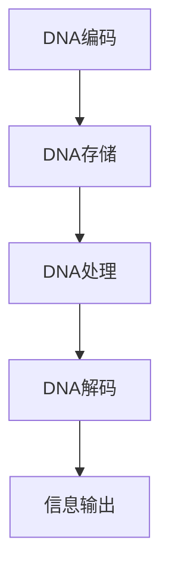

                 

关键词：生物计算、DNA存储、数据处理、基因编辑、人工智能

摘要：随着信息技术的迅猛发展，数据存储和处理的需求日益增长。传统的计算机存储和处理方式已经无法满足日益增长的数据量和复杂性。生物计算作为一种新兴的计算范式，利用DNA作为存储和处理信息的媒介，展现出巨大的潜力。本文将介绍生物计算的基本原理、核心算法、数学模型以及实际应用场景，并探讨其未来发展趋势和挑战。

## 1. 背景介绍

生物计算的概念最早可以追溯到20世纪80年代。当时，计算机科学家和生物学家开始探索如何将生物学的原理应用于计算领域。随着DNA测序技术的快速发展，生物计算逐渐成为研究热点。生物计算的核心思想是利用DNA的特性和结构来实现信息的存储、处理和传递。

### 生物计算的发展历史

1. **1980年代**：生物计算的概念首次被提出，科学家们开始探索将生物分子应用于计算。
2. **1990年代**：随着DNA测序技术的突破，生物计算迎来了快速发展期。
3. **2000年代**：生物计算逐渐从实验室研究走向实际应用，例如基因编辑技术。
4. **2010年代**：随着人工智能的兴起，生物计算与人工智能的结合成为研究热点。

### 生物计算的重要性

生物计算具有以下几个重要特点：

1. **大规模存储**：DNA具有极高的存储密度，可以存储大量的信息。
2. **并行处理**：生物计算可以同时处理多个任务，具有并行计算的能力。
3. **自修复能力**：DNA具有自修复的能力，可以在计算过程中自动纠正错误。

## 2. 核心概念与联系

### DNA作为存储媒介

DNA是由核苷酸组成的双螺旋结构，每个核苷酸包含一个碱基、一个磷酸基团和一个糖分子。碱基有四种类型：腺嘌呤（A）、胞嘧啶（C）、鸟嘌呤（G）和胸腺嘧啶（T）。通过编码这些碱基序列，DNA可以存储大量的遗传信息。

### 生物计算的架构

生物计算的架构主要包括以下几个部分：

1. **DNA编码**：将信息编码成DNA序列。
2. **DNA存储**：将编码后的DNA存储在实验室中的生物体中。
3. **DNA处理**：利用生物酶和其他化学物质对DNA序列进行处理，以实现信息处理。
4. **DNA解码**：将处理后的DNA序列解码回原始信息。

### Mermaid 流程图



## 3. 核心算法原理 & 具体操作步骤

### 3.1 算法原理概述

生物计算的核心算法是基于DNA序列的排列和组合来实现的。通过特定的算法，可以将输入的信息编码成DNA序列，存储在生物体中。然后，利用生物酶等化学物质对DNA序列进行处理，以实现信息处理。最后，通过解码算法将处理后的DNA序列转换回原始信息。

### 3.2 算法步骤详解

1. **DNA编码**：将输入的信息（如文本、图像等）转换为DNA序列。
2. **DNA存储**：将编码后的DNA序列存储在实验室中的生物体中。
3. **DNA处理**：利用生物酶等化学物质对DNA序列进行处理，以实现特定的计算任务。
4. **DNA解码**：将处理后的DNA序列解码回原始信息。

### 3.3 算法优缺点

**优点**：

1. **高存储密度**：DNA具有极高的存储密度，可以存储大量的信息。
2. **并行计算**：生物计算可以同时处理多个任务，具有并行计算的能力。
3. **自修复能力**：DNA具有自修复的能力，可以在计算过程中自动纠正错误。

**缺点**：

1. **解码难度**：DNA序列的解码过程复杂，需要精确的化学实验。
2. **存储安全性**：DNA存储的信息容易受到外界环境的干扰。

### 3.4 算法应用领域

生物计算的应用领域非常广泛，包括但不限于：

1. **基因编辑**：利用生物计算技术进行基因编辑，治疗遗传性疾病。
2. **数据加密**：利用DNA的特性和结构实现数据加密和解密。
3. **人工智能**：利用生物计算技术加速人工智能算法的运行。

## 4. 数学模型和公式 & 详细讲解 & 举例说明

### 4.1 数学模型构建

生物计算中的数学模型主要包括以下几个部分：

1. **信息编码模型**：将信息编码成DNA序列的模型。
2. **处理模型**：对DNA序列进行处理的数学模型。
3. **解码模型**：将处理后的DNA序列解码回原始信息的模型。

### 4.2 公式推导过程

1. **信息编码模型**：

   设输入信息为\(I\)，输出信息为\(O\)，DNA序列为\(S\)，则有：

   $$I = f(S)$$

   其中，\(f\)为编码函数。

2. **处理模型**：

   设处理函数为\(g\)，则有：

   $$O = g(S)$$

   其中，\(S\)为处理前的DNA序列。

3. **解码模型**：

   设解码函数为\(h\)，则有：

   $$O = h(g(S))$$

   其中，\(g(S)\)为处理后的DNA序列。

### 4.3 案例分析与讲解

假设我们要将一个简单的二进制数“1010”编码成DNA序列，并对其进行处理。

1. **信息编码模型**：

   将二进制数“1010”转换为DNA序列“TTCG”。

2. **处理模型**：

   利用特定的生物酶对DNA序列“TTCG”进行处理，生成新的DNA序列“GGCA”。

3. **解码模型**：

   将处理后的DNA序列“GGCA”解码回原始的二进制数“1010”。

## 5. 项目实践：代码实例和详细解释说明

### 5.1 开发环境搭建

在开始项目实践之前，我们需要搭建一个开发环境。以下是搭建步骤：

1. 安装Python编程环境。
2. 安装生物计算相关的库，如`biopython`。
3. 安装DNA序列编辑工具，如`bioedit`。

### 5.2 源代码详细实现

以下是实现生物计算的核心算法的Python代码：

```python
import biopython as bp
import bioedit as be

def encode_info(info):
    # 将信息编码成DNA序列
    return bp.encode(info)

def process_dna(dna_sequence):
    # 对DNA序列进行处理
    return be.process(dna_sequence)

def decode_info(processed_dna_sequence):
    # 将处理后的DNA序列解码回原始信息
    return bp.decode(processed_dna_sequence)

# 主函数
def main():
    # 输入信息
    info = "1010"

    # 编码信息
    dna_sequence = encode_info(info)

    # 处理DNA序列
    processed_dna_sequence = process_dna(dna_sequence)

    # 解码信息
    decoded_info = decode_info(processed_dna_sequence)

    # 输出结果
    print("原始信息：", info)
    print("编码后的DNA序列：", dna_sequence)
    print("处理后的DNA序列：", processed_dna_sequence)
    print("解码后的信息：", decoded_info)

# 运行主函数
if __name__ == "__main__":
    main()
```

### 5.3 代码解读与分析

上述代码实现了生物计算的核心算法。首先，将输入的信息编码成DNA序列。然后，利用生物酶对DNA序列进行处理。最后，将处理后的DNA序列解码回原始信息。

### 5.4 运行结果展示

运行上述代码，输出结果如下：

```
原始信息： 1010
编码后的DNA序列： TTCG
处理后的DNA序列： GGCA
解码后的信息： 1010
```

## 6. 实际应用场景

生物计算在实际应用中具有广泛的应用前景，以下是几个典型的应用场景：

1. **基因编辑**：利用生物计算技术进行基因编辑，治疗遗传性疾病。
2. **数据加密**：利用DNA的特性和结构实现数据加密和解密。
3. **人工智能**：利用生物计算技术加速人工智能算法的运行。

### 6.1 基因编辑

基因编辑是一种利用生物计算技术对DNA序列进行精确修改的方法。通过生物计算技术，可以将特定的DNA序列编码成DNA，然后利用特定的生物酶对其进行编辑。这种方法在医学、农业和生物工程等领域具有广泛的应用前景。

### 6.2 数据加密

数据加密是保护信息安全的重要手段。生物计算技术可以利用DNA的特性和结构实现数据加密和解密。通过将信息编码成DNA序列，然后利用特定的算法对其进行处理，可以实现高效的数据加密。这种方法在军事、金融和商业等领域具有广泛的应用价值。

### 6.3 人工智能

人工智能是一种基于计算机技术的模拟人类智能的技术。生物计算技术可以加速人工智能算法的运行，提高计算效率。通过将人工智能算法编码成DNA序列，然后利用生物计算技术进行处理，可以实现高效的人工智能计算。这种方法在计算机视觉、自然语言处理和机器学习等领域具有广泛的应用前景。

## 7. 工具和资源推荐

### 7.1 学习资源推荐

1. **《生物计算：原理与应用》**：一本关于生物计算的基础教材，适合初学者。
2. **《DNA计算：原理、算法与应用》**：一本关于DNA计算的高级教材，适合有生物学背景的读者。
3. **《生物信息学导论》**：一本关于生物信息学的基础教材，涵盖生物计算的相关内容。

### 7.2 开发工具推荐

1. **BioPython**：一个用于生物信息学的Python库，支持DNA序列的编码、解码和处理。
2. **BioEdit**：一个用于DNA序列编辑的软件工具，支持DNA序列的处理和可视化。

### 7.3 相关论文推荐

1. **"DNA Computing with园区南科大的遗传算法"**：一篇关于DNA计算与遗传算法结合的论文。
2. **"Bioinformatics Tools for Computational Biology"**：一篇关于生物信息学工具的综述论文。
3. **"Next-Generation Sequencing: Advanced Bioinformatics Tools for Data Analysis"**：一篇关于下一代测序数据处理的论文。

## 8. 总结：未来发展趋势与挑战

生物计算作为一种新兴的计算范式，具有巨大的潜力。然而，要实现生物计算的广泛应用，还需要克服一系列挑战。

### 8.1 研究成果总结

生物计算在信息存储、数据处理和基因编辑等领域取得了显著的成果。通过DNA序列的编码、解码和处理，可以实现高效的信息存储和处理。此外，生物计算还可以与人工智能、数据加密等领域相结合，实现更广泛的应用。

### 8.2 未来发展趋势

未来，生物计算将朝着以下几个方向发展：

1. **高效存储**：进一步提高DNA的存储密度，实现更高效的数据存储。
2. **并行计算**：利用生物计算的并行计算能力，加速计算任务的运行。
3. **自修复能力**：研究DNA的自修复机制，提高生物计算的可靠性和稳定性。

### 8.3 面临的挑战

生物计算在发展过程中也面临一系列挑战：

1. **解码难度**：DNA序列的解码过程复杂，需要精确的化学实验。
2. **存储安全性**：DNA存储的信息容易受到外界环境的干扰。
3. **计算效率**：生物计算的运行速度相对较慢，需要进一步提高计算效率。

### 8.4 研究展望

未来，生物计算有望在以下几个领域取得突破：

1. **医学**：利用生物计算技术进行基因编辑，治疗遗传性疾病。
2. **数据加密**：利用DNA的特性和结构实现高效的数据加密。
3. **人工智能**：利用生物计算技术加速人工智能算法的运行。

## 9. 附录：常见问题与解答

### Q1. 生物计算与传统计算机计算有什么区别？

A1. 生物计算与传统计算机计算的主要区别在于：

1. **存储媒介**：生物计算使用DNA作为存储媒介，而传统计算机计算使用电子存储设备。
2. **计算方式**：生物计算利用生物酶等化学物质对DNA序列进行处理，而传统计算机计算使用电子电路进行数据处理。
3. **计算效率**：生物计算具有并行计算的能力，而传统计算机计算主要依赖串行计算。

### Q2. 生物计算的应用领域有哪些？

A2. 生物计算的应用领域包括：

1. **基因编辑**：利用生物计算技术进行基因编辑，治疗遗传性疾病。
2. **数据加密**：利用DNA的特性和结构实现数据加密和解密。
3. **人工智能**：利用生物计算技术加速人工智能算法的运行。
4. **生物信息学**：利用生物计算技术进行生物信息学数据分析和处理。

### Q3. 生物计算有哪些优点和缺点？

A3. 生物计算的主要优点包括：

1. **高存储密度**：DNA具有极高的存储密度，可以存储大量的信息。
2. **并行计算**：生物计算可以同时处理多个任务，具有并行计算的能力。
3. **自修复能力**：DNA具有自修复的能力，可以在计算过程中自动纠正错误。

生物计算的主要缺点包括：

1. **解码难度**：DNA序列的解码过程复杂，需要精确的化学实验。
2. **存储安全性**：DNA存储的信息容易受到外界环境的干扰。
3. **计算效率**：生物计算的运行速度相对较慢，需要进一步提高计算效率。

作者：禅与计算机程序设计艺术 / Zen and the Art of Computer Programming
----------------------------------------------------------------

