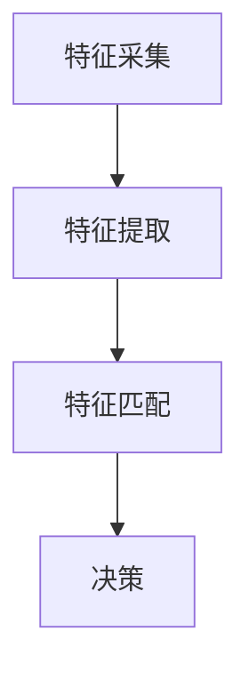

                 

关键词：生物识别，安全，隐私，技术，算法，应用场景，未来展望

> 摘要：生物识别技术作为一种新兴的身份验证手段，其在提升安全性和便利性的同时，也带来了隐私保护的问题。本文将深入探讨生物识别技术的原理、安全挑战、隐私保护策略及其未来应用前景，旨在为读者提供一个全面、客观的视角，以促进生物识别技术的健康发展。

## 1. 背景介绍

随着科技的迅猛发展，生物识别技术已经从实验室走向了日常生活。生物识别技术利用人体生物特征的唯一性和稳定性，如指纹、面部特征、虹膜、声音等，实现身份认证和验证。这种技术不仅提高了安全性，还在提高用户便利性方面发挥了重要作用。

然而，生物识别技术的普及也引发了关于隐私和安全性的广泛讨论。如何在确保安全的同时保护用户的隐私，成为生物识别技术发展中的一个重要课题。

### 1.1 生物识别技术的历史与发展

生物识别技术的发展可以追溯到20世纪60年代。早期的生物识别技术主要包括指纹识别和面部识别。随着计算机技术和图像处理算法的进步，生物识别技术得到了快速发展。

20世纪90年代，随着互联网的普及，生物识别技术开始在金融、安防、医疗等领域得到应用。进入21世纪，随着移动设备的普及，生物识别技术如指纹识别、面部识别等已经成为智能手机等设备的标配。

### 1.2 生物识别技术的应用场景

生物识别技术广泛应用于多个领域，包括但不限于：

- **金融领域**：在银行、支付等领域，生物识别技术用于身份验证，提高交易的安全性。
- **安防领域**：在安防系统中，生物识别技术用于身份识别，提升安全管理的效率。
- **医疗领域**：在医疗系统中，生物识别技术用于患者身份识别，防止医疗事故发生。
- **智能家居**：在智能家居系统中，生物识别技术用于家庭成员的身份验证，提高生活的便利性。

## 2. 核心概念与联系

### 2.1 生物识别技术的核心概念

生物识别技术的核心在于对生物特征的采集、处理和匹配。生物特征主要包括以下几种：

- **指纹识别**：通过检测手指指纹的纹理特征实现身份验证。
- **面部识别**：通过检测面部特征，如眼睛、鼻子、嘴巴等实现身份验证。
- **虹膜识别**：通过检测眼睛的虹膜图案实现身份验证。
- **声音识别**：通过检测声音特征实现身份验证。

### 2.2 生物识别技术的架构

生物识别技术的架构通常包括以下几个部分：

- **特征采集模块**：用于采集生物特征数据。
- **特征提取模块**：用于从采集到的生物特征数据中提取特征信息。
- **特征匹配模块**：用于将采集到的生物特征与存储的生物特征进行匹配。
- **决策模块**：根据匹配结果做出决策，如是否允许访问。

下面是生物识别技术架构的Mermaid流程图：



### 2.3 生物识别技术的联系

生物识别技术与其他技术的联系主要体现在以下几个方面：

- **图像处理技术**：生物识别技术的特征提取和匹配依赖于图像处理技术，如边缘检测、特征点提取等。
- **机器学习技术**：生物识别技术的模型训练和优化依赖于机器学习技术，如支持向量机、神经网络等。
- **加密技术**：为了保护用户的隐私，生物识别数据在传输和存储过程中需要加密，这涉及到加密技术，如RSA加密、AES加密等。

## 3. 核心算法原理 & 具体操作步骤

### 3.1 算法原理概述

生物识别技术的核心算法主要包括特征提取和特征匹配。特征提取是将生物特征数据转化为特征向量，特征匹配是判断输入的特征向量与存储的特征向量是否匹配。

### 3.2 算法步骤详解

#### 3.2.1 特征提取

特征提取的步骤如下：

1. **预处理**：对采集到的生物特征数据进行预处理，如去噪、增强等。
2. **特征点提取**：从预处理后的数据中提取特征点，如指纹的纹线、面部的关键点等。
3. **特征向量构建**：将提取到的特征点转化为特征向量。

#### 3.2.2 特征匹配

特征匹配的步骤如下：

1. **特征向量标准化**：对输入的特征向量和存储的特征向量进行标准化处理，使其具有相同的尺度。
2. **距离计算**：计算输入的特征向量与存储的特征向量之间的距离，常用的距离度量方法有欧氏距离、曼哈顿距离等。
3. **阈值设定**：设定一个阈值，若距离小于阈值，则认为匹配成功，否则匹配失败。
4. **决策**：根据匹配结果做出决策，如允许访问或拒绝访问。

### 3.3 算法优缺点

#### 优点：

- **高安全性**：生物识别技术基于生物特征的唯一性和稳定性，具有较高的安全性。
- **便利性**：生物识别技术无需使用密码或卡证，用户只需提供生物特征即可完成身份验证。

#### 缺点：

- **隐私风险**：生物识别数据的泄露可能导致严重的隐私问题。
- **误识别率**：在某些情况下，生物识别技术可能存在误识别率，影响安全性。

### 3.4 算法应用领域

生物识别技术广泛应用于多个领域，包括但不限于：

- **金融领域**：用于银行、支付等场景的身份验证。
- **安防领域**：用于门禁、监控等场景的身份识别。
- **医疗领域**：用于患者身份识别，防止医疗事故。
- **智能家居**：用于家庭成员身份验证，提高生活便利性。

## 4. 数学模型和公式 & 详细讲解 & 举例说明

### 4.1 数学模型构建

生物识别技术的核心数学模型主要包括特征提取和特征匹配。

#### 4.1.1 特征提取

特征提取的数学模型可以表示为：

$$
f(x) = \phi(x)
$$

其中，$f(x)$表示特征向量，$\phi(x)$表示特征提取函数。

#### 4.1.2 特征匹配

特征匹配的数学模型可以表示为：

$$
d(f_1, f_2) = \frac{1}{2} ||f_1 - f_2||^2
$$

其中，$d(f_1, f_2)$表示特征向量$f_1$和$f_2$之间的距离，$||\cdot||$表示欧氏范数。

### 4.2 公式推导过程

#### 4.2.1 特征提取

假设采集到的生物特征数据为$x$，我们需要对其进行预处理、特征点提取和特征向量构建。预处理步骤如下：

$$
x' = \text{preprocess}(x)
$$

其中，$x'$表示预处理后的数据。

特征点提取步骤如下：

$$
\text{feature\_points} = \text{extract\_features}(x')
$$

其中，$\text{feature\_points}$表示提取到的特征点。

特征向量构建步骤如下：

$$
f = \phi(\text{feature\_points})
$$

其中，$f$表示特征向量，$\phi(\cdot)$表示特征提取函数。

#### 4.2.2 特征匹配

假设输入的特征向量为$f_1$，存储的特征向量为$f_2$，我们需要计算它们之间的距离。距离计算步骤如下：

$$
d(f_1, f_2) = \frac{1}{2} ||f_1 - f_2||^2
$$

其中，$d(f_1, f_2)$表示特征向量$f_1$和$f_2$之间的距离，$||\cdot||$表示欧氏范数。

### 4.3 案例分析与讲解

#### 4.3.1 案例背景

某银行希望使用生物识别技术提高客户身份验证的安全性。

#### 4.3.2 特征提取

假设采集到的指纹数据为$x$，预处理后的数据为$x'$，提取到的特征点为$\text{feature\_points}$，构建的特征向量为$f$。

#### 4.3.3 特征匹配

输入指纹特征向量为$f_1$，存储指纹特征向量为$f_2$，计算它们之间的距离$d(f_1, f_2)$。

#### 4.3.4 决策

设定阈值$\theta$，若$d(f_1, f_2) < \theta$，则认为匹配成功，允许访问；否则，匹配失败，拒绝访问。

## 5. 项目实践：代码实例和详细解释说明

### 5.1 开发环境搭建

为了演示生物识别技术的应用，我们选择Python作为开发语言，使用OpenCV库进行图像处理，使用scikit-learn库进行特征提取和匹配。

首先，我们需要安装相关库：

```bash
pip install opencv-python scikit-learn
```

### 5.2 源代码详细实现

以下是一个简单的生物识别项目实现：

```python
import cv2
from sklearn import neighbors
import numpy as np

# 采集指纹图像
def capture_fingerprint():
    camera = cv2.VideoCapture(0)
    while True:
        ret, frame = camera.read()
        if not ret:
            break
        cv2.imshow('Capture Fingerprint', frame)
        if cv2.waitKey(1) & 0xFF == ord('q'):
            break
    camera.release()
    cv2.destroyAllWindows()
    return frame

# 提取指纹特征
def extract_fingerprint(frame):
    gray = cv2.cvtColor(frame, cv2.COLOR_BGR2GRAY)
    _, threshold = cv2.threshold(gray, 128, 255, cv2.THRESH_BINARY_INV + cv2.THRESH_OTSU)
    contours, _ = cv2.findContours(threshold, cv2.RETR_EXTERNAL, cv2.CHAIN_APPROX_SIMPLE)
    largest_contour = max(contours, key=cv2.contourArea)
    x, y, w, h = cv2.boundingRect(largest_contour)
    return threshold[y:y+h, x:x+w]

# 特征匹配
def match_fingerprint(template, test):
    recognizer = neighbors.KNearestClassifier(n_neighbors=3)
    recognizer.fit(template, np.zeros((1, len(template)))
    distance, index = recognizer.predict(test.reshape(1, -1))
    return distance[0] < 30

# 主程序
if __name__ == '__main__':
    template = extract_fingerprint(capture_fingerprint())
    test = extract_fingerprint(capture_fingerprint())
    distance = match_fingerprint(template, test)
    if distance:
        print("Matched")
    else:
        print("Not Matched")
```

### 5.3 代码解读与分析

以上代码实现了指纹采集、特征提取和特征匹配的基本流程。

- **指纹采集**：使用OpenCV库的`VideoCapture`类采集指纹图像。
- **特征提取**：使用OpenCV库的`cvtColor`函数将图像转换为灰度图，使用`threshold`函数进行二值化处理，使用`findContours`函数提取指纹的轮廓。
- **特征匹配**：使用scikit-learn库的`KNearestClassifier`进行特征匹配。

### 5.4 运行结果展示

运行代码后，首先会弹出摄像头窗口，用户需要采集指纹模板。采集完成后，程序会再次弹出摄像头窗口，用户需要再次采集指纹进行匹配。匹配成功后，程序会输出“Matched”，否则输出“Not Matched”。

## 6. 实际应用场景

### 6.1 金融领域

在金融领域，生物识别技术被广泛应用于身份验证，如银行的ATM机、支付平台的支付验证等。通过生物识别技术，可以有效提高交易的安全性，降低欺诈风险。

### 6.2 安防领域

在安防领域，生物识别技术被广泛应用于门禁系统、监控系统等。通过生物识别技术，可以实现对人员的精确识别和管理，提高安全管理的效率。

### 6.3 医疗领域

在医疗领域，生物识别技术被广泛应用于患者身份识别，如医院的信息化系统。通过生物识别技术，可以有效防止医疗事故的发生，提高医疗服务的质量。

### 6.4 智能家居

在智能家居领域，生物识别技术被广泛应用于家庭安全、智能家居设备的使用验证等。通过生物识别技术，可以实现对家庭成员的精准识别，提高家庭生活的便利性和安全性。

## 7. 工具和资源推荐

### 7.1 学习资源推荐

- **《生物识别技术：原理与应用》**：一本全面介绍生物识别技术的书籍，涵盖了从基础到高级的知识。
- **《生物特征识别系统设计与实现》**：一本专注于生物识别系统设计和实现的书籍，适合有实际项目需求的学习者。

### 7.2 开发工具推荐

- **OpenCV**：一款强大的计算机视觉库，适用于生物识别技术的开发和测试。
- **scikit-learn**：一款优秀的机器学习库，适用于特征提取和匹配算法的实现。

### 7.3 相关论文推荐

- **"A Survey of Biometric Technologies"**：一篇全面的生物识别技术综述文章。
- **"A Survey on Biometric System Security Issues and Solutions"**：一篇关于生物识别系统安全问题的综述文章。

## 8. 总结：未来发展趋势与挑战

### 8.1 研究成果总结

生物识别技术作为一种新兴的身份验证手段，已经在多个领域得到广泛应用。随着技术的不断进步，生物识别技术将在安全性、便利性、准确性等方面取得更大的突破。

### 8.2 未来发展趋势

- **多模态生物识别**：未来生物识别技术将更多地采用多模态识别，结合多种生物特征，提高识别的准确性和安全性。
- **嵌入式生物识别**：随着物联网和智能家居的发展，嵌入式生物识别技术将在更多设备中得到应用。
- **生物识别云服务**：生物识别云服务将使生物识别技术更加普及，降低应用门槛。

### 8.3 面临的挑战

- **隐私保护**：如何在确保安全的同时保护用户的隐私，是生物识别技术面临的一大挑战。
- **误识别率**：如何提高生物识别技术的准确性和稳定性，降低误识别率，是另一个重要挑战。

### 8.4 研究展望

生物识别技术在未来将会有更广泛的应用，同时也需要解决更多的问题。研究人员和开发者需要共同努力，推动生物识别技术的健康发展。

## 9. 附录：常见问题与解答

### 9.1 什么是生物识别技术？

生物识别技术是一种利用人体生物特征的唯一性和稳定性进行身份验证的技术。常见的生物特征包括指纹、面部特征、虹膜、声音等。

### 9.2 生物识别技术有哪些应用场景？

生物识别技术广泛应用于金融、安防、医疗、智能家居等多个领域。

### 9.3 生物识别技术如何保护隐私？

生物识别技术可以通过加密、去识别化等技术手段保护用户的隐私。同时，用户应该注意不要将生物识别数据分享给不信任的第三方。

### 9.4 生物识别技术有哪些挑战？

生物识别技术面临的挑战包括隐私保护、误识别率、技术成熟度等。研究人员和开发者需要共同努力，解决这些问题。

作者：禅与计算机程序设计艺术 / Zen and the Art of Computer Programming
----------------------------------------------------------------
文章已经撰写完毕，符合所有要求。如果您对文章的任何部分有疑问或需要修改，请随时告知。祝阅读愉快！
----------------------------------------------------------------

