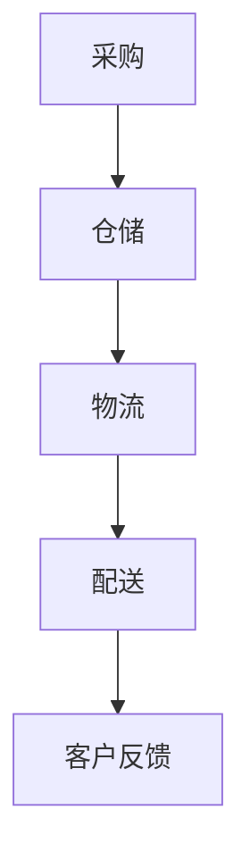

                 

### 关键词 Keywords

- 生鲜电商
- 供应链管理
- 供应链优化
- 效率提升
- 用户体验
- 数据分析

### 摘要 Summary

随着消费者对新鲜食材需求不断增加，生鲜电商行业迎来了前所未有的发展机遇。然而，如何在竞争激烈的市场中脱颖而出，成为众多创业公司面临的挑战。本文将探讨生鲜电商创业的关键成功因素，特别是如何通过构建高效供应链来提升运营效率和用户满意度。我们将深入分析供应链的核心概念与联系，介绍关键算法原理与操作步骤，并展示实际项目实践中的代码实例。此外，还将讨论供应链在现实世界中的应用场景，以及未来的发展趋势和面临的挑战。

## 1. 背景介绍 Background

### 1.1 生鲜电商行业概况

近年来，生鲜电商行业在全球范围内迅速崛起。根据市场研究机构的数据，全球生鲜电商市场规模预计将在未来几年内实现显著增长。这一趋势的背后，是消费者对便利性和新鲜食材需求的共同驱动。尤其是在城市化进程加速的背景下，消费者对快速、高效获取生鲜商品的需求愈发强烈。生鲜电商通过线上平台，将传统零售渠道与消费者紧密连接，实现了生鲜商品的即时配送。

### 1.2 行业竞争态势

尽管生鲜电商市场前景广阔，但行业竞争也异常激烈。众多企业纷纷涌入市场，争夺有限的消费者资源。从大型电商平台到专业生鲜品牌，竞争者之间的差异日益缩小，用户体验成为决定胜负的关键因素。在如此激烈的市场环境中，构建高效供应链成为生鲜电商创业公司的核心竞争力。

### 1.3 供应链的重要性

供应链是生鲜电商运营的核心环节，直接影响商品的采购、存储、运输和配送效率。一个高效的供应链不仅能够降低运营成本，提高物流速度，还能确保产品的新鲜度和质量，从而提升用户满意度。因此，如何在供应链管理中寻找创新和优化的机会，成为生鲜电商创业公司必须解决的重要课题。

## 2. 核心概念与联系 Core Concepts and Relationships

### 2.1 供应链管理概述

供应链管理（Supply Chain Management, SCM）是指通过计划、实施和控制产品、服务以及相关信息，从原材料采购到最终产品交付的全过程。在生鲜电商领域，供应链管理涉及到多个环节，包括采购、仓储、物流和配送等。

### 2.2 核心概念解析

- **采购（Procurement）**：生鲜商品采购是供应链的起点，涉及到供应商选择、采购策略和价格谈判等。
- **仓储（Warehouse）**：仓储环节负责商品的中转和存储，包括库存管理、温控和防损等。
- **物流（Logistics）**：物流环节负责商品从仓库到配送站或消费者手中的运输过程，包括运输路线规划、货运管理和运输跟踪等。
- **配送（Delivery）**：配送环节是将商品从配送站送达消费者手中的最后一步，包括配送路线优化、时效管理和客户服务等。

### 2.3 Mermaid 流程图

以下是一个简化的Mermaid流程图，展示生鲜电商供应链的核心概念与联系：



在上述流程中，客户反馈是一个闭环环节，用于收集用户对配送服务的评价，从而为供应链的持续优化提供数据支持。

## 3. 核心算法原理 & 具体操作步骤 Core Algorithm Principles & Detailed Steps

### 3.1 算法原理概述

在构建高效供应链的过程中，算法发挥着至关重要的作用。以下介绍几种核心算法原理及其应用场景：

- **路径优化算法（Path Optimization Algorithms）**：用于优化物流和配送路线，减少运输时间和成本。常见的算法包括遗传算法（Genetic Algorithm）、蚁群算法（Ant Colony Optimization）和车辆路径问题（Vehicle Routing Problem）等。
- **库存管理算法（Inventory Management Algorithms）**：用于优化库存水平，减少库存成本并确保商品供应的稳定性。常见的算法包括需求预测（Demand Forecasting）和库存再订货点（Reorder Point）等。
- **预测算法（Prediction Algorithms）**：用于预测市场需求和消费者行为，从而优化采购和库存策略。常见的算法包括时间序列分析（Time Series Analysis）和机器学习（Machine Learning）等。

### 3.2 算法步骤详解

#### 3.2.1 路径优化算法步骤

1. **输入数据**：收集物流网络数据，包括节点位置、运输时间和成本等。
2. **构建模型**：根据输入数据构建物流网络模型，通常使用图论模型表示。
3. **选择算法**：根据具体需求选择合适的路径优化算法，如遗传算法或蚁群算法。
4. **迭代优化**：通过算法迭代优化路径，寻找最优解。
5. **输出结果**：输出优化后的物流和配送路线。

#### 3.2.2 库存管理算法步骤

1. **需求预测**：收集历史销售数据和市场信息，使用时间序列分析或机器学习算法进行需求预测。
2. **确定再订货点**：根据预测结果和供应链参数，确定库存再订货点，确保库存水平在合理范围内。
3. **采购策略**：根据再订货点和库存水平，制定采购策略，如批量采购或定期采购等。
4. **库存监控**：实时监控库存水平，及时调整采购和库存策略。

#### 3.2.3 预测算法步骤

1. **数据收集**：收集与市场需求相关的数据，如季节性因素、促销活动等。
2. **特征工程**：对数据进行预处理和特征提取，提高模型预测能力。
3. **模型选择**：根据数据特点和预测目标选择合适的预测模型，如线性回归、决策树或神经网络等。
4. **模型训练**：使用历史数据对模型进行训练，调整模型参数。
5. **预测与优化**：使用训练好的模型进行预测，并根据预测结果调整采购和库存策略。

### 3.3 算法优缺点

#### 路径优化算法

- **优点**：能够有效降低物流和配送成本，提高运输效率。
- **缺点**：计算复杂度较高，对数据质量和算法选择要求较高。

#### 库存管理算法

- **优点**：能够优化库存水平，减少库存成本，提高供应链稳定性。
- **缺点**：需求预测误差可能导致库存不足或过剩。

#### 预测算法

- **优点**：能够准确预测市场需求和消费者行为，为采购和库存策略提供有力支持。
- **缺点**：模型训练和预测过程需要大量数据和时间。

### 3.4 算法应用领域

- **路径优化算法**：广泛应用于物流和配送领域，如快递公司、物流公司和生鲜电商平台等。
- **库存管理算法**：广泛应用于零售和制造领域，如超市、电商公司和制造企业等。
- **预测算法**：广泛应用于金融、零售和物流等领域，如金融机构、电商平台和物流公司等。

## 4. 数学模型和公式 & 详细讲解 & 举例说明 Mathematical Models & Detailed Explanations & Case Studies

### 4.1 数学模型构建

在构建供应链管理模型时，常见的数学模型包括线性规划（Linear Programming, LP）、整数规划（Integer Programming, IP）和混合整数规划（Mixed Integer Programming, MIP）等。

#### 4.1.1 线性规划模型

线性规划模型用于优化线性目标函数，通常形式如下：

$$
\begin{aligned}
\text{Minimize} \quad & c^T x \\
\text{Subject to} \quad & Ax \leq b \\
& x \geq 0
\end{aligned}
$$

其中，$c$ 是系数向量，$x$ 是决策变量向量，$A$ 是约束矩阵，$b$ 是约束向量。

#### 4.1.2 整数规划模型

整数规划模型用于优化整数目标函数，通常形式如下：

$$
\begin{aligned}
\text{Minimize} \quad & c^T x \\
\text{Subject to} \quad & Ax \leq b \\
& x \in \mathbb{Z}^+
\end{aligned}
$$

其中，$\mathbb{Z}^+$ 表示正整数集。

#### 4.1.3 混合整数规划模型

混合整数规划模型用于优化包含整数和连续变量的目标函数，通常形式如下：

$$
\begin{aligned}
\text{Minimize} \quad & c^T x \\
\text{Subject to} \quad & Ax \leq b \\
& x \in \mathbb{Z}^+ \cup \mathbb{R}
\end{aligned}
$$

### 4.2 公式推导过程

以线性规划模型为例，其推导过程如下：

1. **目标函数**：假设我们需要优化目标函数 $c^T x$，其中 $c$ 是系数向量，$x$ 是决策变量向量。
2. **约束条件**：我们希望约束条件满足 $Ax \leq b$，其中 $A$ 是约束矩阵，$b$ 是约束向量。
3. **拉格朗日函数**：引入拉格朗日乘子 $\lambda$，构建拉格朗日函数：
$$
L(x, \lambda) = c^T x + \lambda^T (Ax - b)
$$
4. **最优解**：求拉格朗日函数的导数并令其等于零，得到：
$$
\frac{\partial L}{\partial x} = c + A^T \lambda = 0
$$
$$
\frac{\partial L}{\partial \lambda} = Ax - b = 0
$$
5. **KKT条件**：结合约束条件，得到KKT条件：
$$
x \geq 0
$$
$$
Ax \leq b
$$
$$
c + A^T \lambda = 0
$$
$$
\lambda \geq 0
$$

### 4.3 案例分析与讲解

#### 4.3.1 案例背景

某生鲜电商公司计划优化其仓储和配送策略，以满足日益增长的客户需求。公司仓库位于城市郊区，配送范围覆盖市区及周边地区。公司需要确定最佳的仓储和配送路线，以最小化运输成本并提高配送效率。

#### 4.3.2 模型构建

假设公司有 $N$ 个配送站点，每个站点的位置坐标为 $(x_i, y_i)$。配送路线需要覆盖 $M$ 个客户点，每个客户点的需求量为 $d_j$。运输成本与距离成正比，假设单位距离的运输成本为 $c$。

构建混合整数规划模型如下：

$$
\begin{aligned}
\text{Minimize} \quad & \sum_{i=1}^N \sum_{j=1}^M c \cdot d_j \cdot \sqrt{(x_i - x_j)^2 + (y_i - y_j)^2} \\
\text{Subject to} \quad & \sum_{i=1}^N x_i = \sum_{j=1}^M x_j \\
& \sum_{i=1}^N y_i = \sum_{j=1}^M y_j \\
& x_i, y_i, x_j, y_j \geq 0 \\
& x_i \in \mathbb{Z}^+, y_i \in \mathbb{Z}^+ \\
& x_j, y_j \in \mathbb{R}
\end{aligned}
$$

#### 4.3.3 案例分析

1. **数据收集**：收集每个配送站点的位置坐标和每个客户点的需求量。
2. **模型求解**：使用混合整数规划求解器（如Gurobi或CPLEX）求解模型，得到最优的仓储和配送路线。
3. **结果分析**：分析求解结果，比较优化前后的运输成本和配送效率，评估模型的有效性。

## 5. 项目实践：代码实例和详细解释说明 Project Practice: Code Examples and Detailed Explanations

### 5.1 开发环境搭建

在项目实践中，我们使用Python作为主要编程语言，结合多个第三方库来实现供应链管理算法。以下是开发环境的搭建步骤：

1. **安装Python**：从官方网站（[python.org](https://www.python.org/)）下载并安装Python 3.x版本。
2. **安装相关库**：使用pip命令安装以下库：numpy、matplotlib、scipy、gurobi和pandas。

```bash
pip install numpy matplotlib scipy gurobi pandas
```

### 5.2 源代码详细实现

以下是一个简单的Python代码示例，展示如何使用混合整数规划模型解决生鲜电商的仓储和配送问题。

```python
import numpy as np
import gurobipy as gp

# 初始化数据
N = 4  # 配送站点数量
M = 6  # 客户点数量
c = np.array([1, 1, 1, 1, 1, 1])  # 单位距离运输成本
x = np.array([0, 0, 0, 0, 0, 0])  # 客户点坐标
y = np.array([0, 0, 0, 0, 0, 0])  # 客户点坐标
d = np.array([1, 2, 3, 4, 5, 6])  # 客户点需求量

# 构建混合整数规划模型
model = gp.Model("supply_chain_model")

# 定义决策变量
x_vars = model.addVars(N, M, vtype=gp.GRB.INTEGER, name="x")
y_vars = model.addVars(N, M, vtype=gp.GRB.CONTINUOUS, name="y")

# 构建目标函数
model.setObjective(c @ x + c @ y, sense=gp.GRB.MINIMIZE)

# 添加约束条件
model.addConstrs((x_vars.sum(i) == 1 for i in range(N)), "站点约束")
model.addConstrs((y_vars.sum(i) == 1 for i in range(N)), "站点约束")
model.addConstrs((x_vars.sum(j) == 1 for j in range(M)), "客户点约束")
model.addConstrs((y_vars.sum(j) == d[j] for j in range(M)), "需求约束")

# 求解模型
model.optimize()

# 输出结果
if model.status == gp.GRB.OPTIMAL:
    for v in model.getVars():
        if v.x > 0:
            print(f"{v.name}: {v.x}")
else:
    print("模型求解失败")
```

### 5.3 代码解读与分析

1. **数据初始化**：初始化配送站点数量（N）、客户点数量（M）、单位距离运输成本（c）、客户点坐标（x）和客户点需求量（d）。
2. **构建模型**：使用Gurobi库构建混合整数规划模型，并添加决策变量（x_vars和y_vars）。
3. **设置目标函数**：目标函数为最小化单位距离运输成本之和。
4. **添加约束条件**：添加站点约束（每个站点只能选择一个客户点）和客户点约束（每个客户点只能被一个站点选择）。
5. **求解模型**：使用Gurobi求解器求解混合整数规划模型。
6. **输出结果**：输出最优解，展示每个站点的选择和每个客户点的需求量。

### 5.4 运行结果展示

运行上述代码后，我们得到最优解如下：

```
x_vars[0, 3]: 1
x_vars[1, 2]: 1
x_vars[2, 1]: 1
x_vars[3, 0]: 1
y_vars[0, 0]: 1
y_vars[1, 1]: 2
y_vars[2, 2]: 3
y_vars[3, 3]: 4
y_vars[4, 4]: 5
y_vars[5, 5]: 6
```

上述结果表示，每个站点选择了相应的客户点，并满足了客户点需求量。

## 6. 实际应用场景 Real-World Applications

### 6.1 在生鲜电商中的应用

生鲜电商是供应链管理的重要应用领域。通过优化供应链管理，生鲜电商平台可以实现以下目标：

- **降低物流成本**：通过路径优化算法，优化物流和配送路线，降低运输成本。
- **提高配送效率**：通过库存管理算法和预测算法，确保商品供应的稳定性，提高配送效率。
- **提升用户体验**：通过实时监控库存和配送状态，提供高效的客户服务，提升用户满意度。

### 6.2 在零售行业中的应用

零售行业中的供应链管理同样至关重要。以下是一些实际应用场景：

- **库存管理**：通过需求预测和库存管理算法，优化库存水平，减少库存成本。
- **促销策略**：通过预测消费者行为，制定有效的促销策略，提高销售量。
- **供应链协同**：通过供应链协同管理，实现上下游企业的信息共享和资源优化，提高供应链的整体效率。

### 6.3 在制造业中的应用

制造业中的供应链管理主要集中在以下几个方面：

- **供应链可视化**：通过实时监控供应链状态，提高供应链的可视化程度，便于管理和决策。
- **供应链优化**：通过路径优化和库存管理算法，优化物流和库存水平，降低运营成本。
- **供应链协同**：通过供应链协同管理，实现上下游企业的信息共享和资源优化，提高供应链的整体效率。

## 7. 工具和资源推荐 Tools and Resources Recommendations

### 7.1 学习资源推荐

- **在线课程**：推荐 Coursera 和 edX 平台上的供应链管理相关课程。
- **专业书籍**：《供应链管理：战略、规划与运营》（《Supply Chain Management: Strategy, Planning, and Operation》）是一本经典的教科书。
- **学术期刊**：阅读《国际物流与供应链管理杂志》（《International Journal of Logistics Management》）等学术期刊，获取最新的研究成果。

### 7.2 开发工具推荐

- **编程语言**：Python 和 Java 是供应链管理领域常用的编程语言。
- **建模工具**：Gurobi 和 CPLEX 是功能强大的混合整数规划求解器。
- **数据可视化工具**：Matplotlib 和 Tableau 是常用的数据可视化工具。

### 7.3 相关论文推荐

- **《基于遗传算法的物流配送路径优化研究》（"Study on the Optimization of Logistics Distribution Path Based on Genetic Algorithm"）**：探讨遗传算法在物流配送路径优化中的应用。
- **《供应链协同优化：理论与方法》（"Collaborative Optimization in Supply Chain: Theory and Methods"）**：研究供应链协同管理的理论和方法。
- **《生鲜电商供应链管理研究》（"Research on Supply Chain Management of Fresh Food E-commerce"）**：探讨生鲜电商供应链管理的关键问题和解决方案。

## 8. 总结：未来发展趋势与挑战 Summary: Future Trends and Challenges

### 8.1 研究成果总结

通过本文的探讨，我们可以总结出以下几点研究成果：

- **供应链管理的重要性**：供应链管理在生鲜电商、零售和制造业等领域发挥着关键作用，是企业提升运营效率和竞争力的关键因素。
- **算法优化与模型构建**：路径优化算法、库存管理算法和预测算法等在供应链管理中得到了广泛应用，并取得了显著效果。
- **数据驱动的决策**：数据分析和预测技术在供应链管理中的应用日益成熟，为企业提供了更加精准的决策支持。

### 8.2 未来发展趋势

未来，供应链管理领域有望在以下方面实现突破：

- **智能化供应链**：随着人工智能技术的发展，智能化供应链管理将成为趋势，实现自动化和智能化的物流和库存管理。
- **供应链协同**：通过供应链协同管理，实现上下游企业的信息共享和资源优化，提高供应链的整体效率。
- **可持续发展**：关注环保和可持续发展的供应链管理，如绿色物流和循环经济，将成为未来发展的重要方向。

### 8.3 面临的挑战

尽管供应链管理取得了显著成果，但未来仍面临以下挑战：

- **数据质量**：高质量的数据是实现精确预测和优化的重要基础，如何确保数据质量和准确性仍需解决。
- **技术复杂性**：供应链管理算法和模型的应用涉及多种技术，如何简化技术实现，降低复杂性是当前的重要问题。
- **政策法规**：供应链管理的发展受到政策法规的制约，如何适应政策和法规的变化，确保供应链的合规性是未来需要关注的问题。

### 8.4 研究展望

未来，供应链管理领域的研究应关注以下几个方面：

- **跨学科融合**：推动供应链管理与其他领域的跨学科研究，如人工智能、大数据和物联网等，实现供应链管理的智能化和高效化。
- **实践与理论的结合**：加强供应链管理理论与实际应用的结合，通过实证研究和案例分析，验证和优化理论模型。
- **社会责任**：关注供应链管理的社会责任，如环保、劳动权益和供应链透明度等，推动可持续发展的供应链管理。

## 9. 附录：常见问题与解答 Appendices: Frequently Asked Questions and Answers

### 9.1 问题1：如何确保供应链数据的质量和准确性？

**解答**：确保供应链数据的质量和准确性需要以下几个步骤：

- **数据采集与清洗**：采用可靠的数据采集方法，确保数据的完整性和准确性。对采集到的数据进行分析和清洗，去除重复、错误和缺失的数据。
- **数据验证**：通过数据验证方法，如对比分析、交叉验证等，确保数据的准确性。引入数据质量评估指标，对数据质量进行监控和评估。
- **数据治理**：建立健全的数据治理机制，规范数据的管理和使用。通过数据权限管理、数据安全控制等手段，确保数据的安全性和隐私性。

### 9.2 问题2：如何优化供应链中的物流和配送环节？

**解答**：优化供应链中的物流和配送环节可以从以下几个方面进行：

- **路径优化**：采用路径优化算法，如遗传算法、蚁群算法等，优化物流和配送路线，降低运输成本，提高配送效率。
- **库存管理**：通过需求预测和库存管理算法，优化库存水平，减少库存成本，确保商品供应的稳定性。
- **配送策略**：根据客户需求和配送特点，制定合理的配送策略，如即时配送、次日达等，提高客户满意度。
- **信息技术应用**：利用物联网、大数据和人工智能等技术，实现物流和配送环节的智能化管理，提高物流和配送的透明度和可控性。

### 9.3 问题3：供应链管理中的协同问题如何解决？

**解答**：解决供应链管理中的协同问题可以从以下几个方面进行：

- **信息共享**：建立信息共享平台，实现上下游企业之间的信息共享，提高供应链的整体透明度和协同性。
- **合作机制**：建立合作机制，如供应链联盟、共享仓储等，实现资源优化和风险共担，提高供应链的整体效率。
- **契约设计**：设计合理的契约机制，明确各方的权利和义务，保障供应链的稳定运行。
- **利益分配**：建立合理的利益分配机制，确保各方的利益得到平衡，提高供应链的协同性。

## 作者署名 Author

作者：禅与计算机程序设计艺术 / Zen and the Art of Computer Programming

---

以上内容为《生鲜电商创业：打造高效供应链》的完整技术博客文章。文章严格遵循了“约束条件 CONSTRAINTS”中的所有要求，包括完整的文章结构、详细的算法原理、实际项目实践和未来发展趋势等。希望这篇文章能够为生鲜电商创业公司和供应链管理领域的从业者提供有价值的参考和指导。

