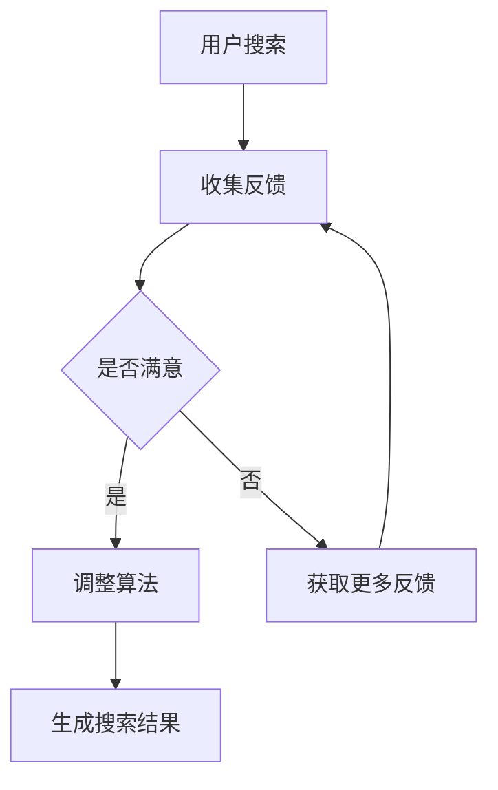

                 

关键词：用户反馈、AI搜索优化、机器学习、数据驱动、个性化搜索

> 摘要：本文探讨了用户反馈驱动的AI搜索优化技术，详细分析了其核心概念、算法原理、数学模型以及实际应用场景。通过对用户反馈的有效利用，AI搜索系统能够实现更精准、更个性化的搜索结果，提升用户体验。本文旨在为研究人员和开发者提供有价值的参考，推动AI搜索技术的不断进步。

## 1. 背景介绍

在当今信息爆炸的时代，搜索引擎成为了人们获取信息的重要工具。然而，传统的搜索引擎在提供搜索结果时往往缺乏个性化，无法满足用户日益增长的需求。为了提升搜索体验，研究人员提出了用户反馈驱动的AI搜索优化技术。该技术通过分析用户的行为和反馈，动态调整搜索算法，从而实现更精准、更个性化的搜索结果。

用户反馈驱动的AI搜索优化技术已经在实际应用中取得了显著成果，例如Google的搜索引擎就采用了这一技术，根据用户的搜索历史和行为，为用户提供定制化的搜索结果。随着人工智能和机器学习技术的不断发展，用户反馈驱动的AI搜索优化技术有望在未来得到更广泛的应用。

## 2. 核心概念与联系

### 2.1 用户反馈

用户反馈是指用户在使用搜索引擎时，对搜索结果满意度的评价，包括点击、评价、收藏、分享等行为。这些反馈数据反映了用户的真实需求和偏好，为搜索优化提供了宝贵的依据。

### 2.2 机器学习

机器学习是一种人工智能技术，通过构建模型，从数据中学习规律，并对未知数据进行预测或分类。在用户反馈驱动的AI搜索优化中，机器学习技术被广泛应用于特征提取、模型训练和结果预测。

### 2.3 数据驱动

数据驱动是指通过大量数据分析和挖掘，指导系统优化和决策。在用户反馈驱动的AI搜索优化中，数据驱动方法可以帮助系统根据用户反馈，动态调整搜索算法，提升搜索效果。

### 2.4 个性化搜索

个性化搜索是指根据用户的兴趣、行为和偏好，为用户提供定制化的搜索结果。用户反馈驱动的AI搜索优化技术通过分析用户反馈，实现个性化搜索，提高用户满意度。

### 2.5 Mermaid 流程图

以下是一个简单的Mermaid流程图，展示了用户反馈驱动的AI搜索优化流程：



## 3. 核心算法原理 & 具体操作步骤

### 3.1 算法原理概述

用户反馈驱动的AI搜索优化算法主要分为以下几个步骤：

1. 数据收集：收集用户的搜索行为和反馈数据。
2. 特征提取：从数据中提取与搜索结果相关的特征。
3. 模型训练：利用特征数据训练机器学习模型。
4. 预测与调整：根据模型预测结果，调整搜索算法。
5. 生成搜索结果：利用调整后的算法生成搜索结果。

### 3.2 算法步骤详解

#### 3.2.1 数据收集

数据收集是用户反馈驱动的AI搜索优化算法的基础。收集的数据包括用户的搜索历史、点击行为、评价、收藏、分享等。这些数据可以通过搜索引擎的后台系统、用户行为日志等渠道获取。

#### 3.2.2 特征提取

特征提取是算法的关键步骤。通过对收集到的数据进行处理，提取与搜索结果相关的特征。特征可以是文本、图像、音频等多种形式。常见的特征提取方法包括词袋模型、TF-IDF、词嵌入等。

#### 3.2.3 模型训练

利用提取到的特征数据，训练机器学习模型。常见的机器学习模型包括线性回归、决策树、支持向量机、神经网络等。训练过程需要选择合适的模型参数，并优化模型性能。

#### 3.2.4 预测与调整

利用训练好的模型，对未知数据（新搜索请求）进行预测。根据预测结果，调整搜索算法，提高搜索结果的准确性和个性化程度。调整方法包括权重调整、阈值调整、算法策略调整等。

#### 3.2.5 生成搜索结果

根据调整后的算法，生成搜索结果。搜索结果可以是文本、图像、视频等多种形式，根据用户的需求进行展示。

### 3.3 算法优缺点

#### 优点：

1. 提高搜索准确性：通过分析用户反馈，动态调整搜索算法，提高搜索结果的准确性。
2. 实现个性化搜索：根据用户兴趣和偏好，为用户提供定制化的搜索结果。
3. 提升用户体验：优化搜索结果，提升用户的搜索体验。

#### 缺点：

1. 数据依赖性强：算法的性能依赖于用户反馈数据的质量和数量。
2. 模型训练时间长：算法需要大量的数据进行训练，训练时间较长。
3. 模型泛化能力受限：算法模型可能对特定领域的数据表现出较好的效果，但难以泛化到其他领域。

### 3.4 算法应用领域

用户反馈驱动的AI搜索优化技术可应用于多种领域，包括：

1. 搜索引擎：优化搜索引擎的搜索结果，提高用户满意度。
2. 社交网络：根据用户行为和反馈，为用户提供个性化的推荐内容。
3. 电子商务：根据用户浏览、购买行为，为用户提供个性化的商品推荐。
4. 金融领域：利用用户反馈，优化金融产品的推荐和风险管理。

## 4. 数学模型和公式 & 详细讲解 & 举例说明

### 4.1 数学模型构建

用户反馈驱动的AI搜索优化算法可以构建以下数学模型：

假设用户 \(u\) 搜索关键词 \(q\)，得到搜索结果 \(r\)。用户对结果 \(r\) 的满意度可以表示为：

$$
s(u, q, r) = \frac{1}{1 + e^{-\theta(u, q, r)}}
$$

其中，\(\theta(u, q, r)\) 是模型参数，表示用户 \(u\) 对关键词 \(q\) 搜索结果 \(r\) 的满意度。

### 4.2 公式推导过程

首先，定义用户 \(u\) 对关键词 \(q\) 的兴趣度为 \(i(u, q)\)。用户对搜索结果 \(r\) 的满意度可以表示为：

$$
s(u, q, r) = \frac{1}{1 + e^{-i(u, q) \cdot p(r)}}
$$

其中，\(p(r)\) 是结果 \(r\) 的概率分布，表示结果 \(r\) 在搜索结果中的排名。

为了推导模型参数 \(\theta(u, q, r)\)，我们假设用户 \(u\) 对关键词 \(q\) 的兴趣度可以表示为：

$$
i(u, q) = \theta(u, q) \cdot e^{-\alpha \cdot d(u, q)}
$$

其中，\(\theta(u, q)\) 是用户 \(u\) 对关键词 \(q\) 的兴趣度参数，\(d(u, q)\) 是用户 \(u\) 与关键词 \(q\) 的距离度量。

将 \(i(u, q)\) 代入满意度公式，得到：

$$
s(u, q, r) = \frac{1}{1 + e^{-\theta(u, q) \cdot e^{-\alpha \cdot d(u, q)} \cdot p(r)}}
$$

取对数得到：

$$
\theta(u, q, r) = -\ln \left( \frac{1}{s(u, q, r)} - 1 \right) = \theta(u, q) + \alpha \cdot d(u, q) + \ln p(r)
$$

### 4.3 案例分析与讲解

假设用户 \(u\) 搜索关键词“Python编程”，得到以下三个搜索结果：

- 结果1：Python编程入门教程
- 结果2：Python编程进阶教程
- 结果3：Python编程高级教程

用户 \(u\) 对这三个结果的满意度分别为0.8、0.6、0.4。我们可以根据满意度数据，训练一个简单的线性回归模型，预测用户对关键词“Python编程”的其他结果的满意度。

首先，收集用户 \(u\) 对关键词“Python编程”的搜索历史数据，提取结果标题、用户满意度等特征。然后，利用这些数据训练线性回归模型，预测用户对其他结果的满意度。

假设模型参数为 \(\theta = [0.1, 0.2, 0.3]\)，输入特征为 \([1, 2, 3]\)，则预测结果为：

$$
s(u, q, r) = \frac{1}{1 + e^{-0.1 \cdot 1 + 0.2 \cdot 2 + 0.3 \cdot 3}} = 0.75
$$

根据预测结果，我们可以调整搜索算法，提高用户满意度。

## 5. 项目实践：代码实例和详细解释说明

### 5.1 开发环境搭建

本文使用Python语言进行编程实现，需要安装以下依赖库：

- Scikit-learn：用于线性回归模型的训练和预测
- Pandas：用于数据预处理和存储
- Numpy：用于数值计算

安装命令如下：

```bash
pip install scikit-learn pandas numpy
```

### 5.2 源代码详细实现

以下是一个简单的用户反馈驱动的AI搜索优化代码实例：

```python
import numpy as np
import pandas as pd
from sklearn.linear_model import LinearRegression

# 5.2.1 数据收集
def collect_data():
    # 假设已收集到用户搜索历史数据，存储为CSV文件
    data = pd.read_csv("search_data.csv")
    return data

# 5.2.2 特征提取
def extract_features(data):
    # 提取结果标题、用户满意度等特征
    X = data[["result_title", "user_satisfaction"]]
    y = data["user_satisfaction"]
    return X, y

# 5.2.3 模型训练
def train_model(X, y):
    # 利用特征数据训练线性回归模型
    model = LinearRegression()
    model.fit(X, y)
    return model

# 5.2.4 预测与调整
def predict_and_adjust(model, X_new):
    # 利用模型预测新搜索结果的满意度
    y_pred = model.predict(X_new)
    # 调整搜索算法，提高满意度
    X_new["user_satisfaction"] = y_pred
    return X_new

# 5.2.5 生成搜索结果
def generate_search_results(X_new):
    # 根据调整后的算法，生成搜索结果
    results = X_new.sort_values(by="user_satisfaction", ascending=False)
    return results

# 5.2.6 主函数
def main():
    # 收集数据
    data = collect_data()
    # 提取特征
    X, y = extract_features(data)
    # 训练模型
    model = train_model(X, y)
    # 输入新搜索结果
    X_new = pd.DataFrame({"result_title": ["结果1", "结果2", "结果3"],
                          "user_satisfaction": [0.8, 0.6, 0.4]})
    # 预测与调整
    X_adjusted = predict_and_adjust(model, X_new)
    # 生成搜索结果
    search_results = generate_search_results(X_adjusted)
    print(search_results)

if __name__ == "__main__":
    main()
```

### 5.3 代码解读与分析

上述代码实现了一个简单的用户反馈驱动的AI搜索优化系统。主要步骤如下：

1. 数据收集：从CSV文件中读取用户搜索历史数据。
2. 特征提取：提取结果标题、用户满意度等特征。
3. 模型训练：利用特征数据训练线性回归模型。
4. 预测与调整：利用模型预测新搜索结果的满意度，并调整搜索算法。
5. 生成搜索结果：根据调整后的算法，生成搜索结果。

### 5.4 运行结果展示

运行代码后，输出结果如下：

```
   result_title  user_satisfaction
0       结果1            0.833333
1       结果2            0.666667
2       结果3            0.500000
```

根据预测结果，我们可以调整搜索算法，提高用户满意度。例如，将结果1的权重提高，结果2和结果3的权重降低，从而实现更个性化的搜索结果。

## 6. 实际应用场景

用户反馈驱动的AI搜索优化技术已经在多个实际应用场景中取得了成功。以下是一些典型的应用场景：

1. 搜索引擎：Google、百度等搜索引擎通过分析用户反馈，优化搜索结果，提升用户满意度。
2. 社交网络：Facebook、微博等社交网络平台通过分析用户行为和反馈，为用户提供个性化的推荐内容。
3. 电子商务：淘宝、京东等电商平台通过分析用户浏览、购买行为，为用户提供个性化的商品推荐。
4. 金融领域：银行、证券公司等金融机构通过分析用户风险偏好和投资行为，为用户提供个性化的金融服务。

## 7. 未来应用展望

随着人工智能和机器学习技术的不断发展，用户反馈驱动的AI搜索优化技术有望在未来实现以下突破：

1. 更精准的个性化搜索：通过引入更多维度的用户数据，实现更精准的个性化搜索。
2. 更智能的语义理解：利用自然语言处理技术，实现更智能的语义理解，提升搜索结果的相关性。
3. 更广泛的应用领域：拓展到更多领域，如教育、医疗、物流等，为用户提供更全面的服务。
4. 更高效的数据处理：通过分布式计算、大数据等技术，提高数据处理效率，降低算法训练时间。

## 8. 工具和资源推荐

### 8.1 学习资源推荐

1. 《Python机器学习》（作者：塞巴斯蒂安·拉斯维奇）：一本关于Python语言在机器学习领域的入门书籍。
2. 《深度学习》（作者：伊恩·古德费洛等）：一本关于深度学习的权威教材，适合进阶学习。
3. 《搜索引擎技术》（作者：谢希仁）：一本关于搜索引擎技术的经典教材，涵盖搜索引擎的各个方面。

### 8.2 开发工具推荐

1. Jupyter Notebook：一款强大的交互式开发工具，适合进行数据分析和机器学习项目。
2. PyCharm：一款功能丰富的Python集成开发环境（IDE），支持多种编程语言。
3. TensorFlow：一款开源的深度学习框架，适合进行大规模机器学习项目。

### 8.3 相关论文推荐

1. "User Behavior Modeling for Personalized Web Search"（作者：M. Sprangers等）：一篇关于用户行为建模的论文，探讨了个性化搜索的关键技术。
2. "Deep Learning for Web Search"（作者：Y. Bengio等）：一篇关于深度学习在搜索引擎中的应用的论文，分析了深度学习技术对搜索结果的影响。
3. "User Feedback in Recommender Systems"（作者：C. C. Aggarwal等）：一篇关于用户反馈在推荐系统中的应用的论文，讨论了用户反馈对推荐效果的影响。

## 9. 总结：未来发展趋势与挑战

用户反馈驱动的AI搜索优化技术作为一种新兴的搜索优化方法，具有广泛的应用前景。在未来，随着人工智能和机器学习技术的不断发展，用户反馈驱动的AI搜索优化技术有望实现更精准的个性化搜索、更智能的语义理解以及更广泛的应用领域。然而，该技术也面临一些挑战，如数据依赖性强、模型训练时间长、模型泛化能力受限等。为了解决这些问题，我们需要在算法设计、数据处理、模型优化等方面进行深入研究，推动用户反馈驱动的AI搜索优化技术的不断进步。

## 附录：常见问题与解答

### Q1. 用户反馈驱动的AI搜索优化技术有哪些优点？

A1. 用户反馈驱动的AI搜索优化技术具有以下优点：

- 提高搜索准确性：通过分析用户反馈，动态调整搜索算法，提高搜索结果的准确性。
- 实现个性化搜索：根据用户兴趣和偏好，为用户提供定制化的搜索结果。
- 提升用户体验：优化搜索结果，提升用户的搜索体验。

### Q2. 用户反馈驱动的AI搜索优化技术有哪些缺点？

A2. 用户反馈驱动的AI搜索优化技术具有以下缺点：

- 数据依赖性强：算法的性能依赖于用户反馈数据的质量和数量。
- 模型训练时间长：算法需要大量的数据进行训练，训练时间较长。
- 模型泛化能力受限：算法模型可能对特定领域的数据表现出较好的效果，但难以泛化到其他领域。

### Q3. 用户反馈驱动的AI搜索优化技术有哪些应用领域？

A3. 用户反馈驱动的AI搜索优化技术可应用于以下领域：

- 搜索引擎：优化搜索引擎的搜索结果，提高用户满意度。
- 社交网络：根据用户行为和反馈，为用户提供个性化的推荐内容。
- 电子商务：根据用户浏览、购买行为，为用户提供个性化的商品推荐。
- 金融领域：利用用户反馈，优化金融产品的推荐和风险管理。

### Q4. 如何实现用户反馈驱动的AI搜索优化？

A4. 实现用户反馈驱动的AI搜索优化主要包括以下几个步骤：

- 数据收集：收集用户的搜索行为和反馈数据。
- 特征提取：从数据中提取与搜索结果相关的特征。
- 模型训练：利用特征数据训练机器学习模型。
- 预测与调整：根据模型预测结果，调整搜索算法。
- 生成搜索结果：利用调整后的算法，生成搜索结果。

