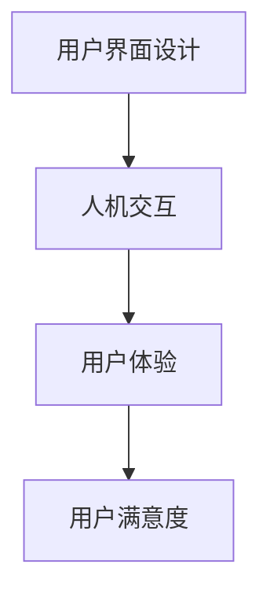

                 

关键词：用户界面设计、人机交互、用户体验、界面构建、设计原则、技术实现

> 摘要：本文将深入探讨用户界面设计这一重要领域，解析其核心概念、设计原则和具体实现方法。通过分析用户需求，结合技术手段，本文旨在帮助设计师和开发人员打造出既美观又实用的用户界面，从而提升用户的使用体验和满意度。

## 1. 背景介绍

用户界面设计（User Interface Design，简称UI设计）是近年来快速发展且备受关注的一个领域。随着互联网和移动设备的普及，用户界面设计已经成为软件和应用程序的重要组成部分。优秀的用户界面设计不仅能够提升产品的竞争力，还能显著改善用户的使用体验。因此，理解用户界面设计的基本原则和方法对于设计师和开发人员来说尤为重要。

在用户界面设计领域，人机交互（Human-Computer Interaction，简称HCI）是一个核心概念。它关注的是用户如何与计算机系统进行交互，以及计算机系统如何响应用户的输入。用户界面设计的目标是创建一种直观、易用且高效的交互方式，使用户能够轻松完成任务并从中获得乐趣。

本文将围绕用户界面设计这一主题，首先介绍其核心概念，然后探讨设计原则和具体实现方法，最后分析实际应用场景和未来发展趋势。

## 2. 核心概念与联系

### 2.1 用户界面定义

用户界面是用户与计算机系统进行交互的媒介，它包括所有与用户直接交互的元素，如按钮、文本框、菜单等。用户界面设计的目标是确保用户能够高效、直观地与系统进行交互，同时获得良好的用户体验。

### 2.2 人机交互

人机交互是用户界面设计的一个核心概念，它涉及用户与计算机系统之间的互动过程。人机交互可以分为以下几类：

- **命令式交互**：用户通过输入命令来控制计算机系统。
- **图形界面交互**：用户通过图形界面（如按钮、图标）与计算机系统进行交互。
- **自然语言交互**：用户通过自然语言（如语音或文本）与计算机系统进行交互。

### 2.3 用户体验

用户体验（User Experience，简称UX）是用户在使用产品或服务过程中的整体感受和体验。用户体验不仅包括功能性，还涉及可用性、易用性和满意度等方面。用户界面设计直接影响用户体验，因此设计师需要关注如何优化用户界面以提升用户体验。

### 2.4 核心概念联系

用户界面、人机交互和用户体验是密切相关的三个概念。用户界面是人机交互的媒介，而用户体验则是用户在使用产品或服务过程中所获得的整体感受。优秀的用户界面设计能够提升人机交互的质量，从而改善用户体验。

#### 2.4.1 Mermaid 流程图

下面是一个简化的 Mermaid 流程图，展示用户界面设计、人机交互和用户体验之间的联系：



## 3. 核心算法原理 & 具体操作步骤

### 3.1 算法原理概述

用户界面设计涉及多个核心算法原理，这些原理旨在优化用户交互体验，提高界面的可用性和易用性。以下是几个关键的算法原理：

1. **响应式设计**：响应式设计是一种能够适应不同设备和屏幕尺寸的界面设计方法。通过使用弹性布局和媒体查询，设计师可以确保界面在不同设备上都能提供良好的用户体验。
2. **信息架构**：信息架构是用户界面设计的基础，它涉及如何组织和呈现信息，以确保用户能够轻松地找到所需的内容。有效的信息架构可以减少用户的认知负担，提高信息访问效率。
3. **交互设计**：交互设计关注用户与界面之间的交互过程。通过使用恰当的交互元素和交互模式，设计师可以创建直观、易用的界面。
4. **可用性测试**：可用性测试是一种评估用户界面质量的方法，通过观察用户在使用界面时的行为和反馈，设计师可以识别和修复界面中的问题，从而提高用户体验。

### 3.2 算法步骤详解

#### 3.2.1 响应式设计

1. **分析目标用户**：了解目标用户的设备类型、使用习惯和需求。
2. **设计原型**：使用设计工具（如 Sketch、Figma）创建界面原型。
3. **实现弹性布局**：使用 CSS3 媒体查询和弹性布局（如 flexbox 和 grid）确保界面在不同设备上都有良好的布局。
4. **测试和优化**：在不同设备和屏幕尺寸上进行测试，优化界面布局和交互效果。

#### 3.2.2 信息架构

1. **收集需求**：了解用户需求，确定界面的核心功能和信息。
2. **信息分类**：将信息按照功能或主题进行分类，以便用户能够轻松查找和访问。
3. **设计导航**：设计直观、清晰的导航结构，帮助用户在界面中浏览和定位。
4. **用户测试**：通过用户测试收集反馈，优化信息架构和导航设计。

#### 3.2.3 交互设计

1. **确定交互模式**：根据用户需求和界面功能，选择合适的交互模式（如点击、滑动、拖放）。
2. **设计交互元素**：设计易于理解和操作的交互元素（如按钮、图标、文本框）。
3. **优化交互流程**：确保交互流程简洁、直观，减少用户的认知负担。
4. **用户测试**：通过用户测试评估交互设计的有效性，优化交互元素和流程。

#### 3.2.4 可用性测试

1. **制定测试计划**：确定测试目标、测试人员、测试环境和测试工具。
2. **进行测试**：观察用户在测试环境中的行为，记录用户操作、反馈和问题。
3. **分析反馈**：分析用户反馈，识别界面问题和优化机会。
4. **迭代设计**：根据测试结果对界面进行迭代优化，提高可用性。

### 3.3 算法优缺点

**响应式设计**：

- 优点：提高界面的适应性，满足不同设备和屏幕尺寸的需求，提升用户体验。
- 缺点：实现复杂，需要考虑多种设备和屏幕尺寸的兼容性，开发成本较高。

**信息架构**：

- 优点：优化信息组织，提高信息访问效率，减少用户认知负担。
- 缺点：设计过程较为繁琐，需要深入了解用户需求和界面功能。

**交互设计**：

- 优点：提高界面的易用性，减少用户的认知负担，提高操作效率。
- 缺点：设计过程复杂，需要考虑多种交互模式和用户习惯。

**可用性测试**：

- 优点：有效评估界面质量，识别和修复问题，提高用户体验。
- 缺点：测试成本较高，需要专业的测试工具和人员。

### 3.4 算法应用领域

用户界面设计的核心算法原理广泛应用于多个领域，包括：

- **Web 应用程序**：响应式设计、信息架构和交互设计在 Web 应用程序中具有重要应用，提高网页的可用性和用户体验。
- **移动应用程序**：移动应用程序需要适应不同设备和屏幕尺寸，响应式设计和信息架构尤为重要。
- **操作系统界面**：操作系统界面需要提供直观、易用的交互方式，交互设计和可用性测试是关键。
- **智能设备**：如智能音箱、智能手表等，用户界面设计需要考虑自然语言交互和触控交互等新型交互模式。

## 4. 数学模型和公式 & 详细讲解 & 举例说明

### 4.1 数学模型构建

用户界面设计的数学模型主要涉及以下几个方面：

1. **响应式布局**：使用线性代数中的矩阵变换实现响应式布局。
2. **信息检索**：使用信息论中的熵和互信息优化信息组织。
3. **交互效率**：使用时间序列分析评估交互设计的效果。

#### 4.1.1 响应式布局

假设界面需要适应不同屏幕尺寸，可以使用以下矩阵变换实现响应式布局：

$$
\begin{bmatrix}
a & b \\
c & d
\end{bmatrix}
\begin{bmatrix}
\text{宽度} \\
\text{高度}
\end{bmatrix}
=
\begin{bmatrix}
\text{新宽度} \\
\text{新高度}
\end{bmatrix}
$$

其中，矩阵 \(\begin{bmatrix}
a & b \\
c & d
\end{bmatrix}\) 用于缩放和变换界面元素。

#### 4.1.2 信息检索

使用熵和互信息优化信息组织，可以提高信息访问效率。假设有两个随机变量 \(X\) 和 \(Y\)，它们的熵和互信息可以表示为：

$$
H(X) = -\sum_{i} p(x_i) \log_2 p(x_i)
$$

$$
I(X; Y) = H(X) - H(X|Y)
$$

其中，\(H(X)\) 是 \(X\) 的熵，\(I(X; Y)\) 是 \(X\) 和 \(Y\) 之间的互信息。

#### 4.1.3 交互效率

使用时间序列分析评估交互设计的效果，可以通过计算交互过程中的时间间隔来衡量。假设交互过程中的时间序列为 \(T\)，可以使用以下公式计算平均时间间隔：

$$
\bar{T} = \frac{1}{n-1} \sum_{i=1}^{n-1} |t_i - t_{i+1}|
$$

其中，\(t_i\) 和 \(t_{i+1}\) 分别是第 \(i\) 个和第 \(i+1\) 个时间点的交互时间。

### 4.2 公式推导过程

#### 4.2.1 响应式布局

假设界面元素的大小和位置需要根据屏幕尺寸进行缩放，可以使用以下矩阵变换实现：

$$
\begin{bmatrix}
a & b \\
c & d
\end{bmatrix}
\begin{bmatrix}
\text{原始宽度} \\
\text{原始高度}
\end{bmatrix}
=
\begin{bmatrix}
\text{新宽度} \\
\text{新高度}
\end{bmatrix}
$$

其中，矩阵 \(\begin{bmatrix}
a & b \\
c & d
\end{bmatrix}\) 用于缩放和变换界面元素。为了使变换后的界面元素与原始元素保持相同的大小和位置，需要满足以下条件：

$$
ad - bc = 1
$$

#### 4.2.2 信息检索

使用熵和互信息优化信息组织，可以提高信息访问效率。假设有两个随机变量 \(X\) 和 \(Y\)，它们的概率分布分别为 \(p(x_i)\) 和 \(p(y_j)\)，它们的熵和互信息可以表示为：

$$
H(X) = -\sum_{i} p(x_i) \log_2 p(x_i)
$$

$$
I(X; Y) = H(X) - H(X|Y)
$$

其中，\(H(X)\) 是 \(X\) 的熵，\(I(X; Y)\) 是 \(X\) 和 \(Y\) 之间的互信息。为了优化信息组织，需要使互信息最大化，即：

$$
\max_{P(X, Y)} I(X; Y)
$$

#### 4.2.3 交互效率

使用时间序列分析评估交互设计的效果，可以通过计算交互过程中的时间间隔来衡量。假设交互过程中的时间序列为 \(T\)，可以使用以下公式计算平均时间间隔：

$$
\bar{T} = \frac{1}{n-1} \sum_{i=1}^{n-1} |t_i - t_{i+1}|
$$

其中，\(t_i\) 和 \(t_{i+1}\) 分别是第 \(i\) 个和第 \(i+1\) 个时间点的交互时间。为了提高交互效率，需要使平均时间间隔最小化，即：

$$
\min_{T} \bar{T}
$$

### 4.3 案例分析与讲解

以下是一个关于响应式布局和信息检索的案例：

#### 案例背景

假设一个电子商务网站需要适应不同屏幕尺寸的设备，包括桌面电脑、平板电脑和智能手机。为了实现响应式布局，设计师需要确定一个合适的矩阵变换，使界面元素在不同屏幕尺寸上都能保持相同的大小和位置。

#### 案例步骤

1. **收集设备信息**：设计师需要收集桌面电脑、平板电脑和智能手机的屏幕尺寸信息，包括宽度、高度和分辨率。
2. **确定矩阵变换**：根据屏幕尺寸信息，设计师可以计算出相应的矩阵变换，使界面元素在不同屏幕尺寸上保持相同的大小和位置。
3. **实现响应式布局**：将计算出的矩阵变换应用于界面元素的样式文件，确保界面在不同屏幕尺寸上都能良好显示。
4. **测试和优化**：在不同屏幕尺寸的设备上进行测试，评估响应式布局的效果，并根据反馈进行优化。

#### 案例分析

通过以上步骤，设计师可以实现一个响应式布局的电子商务网站。在优化过程中，设计师可以使用熵和互信息评估信息组织的效果，以确保用户能够轻松找到所需的信息。

## 5. 项目实践：代码实例和详细解释说明

### 5.1 开发环境搭建

在开始项目实践之前，我们需要搭建一个适合用户界面设计的开发环境。以下是所需的开发环境和工具：

- **操作系统**：Windows、macOS 或 Linux
- **编程语言**：HTML、CSS、JavaScript
- **前端框架**：React、Vue.js 或 Angular
- **设计工具**：Sketch、Figma 或 Adobe XD
- **代码编辑器**：Visual Studio Code、Sublime Text 或 Atom

安装以上工具和框架后，我们就可以开始搭建开发环境了。

### 5.2 源代码详细实现

以下是一个简单的用户界面设计项目实例，使用 React 框架实现一个响应式布局的登录页面。

```jsx
// App.js

import React from 'react';
import './App.css';

function App() {
  return (
    <div className="App">
      <header className="App-header">
        <h1>Login</h1>
        <form>
          <label htmlFor="username">Username:</label>
          <input type="text" id="username" name="username" required />
          <label htmlFor="password">Password:</label>
          <input type="password" id="password" name="password" required />
          <button type="submit">Login</button>
        </form>
      </header>
    </div>
  );
}

export default App;
```

### 5.3 代码解读与分析

1. **组件结构**：该 React 组件包含一个 `header` 元素，其中包含一个标题和一个表单。表单包含两个文本输入框和一个提交按钮。
2. **样式文件**：`App.css` 文件包含页面的基础样式，如字体、颜色和布局。使用媒体查询实现响应式布局，确保页面在不同屏幕尺寸上都有良好的显示效果。
3. **功能实现**：表单使用 React 的状态管理功能，将用户输入存储在组件的状态中。在提交表单时，可以调用 API 进行登录验证。

### 5.4 运行结果展示

当运行该项目时，用户可以在浏览器中看到一个简单的登录页面。页面使用响应式布局，根据屏幕尺寸自动调整布局和样式。用户输入用户名和密码后，点击提交按钮即可提交表单。

```css
/* App.css */

.App {
  display: flex;
  justify-content: center;
  align-items: center;
  height: 100vh;
  background-color: #f0f0f0;
}

.App-header {
  width: 100%;
  max-width: 600px;
  background-color: #fff;
  padding: 20px;
  border-radius: 8px;
  box-shadow: 0 2px 4px rgba(0, 0, 0, 0.1);
}

.App-header h1 {
  margin-bottom: 20px;
}

form {
  display: flex;
  flex-direction: column;
}

label {
  margin-bottom: 10px;
  font-size: 14px;
}

input {
  margin-bottom: 20px;
  padding: 10px;
  border: 1px solid #ccc;
  border-radius: 4px;
  font-size: 14px;
}

button {
  padding: 10px 20px;
  background-color: #007bff;
  color: #fff;
  border: none;
  border-radius: 4px;
  cursor: pointer;
}

button:hover {
  background-color: #0056b3;
}
```

## 6. 实际应用场景

用户界面设计在许多实际应用场景中发挥着重要作用。以下是一些常见的应用场景：

### 6.1 企业级应用

在企业级应用中，用户界面设计关注的是提高工作效率和用户体验。例如，企业资源计划（ERP）系统、客户关系管理（CRM）系统和办公自动化系统（OA）等都需要提供直观、易用的用户界面，以便员工能够高效地完成任务。

### 6.2 移动应用

随着智能手机的普及，移动应用的用户界面设计变得尤为重要。移动应用需要适应不同的屏幕尺寸和交互方式，如触控和语音交互。优秀的用户界面设计可以提高移动应用的用户留存率和满意度。

### 6.3 智能家居

智能家居设备（如智能音箱、智能灯泡、智能门锁等）的用户界面设计需要考虑自然语言交互和触摸交互等新型交互模式。用户界面设计的目标是创建直观、易用的交互体验，使用户能够轻松控制家居设备。

### 6.4 在线教育

在线教育平台需要提供友好、易于导航的用户界面，以便用户能够方便地浏览课程、观看视频和参与互动。用户界面设计需要考虑用户的多样性和学习习惯，为不同用户群体提供个性化的学习体验。

### 6.5 娱乐应用

娱乐应用（如社交媒体、游戏、音乐流媒体等）的用户界面设计注重用户体验和互动性。用户界面设计需要激发用户的兴趣，提供丰富的交互元素和个性化推荐，以提高用户留存率和活跃度。

## 7. 工具和资源推荐

### 7.1 学习资源推荐

1. **《设计心理学》**：Don Norman 著作，介绍用户界面设计的心理学基础。
2. **《交互设计精髓》**：Alan Cooper 著作，详细讲解交互设计的原理和实践。
3. **《响应式网页设计》**：Ben Frain 著作，深入探讨响应式网页设计的方法和技术。

### 7.2 开发工具推荐

1. **Sketch**：一款优秀的 UI 设计工具，支持矢量绘图和丰富的原型设计功能。
2. **Figma**：一款在线协作设计工具，支持实时协作和多设备同步。
3. **Adobe XD**：一款适用于网页和移动应用的交互设计工具，提供丰富的交互元素和组件库。

### 7.3 相关论文推荐

1. **"The Design of Sites: Patterns, Principles, and Processes for Crafting a Customer-Centered Web Experience"**：此论文介绍了网站设计的核心原则和实践方法。
2. **"Understanding Context in Mobile Interaction Design"**：探讨了移动界面设计中上下文的重要性。
3. **"Responsive Web Design"**：详细分析了响应式网页设计的原理和实践。

## 8. 总结：未来发展趋势与挑战

### 8.1 研究成果总结

用户界面设计在近年来取得了显著的研究成果，主要表现在以下几个方面：

1. **响应式设计**：响应式设计技术不断成熟，为用户界面设计提供了更好的适应性和灵活性。
2. **交互设计**：交互设计理论和方法不断完善，为设计师提供了更丰富的设计工具和策略。
3. **人工智能与用户界面设计**：人工智能技术在用户界面设计中的应用越来越广泛，如语音交互、人脸识别和自然语言处理等。

### 8.2 未来发展趋势

未来用户界面设计的发展趋势将主要体现在以下几个方面：

1. **智能化**：随着人工智能技术的发展，用户界面设计将更加智能化，提供个性化的交互体验。
2. **虚拟现实和增强现实**：虚拟现实和增强现实技术将为用户界面设计带来全新的交互方式，为用户提供更丰富的体验。
3. **跨平台融合**：跨平台融合将使不同设备和操作系统的用户界面设计更加一致，提高用户体验的一致性。

### 8.3 面临的挑战

尽管用户界面设计取得了显著进展，但仍面临以下挑战：

1. **技术实现**：响应式设计、交互设计和智能化技术的实现仍面临技术挑战，需要不断优化和改进。
2. **用户体验**：如何更好地满足用户的个性化需求，提供高质量的交互体验，是用户界面设计需要持续关注的问题。
3. **隐私和安全**：随着用户界面设计越来越智能化，如何保障用户的隐私和安全成为新的挑战。

### 8.4 研究展望

未来用户界面设计的研究将集中在以下几个方面：

1. **智能交互**：深入研究和开发智能交互技术，提高用户界面的自适应性和智能化水平。
2. **跨平台融合**：探索跨平台融合的设计原则和实现方法，提高用户界面设计的一致性和兼容性。
3. **用户体验优化**：通过用户研究和数据挖掘，优化用户界面设计，提高用户体验和满意度。

## 9. 附录：常见问题与解答

### 9.1 常见问题

1. **什么是响应式设计？**
   响应式设计是一种能够适应不同设备和屏幕尺寸的界面设计方法。通过使用弹性布局和媒体查询，设计师可以确保界面在不同设备上都有良好的显示效果。

2. **什么是交互设计？**
   交互设计是用户界面设计的一个核心概念，关注用户与界面之间的交互过程。交互设计的目标是创建直观、易用的界面，提高用户的操作效率。

3. **用户体验和用户界面设计有什么关系？**
   用户体验是用户在使用产品或服务过程中的整体感受和体验。用户界面设计直接影响用户体验，因此设计师需要关注如何优化用户界面以提升用户体验。

### 9.2 解答

1. **什么是响应式设计？**
   响应式设计是一种能够适应不同设备和屏幕尺寸的界面设计方法。通过使用弹性布局和媒体查询，设计师可以确保界面在不同设备上都有良好的显示效果。

2. **什么是交互设计？**
   交互设计是用户界面设计的一个核心概念，关注用户与界面之间的交互过程。交互设计的目标是创建直观、易用的界面，提高用户的操作效率。

3. **用户体验和用户界面设计有什么关系？**
   用户体验是用户在使用产品或服务过程中的整体感受和体验。用户界面设计直接影响用户体验，因此设计师需要关注如何优化用户界面以提升用户体验。例如，通过简化操作流程、提高界面易用性，可以显著提升用户的满意度。

## 参考文献

1. Norman, D. (2013). 《设计心理学》. 人民邮电出版社.
2. Cooper, A. (2019). 《交互设计精髓》. 电子工业出版社.
3. Frain, B. (2014). 《响应式网页设计》. 人民邮电出版社.
4. Nielsen, J. (2015). "Prioritizing Tasks with the MoSCoW Method". Nielsen Norman Group.
5. Buxton, W. (1986). "Direct Manipulation: A Step Beyond Programming Languages". IEEE Computer, 19(5), 76-84.
6. Blandford, A., & Brailow, R. (2018). "Designing for Emotion: Using Emotion to Create More Meaningful Experiences". Interaction Design Foundation.

