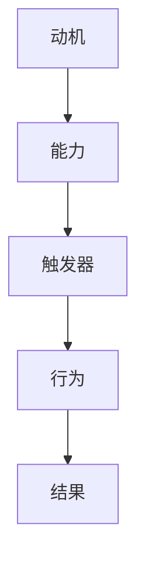

                 

关键词：福格模型、高绩效、习惯、心理学、技术策略

> 摘要：本文将探讨如何利用福格模型（BJ Fogg Behavior Model）这一心理学理论，打造高绩效的习惯。通过详细解释模型的构成和操作步骤，并结合实际项目和案例，为读者提供一整套实用的策略和工具，以帮助他们在技术领域内建立可持续的高效工作习惯。

## 1. 背景介绍

在快节奏、竞争激烈的技术领域，高效工作是成功的关键。然而，许多人发现保持高效并不容易，尤其是在面对复杂的项目、持续的压力以及技术革新的挑战时。福格模型是由斯坦福大学行为科学家BJ Fogg提出的一个理论模型，旨在解释人类行为的三个要素——动机（Motivation）、能力（Ability）和触发器（Trigger）如何相互作用，从而形成行为。通过理解和应用福格模型，我们可以设计和优化环境，促进良好的行为习惯的养成，从而提升工作效率。

## 2. 核心概念与联系

### 2.1 动机（Motivation）

动机是人们行为的内在驱动力。在技术领域，动机可能来源于对工作的热爱、对成功的渴望或者对问题的解决欲望。一个强大的动机能够激发我们克服障碍，持续努力。

### 2.2 能力（Ability）

能力是人们完成某项任务所需的技术和资源。在技术工作中，这包括编程技能、解决问题的能力、团队协作等。提升能力是建立高绩效习惯的重要一环。

### 2.3 触发器（Trigger）

触发器是促使人们采取行动的即时提示或机会。在技术工作中，这可以是每日的工作计划、项目的里程碑或团队会议等。

### 2.4 梅里狄安图（Mermaid 流程图）



## 3. 核心算法原理 & 具体操作步骤

### 3.1 算法原理概述

福格模型的核心在于理解行为的构成要素，并通过调整这三个要素来塑造高效的习惯。具体来说，我们需要：

1. 确定动机：明确你希望养成的行为背后的驱动力。
2. 提升能力：通过学习和实践提升完成该行为的能力。
3. 设置触发器：设计一个明确的触发机制，确保在适当的时机采取行动。

### 3.2 算法步骤详解

#### 3.2.1 分析动机

- **自我反思**：思考为什么想要改变行为，背后的动机是什么。
- **行为日志**：记录每天的行为和感受，识别哪些因素激发你的动机。

#### 3.2.2 提升能力

- **技能培训**：参加在线课程、研讨会或工作坊，提升所需技能。
- **实践练习**：通过实际项目或练习来巩固所学知识。

#### 3.2.3 设置触发器

- **时间规划**：设定固定的时间进行特定行为。
- **提醒工具**：使用日历提醒或应用程序来设置触发器。

### 3.3 算法优缺点

#### 优点：

- **实用性强**：基于实际心理学研究，适用于各种行为改变。
- **灵活多变**：可以适应不同个体的需求。

#### 缺点：

- **需要持续努力**：习惯的养成不是一蹴而就的，需要时间和耐心。
- **对能力提升有依赖**：如果没有足够的能力，即使有强烈的动机和触发器，行为也难以实现。

### 3.4 算法应用领域

- **个人成长**：提升自我管理能力，实现职业目标。
- **团队协作**：增强团队效率和凝聚力。
- **项目管理**：确保项目按时按质完成。

## 4. 数学模型和公式 & 详细讲解 & 举例说明

### 4.1 数学模型构建

福格模型可以通过以下公式表示：

$$
行为 = 动机 \times 能力 \times 触发器
$$

### 4.2 公式推导过程

该公式基于福格模型的核心概念，即行为是由动机、能力和触发器共同作用的结果。每个要素都对行为的形成起着关键作用。

### 4.3 案例分析与讲解

假设一名软件工程师想要提升自己的代码审查能力：

- **动机**：为了提高代码质量和团队协作效率。
- **能力**：掌握代码审查的最佳实践，提高代码识别和修正能力。
- **触发器**：每周安排一次固定的代码审查时间。

通过调整这三个要素，该工程师可以逐步提升自己的代码审查能力。

## 5. 项目实践：代码实例和详细解释说明

### 5.1 开发环境搭建

为了更好地实践福格模型，我们选择一个简单的项目——一个用于计算器的小程序。

### 5.2 源代码详细实现

```python
# 计算器程序

def add(a, b):
    return a + b

def subtract(a, b):
    return a - b

def multiply(a, b):
    return a * b

def divide(a, b):
    if b == 0:
        return "Error: Division by zero"
    return a / b

def main():
    print("Welcome to the simple calculator!")
    while True:
        print("\nPlease choose an operation:")
        print("1. Add")
        print("2. Subtract")
        print("3. Multiply")
        print("4. Divide")
        print("5. Exit")
        choice = input("Enter your choice: ")
        
        if choice == '5':
            print("Exiting the calculator. Goodbye!")
            break
        
        num1 = float(input("Enter first number: "))
        num2 = float(input("Enter second number: "))
        
        if choice == '1':
            result = add(num1, num2)
            print(f"The result of addition is: {result}")
        elif choice == '2':
            result = subtract(num1, num2)
            print(f"The result of subtraction is: {result}")
        elif choice == '3':
            result = multiply(num1, num2)
            print(f"The result of multiplication is: {result}")
        elif choice == '4':
            result = divide(num1, num2)
            print(f"The result of division is: {result}")
        else:
            print("Invalid choice. Please try again.")

if __name__ == "__main__":
    main()
```

### 5.3 代码解读与分析

该计算器程序通过简单的函数实现了加、减、乘、除四种基本运算。每个函数都是对输入的两个数字进行操作，并返回结果。程序的主函数提供了用户界面，允许用户选择操作，并输入相应的数字。

### 5.4 运行结果展示

运行该程序后，用户可以看到一个简单的菜单，可以选择不同的操作。输入相应的数字后，程序会返回计算结果。

```shell
Welcome to the simple calculator!

Please choose an operation:
1. Add
2. Subtract
3. Multiply
4. Divide
5. Exit
Enter your choice: 1

Enter first number: 10
Enter second number: 5
The result of addition is: 15

Please choose an operation:
...
```

## 6. 实际应用场景

福格模型在技术领域的应用场景非常广泛。以下是一些具体的案例：

- **个人提升**：一名开发者希望通过每天学习新技能来提升自己。他可以通过设定每日学习时间、参加在线课程并设置提醒来培养这一习惯。
- **团队协作**：一个软件开发团队希望通过定期代码审查来提高代码质量。他们可以制定固定的审查时间表，并利用自动化工具提醒成员进行审查。
- **项目管理**：项目经理可以通过制定清晰的项目计划、设置里程碑和提醒，确保项目按时完成。

## 7. 工具和资源推荐

为了更好地应用福格模型，以下是一些推荐的工具和资源：

- **学习资源**：[Coursera](https://www.coursera.org/)、[edX](https://www.edx.org/) 提供丰富的在线课程。
- **开发工具**：[JIRA](https://www.atlassian.com/software/jira)、[Trello](https://trello.com/) 可以帮助管理项目和时间。
- **心理学资源**：[BJ Fogg's Behavior Model website](https://bjfogg.com/bfl/) 提供福格模型的相关资料。

## 8. 总结：未来发展趋势与挑战

### 8.1 研究成果总结

福格模型在心理学和行为科学领域已有广泛的研究和应用。未来，随着人工智能和大数据技术的发展，福格模型有望更加精确地预测和引导人类行为。

### 8.2 未来发展趋势

- **个性化推荐**：利用大数据和机器学习技术，为用户提供更个性化的行为建议。
- **增强现实**：通过虚拟现实和增强现实技术，增强行为的触发器和激励机制。

### 8.3 面临的挑战

- **数据隐私**：行为数据的收集和使用需要确保隐私保护。
- **文化差异**：不同文化背景下的行为模式可能有所不同，模型需要具备适应性。

### 8.4 研究展望

未来，福格模型有望与其他心理学理论和人工智能技术相结合，为更广泛的行为改变提供支持。

## 9. 附录：常见问题与解答

### 9.1 如何确定动机？

- **自我反思**：深入思考你为什么想要改变行为。
- **与他人交流**：向朋友、家人或同事寻求反馈。

### 9.2 能力提升有哪些方法？

- **学习新技能**：参加课程、阅读书籍或观看教学视频。
- **实践练习**：通过实际项目来应用所学知识。

### 9.3 触发器设置有什么技巧？

- **时间规划**：设定具体的时间表来执行特定任务。
- **提醒工具**：使用日历提醒或应用程序来设置触发器。

---

作者：禅与计算机程序设计艺术 / Zen and the Art of Computer Programming

