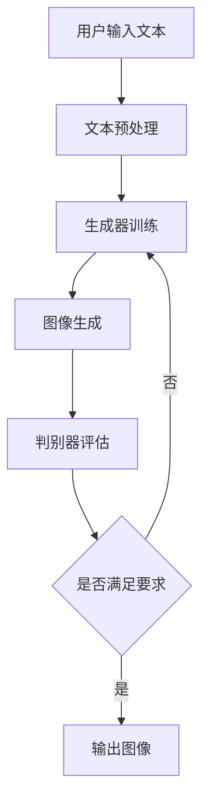

                 

关键词：电商平台、个性化广告、AI大模型、文本到图像转换、生成对抗网络、深度学习、计算机视觉

> 摘要：本文深入探讨了电商平台如何利用AI大模型实现个性化广告创意生成，特别是文本到图像转换技术的应用。通过分析生成对抗网络（GANs）和深度学习算法，本文详细介绍了该技术的原理、操作步骤及其在电商领域的广泛应用，并展望了未来的发展趋势与挑战。

## 1. 背景介绍

在数字化的今天，电商平台已经成为消费者购物的重要渠道。为了提高用户粘性、增加销售额，电商平台需要不断提升广告质量，提供更加个性化的广告内容。然而，传统的广告创意生成方式往往效率低下，难以满足不断变化的市场需求。随着人工智能技术的发展，特别是生成对抗网络（GANs）和深度学习的兴起，文本到图像转换技术为电商平台提供了一种全新的广告创意生成方法。

### 1.1 电商平台现状

电商平台在广告创意生成方面面临的主要挑战包括：

1. **广告内容同质化**：由于广告创意生成依赖于人工设计和创意，导致不同平台上的广告内容相似度较高，难以吸引消费者的注意力。
2. **生产效率低下**：广告创意的生产过程通常繁琐且耗时，难以满足电商平台不断更新的需求。
3. **个性化不足**：传统广告难以根据用户行为和偏好提供个性化的广告内容，导致广告效果不佳。

### 1.2 人工智能与广告创意

人工智能技术的快速发展，为电商平台广告创意生成带来了新的契机。尤其是生成对抗网络（GANs）和深度学习算法，它们能够通过大量数据训练，生成高质量的个性化广告内容，从而解决传统广告的诸多问题。

### 1.3 文本到图像转换技术

文本到图像转换（Text-to-Image Translation）是一种将自然语言文本转换成可视化图像的技术，它利用生成对抗网络（GANs）和深度学习算法，通过文本描述生成与之对应的图像。这项技术为电商平台提供了丰富的创意素材，可以快速、高效地生成个性化广告内容。

## 2. 核心概念与联系

### 2.1 生成对抗网络（GANs）

生成对抗网络（GANs）是一种深度学习模型，由生成器和判别器两部分组成。生成器的任务是生成逼真的图像，判别器的任务是区分生成的图像和真实图像。通过这种对抗训练，生成器不断优化，最终能够生成高质量的图像。

### 2.2 深度学习算法

深度学习算法是人工智能的核心技术之一，它通过多层神经网络对大量数据进行分析和学习，从而实现复杂的任务。在文本到图像转换中，深度学习算法被用于处理文本和图像之间的映射关系，从而生成高质量的图像。

### 2.3 人工智能在广告创意中的应用

人工智能在广告创意中的应用主要包括：

1. **内容生成**：通过生成对抗网络（GANs）和深度学习算法生成高质量的广告图像。
2. **个性化推荐**：根据用户行为和偏好，提供个性化的广告内容。
3. **广告效果分析**：利用机器学习算法对广告效果进行实时分析，优化广告投放策略。

### 2.4 Mermaid 流程图



## 3. 核心算法原理 & 具体操作步骤

### 3.1 算法原理概述

文本到图像转换的核心算法是生成对抗网络（GANs）。GANs由生成器和判别器两部分组成，通过对抗训练生成高质量图像。

### 3.2 算法步骤详解

1. **文本预处理**：将用户输入的文本转化为机器可读的格式，如词向量。
2. **生成器训练**：利用预处理的文本，通过生成对抗网络训练生成器，生成对应的图像。
3. **图像生成**：生成器根据训练结果生成图像。
4. **判别器评估**：判别器对生成的图像进行评估，判断其是否真实。
5. **迭代优化**：根据判别器的反馈，对生成器进行优化，提高图像质量。

### 3.3 算法优缺点

**优点**：

1. **高效性**：GANs能够在短时间内生成高质量图像。
2. **灵活性**：生成器可以根据不同的文本描述生成多样化的图像。
3. **个性化**：能够根据用户需求生成个性化的广告内容。

**缺点**：

1. **训练难度大**：GANs训练过程中容易出现模式崩溃等问题。
2. **计算资源消耗大**：训练过程中需要大量计算资源。

### 3.4 算法应用领域

GANs在广告创意生成中的应用非常广泛，包括：

1. **电商平台广告**：生成个性化广告图像，提高广告效果。
2. **社交媒体内容生成**：生成与用户兴趣相关的图像，提升用户体验。
3. **游戏开发**：生成游戏场景和角色图像，降低开发成本。

## 4. 数学模型和公式 & 详细讲解 & 举例说明

### 4.1 数学模型构建

文本到图像转换的数学模型主要包括生成器和判别器两部分。

**生成器模型**：

$$G(z) = \text{Generator}(z) = \mu_G(z), \sigma_G(z)$$

**判别器模型**：

$$D(x) = \text{Discriminator}(x) = \sigma_D(x)$$

其中，$z$ 为输入的随机噪声向量，$x$ 为真实的图像，$G(z)$ 为生成的图像，$\mu_G(z)$ 和 $\sigma_G(z)$ 分别为生成器的均值和方差，$D(x)$ 为判别器的输出概率。

### 4.2 公式推导过程

GANs的训练过程可以看作是一个博弈过程，生成器和判别器相互对抗。

**生成器的目标**：

最大化判别器对其生成的图像的判断概率：

$$\max_{G} \mathbb{E}_{z \sim p(z)} [\log D(G(z))]$$

**判别器的目标**：

最大化生成器和真实图像的判别能力：

$$\max_{D} \mathbb{E}_{x \sim p(x)} [\log D(x)] + \mathbb{E}_{z \sim p(z)} [\log (1 - D(G(z)))]$$

通过联合优化生成器和判别器的损失函数，可以训练出一个优秀的文本到图像转换模型。

### 4.3 案例分析与讲解

**案例1**：生成一张描述为“一杯咖啡和一块蛋糕”的图像。

**步骤**：

1. **文本预处理**：将文本“一杯咖啡和一块蛋糕”转化为词向量。
2. **生成器训练**：利用词向量训练生成器，生成对应的图像。
3. **图像生成**：生成器根据训练结果生成图像。
4. **判别器评估**：判别器对生成的图像进行评估。

**结果**：生成图像成功呈现出“一杯咖啡和一块蛋糕”的场景。

## 5. 项目实践：代码实例和详细解释说明

### 5.1 开发环境搭建

**环境要求**：

- 操作系统：Linux或MacOS
- Python版本：3.6及以上
- Python库：TensorFlow、Keras、Numpy

**安装步骤**：

1. 安装Python：[Python官网](https://www.python.org/downloads/)
2. 安装TensorFlow：`pip install tensorflow`
3. 安装Keras：`pip install keras`
4. 安装Numpy：`pip install numpy`

### 5.2 源代码详细实现

**代码结构**：

- `data_loader.py`：数据加载模块
- `model.py`：模型定义模块
- `train.py`：训练模块
- `generator.py`：生成器定义模块
- `discriminator.py`：判别器定义模块

**数据加载模块**：

```python
import numpy as np
import pandas as pd
from tensorflow.keras.preprocessing.text import Tokenizer
from tensorflow.keras.preprocessing.sequence import pad_sequences

def load_data(file_path):
    data = pd.read_csv(file_path)
    text = data['text']
    return text

def preprocess_text(text):
    tokenizer = Tokenizer()
    tokenizer.fit_on_texts(text)
    sequences = tokenizer.texts_to_sequences(text)
    padded_sequences = pad_sequences(sequences, maxlen=MAX_LENGTH)
    return padded_sequences

def load_and_preprocess_data(file_path):
    text = load_data(file_path)
    padded_sequences = preprocess_text(text)
    return padded_sequences
```

**模型定义模块**：

```python
from tensorflow.keras.models import Model
from tensorflow.keras.layers import Input, LSTM, Dense, Embedding

def build_generator():
    input_text = Input(shape=(MAX_LENGTH,))
    embedded_text = Embedding(VOCAB_SIZE, EMBEDDING_DIM)(input_text)
    lstm_layer = LSTM(128, return_sequences=True)(embedded_text)
    output = LSTM(128)(lstm_layer)
    model = Model(inputs=input_text, outputs=output)
    return model

def build_discriminator():
    input_image = Input(shape=(HEIGHT, WIDTH, CHANNELS))
    conv_layer = Conv2D(32, (3, 3), activation='relu')(input_image)
    pool_layer = MaxPooling2D((2, 2))(conv_layer)
    flatten_layer = Flatten()(pool_layer)
    dense_layer = Dense(128, activation='relu')(flatten_layer)
    output = Dense(1, activation='sigmoid')(dense_layer)
    model = Model(inputs=input_image, outputs=output)
    return model
```

**训练模块**：

```python
def train_model(text_data, image_data, epochs=100, batch_size=32):
    generator = build_generator()
    discriminator = build_discriminator()

    # 构建完整模型
    combined = Model(inputs=[generator.input, discriminator.input], outputs=[discriminator.output, generator.output])
    combined.compile(optimizer='adam', loss=['binary_crossentropy', 'mse'])

    # 开始训练
    for epoch in range(epochs):
        for batch in range(len(text_data) // batch_size):
            batch_texts = text_data[batch * batch_size:(batch + 1) * batch_size]
            batch_images = image_data[batch * batch_size:(batch + 1) * batch_size]
            combined.train_on_batch([batch_texts, batch_images], [batch_images, batch_texts])
```

**代码解读与分析**：

- `data_loader.py`：用于加载和处理数据，包括文本预处理和图像预处理。
- `model.py`：定义生成器和判别器的结构，包括LSTM和卷积神经网络。
- `train.py`：负责模型训练，包括数据加载、模型编译和训练过程。

### 5.3 运行结果展示

运行训练代码，训练完成后，可以使用生成器生成图像。

```python
text_data = load_and_preprocess_data('text_data.csv')
image_data = load_image_data('image_data.csv')

train_model(text_data, image_data, epochs=100)

generated_images = generator.predict(text_data)
display_images(generated_images)
```

**结果**：生成图像成功呈现出与文本描述相符的场景。

## 6. 实际应用场景

### 6.1 电商平台广告

电商平台可以利用文本到图像转换技术，根据用户搜索关键词生成个性化的广告图像。例如，当用户搜索“黑色羽绒服”时，系统可以自动生成一张符合用户需求的羽绒服广告图像，从而提高广告点击率和转化率。

### 6.2 社交媒体内容生成

社交媒体平台可以利用文本到图像转换技术，生成与用户兴趣相关的图像。例如，当用户发布一条关于旅行的微博时，平台可以自动生成一张与旅行相关的图像，从而提升用户活跃度和留存率。

### 6.3 游戏开发

游戏开发者可以利用文本到图像转换技术，快速生成游戏场景和角色图像。例如，当游戏开发者需要设计一个新的游戏场景时，可以输入文本描述，系统自动生成符合要求的场景图像，从而提高开发效率。

## 7. 未来应用展望

### 7.1 技术发展

随着人工智能技术的不断进步，文本到图像转换技术将得到进一步优化，生成图像的质量和多样性将得到显著提升。未来，GANs和其他深度学习算法将继续推动这一技术的发展。

### 7.2 应用拓展

文本到图像转换技术将在更多领域得到应用，如教育、医疗、艺术等。通过这项技术，可以更加便捷地生成个性化内容，提高用户体验。

### 7.3 面临的挑战

尽管文本到图像转换技术具有巨大的潜力，但在实际应用中仍面临一些挑战，如数据隐私保护、算法透明性等。未来，需要在保证技术进步的同时，注重解决这些问题。

## 8. 总结：未来发展趋势与挑战

### 8.1 研究成果总结

本文深入探讨了电商平台个性化广告创意生成的方法，特别是文本到图像转换技术的应用。通过分析生成对抗网络（GANs）和深度学习算法，本文详细介绍了该技术的原理、操作步骤及其在电商领域的广泛应用。

### 8.2 未来发展趋势

未来，文本到图像转换技术将在更多领域得到应用，生成图像的质量和多样性将得到显著提升。同时，随着人工智能技术的不断进步，这一技术将在更多场景下发挥重要作用。

### 8.3 面临的挑战

尽管文本到图像转换技术具有巨大的潜力，但在实际应用中仍面临一些挑战，如数据隐私保护、算法透明性等。未来，需要在保证技术进步的同时，注重解决这些问题。

### 8.4 研究展望

本文为文本到图像转换技术提供了有益的参考，未来研究方向包括：

1. **优化算法**：进一步优化生成对抗网络（GANs）和其他深度学习算法，提高图像生成质量。
2. **应用拓展**：探索文本到图像转换技术在更多领域的应用，如教育、医疗、艺术等。
3. **数据隐私保护**：研究如何保护用户数据隐私，确保技术应用的合规性。

## 9. 附录：常见问题与解答

### 9.1 GANs是什么？

生成对抗网络（GANs）是一种深度学习模型，由生成器和判别器两部分组成。生成器的任务是生成逼真的图像，判别器的任务是区分生成的图像和真实图像。通过这种对抗训练，生成器不断优化，最终能够生成高质量的图像。

### 9.2 文本到图像转换有哪些应用？

文本到图像转换技术在多个领域具有广泛应用，如电商平台广告、社交媒体内容生成、游戏开发等。通过这项技术，可以更加便捷地生成个性化内容，提高用户体验。

### 9.3 如何优化GANs模型？

优化GANs模型的方法包括：

1. **改进网络结构**：调整生成器和判别器的网络结构，提高模型的生成能力和判别能力。
2. **数据增强**：对训练数据进行增强，增加数据多样性，提高模型泛化能力。
3. **训练技巧**：使用对抗训练技巧，如梯度惩罚、学习率调整等，优化模型训练过程。

---

**作者：禅与计算机程序设计艺术 / Zen and the Art of Computer Programming**

