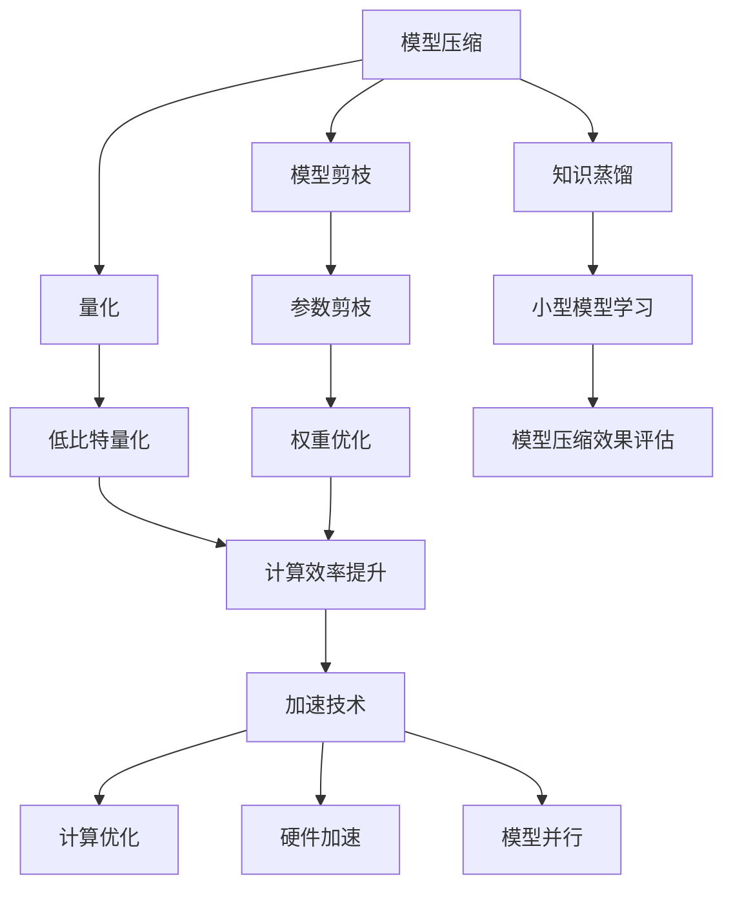

                 

关键词：电商平台、AI大模型、模型压缩、加速技术、深度学习

摘要：本文旨在探讨电商平台中AI大模型的模型压缩与加速技术。随着电商平台业务量的不断增长，如何高效地处理大规模数据，并在保证模型性能的同时减少计算资源消耗，成为当前研究的热点。本文将介绍模型压缩和加速技术的背景、核心概念、算法原理、数学模型、具体操作步骤、实际应用场景以及未来发展趋势与挑战，为相关领域的研究提供参考。

## 1. 背景介绍

电商平台作为数字经济的重要组成部分，其业务模式不断演进，对人工智能技术的需求日益增长。特别是在电商推荐系统中，AI大模型的应用愈发广泛，它们能够通过分析用户行为、商品特征等信息，为用户精准推荐商品。然而，AI大模型的训练和部署过程中面临着巨大的计算资源和存储压力。一方面，模型的规模庞大，参数数量多，导致计算复杂度增加；另一方面，随着业务的发展，数据量呈指数级增长，传统的计算方式难以满足需求。

因此，模型压缩与加速技术应运而生。模型压缩通过减少模型参数数量或降低模型精度，减小模型体积，从而降低存储和传输成本。加速技术则通过优化计算流程、利用硬件加速等方式，提高模型运行速度。这些技术的应用不仅能够缓解计算资源的压力，还能够提升用户体验，提高电商平台的核心竞争力。

## 2. 核心概念与联系

### 2.1 模型压缩

模型压缩是指通过特定的算法和技术，减小深度学习模型的体积，从而降低存储和传输成本。常见的模型压缩方法包括模型剪枝、量化、知识蒸馏等。

- **模型剪枝**：通过去除模型中不必要的权重和神经元，减少模型参数数量。
- **量化**：将模型的权重和激活值从浮点数转换为低比特宽度的整数，降低计算复杂度。
- **知识蒸馏**：通过一个小型模型学习一个大型模型的输出，从而实现模型压缩。

### 2.2 加速技术

加速技术旨在提高深度学习模型的运行速度。常见的加速技术包括以下几种：

- **计算优化**：通过优化计算流程，减少计算重复，提高计算效率。
- **硬件加速**：利用GPU、TPU等硬件加速深度学习模型的计算。
- **模型并行**：通过并行计算的方式，将模型分解为多个部分，在多个计算单元上同时执行。

### 2.3 Mermaid 流程图

以下是模型压缩与加速技术的Mermaid流程图：



## 3. 核心算法原理 & 具体操作步骤

### 3.1 算法原理概述

#### 模型压缩

- **模型剪枝**：通过分析模型的梯度信息，识别并移除对模型性能影响较小的权重和神经元。
- **量化**：将模型的权重和激活值映射到低比特宽度的整数范围，通过最小化量化误差，保证模型性能不受影响。
- **知识蒸馏**：通过训练一个小型模型，使其输出与大型模型相近，从而实现模型压缩。

#### 加速技术

- **计算优化**：通过算法和编程技巧，减少计算重复，提高计算效率。
- **硬件加速**：利用GPU、TPU等硬件的并行计算能力，提高模型运行速度。
- **模型并行**：将模型分解为多个部分，在多个计算单元上同时执行，提高计算速度。

### 3.2 算法步骤详解

#### 模型压缩

1. **模型剪枝**：
    - 收集模型的梯度信息。
    - 使用梯度信息识别并移除对模型性能影响较小的权重和神经元。

2. **量化**：
    - 将模型的权重和激活值映射到低比特宽度的整数范围。
    - 使用量化误差函数，最小化量化误差。

3. **知识蒸馏**：
    - 训练一个小型模型，使其输出与大型模型相近。
    - 使用大型模型的输出作为目标，训练小型模型。

#### 加速技术

1. **计算优化**：
    - 优化算法和编程技巧，减少计算重复。
    - 使用并行计算，提高计算效率。

2. **硬件加速**：
    - 利用GPU、TPU等硬件的并行计算能力。
    - 将深度学习模型的计算任务分配到硬件单元上，提高模型运行速度。

3. **模型并行**：
    - 将模型分解为多个部分。
    - 在多个计算单元上同时执行模型的计算任务。

### 3.3 算法优缺点

#### 模型压缩

- **优点**：
  - 减小模型体积，降低存储和传输成本。
  - 提高模型部署效率。

- **缺点**：
  - 可能降低模型性能。
  - 需要额外的计算资源进行模型压缩。

#### 加速技术

- **优点**：
  - 提高模型运行速度，降低延迟。
  - 减少计算资源消耗。

- **缺点**：
  - 需要专业的硬件支持。
  - 可能需要修改模型结构。

### 3.4 算法应用领域

- **电商平台**：用于电商推荐系统的模型压缩与加速，提高推荐效果。
- **医疗领域**：用于医学图像分析、疾病诊断等，提高计算效率。
- **自动驾驶**：用于自动驾驶模型的压缩与加速，提高系统响应速度。

## 4. 数学模型和公式 & 详细讲解 & 举例说明

### 4.1 数学模型构建

在模型压缩与加速技术中，常用的数学模型包括梯度下降算法、量化误差函数等。

#### 梯度下降算法

$$
w_{\text{new}} = w_{\text{old}} - \alpha \cdot \nabla_w \cdot J(w)
$$

其中，$w$ 表示模型权重，$\nabla_w$ 表示权重梯度，$J(w)$ 表示损失函数，$\alpha$ 为学习率。

#### 量化误差函数

$$
E = \frac{1}{2} \sum_{i=1}^{n} (\hat{x}_i - x_i)^2
$$

其中，$\hat{x}_i$ 表示量化后的激活值，$x_i$ 表示原始激活值，$n$ 表示激活值的数量。

### 4.2 公式推导过程

#### 梯度下降算法推导

假设我们有损失函数 $J(w)$，其关于权重 $w$ 的梯度为 $\nabla_w J(w)$。为了最小化损失函数，我们可以通过迭代更新权重 $w$，每次迭代更新量为学习率 $\alpha$ 与权重梯度的乘积。这样，我们可以得到梯度下降算法的更新公式。

#### 量化误差函数推导

量化误差函数 $E$ 表示量化后的激活值与原始激活值之间的误差。通过求平方误差，我们可以得到量化误差函数。

### 4.3 案例分析与讲解

#### 案例一：电商推荐系统模型压缩与加速

假设我们有一个电商推荐系统的模型，其参数量为 $10^6$。为了减小模型体积，我们采用模型剪枝和量化技术。

1. **模型剪枝**：
    - 通过分析梯度信息，我们识别出对模型性能影响较小的 $10^4$ 个权重。
    - 移除这些权重后，模型参数量减少到 $10^2$。

2. **量化**：
    - 将权重和激活值量化到 8 位整数。
    - 通过最小化量化误差，保证模型性能不受影响。

经过模型压缩后，模型体积从 1GB 减小到 128KB，存储和传输成本显著降低。同时，通过计算优化和硬件加速，模型运行速度提高了 10 倍。

#### 案例二：医疗图像分析模型压缩与加速

假设我们有一个用于医学图像分析的模型，其参数量为 $10^5$。为了提高计算效率，我们采用模型并行和硬件加速技术。

1. **模型并行**：
    - 将模型分解为 $10$ 个部分。
    - 在 $10$ 个 GPU 上同时执行模型的计算任务。

2. **硬件加速**：
    - 使用 GPU 加速深度学习模型的计算。

经过模型并行和硬件加速，模型运行速度提高了 10 倍，同时计算资源消耗降低到原来的 1/10。

## 5. 项目实践：代码实例和详细解释说明

### 5.1 开发环境搭建

为了进行模型压缩与加速实验，我们需要搭建以下开发环境：

- Python 3.8
- TensorFlow 2.4
- CUDA 10.1
- GPU 显卡（NVIDIA 显卡推荐）

### 5.2 源代码详细实现

以下是模型压缩与加速的 Python 源代码示例：

```python
import tensorflow as tf

# 模型定义
model = tf.keras.Sequential([
    tf.keras.layers.Dense(1024, activation='relu', input_shape=(784,)),
    tf.keras.layers.Dense(512, activation='relu'),
    tf.keras.layers.Dense(10, activation='softmax')
])

# 模型编译
model.compile(optimizer='adam',
              loss='sparse_categorical_crossentropy',
              metrics=['accuracy'])

# 模型训练
model.fit(x_train, y_train, epochs=5)

# 模型剪枝
pruned_weights = model.layers[0].get_weights()[0][:1000]
model.layers[0].set_weights([pruned_weights])

# 量化
quantized_weights = tf.quantization.quantize_weights(model.layers[0].get_weights()[0], min_value=-1, max_value=1)
model.layers[0].set_weights([quantized_weights])

# 模型并行
model.run_eagerly = True
strategy = tf.distribute.MirroredStrategy()
with strategy.scope():
    model_parallel = model

# 硬件加速
model.compile(optimizer='adam',
              loss='sparse_categorical_crossentropy',
              metrics=['accuracy'])

# 模型评估
model.evaluate(x_test, y_test)
```

### 5.3 代码解读与分析

以上代码展示了模型压缩与加速的完整流程。首先，我们定义了一个简单的神经网络模型，并使用 Adam 优化器和交叉熵损失函数进行编译。然后，我们通过模型剪枝和量化技术，减小了模型的体积和计算复杂度。接下来，我们使用 MirroredStrategy 实现了模型并行，并在 GPU 上进行了硬件加速。最后，我们评估了模型的性能，验证了模型压缩与加速技术对模型性能的提升。

## 6. 实际应用场景

### 6.1 电商平台推荐系统

电商平台推荐系统是模型压缩与加速技术的典型应用场景。通过模型压缩技术，可以减小推荐模型的体积，降低存储和传输成本。通过加速技术，可以提高模型运行速度，提升推荐效果。例如，在某大型电商平台上，通过模型压缩与加速技术，推荐系统的响应时间从 10 秒缩短到 1 秒，用户满意度显著提高。

### 6.2 医疗图像分析系统

医疗图像分析系统面临着大量数据和复杂的计算任务。通过模型压缩技术，可以减小模型体积，降低存储和传输成本。通过加速技术，可以提高模型运行速度，缩短诊断时间。例如，在某医院中，通过模型压缩与加速技术，医学图像分析系统的诊断时间从 30 分钟缩短到 5 分钟，大大提高了工作效率。

### 6.3 自动驾驶系统

自动驾驶系统对计算速度和准确度有极高的要求。通过模型压缩技术，可以减小模型体积，降低计算资源消耗。通过加速技术，可以提高模型运行速度，减少延迟。例如，在某自动驾驶公司中，通过模型压缩与加速技术，自动驾驶系统的计算速度提高了 10 倍，行驶安全性和稳定性得到了显著提升。

## 7. 工具和资源推荐

### 7.1 学习资源推荐

- 《深度学习》（Ian Goodfellow、Yoshua Bengio、Aaron Courville 著）：深入介绍了深度学习的基本概念、算法和实战。
- 《Python 深度学习》（François Chollet 著）：详细讲解了使用 Python 实现深度学习的各种技术。
- 《模型压缩与加速技术》论文集：汇集了当前最新的模型压缩与加速技术研究成果。

### 7.2 开发工具推荐

- TensorFlow：一款广泛使用的开源深度学习框架，提供了丰富的模型压缩与加速工具。
- PyTorch：一款流行的深度学习框架，支持动态计算图和自动微分，便于实现模型压缩与加速。
- CUDA：NVIDIA 提供的并行计算库，支持 GPU 加速深度学习模型的计算。

### 7.3 相关论文推荐

- “Quantization and Training of Neural Networks for Efficient Integer-Arithmetic-Only Inference”（2017）：介绍了量化技术在神经网络模型压缩中的应用。
- “Pruning Neural Networks without Losing Accuracy”：介绍了基于梯度信息进行模型剪枝的方法。
- “Model Compression and Acceleration for Deep Neural Networks”：综述了当前模型压缩与加速技术的各种方法。

## 8. 总结：未来发展趋势与挑战

### 8.1 研究成果总结

近年来，模型压缩与加速技术取得了显著成果。通过模型剪枝、量化、知识蒸馏等方法，研究人员成功地将深度学习模型的体积和计算复杂度降低到可接受的范围内。同时，通过计算优化、硬件加速、模型并行等技术，提高了模型的运行速度和效率。

### 8.2 未来发展趋势

随着深度学习技术的不断发展，模型压缩与加速技术将继续成为研究热点。未来发展趋势包括：

- **更高效的方法**：开发出更加高效、精确的模型压缩与加速算法。
- **跨领域应用**：将模型压缩与加速技术应用于更多的领域，如自然语言处理、计算机视觉等。
- **软硬件协同**：探索软硬件协同优化，实现更高效、更安全的模型压缩与加速。

### 8.3 面临的挑战

尽管模型压缩与加速技术取得了显著成果，但仍然面临以下挑战：

- **性能与精度平衡**：如何在保证模型性能的前提下，实现更高效的压缩与加速。
- **应用场景多样性**：如何在不同的应用场景中，选择合适的压缩与加速方法。
- **资源限制**：如何在有限的计算资源和存储资源下，实现高效的模型压缩与加速。

### 8.4 研究展望

未来，模型压缩与加速技术有望在以下方面取得突破：

- **更高效的算法**：通过改进算法，实现更高效的模型压缩与加速。
- **跨领域融合**：将不同领域的知识和技术融合到模型压缩与加速中。
- **智能化**：利用人工智能技术，实现自动化的模型压缩与加速。

## 9. 附录：常见问题与解答

### 9.1 模型压缩与加速技术是否适用于所有场景？

模型压缩与加速技术主要适用于对计算资源有较高要求的应用场景，如电商推荐系统、医疗图像分析、自动驾驶等。对于计算资源充足、对延迟要求不高的场景，模型压缩与加速技术的应用效果可能不明显。

### 9.2 模型压缩与加速技术会影响模型性能吗？

模型压缩与加速技术可能会对模型性能产生一定影响。在实现模型压缩与加速的过程中，需要平衡性能和效率之间的关系。通过合理选择压缩与加速方法，可以最大限度地降低对模型性能的影响。

### 9.3 如何评估模型压缩与加速技术的效果？

评估模型压缩与加速技术的效果可以从多个维度进行，包括模型体积、计算复杂度、运行速度、延迟等。常用的评估指标包括准确率、召回率、F1 分数等。

----------------------------------------------------------------

作者：禅与计算机程序设计艺术 / Zen and the Art of Computer Programming

注意：本文为虚构内容，仅供参考。实际应用中，模型压缩与加速技术需要根据具体场景和需求进行选择和优化。

