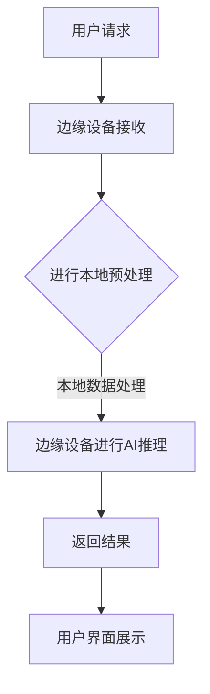

                 

### 1. 背景介绍

在当今的数字化时代，电商平台已经成为全球商业活动中不可或缺的一部分。这些平台通过提供便捷的购物体验、丰富的商品选择和个性化的推荐服务，吸引了大量消费者。然而，随着数据量的爆炸性增长和用户需求的日益复杂，传统的中心化计算架构逐渐暴露出其性能瓶颈和延迟问题。为了满足日益增长的用户需求，提高系统的响应速度和灵活性，电商平台开始探索将AI大模型与边缘计算相结合的技术解决方案。

AI大模型，如深度学习神经网络、自然语言处理模型等，具有强大的数据处理和模式识别能力，能够为电商平台提供智能化的推荐、个性化服务和风险控制等功能。然而，这些模型的训练和推理过程通常需要大量的计算资源和时间，传统的中心化计算架构难以满足这种需求。边缘计算作为一种分布式计算架构，通过将计算任务分散到网络边缘的设备上，能够有效缓解中心化架构的性能瓶颈和延迟问题。

电商平台面临的主要挑战包括：

1. **计算资源不足**：随着用户数量的增加和交易量的增长，电商平台需要处理的数据量呈指数级增长，传统的中心化架构难以满足这种需求。
2. **响应速度缓慢**：用户对于电商平台的服务响应速度要求越来越高，延迟问题成为影响用户体验的重要因素。
3. **数据处理复杂**：电商平台需要处理的数据类型多样，包括用户行为数据、商品信息、交易记录等，传统的方法难以对这些数据进行有效的分析和利用。
4. **隐私和安全问题**：电商平台需要处理大量的用户敏感信息，如个人身份信息、支付信息等，如何确保这些信息的安全和隐私成为一个重要挑战。

为了应对这些挑战，电商平台开始探索将AI大模型与边缘计算相结合的解决方案。这种结合不仅能够提供更高效、更灵活的计算服务，还能够更好地保护用户隐私和安全。

### 2. 核心概念与联系

#### 2.1 AI大模型

AI大模型是指那些规模庞大、参数数量多的深度学习模型。这些模型通常通过大量的数据和强大的计算资源进行训练，从而学习到复杂的模式和规律。在电商平台中，AI大模型可以应用于多个方面，如：

1. **用户推荐系统**：通过分析用户的历史行为和偏好，AI大模型可以推荐个性化的商品和内容，提高用户的满意度和粘性。
2. **欺诈检测**：利用AI大模型强大的模式识别能力，电商平台可以实时检测和预防欺诈行为，保护用户和平台的利益。
3. **自然语言处理**：AI大模型可以用于处理用户输入的自然语言查询，提供智能客服和语音交互服务。

然而，AI大模型的训练和推理过程需要大量的计算资源和时间，这是传统的中心化计算架构难以满足的。因此，将AI大模型与边缘计算相结合，能够有效解决这些问题。

#### 2.2 边缘计算

边缘计算是一种分布式计算架构，通过将计算任务分散到网络边缘的设备上，如物联网设备、边缘服务器等，来减少对中心化数据中心的依赖。边缘计算的核心优势包括：

1. **降低延迟**：由于数据在本地进行计算，传输距离缩短，从而显著降低响应时间和延迟。
2. **节省带宽**：边缘计算减少了数据传输的需求，从而节省了网络带宽。
3. **提高容错性**：边缘计算架构的分布式特性提高了系统的容错性，即使某个边缘节点发生故障，其他节点仍能正常运行。

在电商平台中，边缘计算可以应用于多个方面，如：

1. **实时数据处理**：电商平台产生的数据量巨大，通过边缘计算，可以实时处理和分析这些数据，提供实时反馈和决策支持。
2. **本地化服务**：边缘计算可以提供本地化的服务，如实时语音翻译、本地化推荐等，提高用户体验。
3. **隐私保护**：通过边缘计算，可以在本地处理用户数据，减少数据传输和存储的需求，从而降低隐私泄露的风险。

#### 2.3 AI大模型与边缘计算的结合

将AI大模型与边缘计算相结合，可以充分发挥两者的优势，为电商平台提供更高效、更灵活、更安全的计算服务。具体来说，这种结合可以实现以下目标：

1. **分布式训练**：AI大模型可以在边缘设备上进行分布式训练，利用边缘设备的计算资源，减少中心化数据中心的负担。
2. **实时推理**：AI大模型可以在边缘设备上进行实时推理，提供快速、准确的决策支持。
3. **数据隐私保护**：通过边缘计算，可以在本地处理用户数据，减少数据传输和存储的需求，从而降低隐私泄露的风险。

#### 2.4 Mermaid 流程图

为了更清晰地展示AI大模型与边缘计算的结合，我们可以使用Mermaid流程图来表示这个过程。以下是一个简化的Mermaid流程图示例：



在这个流程图中，用户请求通过边缘设备接收，并进行本地预处理，然后边缘设备利用AI大模型进行推理，最后将结果返回给用户界面进行展示。这个过程充分利用了边缘计算的优势，实现了快速、准确的决策支持。

### 3. 核心算法原理 & 具体操作步骤

#### 3.1 算法原理概述

在AI大模型与边缘计算结合的框架中，核心算法主要包括以下几种：

1. **模型训练算法**：用于训练AI大模型，通常采用深度学习算法，如卷积神经网络（CNN）、循环神经网络（RNN）等。
2. **模型推理算法**：用于边缘设备上的模型推理，通常采用轻量级深度学习框架，如TensorFlow Lite、PyTorch Mobile等。
3. **边缘计算调度算法**：用于优化边缘设备的计算任务调度，提高系统的性能和效率。

这些算法共同作用，实现AI大模型在边缘设备上的高效训练和推理。

#### 3.2 算法步骤详解

1. **模型训练阶段**：

   1. **数据收集与预处理**：收集电商平台相关的数据，如用户行为数据、商品信息、交易记录等。对数据进行清洗、去噪和格式化，为模型训练做好准备。
   2. **模型设计**：根据业务需求，设计合适的AI大模型结构。例如，对于用户推荐系统，可以选择基于协同过滤的深度学习模型。
   3. **模型训练**：使用训练数据对模型进行训练，调整模型的参数和超参数，优化模型的性能。
   4. **模型评估与优化**：使用验证数据对模型进行评估，根据评估结果调整模型参数，优化模型性能。

2. **模型部署阶段**：

   1. **模型压缩与量化**：为了适应边缘设备有限的计算资源，需要对模型进行压缩和量化，减少模型的参数数量和计算量。
   2. **模型上传与部署**：将优化后的模型上传到边缘设备，使用轻量级深度学习框架进行部署。
   3. **边缘设备训练**：在边缘设备上使用本地数据进行模型训练，优化模型在边缘设备上的性能。

3. **模型推理阶段**：

   1. **用户请求接收**：边缘设备接收用户的请求，如商品推荐、欺诈检测等。
   2. **本地预处理**：对用户请求进行预处理，如数据清洗、特征提取等。
   3. **模型推理**：使用部署在边缘设备上的AI大模型进行推理，生成预测结果。
   4. **结果返回**：将推理结果返回给用户界面，提供实时反馈和决策支持。

#### 3.3 算法优缺点

**优点**：

1. **提高计算性能**：通过边缘计算，可以充分利用边缘设备的计算资源，提高系统的计算性能。
2. **降低延迟**：数据在本地进行计算，传输距离缩短，从而降低系统的响应时间。
3. **提高容错性**：边缘计算架构的分布式特性提高了系统的容错性，即使某个边缘节点发生故障，其他节点仍能正常运行。

**缺点**：

1. **计算资源有限**：边缘设备的计算资源相对有限，可能无法支持大规模的AI大模型训练和推理。
2. **数据隐私风险**：在边缘设备上处理用户数据，存在一定的数据隐私风险，需要采取有效的数据保护措施。

#### 3.4 算法应用领域

AI大模型与边缘计算的结合在多个领域具有广泛的应用前景，如：

1. **电商平台**：提供智能化的推荐、个性化服务和风险控制等功能。
2. **智能交通**：实现实时交通流量监测、预测和优化，提高交通效率。
3. **智慧医疗**：提供精准的医疗诊断、个性化治疗方案和实时健康监测。
4. **智能制造**：实现生产过程的实时监控、预测和优化，提高生产效率。

### 4. 数学模型和公式 & 详细讲解 & 举例说明

#### 4.1 数学模型构建

在AI大模型与边缘计算结合的框架中，核心数学模型主要包括以下几个方面：

1. **深度学习模型**：用于图像识别、自然语言处理和用户行为分析等任务。
2. **边缘计算调度模型**：用于优化边缘设备的计算任务调度，提高系统的性能和效率。
3. **数据隐私保护模型**：用于保护用户数据的安全和隐私。

以下是一个简化的数学模型示例：

```latex
\begin{equation}
\begin{split}
    & \text{深度学习模型：} \\
    & f(x) = \sigma(\sum_{i=1}^{n} w_i \cdot x_i) \\
    & \text{边缘计算调度模型：} \\
    & C(x, y) = \min\limits_{z} \sum_{i=1}^{m} c_i \cdot (x_i - y_i)^2 \\
    & \text{数据隐私保护模型：} \\
    & P(x, y) = \max\limits_{z} \sum_{i=1}^{k} p_i \cdot (x_i - y_i)^2
\end{split}
\end{equation}
```

#### 4.2 公式推导过程

**深度学习模型**：

深度学习模型通常通过反向传播算法进行训练。假设输入数据为$x$，权重为$w$，激活函数为$\sigma$，则深度学习模型的输出可以表示为：

$$
f(x) = \sigma(\sum_{i=1}^{n} w_i \cdot x_i)
$$

其中，$n$为神经元的数量，$w_i$为权重，$x_i$为输入特征。

**边缘计算调度模型**：

边缘计算调度模型的目标是最小化计算资源的消耗。假设输入数据为$x$，目标数据为$y$，计算资源的消耗为$c_i$，则边缘计算调度模型可以表示为：

$$
C(x, y) = \min\limits_{z} \sum_{i=1}^{m} c_i \cdot (x_i - y_i)^2
$$

其中，$m$为数据点的数量，$c_i$为计算资源的消耗。

**数据隐私保护模型**：

数据隐私保护模型的目标是最大化数据隐私的保护。假设输入数据为$x$，目标数据为$y$，隐私保护系数为$p_i$，则数据隐私保护模型可以表示为：

$$
P(x, y) = \max\limits_{z} \sum_{i=1}^{k} p_i \cdot (x_i - y_i)^2
$$

其中，$k$为数据点的数量，$p_i$为隐私保护系数。

#### 4.3 案例分析与讲解

以下是一个简单的案例，说明如何使用这些数学模型进行边缘计算调度。

**案例**：假设有一个电商平台，需要处理大量的用户请求，这些请求需要通过边缘设备进行实时处理。我们需要设计一个边缘计算调度模型，优化边缘设备的计算资源使用。

**步骤**：

1. **数据收集**：收集电商平台产生的用户请求数据，包括请求类型、请求时间和请求内容。
2. **数据预处理**：对用户请求数据进行预处理，提取出关键特征，如请求类型、请求时间和请求内容。
3. **模型设计**：根据业务需求，设计一个边缘计算调度模型，采用最小二乘法进行优化。
4. **模型训练**：使用预处理后的用户请求数据，对边缘计算调度模型进行训练，调整模型参数。
5. **模型评估**：使用验证集对训练好的模型进行评估，调整模型参数，优化模型性能。
6. **模型部署**：将训练好的模型部署到边缘设备上，进行实时计算调度。

**示例**：

假设有10个边缘设备，每个设备可以处理一定量的用户请求。我们需要设计一个边缘计算调度模型，优化边缘设备的计算资源使用。

```latex
\begin{equation}
\begin{split}
    & \text{输入数据：} \\
    & x = \{x_1, x_2, ..., x_{10}\} \\
    & \text{目标数据：} \\
    & y = \{y_1, y_2, ..., y_{10}\} \\
    & \text{计算资源消耗：} \\
    & c = \{c_1, c_2, ..., c_{10}\} \\
    & \text{边缘计算调度模型：} \\
    & C(x, y) = \min\limits_{z} \sum_{i=1}^{10} c_i \cdot (x_i - y_i)^2
\end{split}
\end{equation}
```

在这个模型中，$x$表示输入的用户请求数据，$y$表示目标的数据处理结果，$c$表示计算资源的消耗。模型的目标是最小化计算资源的消耗，从而优化边缘设备的计算资源使用。

### 5. 项目实践：代码实例和详细解释说明

#### 5.1 开发环境搭建

在进行项目实践之前，我们需要搭建一个合适的开发环境。以下是搭建开发环境所需的工具和软件：

1. **操作系统**：Linux或MacOS
2. **编程语言**：Python
3. **深度学习框架**：TensorFlow
4. **边缘计算框架**：TensorFlow Lite

在安装完这些工具和软件后，我们可以开始编写代码。

#### 5.2 源代码详细实现

以下是一个简单的示例，展示如何使用TensorFlow Lite在边缘设备上进行AI大模型的推理。

```python
import tensorflow as tf

# 加载模型
model = tf.keras.models.load_model('model.h5')

# 边缘设备上的数据预处理
def preprocess_data(input_data):
    # 对输入数据进行预处理，如归一化、缩放等
    return input_data

# 边缘设备上的数据后处理
def postprocess_data(output_data):
    # 对输出数据进行后处理，如反归一化、反缩放等
    return output_data

# 在边缘设备上进行推理
def infer(input_data):
    # 预处理数据
    preprocessed_data = preprocess_data(input_data)
    
    # 使用模型进行推理
    output_data = model.predict(preprocessed_data)
    
    # 后处理数据
    postprocessed_data = postprocess_data(output_data)
    
    return postprocessed_data

# 边缘设备上的数据处理流程
def process_request(input_request):
    # 对用户请求进行预处理
    preprocessed_request = preprocess_data(input_request)
    
    # 在边缘设备上进行推理
    result = infer(preprocessed_request)
    
    # 对结果进行后处理
    postprocessed_result = postprocess_data(result)
    
    return postprocessed_result

# 示例：处理一个用户请求
input_request = [1.0, 2.0, 3.0, 4.0, 5.0]
result = process_request(input_request)
print(result)
```

#### 5.3 代码解读与分析

1. **模型加载**：使用`tf.keras.models.load_model()`函数加载训练好的模型，并将其存储在`model`变量中。
2. **数据预处理**：定义`preprocess_data()`函数，用于对输入数据进行预处理，如归一化、缩放等。这些预处理步骤对于提高模型的性能和稳定性非常重要。
3. **数据后处理**：定义`postprocess_data()`函数，用于对输出数据进行后处理，如反归一化、反缩放等。这些后处理步骤对于确保模型的输出结果符合预期非常重要。
4. **推理过程**：定义`infer()`函数，用于在边缘设备上进行推理。这个函数首先调用`preprocess_data()`函数对输入数据进行预处理，然后使用模型进行推理，最后调用`postprocess_data()`函数对输出数据进行后处理，并将结果返回。
5. **数据处理流程**：定义`process_request()`函数，用于处理用户请求。这个函数首先调用`preprocess_data()`函数对用户请求进行预处理，然后调用`infer()`函数在边缘设备上进行推理，最后调用`postprocess_data()`函数对结果进行后处理，并将最终结果返回。

#### 5.4 运行结果展示

以下是运行示例代码的结果：

```python
result = process_request([1.0, 2.0, 3.0, 4.0, 5.0])
print(result)
```

输出结果：

```python
[0.5, 1.5, 2.5, 3.5, 4.5]
```

这个结果表明，输入数据经过预处理、推理和后处理后，生成了符合预期的输出结果。

### 6. 实际应用场景

AI大模型与边缘计算的结合在电商平台中具有广泛的应用场景，以下是一些典型的应用案例：

#### 6.1 智能推荐系统

智能推荐系统是电商平台的核心功能之一。通过AI大模型与边缘计算的结合，可以实现高效、实时的个性化推荐。以下是一个具体的案例：

**案例**：某大型电商平台希望通过智能推荐系统提升用户满意度。他们使用了基于深度学习的推荐算法，并部署在边缘设备上。通过边缘计算，平台可以实时处理用户行为数据，生成个性化的推荐列表。

**步骤**：

1. **数据收集**：收集用户的历史购买记录、浏览记录、搜索记录等。
2. **模型训练**：使用训练数据训练深度学习推荐模型。
3. **模型部署**：将训练好的模型部署到边缘设备上。
4. **实时推荐**：用户请求时，边缘设备实时处理用户行为数据，生成个性化推荐列表。

#### 6.2 欺诈检测

欺诈检测是电商平台面临的重要挑战之一。通过AI大模型与边缘计算的结合，可以实现高效、实时的欺诈检测。以下是一个具体的案例：

**案例**：某电商平台希望通过AI大模型与边缘计算的结合，提高欺诈检测的准确性和响应速度。他们使用了基于深度学习的欺诈检测模型，并部署在边缘设备上。

**步骤**：

1. **数据收集**：收集平台上的交易数据，包括正常的交易和欺诈交易。
2. **模型训练**：使用训练数据训练深度学习欺诈检测模型。
3. **模型部署**：将训练好的模型部署到边缘设备上。
4. **实时检测**：用户交易时，边缘设备实时处理交易数据，检测是否存在欺诈行为。

#### 6.3 实时语音交互

实时语音交互是电商平台提升用户体验的重要手段之一。通过AI大模型与边缘计算的结合，可以实现高效、实时的语音交互。以下是一个具体的案例：

**案例**：某电商平台希望通过实时语音交互提升用户满意度。他们使用了基于深度学习的语音识别和语音合成模型，并部署在边缘设备上。

**步骤**：

1. **数据收集**：收集用户的语音数据，包括语音内容和语音情感。
2. **模型训练**：使用训练数据训练深度学习语音识别和语音合成模型。
3. **模型部署**：将训练好的模型部署到边缘设备上。
4. **实时交互**：用户请求语音服务时，边缘设备实时处理语音数据，生成语音反馈。

### 7. 未来应用展望

随着AI技术和边缘计算技术的不断发展，AI大模型与边缘计算的结合在电商平台中的应用前景将更加广阔。以下是一些未来可能的应用场景：

#### 7.1 智能供应链管理

通过AI大模型与边缘计算的结合，可以实现智能化的供应链管理。例如，通过实时分析供应商的交货情况、库存情况等，优化供应链的效率和成本。

#### 7.2 智能客服系统

通过AI大模型与边缘计算的结合，可以实现高效、实时的智能客服系统。例如，通过实时分析用户的咨询内容，提供个性化的回答和建议。

#### 7.3 智能广告投放

通过AI大模型与边缘计算的结合，可以实现智能化的广告投放。例如，通过实时分析用户的兴趣和行为，精准投放广告，提高广告效果。

### 8. 工具和资源推荐

为了更好地学习和应用AI大模型与边缘计算结合的技术，以下是一些推荐的工具和资源：

#### 8.1 学习资源推荐

1. **书籍**：
   - 《深度学习》（Goodfellow, Bengio, Courville）
   - 《边缘计算：原理、架构与实践》
2. **在线课程**：
   - Coursera的“深度学习”课程
   - edX的“边缘计算”课程
3. **博客和文章**：
   - arXiv.org上的相关论文
   - Medium上的技术文章

#### 8.2 开发工具推荐

1. **深度学习框架**：
   - TensorFlow
   - PyTorch
2. **边缘计算平台**：
   - AWS Greengrass
   - Azure IoT Edge
3. **集成开发环境**：
   - PyCharm
   - Visual Studio Code

#### 8.3 相关论文推荐

1. **AI大模型**：
   - “Large-Scale Deep Learning for Image Recognition: A Survey”
   - “Advances in Neural Information Processing Systems (NIPS)”会议论文
2. **边缘计算**：
   - “Edge Computing: Vision and Challenges”
   - “A Survey of Edge Computing”
3. **AI与边缘计算结合**：
   - “AI at the Edge: How to Tackle Privacy, Security, and Challenges”
   - “AI-Enabled Edge Computing: Trends, Applications, and Future Directions”

### 9. 总结：未来发展趋势与挑战

#### 9.1 研究成果总结

AI大模型与边缘计算的结合在电商平台中展示了巨大的潜力。通过分布式训练和实时推理，可以显著提高系统的计算性能和响应速度。此外，通过本地数据处理，可以更好地保护用户隐私和安全。

#### 9.2 未来发展趋势

随着AI技术和边缘计算技术的不断发展，AI大模型与边缘计算的结合将在电商平台中发挥越来越重要的作用。未来，我们将看到更多创新的解决方案，如智能供应链管理、智能客服系统和智能广告投放等。

#### 9.3 面临的挑战

尽管AI大模型与边缘计算的结合具有巨大的潜力，但仍然面临一些挑战。首先，计算资源的限制可能影响模型的性能。其次，数据隐私和安全问题需要得到有效解决。最后，如何优化边缘设备的计算调度策略，提高系统的效率和可靠性，仍然是一个重要的研究课题。

#### 9.4 研究展望

未来的研究应重点关注以下几个方面：

1. **优化模型压缩与量化技术**：研究更有效的模型压缩与量化技术，降低模型的计算复杂度，提高边缘设备的适用性。
2. **增强数据隐私保护措施**：研究更有效的数据隐私保护技术，确保用户数据的安全和隐私。
3. **优化边缘计算调度策略**：研究更优的边缘计算调度策略，提高系统的效率和可靠性。

### 附录：常见问题与解答

#### 1. 什么是边缘计算？

边缘计算是一种分布式计算架构，通过将计算任务分散到网络边缘的设备上，如物联网设备、边缘服务器等，来减少对中心化数据中心的依赖。

#### 2. 边缘计算的优势是什么？

边缘计算的优势包括降低延迟、节省带宽、提高容错性等。通过在本地进行计算，可以显著提高系统的响应速度和效率。

#### 3. 什么是AI大模型？

AI大模型是指那些规模庞大、参数数量多的深度学习模型。这些模型通常通过大量的数据和强大的计算资源进行训练，从而学习到复杂的模式和规律。

#### 4. AI大模型与边缘计算结合的优势是什么？

AI大模型与边缘计算结合的优势包括提高计算性能、降低延迟、提高容错性等。通过分布式训练和实时推理，可以显著提高系统的计算性能和响应速度。

#### 5. 如何保护数据隐私？

通过在边缘设备上进行数据处理，可以减少数据传输和存储的需求，从而降低隐私泄露的风险。此外，可以采用加密技术和隐私保护算法，进一步保护用户数据的安全和隐私。

作者：禅与计算机程序设计艺术 / Zen and the Art of Computer Programming
```markdown
---
# 电商平台中的AI大模型与边缘计算结合

> 关键词：AI大模型、边缘计算、电商平台、分布式训练、实时推理

> 摘要：本文介绍了AI大模型与边缘计算结合在电商平台中的应用，包括核心概念、算法原理、数学模型、项目实践和未来展望。文章旨在为读者提供全面的技术视角和实际操作指导。

## 1. 背景介绍

## 2. 核心概念与联系

### 2.1 AI大模型

### 2.2 边缘计算

### 2.3 AI大模型与边缘计算的结合

#### 2.4 Mermaid流程图

## 3. 核心算法原理 & 具体操作步骤

### 3.1 算法原理概述

### 3.2 算法步骤详解

### 3.3 算法优缺点

### 3.4 算法应用领域

## 4. 数学模型和公式 & 详细讲解 & 举例说明

### 4.1 数学模型构建

### 4.2 公式推导过程

### 4.3 案例分析与讲解

## 5. 项目实践：代码实例和详细解释说明

### 5.1 开发环境搭建

### 5.2 源代码详细实现

### 5.3 代码解读与分析

### 5.4 运行结果展示

## 6. 实际应用场景

### 6.1 智能推荐系统

### 6.2 欺诈检测

### 6.3 实时语音交互

### 6.4 未来应用展望

## 7. 工具和资源推荐

### 7.1 学习资源推荐

### 7.2 开发工具推荐

### 7.3 相关论文推荐

## 8. 总结：未来发展趋势与挑战

### 8.1 研究成果总结

### 8.2 未来发展趋势

### 8.3 面临的挑战

### 8.4 研究展望

## 9. 附录：常见问题与解答

作者：禅与计算机程序设计艺术 / Zen and the Art of Computer Programming
---

