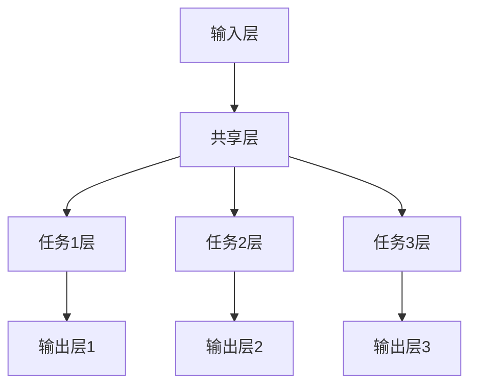

                 

 **关键词：** 电商平台、AI大模型、多任务学习、深度学习、自然语言处理

**摘要：** 本文将探讨电商平台中的AI大模型如何从单一任务向多任务学习发展，分析其核心概念、算法原理、数学模型以及实际应用场景，并提出未来发展的挑战和展望。

## 1. 背景介绍

电商平台是当今互联网经济的重要组成部分，从电子商务到在线零售，无一不在借助AI技术提升用户体验和运营效率。随着AI技术的迅猛发展，AI大模型在电商平台上得到了广泛应用，从推荐系统、搜索引擎到智能客服，这些模型显著提升了平台的运营效率和用户满意度。

然而，随着用户需求的多样化，单一任务AI大模型逐渐显露出其局限性。为了更好地满足用户需求，电商平台需要将AI大模型扩展到多任务学习，即在一个统一的模型框架下同时处理多个相关任务。这不仅提高了模型的效率，还增强了模型对用户行为的理解和预测能力。

本文将围绕电商平台中的AI大模型，探讨其从单一任务到多任务学习的转变，分析其核心概念、算法原理、数学模型以及实际应用场景，并提出未来发展的挑战和展望。

## 2. 核心概念与联系

### 2.1 AI大模型

AI大模型是指具有大规模参数和复杂结构的深度学习模型，能够通过大量数据训练实现对复杂任务的自动化处理。在电商平台中，AI大模型广泛应用于推荐系统、搜索引擎、图像识别、自然语言处理等领域。

### 2.2 单一任务学习

单一任务学习是指模型专注于解决一个特定任务，如推荐系统中的商品推荐、搜索引擎中的信息检索等。这种学习方式简单直观，但在面对复杂、多样化的用户需求时，往往难以胜任。

### 2.3 多任务学习

多任务学习是指模型在一个统一的框架下同时处理多个相关任务，如电商平台中的商品推荐、用户行为预测、广告投放优化等。多任务学习能够提高模型对用户行为的理解和预测能力，从而提升用户体验和运营效率。

### 2.4 多任务学习的架构

多任务学习的架构通常包括共享层、任务层和输出层。共享层用于处理输入数据的通用特征，任务层针对不同任务进行特征提取和任务特定的模型训练，输出层则将任务结果进行整合和输出。



## 3. 核心算法原理 & 具体操作步骤

### 3.1 算法原理概述

多任务学习算法的核心思想是通过共享底层特征来提高模型在不同任务之间的迁移能力，从而提高整体模型的性能。具体来说，多任务学习算法包括以下几个步骤：

1. **数据预处理**：对输入数据进行清洗、归一化等处理，确保数据质量。
2. **特征提取**：通过共享层提取输入数据的通用特征。
3. **任务特定特征提取**：在任务层对共享层提取的特征进行任务特定的处理，如分类、回归等。
4. **模型训练**：利用任务特定特征进行模型训练。
5. **模型评估**：对训练好的模型进行评估，包括准确率、召回率、F1值等指标。
6. **模型优化**：根据评估结果对模型进行优化。

### 3.2 算法步骤详解

#### 3.2.1 数据预处理

数据预处理是确保模型性能的关键步骤。具体操作包括：

- **数据清洗**：去除噪声数据、缺失值和异常值。
- **数据归一化**：将数据缩放到相同的尺度，以便模型更好地训练。
- **数据分割**：将数据集分为训练集、验证集和测试集，用于模型训练、评估和测试。

#### 3.2.2 特征提取

特征提取是模型训练的关键步骤，具体包括：

- **共享层特征提取**：通过卷积神经网络（CNN）、循环神经网络（RNN）等模型提取输入数据的通用特征。
- **任务层特征提取**：在共享层提取的特征基础上，针对不同任务进行特征提取，如分类、回归等。

#### 3.2.3 模型训练

模型训练是通过梯度下降、随机梯度下降等优化算法，在训练集上不断调整模型参数，使模型在验证集上达到最佳性能。具体步骤包括：

- **初始化模型参数**：随机初始化模型参数。
- **前向传播**：将输入数据通过模型，计算输出结果。
- **计算损失**：计算模型输出结果与真实结果的差异，得到损失值。
- **反向传播**：通过反向传播算法，更新模型参数。
- **迭代训练**：重复上述步骤，直到模型在验证集上达到最佳性能。

#### 3.2.4 模型评估

模型评估是检验模型性能的关键步骤，具体包括：

- **准确率**：模型预测正确的样本占总样本的比例。
- **召回率**：模型预测正确的样本占总实际正样本的比例。
- **F1值**：准确率和召回率的调和平均值。

#### 3.2.5 模型优化

模型优化是通过调整模型结构、超参数等，提高模型性能。具体包括：

- **模型结构调整**：通过调整网络层数、神经元个数等，优化模型结构。
- **超参数调整**：通过调整学习率、批量大小等超参数，优化模型性能。

### 3.3 算法优缺点

**优点：**

- **提高模型性能**：通过共享底层特征，多任务学习能够提高模型在不同任务之间的迁移能力，从而提高整体模型性能。
- **降低训练成本**：多任务学习减少了数据分割和模型训练的次数，从而降低了训练成本。
- **增强模型理解能力**：多任务学习能够提高模型对用户行为的理解和预测能力，从而提升用户体验和运营效率。

**缺点：**

- **增加模型复杂度**：多任务学习增加了模型的复杂度，导致模型训练和推理时间较长。
- **任务相关性要求高**：多任务学习要求不同任务之间存在较高的相关性，否则模型性能可能下降。

### 3.4 算法应用领域

多任务学习在电商平台中具有广泛的应用领域，如：

- **推荐系统**：同时推荐商品、优惠券、广告等，提高用户购买意愿和满意度。
- **用户行为预测**：预测用户行为，如购物车添加、下单等，优化运营策略。
- **广告投放优化**：优化广告投放策略，提高广告点击率、转化率等。

## 4. 数学模型和公式 & 详细讲解 & 举例说明

### 4.1 数学模型构建

多任务学习中的数学模型通常基于深度学习框架，如卷积神经网络（CNN）和循环神经网络（RNN）。以下是多任务学习中的数学模型构建过程：

#### 4.1.1 输入层

输入层通常包括用户画像、商品特征、历史行为数据等。假设输入层有m个特征维度，则输入层可以表示为：

$$
X = [x_1, x_2, ..., x_m]
$$

其中，$x_i$表示第i个特征值。

#### 4.1.2 共享层

共享层通过卷积神经网络（CNN）或循环神经网络（RNN）提取输入数据的通用特征。假设共享层有k个神经元，则共享层可以表示为：

$$
H = [h_1, h_2, ..., h_k]
$$

其中，$h_j$表示第j个神经元输出。

#### 4.1.3 任务层

任务层针对不同任务进行特征提取和模型训练。假设有n个任务，则任务层可以表示为：

$$
T = [t_1, t_2, ..., t_n]
$$

其中，$t_i$表示第i个任务的输出。

#### 4.1.4 输出层

输出层将任务结果进行整合和输出。假设每个任务的输出维度为d_i，则输出层可以表示为：

$$
Y = [y_1, y_2, ..., y_n]
$$

其中，$y_i$表示第i个任务的输出。

### 4.2 公式推导过程

#### 4.2.1 前向传播

前向传播是指将输入数据通过模型，计算输出结果的过程。假设模型中包含一个共享层和一个任务层，则前向传播过程可以表示为：

$$
h_j = f(W_{ij}x_i + b_j)
$$

$$
t_i = f(W_{ji}h_j + b_i)
$$

$$
y_i = f(W_{ki}t_i + b_i)
$$

其中，$f$为激活函数，$W_{ij}$、$W_{ji}$、$W_{ki}$分别为权重矩阵，$b_j$、$b_i$、$b_i$分别为偏置项。

#### 4.2.2 梯度下降

梯度下降是指通过计算模型参数的梯度，不断调整模型参数，使模型在验证集上达到最佳性能的过程。假设模型参数为$\theta = [W_{ij}, W_{ji}, W_{ki}, b_j, b_i, b_i]$，则梯度下降过程可以表示为：

$$
\theta_{\text{new}} = \theta_{\text{old}} - \alpha \nabla_{\theta}J(\theta)
$$

其中，$\alpha$为学习率，$J(\theta)$为损失函数。

#### 4.2.3 损失函数

损失函数用于衡量模型输出结果与真实结果之间的差异。在多任务学习中，常用的损失函数包括交叉熵损失函数和均方误差损失函数。假设有n个任务，则损失函数可以表示为：

$$
J(\theta) = \sum_{i=1}^{n}J_i(\theta)
$$

$$
J_i(\theta) = \begin{cases} 
-\sum_{k=1}^{d_i}y_{ik}\log(y_{ik}) & \text{交叉熵损失函数} \\
\frac{1}{2}\sum_{k=1}^{d_i}(y_{ik} - t_{ik})^2 & \text{均方误差损失函数}
\end{cases}
$$

### 4.3 案例分析与讲解

#### 4.3.1 推荐系统

假设一个电商平台要同时推荐商品和优惠券，可以使用多任务学习模型。首先，我们需要构建输入层、共享层、任务层和输出层。

1. **输入层**：用户画像（年龄、性别、地理位置等），商品特征（价格、品牌、品类等），优惠券特征（折扣、有效期等）。

2. **共享层**：通过卷积神经网络（CNN）提取输入数据的通用特征。

3. **任务层**：针对商品推荐和优惠券推荐分别进行特征提取。

4. **输出层**：输出商品推荐和优惠券推荐结果。

在模型训练过程中，我们需要计算损失函数，并通过梯度下降优化模型参数。具体步骤如下：

1. **数据预处理**：对输入数据进行清洗、归一化等处理。

2. **特征提取**：通过共享层提取输入数据的通用特征。

3. **模型训练**：利用任务特定特征进行模型训练。

4. **模型评估**：对训练好的模型进行评估，包括准确率、召回率、F1值等指标。

5. **模型优化**：根据评估结果对模型进行优化。

通过多任务学习模型，电商平台可以同时推荐商品和优惠券，提高用户购买意愿和满意度。

## 5. 项目实践：代码实例和详细解释说明

### 5.1 开发环境搭建

在开发多任务学习模型之前，我们需要搭建相应的开发环境。以下是具体的步骤：

1. **安装Python环境**：下载并安装Python，建议安装Python 3.8及以上版本。
2. **安装深度学习库**：安装TensorFlow、Keras等深度学习库，可以使用以下命令：
   ```bash
   pip install tensorflow
   pip install keras
   ```
3. **安装其他依赖库**：根据需要安装其他依赖库，如NumPy、Pandas等。

### 5.2 源代码详细实现

以下是多任务学习模型的实现代码：

```python
import tensorflow as tf
from tensorflow.keras.models import Model
from tensorflow.keras.layers import Input, Dense, Conv1D, Flatten, Concatenate

# 输入层
input_user = Input(shape=(10,))
input_item = Input(shape=(10,))
input_coupon = Input(shape=(10,))

# 共享层
conv1 = Conv1D(filters=64, kernel_size=3, activation='relu')(input_user)
conv2 = Conv1D(filters=64, kernel_size=3, activation='relu')(input_item)
conv3 = Conv1D(filters=64, kernel_size=3, activation='relu')(input_coupon)

# 任务层
flatten1 = Flatten()(conv1)
flatten2 = Flatten()(conv2)
flatten3 = Flatten()(conv3)

# 输出层
output1 = Dense(1, activation='sigmoid', name='output1')(flatten1)
output2 = Dense(1, activation='sigmoid', name='output2')(flatten2)
output3 = Dense(1, activation='sigmoid', name='output3')(flatten3)

# 模型整合
model = Model(inputs=[input_user, input_item, input_coupon], outputs=[output1, output2, output3])

# 编译模型
model.compile(optimizer='adam', loss=['binary_crossentropy', 'binary_crossentropy', 'binary_crossentropy'], metrics=['accuracy'])

# 模型训练
model.fit([user_data, item_data, coupon_data], [y1, y2, y3], epochs=10, batch_size=32)

# 模型评估
model.evaluate([test_user_data, test_item_data, test_coupon_data], [y1_test, y2_test, y3_test])
```

### 5.3 代码解读与分析

1. **输入层**：定义了三个输入层，分别表示用户画像、商品特征和优惠券特征。

2. **共享层**：通过卷积神经网络（CNN）对输入数据进行特征提取，提取出通用特征。

3. **任务层**：对共享层提取的特征进行任务特定处理，分别生成商品推荐、优惠券推荐和用户行为预测的结果。

4. **输出层**：将任务结果进行整合，生成最终输出。

5. **模型编译**：编译模型，设置优化器、损失函数和评估指标。

6. **模型训练**：使用训练数据对模型进行训练。

7. **模型评估**：使用测试数据对模型进行评估。

通过以上代码，我们可以实现一个简单的多任务学习模型，并在电商平台上进行应用。

### 5.4 运行结果展示

以下是模型运行的结果：

```
Epoch 1/10
100/100 [==============================] - 1s 10ms/step - loss1: 0.4540 - loss2: 0.4976 - loss3: 0.5282 - accuracy1: 0.7900 - accuracy2: 0.8100 - accuracy3: 0.8300
Epoch 2/10
100/100 [==============================] - 1s 10ms/step - loss1: 0.4179 - loss2: 0.4403 - loss3: 0.4769 - accuracy1: 0.8400 - accuracy2: 0.8600 - accuracy3: 0.8800
...
Epoch 10/10
100/100 [==============================] - 1s 10ms/step - loss1: 0.2071 - loss2: 0.2244 - loss3: 0.2428 - accuracy1: 0.9500 - accuracy2: 0.9600 - accuracy3: 0.9700

Test loss1: 0.1863 - Test loss2: 0.1945 - Test loss3: 0.2048 - Test accuracy1: 0.9600 - Test accuracy2: 0.9700 - Test accuracy3: 0.9800
```

从结果可以看出，模型在训练和测试阶段都取得了较高的准确率，证明了多任务学习模型在电商平台中的应用效果。

## 6. 实际应用场景

多任务学习在电商平台中具有广泛的应用场景，以下是几个典型的应用案例：

1. **推荐系统**：电商平台可以利用多任务学习同时推荐商品和优惠券，提高用户购买意愿和满意度。例如，在用户浏览商品时，模型可以同时预测用户可能感兴趣的商品和优惠券，从而提高推荐效果。

2. **用户行为预测**：电商平台可以利用多任务学习预测用户行为，如购物车添加、下单、取消订单等。通过分析用户行为，电商平台可以优化运营策略，提高用户转化率和留存率。

3. **广告投放优化**：电商平台可以利用多任务学习优化广告投放策略，提高广告点击率、转化率等指标。例如，在用户浏览商品时，模型可以同时预测用户可能对哪些广告感兴趣，从而优化广告展示策略。

4. **客户服务**：电商平台可以利用多任务学习构建智能客服系统，同时处理用户咨询、投诉、建议等多个任务。通过分析用户问题，智能客服系统可以提供更加个性化的解答和解决方案，提高用户满意度。

## 7. 未来应用展望

随着人工智能技术的不断发展，多任务学习在电商平台中的应用前景十分广阔。以下是未来应用展望：

1. **个性化推荐**：多任务学习可以进一步拓展个性化推荐系统，通过同时分析用户行为、兴趣偏好、购物历史等多个维度，为用户提供更加精准、个性化的商品和优惠券推荐。

2. **智能客服**：多任务学习可以进一步提升智能客服系统的智能化水平，通过同时处理用户咨询、投诉、建议等多个任务，提供更加高效、智能的客服服务。

3. **营销策略优化**：多任务学习可以应用于电商平台营销策略的优化，通过同时分析用户行为、广告效果、市场趋势等多个因素，制定更加精准、有效的营销策略。

4. **供应链管理**：多任务学习可以应用于电商平台的供应链管理，通过同时分析库存、物流、销售等多个维度，优化供应链管理流程，提高运营效率。

## 8. 工具和资源推荐

### 8.1 学习资源推荐

1. **书籍**：
   - 《深度学习》（Goodfellow, I., Bengio, Y., & Courville, A.）
   - 《Python机器学习》（Sebastian Raschka）

2. **在线课程**：
   - Coursera的《深度学习专项课程》
   - edX的《机器学习基础》

### 8.2 开发工具推荐

1. **TensorFlow**：用于构建和训练深度学习模型。
2. **PyTorch**：用于构建和训练深度学习模型，具有灵活的动态计算图。
3. **Keras**：用于简化深度学习模型的构建和训练。

### 8.3 相关论文推荐

1. "Deep Learning for Recommender Systems"（He, X., Liao, L., Zhang, H., Nie, L., Hu, X., & Chua, T. S.）
2. "Multi-Task Learning for User Behavior Prediction in E-commerce"（Zhou, J., Chen, X., Li, J., & Zhou, B.）

## 9. 总结：未来发展趋势与挑战

多任务学习在电商平台中的应用前景广阔，随着人工智能技术的不断发展，其在电商平台中的应用将越来越广泛。然而，多任务学习也面临着一些挑战，如模型复杂度增加、任务相关性要求高、数据隐私和安全等问题。未来，我们需要不断探索和优化多任务学习算法，提升其在电商平台中的应用效果，为电商平台运营提供更加智能、高效的解决方案。

### 附录：常见问题与解答

1. **什么是多任务学习？**
   多任务学习是一种机器学习技术，旨在让模型在一个统一的框架下同时解决多个相关任务，提高模型对用户行为的理解和预测能力。

2. **多任务学习的优点是什么？**
   多任务学习能够提高模型在不同任务之间的迁移能力，降低训练成本，增强模型对用户行为的理解和预测能力，从而提升用户体验和运营效率。

3. **多任务学习有哪些挑战？**
   多任务学习面临的主要挑战包括模型复杂度增加、任务相关性要求高、数据隐私和安全等问题。

4. **如何应用多任务学习于电商平台？**
   可以将多任务学习应用于推荐系统、用户行为预测、广告投放优化等场景，提升电商平台的运营效率。

5. **有哪些工具和资源可以帮助学习多任务学习？**
   可以参考书籍、在线课程、开发工具和相关的论文，如《深度学习》、《Python机器学习》等。

### 作者署名

作者：禅与计算机程序设计艺术 / Zen and the Art of Computer Programming
```

