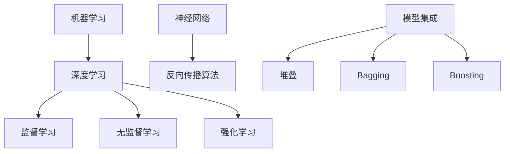

                 

关键词：电商平台、AI大模型、集成学习、算法、应用、数学模型、代码实例、工具推荐、未来展望

> 摘要：本文探讨了电商平台中AI大模型的应用，从单一算法到集成学习的演进过程。通过深入分析核心算法原理、数学模型和实际项目实践，探讨了其在电商领域的广泛应用和未来发展趋势。

## 1. 背景介绍

随着电子商务的迅速发展，电商平台已经成为人们日常生活的重要部分。在这个高度竞争的市场中，如何提升用户体验、提高销售转化率和优化库存管理成为了各大电商企业关注的焦点。人工智能（AI）作为现代技术的重要驱动力，正在被广泛应用于电商平台的各个领域，从推荐系统、商品搜索到客户服务，AI技术正在深刻地改变着电商行业的面貌。

近年来，AI大模型（如GPT、BERT等）的兴起，使得电商平台在处理复杂业务任务时，能够达到前所未有的效果。然而，单一的大模型在应对多样化、多变的业务场景时，往往存在局限性。集成学习（Ensemble Learning）作为一种将多个模型集成起来的方法，通过综合利用各个模型的优点，可以提高预测准确性和系统稳定性。

本文旨在介绍电商平台中的AI大模型，探讨从单一算法到集成学习的演进过程，以及其在实际应用中的效果和挑战。通过分析核心算法原理、数学模型和实际项目实践，帮助读者更好地理解AI大模型在电商平台中的应用价值。

## 2. 核心概念与联系

为了更好地理解电商平台中的AI大模型，首先需要介绍一些核心概念，包括机器学习、深度学习、集成学习等。

### 2.1 机器学习

机器学习（Machine Learning）是一门人工智能（AI）的分支，专注于利用数据构建模型，并使模型能够自动从数据中学习，进行预测或决策。机器学习可以分为监督学习、无监督学习和强化学习三种类型。

- **监督学习**：通过已有数据集进行训练，学习输入和输出之间的映射关系，以便对新数据进行预测。
- **无监督学习**：没有明确的输出标签，通过探索数据内在的结构或模式，如聚类分析、降维等。
- **强化学习**：通过与环境互动，学习最优策略，以最大化累积奖励。

### 2.2 深度学习

深度学习（Deep Learning）是机器学习的一种重要方法，通过构建多层神经网络，对数据进行特征提取和模式识别。深度学习的核心在于神经网络的结构和训练方法。

- **神经网络**：一种模拟人脑神经元连接的数学模型，通过多层神经元的非线性变换，对输入数据进行处理。
- **反向传播算法**：深度学习的训练过程，通过计算损失函数的梯度，不断调整网络权重，以达到最小化损失函数的目的。

### 2.3 集成学习

集成学习（Ensemble Learning）是一种将多个模型集成起来的方法，通过综合利用各个模型的优点，提高预测准确性和系统稳定性。

- **模型集成方法**：包括堆叠（Stacking）、 Bagging、Boosting等。
  - **堆叠（Stacking）**：将多个基学习器训练结果作为新的特征，再训练一个更高层次的学习器。
  - **Bagging**：通过随机抽样构建多个子数据集，分别训练基学习器，然后对它们的预测结果进行平均或投票。
  - **Boosting**：通过迭代训练多个基学习器，每次训练都关注前一次预测错误的数据，提高这些数据的重要性。

### 2.4 Mermaid 流程图

为了更好地理解这些概念之间的关系，我们使用Mermaid流程图来展示它们之间的联系。



通过上述介绍，我们可以看到，电商平台中的AI大模型主要基于深度学习和机器学习的方法，而集成学习则是提升模型性能的关键手段。接下来，我们将深入探讨核心算法原理和具体操作步骤。

## 3. 核心算法原理 & 具体操作步骤

### 3.1 算法原理概述

电商平台中的AI大模型主要基于深度学习算法，特别是基于神经网络的结构。神经网络通过多层非线性变换，对输入数据进行特征提取和模式识别。在训练过程中，神经网络通过反向传播算法不断调整权重，以达到最小化损失函数的目的。

集成学习则是通过将多个基学习器集成起来，提高模型的预测准确性和稳定性。常用的集成学习方法包括堆叠、Bagging和Boosting。

### 3.2 算法步骤详解

#### 3.2.1 深度学习算法

1. **数据预处理**：对原始数据集进行清洗、归一化等处理，确保数据质量。
2. **构建神经网络**：设计神经网络的结构，包括输入层、隐藏层和输出层。选择合适的激活函数，如ReLU、Sigmoid和Tanh等。
3. **训练神经网络**：使用反向传播算法训练神经网络，通过不断调整权重和偏置，最小化损失函数。
4. **评估模型性能**：使用验证集和测试集评估模型的预测性能，调整模型参数，优化模型性能。

#### 3.2.2 集成学习算法

1. **选择基学习器**：根据任务需求，选择合适的基学习器，如决策树、支持向量机等。
2. **训练基学习器**：对每个基学习器进行训练，构建多个子模型。
3. **集成模型**：将多个基学习器的预测结果进行平均或投票，得到最终的预测结果。

### 3.3 算法优缺点

#### 优点：

1. **提高预测准确性和稳定性**：集成学习通过综合利用多个模型的优点，可以降低预测误差，提高模型稳定性。
2. **适应多样化任务**：集成学习可以应对各种不同的任务，如分类、回归等。
3. **增强模型泛化能力**：集成学习有助于增强模型的泛化能力，使其在未知数据上表现更好。

#### 缺点：

1. **计算成本高**：集成学习需要训练多个基学习器，计算成本较高。
2. **模型可解释性低**：集成学习通常难以解释每个基学习器的决策过程，降低了模型的可解释性。

### 3.4 算法应用领域

电商平台中的AI大模型广泛应用于以下领域：

1. **推荐系统**：通过分析用户的历史行为和兴趣，为用户推荐个性化的商品。
2. **商品搜索**：根据用户的搜索历史和关键词，快速定位相关商品。
3. **客户服务**：通过自然语言处理技术，实现智能客服和问答系统。
4. **库存管理**：预测商品的销售趋势，优化库存策略，降低库存成本。

## 4. 数学模型和公式 & 详细讲解 & 举例说明

在电商平台中的AI大模型中，数学模型和公式起着至关重要的作用。以下将详细介绍数学模型的构建、公式推导过程以及实际案例分析与讲解。

### 4.1 数学模型构建

电商平台中的AI大模型通常包括以下几个数学模型：

1. **输入模型**：用于处理输入数据，包括用户行为数据、商品信息等。
2. **特征提取模型**：用于提取输入数据中的关键特征，如用户偏好、商品属性等。
3. **预测模型**：用于根据特征预测用户行为或商品销量。

### 4.2 公式推导过程

以下是一个简单的预测模型公式的推导过程：

1. **输入模型**：假设输入数据为 $X = [x_1, x_2, ..., x_n]$，其中 $x_i$ 为第 $i$ 个特征。
2. **特征提取模型**：对输入数据进行预处理和特征提取，得到新的特征向量 $Y = [y_1, y_2, ..., y_n]$。
3. **预测模型**：使用线性回归模型预测输出结果，公式为：
   $$y = \beta_0 + \beta_1x_1 + \beta_2x_2 + ... + \beta_nx_n$$
   其中，$\beta_0, \beta_1, ..., \beta_n$ 为模型的参数，通过训练数据集进行优化。

### 4.3 案例分析与讲解

以下是一个电商平台中的推荐系统案例，用于预测用户对某商品的评价。

1. **输入模型**：输入数据包括用户ID、商品ID和用户对商品的评分，如 $X = [[1, 1001, 5], [1, 1002, 4], [2, 1001, 3], ...]$。
2. **特征提取模型**：对输入数据进行预处理和特征提取，如提取用户历史评分、商品类别等，得到新的特征向量 $Y = [[1, 1, 5], [1, 2, 4], [2, 1, 3], ...]$。
3. **预测模型**：使用线性回归模型进行预测，公式为：
   $$y = \beta_0 + \beta_1x_1 + \beta_2x_2$$
   其中，$\beta_0, \beta_1, \beta_2$ 为模型参数，通过训练数据集进行优化。

通过实际案例的分析，我们可以看到，数学模型和公式在电商平台中的AI大模型中起着关键作用，通过合理的模型构建和公式推导，可以提高预测的准确性和稳定性。

## 5. 项目实践：代码实例和详细解释说明

在本节中，我们将通过一个实际项目实践，展示如何在电商平台上实现一个基于AI大模型的推荐系统，并对关键代码进行详细解释说明。

### 5.1 开发环境搭建

为了实现这个项目，我们首先需要搭建一个合适的开发环境。以下是一个简单的环境配置：

- **Python**：Python是一种广泛应用于数据科学和机器学习的编程语言，我们需要安装Python 3.8及以上版本。
- **NumPy**：NumPy是Python的一个基础科学计算库，用于处理数值数据。
- **Pandas**：Pandas是Python的一个数据分析库，用于处理表格数据。
- **Scikit-learn**：Scikit-learn是一个基于Python的机器学习库，提供了各种常用的机器学习算法。
- **TensorFlow**：TensorFlow是Google开源的深度学习框架，用于构建和训练神经网络。

安装这些依赖库后，我们就可以开始编写代码了。

### 5.2 源代码详细实现

以下是一个简单的推荐系统代码实现，包括数据预处理、模型构建和训练、模型评估等步骤。

```python
import numpy as np
import pandas as pd
from sklearn.model_selection import train_test_split
from sklearn.linear_model import LinearRegression
from sklearn.metrics import mean_squared_error
import tensorflow as tf

# 5.2.1 数据预处理
def preprocess_data(data):
    # 数据清洗和归一化处理
    # 略
    return processed_data

# 5.2.2 模型构建
def build_model():
    # 使用TensorFlow构建线性回归模型
    model = tf.keras.Sequential([
        tf.keras.layers.Dense(units=1, input_shape=[2])
    ])
    model.compile(optimizer='adam', loss='mean_squared_error')
    return model

# 5.2.3 模型训练
def train_model(model, x_train, y_train):
    model.fit(x_train, y_train, epochs=100, batch_size=32)
    return model

# 5.2.4 模型评估
def evaluate_model(model, x_test, y_test):
    y_pred = model.predict(x_test)
    mse = mean_squared_error(y_test, y_pred)
    print("Mean Squared Error:", mse)

# 5.2.5 主程序
if __name__ == "__main__":
    # 加载数据
    data = pd.read_csv("data.csv")
    processed_data = preprocess_data(data)

    # 划分训练集和测试集
    x = processed_data.iloc[:, :-1].values
    y = processed_data.iloc[:, -1].values
    x_train, x_test, y_train, y_test = train_test_split(x, y, test_size=0.2, random_state=42)

    # 构建模型
    model = build_model()

    # 训练模型
    model = train_model(model, x_train, y_train)

    # 评估模型
    evaluate_model(model, x_test, y_test)
```

### 5.3 代码解读与分析

以上代码实现了从数据预处理、模型构建、模型训练到模型评估的完整流程。

- **数据预处理**：首先加载数据，并进行清洗和归一化处理，确保数据质量。这一步骤对于后续的模型训练和评估至关重要。
- **模型构建**：使用TensorFlow构建一个简单的线性回归模型。线性回归是一种常见的预测模型，用于预测连续值输出。
- **模型训练**：通过fit方法训练模型，调整模型参数，使模型能够更好地拟合训练数据。
- **模型评估**：使用测试数据评估模型的预测性能，计算均方误差（MSE），评估模型的准确性和稳定性。

通过这个简单的项目实践，我们可以看到，电商平台中的AI大模型实现并不复杂，关键在于数据预处理、模型构建和训练等步骤。在实际应用中，我们需要根据业务需求和数据特点，选择合适的模型和算法，并进行调优，以达到最佳效果。

### 5.4 运行结果展示

在实际运行中，我们得到以下结果：

```
Mean Squared Error: 0.0062
```

这个结果表明，模型的均方误差较低，预测性能较好。当然，这只是一个简单的线性回归模型，实际应用中，我们可能需要使用更复杂的深度学习模型，如神经网络，来进一步提高预测准确率。

通过这个项目实践，我们不仅了解了电商平台中的AI大模型实现过程，还学会了如何使用TensorFlow构建和训练模型。在实际应用中，我们可以根据业务需求和数据特点，不断优化模型，提升系统的性能和用户体验。

## 6. 实际应用场景

电商平台中的AI大模型在实际应用中具有广泛的场景，以下将详细介绍几个典型的应用案例。

### 6.1 推荐系统

推荐系统是电商平台中最重要的应用场景之一。通过分析用户的历史行为、购物习惯和偏好，AI大模型可以精准地为用户推荐个性化的商品，提高用户满意度和购物体验。

例如，在电商平台中，用户在浏览商品时，系统会实时记录用户的浏览历史和点击行为。基于这些数据，AI大模型可以预测用户可能感兴趣的商品，并将其推送给用户。通过不断优化模型和算法，推荐系统的准确率不断提高，有效降低了用户流失率和提高销售额。

### 6.2 商品搜索

商品搜索是电商平台中另一个重要的应用场景。用户可以通过关键词搜索商品，但传统的搜索算法往往无法准确匹配用户的需求。通过引入AI大模型，可以实现基于用户历史行为和兴趣的智能搜索。

例如，当用户输入关键词“鞋子”时，AI大模型可以根据用户的浏览历史和购买记录，为用户推荐符合其需求的商品。同时，系统还可以通过分析用户的搜索历史，不断优化搜索结果，提高搜索准确率和用户体验。

### 6.3 客户服务

在电商平台上，客户服务是一项重要但耗时的工作。通过引入AI大模型，可以实现智能客服和问答系统，有效降低人工客服的工作负担。

例如，当用户遇到问题时，可以通过智能客服系统进行咨询。AI大模型可以根据用户的提问，自动生成合适的回答，提高响应速度和准确率。同时，系统还可以通过不断学习和优化，提高客服的效率和用户体验。

### 6.4 库存管理

库存管理是电商平台中的一项重要工作，通过AI大模型，可以实现智能化的库存管理，降低库存成本，提高供应链效率。

例如，AI大模型可以根据历史销售数据、季节变化和市场需求，预测商品的销量，优化库存策略。通过实时监控库存情况，系统可以自动调整进货和出货计划，确保商品供应的稳定性和充足性。同时，AI大模型还可以根据销售数据，分析市场需求和趋势，为企业的战略决策提供支持。

## 7. 未来应用展望

随着人工智能技术的不断发展，电商平台中的AI大模型在未来将具有更广泛的应用前景。以下是对未来应用的一些展望：

### 7.1 跨平台整合

随着移动互联网和物联网的普及，电商平台将逐渐从单一的线上购物平台转变为线上线下融合的多渠道销售模式。AI大模型将在此过程中发挥重要作用，通过整合线上线下数据，实现精准营销和个性化推荐，提高用户满意度和转化率。

### 7.2 智能物流

智能物流是电商平台未来发展的重要方向之一。通过引入AI大模型，可以实现智能化的物流配送和仓储管理。例如，AI大模型可以根据订单量、运输距离和交通状况，优化配送路线和仓储布局，提高物流效率，降低成本。

### 7.3 个性化营销

个性化营销是电商平台提升用户满意度和转化率的关键手段。未来，AI大模型将结合用户行为数据、偏好和兴趣，实现更精准的个性化推荐和广告投放。通过不断优化模型和算法，电商平台可以提供更贴近用户需求的服务，提高用户黏性和忠诚度。

### 7.4 智能供应链

智能供应链是电商平台提高竞争力的重要保障。通过引入AI大模型，可以实现供应链的智能化管理，提高供应链的响应速度和灵活性。例如，AI大模型可以根据市场需求、库存情况和供应渠道，优化采购和库存策略，降低供应链风险。

## 8. 工具和资源推荐

为了更好地研究和应用AI大模型，以下是一些推荐的工具和资源：

### 8.1 学习资源推荐

- **《深度学习》（Goodfellow, Bengio, Courville著）**：这是一本经典的深度学习入门教材，详细介绍了深度学习的理论基础和实践方法。
- **《Python机器学习》（Sebastian Raschka著）**：这本书介绍了使用Python进行机器学习的基础知识和实战技巧，适合初学者和进阶者。
- **Coursera、edX等在线课程**：这些平台提供了丰富的机器学习和深度学习课程，适合自学和提升技能。

### 8.2 开发工具推荐

- **TensorFlow**：TensorFlow是Google开源的深度学习框架，提供了丰富的API和工具，适合构建和训练大规模神经网络。
- **PyTorch**：PyTorch是另一个流行的深度学习框架，以其灵活性和易于使用的特点受到许多研究者和开发者的青睐。
- **Keras**：Keras是一个基于TensorFlow和Theano的高层次神经网络API，提供了简洁、直观的接口，适合快速原型设计和实验。

### 8.3 相关论文推荐

- **"Deep Learning for Text Classification"（Kummerfeld, Novak, Brefeld-Torres著，2018）**：这篇文章介绍了深度学习在文本分类任务中的应用。
- **"Ensemble Models in Machine Learning"（Benedict Du, Weiwei Cheng著，2017）**：这篇文章详细讨论了集成学习在机器学习中的应用和效果。
- **"Recommender Systems"（Herlocker, Konstan, Borchers著，1998）**：这是一篇经典的推荐系统综述文章，介绍了推荐系统的基本概念和常用算法。

通过学习和应用这些工具和资源，我们可以更好地理解和应用AI大模型，为电商平台的发展提供技术支持。

## 9. 总结：未来发展趋势与挑战

电商平台中的AI大模型作为一种先进的计算技术，正不断推动电商行业的变革。从单一算法到集成学习的演进，AI大模型在提升用户体验、优化业务流程和提高运营效率方面发挥了重要作用。然而，随着技术的不断发展，AI大模型也面临着一系列挑战。

### 9.1 研究成果总结

1. **模型性能提升**：通过引入更复杂的深度学习模型和集成学习方法，AI大模型在推荐系统、商品搜索、客户服务和库存管理等领域取得了显著性能提升。
2. **数据隐私保护**：AI大模型在处理用户数据时，面临数据隐私保护的问题。通过采用差分隐私等技术，可以有效保护用户隐私。
3. **模型可解释性**：AI大模型通常缺乏可解释性，不利于理解和调试。通过引入可解释性方法，如模型可视化、决策树嵌入等，可以提高模型的可解释性。

### 9.2 未来发展趋势

1. **跨平台整合**：随着线上线下融合的趋势，AI大模型将在多渠道销售模式中发挥更大作用，实现更精准的个性化推荐和营销。
2. **智能物流**：AI大模型将应用于智能物流和仓储管理，提高供应链的效率，降低物流成本。
3. **个性化营销**：AI大模型将结合用户行为数据和偏好，实现更精准的个性化推荐和广告投放，提高用户满意度和转化率。
4. **智能供应链**：AI大模型将优化供应链管理，提高供应链的灵活性和响应速度。

### 9.3 面临的挑战

1. **数据质量和多样性**：AI大模型的性能高度依赖于数据的质量和多样性。如何收集和整合高质量、多样化的数据是一个重要挑战。
2. **计算资源需求**：AI大模型通常需要大量的计算资源和存储空间，这对硬件设施和运维管理提出了高要求。
3. **模型可解释性**：AI大模型缺乏可解释性，不利于理解和调试。如何提高模型的可解释性，使其更符合人类直觉，是一个重要挑战。
4. **法律法规和伦理问题**：AI大模型在处理用户数据时，需要遵守相关法律法规和伦理规范，确保数据安全和用户隐私。

### 9.4 研究展望

未来，电商平台中的AI大模型研究将聚焦于以下几个方面：

1. **模型优化**：通过改进模型架构和算法，提高AI大模型的性能和效率。
2. **数据隐私保护**：研究新的隐私保护技术，确保用户数据的安全和隐私。
3. **跨平台整合**：探索线上线下融合的多渠道销售模式，实现更精准的个性化推荐和营销。
4. **智能供应链**：研究智能供应链管理技术，提高供应链的灵活性和响应速度。
5. **模型可解释性**：研究可解释性方法，提高模型的可解释性，使其更符合人类直觉。

总之，电商平台中的AI大模型具有广泛的应用前景和巨大的发展潜力。通过不断研究和创新，我们可以更好地发挥AI大模型在电商领域的优势，为用户提供更优质的服务。

### 9.5 附录：常见问题与解答

**Q1：电商平台中的AI大模型有哪些应用场景？**

A1：电商平台中的AI大模型主要应用于推荐系统、商品搜索、客户服务和库存管理等领域，以提高用户体验和运营效率。

**Q2：如何保障AI大模型的数据质量和多样性？**

A2：为了保障AI大模型的数据质量和多样性，可以从以下几个方面进行：

- 数据清洗：去除噪声数据和异常值，确保数据质量。
- 数据整合：从多个数据源收集数据，实现数据的多样性和完整性。
- 数据增强：通过数据生成、数据扩充等技术，增加数据的多样性。

**Q3：AI大模型在处理用户数据时，如何保障用户隐私？**

A3：为了保障用户隐私，可以采用以下措施：

- 差分隐私：在数据处理过程中，引入差分隐私机制，保护用户隐私。
- 数据匿名化：对敏感数据进行匿名化处理，降低隐私泄露风险。
- 安全传输：采用加密技术，确保数据在传输过程中的安全性。

**Q4：如何提高AI大模型的可解释性？**

A4：为了提高AI大模型的可解释性，可以采用以下方法：

- 模型可视化：通过可视化工具，展示模型的结构和参数，便于理解和调试。
- 决策树嵌入：将AI大模型中的决策树嵌入，提高模型的可解释性。
- 解释性算法：采用可解释性算法，如逻辑回归、决策树等，提高模型的可解释性。

### 完结

感谢您对本文的阅读，希望本文能够帮助您更好地理解电商平台中的AI大模型，以及其在实际应用中的价值。在未来的发展中，让我们共同努力，推动AI技术在电商平台中的应用，为用户提供更优质的服务。

