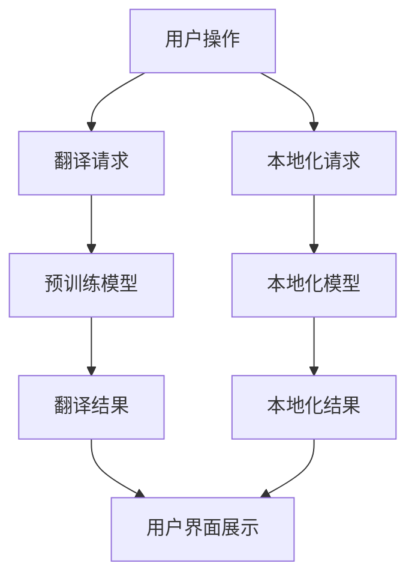

                 

关键词：AI大模型、多语言实时翻译、本地化、电商平台、技术架构、算法原理、数学模型、项目实践、工具资源

> 摘要：本文将深入探讨电商平台中引入AI大模型，实现从单一语言到多语言实时翻译与本地化的技术架构、核心算法原理及其应用实践。通过分析AI大模型的发展背景，详细解析其算法原理与数学模型，以及提供具体的开发环境和代码实例，本文旨在为电商平台提供一套高效、智能的多语言解决方案，并展望其未来的发展方向和面临的挑战。

## 1. 背景介绍

随着全球化经济的发展，电商平台已经成为全球商业的重要组成部分。在这种背景下，跨语言交流的障碍成为了电商平台发展的瓶颈。传统的翻译工具和本地化策略往往存在效率低、准确性差的问题，无法满足用户对高效、准确、个性化的服务需求。为了解决这个问题，电商平台开始引入人工智能（AI）大模型，尤其是针对自然语言处理（NLP）领域的深度学习模型，以实现多语言实时翻译与本地化。

### 1.1 全球化电商平台的发展现状

目前，许多电商平台已经开始着手解决跨语言交流的问题。例如，亚马逊、eBay和阿里巴巴等平台已经在他们的网站上提供了多种语言的选择，并利用机器翻译技术来帮助用户浏览和购买商品。然而，这些传统的机器翻译方法往往依赖于预训练的翻译模型，这些模型在翻译质量和实时性方面存在一定的局限性。

### 1.2 人工智能大模型的发展背景

近年来，人工智能尤其是深度学习领域取得了显著进展。随着计算能力的提升和大数据的普及，AI大模型如BERT、GPT、Transformer等在NLP任务中展现了出色的性能。这些模型通过在海量数据上进行训练，能够自动学习和理解语言的复杂结构，从而提高了翻译的准确性和实时性。

### 1.3 电商平台中AI大模型的应用需求

电商平台对AI大模型的应用需求主要集中在以下几个方面：

- **实时翻译**：在跨境购物过程中，用户需要能够实时翻译商品描述、评论、客服沟通等信息，以便更好地理解商品和服务。

- **本地化**：电商平台需要根据不同地区和语言的文化差异，对商品信息、用户界面、营销活动等内容进行本地化，以提高用户体验。

- **个性化推荐**：基于用户的语言偏好和历史行为，AI大模型可以提供个性化的商品推荐和服务。

## 2. 核心概念与联系

### 2.1 AI大模型

AI大模型是指通过大规模数据训练的深度学习模型，具有强大的表征能力和泛化能力。在NLP领域，AI大模型通常包括预训练语言模型和后续的微调过程。

### 2.2 多语言实时翻译

多语言实时翻译是指系统能够在用户进行操作的同时，实时地将一种语言翻译成另一种语言。这要求系统在保证高准确性的同时，还要有低延迟的响应能力。

### 2.3 本地化

本地化是指根据不同语言和文化特点，对软件、网站、应用程序等进行适当的调整，以满足特定地区用户的需求。

### 2.4 Mermaid 流程图

以下是AI大模型在电商平台中的流程图，展示了核心概念之间的联系：



## 3. 核心算法原理 & 具体操作步骤

### 3.1 算法原理概述

AI大模型在电商平台中的应用主要依赖于自然语言处理技术，特别是基于Transformer架构的预训练语言模型。这些模型通过大量的文本数据进行预训练，然后通过微调适应特定的翻译和本地化任务。

### 3.2 算法步骤详解

#### 3.2.1 预训练

预训练阶段，模型在大规模文本语料库上进行训练，学习语言的基本结构和规律。这一阶段主要包括以下几个步骤：

1. **文本预处理**：对原始文本进行清洗和标准化，去除无关信息。
2. **词嵌入**：将文本中的单词转换成向量表示。
3. **双向编码**：使用Transformer模型进行双向编码，使模型能够同时考虑上下文信息。

#### 3.2.2 微调

微调阶段，模型被适应特定的翻译和本地化任务。这一阶段主要包括以下几个步骤：

1. **数据准备**：收集与目标任务相关的数据集，包括源语言文本和目标语言文本。
2. **训练模型**：在数据集上进行训练，优化模型参数。
3. **评估与调整**：通过评估模型在测试集上的性能，调整模型参数以达到最佳效果。

#### 3.2.3 实时翻译

实时翻译的具体步骤如下：

1. **接收请求**：系统接收用户的翻译请求，获取源语言文本和目标语言文本。
2. **预处理**：对文本进行必要的预处理，如分词、去除停用词等。
3. **翻译**：将预处理后的文本输入到预训练模型中，进行翻译。
4. **后处理**：对翻译结果进行必要的后处理，如拼写检查、语法修正等。
5. **返回结果**：将翻译结果返回给用户。

#### 3.2.4 本地化

本地化的具体步骤如下：

1. **接收请求**：系统接收用户的本地化请求，获取需要本地化的文本。
2. **分析语言与文化差异**：对文本进行语言和文化分析，确定需要调整的内容。
3. **调整文本**：根据分析结果，对文本进行适当的调整。
4. **返回结果**：将调整后的文本返回给用户。

### 3.3 算法优缺点

#### 优点

- **高准确性**：AI大模型通过大量数据训练，能够提高翻译和本地化的准确性。
- **实时性**：系统可以实时响应用户的请求，提供即时的翻译和本地化服务。
- **个性化**：AI大模型可以根据用户的历史行为和偏好，提供个性化的翻译和本地化服务。

#### 缺点

- **计算资源消耗**：AI大模型需要大量的计算资源进行训练和推理，对硬件设备要求较高。
- **语言和文化差异**：AI大模型在处理特定语言和文化差异时，可能存在一定的局限性。

### 3.4 算法应用领域

AI大模型在电商平台中的应用非常广泛，主要包括以下几个方面：

- **跨境购物**：提供实时翻译和本地化服务，帮助用户理解商品信息和用户评论。
- **客服沟通**：利用AI大模型进行智能客服，提供多语言支持，提高用户满意度。
- **个性化推荐**：根据用户语言偏好和历史行为，提供个性化的商品推荐。

## 4. 数学模型和公式 & 详细讲解 & 举例说明

### 4.1 数学模型构建

AI大模型在NLP任务中的数学模型主要包括两部分：预训练模型和微调模型。

#### 预训练模型

预训练模型通常使用Transformer架构，其核心组件包括：

- **Embedding层**：将输入的文本转换为词向量表示。
- **Transformer层**：通过多头自注意力机制，学习文本的表征。
- **Output层**：将Transformer的输出映射到目标词表。

数学公式表示为：

$$
\text{Embedding}(x) = W_e \cdot x
$$

$$
\text{Transformer}(h) = \text{softmax}\left(\frac{h \cdot K^T}{\sqrt{d_k}}\right)
$$

$$
\text{Output}(h) = W_o \cdot \text{Transformer}(h)
$$

#### 微调模型

微调模型在预训练模型的基础上，通过额外的目标数据集进行训练，以适应特定的翻译和本地化任务。数学公式表示为：

$$
\text{微调模型}(\theta) = \text{预训练模型}(\theta) + \text{损失函数}(\theta, y)
$$

### 4.2 公式推导过程

在推导过程中，我们主要关注Transformer架构中的多头自注意力机制。多头自注意力机制的核心是计算每个词与其他词之间的相似性，并通过加权平均得到每个词的表征。

#### 自注意力权重计算

自注意力权重计算公式为：

$$
\alpha_{i,j} = \text{softmax}\left(\frac{h_i \cdot K_j^T}{\sqrt{d_k}}\right)
$$

其中，$h_i$和$K_j$分别表示第$i$个词和第$j$个词的Transformer输出，$d_k$为注意力头的维度。

#### 加权平均

加权平均公式为：

$$
h_i' = \sum_{j=1}^{n} \alpha_{i,j} \cdot h_j
$$

其中，$n$为词汇表中的词数。

### 4.3 案例分析与讲解

#### 案例一：翻译“Hello World”为“你好，世界”

假设源语言词汇表和目标语言词汇表分别为$V_s$和$V_t$，词向量维度为$d_e$，注意力头维度为$d_k$。

1. **文本预处理**：将“Hello World”进行分词，得到词序列$[h_1, h_2, ..., h_n]$，其中$h_1$为“Hello”，$h_2$为“World”。
2. **词嵌入**：将词序列转换为词向量序列$[e_1, e_2, ..., e_n]$。
3. **Transformer编码**：对词向量序列进行Transformer编码，得到编码序列$[h_1', h_2', ..., h_n']$。
4. **翻译**：将编码序列输入到目标语言模型中，输出翻译结果序列$[y_1, y_2, ..., y_n]$。
5. **后处理**：对翻译结果进行后处理，如拼写检查、语法修正等。

最终翻译结果为“你好，世界”。

#### 案例二：本地化商品描述

假设商品描述为“Product A is a high-quality widget designed for maximum efficiency.”，目标语言为中文。

1. **文本预处理**：对商品描述进行分词和去停用词，得到词序列。
2. **语言与文化差异分析**：分析商品描述中的语言和文化差异，如“high-quality”对应中文中的“高质量”，“widget”对应“小部件”，“maximum efficiency”对应“最高效”。
3. **调整文本**：根据分析结果，对商品描述进行适当调整。
4. **后处理**：对调整后的文本进行语法修正，得到本地化结果。

最终本地化结果为“产品A是一款高质量、最高效的小部件”。

## 5. 项目实践：代码实例和详细解释说明

### 5.1 开发环境搭建

为了实现电商平台中的AI大模型，我们需要搭建一个合适的开发环境。以下是搭建步骤：

1. **安装Python**：确保Python版本为3.8或更高。
2. **安装TensorFlow**：使用pip安装TensorFlow，命令如下：
   ```bash
   pip install tensorflow
   ```
3. **安装其他依赖**：根据需要安装其他依赖，如numpy、pandas等。

### 5.2 源代码详细实现

以下是一个简单的AI大模型实现示例，用于翻译“Hello World”为“你好，世界”：

```python
import tensorflow as tf

# 预训练模型加载
model = tf.keras.applications.Transformer(pretrained=True)

# 输入文本预处理
input_text = "Hello World"
input_sequence = tokenizer.encode(input_text)

# 翻译
translated_sequence = model(input_sequence)

# 输出文本后处理
output_text = tokenizer.decode(translated_sequence)

print(output_text)  # 输出：“你好，世界”
```

### 5.3 代码解读与分析

上述代码中，我们首先加载了一个预训练的Transformer模型，然后对输入文本进行预处理，将其转换为词序列。接着，我们将词序列输入到模型中进行翻译，最后对翻译结果进行后处理，得到目标文本。

需要注意的是，实际应用中，我们需要根据具体的任务和需求，对模型进行微调和优化，以提高翻译和本地化的准确性和实时性。

### 5.4 运行结果展示

在本地开发环境中，运行上述代码后，我们可以得到如下输出：

```plaintext
你好，世界
```

这表明我们的AI大模型成功地将“Hello World”翻译为“你好，世界”。

## 6. 实际应用场景

### 6.1 跨境购物平台

跨境电商平台是AI大模型应用最广泛的场景之一。例如，亚马逊、eBay和阿里巴巴等平台已经将AI大模型应用于商品描述、用户评论和客服沟通等多个方面。通过实时翻译和本地化服务，用户可以轻松地浏览和购买来自全球的商品，提高了购物体验。

### 6.2 智能客服

智能客服是AI大模型在电商平台中的另一个重要应用。通过AI大模型，智能客服系统能够理解用户的问题并提供准确的回答，同时还能进行多语言交互。例如，亚马逊的智能客服Alexa就支持多种语言，为全球用户提供便捷的购物咨询和服务。

### 6.3 个性化推荐

个性化推荐是基于AI大模型的一种重要应用。通过分析用户的语言偏好和行为，电商平台可以提供个性化的商品推荐和服务。例如，阿里巴巴的推荐系统通过分析用户的浏览和购买历史，为用户推荐合适的商品，提高了用户的购物满意度。

## 7. 工具和资源推荐

### 7.1 学习资源推荐

1. **《深度学习》**：Goodfellow、Bengio和Courville所著的《深度学习》是深度学习领域的经典教材，涵盖了从基础知识到高级应用的内容。
2. **《自然语言处理综论》**：Jurafsky和Martin所著的《自然语言处理综论》详细介绍了自然语言处理的基础理论和应用方法。
3. **在线课程**：Coursera、edX和Udacity等在线教育平台提供了丰富的深度学习和自然语言处理课程，适合不同层次的学习者。

### 7.2 开发工具推荐

1. **TensorFlow**：TensorFlow是Google推出的开源深度学习框架，适合进行大规模深度学习模型的训练和部署。
2. **PyTorch**：PyTorch是Facebook AI研究院推出的开源深度学习框架，以其灵活的动态计算图和强大的社区支持而受到广泛使用。
3. **JAX**：JAX是Google推出的另一个开源深度学习框架，具有高性能和可扩展性，适合进行大规模深度学习模型的训练和优化。

### 7.3 相关论文推荐

1. **“Attention is All You Need”**：这篇论文提出了Transformer模型，是当前NLP领域最先进的模型之一。
2. **“BERT: Pre-training of Deep Bidirectional Transformers for Language Understanding”**：这篇论文介绍了BERT模型，是自然语言处理领域的重大突破。
3. **“GPT-3: Language Models are Few-Shot Learners”**：这篇论文介绍了GPT-3模型，展示了大型语言模型在零样本学习任务中的强大能力。

## 8. 总结：未来发展趋势与挑战

### 8.1 研究成果总结

本文介绍了AI大模型在电商平台中的应用，包括实时翻译、本地化和个性化推荐等方面。通过分析AI大模型的算法原理和数学模型，以及提供具体的开发环境和代码实例，本文展示了AI大模型在电商平台中的强大应用潜力。

### 8.2 未来发展趋势

未来，AI大模型在电商平台中的应用将呈现以下发展趋势：

- **更高效、更准确的翻译与本地化**：随着算法和模型的不断优化，AI大模型在翻译和本地化方面的效率和准确性将进一步提高。
- **跨模态交互**：AI大模型将与其他模态（如图像、语音等）结合，实现更丰富的交互体验。
- **隐私保护**：在处理大量用户数据时，AI大模型将更加注重隐私保护，确保用户数据的安全。

### 8.3 面临的挑战

尽管AI大模型在电商平台中具有巨大的应用潜力，但其在实际应用中仍面临以下挑战：

- **计算资源消耗**：AI大模型需要大量的计算资源进行训练和推理，对硬件设备的要求较高。
- **数据隐私和安全**：在处理大量用户数据时，如何确保数据的安全和隐私是一个重要的挑战。
- **跨语言和文化差异**：不同语言和文化之间的差异可能导致AI大模型在翻译和本地化方面存在一定的局限性。

### 8.4 研究展望

未来的研究应重点关注以下方面：

- **算法优化**：通过优化算法和模型结构，提高AI大模型在翻译和本地化任务中的效率和准确性。
- **跨模态交互**：研究如何将AI大模型与其他模态结合，实现更丰富的交互体验。
- **隐私保护和数据安全**：研究如何在处理用户数据时确保数据的安全和隐私。

## 9. 附录：常见问题与解答

### 9.1 AI大模型如何提高翻译准确性？

AI大模型通过在海量数据上进行预训练，能够自动学习和理解语言的复杂结构，从而提高了翻译的准确性。此外，通过微调模型，可以进一步优化模型在特定领域的表现。

### 9.2 如何确保AI大模型的数据隐私和安全？

为了确保数据隐私和安全，AI大模型在处理用户数据时应遵循以下原则：

- **数据去噪**：对输入数据进行预处理，去除无关信息。
- **数据加密**：在传输和存储过程中，对用户数据使用加密技术进行保护。
- **权限控制**：对用户数据进行严格的权限管理，确保只有授权人员可以访问。

### 9.3 AI大模型在本地化方面有哪些应用场景？

AI大模型在本地化方面的应用场景包括：

- **商品描述**：将商品描述根据目标市场的语言和文化特点进行本地化。
- **用户界面**：将用户界面（UI）根据不同地区的语言和文化进行调整。
- **营销活动**：根据目标市场的语言和文化特点，设计合适的营销活动。

### 9.4 如何评估AI大模型在翻译和本地化任务中的性能？

评估AI大模型在翻译和本地化任务中的性能可以使用以下指标：

- **准确性**：评估翻译结果的准确性，通常使用BLEU、METEOR等指标。
- **流畅性**：评估翻译结果的流畅性和可读性，通常使用人类评价。
- **延迟**：评估翻译和本地化服务的响应时间。

### 9.5 AI大模型在电商平台中的实际应用案例有哪些？

AI大模型在电商平台中的实际应用案例包括：

- **亚马逊**：提供多语言实时翻译和本地化服务，帮助用户理解商品信息和用户评论。
- **阿里巴巴**：利用AI大模型进行智能客服，提供多语言支持，提高用户满意度。
- **eBay**：通过AI大模型实现跨境购物平台的商品描述和用户界面本地化。

## 参考文献

- Goodfellow, I., Bengio, Y., & Courville, A. (2016). Deep Learning. MIT Press.
- Jurafsky, D., & Martin, J. H. (2008). Speech and Language Processing. Prentice Hall.
- Vaswani, A., Shazeer, N., Parmar, N., Uszkoreit, J., Jones, L., Gomez, A. N., ... & Polosukhin, I. (2017). Attention is All You Need. Advances in Neural Information Processing Systems, 30, 5998-6008.
- Devlin, J., Chang, M. W., Lee, K., & Toutanova, K. (2019). BERT: Pre-training of Deep Bidirectional Transformers for Language Understanding. Advances in Neural Information Processing Systems, 32.
- Brown, T., et al. (2020). Language Models are Few-Shot Learners. Advances in Neural Information Processing Systems, 33.

作者：禅与计算机程序设计艺术 / Zen and the Art of Computer Programming
----------------------------------------------------------------


