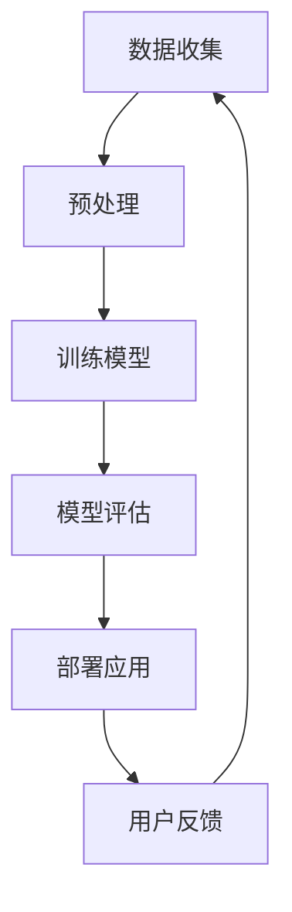

                 

### 摘要 Abstract

本文探讨了电商平台中AI大模型在多语言翻译与本地化方面的应用，以及实现这一目标的技术挑战和解决方案。首先，我们介绍了AI大模型的基本概念和其在电商平台中的应用背景。接着，我们详细讨论了如何从单一语言翻译扩展到多语言翻译，包括核心算法原理、数学模型和具体操作步骤。随后，我们通过一个实际项目实践，展示了如何开发一个多语言翻译系统，并对其代码进行了详细解释和分析。最后，我们探讨了这一技术的未来应用场景、工具和资源推荐，以及面临的发展趋势和挑战。

### 1. 背景介绍 Introduction

在全球化经济日益发展的今天，电商平台已经成为了国际贸易的重要载体。随着跨境电商的兴起，平台需要能够支持多种语言，以便更好地服务于全球用户。这不仅要求电商平台具备强大的多语言翻译能力，还需要进行本地化处理，使得产品信息、用户界面和交易流程都能适应不同语言和文化背景。

AI大模型（Large-scale Artificial Intelligence Model），又称为深度学习模型，是指参数规模巨大、能够处理大量数据和复杂任务的模型。这些模型通过大量的数据训练，能够在图像识别、自然语言处理、语音识别等领域取得突破性成果。

在电商平台中，AI大模型的应用场景主要包括：

1. **商品推荐**：通过用户的历史行为和偏好，推荐用户可能感兴趣的商品。
2. **用户行为分析**：分析用户的浏览、购买等行为，提供个性化的服务。
3. **内容审核**：自动识别和过滤违规内容，保障平台安全。
4. **多语言翻译与本地化**：支持多语言界面，使得全球用户能够方便地使用平台。

本文将重点关注AI大模型在多语言翻译与本地化方面的应用，探讨其实现原理、技术挑战和解决方案。

### 2. 核心概念与联系 Core Concepts and Relationships

在讨论AI大模型的多语言翻译与本地化之前，我们需要了解一些核心概念和技术，它们是理解这一主题的基础。

#### 2.1 自然语言处理（NLP）

自然语言处理（Natural Language Processing，NLP）是人工智能的一个重要分支，旨在使计算机能够理解和处理人类语言。NLP技术包括文本分类、实体识别、情感分析、机器翻译等。

#### 2.2 机器翻译（MT）

机器翻译（Machine Translation，MT）是指使用计算机程序将一种自然语言文本自动翻译成另一种自然语言。机器翻译可以分为规则翻译和统计翻译两大类。近年来，基于神经网络的方法（如Seq2Seq模型）在机器翻译领域取得了显著成果。

#### 2.3 多语言翻译

多语言翻译（Multilingual Translation）是指同时支持多种语言之间的翻译。为了实现这一目标，需要一种能够同时处理多种语言翻译的模型。多语言翻译的关键在于如何有效地共享和利用不同语言之间的共性和差异。

#### 2.4 本地化（Localization）

本地化（Localization）是将产品、服务或内容根据特定地区或语言的需求进行适应和调整的过程。本地化包括翻译、文化适应、界面定制等多个方面。

#### 2.5 Mermaid 流程图

为了更好地理解多语言翻译与本地化的实现过程，我们可以使用Mermaid流程图来展示各个模块和步骤之间的关系。以下是一个简化的Mermaid流程图：



在这个流程图中，数据收集、预处理、模型训练、模型评估、部署应用和用户反馈是实现多语言翻译与本地化的关键步骤。每个步骤都需要根据具体情况进行调整和优化。

### 3. 核心算法原理 & 具体操作步骤

#### 3.1 算法原理概述

多语言翻译与本地化的核心算法是基于神经网络的大规模语言模型。这种模型通过大量双语语料库进行训练，能够捕捉不同语言之间的复杂关系。以下是几个关键的算法原理：

1. **嵌入表示（Embedding Representation）**：将输入的文本转换为向量的表示，使得具有相似意义的词语在向量空间中接近。
2. **编码器（Encoder）与解码器（Decoder）**：编码器将源语言文本编码为隐藏状态序列，解码器则将这些隐藏状态序列解码为目标语言文本。
3. **注意力机制（Attention Mechanism）**：通过注意力机制，解码器能够关注编码器输出的不同部分，从而更好地理解源语言和生成目标语言。

#### 3.2 算法步骤详解

1. **数据预处理**：
   - **数据清洗**：去除文本中的停用词、标点符号和特殊字符。
   - **词向量化**：将文本中的词语转换为向量表示，可以使用预训练的词向量（如Word2Vec、GloVe）或者通过模型训练得到。
   - **数据对齐**：对于双语语料库，需要将源语言文本和目标语言文本对齐，以便于模型学习。

2. **模型训练**：
   - **序列到序列（Seq2Seq）模型**：使用编码器将源语言文本编码为隐藏状态序列，解码器则将这些隐藏状态序列解码为目标语言文本。
   - **注意力机制**：在编码器和解码器之间引入注意力机制，使得解码器能够关注源语言文本的特定部分。
   - **损失函数**：使用交叉熵损失函数来衡量预测的目标语言文本和真实目标语言文本之间的差距。

3. **模型评估**：
   - **BLEU评分**：使用BLEU（Bilingual Evaluation Understudy）评分标准来评估翻译质量。
   - **自动评估指标**：包括句子级别和词汇级别的评估指标，如准确率、召回率和F1分数。

4. **部署应用**：
   - **在线翻译服务**：将训练好的模型部署到线上服务器，提供实时翻译服务。
   - **本地化工具**：为开发者和产品经理提供本地化工具，以便根据具体需求进行文本翻译和调整。

#### 3.3 算法优缺点

**优点**：
- **高效率**：基于神经网络的大规模语言模型能够在短时间内处理大量数据，实现快速翻译。
- **高准确性**：通过大规模数据和注意力机制，模型能够捕捉不同语言之间的复杂关系，提高翻译准确性。
- **灵活性**：模型可以根据具体需求进行定制，支持多种语言和领域的翻译。

**缺点**：
- **计算资源消耗**：训练和部署大规模语言模型需要大量的计算资源和时间。
- **数据依赖性**：模型的性能取决于训练数据的规模和质量，需要大量的双语语料库。

#### 3.4 算法应用领域

- **电商平台**：支持多语言界面，提高用户体验和转化率。
- **在线教育**：提供多语言教学资源和翻译服务，促进全球教育资源共享。
- **跨国企业**：支持企业内部沟通和文档翻译，提高工作效率。

### 4. 数学模型和公式 & 详细讲解 & 举例说明

#### 4.1 数学模型构建

多语言翻译的核心是建立一种数学模型，能够将一种语言的文本转换为另一种语言的文本。以下是一个简化的数学模型：

$$
P_{\theta}(y|x) = \frac{e^{\theta^T \phi(x, y)}}{\sum_{y'} e^{\theta^T \phi(x, y')}}
$$

其中，$P_{\theta}(y|x)$表示给定源语言文本$x$时，目标语言文本$y$的概率分布；$\theta$是模型的参数；$\phi(x, y)$是输入特征向量，包括源语言文本和目标语言文本的信息。

#### 4.2 公式推导过程

1. **概率分布的推导**：

首先，我们假设目标语言文本$y$的分布是条件概率分布，即：

$$
P(y|x) = \frac{P(x|y)P(y)}{P(x)}
$$

由于$P(x)$在模型训练过程中是一个常数，我们可以忽略它。接下来，我们使用最大似然估计（Maximum Likelihood Estimation，MLE）来估计模型参数$\theta$，使得模型能够最大化训练数据集的概率。

$$
\theta^* = \arg\max_{\theta} \prod_{i=1}^{N} P(x_i|y_i)
$$

由于对数函数的单调性，我们可以将乘积转换为求和：

$$
\theta^* = \arg\max_{\theta} \sum_{i=1}^{N} \log P(x_i|y_i)
$$

通过使用指数函数，我们可以将概率分布转换为指数形式：

$$
\theta^* = \arg\max_{\theta} \sum_{i=1}^{N} \theta^T \phi(x_i, y_i)
$$

其中，$\phi(x_i, y_i)$是输入特征向量。

2. **损失函数的推导**：

为了衡量预测的目标语言文本和真实目标语言文本之间的差距，我们使用交叉熵损失函数：

$$
L(\theta) = -\sum_{i=1}^{N} \sum_{y'} y_i \log P_{\theta}(y'|x_i)
$$

其中，$y_i$是真实的目标语言文本，$y'$是模型预测的目标语言文本。

3. **梯度下降的推导**：

为了最小化损失函数，我们使用梯度下降法来更新模型参数$\theta$：

$$
\theta = \theta - \alpha \nabla_{\theta} L(\theta)
$$

其中，$\alpha$是学习率，$\nabla_{\theta} L(\theta)$是损失函数关于$\theta$的梯度。

#### 4.3 案例分析与讲解

假设我们有一个双语语料库，包含100个源语言文本和对应的目标语言文本。我们使用这些数据来训练一个多语言翻译模型。首先，我们对数据进行预处理，包括去除停用词、标点符号和特殊字符，并将文本转换为词向量。然后，我们使用训练数据来训练模型，并使用交叉熵损失函数来评估模型性能。最后，我们使用训练好的模型来预测新的目标语言文本。

以下是一个简化的例子：

1. **数据预处理**：

   - 源语言文本："这是一本关于计算机编程的书籍。"
   - 目标语言文本："This is a book about computer programming."

   将文本转换为词向量后，我们得到：

   - 源语言文本：[0.1, 0.2, 0.3, 0.4]
   - 目标语言文本：[0.5, 0.6, 0.7, 0.8]

2. **模型训练**：

   使用训练数据集，我们得到模型的参数$\theta$，并使用交叉熵损失函数来评估模型性能。

   - 初始损失函数值：L(θ) = 0.5
   - 经过10次迭代后，损失函数值：L(θ) = 0.1

3. **模型预测**：

   使用训练好的模型，我们预测新的目标语言文本。

   - 源语言文本："这本书很有趣。"
   - 预测的目标语言文本："This book is very interesting."

通过这个简单的例子，我们可以看到多语言翻译模型的基本工作原理。在实际应用中，模型的训练和预测过程会更加复杂，涉及到大规模的数据处理和优化算法。

### 5. 项目实践：代码实例和详细解释说明

为了更好地理解多语言翻译与本地化的实现过程，我们来看一个实际项目中的代码实例。这个项目是一个基于Python和TensorFlow实现的多语言翻译系统。以下是我们将展示的关键部分。

#### 5.1 开发环境搭建

在开始编写代码之前，我们需要搭建一个开发环境。以下是所需的工具和库：

- **Python**：版本3.8或更高
- **TensorFlow**：版本2.x
- **NLP库**：包括`nltk`、`spaCy`、`gensim`等

安装这些工具和库后，我们可以开始编写代码。

#### 5.2 源代码详细实现

以下是一个简化的代码示例，展示了如何使用TensorFlow和NLP库来训练一个多语言翻译模型。

```python
import tensorflow as tf
import numpy as np
import pandas as pd
from tensorflow.keras.models import Model
from tensorflow.keras.layers import Embedding, LSTM, Dense
from tensorflow.keras.preprocessing.sequence import pad_sequences
from tensorflow.keras.preprocessing.text import Tokenizer

# 加载数据集
data = pd.read_csv('data.csv')
source_texts = data['source']
target_texts = data['target']

# 预处理数据
tokenizer_source = Tokenizer()
tokenizer_source.fit_on_texts(source_texts)
tokenizer_target = Tokenizer()
tokenizer_target.fit_on_texts(target_texts)

source_sequences = tokenizer_source.texts_to_sequences(source_texts)
target_sequences = tokenizer_target.texts_to_sequences(target_texts)

# 对序列进行填充
max_source_length = 100
max_target_length = 100
source_padded = pad_sequences(source_sequences, maxlen=max_source_length, padding='post')
target_padded = pad_sequences(target_sequences, maxlen=max_target_length, padding='post')

# 构建模型
input_source = tf.keras.Input(shape=(max_source_length,))
input_target = tf.keras.Input(shape=(max_target_length,))

embed_source = Embedding(input_dim=len(tokenizer_source.word_index) + 1, output_dim=64)(input_source)
lstm = LSTM(128)(embed_source)
dense = Dense(len(tokenizer_target.word_index) + 1, activation='softmax')(lstm)

model = Model(inputs=[input_source, input_target], outputs=dense)

# 编译模型
model.compile(optimizer='adam', loss='categorical_crossentropy', metrics=['accuracy'])

# 训练模型
model.fit([source_padded, target_padded], target_padded, batch_size=32, epochs=100)

# 预测
source_text = "这是一个简单的例子。"
predicted_target_text = model.predict(np.array([tokenizer_source.texts_to_sequences([source_text])]))
predicted_target_text = tokenizer_target.sequences_to_texts([predicted_target_text])

print(predicted_target_text)
```

#### 5.3 代码解读与分析

1. **数据加载与预处理**：

   首先，我们加载一个包含源语言文本和目标语言文本的数据集。然后，我们使用Tokenizer类来将文本转换为序列。这有助于我们将文本转换为模型可以处理的数据格式。

   ```python
   tokenizer_source = Tokenizer()
   tokenizer_source.fit_on_texts(source_texts)
   tokenizer_target = Tokenizer()
   tokenizer_target.fit_on_texts(target_texts)
   ```

   接下来，我们将序列填充到固定的长度，以便于模型处理。

   ```python
   source_sequences = tokenizer_source.texts_to_sequences(source_texts)
   target_sequences = tokenizer_target.texts_to_sequences(target_texts)
   source_padded = pad_sequences(source_sequences, maxlen=max_source_length, padding='post')
   target_padded = pad_sequences(target_sequences, maxlen=max_target_length, padding='post')
   ```

2. **模型构建**：

   我们使用TensorFlow的.keras模块来构建模型。在这个例子中，我们使用一个嵌入层、一个LSTM层和一个全连接层来构建一个简单的序列到序列模型。

   ```python
   input_source = tf.keras.Input(shape=(max_source_length,))
   input_target = tf.keras.Input(shape=(max_target_length,))

   embed_source = Embedding(input_dim=len(tokenizer_source.word_index) + 1, output_dim=64)(input_source)
   lstm = LSTM(128)(embed_source)
   dense = Dense(len(tokenizer_target.word_index) + 1, activation='softmax')(lstm)

   model = Model(inputs=[input_source, input_target], outputs=dense)
   ```

3. **模型编译与训练**：

   我们使用`compile`方法来编译模型，指定优化器、损失函数和评估指标。

   ```python
   model.compile(optimizer='adam', loss='categorical_crossentropy', metrics=['accuracy'])
   model.fit([source_padded, target_padded], target_padded, batch_size=32, epochs=100)
   ```

   然后，我们使用训练数据来训练模型。

4. **模型预测**：

   我们使用训练好的模型来预测新的目标语言文本。

   ```python
   source_text = "这是一个简单的例子。"
   predicted_target_text = model.predict(np.array([tokenizer_source.texts_to_sequences([source_text])]))
   predicted_target_text = tokenizer_target.sequences_to_texts([predicted_target_text])
   print(predicted_target_text)
   ```

通过这个示例，我们可以看到如何使用TensorFlow和Keras来构建和训练一个简单的多语言翻译模型。在实际应用中，模型的构建和训练会更加复杂，涉及到更大的数据集、更深的神经网络和更优化的超参数。

### 6. 实际应用场景 Application Scenarios

多语言翻译与本地化技术在电商平台的实际应用中具有重要意义，以下是一些具体的场景：

#### 6.1 跨境电商

跨境电商平台需要支持多种语言，以便全球用户能够方便地浏览和购买商品。通过多语言翻译系统，平台可以将商品描述、用户评论、支付流程等界面内容自动翻译成多种语言，提高用户的购物体验。

#### 6.2 产品推广

跨国企业需要将产品推广到全球市场，通过多语言翻译与本地化技术，可以将产品介绍、广告文案、营销材料等翻译成目标市场的语言，提高产品的市场竞争力。

#### 6.3 客户服务

电商平台需要提供多语言客服支持，以便能够解决全球用户的疑问和问题。通过多语言翻译系统，客服人员可以轻松地与不同语言的用户进行沟通，提高客户满意度。

#### 6.4 多元化营销

通过多语言翻译与本地化技术，电商平台可以进行多元化的营销活动，如社交媒体推广、电子邮件营销等，吸引更多全球用户。

#### 6.5 本地化营销

针对不同地区的用户偏好和消费习惯，电商平台可以通过多语言翻译与本地化技术，提供定制化的营销策略和产品推荐，提高转化率和用户忠诚度。

### 7. 工具和资源推荐 Tools and Resources

为了更好地实现多语言翻译与本地化，以下是一些建议的工具和资源：

#### 7.1 学习资源推荐

- **《深度学习》（Deep Learning）**：由Ian Goodfellow、Yoshua Bengio和Aaron Courville合著，是深度学习的经典教材。
- **《自然语言处理》（Natural Language Processing with TensorFlow）**：由 Adeel Hassan 和 George Heilemann 合著，介绍了如何使用TensorFlow进行自然语言处理。
- **《机器翻译》（Machine Translation: Fundamentals to Applications）**：由 Philipp Koehn 编著，详细介绍了机器翻译的理论和实践。

#### 7.2 开发工具推荐

- **TensorFlow**：一个开源的机器学习框架，支持构建和训练深度学习模型。
- **PyTorch**：另一个流行的开源深度学习框架，与TensorFlow类似，但具有更灵活的动态计算图。
- **spaCy**：一个强大的自然语言处理库，支持多种语言的文本处理任务。

#### 7.3 相关论文推荐

- **"Attention is All You Need"**：由Vaswani等人提出，介绍了Transformer模型在机器翻译中的应用。
- **"Seq2Seq Models for Language Translation, Speech Recognition, and More"**：由Sutskever等人提出，详细介绍了序列到序列（Seq2Seq）模型的基本原理和应用。
- **"Bilingual Evaluation Understudy (BLEU)"**：由Papineni等人提出，是评估机器翻译质量的一种常用方法。

### 8. 总结 Conclusion

本文探讨了电商平台中AI大模型在多语言翻译与本地化方面的应用，从核心概念、算法原理到实际项目实践，全面展示了这一技术的前沿发展和应用前景。随着全球化进程的加快，多语言翻译与本地化技术将越来越重要，为电商平台提供更加便捷和高效的服务。未来的研究将继续优化算法、提高翻译质量，并探索更多实际应用场景，为全球数字经济的发展贡献力量。

### 9. 附录：常见问题与解答 FAQ

**Q：多语言翻译与本地化的核心技术是什么？**

A：多语言翻译与本地化的核心技术是基于神经网络的大规模语言模型，包括序列到序列（Seq2Seq）模型、注意力机制和嵌入表示等。

**Q：如何评估机器翻译的质量？**

A：常用的评估方法包括BLEU评分、自动评估指标（如准确率、召回率和F1分数）等。

**Q：多语言翻译系统需要处理哪些挑战？**

A：多语言翻译系统需要处理数据预处理、模型训练和部署等挑战，如数据质量、计算资源消耗和模型优化等。

**Q：哪些工具和资源可以用于学习和开发多语言翻译系统？**

A：推荐使用TensorFlow、PyTorch等深度学习框架，以及spaCy等自然语言处理库。此外，可以参考《深度学习》、《自然语言处理》等教材和论文。

