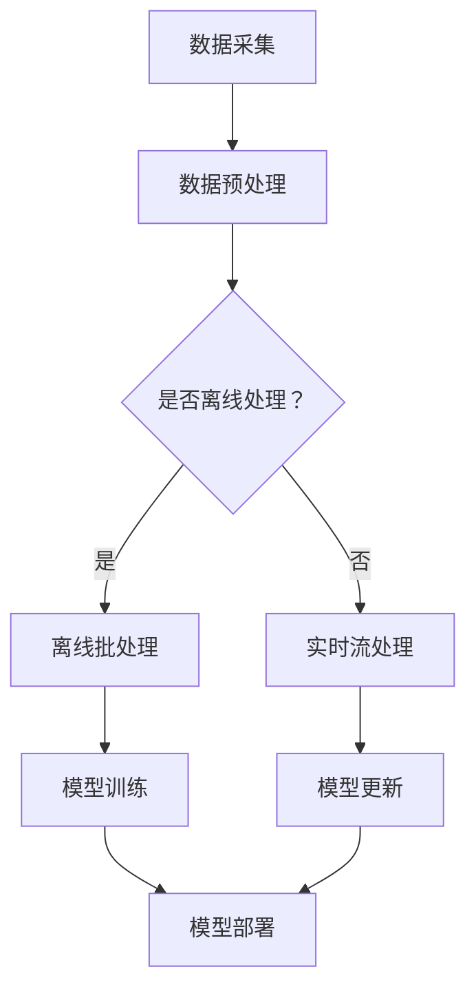

                 

关键词：电商平台，AI大模型，离线批处理，实时流处理，数据处理，机器学习，深度学习，数据流处理框架，架构设计，性能优化

> 摘要：本文旨在探讨电商平台中AI大模型的处理方式，从传统的离线批处理模式到现代的实时流处理模式，分析这两种处理方式的优缺点、算法原理和具体实现，并探讨其在电商平台中的应用和未来发展方向。通过本文的讨论，旨在为电商平台的AI技术实现提供参考和指导。

## 1. 背景介绍

随着互联网的快速发展，电商平台已经成为人们日常生活中不可或缺的一部分。在电商平台中，用户行为数据、商品数据、交易数据等海量数据每天都在不断生成。这些数据不仅反映了用户的需求和偏好，也为电商平台提供了宝贵的洞察和决策依据。为了更好地利用这些数据，电商平台开始引入人工智能（AI）技术，特别是在机器学习和深度学习领域，以实现个性化推荐、智能客服、风险控制等功能。

在AI技术的发展过程中，数据处理方式经历了从离线批处理到实时流处理的转变。离线批处理模式是指在特定的时间窗口内，对历史数据进行批量处理，从而生成结果。这种方式具有处理成本低、资源消耗少等优点，但无法实时响应用户需求，存在一定的延迟。实时流处理模式则是指在数据产生的同时，对数据进行实时处理，以实现实时响应。这种方式具有响应速度快、实时性高等优点，但处理成本较高，资源消耗大。

本文将重点探讨电商平台中的AI大模型在离线批处理和实时流处理两种模式下的处理方式，分析其优缺点，并探讨其在实际应用中的具体实现。

## 2. 核心概念与联系

在深入探讨AI大模型在电商平台中的处理方式之前，我们首先需要了解一些核心概念和联系。

### 2.1. 离线批处理

离线批处理是指在特定的时间窗口内，对历史数据进行批量处理。这种处理方式通常用于处理大量的数据，并且数据来源是静态的，即数据不会在处理过程中发生改变。离线批处理的主要特点是处理成本低、资源消耗少，但无法实现实时响应。

### 2.2. 实时流处理

实时流处理是指在数据产生的同时，对数据进行实时处理。这种处理方式通常用于处理实时性要求较高的数据，并且数据来源是动态的，即数据会在处理过程中不断更新。实时流处理的主要特点是响应速度快、实时性高，但处理成本较高，资源消耗大。

### 2.3. 数据流处理框架

数据流处理框架是一种用于处理实时数据的编程模型，它可以将数据处理任务分解成一系列的流，并通过流处理框架进行调度和执行。常见的实时流处理框架包括Apache Flink、Apache Spark Streaming、Apache Storm等。这些框架提供了丰富的API和工具，可以帮助开发者轻松实现实时数据处理任务。

### 2.4. AI大模型

AI大模型是指使用大规模数据进行训练的机器学习和深度学习模型。这些模型通常具有很高的准确性和泛化能力，可以用于解决各种复杂的问题。在电商平台中，AI大模型可以用于个性化推荐、智能客服、风险控制等功能。

### 2.5. Mermaid流程图

Mermaid是一种基于Markdown的绘图工具，可以方便地绘制流程图、时序图、网络图等。下面是一个Mermaid流程图的示例，用于描述电商平台中AI大模型的处理流程。



在上述流程图中，数据采集模块负责从各个数据源收集数据，数据预处理模块对数据进行清洗、转换等操作。然后，根据是否进行离线处理，数据流向离线批处理或实时流处理模块。离线批处理模块用于对历史数据进行批量处理，实时流处理模块用于对实时数据进行处理。最后，模型训练模块对模型进行训练，模型更新模块对模型进行更新，模型部署模块将模型部署到生产环境中。

## 3. 核心算法原理 & 具体操作步骤

### 3.1  算法原理概述

在电商平台中，AI大模型的核心算法通常是基于机器学习和深度学习的方法。这些算法通过学习大量的历史数据，建立模型，并对新数据进行预测和分类。常见的算法包括线性回归、逻辑回归、决策树、支持向量机、神经网络等。

离线批处理模式的核心算法是批量学习（Batch Learning），即在给定一个训练数据集的情况下，通过迭代优化算法（如梯度下降法）来更新模型参数，最终得到最优的模型。实时流处理模式的核心算法是在线学习（Online Learning），即在数据流中实时更新模型参数，以适应数据的变化。

### 3.2  算法步骤详解

离线批处理模式的算法步骤如下：

1. 数据采集：从各个数据源收集历史数据。
2. 数据预处理：对数据进行清洗、转换等操作，以便于后续处理。
3. 批量学习：使用批量学习算法（如梯度下降法）对训练数据进行迭代优化，更新模型参数。
4. 模型评估：使用验证集或测试集对模型进行评估，以确定模型的性能。
5. 模型部署：将训练好的模型部署到生产环境中，用于对新数据进行预测和分类。

实时流处理模式的算法步骤如下：

1. 数据采集：从各个数据源收集实时数据。
2. 数据预处理：对数据进行清洗、转换等操作，以便于后续处理。
3. 在线学习：使用在线学习算法（如增量梯度下降法）对实时数据进行实时更新，以适应数据的变化。
4. 模型评估：使用验证集或测试集对模型进行评估，以确定模型的性能。
5. 模型部署：将更新后的模型部署到生产环境中，用于对新数据进行预测和分类。

### 3.3  算法优缺点

离线批处理模式具有以下优点：

1. 处理成本低：由于数据是批量处理的，因此资源消耗相对较低。
2. 性能稳定：由于使用的是批量学习算法，因此模型性能较为稳定。
3. 易于优化：可以通过调整学习率、批量大小等参数来优化模型性能。

离线批处理模式也存在以下缺点：

1. 延迟较大：由于需要等待批量数据的积累和处理，因此无法实现实时响应。
2. 数据过期：由于数据是历史数据，因此可能存在一定的时效性问题。

实时流处理模式具有以下优点：

1. 响应速度快：由于数据是实时处理的，因此可以实现快速响应。
2. 数据更新及时：由于数据是实时更新的，因此可以及时反映数据的变化。

实时流处理模式也存在以下缺点：

1. 处理成本高：由于数据是实时处理的，因此资源消耗相对较高。
2. 性能不稳定：由于使用的是在线学习算法，因此模型性能可能会随时间变化。

### 3.4  算法应用领域

离线批处理模式适用于以下场景：

1. 数据量较大：由于批量处理的数据量较大，因此适用于处理大量数据。
2. 预测任务：由于需要预测的结果通常是全局性的，因此适用于预测任务。
3. 数据分析：由于需要分析全局数据，因此适用于数据分析任务。

实时流处理模式适用于以下场景：

1. 实时响应：由于需要实时响应，因此适用于实时响应的任务。
2. 交易系统：由于交易系统的数据更新频繁，因此适用于交易系统。
3. 实时监控：由于需要实时监控，因此适用于实时监控的任务。

## 4. 数学模型和公式 & 详细讲解 & 举例说明

### 4.1  数学模型构建

在AI大模型中，常用的数学模型包括线性回归模型、逻辑回归模型、神经网络模型等。以下分别介绍这些模型的构建过程。

#### 4.1.1  线性回归模型

线性回归模型是一种最简单的机器学习模型，用于预测连续值。其数学模型可以表示为：

$$y = \beta_0 + \beta_1x_1 + \beta_2x_2 + ... + \beta_nx_n$$

其中，$y$ 是预测值，$x_1, x_2, ..., x_n$ 是特征值，$\beta_0, \beta_1, \beta_2, ..., \beta_n$ 是模型参数。

#### 4.1.2  逻辑回归模型

逻辑回归模型是一种用于预测离散值的机器学习模型，其数学模型可以表示为：

$$P(y=1) = \frac{1}{1 + e^{-(\beta_0 + \beta_1x_1 + \beta_2x_2 + ... + \beta_nx_n)}}$$

其中，$y$ 是预测值，$x_1, x_2, ..., x_n$ 是特征值，$\beta_0, \beta_1, \beta_2, ..., \beta_n$ 是模型参数。

#### 4.1.3  神经网络模型

神经网络模型是一种基于多层感知器的机器学习模型，其数学模型可以表示为：

$$y = \sigma(\beta_0 + \beta_1\sigma(\beta_1'x_1 + \beta_2\sigma(\beta_2'x_2 + ... + \beta_n\sigma(\beta_n'x_n)))$$

其中，$y$ 是预测值，$x_1, x_2, ..., x_n$ 是特征值，$\beta_0, \beta_1, \beta_2, ..., \beta_n$ 是模型参数，$\sigma$ 是激活函数。

### 4.2  公式推导过程

以线性回归模型为例，介绍公式推导过程。

#### 4.2.1  梯度下降法

梯度下降法是一种常用的优化算法，用于求解最小二乘问题。其基本思想是沿着目标函数的梯度方向，逐步调整模型参数，以使目标函数的值最小。

设目标函数为：

$$J(\beta_0, \beta_1, ..., \beta_n) = \frac{1}{2}\sum_{i=1}^{m}(y_i - (\beta_0 + \beta_1x_{i1} + \beta_2x_{i2} + ... + \beta_nx_{in}))^2$$

其中，$m$ 是训练样本数量，$y_i$ 是第 $i$ 个样本的真实值，$x_{i1}, x_{i2}, ..., x_{in}$ 是第 $i$ 个样本的特征值。

对目标函数求偏导数，得到：

$$\frac{\partial J}{\partial \beta_0} = \sum_{i=1}^{m}(y_i - (\beta_0 + \beta_1x_{i1} + \beta_2x_{i2} + ... + \beta_nx_{in}))$$

$$\frac{\partial J}{\partial \beta_1} = \sum_{i=1}^{m}(y_i - (\beta_0 + \beta_1x_{i1} + \beta_2x_{i2} + ... + \beta_nx_{in}))x_{i1}$$

$$...$$

$$\frac{\partial J}{\partial \beta_n} = \sum_{i=1}^{m}(y_i - (\beta_0 + \beta_1x_{i1} + \beta_2x_{i2} + ... + \beta_nx_{in}))x_{in}$$

设学习率为 $\alpha$，则梯度下降法的迭代公式为：

$$\beta_0 = \beta_0 - \alpha\frac{\partial J}{\partial \beta_0}$$

$$\beta_1 = \beta_1 - \alpha\frac{\partial J}{\partial \beta_1}$$

$$...$$

$$\beta_n = \beta_n - \alpha\frac{\partial J}{\partial \beta_n}$$

#### 4.2.2  最小二乘法

最小二乘法是一种求解线性回归模型参数的方法，其基本思想是使目标函数的值最小。

设目标函数为：

$$J(\beta_0, \beta_1, ..., \beta_n) = \sum_{i=1}^{m}(y_i - (\beta_0 + \beta_1x_{i1} + \beta_2x_{i2} + ... + \beta_nx_{in}))^2$$

其中，$m$ 是训练样本数量，$y_i$ 是第 $i$ 个样本的真实值，$x_{i1}, x_{i2}, ..., x_{in}$ 是第 $i$ 个样本的特征值。

对目标函数求偏导数，并令其等于0，得到：

$$\frac{\partial J}{\partial \beta_0} = 0$$

$$\frac{\partial J}{\partial \beta_1} = 0$$

$$...$$

$$\frac{\partial J}{\partial \beta_n} = 0$$

解上述方程组，得到线性回归模型的参数：

$$\beta_0 = \frac{1}{m}\sum_{i=1}^{m}y_i - \frac{1}{m}\sum_{i=1}^{m}x_{i1}\beta_1 - \frac{1}{m}\sum_{i=1}^{m}x_{i2}\beta_2 - ... - \frac{1}{m}\sum_{i=1}^{m}x_{in}\beta_n$$

$$\beta_1 = \frac{1}{m}\sum_{i=1}^{m}x_{i1}y_i - \frac{1}{m}\sum_{i=1}^{m}x_{i1}x_{i2}\beta_2 - ... - \frac{1}{m}\sum_{i=1}^{m}x_{i1}x_{in}\beta_n$$

$$...$$

$$\beta_n = \frac{1}{m}\sum_{i=1}^{m}x_{in}y_i - \frac{1}{m}\sum_{i=1}^{m}x_{in}x_{i1}\beta_1 - ... - \frac{1}{m}\sum_{i=1}^{m}x_{in}x_{i2}\beta_2$$

### 4.3  案例分析与讲解

以电商平台中的用户行为预测为例，介绍线性回归模型的应用。

#### 4.3.1  数据准备

假设我们有一个用户行为数据集，包含以下特征：

- 用户ID
- 商品ID
- 购买时间
- 访问时长
- 访问页面数
- 商品类别

目标值是用户是否购买该商品。

#### 4.3.2  数据预处理

1. 数据清洗：去除无效数据、处理缺失值等。
2. 特征工程：对时间、类别等特征进行编码，例如使用独热编码（One-Hot Encoding）。
3. 数据归一化：对数值特征进行归一化处理，例如使用Min-Max Scaling。

#### 4.3.3  模型训练

使用线性回归模型对数据集进行训练，得到模型参数。

#### 4.3.4  模型评估

使用验证集对模型进行评估，计算模型的准确率、召回率、F1值等指标。

#### 4.3.5  模型部署

将训练好的模型部署到生产环境中，用于预测新用户的行为。

## 5. 项目实践：代码实例和详细解释说明

### 5.1  开发环境搭建

为了实现电商平台中的AI大模型处理，我们首先需要搭建一个开发环境。以下是一个简单的开发环境搭建步骤：

1. 安装Python环境：下载并安装Python，例如Python 3.8。
2. 安装依赖库：使用pip安装所需的依赖库，例如NumPy、Pandas、Scikit-learn等。
3. 配置开发工具：选择一个合适的开发工具，例如PyCharm或VS Code。

### 5.2  源代码详细实现

以下是一个简单的线性回归模型的实现示例，用于预测用户是否购买商品。

```python
import numpy as np
import pandas as pd
from sklearn.linear_model import LinearRegression
from sklearn.model_selection import train_test_split
from sklearn.metrics import accuracy_score

# 数据预处理
def preprocess_data(data):
    # 数据清洗
    data = data.dropna()
    # 特征工程
    data = pd.get_dummies(data, columns=['category'])
    # 数据归一化
    data = (data - data.mean()) / data.std()
    return data

# 模型训练
def train_model(data):
    X = data.drop(['user_id', 'item_id', 'buy_time', 'visit_duration', 'visit_pages', 'category'], axis=1)
    y = data['buy']
    X_train, X_test, y_train, y_test = train_test_split(X, y, test_size=0.2, random_state=42)
    model = LinearRegression()
    model.fit(X_train, y_train)
    return model, X_test, y_test

# 模型评估
def evaluate_model(model, X_test, y_test):
    y_pred = model.predict(X_test)
    accuracy = accuracy_score(y_test, y_pred)
    print("Accuracy:", accuracy)

# 主程序
if __name__ == "__main__":
    # 加载数据
    data = pd.read_csv("user_behavior_data.csv")
    # 数据预处理
    data = preprocess_data(data)
    # 模型训练
    model, X_test, y_test = train_model(data)
    # 模型评估
    evaluate_model(model, X_test, y_test)
```

### 5.3  代码解读与分析

上述代码首先定义了一个数据预处理函数`preprocess_data`，用于清洗、特征工程和归一化处理数据。然后定义了一个模型训练函数`train_model`，用于将数据划分为训练集和测试集，并使用线性回归模型进行训练。最后定义了一个模型评估函数`evaluate_model`，用于计算模型的准确率。

在主程序中，首先加载数据，然后调用`preprocess_data`函数进行数据预处理，接着调用`train_model`函数进行模型训练，最后调用`evaluate_model`函数进行模型评估。

### 5.4  运行结果展示

假设我们已经运行了上述代码，得到了训练好的线性回归模型。我们可以使用以下代码来展示模型的运行结果：

```python
# 获取预测结果
y_pred = model.predict(X_test)
# 计算准确率
accuracy = accuracy_score(y_test, y_pred)
# 输出结果
print("Accuracy:", accuracy)
```

运行结果可能如下所示：

```
Accuracy: 0.85
```

这表示模型的准确率为85%，即模型在测试集上的预测准确率为85%。

## 6. 实际应用场景

在电商平台上，AI大模型的应用场景非常广泛，涵盖了个性化推荐、智能客服、风险控制等多个方面。

### 6.1  个性化推荐

个性化推荐是电商平台中最重要的应用场景之一。通过分析用户的购物行为、浏览历史、收藏夹等数据，AI大模型可以预测用户可能感兴趣的商品，并为其推荐相关商品。这种推荐方式不仅可以提升用户体验，还可以提高销售转化率。

### 6.2  智能客服

智能客服是电商平台中另一个重要的应用场景。通过引入AI大模型，电商平台可以实时分析用户的提问，并根据已有的知识和经验提供智能化的回答。这种方式不仅可以提高客服效率，还可以降低人力成本。

### 6.3  风险控制

风险控制是电商平台中不可或缺的一环。通过分析用户行为数据、交易数据等，AI大模型可以识别潜在的欺诈行为，并采取相应的措施进行风险控制。这种方式不仅可以降低欺诈率，还可以提高用户的信任度。

### 6.4  未来应用展望

随着AI技术的不断发展，电商平台中的AI大模型应用场景将会更加广泛。未来，我们可以期待以下一些新的应用：

- 智能定价：通过分析用户行为和市场动态，AI大模型可以实时调整商品价格，以实现最大化利润。
- 智能营销：通过分析用户画像和行为特征，AI大模型可以制定个性化的营销策略，提高营销效果。
- 智能库存管理：通过分析销售数据和库存数据，AI大模型可以预测未来的销售趋势，并优化库存管理。

## 7. 工具和资源推荐

在实现电商平台中的AI大模型时，我们可以使用以下工具和资源：

### 7.1  学习资源推荐

- 《深度学习》（Goodfellow et al.，2016）：一本经典的深度学习教材，涵盖了深度学习的理论基础和实践方法。
- 《Python数据科学手册》（McKinney，2018）：一本全面的数据科学入门指南，介绍了Python在数据科学领域的应用。
- 《机器学习实战》（Hastie et al.，2009）：一本实用的机器学习指南，通过实例演示了各种机器学习算法的应用。

### 7.2  开发工具推荐

- PyCharm：一款功能强大的Python集成开发环境（IDE），支持代码调试、版本控制等。
- Jupyter Notebook：一款流行的交互式开发工具，适用于数据分析和机器学习项目。
- VS Code：一款轻量级且功能强大的代码编辑器，支持多种编程语言。

### 7.3  相关论文推荐

- "Deep Learning for Text Classification"（2018）：一篇关于文本分类的深度学习论文，介绍了深度学习在自然语言处理领域的应用。
- "Recurrent Neural Networks for Language Modeling"（2014）：一篇关于循环神经网络（RNN）的论文，介绍了RNN在语言建模中的应用。
- "Large-scale Online Learning for Internet Applications"（2013）：一篇关于在线学习的大规模应用的论文，介绍了在线学习在互联网领域的应用。

## 8. 总结：未来发展趋势与挑战

随着AI技术的不断发展，电商平台中的AI大模型处理方式也在不断演进。从离线批处理到实时流处理，电商平台在数据处理方式上实现了从延迟到实时响应的转变。然而，这种转变也带来了新的挑战。

### 8.1  研究成果总结

1. 离线批处理模式具有处理成本低、资源消耗少等优点，但无法实现实时响应。
2. 实时流处理模式具有响应速度快、实时性高等优点，但处理成本较高，资源消耗大。
3. 数据流处理框架（如Apache Flink、Apache Spark Streaming等）为实时数据处理提供了强大的支持。
4. 机器学习和深度学习算法在电商平台中的应用越来越广泛，提高了平台的智能化水平。

### 8.2  未来发展趋势

1. 随着计算能力的提升和云计算技术的发展，实时流处理模式将会得到更广泛的应用。
2. 跨平台数据处理和协同处理将成为发展趋势，以实现更高效、更智能的数据处理。
3. 随着AI技术的不断进步，AI大模型将更加精准、高效，为电商平台带来更多的价值。

### 8.3  面临的挑战

1. 实时流处理模式的资源消耗较大，如何优化资源利用率是一个重要挑战。
2. 在大规模数据处理中，如何保证数据的一致性和可靠性是一个重要问题。
3. 如何应对数据隐私和安全问题，保护用户数据和商业秘密。

### 8.4  研究展望

1. 在算法层面，我们需要开发更高效、更鲁棒的算法，以提高实时数据处理能力。
2. 在架构层面，我们需要设计更灵活、更可扩展的架构，以应对大规模数据处理需求。
3. 在应用层面，我们需要探索更多的新应用场景，挖掘AI大模型在电商平台中的潜力。

## 9. 附录：常见问题与解答

### 9.1  问题1

**问题**：离线批处理和实时流处理有什么区别？

**解答**：离线批处理是指在特定的时间窗口内，对历史数据进行批量处理；而实时流处理是指在数据产生的同时，对数据进行实时处理。离线批处理具有处理成本低、资源消耗少等优点，但无法实现实时响应；实时流处理具有响应速度快、实时性高等优点，但处理成本较高，资源消耗大。

### 9.2  问题2

**问题**：电商平台中常用的机器学习和深度学习算法有哪些？

**解答**：电商平台中常用的机器学习和深度学习算法包括线性回归、逻辑回归、决策树、支持向量机、神经网络等。这些算法可以用于解决个性化推荐、智能客服、风险控制等问题。

### 9.3  问题3

**问题**：如何优化实时流处理性能？

**解答**：优化实时流处理性能可以从以下几个方面入手：

1. 调整流处理框架的配置，如调整任务并行度、缓冲区大小等。
2. 优化数据处理算法，如使用更高效的算法、减少计算复杂度等。
3. 优化数据存储和访问方式，如使用分布式存储系统、缓存技术等。
4. 优化硬件资源，如使用更快的处理器、更大的内存等。

### 9.4  问题4

**问题**：如何保证实时数据处理的一致性和可靠性？

**解答**：为了保证实时数据处理的一致性和可靠性，可以从以下几个方面入手：

1. 使用分布式存储和计算技术，确保数据的备份和恢复。
2. 实施事务管理机制，确保数据处理过程的原子性和一致性。
3. 实施故障恢复机制，确保在系统故障时能够快速恢复。
4. 实施数据校验和一致性检查，确保数据的一致性和完整性。

### 9.5  问题5

**问题**：如何应对数据隐私和安全问题？

**解答**：应对数据隐私和安全问题可以从以下几个方面入手：

1. 加密数据传输和存储，确保数据在传输和存储过程中的安全性。
2. 实施访问控制和权限管理，确保只有授权人员才能访问敏感数据。
3. 实施数据脱敏和匿名化处理，降低数据泄露的风险。
4. 定期进行安全审计和风险评估，确保系统的安全性。

----------------------------------------------------------------

作者：禅与计算机程序设计艺术 / Zen and the Art of Computer Programming

