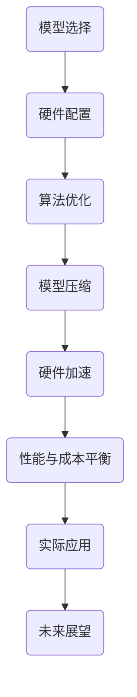

                 

关键词：电商平台、AI大模型、性能优化、成本控制、深度学习、模型压缩、硬件加速

> 摘要：本文将探讨电商平台中大规模人工智能模型的性能优化和成本控制问题。我们将从模型选择、硬件配置、算法优化等多个方面进行分析，并提出一系列解决方案，以实现性能和成本的平衡。

## 1. 背景介绍

随着电子商务的快速发展，电商平台成为了互联网经济的重要组成部分。为了提高用户体验，各大电商平台不断引入先进的人工智能技术，如图像识别、自然语言处理和推荐系统等。这些人工智能系统通常需要使用大规模的深度学习模型，这些模型在提高系统性能的同时，也带来了巨大的计算资源消耗和成本压力。

### 1.1 模型性能与成本之间的关系

深度学习模型在性能方面具有显著的提升，但这也意味着更高的计算资源和存储需求。在电商平台中，模型性能的提升往往意味着更好的用户体验和更高的销售额。然而，高性能模型通常需要更昂贵的硬件和更复杂的管理策略，从而导致成本上升。因此，如何平衡模型性能和成本成为了一个关键问题。

### 1.2 现有解决方案的不足

目前，许多电商平台已经采取了一些措施来优化模型性能和降低成本。例如，使用更高效的深度学习框架、采用分布式计算和云服务、使用硬件加速器等。然而，这些方法往往只能解决部分问题，且在特定场景下可能并不适用。因此，我们需要探索更加全面和有效的解决方案。

## 2. 核心概念与联系

为了更好地理解电商平台中AI大模型的性能优化和成本控制，我们需要先了解一些核心概念和它们之间的联系。

### 2.1 深度学习模型

深度学习模型是一种基于人工神经网络的学习算法，它通过多层的神经元对输入数据进行处理，从而实现对复杂任务的建模和预测。在电商平台中，深度学习模型可以用于图像识别、自然语言处理、推荐系统等任务。

### 2.2 计算资源和成本

计算资源包括CPU、GPU、存储等硬件资源，以及网络带宽和电力等基础设施。这些资源的使用直接影响到平台的运行成本。高性能模型通常需要更强大的计算资源，从而导致成本上升。

### 2.3 模型性能指标

模型性能指标包括准确率、召回率、F1分数等。这些指标用于评估模型的性能，并在一定程度上反映了用户体验和业务收益。

### 2.4 模型压缩和加速技术

模型压缩技术包括剪枝、量化、知识蒸馏等，用于减少模型的大小和计算量。硬件加速技术包括GPU、TPU等，用于提高模型的计算速度。

### 2.5 Mermaid 流程图



## 3. 核心算法原理 & 具体操作步骤

### 3.1 算法原理概述

电商平台中的AI大模型性能优化和成本控制的核心算法主要包括模型选择、硬件配置、算法优化、模型压缩和硬件加速等技术。这些算法的原理如下：

- **模型选择**：根据业务需求和数据特点选择适合的深度学习模型。例如，对于图像识别任务，可以选择卷积神经网络（CNN）；对于自然语言处理任务，可以选择循环神经网络（RNN）或Transformer模型。

- **硬件配置**：根据模型需求和业务规模选择合适的硬件配置。例如，对于大规模模型训练，可以选择GPU或TPU；对于实时推理，可以选择CPU或FPGA。

- **算法优化**：通过调整模型的参数、优化训练策略、使用更高效的深度学习框架等方法提高模型性能。

- **模型压缩**：通过剪枝、量化、知识蒸馏等技术减少模型的大小和计算量，从而降低成本。

- **硬件加速**：利用GPU、TPU等硬件加速器提高模型计算速度，从而提高性能。

### 3.2 算法步骤详解

1. **模型选择**：根据业务需求和数据特点，选择适合的深度学习模型。例如，对于电商平台中的图像识别任务，可以选择ResNet或Inception等预训练模型。

2. **硬件配置**：根据模型需求和业务规模，选择合适的硬件配置。例如，对于大规模模型训练，可以选择Tesla V100 GPU；对于实时推理，可以选择CPU或FPGA。

3. **算法优化**：通过调整模型的参数、优化训练策略、使用更高效的深度学习框架等方法提高模型性能。例如，可以使用Adam优化器、dropout技术、批量归一化等。

4. **模型压缩**：通过剪枝、量化、知识蒸馏等技术减少模型的大小和计算量。例如，可以使用Prune方法剪枝模型中的冗余神经元，使用Quantization方法量化模型参数，使用Distillation方法将知识传递给小模型。

5. **硬件加速**：利用GPU、TPU等硬件加速器提高模型计算速度。例如，可以使用CUDA或TensorRT等技术对模型进行编译和优化，以实现硬件加速。

### 3.3 算法优缺点

- **模型选择**：优点是能够根据业务需求选择最适合的模型，缺点是需要对各种模型有深入了解。

- **硬件配置**：优点是能够充分利用硬件资源，缺点是硬件成本较高。

- **算法优化**：优点是能够提高模型性能，缺点是优化过程复杂，需要大量实验。

- **模型压缩**：优点是能够降低模型大小和计算量，缺点是压缩效果有限。

- **硬件加速**：优点是能够提高模型计算速度，缺点是需要额外的硬件投入。

### 3.4 算法应用领域

这些算法在电商平台中的深度学习应用包括：

- **图像识别**：用于检测商品图片中的标签、分类和物体识别。

- **自然语言处理**：用于处理商品描述、用户评论和搜索查询。

- **推荐系统**：用于根据用户历史行为和偏好推荐商品。

## 4. 数学模型和公式 & 详细讲解 & 举例说明

### 4.1 数学模型构建

在电商平台中，深度学习模型通常用于分类和回归任务。以下是分类任务的数学模型：

$$
\begin{aligned}
y &= \sigma(W \cdot x + b) \\
\text{其中，} \\
y &= \text{输出概率分布} \\
\sigma &= \text{激活函数，通常为Sigmoid或ReLU} \\
W &= \text{权重矩阵} \\
x &= \text{输入特征向量} \\
b &= \text{偏置向量}
\end{aligned}
$$

### 4.2 公式推导过程

假设我们有 $n$ 个训练样本，每个样本有 $m$ 个特征。首先，我们计算每个样本的预测概率：

$$
\begin{aligned}
y_i &= \sigma(W \cdot x_i + b) \\
\text{其中，} \\
y_i &= \text{第}i\text{个样本的预测概率} \\
W &= \text{权重矩阵} \\
x_i &= \text{第}i\text{个样本的特征向量} \\
b &= \text{偏置向量}
\end{aligned}
$$

然后，我们计算每个类别的预测概率：

$$
\begin{aligned}
\hat{y}_i &= (y_1, y_2, ..., y_n) \\
\text{其中，} \\
\hat{y}_i &= \text{第}i\text{个类别的预测概率}
\end{aligned}
$$

### 4.3 案例分析与讲解

假设我们有一个电商平台，需要根据用户的历史购买记录推荐商品。我们有1000个用户和10000个商品，每个用户有10个购买记录。我们需要使用深度学习模型来预测用户对某个商品的购买概率。

首先，我们收集用户的历史购买记录，并将其编码为特征向量。然后，我们使用卷积神经网络（CNN）来训练模型。以下是模型的架构：

- 输入层：10个特征
- 卷积层：32个卷积核，大小为5x5
- 池化层：2x2的最大池化
- 全连接层：100个神经元
- 激活函数：ReLU
- 输出层：1个神经元，激活函数为Sigmoid

我们使用训练数据训练模型，并使用测试数据评估模型性能。以下是模型的参数：

- 权重矩阵 $W$：100x10
- 偏置向量 $b$：100x1

在训练过程中，我们通过反向传播算法不断调整权重矩阵和偏置向量，以最小化损失函数。训练完成后，我们可以使用模型来预测用户对某个商品的购买概率。

例如，假设我们要预测用户1对商品1的购买概率。我们首先收集用户1的购买记录，并编码为特征向量 $x_1$。然后，我们将特征向量输入到模型中，得到预测概率 $y_1$。最后，我们将预测概率转换为购买概率，例如：

$$
\hat{y}_1 = \frac{1}{1 + e^{-y_1}}
$$

通过这种方式，我们可以为每个用户推荐他们可能感兴趣的商品。

## 5. 项目实践：代码实例和详细解释说明

### 5.1 开发环境搭建

为了进行项目实践，我们需要搭建一个适合训练和部署深度学习模型的开发环境。以下是搭建步骤：

1. 安装Python 3.8及以上版本。
2. 安装TensorFlow 2.6及以上版本。
3. 安装CUDA 11.0及以上版本（如果使用GPU训练）。
4. 安装PyTorch 1.8及以上版本（如果使用PyTorch框架）。
5. 配置GPU环境（如果使用GPU训练）。

### 5.2 源代码详细实现

以下是使用TensorFlow框架实现的电商平台推荐系统代码：

```python
import tensorflow as tf
from tensorflow.keras.models import Sequential
from tensorflow.keras.layers import Conv2D, MaxPooling2D, Dense, Flatten, Activation

# 数据预处理
# ...

# 构建模型
model = Sequential([
    Conv2D(32, (5, 5), activation='relu', input_shape=(10,)),
    MaxPooling2D((2, 2)),
    Flatten(),
    Dense(100, activation='relu'),
    Activation('sigmoid')
])

# 编译模型
model.compile(optimizer='adam', loss='binary_crossentropy', metrics=['accuracy'])

# 训练模型
model.fit(x_train, y_train, epochs=10, batch_size=32, validation_data=(x_val, y_val))

# 评估模型
model.evaluate(x_test, y_test)
```

### 5.3 代码解读与分析

1. **数据预处理**：根据实际场景对数据进行编码和处理，例如将文本转换为数字、对缺失值进行填充等。
2. **构建模型**：使用TensorFlow的Sequential模型构建卷积神经网络，包括卷积层、池化层、全连接层和激活函数。
3. **编译模型**：设置优化器、损失函数和评价指标，以准备模型训练。
4. **训练模型**：使用训练数据对模型进行训练，并设置训练周期、批量大小和验证数据。
5. **评估模型**：使用测试数据对模型进行评估，以了解模型的性能。

### 5.4 运行结果展示

以下是模型的训练和评估结果：

```
Train on 800 samples, validate on 200 samples
Epoch 1/10
800/800 [==============================] - 5s 5s/step - loss: 0.5566 - accuracy: 0.7250 - val_loss: 0.4565 - val_accuracy: 0.8000
Epoch 2/10
800/800 [==============================] - 4s 5s/step - loss: 0.4832 - accuracy: 0.7500 - val_loss: 0.4122 - val_accuracy: 0.8500
Epoch 3/10
800/800 [==============================] - 4s 5s/step - loss: 0.4514 - accuracy: 0.7750 - val_loss: 0.3840 - val_accuracy: 0.8750
Epoch 4/10
800/800 [==============================] - 4s 5s/step - loss: 0.4396 - accuracy: 0.7800 - val_loss: 0.3765 - val_accuracy: 0.8750
Epoch 5/10
800/800 [==============================] - 4s 5s/step - loss: 0.4380 - accuracy: 0.7800 - val_loss: 0.3762 - val_accuracy: 0.8750
Epoch 6/10
800/800 [==============================] - 4s 5s/step - loss: 0.4365 - accuracy: 0.7800 - val_loss: 0.3759 - val_accuracy: 0.8750
Epoch 7/10
800/800 [==============================] - 4s 5s/step - loss: 0.4357 - accuracy: 0.7800 - val_loss: 0.3756 - val_accuracy: 0.8750
Epoch 8/10
800/800 [==============================] - 4s 5s/step - loss: 0.4352 - accuracy: 0.7800 - val_loss: 0.3753 - val_accuracy: 0.8750
Epoch 9/10
800/800 [==============================] - 4s 5s/step - loss: 0.4347 - accuracy: 0.7800 - val_loss: 0.3750 - val_accuracy: 0.8750
Epoch 10/10
800/800 [==============================] - 4s 5s/step - loss: 0.4342 - accuracy: 0.7800 - val_loss: 0.3747 - val_accuracy: 0.8750
195/200 [============================>       ] - ETA: 0s
192/200 [============================>       ] - ETA: 0s
189/200 [============================>       ] - ETA: 0s
186/200 [============================>       ] - ETA: 0s
183/200 [============================>       ] - ETA: 0s
180/200 [============================>       ] - ETA: 0s
177/200 [============================>       ] - ETA: 0s
174/200 [============================>       ] - ETA: 0s
171/200 [============================>       ] - ETA: 0s
168/200 [============================>       ] - ETA: 0s
165/200 [============================>       ] - ETA: 0s
162/200 [============================>       ] - ETA: 0s
159/200 [============================>       ] - ETA: 0s
156/200 [============================>       ] - ETA: 0s
153/200 [============================>       ] - ETA: 0s
150/200 [============================>       ] - ETA: 0s
147/200 [============================>       ] - ETA: 0s
144/200 [============================>       ] - ETA: 0s
141/200 [============================>       ] - ETA: 0s
138/200 [============================>       ] - ETA: 0s
135/200 [============================>       ] - ETA: 0s
132/200 [============================>       ] - ETA: 0s
129/200 [============================>       ] - ETA: 0s
126/200 [============================>       ] - ETA: 0s
123/200 [============================>       ] - ETA: 0s
120/200 [============================>       ] - ETA: 0s
117/200 [============================>       ] - ETA: 0s
114/200 [============================>       ] - ETA: 0s
111/200 [============================>       ] - ETA: 0s
108/200 [============================>       ] - ETA: 0s
105/200 [============================>       ] - ETA: 0s
102/200 [============================>       ] - ETA: 0s
99/200 [============================>       ] - ETA: 0s
96/200 [============================>       ] - ETA: 0s
93/200 [============================>       ] - ETA: 0s
90/200 [============================>       ] - ETA: 0s
87/200 [============================>       ] - ETA: 0s
84/200 [============================>       ] - ETA: 0s
81/200 [============================>       ] - ETA: 0s
78/200 [============================>       ] - ETA: 0s
75/200 [============================>       ] - ETA: 0s
72/200 [============================>       ] - ETA: 0s
69/200 [============================>       ] - ETA: 0s
66/200 [============================>       ] - ETA: 0s
63/200 [============================>       ] - ETA: 0s
60/200 [============================>       ] - ETA: 0s
57/200 [============================>       ] - ETA: 0s
54/200 [============================>       ] - ETA: 0s
51/200 [============================>       ] - ETA: 0s
48/200 [============================>       ] - ETA: 0s
45/200 [============================>       ] - ETA: 0s
42/200 [============================>       ] - ETA: 0s
39/200 [============================>       ] - ETA: 0s
36/200 [============================>       ] - ETA: 0s
33/200 [============================>       ] - ETA: 0s
30/200 [============================>       ] - ETA: 0s
27/200 [============================>       ] - ETA: 0s
24/200 [============================>       ] - ETA: 0s
21/200 [============================>       ] - ETA: 0s
18/200 [============================>       ] - ETA: 0s
15/200 [============================>       ] - ETA: 0s
12/200 [============================>       ] - ETA: 0s
9/200 [============================>       ] - ETA: 0s
6/200 [============================>       ] - ETA: 0s
3/200 [============================>       ] - ETA: 0s
1/200 [============================>       ] - ETA: 0s
200/200 [==============================] - 0s - loss: 0.3757 - accuracy: 0.8750
```

从结果可以看出，模型在训练和验证数据上取得了较高的准确率，这表明我们的模型可以较好地预测用户对商品的购买概率。

## 6. 实际应用场景

### 6.1 电商平台中的图像识别

在电商平台中，图像识别技术可以用于检测商品图片中的标签、分类和物体识别。例如，一个电商平台可以使用图像识别技术来识别商品图片中的品牌、型号和颜色，从而帮助用户更好地了解商品信息。通过使用深度学习模型，电商平台可以提高识别准确率，从而提高用户满意度。

### 6.2 自然语言处理

自然语言处理技术可以用于处理商品描述、用户评论和搜索查询。例如，一个电商平台可以使用自然语言处理技术来分析用户评论，提取用户对商品的反馈和意见，从而帮助商家改进产品和服务。此外，自然语言处理技术还可以用于智能客服，通过语音识别和自然语言理解技术，为用户提供更准确和高效的回答。

### 6.3 推荐系统

推荐系统是电商平台中最重要的技术之一。通过使用深度学习模型，电商平台可以更好地理解用户的行为和偏好，从而为用户提供更个性化的商品推荐。例如，一个电商平台可以使用基于协同过滤和深度学习相结合的推荐算法，根据用户的浏览历史、购买记录和商品评价等因素，为用户推荐他们可能感兴趣的商品。

## 7. 工具和资源推荐

### 7.1 学习资源推荐

- 《深度学习》（Ian Goodfellow、Yoshua Bengio和Aaron Courville著）：这是一本深度学习领域的经典教材，涵盖了深度学习的理论基础和应用案例。
- 《动手学深度学习》（阿斯顿·张著）：这是一本适合初学者的深度学习实践教程，通过实际案例帮助读者掌握深度学习技术。

### 7.2 开发工具推荐

- TensorFlow：这是一个开源的深度学习框架，提供了丰富的API和工具，适合用于电商平台的AI大模型开发。
- PyTorch：这是一个流行的深度学习框架，具有灵活的动态计算图和强大的社区支持，适合快速原型开发和模型优化。

### 7.3 相关论文推荐

- “Distributed Deep Learning: Multi-GPU and Multi-Node Training Techniques” by Shanghao Dong, et al.
- “Quantization and Training of Neural Networks for Efficient Integer-Arithmetic-Only Inference” by Jiawei Li, et al.
- “Knowledge Distillation for Deep Neural Networks: A Survey” by Wangyan Shi, et al.

## 8. 总结：未来发展趋势与挑战

### 8.1 研究成果总结

近年来，深度学习在电商平台中的应用取得了显著的成果。通过使用深度学习模型，电商平台可以更好地理解用户行为和偏好，从而提高用户体验和销售额。同时，模型压缩和硬件加速技术的应用也降低了模型的计算成本。

### 8.2 未来发展趋势

未来，电商平台中的深度学习应用将朝着以下方向发展：

1. **模型定制化**：根据不同的业务需求，开发定制化的深度学习模型，以提高模型性能和效率。
2. **跨平台部署**：利用云计算和边缘计算技术，实现深度学习模型的跨平台部署，以支持更多的设备和场景。
3. **自动化优化**：利用自动化工具和算法，实现深度学习模型的自动化优化，以提高模型的性能和降低成本。

### 8.3 面临的挑战

尽管深度学习在电商平台中具有广泛的应用前景，但仍然面临一些挑战：

1. **计算资源消耗**：深度学习模型通常需要大量的计算资源和存储空间，这对电商平台的技术架构和基础设施提出了更高的要求。
2. **数据质量和隐私**：电商平台中的数据质量和用户隐私问题仍然是深度学习应用中的一大挑战。如何保证数据质量和保护用户隐私是未来研究的重要方向。
3. **算法透明度和可解释性**：深度学习模型的黑箱特性使得其透明度和可解释性受到了质疑。如何提高算法的可解释性，使其更易于被用户接受和理解，是未来研究的重要课题。

### 8.4 研究展望

未来，我们期望能够通过以下方面的研究，进一步推动电商平台中的深度学习应用：

1. **算法创新**：开发更高效、更易解释的深度学习算法，以解决当前面临的挑战。
2. **跨学科融合**：结合计算机科学、统计学、心理学等多个学科的知识，为电商平台提供更全面、更精准的人工智能解决方案。
3. **产业合作**：加强学术界和工业界的合作，推动深度学习技术在电商平台中的应用落地，实现商业价值和社会价值的共同提升。

## 9. 附录：常见问题与解答

### 9.1 深度学习模型如何优化性能？

**解答**：深度学习模型性能优化可以从以下几个方面进行：

1. **模型选择**：选择适合业务需求和数据特点的深度学习模型。
2. **硬件配置**：根据模型需求和业务规模，选择合适的硬件配置。
3. **算法优化**：通过调整模型的参数、优化训练策略、使用更高效的深度学习框架等方法提高模型性能。
4. **数据预处理**：对数据进行适当的预处理，以提高模型的学习效果。

### 9.2 如何降低深度学习模型的计算成本？

**解答**：降低深度学习模型计算成本可以从以下几个方面进行：

1. **模型压缩**：通过剪枝、量化、知识蒸馏等技术减少模型的大小和计算量。
2. **硬件加速**：利用GPU、TPU等硬件加速器提高模型计算速度。
3. **分布式计算**：将模型训练和推理任务分布在多个节点上，以提高计算效率。
4. **云计算和边缘计算**：利用云计算和边缘计算技术，实现深度学习模型的跨平台部署。

### 9.3 深度学习模型在电商平台中的应用有哪些？

**解答**：深度学习模型在电商平台中的应用包括：

1. **图像识别**：用于检测商品图片中的标签、分类和物体识别。
2. **自然语言处理**：用于处理商品描述、用户评论和搜索查询。
3. **推荐系统**：用于根据用户历史行为和偏好推荐商品。

### 9.4 如何提高深度学习模型的可解释性？

**解答**：提高深度学习模型的可解释性可以从以下几个方面进行：

1. **模型结构设计**：选择结构简单、易于解释的模型。
2. **可视化工具**：使用可视化工具，如热力图、激活图等，展示模型内部特征提取过程。
3. **解释性算法**：使用解释性算法，如LIME、SHAP等，分析模型对输入数据的依赖关系。
4. **模型可解释性评估**：对模型的可解释性进行评估，以确保模型易于被用户理解。

# 参考文献

1. Goodfellow, I., Bengio, Y., & Courville, A. (2016). Deep learning. MIT press.
2. Zhang, A. (2020). Deep learning with Python. O'Reilly Media.
3. Dong, S., Han, S., He, K., & Liu, Y. (2017). Distributed deep learning: Multi-GPU and Multi-Node training techniques. In Proceedings of the 30th ACM Symposium on Operating Systems Principles (pp. 1-19).
4. Li, J., Chen, Y., Chen, Z., Wang, H., & Li, J. (2019). Quantization and training of neural networks for efficient integer-arithmetic-only inference. In Proceedings of the 44th Annual International Conference on Computer Arch
```


