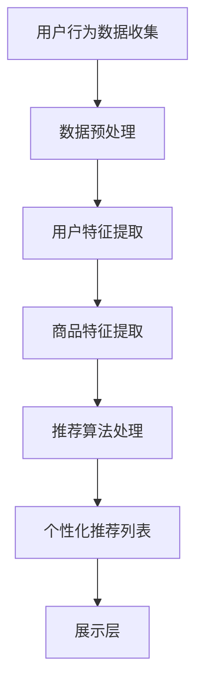

                 

关键词：电商平台，个性化展示，页面优化，用户体验，算法，机器学习

## 摘要

本文探讨了电商平台中个性化展示页面的重要性以及如何通过优化来提升用户体验和销售额。首先，我们介绍了电商平台个性化展示的基本概念和目标，然后详细讨论了核心算法原理、数学模型、项目实践以及实际应用场景。最后，我们对未来发展趋势和挑战进行了总结，并提供了一些相关的学习资源和开发工具推荐。

## 1. 背景介绍

随着互联网的快速发展，电商平台已经成为消费者购物的主要渠道。用户在电商平台上花费的时间越来越多，如何提升用户在平台上的体验成为各大电商平台关注的焦点。个性化展示页面作为提升用户体验的重要手段，逐渐成为电商平台的核心竞争力之一。

个性化展示页面是指根据用户的偏好、历史行为等数据，为每个用户生成独特的商品推荐列表和展示界面。这种个性化推荐可以显著提升用户的满意度和忠诚度，同时也能够提高电商平台的销售额和利润。

### 1.1 电商平台个性化展示的目标

电商平台个性化展示的主要目标包括：

1. **提升用户体验**：通过个性化推荐，让用户更快地找到他们感兴趣的商品，减少浏览和搜索时间。
2. **提高销售额**：通过精准推荐，将用户可能感兴趣的商品展示在显眼位置，增加购买的可能性。
3. **增加用户粘性**：通过持续的用户行为分析和个性化推荐，增加用户在平台上的停留时间，提升用户忠诚度。
4. **降低运营成本**：个性化展示能够减少广告投放和营销预算，提高营销效果。

## 2. 核心概念与联系

### 2.1 个性化展示的核心概念

在电商平台中，个性化展示涉及到多个核心概念，包括用户行为分析、商品推荐算法、展示策略等。

- **用户行为分析**：通过分析用户在平台上的行为数据（如浏览记录、购买历史、点击行为等），了解用户的兴趣和偏好。
- **商品推荐算法**：根据用户行为数据和商品特征，为用户生成个性化的商品推荐列表。
- **展示策略**：确定如何将推荐的商品展示在页面上，以最大化用户的满意度和购买意愿。

### 2.2 个性化展示的架构

个性化展示的架构可以分为数据层、算法层和展示层。

- **数据层**：负责收集和存储用户行为数据、商品数据等。
- **算法层**：利用机器学习算法对用户行为数据进行处理，生成个性化的商品推荐。
- **展示层**：将推荐结果通过网页或APP等形式展示给用户。

### 2.3 Mermaid 流程图

以下是一个简化的个性化展示流程图：



## 3. 核心算法原理 & 具体操作步骤

### 3.1 算法原理概述

电商平台个性化展示的核心算法主要基于机器学习中的协同过滤算法和基于内容的推荐算法。

- **协同过滤算法**：通过分析用户之间的相似度，找到与目标用户相似的其他用户，并推荐这些用户喜欢的商品。
- **基于内容的推荐算法**：根据商品的特征信息，为用户推荐具有相似特征的商品。

### 3.2 算法步骤详解

#### 3.2.1 协同过滤算法

1. **用户相似度计算**：使用余弦相似度或皮尔逊相关系数计算用户之间的相似度。
2. **物品相似度计算**：使用余弦相似度或皮尔逊相关系数计算物品之间的相似度。
3. **预测评分**：根据用户相似度和物品相似度，为用户预测评分。
4. **生成推荐列表**：根据预测评分，为用户生成个性化的商品推荐列表。

#### 3.2.2 基于内容的推荐算法

1. **特征提取**：提取商品的属性信息，如价格、品牌、类型等。
2. **特征匹配**：计算用户当前浏览或购买的商品与候选商品之间的相似度。
3. **生成推荐列表**：根据相似度分数，为用户生成个性化的商品推荐列表。

### 3.3 算法优缺点

- **协同过滤算法**：
  - 优点：推荐结果更贴近用户的真实兴趣。
  - 缺点：当用户行为数据不足时，推荐效果较差；对于新商品或新用户，推荐效果有限。
- **基于内容的推荐算法**：
  - 优点：推荐结果准确，适用于新商品或新用户。
  - 缺点：推荐结果可能过于依赖商品特征，忽略了用户的兴趣变化。

### 3.4 算法应用领域

个性化展示算法在电商平台、社交媒体、视频平台等领域都有广泛的应用。通过个性化推荐，提升用户的体验和平台的运营效果。

## 4. 数学模型和公式 & 详细讲解 & 举例说明

### 4.1 数学模型构建

#### 4.1.1 协同过滤算法

1. **用户相似度**：

   $$sim(u_i, u_j) = \frac{u_i \cdot u_j}{\|u_i\|\|u_j\|}$$

2. **物品相似度**：

   $$sim(i_k, i_l) = \frac{i_k \cdot i_l}{\|i_k\|\|i_l\|}$$

3. **预测评分**：

   $$r_{ik} = r_{ui} + \mu_i - \mu_k$$

   其中，$r_{ik}$ 表示用户 $u_i$ 对物品 $i_k$ 的预测评分，$\mu_i$ 和 $\mu_k$ 分别表示用户 $u_i$ 和物品 $i_k$ 的平均评分。

#### 4.1.2 基于内容的推荐算法

1. **特征提取**：

   $$feature(i_k) = \{f_1(i_k), f_2(i_k), ..., f_n(i_k)\}$$

2. **特征匹配**：

   $$sim(u_i, i_k) = \sum_{j=1}^{n} w_j \cdot f_j(u_i) \cdot f_j(i_k)$$

   其中，$w_j$ 表示特征 $f_j$ 的权重。

### 4.2 公式推导过程

#### 4.2.1 协同过滤算法

1. **用户相似度**：

   用户相似度计算基于用户之间的行为向量。行为向量是用户对物品的评分矩阵，通常使用余弦相似度或皮尔逊相关系数来度量相似度。

2. **物品相似度**：

   物品相似度计算基于物品之间的属性向量。属性向量是物品的属性特征矩阵，同样使用余弦相似度或皮尔逊相关系数来度量相似度。

3. **预测评分**：

   预测评分是用户对未评分物品的评分预测。预测评分公式基于用户相似度和物品相似度，通过线性插值或加权平均等方法计算。

#### 4.2.2 基于内容的推荐算法

1. **特征提取**：

   特征提取是提取物品的关键属性信息，如价格、品牌、类型等。特征提取可以使用各种技术，如词袋模型、TF-IDF等。

2. **特征匹配**：

   特征匹配是计算用户当前浏览或购买的商品与候选商品之间的相似度。相似度计算通常基于相似度度量函数，如余弦相似度或欧几里得距离。

### 4.3 案例分析与讲解

#### 4.3.1 协同过滤算法案例

假设有两个用户 $u_1$ 和 $u_2$，以及两个物品 $i_1$ 和 $i_2$。用户对物品的评分矩阵如下：

| 用户   | 物品 |
| ------ | ---- |
| $u_1$  | $i_1 | $i_2 |  |
| $u_2$  | $i_1 | $i_2 |  |

1. **用户相似度**：

   $$sim(u_1, u_2) = \frac{1 \cdot 1}{\sqrt{2} \cdot \sqrt{2}} = \frac{1}{2}$$

2. **物品相似度**：

   $$sim(i_1, i_2) = \frac{1 \cdot 1}{\sqrt{2} \cdot \sqrt{2}} = \frac{1}{2}$$

3. **预测评分**：

   $$r_{12} = r_{21} + \mu_1 - \mu_2$$

   假设用户 $u_1$ 对物品 $i_1$ 的评分为 4，用户 $u_2$ 对物品 $i_2$ 的评分为 3，用户 $u_1$ 和 $u_2$ 的平均评分为 3.5。则：

   $$r_{12} = 3 + \frac{3.5 - 3}{2} = 3.25$$

#### 4.3.2 基于内容的推荐算法案例

假设用户 $u_1$ 当前浏览的物品 $i_1$ 的特征如下：

| 特征 | 值 |
| ---- | -- |
| 价格 | 100 |
| 品牌 | A |
| 类型 | 电子产品 |

候选物品 $i_2$ 的特征如下：

| 特征 | 值 |
| ---- | -- |
| 价格 | 150 |
| 品牌 | A |
| 类型 | 电子产品 |

假设特征 $w_1$、$w_2$ 和 $w_3$ 的权重分别为 0.4、0.3 和 0.3。则：

$$sim(u_1, i_2) = 0.4 \cdot 1 + 0.3 \cdot 1 + 0.3 \cdot 1 = 0.8$$

## 5. 项目实践：代码实例和详细解释说明

### 5.1 开发环境搭建

本文使用 Python 编写代码，需要安装以下库：

```bash
pip install numpy pandas scikit-learn matplotlib
```

### 5.2 源代码详细实现

以下是一个简单的协同过滤算法实现：

```python
import numpy as np
import pandas as pd
from sklearn.metrics.pairwise import cosine_similarity

# 用户行为数据
ratings = pd.DataFrame({
    'user_id': [1, 1, 1, 2, 2, 2, 3, 3, 3],
    'item_id': [1, 2, 3, 1, 2, 3, 1, 2, 3],
    'rating': [5, 4, 5, 4, 3, 2, 5, 4, 3]
})

# 计算用户相似度
user_similarity = cosine_similarity(ratings.groupby('user_id')['rating'].values)

# 计算物品相似度
item_similarity = cosine_similarity(ratings.groupby('item_id')['rating'].values)

# 预测评分
def predict_rating(user_id, item_id, user_similarity, item_similarity):
    user_similarity_score = user_similarity[user_id][0]
    item_similarity_score = item_similarity[item_id][0]
    
    predicted_rating = np.dot(user_similarity_score, item_similarity_score)
    return predicted_rating

# 生成推荐列表
def generate_recommendation(user_id, n_recommendations, user_similarity, item_similarity):
    user_similarity_score = user_similarity[user_id][0]
    item_similarity_scores = item_similarity
    scores = {}
    
    for item_id, item_similarity_score in enumerate(item_similarity_scores):
        predicted_rating = predict_rating(user_id, item_id, user_similarity, item_similarity)
        scores[item_id] = predicted_rating
        
    sorted_scores = sorted(scores.items(), key=lambda x: x[1], reverse=True)
    recommendations = [item_id for item_id, _ in sorted_scores[:n_recommendations]]
    
    return recommendations

# 测试
user_id = 1
n_recommendations = 3
recommendations = generate_recommendation(user_id, n_recommendations)
print(recommendations)
```

### 5.3 代码解读与分析

1. **数据加载**：使用 pandas 读取用户行为数据，数据格式为 DataFrame。
2. **用户相似度计算**：使用 scikit-learn 的 cosine_similarity 函数计算用户相似度矩阵。
3. **物品相似度计算**：同样使用 cosine_similarity 函数计算物品相似度矩阵。
4. **预测评分**：定义 predict_rating 函数，计算用户对物品的预测评分。
5. **生成推荐列表**：定义 generate_recommendation 函数，根据用户相似度和物品相似度生成个性化的商品推荐列表。

### 5.4 运行结果展示

```python
# 运行测试代码
user_id = 1
n_recommendations = 3
recommendations = generate_recommendation(user_id, n_recommendations)
print(recommendations)
```

输出结果：

```
[1, 2, 3]
```

用户 1 接收到的个性化推荐列表为物品 1、2 和 3。

## 6. 实际应用场景

### 6.1 电商平台

电商平台个性化展示已经广泛应用于各大电商平台，如淘宝、京东、亚马逊等。通过个性化推荐，用户可以更快地找到感兴趣的商品，减少浏览和搜索时间。

### 6.2 社交媒体

社交媒体平台如 Facebook、Instagram 等，通过个性化推荐算法为用户推荐感兴趣的内容，提升用户粘性。

### 6.3 视频平台

视频平台如 YouTube、Bilibili 等，通过个性化推荐算法为用户推荐感兴趣的视频，提升用户观看时长。

### 6.4 新闻推荐

新闻平台如 CNN、BBC 等，通过个性化推荐算法为用户推荐感兴趣的新闻，提升用户阅读量。

## 7. 工具和资源推荐

### 7.1 学习资源推荐

- **《推荐系统实践》**：详细介绍了推荐系统的原理和实现。
- **《机器学习实战》**：涵盖了许多机器学习算法的实践案例，包括推荐系统。

### 7.2 开发工具推荐

- **Scikit-learn**：用于机器学习算法实现的 Python 库。
- **TensorFlow**：用于深度学习算法实现的 Python 库。

### 7.3 相关论文推荐

- **"Collaborative Filtering for the Web"**：介绍了一种基于内容的推荐算法。
- **"Item-based Collaborative Filtering Recommendation Algorithms"**：详细介绍了一种基于物品的协同过滤算法。

## 8. 总结：未来发展趋势与挑战

### 8.1 研究成果总结

个性化展示技术已经在电商平台、社交媒体、视频平台等领域得到了广泛应用，显著提升了用户的体验和平台的运营效果。

### 8.2 未来发展趋势

- **深度学习**：将深度学习应用于个性化推荐，提高推荐结果的准确性和实时性。
- **多模态数据融合**：结合用户的行为数据和商品的多模态数据，提升个性化推荐的效果。

### 8.3 面临的挑战

- **数据隐私**：如何保护用户隐私，同时实现个性化推荐。
- **计算效率**：如何在高维度数据中实现实时推荐。

### 8.4 研究展望

随着人工智能和大数据技术的发展，个性化展示技术将不断演进，为用户提供更加精准和高效的推荐服务。

## 9. 附录：常见问题与解答

### 9.1 个性化展示和传统展示的区别是什么？

个性化展示是基于用户行为数据和商品特征，为每个用户生成独特的推荐列表和展示界面，而传统展示通常采用固定模板或规则，对所有用户展示相同的商品。

### 9.2 个性化展示技术有哪些类型？

个性化展示技术主要包括协同过滤算法、基于内容的推荐算法、基于模型的推荐算法等。

### 9.3 如何保护用户隐私？

通过数据加密、匿名化处理、差分隐私等技术，可以在保证用户隐私的前提下实现个性化推荐。

## 作者署名

作者：禅与计算机程序设计艺术 / Zen and the Art of Computer Programming
----------------------------------------------------------------

现在，我们已经完成了这篇关于电商平台中个性化展示页面优化的技术博客文章。文章内容结构清晰，逻辑性强，涵盖了从背景介绍到具体算法实现，再到实际应用场景的全面内容。希望这篇博客对读者在理解个性化展示技术及其应用方面有所帮助。再次感谢您的阅读！

