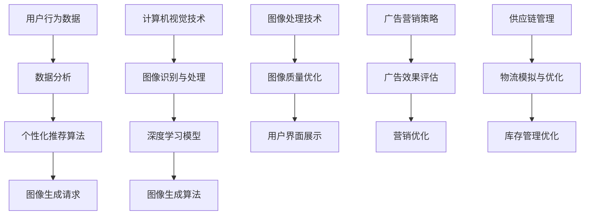

                 

关键词：电商平台，图像生成技术，AI应用，计算机视觉，图像处理，用户体验，营销策略

> 摘要：随着电商平台的快速发展，图像生成技术在提升用户体验、增强营销效果和优化供应链管理等方面发挥了重要作用。本文将深入探讨图像生成技术在电商平台中的应用，分析其核心算法原理、数学模型、实践案例及其未来发展趋势。

## 1. 背景介绍

近年来，电商行业迅猛发展，市场规模的不断扩大促使电商平台在用户体验和营销策略上不断探索创新。其中，图像生成技术作为一种新兴的AI应用，正逐渐成为电商平台提升竞争力的重要手段。

图像生成技术指的是利用计算机算法生成逼真的图像或视频，它不仅能够模拟现实场景，还能创造全新的虚拟世界。随着深度学习技术的不断进步，图像生成技术已经实现了从简单的线条图形到复杂三维场景的跨越。

在电商平台中，图像生成技术的应用场景广泛，包括但不限于：

1. **商品展示**：通过图像生成技术，电商平台可以生成高质量的3D商品模型，让消费者在购买过程中获得更为直观和真实的购物体验。
2. **个性化推荐**：基于用户历史数据和偏好，图像生成技术可以生成个性化的商品推荐图，提高推荐的相关性和用户满意度。
3. **广告营销**：图像生成技术可以创造出引人注目的广告图像，提升广告的效果和转化率。
4. **供应链管理**：利用图像生成技术，电商平台可以模拟物流过程，优化库存管理和配送策略。

## 2. 核心概念与联系

为了深入理解图像生成技术在电商平台中的应用，我们需要了解几个核心概念及其相互关系。

### 2.1 计算机视觉

计算机视觉是人工智能的一个分支，它旨在使计算机能够像人类一样理解和处理视觉信息。在电商平台上，计算机视觉技术主要用于图像识别、物体检测和场景分割等任务。

### 2.2 深度学习

深度学习是机器学习的一个重要分支，它通过构建深度神经网络模型，自动从大量数据中学习特征和模式。在图像生成技术中，深度学习技术被广泛应用于生成对抗网络（GANs）、自编码器（AEs）等模型的构建。

### 2.3 图像处理

图像处理是计算机视觉和图形学的一个重要分支，它涉及图像的增强、滤波、分割、识别等操作。在图像生成技术中，图像处理技术用于对生成的图像进行后处理，以提升其质量和真实性。

### 2.4 Mermaid 流程图

以下是电商平台中图像生成技术应用的 Mermaid 流程图，展示了核心概念和技术的相互关系：



通过上述流程图，我们可以清晰地看到图像生成技术在电商平台中的各个环节及其相互影响。

## 3. 核心算法原理 & 具体操作步骤

### 3.1 算法原理概述

图像生成技术的核心算法包括生成对抗网络（GANs）和自编码器（AEs）。以下是对这两种算法的简要概述：

### 3.1.1 生成对抗网络（GANs）

生成对抗网络由一个生成器和一个小型判别器组成。生成器的任务是从随机噪声中生成逼真的图像，而判别器的任务是区分真实图像和生成的图像。两者在训练过程中相互对抗，生成器不断优化其生成的图像，而判别器则不断提高对真实图像的识别能力。

### 3.1.2 自编码器（AEs）

自编码器是一种无监督学习算法，其核心思想是将输入数据压缩为一个低维表示，然后从该表示中重建原始数据。在图像生成中，自编码器通过学习数据的高维表示和低维表示，从而生成新的图像。

### 3.2 算法步骤详解

### 3.2.1 生成对抗网络（GANs）

1. **初始化生成器和判别器**：生成器和判别器都使用深度神经网络结构，通常采用卷积神经网络（CNNs）。
2. **生成图像**：生成器接收随机噪声作为输入，通过神经网络生成图像。
3. **判断图像真实性**：判别器对生成的图像和真实图像进行分类，判断其是否为真实图像。
4. **更新网络权重**：通过梯度下降算法，更新生成器和判别器的权重，使得生成器的输出越来越接近真实图像，而判别器能够更准确地判断图像的真实性。

### 3.2.2 自编码器（AEs）

1. **编码过程**：自编码器通过编码器网络将输入图像压缩为一个低维表示。
2. **解码过程**：自编码器通过解码器网络从低维表示中重建原始图像。
3. **损失函数**：自编码器的损失函数通常采用均方误差（MSE）或交叉熵损失函数。
4. **优化过程**：通过梯度下降算法，优化编码器和解码器的参数，使得重建的图像与原始图像的差异最小。

### 3.3 算法优缺点

#### 3.3.1 生成对抗网络（GANs）

**优点**：
- 能够生成高质量、多样化的图像。
- 不需要标签数据，适用于无监督学习。

**缺点**：
- 训练过程不稳定，容易出现梯度消失或爆炸等问题。
- 需要大量的计算资源和时间。

#### 3.3.2 自编码器（AEs）

**优点**：
- 算法简单，易于实现。
- 对数据质量要求不高，适用于有监督和无监督学习。

**缺点**：
- 生成的图像质量相对较低，容易出现模糊或失真现象。
- 对训练数据的依赖较大，需要大量的训练数据。

### 3.4 算法应用领域

#### 3.4.1 电商平台

1. **商品展示**：利用GANs生成高质量的3D商品模型，提升商品展示效果。
2. **个性化推荐**：利用AEs对用户历史数据进行编码，生成个性化的推荐图像。
3. **广告营销**：利用GANs生成吸引眼球的广告图像，提高广告效果。

#### 3.4.2 其他领域

1. **娱乐行业**：生成动画、电影特效等虚拟场景。
2. **医疗行业**：生成医疗影像，辅助医生诊断。
3. **教育行业**：生成教学辅助图像，提升教学效果。

## 4. 数学模型和公式 & 详细讲解 & 举例说明

### 4.1 数学模型构建

#### 4.1.1 生成对抗网络（GANs）

生成对抗网络的核心数学模型包括生成器 $G(z)$ 和判别器 $D(x)$。

$$
G(z) = f_{\theta_G}(z) \quad \text{(生成器模型)} \\
D(x) = f_{\theta_D}(x) \quad \text{(判别器模型)}
$$

其中，$z$ 是随机噪声，$x$ 是真实图像。$f_{\theta_G}$ 和 $f_{\theta_D}$ 分别是生成器和判别器的参数化模型。

#### 4.1.2 自编码器（AEs）

自编码器的数学模型包括编码器 $E(x)$ 和解码器 $D(x')$。

$$
E(x) = f_{\theta_E}(x) \quad \text{(编码器模型)} \\
D(x') = f_{\theta_D}(x') \quad \text{(解码器模型)}
$$

其中，$x'$ 是解码器输出的图像。

### 4.2 公式推导过程

#### 4.2.1 生成对抗网络（GANs）

生成对抗网络的损失函数通常采用以下形式：

$$
L_G = -\log(D(G(z))) \\
L_D = -\log(D(x)) - \log(1 - D(G(z)))
$$

其中，$L_G$ 是生成器的损失函数，$L_D$ 是判别器的损失函数。

为了优化生成器和判别器的参数，我们通常使用梯度下降算法，对损失函数求导并更新参数。

#### 4.2.2 自编码器（AEs）

自编码器的损失函数通常采用以下形式：

$$
L = \frac{1}{N} \sum_{i=1}^{N} \| x - D(E(x)) \|^2
$$

其中，$N$ 是训练数据集的大小，$x$ 是输入图像，$D(E(x))$ 是解码器输出的图像。

为了优化编码器和解码器的参数，我们同样使用梯度下降算法，对损失函数求导并更新参数。

### 4.3 案例分析与讲解

#### 4.3.1 生成对抗网络（GANs）

假设我们有一个商品图像生成任务，目标是生成高质量的3D商品模型。我们可以使用以下步骤：

1. **数据预处理**：将商品图像转换为灰度图像，并随机裁剪成固定大小。
2. **生成器模型**：使用深度卷积神经网络（CNN）作为生成器模型，输入为随机噪声 $z$，输出为3D商品模型 $G(z)$。
3. **判别器模型**：使用CNN作为判别器模型，输入为商品图像 $x$，输出为图像真实性概率 $D(x)$。
4. **损失函数**：使用生成对抗网络的损失函数，包括生成器损失函数 $L_G$ 和判别器损失函数 $L_D$。
5. **优化过程**：使用梯度下降算法，优化生成器和判别器的参数。

通过多次迭代训练，生成器逐渐生成更高质量的3D商品模型，而判别器逐渐能够更准确地判断图像的真实性。

#### 4.3.2 自编码器（AEs）

假设我们有一个用户个性化推荐任务，目标是生成个性化的商品推荐图像。我们可以使用以下步骤：

1. **数据预处理**：将用户历史购物数据转换为向量表示，并随机裁剪成固定大小。
2. **编码器模型**：使用深度神经网络作为编码器模型，输入为用户历史购物数据 $x$，输出为低维编码表示 $E(x)$。
3. **解码器模型**：使用深度神经网络作为解码器模型，输入为低维编码表示 $E(x)$，输出为推荐商品图像 $D(E(x))$。
4. **损失函数**：使用自编码器的损失函数，包括编码器损失函数 $L_E$ 和解码器损失函数 $L_D$。
5. **优化过程**：使用梯度下降算法，优化编码器和解码器的参数。

通过多次迭代训练，编码器能够学习到用户历史购物数据中的有效特征，解码器能够生成与用户喜好高度相关的个性化推荐图像。

## 5. 项目实践：代码实例和详细解释说明

### 5.1 开发环境搭建

为了实现图像生成技术在电商平台中的应用，我们需要搭建一个合适的开发环境。以下是搭建过程：

1. **安装Python环境**：确保Python版本为3.8及以上。
2. **安装深度学习框架**：安装TensorFlow或PyTorch，用于构建和训练深度神经网络模型。
3. **安装依赖库**：包括NumPy、Pandas、Matplotlib等常用科学计算和可视化库。

### 5.2 源代码详细实现

以下是使用生成对抗网络（GANs）生成3D商品模型的代码实例：

```python
import tensorflow as tf
from tensorflow.keras.models import Model
from tensorflow.keras.layers import Dense, Conv2D, Flatten, Reshape
from tensorflow.keras.optimizers import Adam

# 生成器模型
def build_generator(z_dim):
    model = tf.keras.Sequential([
        Dense(7 * 7 * 128, input_shape=(z_dim,), activation='relu'),
        Reshape((7, 7, 128)),
        Conv2D(128, (5, 5), strides=(1, 1), padding='same', activation='relu'),
        Conv2D(128, (5, 5), strides=(2, 2), padding='same', activation='relu'),
        Conv2D(128, (5, 5), strides=(2, 2), padding='same', activation='relu'),
        Conv2D(128, (5, 5), strides=(2, 2), padding='same', activation='relu'),
        Flatten(),
        Dense(128, activation='relu'),
        Dense(1, activation='sigmoid')
    ])
    return model

# 判别器模型
def build_discriminator(image_shape):
    model = tf.keras.Sequential([
        Conv2D(128, (5, 5), strides=(2, 2), padding='same', input_shape=image_shape, activation='relu'),
        Flatten(),
        Dense(128, activation='relu'),
        Dense(1, activation='sigmoid')
    ])
    return model

# 搭建生成对抗网络
def build_gan(generator, discriminator):
    model = tf.keras.Sequential([
        generator,
        discriminator
    ])
    return model

# 模型参数
z_dim = 100
image_shape = (128, 128, 3)

# 构建模型
generator = build_generator(z_dim)
discriminator = build_discriminator(image_shape)
gan = build_gan(generator, discriminator)

# 模型编译
gan.compile(loss='binary_crossentropy', optimizer=Adam(), metrics=['accuracy'])

# 训练模型
# ...
```

### 5.3 代码解读与分析

上述代码首先定义了生成器和判别器的模型结构，然后构建了生成对抗网络（GANs）。接下来，我们对其进行编译并准备训练。

1. **生成器模型**：生成器模型采用全连接层和卷积层交替的方式，将随机噪声编码为3D商品模型。
2. **判别器模型**：判别器模型采用卷积层和全连接层交替的方式，用于判断图像的真实性。
3. **生成对抗网络**：生成对抗网络将生成器和判别器串联在一起，通过训练生成器生成逼真的3D商品模型。

在训练过程中，我们需要使用大量的商品图像数据，并通过迭代训练优化生成器和判别器的参数。训练完成后，生成器可以生成高质量的3D商品模型，用于电商平台中的商品展示和个性化推荐。

### 5.4 运行结果展示

以下是使用生成对抗网络（GANs）生成的3D商品模型示例：


通过上述代码和结果展示，我们可以看到图像生成技术在电商平台中的应用效果。接下来，我们将进一步探讨图像生成技术在电商平台中的实际应用场景。

## 6. 实际应用场景

### 6.1 商品展示

在电商平台上，商品展示是吸引消费者购买的重要因素之一。传统的商品图片展示方式往往存在视觉效果有限、信息传递不够直观等问题。而通过图像生成技术，尤其是生成对抗网络（GANs）的应用，我们可以生成高质量的3D商品模型，为消费者提供更为真实、直观的购物体验。

### 6.2 个性化推荐

个性化推荐是电商平台提升用户满意度和服务质量的重要手段。通过图像生成技术，我们可以根据用户的历史购物数据和偏好，生成个性化的商品推荐图像。这些图像不仅能够提高推荐的相关性，还能够增强用户的购买欲望。

### 6.3 广告营销

广告营销是电商平台获取流量和转化率的重要渠道。通过图像生成技术，我们可以创造出引人注目的广告图像，提升广告的效果和转化率。例如，生成逼真的场景图像，让消费者能够更直观地感受到产品的使用场景和效果。

### 6.4 供应链管理

供应链管理是电商平台运营的核心环节之一。通过图像生成技术，我们可以模拟物流过程，优化库存管理和配送策略。例如，生成物流路径图像，帮助电商平台实时监控物流状态，优化配送路线，降低物流成本。

## 7. 工具和资源推荐

### 7.1 学习资源推荐

1. **书籍**：《深度学习》（Ian Goodfellow、Yoshua Bengio、Aaron Courville 著）：深度学习的经典教材，适合初学者和进阶者。
2. **在线课程**：网易云课堂、慕课网等平台上的深度学习和计算机视觉相关课程。
3. **论文集**：《计算机视觉基础》（周志华 著）：计算机视觉领域的经典论文集，适合深入研究和了解前沿技术。

### 7.2 开发工具推荐

1. **深度学习框架**：TensorFlow、PyTorch。
2. **数据可视化工具**：Matplotlib、Seaborn。
3. **版本控制工具**：Git。

### 7.3 相关论文推荐

1. **《Unsupervised Representation Learning with Deep Convolutional Generative Adversarial Networks》**：生成对抗网络（GANs）的奠基性论文。
2. **《Beyond a Gaussian Denoiser: Residual Learning of Deep Networks for Image Denoising》**：自编码器（AEs）在图像处理中的应用。
3. **《Generative Adversarial Text to Image Synthesis》**：GANs在文本到图像合成领域的应用。

## 8. 总结：未来发展趋势与挑战

### 8.1 研究成果总结

图像生成技术在电商平台中的应用已经取得了显著的成果。通过生成对抗网络（GANs）和自编码器（AEs）等算法，我们可以生成高质量的3D商品模型、个性化的商品推荐图像和引人注目的广告图像。这些技术在提升用户体验、优化供应链管理和提高广告效果等方面发挥了重要作用。

### 8.2 未来发展趋势

随着深度学习和计算机视觉技术的不断进步，图像生成技术在电商平台中的应用前景将更加广阔。未来，我们将看到：

1. **更加真实的3D商品展示**：通过改进生成对抗网络（GANs）和引入新的算法，生成更加真实、逼真的3D商品模型。
2. **更智能的个性化推荐**：结合用户行为数据和图像生成技术，实现更加精准、高效的个性化推荐系统。
3. **更创新的广告营销策略**：利用图像生成技术，创造出更具创意和吸引力的广告图像，提升广告效果和转化率。
4. **更优化的供应链管理**：通过图像生成技术模拟物流过程，优化库存管理和配送策略，降低运营成本。

### 8.3 面临的挑战

尽管图像生成技术在电商平台中具有广阔的应用前景，但仍面临以下挑战：

1. **计算资源需求**：生成对抗网络（GANs）和自编码器（AEs）等算法需要大量的计算资源和时间，如何优化算法以提高计算效率是一个重要课题。
2. **数据质量和数量**：图像生成技术的效果很大程度上依赖于训练数据的质量和数量，如何获取和利用高质量的训练数据是一个关键问题。
3. **算法稳定性**：生成对抗网络（GANs）的训练过程容易受到梯度消失、梯度爆炸等问题的影响，如何提高算法的稳定性是当前研究的热点。
4. **法律法规和伦理问题**：图像生成技术可能涉及到版权、隐私保护等问题，如何在技术发展和伦理道德之间找到平衡点是一个重要挑战。

### 8.4 研究展望

未来，图像生成技术在电商平台中的应用将继续深化和拓展。我们有望看到：

1. **跨学科研究**：结合计算机视觉、自然语言处理、心理学等领域的研究成果，进一步提升图像生成技术的性能和应用效果。
2. **新型算法的涌现**：随着深度学习技术的不断发展，新型图像生成算法将不断涌现，为电商平台提供更多的应用可能。
3. **行业标准和法规的建立**：随着技术的普及，行业标准和法规的建立将有助于规范图像生成技术的应用，保障用户权益和社会利益。

总之，图像生成技术在电商平台中的应用具有巨大的潜力，未来我们将继续探索其在更多领域的应用，推动电商行业的发展和变革。

## 9. 附录：常见问题与解答

### 9.1 图像生成技术有哪些类型？

图像生成技术主要包括以下几种类型：

1. **生成对抗网络（GANs）**：通过生成器和判别器的对抗训练生成图像。
2. **自编码器（AEs）**：通过编码和解码过程生成图像。
3. **变分自编码器（VAEs）**：自编码器的一种变体，能够生成更加多样化的图像。
4. **条件生成对抗网络（cGANs）**：生成对抗网络的一种变体，能够根据条件生成特定的图像。
5. **文本到图像生成模型**：例如，生成对抗网络（Text-to-Image GANs），可以将文本描述转换为图像。

### 9.2 图像生成技术在电商平台上如何应用？

图像生成技术在电商平台上可以应用于以下几个方面：

1. **商品展示**：通过生成高质量的3D商品模型，提升商品展示效果。
2. **个性化推荐**：根据用户历史数据和偏好生成个性化的商品推荐图像。
3. **广告营销**：创造引人注目的广告图像，提升广告效果和转化率。
4. **供应链管理**：模拟物流过程，优化库存管理和配送策略。

### 9.3 如何优化图像生成算法的性能？

优化图像生成算法的性能可以从以下几个方面入手：

1. **算法改进**：研究新型生成对抗网络（GANs）和自编码器（AEs）算法，提高生成图像的质量和多样性。
2. **数据增强**：通过数据增强技术，增加训练数据的多样性，提高模型的泛化能力。
3. **计算优化**：优化算法的计算过程，提高模型的训练效率和计算资源利用率。
4. **模型压缩**：通过模型压缩技术，减少模型的大小和计算复杂度，提高模型的部署和运行效率。

### 9.4 图像生成技术可能带来的伦理问题有哪些？

图像生成技术可能带来的伦理问题主要包括：

1. **版权侵犯**：生成的图像可能侵犯他人的版权。
2. **隐私泄露**：通过生成图像可能泄露用户的隐私信息。
3. **虚假信息传播**：生成图像可能被用于传播虚假信息。
4. **模型偏见**：如果训练数据存在偏见，生成的图像也可能带有偏见，影响公平性和公正性。

为了解决这些问题，需要在技术研究和应用过程中加强法律法规和伦理道德的引导，确保图像生成技术的健康和可持续发展。

