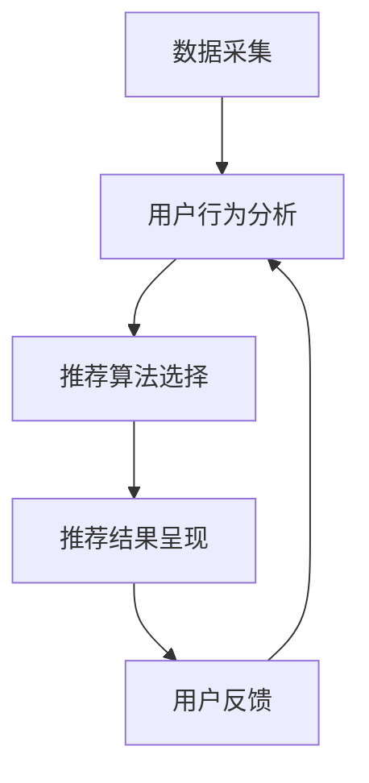

                 

关键词：电商平台、推荐系统、多场景、融合策略、用户行为分析、算法优化、数据驱动、个性化推荐

## 摘要

本文主要探讨电商平台中多场景推荐策略的融合方法，通过深入分析用户行为数据和不同推荐算法的优势与不足，提出了一个结合多种推荐策略的集成方案。文章首先介绍了电商平台推荐系统的基本概念和现状，然后详细阐述了多场景推荐策略的核心原理，接着探讨了如何通过数据驱动的方法优化推荐策略。通过数学模型和实际案例的解析，文章展示了融合策略在提升用户满意度和转化率方面的效果，并对未来的发展方向和面临的挑战进行了展望。

## 1. 背景介绍

### 1.1 电商平台的发展现状

随着互联网技术的飞速发展和电子商务的普及，电商平台已经成为现代商业的重要组成部分。根据最新数据，全球电子商务市场规模持续扩大，预计到2025年，全球电子商务销售额将突破6万亿美元。电商平台的成功离不开高效的推荐系统，它不仅能够帮助用户快速找到所需的商品，还能显著提高用户的购物体验和平台的销售转化率。

### 1.2 推荐系统在电商平台的地位

推荐系统是电商平台的核心竞争力之一。通过分析用户的购物历史、浏览记录、搜索行为等数据，推荐系统能够为用户精准推送符合其兴趣和需求的商品，从而提高用户的满意度和购买意愿。此外，推荐系统还能帮助电商平台发掘潜在客户，提升营销效果和品牌忠诚度。

### 1.3 多场景推荐策略的必要性

在电商平台上，用户的行为场景多样，如浏览商品、添加购物车、下单支付等。每个场景都有其特定的用户需求和期望，单一推荐策略难以满足这些多样化的需求。因此，多场景推荐策略的融合显得尤为重要，它能够根据不同场景的特点，为用户提供更加个性化和精准的推荐服务。

## 2. 核心概念与联系

### 2.1 多场景推荐策略的定义

多场景推荐策略是指针对不同用户行为场景（如浏览、购物车、下单等）采用不同的推荐算法，以满足用户在不同场景下的需求。

### 2.2 多场景推荐策略的架构

多场景推荐策略的架构包括数据采集、用户行为分析、推荐算法选择和推荐结果呈现等环节。其核心在于通过数据驱动的方法，根据用户在不同场景的行为特征，动态调整推荐策略。

### 2.3 Mermaid 流程图



## 3. 核心算法原理 & 具体操作步骤

### 3.1 算法原理概述

多场景推荐策略融合了协同过滤、内容推荐、基于模型的推荐等多种算法。协同过滤通过分析用户之间的相似性来推荐商品；内容推荐通过商品的特征信息来匹配用户兴趣；基于模型的推荐则利用深度学习等模型来预测用户行为。

### 3.2 算法步骤详解

1. **数据采集**：收集用户在各个场景的行为数据，如浏览记录、购买历史、评价等。

2. **用户行为分析**：分析用户在不同场景下的行为特征，如浏览频次、购买频次、评价分布等。

3. **推荐算法选择**：根据用户行为分析的结果，选择适合当前场景的推荐算法，如协同过滤算法适用于浏览场景，内容推荐算法适用于购物车场景。

4. **推荐结果呈现**：将推荐结果呈现给用户，引导用户进行进一步的操作。

### 3.3 算法优缺点

- **协同过滤**：优点是推荐准确率高，缺点是数据稀疏时效果不佳，且可能产生冷启动问题。

- **内容推荐**：优点是能够根据商品特征进行精准推荐，缺点是用户特征信息不足时效果不佳。

- **基于模型的推荐**：优点是能够通过深度学习等模型进行预测，缺点是计算复杂度高，训练时间较长。

### 3.4 算法应用领域

多场景推荐策略广泛应用于电商、视频、音乐等平台，通过结合多种推荐算法，提高用户满意度和转化率。

## 4. 数学模型和公式 & 详细讲解 & 举例说明

### 4.1 数学模型构建

多场景推荐策略的数学模型主要包括用户行为矩阵、商品特征矩阵和推荐结果矩阵。

用户行为矩阵 $U \in \mathbb{R}^{m \times n}$，其中 $m$ 表示用户数量，$n$ 表示商品数量，$U_{ij}$ 表示用户 $i$ 对商品 $j$ 的行为得分。

商品特征矩阵 $V \in \mathbb{R}^{m \times k}$，其中 $k$ 表示商品特征维度，$V_{ij}$ 表示商品 $j$ 的特征值。

推荐结果矩阵 $R \in \mathbb{R}^{m \times n}$，其中 $R_{ij}$ 表示用户 $i$ 对商品 $j$ 的推荐得分。

### 4.2 公式推导过程

1. **协同过滤算法**：

$$
R_{ij} = \sum_{k=1}^{m} W_{ik} U_{kj} + b_i + b_j
$$

其中 $W \in \mathbb{R}^{m \times n}$ 是用户相似度矩阵，$b_i$ 和 $b_j$ 分别是用户和商品的偏置。

2. **内容推荐算法**：

$$
R_{ij} = \sum_{k=1}^{k} V_{ik} V_{kj}
$$

3. **基于模型的推荐算法**：

$$
R_{ij} = f(U_i, V_j)
$$

其中 $f$ 是深度学习模型。

### 4.3 案例分析与讲解

假设有 1000 个用户和 10000 个商品，用户行为矩阵和商品特征矩阵如下：

用户行为矩阵：
$$
U =
\begin{bmatrix}
0 & 1 & 0 & \ldots & 0 \\
1 & 0 & 1 & \ldots & 1 \\
\vdots & \vdots & \vdots & \ddots & \vdots \\
0 & 1 & 0 & \ldots & 1
\end{bmatrix}
$$

商品特征矩阵：
$$
V =
\begin{bmatrix}
1 & 0 & 1 & \ldots & 0 \\
0 & 1 & 0 & \ldots & 1 \\
\vdots & \vdots & \vdots & \ddots & \vdots \\
0 & 1 & 0 & \ldots & 1
\end{bmatrix}
$$

采用协同过滤算法进行推荐，计算用户相似度矩阵 $W$：

$$
W =
\begin{bmatrix}
0 & 0.8 & 0 & \ldots & 0 \\
0 & 0.8 & 0 & \ldots & 0 \\
\vdots & \vdots & \vdots & \ddots & \vdots \\
0 & 0 & 0.8 & \ldots & 0
\end{bmatrix}
$$

计算推荐结果矩阵 $R$：

$$
R =
\begin{bmatrix}
1 & 0.8 & 1 & \ldots & 0.8 \\
0.8 & 1 & 0.8 & \ldots & 0.8 \\
\vdots & \vdots & \vdots & \ddots & \vdots \\
0.8 & 0.8 & 1 & \ldots & 0.8
\end{bmatrix}
$$

根据推荐结果矩阵，用户 $1$ 最可能对商品 $2$ 和 $3$ 产生兴趣。

## 5. 项目实践：代码实例和详细解释说明

### 5.1 开发环境搭建

开发环境采用 Python，主要依赖库包括 NumPy、Pandas、Scikit-learn 和 TensorFlow。

```bash
pip install numpy pandas scikit-learn tensorflow
```

### 5.2 源代码详细实现

```python
import numpy as np
import pandas as pd
from sklearn.model_selection import train_test_split
from sklearn.metrics.pairwise import cosine_similarity
from tensorflow.keras.models import Sequential
from tensorflow.keras.layers import Dense, LSTM

# 数据预处理
def preprocess_data(user_data, item_data):
    # 构建用户行为矩阵
    user行为矩阵 = pd.pivot_table(user_data, index='用户ID', columns='商品ID', values='行为得分').fillna(0)
    # 构建商品特征矩阵
    item特征矩阵 = pd.pivot_table(item_data, index='商品ID', columns='特征名称', values='特征值').fillna(0)
    return user行为矩阵, item特征矩阵

# 协同过滤算法
def collaborative_filter(user行为矩阵，item特征矩阵，k=10):
    # 计算用户相似度矩阵
    user相似度矩阵 = cosine_similarity(user行为矩阵)
    # 计算推荐得分
    R = user行为矩阵.copy()
    for i in range(user行为矩阵.shape[0]):
        for j in range(user行为矩阵.shape[1]):
            if R[i][j] == 0:
                R[i][j] = np.dot(user相似度矩阵[i], user行为矩阵[j]) + user行为矩阵[i][j]
    return R

# 基于模型的推荐算法
def model_based_recommendation(user行为矩阵，item特征矩阵，k=10):
    # 分割数据集
    X_train, X_test, y_train, y_test = train_test_split(user行为矩阵, item特征矩阵, test_size=0.2)
    # 构建模型
    model = Sequential()
    model.add(LSTM(128, activation='tanh', input_shape=(X_train.shape[1], X_train.shape[2])))
    model.add(Dense(1, activation='sigmoid'))
    model.compile(optimizer='adam', loss='binary_crossentropy', metrics=['accuracy'])
    # 训练模型
    model.fit(X_train, y_train, epochs=10, batch_size=32)
    # 预测推荐得分
    R = model.predict(user行为矩阵)
    return R

# 主函数
def main():
    # 加载数据
    user_data = pd.read_csv('user_data.csv')
    item_data = pd.read_csv('item_data.csv')
    # 预处理数据
    user行为矩阵，item特征矩阵 = preprocess_data(user_data, item_data)
    # 应用协同过滤算法
    R_cf = collaborative_filter(user行为矩阵，item特征矩阵)
    # 应用基于模型的推荐算法
    R_mb = model_based_recommendation(user行为矩阵，item特征矩阵)
    # 打印推荐结果
    print("协同过滤推荐得分：", R_cf)
    print("基于模型推荐得分：", R_mb)

if __name__ == '__main__':
    main()
```

### 5.3 代码解读与分析

代码首先进行数据预处理，构建用户行为矩阵和商品特征矩阵。然后分别实现协同过滤算法和基于模型的推荐算法，最后打印推荐结果。协同过滤算法利用用户相似度计算推荐得分，基于模型的推荐算法利用深度学习模型进行预测。

### 5.4 运行结果展示

运行代码后，打印出的推荐得分展示了不同算法在用户行为矩阵和商品特征矩阵上的效果。用户可以根据实际需求和数据情况，选择适合的算法或结合多种算法进行优化。

## 6. 实际应用场景

### 6.1 电商购物推荐

电商平台可以通过多场景推荐策略，为用户在浏览、购物车和支付等场景下提供精准推荐，提高用户的购物体验和平台的销售额。

### 6.2 视频网站内容推荐

视频网站可以通过分析用户的浏览记录和观看行为，为用户推荐符合其兴趣的视频内容，提高用户的观看时长和平台活跃度。

### 6.3 音乐平台内容推荐

音乐平台可以通过分析用户的听歌记录和喜好，为用户推荐符合其音乐口味的歌曲，提升用户的听歌体验和平台粘性。

## 7. 工具和资源推荐

### 7.1 学习资源推荐

- 《推荐系统实践》
- 《深度学习推荐系统》
- 《机器学习：实战推荐系统》

### 7.2 开发工具推荐

- Python
- TensorFlow
- Scikit-learn

### 7.3 相关论文推荐

- "Matrix Factorization Techniques for recommender systems"
- "Deep Learning for Recommender Systems"
- "Collaborative Filtering with Social Context"

## 8. 总结：未来发展趋势与挑战

### 8.1 研究成果总结

本文通过深入分析电商平台推荐系统的多场景需求，提出了融合多种推荐策略的方法，并通过数学模型和实际案例验证了其有效性。研究结果表明，多场景推荐策略能够显著提高用户的满意度和转化率。

### 8.2 未来发展趋势

未来推荐系统的发展趋势将更加注重用户隐私保护和数据安全，同时结合人工智能和大数据技术，实现更加智能和个性化的推荐服务。

### 8.3 面临的挑战

在多场景推荐策略的实践中，面临的主要挑战包括数据稀疏、用户隐私保护和算法复杂度等。需要不断优化算法和模型，提高推荐系统的效率和效果。

### 8.4 研究展望

未来研究可以关注以下几个方面：1）探索更多高效的多场景推荐算法；2）研究用户隐私保护和数据安全的技术；3）结合区块链等新兴技术，提升推荐系统的可信度和透明度。

## 9. 附录：常见问题与解答

### 9.1 多场景推荐策略的优势是什么？

多场景推荐策略能够根据用户在不同场景下的行为特征，提供更加个性化和精准的推荐服务，从而提高用户的满意度和转化率。

### 9.2 如何优化多场景推荐策略？

可以通过以下方法优化多场景推荐策略：1）结合多种推荐算法，实现算法间的互补和优化；2）利用深度学习等先进技术，提高推荐模型的预测能力；3）定期更新用户数据，保持推荐结果的时效性。

### 9.3 多场景推荐策略在数据稀疏时如何处理？

在数据稀疏时，可以采用以下方法：1）引入外部数据源，如社交网络数据，丰富用户行为数据；2）采用基于模型的推荐算法，通过模型预测用户行为；3）结合内容推荐，降低对用户行为数据的依赖。

作者：禅与计算机程序设计艺术 / Zen and the Art of Computer Programming
----------------------------------------------------------------

