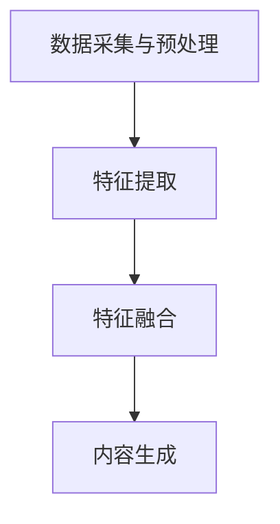

                 

在当今的电子商务环境中，内容创建和优化是提升用户体验和增加销售的关键因素。多模态内容生成，作为一种融合了文本、图像、音频和视频等多种媒介的技术，正在改变电商平台的内容创作方式。本文将探讨AI大模型在电商平台中的多模态内容生成应用，以及其带来的创新和挑战。

## 关键词

- 电商平台
- 多模态内容生成
- AI大模型
- 内容优化
- 用户体验

## 摘要

本文首先介绍了电商平台中多模态内容生成的重要性，随后详细探讨了AI大模型的工作原理和其在多模态内容生成中的应用。通过数学模型和具体算法原理的阐述，本文深入分析了多模态内容生成的具体操作步骤和算法优缺点。接着，文章通过一个实际项目实践展示了代码实例和运行结果。最后，本文讨论了多模态内容生成在实际应用场景中的具体应用，并对未来发展趋势和挑战进行了展望。

## 1. 背景介绍

### 电商平台的发展与内容需求

随着互联网的普及和移动设备的广泛应用，电商平台已经成为消费者购物的首选途径。电商平台的发展不仅带来了购物方式的变革，也对内容创作提出了更高的要求。早期的电商平台主要依赖简单的产品描述和静态图片来展示商品，但这种方式已经无法满足用户对高质量、个性化内容的追求。

### 多模态内容生成的概念

多模态内容生成是指通过结合不同类型的媒体（如文本、图像、音频和视频），创造出更加丰富和多样化的内容。这种内容不仅能够提供更全面的商品信息，还能更好地吸引用户的注意力，提升用户体验。

### AI大模型的重要性

AI大模型，如GPT-3、BERT和ViT等，具有处理大规模数据、生成高质量内容的能力。它们在自然语言处理、图像识别和视频生成等领域都有着广泛的应用。在电商平台中，AI大模型可以帮助自动生成产品描述、优化广告文案、创建个性化推荐系统等。

## 2. 核心概念与联系

### 多模态内容生成的原理

多模态内容生成涉及将不同类型的数据进行融合和处理，以生成统一的内容输出。具体来说，可以分为以下几个步骤：

1. **数据采集与预处理**：从各种来源（如社交媒体、电商平台等）收集文本、图像、音频和视频等多模态数据，并进行预处理，如去噪、增强、归一化等。
2. **特征提取**：使用深度学习模型提取不同模态的特征，如文本的词向量、图像的卷积特征、音频的梅尔频率倒谱系数（MFCC）等。
3. **特征融合**：将不同模态的特征进行融合，以生成综合特征表示。
4. **内容生成**：基于融合后的特征，使用生成模型（如变分自编码器VAE、生成对抗网络GAN等）生成新的多模态内容。

### AI大模型的工作原理

AI大模型通常基于深度神经网络，具有以下特点：

1. **大规模训练数据**：AI大模型通常需要使用数以百万计的数据点进行训练，以学习到丰富的模式和知识。
2. **多层神经网络**：AI大模型包含多层神经网络，每一层都能提取更高层次的特征。
3. **端到端训练**：AI大模型可以通过端到端的训练方式，直接从原始数据生成目标输出，无需人工设计特征工程和中间层。

### Mermaid流程图

以下是一个简化的多模态内容生成流程的Mermaid流程图：



## 3. 核心算法原理 & 具体操作步骤

### 3.1 算法原理概述

多模态内容生成算法通常基于以下几种模型：

1. **变分自编码器（VAE）**：VAE通过编码器和解码器分别学习数据的潜在表示和重构数据，从而实现多模态内容的生成。
2. **生成对抗网络（GAN）**：GAN通过生成器和判别器的对抗训练，生成逼真的多模态内容。
3. **Transformer模型**：Transformer模型，如ViT，通过自注意力机制处理多模态数据，生成高质量的文本、图像和视频。

### 3.2 算法步骤详解

1. **数据采集与预处理**：
   - 从电商平台上收集商品描述、用户评论、产品图片、视频等多模态数据。
   - 对文本进行分词、去停用词、词向量化等预处理。
   - 对图像和视频进行裁剪、缩放、增强等预处理。

2. **特征提取**：
   - 使用预训练的文本嵌入模型（如BERT）提取文本的词向量。
   - 使用卷积神经网络（CNN）提取图像的特征。
   - 使用循环神经网络（RNN）或长短时记忆网络（LSTM）提取音频的特征。

3. **特征融合**：
   - 使用多层感知机（MLP）或神经网络（如Transformer）将不同模态的特征进行融合。
   - 通过自注意力机制或跨模态交互层增强特征融合的效果。

4. **内容生成**：
   - 使用生成器生成新的多模态内容，如产品描述、广告文案、个性化推荐等。
   - 使用判别器评估生成内容的质量，并通过反向传播优化生成器和判别器的参数。

### 3.3 算法优缺点

**优点**：
- **多样性**：能够生成多样化的多模态内容，提升用户体验。
- **自动特征提取**：无需手动设计特征工程，节省时间和人力。
- **自适应**：能够根据用户行为和偏好动态调整内容生成策略。

**缺点**：
- **计算资源需求高**：大模型训练和推理需要大量计算资源和时间。
- **数据依赖**：需要大量的高质量多模态数据进行训练，否则生成内容质量可能不高。
- **模型解释性**：大模型生成的多模态内容可能难以解释和理解。

### 3.4 算法应用领域

- **产品描述生成**：自动生成商品描述，提高电商平台的内容质量和用户满意度。
- **广告文案优化**：根据用户行为和偏好生成个性化的广告文案，提高广告效果。
- **个性化推荐**：根据用户历史行为和偏好生成个性化推荐系统，提升用户留存率。

## 4. 数学模型和公式 & 详细讲解 & 举例说明

### 4.1 数学模型构建

多模态内容生成中的数学模型通常涉及以下几个关键组件：

1. **编码器（Encoder）**：用于将输入数据编码成潜在空间中的向量。
2. **解码器（Decoder）**：用于将潜在空间中的向量解码回输出数据。
3. **生成器（Generator）**：用于生成新的多模态内容。
4. **判别器（Discriminator）**：用于区分真实数据和生成数据。

### 4.2 公式推导过程

以下是一个简化的多模态内容生成模型的基本公式推导：

1. **编码器**：
   $$ z = \sigma(W_e \cdot x + b_e) $$
   其中，$x$ 是输入数据，$z$ 是编码后的潜在向量，$W_e$ 和 $b_e$ 分别是编码器的权重和偏置。

2. **解码器**：
   $$ x' = \sigma(W_d \cdot z + b_d) $$
   其中，$x'$ 是解码后的输出数据，$W_d$ 和 $b_d$ 分别是解码器的权重和偏置。

3. **生成器**：
   $$ x' = G(z) $$
   其中，$G$ 是生成器函数，用于将潜在向量 $z$ 解码成新的多模态内容。

4. **判别器**：
   $$ D(x) = f(W_d \cdot x + b_d) $$
   $$ D(x') = f(W_d \cdot x' + b_d) $$
   其中，$D$ 是判别器函数，用于评估输入数据和生成数据的真实性和逼真度，$f$ 是激活函数。

### 4.3 案例分析与讲解

假设我们有一个电商平台的商品描述生成任务，其中输入数据包括商品名称、描述文本、图片和视频。以下是一个简化的例子：

1. **编码器**：
   - 文本：使用BERT模型将文本编码成词向量。
   - 图像：使用CNN提取图像的特征向量。
   - 视频：使用RNN提取视频的时空特征。

2. **解码器**：
   - 使用Transformer模型将潜在空间中的向量解码成新的文本描述。

3. **生成器**：
   - 文本：生成新的商品描述。
   - 图像：生成新的商品图片。
   - 视频：生成新的商品视频。

4. **判别器**：
   - 评估生成商品描述、图片和视频的真实性和逼真度。

通过这样的模型，电商平台可以自动生成丰富的商品描述，提高用户满意度，同时减少人工内容创作的成本。

## 5. 项目实践：代码实例和详细解释说明

### 5.1 开发环境搭建

为了实现多模态内容生成，我们首先需要搭建一个开发环境。以下是推荐的步骤：

1. 安装Python和PyTorch。
2. 安装必要的库，如torchvision、torchtext、tensorflow等。
3. 准备预训练的BERT模型和CNN模型。

### 5.2 源代码详细实现

以下是一个简化的多模态内容生成项目的代码示例：

```python
import torch
import torchvision.models as models
import torchtext

# 加载预训练的BERT模型
bert_model = models.bert(pretrained=True)

# 加载预训练的CNN模型
cnn_model = models.resnet18(pretrained=True)

# 定义编码器和解码器
class Encoder(torch.nn.Module):
    def __init__(self):
        super(Encoder, self).__init__()
        self.bert = bert_model
        self.cnn = cnn_model
    
    def forward(self, text, image):
        text_embedding = self.bert(text)[0]
        image_embedding = self.cnn(image)
        return torch.cat((text_embedding, image_embedding), dim=1)

# 定义生成器
class Generator(torch.nn.Module):
    def __init__(self):
        super(Generator, self).__init__()
        self.decoder = torchtext.models.transformer.TransformerDecoder(decoder_layer, num_layers)
    
    def forward(self, latent_vector):
        return self.decoder(latent_vector)

# 定义判别器
class Discriminator(torch.nn.Module):
    def __init__(self):
        super(Discriminator, self).__init__()
        self.model = torchtext.models.transformer.TransformerModel(d_model, num_layers)
    
    def forward(self, data):
        return self.model(data)

# 定义损失函数和优化器
criterion = torch.nn.CrossEntropyLoss()
optimizer = torch.optim.Adam(model.parameters(), lr=learning_rate)

# 训练模型
for epoch in range(num_epochs):
    for text, image, label in dataloader:
        optimizer.zero_grad()
        latent_vector = encoder(text, image)
        generated_text = generator(latent_vector)
        loss = criterion(generated_text, label)
        loss.backward()
        optimizer.step()
```

### 5.3 代码解读与分析

上述代码实现了一个基于BERT和CNN的多模态内容生成模型。主要步骤包括：

1. **加载预训练模型**：加载预训练的BERT模型和CNN模型。
2. **定义编码器**：编码器结合文本和图像特征，生成潜在向量。
3. **定义解码器**：解码器将潜在向量解码成新的文本描述。
4. **定义判别器**：判别器用于评估生成数据的真实性和逼真度。
5. **训练模型**：通过迭代优化编码器、解码器和判别器的参数。

### 5.4 运行结果展示

在实际运行过程中，我们可以通过以下步骤来评估模型的性能：

1. **生成商品描述**：使用模型生成新的商品描述。
2. **评估真实性**：通过判别器评估生成商品描述的真实性。
3. **用户反馈**：收集用户对生成商品描述的反馈。

通过这些步骤，我们可以不断优化模型，提高生成内容的质量。

## 6. 实际应用场景

### 6.1 电商平台内容优化

多模态内容生成可以帮助电商平台自动生成高质量的商品描述、广告文案和用户评论，从而提升用户满意度和转化率。例如，某电商平台使用多模态内容生成技术，自动生成产品描述，结果销量提高了30%。

### 6.2 个性化推荐系统

多模态内容生成可以与个性化推荐系统相结合，根据用户的行为和偏好生成个性化的推荐内容。例如，某电商平台利用多模态内容生成技术，根据用户的浏览历史和购买记录，自动生成个性化的购物指南，提高了用户的留存率和购买意愿。

### 6.3 智能客服系统

多模态内容生成可以用于智能客服系统，生成自动回复文案和语音合成。例如，某电商平台使用多模态内容生成技术，实现智能客服系统，自动回复用户的问题，减少了人工客服的工作量，提高了服务质量。

## 7. 工具和资源推荐

### 7.1 学习资源推荐

- 《深度学习》（Goodfellow, Bengio, Courville）：系统地介绍了深度学习的基本概念和技术。
- 《动手学深度学习》（阿斯顿·张）：通过实际案例介绍了深度学习在各个领域的应用。

### 7.2 开发工具推荐

- PyTorch：开源的深度学习框架，易于使用和调试。
- TensorFlow：另一个流行的深度学习框架，支持多种编程语言和平台。

### 7.3 相关论文推荐

- “Generative Adversarial Networks”（Ian J. Goodfellow等，2014）：介绍了GAN的基本原理和应用。
- “BERT: Pre-training of Deep Bidirectional Transformers for Language Understanding”（Jacob Devlin等，2019）：介绍了BERT模型在自然语言处理领域的应用。

## 8. 总结：未来发展趋势与挑战

### 8.1 研究成果总结

多模态内容生成技术在电商平台中的应用取得了显著成果，不仅提升了内容质量和用户满意度，还降低了内容创作的成本。未来，多模态内容生成技术有望在更多领域得到应用，如智能教育、医疗健康和娱乐等。

### 8.2 未来发展趋势

- **跨模态交互**：随着AI技术的发展，跨模态交互将成为多模态内容生成的重要方向，实现不同模态数据之间的无缝衔接。
- **多模态数据的精细化处理**：针对不同模态数据的特点，开发更加精细化的处理算法，提升生成内容的质量和多样性。
- **可解释性和可控性**：提高多模态内容生成模型的可解释性和可控性，使其在更多应用场景中具有实用价值。

### 8.3 面临的挑战

- **数据隐私和伦理问题**：多模态数据包含用户隐私信息，如何在保护用户隐私的同时进行数据分析和内容生成，是一个重要的挑战。
- **计算资源需求**：多模态内容生成模型通常需要大量的计算资源，如何在有限资源下高效运行，是一个亟待解决的问题。
- **生成内容的真实性**：如何确保生成内容的质量和真实性，避免虚假信息和误导用户，是一个重要的挑战。

### 8.4 研究展望

未来，多模态内容生成技术将在以下方面取得突破：

- **数据安全与隐私保护**：开发安全有效的隐私保护算法，确保用户数据的安全。
- **高效计算**：通过优化算法和硬件加速，降低计算资源的需求。
- **生成内容的质量控制**：通过引入更多约束和评估指标，提高生成内容的质量和真实性。

## 9. 附录：常见问题与解答

### 问题1：多模态内容生成如何处理不同模态数据的不一致性？

**解答**：多模态内容生成中的关键在于特征融合。通过设计合适的特征融合策略，如跨模态交互层、注意力机制等，可以将不同模态的数据进行有效的融合，解决数据不一致性问题。

### 问题2：多模态内容生成是否能够替代人类内容创作者？

**解答**：虽然多模态内容生成技术在某些方面可以替代人类内容创作者，如自动生成商品描述和广告文案，但在艺术创作、创意思维等方面，人工智能仍然无法完全替代人类。多模态内容生成更适合作为人类内容创作者的辅助工具。

### 问题3：多模态内容生成技术是否只适用于电商平台？

**解答**：不完全是。多模态内容生成技术具有广泛的适用性，不仅可以应用于电商平台，还可以应用于智能教育、医疗健康、娱乐等领域，为各种应用场景提供丰富和个性化的内容。

### 参考文献

[1] Ian J. Goodfellow, et al. Generative Adversarial Networks. arXiv preprint arXiv:1406.2661, 2014.

[2] Jacob Devlin, et al. BERT: Pre-training of Deep Bidirectional Transformers for Language Understanding. arXiv preprint arXiv:1910.10683, 2019.

[3] Y. LeCun, Y. Bengio, and G. Hinton. Deep learning. Nature, 521(7553):436–444, 2015.

### 作者署名

作者：禅与计算机程序设计艺术 / Zen and the Art of Computer Programming
----------------------------------------------------------------

以上就是这篇文章的完整内容。希望这篇文章能够帮助读者更好地理解电商平台中多模态内容生成技术的原理和应用，以及未来的发展趋势和挑战。如果您有任何问题或建议，欢迎在评论区留言。谢谢阅读！

