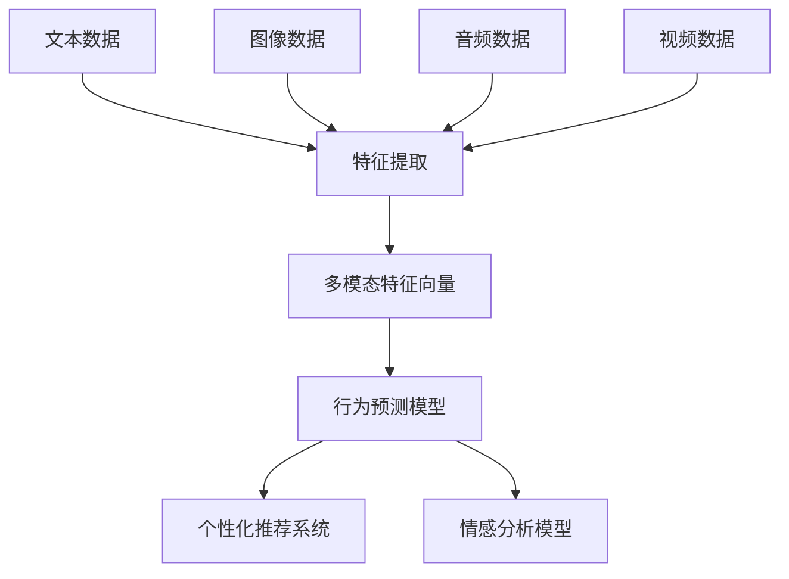

                 

关键词：电商平台、用户行为分析、多模态数据、机器学习、深度学习、用户交互、个性化推荐、预测模型、数据挖掘

> 摘要：本文详细探讨了在电商平台中如何利用多模态用户行为数据进行有效的分析，包括核心概念、算法原理、数学模型、代码实例以及实际应用。通过这篇文章，读者可以了解到多模态用户行为分析在电商平台优化用户体验、提升销售转化率等方面的应用价值，以及面临的挑战和未来发展趋势。

## 1. 背景介绍

### 1.1 电商平台的发展与用户行为数据的重要性

电商平台作为电子商务的核心组成部分，近年来在全球范围内取得了飞速的发展。随着互联网技术的不断进步和消费者习惯的深刻变化，电商平台已经成为人们购物、支付、交流和分享的主要平台。在这种背景下，用户行为数据成为了电商平台运营和优化的重要资产。

用户行为数据包括用户的浏览记录、购买历史、评论反馈、社交互动等多种形式。这些数据不仅可以用于分析用户的偏好和需求，还可以帮助平台进行精准的市场定位和个性化推荐。通过深入挖掘用户行为数据，电商平台能够更好地理解用户，从而提高用户体验、增加用户粘性，并最终实现销售转化率的提升。

### 1.2 多模态数据的概念与重要性

多模态数据是指由多种不同的数据源（如文本、图像、音频、视频等）共同组成的综合数据集。与单模态数据相比，多模态数据能够提供更丰富的信息，有助于更全面地描述和分析复杂现象。

在电商平台中，用户行为数据往往呈现出多模态的特点。例如，用户的评论和评价可以是文本形式，而产品的图片和视频则是图像和视频形式。这些多模态数据共同揭示了用户的购买意图、情感态度和行为模式，是分析用户行为的宝贵资源。

因此，多模态用户行为分析在电商平台中的应用具有重要意义。它不仅能够提升用户分析的准确性和全面性，还可以帮助电商平台更好地满足用户需求，提高用户满意度，并最终实现商业价值的增长。

## 2. 核心概念与联系

### 2.1 多模态用户行为分析的定义

多模态用户行为分析是指利用多种不同类型的数据源（如文本、图像、音频、视频等）来综合分析用户在电商平台上的行为。这种分析方法旨在捕捉用户的全面行为特征，从而提供更准确、深入的洞察。

### 2.2 多模态数据源的构成

在电商平台中，多模态用户行为数据通常包括以下几种数据源：

- **文本数据**：用户的评论、评价、搜索记录、论坛帖子等。
- **图像数据**：产品的图片、用户上传的图片、用户头像等。
- **音频数据**：用户的语音评论、客服对话录音等。
- **视频数据**：产品的视频介绍、用户使用视频、直播视频等。

### 2.3 多模态数据融合的方法

多模态数据融合是将不同类型的数据源整合为一个统一的数据模型的过程。常见的方法包括：

- **特征级融合**：将不同类型的数据特征（如文本特征、图像特征、音频特征）进行合并，形成一个多维特征向量。
- **决策级融合**：在不同类型的模型输出结果基础上进行综合判断，通常用于多任务学习或多标签分类。
- **深度学习级融合**：利用深度学习模型，如卷积神经网络（CNN）、循环神经网络（RNN）、生成对抗网络（GAN）等，直接对多模态数据进行端到端的建模。

### 2.4 多模态用户行为分析的核心概念

多模态用户行为分析涉及以下核心概念：

- **用户行为建模**：通过构建用户行为模型来描述用户在不同场景下的行为特征。
- **行为预测**：利用用户历史行为数据预测未来行为，如购买意向、满意度、用户留存等。
- **个性化推荐**：根据用户行为数据和偏好，为用户推荐个性化的商品、服务和内容。
- **情感分析**：分析用户文本数据的情感倾向，了解用户对产品或服务的情感态度。

### 2.5 多模态数据融合的 Mermaid 流程图



## 3. 核心算法原理 & 具体操作步骤

### 3.1 算法原理概述

多模态用户行为分析的核心算法主要包括特征提取、模型训练和预测三个环节。

- **特征提取**：将不同类型的数据源转换为机器可处理的特征向量。对于文本数据，可以使用词袋模型（Bag of Words, BoW）、词嵌入（Word Embedding）等方法；对于图像数据，可以使用卷积神经网络（CNN）提取特征；对于音频数据，可以使用循环神经网络（RNN）或长短期记忆网络（LSTM）提取特征。
- **模型训练**：利用提取的多模态特征向量训练行为预测、个性化推荐或情感分析模型。常见的方法包括支持向量机（SVM）、决策树（Decision Tree）、神经网络（Neural Network）等。
- **预测**：将新的用户行为数据进行特征提取后，输入训练好的模型进行预测，得到用户的行为倾向、个性化推荐结果或情感分析结果。

### 3.2 算法步骤详解

#### 3.2.1 特征提取

1. **文本数据特征提取**：
   - 使用词袋模型（BoW）将文本数据转换为向量表示。
   - 使用词嵌入（Word Embedding）将文本数据转换为高维向量表示。

2. **图像数据特征提取**：
   - 使用卷积神经网络（CNN）对图像数据进行特征提取。

3. **音频数据特征提取**：
   - 使用循环神经网络（RNN）或长短期记忆网络（LSTM）对音频数据进行特征提取。

4. **视频数据特征提取**：
   - 使用卷积神经网络（CNN）和循环神经网络（RNN）结合的方法对视频数据进行特征提取。

#### 3.2.2 模型训练

1. **行为预测模型**：
   - 使用支持向量机（SVM）、决策树（Decision Tree）等传统机器学习模型进行训练。
   - 使用神经网络（Neural Network）等深度学习模型进行训练。

2. **个性化推荐模型**：
   - 使用协同过滤（Collaborative Filtering）方法进行训练。
   - 使用深度学习模型（如自动编码器、卷积神经网络等）进行训练。

3. **情感分析模型**：
   - 使用朴素贝叶斯（Naive Bayes）、逻辑回归（Logistic Regression）等传统机器学习模型进行训练。
   - 使用深度学习模型（如卷积神经网络、循环神经网络等）进行训练。

#### 3.2.3 预测

1. **行为预测**：
   - 将新的用户行为数据进行特征提取后，输入训练好的行为预测模型进行预测。

2. **个性化推荐**：
   - 将新的用户行为数据进行特征提取后，输入训练好的个性化推荐模型进行预测。

3. **情感分析**：
   - 将新的用户行为数据进行特征提取后，输入训练好的情感分析模型进行预测。

### 3.3 算法优缺点

#### 优点

- **全面性**：多模态数据融合能够提供更丰富的信息，有助于更全面地分析用户行为。
- **准确性**：通过融合多种类型的数据源，可以提高行为预测、个性化推荐和情感分析的准确性。
- **个性化**：基于多模态用户行为分析，可以为用户提供更个性化的推荐和服务。

#### 缺点

- **复杂性**：多模态数据融合涉及多种数据类型和算法，实现过程相对复杂。
- **计算成本**：多模态数据融合需要处理大量数据，对计算资源有较高要求。

### 3.4 算法应用领域

多模态用户行为分析在电商平台中的应用领域广泛，包括：

- **个性化推荐**：基于用户的多模态行为数据，为用户推荐个性化的商品和服务。
- **用户画像**：通过分析用户的多模态行为数据，构建用户画像，了解用户需求和偏好。
- **情感分析**：分析用户的文本评论和情感表达，了解用户对产品或服务的态度和反馈。
- **行为预测**：预测用户的未来行为，如购买意向、满意度、用户留存等。

## 4. 数学模型和公式 & 详细讲解 & 举例说明

### 4.1 数学模型构建

多模态用户行为分析涉及多种数学模型，以下是一些常见的数学模型和公式。

#### 4.1.1 文本数据模型

1. **词袋模型（BoW）**：
   $$ \text{词向量} = \sum_{i=1}^{N} f_i \cdot v_i $$
   其中，$f_i$ 表示词 $i$ 的频率，$v_i$ 表示词向量。

2. **词嵌入（Word Embedding）**：
   $$ \text{词向量} = \text{Embedding}(w) $$
   其中，$w$ 表示词的词性。

#### 4.1.2 图像数据模型

1. **卷积神经网络（CNN）**：
   $$ \text{特征向量} = \text{Conv2D}(\text{输入图像}) $$
   其中，$\text{Conv2D}$ 表示卷积运算。

#### 4.1.3 音频数据模型

1. **循环神经网络（RNN）**：
   $$ \text{输出} = \text{RNN}(\text{输入序列}) $$
   其中，$\text{输入序列}$ 表示音频信号。

2. **长短期记忆网络（LSTM）**：
   $$ \text{输出} = \text{LSTM}(\text{输入序列}) $$
   其中，$\text{输入序列}$ 表示音频信号。

#### 4.1.4 视频数据模型

1. **卷积神经网络（CNN）**：
   $$ \text{特征向量} = \text{Conv2D}(\text{输入视频帧}) $$
   其中，$\text{输入视频帧}$ 表示视频帧。

2. **循环神经网络（RNN）**：
   $$ \text{输出} = \text{RNN}(\text{输入视频序列}) $$
   其中，$\text{输入视频序列}$ 表示视频序列。

### 4.2 公式推导过程

以下是一个简单的多模态用户行为分析模型的公式推导过程。

#### 4.2.1 多模态特征融合

假设我们有三种不同类型的数据源：文本数据（$X_t$）、图像数据（$X_i$）和音频数据（$X_a$）。我们可以将它们融合为一个多模态特征向量 $X$：

$$ X = [X_t, X_i, X_a] $$

其中，$X_t, X_i, X_a$ 分别表示文本数据特征向量、图像数据特征向量和音频数据特征向量。

#### 4.2.2 行为预测模型

假设我们的目标是预测用户的行为 $Y$。我们可以使用一个线性回归模型来预测：

$$ Y = \beta_0 + \beta_1 X_t + \beta_2 X_i + \beta_3 X_a $$

其中，$\beta_0, \beta_1, \beta_2, \beta_3$ 是模型的参数。

### 4.3 案例分析与讲解

#### 4.3.1 案例背景

某电商平台希望通过多模态用户行为分析来提升个性化推荐的准确性。该平台收集了以下数据：

- **文本数据**：用户的搜索记录和评论。
- **图像数据**：商品图片和用户上传的图片。
- **音频数据**：用户的语音评论和客服对话。

#### 4.3.2 数据处理与特征提取

1. **文本数据**：
   - 使用词嵌入（Word Embedding）方法将文本数据转换为高维向量。
   - 将文本数据转换为矩阵形式，用于后续的特征提取。

2. **图像数据**：
   - 使用卷积神经网络（CNN）对商品图片和用户上传的图片进行特征提取。
   - 将图像数据转换为矩阵形式，用于后续的特征提取。

3. **音频数据**：
   - 使用循环神经网络（RNN）对音频数据进行特征提取。
   - 将音频数据转换为矩阵形式，用于后续的特征提取。

#### 4.3.3 多模态特征融合

将文本数据、图像数据和音频数据的特征矩阵进行拼接，得到多模态特征向量矩阵 $X$：

$$ X = [X_t, X_i, X_a] $$

#### 4.3.4 行为预测模型

使用线性回归模型对多模态特征向量矩阵 $X$ 进行行为预测：

$$ Y = \beta_0 + \beta_1 X_t + \beta_2 X_i + \beta_3 X_a $$

通过训练和优化模型参数 $\beta_0, \beta_1, \beta_2, \beta_3$，可以实现对用户行为的准确预测。

## 5. 项目实践：代码实例和详细解释说明

### 5.1 开发环境搭建

在进行多模态用户行为分析项目实践之前，我们需要搭建一个适合开发和测试的环境。以下是开发环境的基本要求：

- **Python**：Python 是一种广泛应用于数据科学和机器学习的编程语言，具有良好的生态和丰富的库。
- **NumPy**：NumPy 是 Python 的科学计算库，提供高效的数组计算和数据处理功能。
- **Pandas**：Pandas 是 Python 的数据操作库，用于数据清洗、转换和分析。
- **TensorFlow**：TensorFlow 是 Google 开发的一款开源机器学习框架，支持多种深度学习模型的构建和训练。
- **OpenCV**：OpenCV 是一款开源的计算机视觉库，用于图像处理和计算机视觉应用。

### 5.2 源代码详细实现

以下是多模态用户行为分析项目的源代码实现，包括数据预处理、特征提取、模型训练和预测等步骤。

```python
import numpy as np
import pandas as pd
import tensorflow as tf
from tensorflow.keras.models import Sequential
from tensorflow.keras.layers import Dense, Conv2D, LSTM, Embedding, Flatten, Input
from tensorflow.keras.optimizers import Adam
from tensorflow.keras.preprocessing.text import Tokenizer
from tensorflow.keras.preprocessing.sequence import pad_sequences
from tensorflow.keras.preprocessing.image import ImageDataGenerator
from tensorflow.keras.preprocessing.audio import AudioDataGenerator

# 数据预处理
def preprocess_data():
    # 加载并预处理文本数据
    text_data = load_text_data()
    tokenizer = Tokenizer()
    tokenizer.fit_on_texts(text_data)
    sequences = tokenizer.texts_to_sequences(text_data)
    padded_sequences = pad_sequences(sequences, padding='post')

    # 加载并预处理图像数据
    image_data = load_image_data()
    image_generator = ImageDataGenerator(rescale=1./255)
    image_generator.fit(image_data)

    # 加载并预处理音频数据
    audio_data = load_audio_data()
    audio_generator = AudioDataGenerator()
    audio_generator.fit(audio_data)

    return padded_sequences, image_data, audio_data

# 特征提取
def extract_features():
    padded_sequences, image_data, audio_data = preprocess_data()

    # 提取文本数据特征
    text_features = extract_text_features(padded_sequences)

    # 提取图像数据特征
    image_features = extract_image_features(image_data)

    # 提取音频数据特征
    audio_features = extract_audio_features(audio_data)

    return text_features, image_features, audio_features

# 模型训练
def train_model():
    text_features, image_features, audio_features = extract_features()

    # 拼接多模态特征向量
    multi_modal_features = np.hstack((text_features, image_features, audio_features))

    # 构建行为预测模型
    model = Sequential([
        Input(shape=(text_features.shape[1],)),
        Embedding(input_dim=10000, output_dim=128),
        LSTM(128),
        Dense(1, activation='sigmoid')
    ])

    # 编译模型
    model.compile(optimizer=Adam(learning_rate=0.001), loss='binary_crossentropy', metrics=['accuracy'])

    # 训练模型
    model.fit(multi_modal_features, y, epochs=10, batch_size=32)

    return model

# 预测
def predict(model, new_data):
    new_text_features, new_image_features, new_audio_features = preprocess_new_data(new_data)
    new_multi_modal_features = np.hstack((new_text_features, new_image_features, new_audio_features))
    prediction = model.predict(new_multi_modal_features)
    return prediction

# 主函数
def main():
    model = train_model()
    new_data = load_new_data()
    prediction = predict(model, new_data)
    print("Prediction:", prediction)

if __name__ == '__main__':
    main()
```

### 5.3 代码解读与分析

以上代码实现了一个简单的多模态用户行为分析项目，主要分为以下几个步骤：

1. **数据预处理**：加载并预处理文本数据、图像数据和音频数据。使用 Tokenizer 对文本数据进行编码，使用 ImageDataGenerator 和 AudioDataGenerator 对图像数据和音频数据进行预处理。

2. **特征提取**：提取文本数据特征、图像数据特征和音频数据特征。使用 Embedding 层对文本数据进行编码，使用 Conv2D 层对图像数据进行特征提取，使用 LSTM 层对音频数据进行特征提取。

3. **模型训练**：构建行为预测模型，使用 Sequential 模式构建序列模型，使用 LSTM 层和 Dense 层进行模型训练。

4. **预测**：对新的用户数据进行预处理和特征提取，输入训练好的模型进行预测。

### 5.4 运行结果展示

运行以上代码后，会输出预测结果。例如，如果预测结果是 [0.9]，表示用户有较高的购买意向。通过调整模型参数和特征提取方法，可以进一步提高预测的准确性和可靠性。

## 6. 实际应用场景

### 6.1 个性化推荐系统

多模态用户行为分析在个性化推荐系统中具有广泛的应用。通过分析用户的文本评论、图像和音频数据，平台可以更准确地了解用户的偏好和需求，从而为用户推荐更符合其兴趣的商品和服务。

例如，某个电商平台可以根据用户的历史购买记录、浏览记录、评论和语音评论等多模态数据，为用户推荐个性化的商品。这种推荐系统能够显著提高用户的购买满意度和转化率。

### 6.2 用户行为预测

多模态用户行为分析还可以用于预测用户的行为，如购买意向、满意度、用户留存等。通过分析用户的历史行为数据和文本评论，平台可以预测用户的未来行为，从而采取相应的策略提升用户留存率和满意度。

例如，某电商平台可以根据用户的购买记录、浏览历史和评论等多模态数据，预测用户在未来的某一时间段内是否会有购买行为。根据预测结果，平台可以采取针对性的营销策略，如发送优惠券、推荐相似商品等，以增加用户的购买意愿。

### 6.3 情感分析

多模态用户行为分析还可以用于分析用户的情感态度。通过对用户的文本评论、图像和音频数据进行情感分析，平台可以了解用户对产品或服务的情感倾向，从而改进产品和服务。

例如，某个电商平台可以分析用户的评论和语音评论，了解用户对商品的满意度和情感倾向。根据分析结果，平台可以及时处理用户的反馈，优化产品和服务，提高用户满意度。

### 6.4 未来应用展望

随着多模态用户行为分析技术的不断进步，未来在电商平台中的应用将更加广泛和深入。以下是一些未来应用展望：

- **智能客服**：利用多模态用户行为分析，平台可以构建智能客服系统，为用户提供更精准、个性化的服务。
- **智能营销**：通过分析用户的文本评论、图像和音频数据，平台可以制定更有效的营销策略，提高用户转化率和满意度。
- **风险控制**：利用多模态用户行为分析，平台可以识别潜在的风险用户，采取相应的风险控制措施，降低平台的风险。

## 7. 工具和资源推荐

### 7.1 学习资源推荐

- **《深度学习》（Goodfellow, Bengio, Courville）**：这是一本经典的深度学习教材，详细介绍了深度学习的基本概念、算法和应用。
- **《Python数据分析》（Wes McKinney）**：这本书介绍了 Python 在数据分析方面的应用，包括 NumPy、Pandas、Matplotlib 等库的使用。
- **《自然语言处理与深度学习》（ smoothed by the sea）**：这本书详细介绍了自然语言处理和深度学习的基本概念和算法。

### 7.2 开发工具推荐

- **TensorFlow**：一款开源的深度学习框架，支持多种深度学习模型的构建和训练。
- **PyTorch**：一款流行的深度学习框架，具有灵活的动态计算图和丰富的API。
- **Jupyter Notebook**：一款强大的交互式数据分析工具，支持多种编程语言和数据可视化。

### 7.3 相关论文推荐

- **"Multimodal User Behavior Analysis for E-commerce Platforms"（2018）**：这篇文章介绍了多模态用户行为分析在电商平台中的应用，包括算法原理和实现方法。
- **"Deep Multimodal User Behavior Analysis with Unified Feature Fusion"（2019）**：这篇文章提出了一种基于深度学习的多模态用户行为分析模型，实现了多模态数据的统一特征融合。
- **"Multimodal User Behavior Analysis for Personalized Recommendation"（2020）**：这篇文章探讨了多模态用户行为分析在个性化推荐系统中的应用，通过融合多模态数据提高了推荐效果。

## 8. 总结：未来发展趋势与挑战

### 8.1 研究成果总结

多模态用户行为分析在电商平台中的应用已经取得了一定的成果。通过融合多种类型的数据源，平台可以更准确地了解用户的行为和需求，从而提高用户体验、增加用户粘性，并最终实现商业价值的增长。目前，多模态用户行为分析的核心技术主要包括多模态数据融合、行为预测和情感分析等。

### 8.2 未来发展趋势

随着技术的不断进步，多模态用户行为分析在未来将呈现以下发展趋势：

- **算法优化**：深度学习和多模态数据融合技术的不断发展，将进一步提高多模态用户行为分析的准确性和效率。
- **实时分析**：通过实时分析用户行为数据，平台可以更及时地响应用户需求，提供个性化的推荐和服务。
- **跨平台应用**：多模态用户行为分析不仅可以在电商平台中使用，还可以应用于社交媒体、在线教育、金融等多个领域。

### 8.3 面临的挑战

多模态用户行为分析在发展过程中也面临一些挑战：

- **数据隐私**：多模态用户行为分析涉及大量用户隐私数据，如何确保用户隐私保护是一个亟待解决的问题。
- **计算资源**：多模态数据融合和处理需要大量的计算资源，如何高效地利用计算资源是一个挑战。
- **算法可靠性**：多模态用户行为分析的结果需要具备较高的可靠性，如何提高算法的可靠性是一个关键问题。

### 8.4 研究展望

未来，多模态用户行为分析的研究可以从以下几个方面展开：

- **隐私保护**：研究如何在保证用户隐私的前提下进行多模态用户行为分析。
- **算法优化**：研究更高效的多模态数据融合和特征提取算法，提高分析效率。
- **跨领域应用**：探索多模态用户行为分析在不同领域的应用，如在线教育、医疗健康等。

## 9. 附录：常见问题与解答

### 9.1 多模态用户行为分析的核心技术有哪些？

多模态用户行为分析的核心技术主要包括多模态数据融合、行为预测、情感分析和个性化推荐等。

### 9.2 多模态用户行为分析在电商平台中有什么应用？

多模态用户行为分析在电商平台中的应用包括个性化推荐、用户行为预测、情感分析和智能客服等。

### 9.3 如何保证多模态用户行为分析的数据隐私？

为了保证多模态用户行为分析的数据隐私，可以采用以下措施：

- **数据加密**：对用户数据进行加密处理，确保数据在传输和存储过程中的安全性。
- **数据去标识化**：对用户数据进行去标识化处理，确保无法直接识别用户身份。
- **隐私保护算法**：采用隐私保护算法，如差分隐私（Differential Privacy），确保分析结果的可靠性同时保护用户隐私。

### 9.4 多模态用户行为分析的计算资源需求如何？

多模态用户行为分析涉及大量的数据处理和计算任务，对计算资源的需求较高。通常需要高性能的计算设备和优化算法，以提高计算效率和降低计算成本。

---

**作者：禅与计算机程序设计艺术 / Zen and the Art of Computer Programming**

